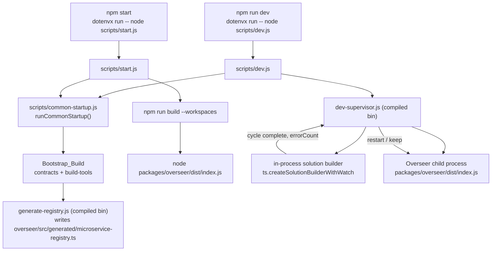
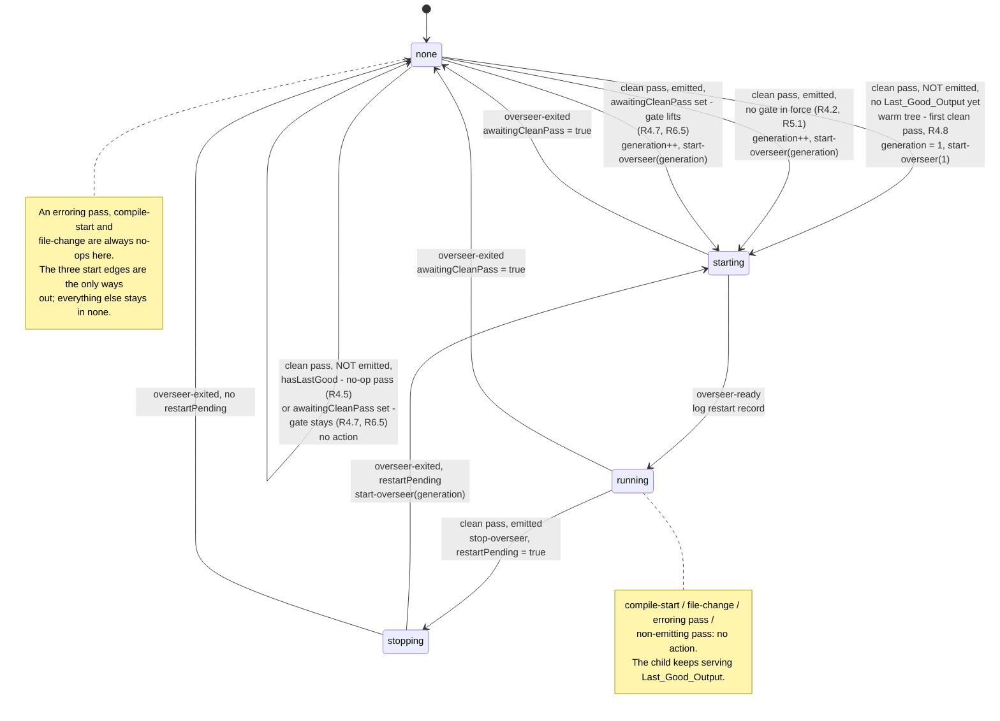

# Design Document

## Overview

The Dev_Server is a watch-mode variant of the existing `npm start` path, not a second execution
model. It runs the same compiled artifacts a Container image runs — each package's `dist/` — through
the same `packages/overseer/dist/index.js` entrypoint (R9.1), so dev-versus-production parity holds
by construction rather than by test battery.

Type safety is inherent to that choice rather than a mechanism bolted on top. `tsc` is the compiler,
so a type error fails the emit for the offending package: nothing new is written, the previous good
output stays on disk, and the running Overseer keeps serving it (R6.2, R6.3, R6.6). Code that does
not typecheck can never become running output, which is why no dev-only type-check script exists
(R9.6).

The design's central problem is the two-watcher race described in Requirement 5. A file watcher on
`dist/` can fire while the compiler is mid-emit, restarting the Overseer against a partially written
tree. This design removes the race instead of tuning around it: one supervising process owns both
sides — it drives the TypeScript solution builder in-process and owns the Overseer child process —
so the fact "a compile cycle finished with N errors" and the decision "restart now" happen inside
the same process, in order, with no observation of the filesystem involved (R5.6). Whether a pass
emitted governs restart decisions only, never whether the session starts a server at all, so a
session begun on an already-built tree still ends up with a running Overseer (R4.8, R5.1).

The change manifest is small but not as small as "three files and one edit". New: `scripts/common-startup.js`,
`scripts/dev.js`, and `packages/build-tools/src/dev-supervisor.ts` together with its bin entry
`packages/build-tools/src/bin/dev-supervisor.ts`. Changed: `scripts/start.js` (its only edit is to consume
Common_Startup — R9.9, R11.5), the root `package.json` (the Dev_Command script, and nothing else — R9.6),
`README.md` (R10.1–R10.4, R10.8–R10.10), and `.kiro/steering/tech.md` (R10.5). Plus the new test files listed in
Testing Strategy. No new dependency is added (R9.7) and the production runtime's behavior is unchanged.

## Architecture

### Command chain



Both entry points are wrapped in `dotenvx run --` exactly as `npm start` is today, so the local
`.env` supplies Toggles and `PORT` while an inline assignment on the command line still wins
(R1.2, R2.3, R8.3).

`scripts/dev.js` performs Common_Startup and then spawns the compiled supervisor bin
`packages/build-tools/dist/bin/dev-supervisor.js`. `scripts/start.js` performs the same
Common_Startup, then `npm run build --workspaces`, then runs the Overseer once and exits with its
status — its observable behavior is unchanged and its only edit is to consume the shared
implementation (R9.9, R11.5, R11.6).

### Where Common_Startup lives, and why it is uncompiled JavaScript

`scripts/common-startup.js` is plain ESM JavaScript, and that is a constraint rather than a
preference. Common_Startup *performs* the Bootstrap_Build of `packages/contracts` and
`packages/build-tools`; if it lived inside a package that must be compiled before it can run, it
would have to compile itself. Putting it under `scripts/` — the documented home for repo-level
scripts that must run before anything is built — keeps it executable on a clean checkout with no
`dist/` and no build state. A maintainer tempted to move it into `packages/build-tools/` for tidiness
would reintroduce that cycle, so the constraint is recorded here and in the module itself (R11.2).

The supervisor is the opposite case. It is substantial TypeScript, it uses the TypeScript compiler
API, and it needs its own unit and property tests, so per `structure.md` it belongs in
`packages/build-tools/` and ships as a compiled bin. It runs *after* Bootstrap_Build has compiled it
— the same arrangement `scripts/start.js` already relies on when it invokes the compiled
`generate-registry` bin rather than a source module.

### One process owns both sides

The supervisor (`packages/build-tools/src/dev-supervisor.ts`) runs the TypeScript solution builder
in-process via `ts.createSolutionBuilderWithWatch` and spawns the Overseer as its child. TypeScript
5.9.3 is already a root devDependency, so the compiler API is available with no new dependency added
(R9.7).

Compile-cycle boundaries arrive as structured callbacks, not as parsed text. Verified against the installed
`typescript@5.9.3` rather than assumed:

- `ts.createSolutionBuilderWithWatch(host, rootNames, defaultOptions, baseWatchOptions?)` is present and exported,
  as is its host factory `ts.createSolutionBuilderWithWatchHost(system?, createProgram?, reportDiagnostic?,
  reportSolutionBuilderStatus?, reportWatchStatus?)`.
- `WatchStatusReporter` is typed `(diagnostic: Diagnostic, newLine: string, options: CompilerOptions, errorCount?:
  number) => void` — the error count is a typed parameter of the callback, not something recovered from message text.
- The settled-cycle watch-status diagnostics are **TS 6193** (`Found 1 error. Watching for file changes.`) and
  **TS 6194** (`Found {0} errors. Watching for file changes.`). The cycle-start diagnostic is TS 6032 (`File change
  detected. Starting incremental compilation...`).

"A cycle finished, with this many errors" is therefore a typed signal the supervisor consumes directly — the
input to every restart decision (R5.1, R5.8, R6.1).

Because the same process learns that a cycle settled and decides whether to restart, the
restart-gating obligations of Requirement 5 are structural. No debounce window, no sentinel file, and
no watcher on `dist/` appears anywhere in the design; there is nothing to observe, because the
authority on compilation state is a callback in the supervisor's own event loop (R5.3, R5.6).
Alternatives — `node --watch` on the Overseer entrypoint, and a separate `tsc --build --watch`
process whose stdout the supervisor parses — are rejected; Design Decisions records why.

### Project_List derivation

The solution builder is given root projects rather than a single project, and that root list *is* the
Project_List (R3.6): the Overseer, every microservice the resolved Selector selects, and the
transitive shared-package closure of those microservices plus the Overseer, ordered so each
dependency precedes its consumers. It is computed from existing build-tools code —
`resolveSelected(...)` in `packages/build-tools/src/selector.ts` for the Selector, and
`requiredSharedPackages(...)` in `packages/build-tools/src/shared-packages.ts` for the closure — so
the dev path selects microservices by exactly the semantics a Container build uses (R2.1, R2.2), and
a cold tree builds in an order that works (R3.7).

### Dependent recompilation rides on declaration output, not project references

`packages/overseer/tsconfig.json` references only `../contracts`. The microservices are absent from
its `references` array: the generated registry imports them by `@microservices/<identifier>` package
name, and resolution goes through the workspace symlink to each microservice's
`dist/index.d.ts`. That raises the question of whether an edit inside a microservice propagates to
the Overseer at all (R3.3).

It does. Verified directly: changing `microservice1`'s exported `path` from a string to a number
caused the next Overseer build to fail with TS2322, meaning the solution builder treated the
Overseer's inputs as invalidated by the microservice's changed emitted declaration. Propagation
therefore rides on declaration-output tracking rather than the project-reference graph, which is what
makes the flat root-project list above sufficient — no `references` edits, and no new TypeScript
configuration file (R9.3).
## Components and Interfaces

### 1. `scripts/common-startup.js` (new) — the single Common_Startup implementation

Plain ESM JavaScript under `scripts/`, for the bootstrapping reason recorded in Architecture. It is the only
implementation of the Common_Startup steps, and both entry points obtain their startup behavior from it (R11.1).

```js
/**
 * @typedef {object} CommonStartupOptions
 * @property {string} tag            Message prefix owned by the caller: "start" or "dev".
 * @property {string|undefined} [selector]
 *   The MICROSERVICES value. Defaults to `process.env.MICROSERVICES`; passed through
 *   to the Registry_Generator unmodified (R2.2).
 * @property {NodeJS.ProcessEnv} [env]  Defaults to `process.env`.
 */

/**
 * @typedef {{ ok: true, selector: string|undefined, steps: string[] }
 *         | { ok: false, step: string, message: string, status: number, steps: string[] }}
 *   CommonStartupResult
 */

/**
 * Perform the Common_Startup steps in order:
 *   1. Bootstrap_Build — compile @microservices/contracts and @microservices/build-tools only.
 *   2. Registry generation — run the compiled bin
 *      packages/build-tools/dist/bin/generate-registry.js with the inherited env.
 *
 * Never calls process.exit and never writes to a stream: it returns a
 * discriminated result and the ordered list of steps it performed, and the
 * caller owns the process effects. Same split as the Overseer's pure `boot()`
 * versus its `index.ts` shell.
 *
 * @param {CommonStartupOptions} options
 * @returns {CommonStartupResult}
 */
export function runCommonStartup(options) { /* … */ }
```

Environment loading is *not* a step of this function: it happens one level up, because `dotenvx run --` wraps both
npm scripts before Node starts (R1.2, R8.3). `steps` records the step names in the order they ran so the two entry
points' sequences can be compared directly (R11.4).

**This module is the sole owner of the clean-checkout ordering rationale (R11.2).** Three constraints, documented
there and nowhere else — the header comment currently carrying them in `scripts/start.js` moves here verbatim so
there is one copy:

1. The Bootstrap_Build must precede the Registry_Generator invocation, because the generator runs as a *compiled*
   bin that does not exist on a fresh clone if `prepare` did not run or a `dist/` was cleaned.
2. Registry generation must precede the full TypeScript build, so the Overseer compiles against the freshly
   generated registry rather than a stale one — the parity guarantee both entry points depend on.
3. Both rely on the root `workspaces` array being topological. The generated registry statically imports
   `@microservices/<identifier>`, so the microservices must build before the Overseer.

A maintainer moving this file into `packages/build-tools/` would make it compile itself, which is why the constraint
is stated in the module rather than left as folklore.

### 2. `scripts/dev.js` (new) — the Dev_Command entry point

Wired as `"dev": "dotenvx run -- node scripts/dev.js"` in the root `package.json` (R1.1, R1.2). It is a thin shell:

1. `runCommonStartup({ tag: "dev" })`.
2. On failure, write `[dev] <message>` to stderr naming the failed step and `process.exit(status)` — the Overseer is
   never started (R1.4, R1.5).
3. On success, spawn `packages/build-tools/dist/bin/dev-supervisor.js` with `stdio: "inherit"` and the inherited
   environment, and exit with the supervisor's status.
4. Forward `SIGINT` and `SIGTERM` to the supervisor and wait for it to exit, so signal handling has one owner
   (R1.6).

The supervisor is spawned as a compiled bin rather than imported, for the same reason `scripts/start.js` invokes the
compiled `generate-registry` bin: at this point in the sequence the Bootstrap_Build has just produced it, and a
static import from an uncompiled script could not see it on a clean checkout.

### 3. `scripts/start.js` (changed) — Production_Start

The only edit is to consume Common_Startup (R9.9). The two inline `runOrExit` calls that perform the bootstrap
build and the registry generation are replaced by one `runCommonStartup({ tag: "start" })` call plus the existing
failure branch; the ordering comment block moves into `common-startup.js`. Everything after that is untouched:
`npm run build --workspaces`, then `spawnSync` the Overseer, then `process.exit` with the Overseer's status (R11.6).

Message text and streams are preserved exactly, which is why `tag` exists: the failure line stays
`[start] "<command> <args>" failed (<reason>); refusing to start the Overseer` on stderr, with the same exit-status
propagation (R11.5).

`npm start` keeps `npm run build --workspaces` even though the dev path avoids it. That is deliberate: a one-shot
build has no latency budget to defend, and using npm keeps Production_Start's observable behavior identical.

### 4. `packages/build-tools/src/dev-supervisor.ts` (new) — the supervisor

The substantial component, and the one place the two-watcher problem is solved. It is factored into a **pure
decision core** and a **process-effect shell**, mirroring the Overseer's own `boot()` / `index.ts` split. The
factoring is not stylistic: Requirement 5 is verified by a model-based property test over generated event
interleavings, and that is only possible without spawning processes if the decision is a pure function.

#### 4a. Project_List derivation

Reuses existing build-tools code rather than reimplementing selection or closure logic (R2.1):

```ts
import { resolveSelected } from "./selector.js";
import { listMicroserviceDirectories } from "./generate-registry.js";
import {
  discoverSharedPackages,
  requiredSharedPackages,
} from "./shared-packages.js";

/**
 * The Project_List: the root projects handed to the solution builder, in build
 * order — required shared packages (topological), then the selected
 * microservices, then the Overseer (R3.6).
 *
 * Pure over its injected inputs so it is property-testable against in-memory
 * layouts; `devProjectList()` supplies the real-filesystem defaults.
 */
export function projectListFrom(
  selector: string | undefined,
  directories: readonly string[],
  shared: ReadonlyMap<string, SharedPackage>,
  readDependencies: ReadDependencies,
): readonly string[];
```

The order is the same one `image-tree.ts` already builds for a Container, computed by the same two functions, so a
cold dev tree builds in an order that works (R3.7) and the dev path's microservice set is `resolveSelected`'s output
by construction (R2.2). An unmatched identifier surfaces as the existing `[selector:unmatched]` error (R2.4).

The directory listing happens exactly once, here, during startup. Nothing in the steady state re-lists
`packages/microservices/` (R7.1, R7.3).

#### 4b. The pure decision core

```ts
/** Everything the supervisor learns about the world, as a typed event. */
export type DevEvent =
  /** TS 6032: a watched source changed. */
  | { readonly kind: "file-change" }
  /** The builder began a Compile_Pass. */
  | { readonly kind: "compile-start" }
  /**
   * TS 6193 / TS 6194: the Compile_Pass settled.
   * `errorCount` comes from WatchStatusReporter's typed parameter.
   * `emitted` is true when the pass wrote at least one file into the
   * Compiled_Tree, recorded by the host's writeFile hook (see 4c).
   */
  | { readonly kind: "compile-complete"; readonly errorCount: number; readonly emitted: boolean }
  /** The child wrote its existing "[boot] Overseer listening on port N" line. */
  | { readonly kind: "overseer-ready" }
  /** The child process exited, for any reason. */
  | { readonly kind: "overseer-exited"; readonly status: number | null }
  /** SIGINT / SIGTERM reached the supervisor. */
  | { readonly kind: "signal"; readonly signal: "SIGINT" | "SIGTERM" };

/** The lifecycle of the single Overseer child the supervisor may own. */
export type OverseerPhase = "none" | "starting" | "running" | "stopping";

export interface DevState {
  /** The child's lifecycle phase. At most one child exists in any phase. */
  readonly overseer: OverseerPhase;
  /** True between compile-start and its compile-complete. */
  readonly compiling: boolean;
  /**
   * Monotonic counter advanced by a zero-error Compile_Pass that either emitted
   * output or is the first clean pass of the session (the warm-tree case, where
   * a complete Compiled_Tree is already on disk — R4.8). It identifies a
   * Last_Good_Output generation without inspecting the filesystem.
   */
  readonly generation: number;
  /** The generation the live (or starting) child was launched from; null when none. */
  readonly runningGeneration: number | null;
  /** A restart owed once the current child finishes exiting. */
  readonly restartPending: boolean;
  /**
   * Set when the child died on its own or failed to bind. Blocks any new child
   * until the next clean Compile_Pass (R4.7, R6.5).
   */
  readonly awaitingCleanPass: boolean;
  /** True once any clean Compile_Pass has completed in this session. */
  readonly hasLastGood: boolean;
  /** Set by a signal; the shell stops driving after this. */
  readonly terminating: boolean;
}

/** The only effects the shell may perform, named by the decision. */
export type DevAction =
  | { readonly kind: "start-overseer"; readonly generation: number }
  | { readonly kind: "stop-overseer" }
  | { readonly kind: "stop-watcher" }
  | { readonly kind: "log"; readonly stream: "stdout" | "stderr"; readonly message: string };

export const initialDevState: DevState;

/**
 * The restart decision. A total, pure function: no I/O, no timers, no clock, no
 * filesystem. Every Requirement 5 and Requirement 6 gating obligation is a
 * statement about this function's output, which is what makes them testable
 * over generated event interleavings without spawning a process.
 */
export function decide(
  state: DevState,
  event: DevEvent,
): { readonly state: DevState; readonly actions: readonly DevAction[] };

/** Fold an event sequence for the property test; also used by the shell. */
export function reduceDevEvents(
  events: Iterable<DevEvent>,
  state?: DevState,
): { readonly state: DevState; readonly actions: readonly DevAction[] };
```

The rules `decide` encodes, each traceable to a criterion:

| Event | Decision |
| --- | --- |
| `file-change`, `compile-start` | Set `compiling`. Emit no start/stop action, so a running child keeps serving the Last_Good_Output (R5.2, R5.3). |
| `compile-complete` with `errorCount > 0` | Clear `compiling`, log the completion and the error count, emit no start/stop (R5.8, R6.2). When `hasLastGood` is false, additionally log that no Overseer will start (R6.7). |
| `compile-complete`, `errorCount === 0`, `emitted === true`, `awaitingCleanPass` set | Clear `compiling` and `awaitingCleanPass`, advance `generation`, set `hasLastGood`. Phase is `none` here, so ⇒ `start-overseer` at the new `generation`. Lifting the gate requires a *changed* tree, which is what makes recovery from a crash or a failed bind possible without relaunching the output that failed (R4.7, R6.5). |
| `compile-complete`, `errorCount === 0`, `emitted === false`, `awaitingCleanPass` set | Clear `compiling`, log the completion. The gate **stays**: no start, `generation` unadvanced. The output on disk is the same output that just crashed or failed to bind, so relaunching it would only produce a crash loop (R4.7, R6.5). |
| `compile-complete`, `errorCount === 0`, `emitted === true`, no gate in force | Advance `generation`, set `hasLastGood`, clear `awaitingCleanPass`. Then: no child ⇒ `start-overseer`; child `running` ⇒ `stop-overseer` and set `restartPending`; child `starting` or `stopping` ⇒ set `restartPending` only (R4.2, R5.1, R5.6, R6.4). |
| `compile-complete`, `errorCount === 0`, `emitted === false`, no gate in force, `hasLastGood === false` | The warm-tree initial start. A zero-error pass that emitted nothing means every output was already up to date, so the Compiled_Tree is complete and consistent. Advance `generation` (to 1), set `hasLastGood`, and `start-overseer` at that generation. Phase is `none`, because no clean pass has yet started a child (R4.8, R5.1). |
| `compile-complete`, `errorCount === 0`, `emitted === false`, no gate in force, `hasLastGood === true` | Clear `compiling`, log the completion, emit no start/stop, `generation` unadvanced — a no-op pass leaves the running child in place and a settled session converges to the same process (R4.5, R5.6). |
| `overseer-ready` | `starting` → `running`, log the restart record (R4.6). |
| `overseer-exited` while `stopping` | `stopping` → `none`; if `restartPending`, `start-overseer` at the current `generation` and clear the flag (R5.7). |
| `overseer-exited` while `starting` | The child died before binding: log to stderr, set `awaitingCleanPass`, clear `restartPending`, emit no replacement (R4.7). |
| `overseer-exited` while `running` | A spontaneous exit: log to stderr, set `awaitingCleanPass`, emit no replacement (R6.5). |
| `signal` | Set `terminating`, emit `stop-overseer` (if any child) then `stop-watcher` (R1.6). |
| any event while `terminating` | Emit nothing further. |

Two invariants fall out of the phase machine rather than being checked separately: a `start-overseer` is only ever
emitted from phase `none`, so two children can never be alive at once (R5.7); and `start-overseer` always carries
the current `generation`, which only a zero-error pass advances — either because it emitted, or because it is the
session's first clean pass over an already complete tree — so the executed output is always a Last_Good_Output
(R6.6, R4.8). The warm-tree rule does not weaken that invariant's substance: a start still carries a generation ≥ 1
identifying a complete, error-free Compiled_Tree. What changed is only that "complete and error-free" no longer
implies "written by this pass". Nothing in the function observes the Compiled_Tree, so an Overseer_Restart of a
running child cannot be derived from any other signal (R5.6).

A burst of edits during a pass coalesces without a debounce timer: the intervening `file-change` and
`compile-start` events emit nothing, and the burst's final `compile-complete` produces exactly one restart (R5.4).



#### 4c. The process-effect shell

The shell owns everything impure and contains no branching policy of its own — it translates callbacks into
`DevEvent`s, feeds `decide`, and performs the returned actions in order.

- **Builder wiring.** `ts.createSolutionBuilderWithWatchHost(sys, undefined, reportDiagnostic, reportBuilderStatus,
  reportWatchStatus)`, then `ts.createSolutionBuilderWithWatch(host, projectList, { incremental: true }, {})` and
  `.build()`. `reportWatchStatus` maps TS 6032 → `compile-start` and TS 6193 / TS 6194 → `compile-complete` with the
  callback's `errorCount`. `reportDiagnostic` uses TypeScript's own
  `formatDiagnosticsWithColorAndContext`, which is what makes the diagnostic name the file, line and character
  (R6.1) without the supervisor formatting anything itself. A failure to launch the watcher throws out of
  `runDevSupervisor` unframed; the CLI entry function of 4d is the layer that turns it into
  `[dev] failed to start the build watcher: <reason>` and exits.
- **Emit detection.** The host's `writeFile` is wrapped to record that a write happened during the current cycle;
  the flag is read and reset when the cycle settles, supplying `emitted`. This is bookkeeping about the supervisor's
  *own* writes, not an observation of the filesystem, so it does not reintroduce the race (R4.5, R5.5). What
  `emitted` gates is narrower than it first appears: it decides whether a *running* Overseer is restarted (R5.6) and
  whether a crash gate lifts (R4.7, R6.5), but the session's initial start does not depend on it, so a warm tree
  whose first clean pass writes nothing still yields a running server (R4.8, R5.1).
- **Child management.** `spawn(process.execPath, ["packages/overseer/dist/index.js"], { env, stdio: ["ignore",
  "pipe", "inherit"] })` (R4.1). `env` is the environment resolved at session start, passed through with no
  mutation (R8.1, R8.2). The child's stdout is forwarded verbatim and scanned for the Overseer's existing
  `[boot] Overseer listening on port` line, which becomes `overseer-ready`.
- **Readiness coupling, stated plainly.** That log line is the only non-invasive bind signal available, since
  R9.4 forbids adding a dev-specific branch to `packages/overseer/src/`. The coupling is safe to depend on because
  the line is already exercised by the existing boot tests, and because it fails benignly: if the signal were ever
  missed, an exiting child is handled identically by the `starting` and `running` exit rules, so the worst outcome
  is a missing restart record, never a wrong restart decision.
- **`stop-overseer`** sends `SIGTERM` and waits for `exit`; the `exit` handler is the only source of
  `overseer-exited`, which is what keeps the restart strictly sequential.
- **Signals.** `SIGINT` / `SIGTERM` produce a `signal` event; the shell stops the child, closes the builder's
  watchers, and exits, so neither child outlives the Dev_Command (R1.6).

#### 4d. The bin and its CLI entry function

`packages/build-tools/src/bin/dev-supervisor.ts` is added to the package's `bin` block as `dev-supervisor`, alongside
`generate-registry` and `build-image-tree`, and it is a one-liner exactly as both of those are — a single import and
a single call:

```ts
#!/usr/bin/env node
import { runDevSupervisorCli } from "../dev-supervisor.js";

runDevSupervisorCli();
```

The two sibling bins are one-liners because their functions own their own environment defaulting and their own
failure and exit behavior — `generateRegistry(selector = process.env.MICROSERVICES)`, and `buildImageTree` reads
`process.env.MICROSERVICES` internally. `runDevSupervisorCli`, exported from
`packages/build-tools/src/dev-supervisor.ts`, gives the supervisor the same shape, so the package's bin layer holds
no policy at all and there is one bin shape to learn rather than two. Nothing imports `@microservices/build-tools` by
name, so `structure.md`'s bin-only exception continues to apply and no barrel is added.

`runDevSupervisorCli` therefore owns three things, each of which a bin would otherwise have to hold:

1. **Project_List derivation.** It calls `devProjectList()`, which already defaults
   `selector = process.env.MICROSERVICES` (4a), so no environment reading happens in the bin at all.
2. **Two distinct error-reporting contracts.** Both are observable and pinned by existing integration tests, so both
   are preserved exactly. A **Selector failure** is written to stderr **verbatim**: `devProjectList()` /
   `projectListFrom` already produce prefixed messages — `[selector:unmatched]`, `[shared:unresolved]` — and
   re-wrapping one as a watcher-launch failure would corrupt the contract R2.4 states. A **Build_Watcher launch
   failure** is written as `[dev] failed to start the build watcher: <reason>` (Error Handling, "Common_Startup step
   failure"), with no Overseer child spawned, because the spawn is downstream of a clean compile. Both exit
   non-zero, status 1.
3. **The ordering guarantee.** The Project_List is derived before, and separately from, starting the shell, so a bad
   Selector exits 1 without ever launching a Build_Watcher or an Overseer.

`runDevSupervisor` keeps *throwing* on a watcher-launch failure rather than reporting one, so this function is the
single layer that owns the `[dev]` framing. That framing was previously split across two layers — the shell cleaned
the error and the bin added the prefix — and consolidating it here is the point of the split, not a side effect of
it. The reasoning behind the two contracts travels with them: why a Selector message must reach stderr unmodified,
and why a watcher failure leaves no Overseer behind, are recorded in the CLI function rather than lost with the bin's
inline comments.

This is a purely structural factoring: no observable behavior changes and no requirement changes. R1.4, R1.5, R2.4
and R8.x hold exactly as before, and the integration tests that pin the `[selector:unmatched]` and watcher-failure
paths pass untouched.

## Data Models

### Project_List for a selector

For `MICROSERVICES` unset or `*` on the current tree, where `config → contracts` and `overseer → contracts` hold:

```
packages/contracts
packages/config
packages/microservices/microservice1
packages/microservices/microservice2
packages/microservices/microservice3
packages/overseer
```

For `MICROSERVICES=microservice1`, `config` is not in the closure of the selected set plus the Overseer:

```
packages/contracts
packages/microservices/microservice1
packages/overseer
```

`packages/build-tools` and `packages/integration-tests` never appear: neither is a Project_List member. build-tools
is compiled by the Bootstrap_Build, and integration-tests is not something the Dev_Server runs.

### Event stream to action trace

One edit to a microservice, with a second edit arriving mid-compile, from a cold start:

```
compile-start                                   → (none)
compile-complete errorCount=0 emitted=true      → generation 1, start-overseer(1), log completion
overseer-ready                                  → log "[dev] Overseer restarted"
file-change                                     → (none)
compile-start                                   → (none)
file-change                                     → (none)          ← coalesced, R5.4
compile-complete errorCount=2 emitted=false     → log completion + 2 errors; child untouched (R6.2, R6.3)
compile-start                                   → (none)
compile-complete errorCount=0 emitted=true      → generation 2, stop-overseer, restartPending
overseer-exited status=null (from stopping)     → start-overseer(2)               ← R5.7: strictly sequential
overseer-ready                                  → log "[dev] Overseer restarted"
signal SIGINT                                   → stop-overseer, stop-watcher     ← R1.6
```

Exactly one restart resulted from the whole burst, and no restart was derived from the erroring pass.

The warm-tree start — the regression case the original emit-gated rule got wrong, where a session on an
already-built tree got a Build_Watcher and no server:

```
compile-start                                   → (none)
compile-complete errorCount=0 emitted=false     → generation 1, start-overseer(1), log completion
                                                   ← first clean pass of the session; nothing to emit
                                                     because every output was already up to date (R4.8)
overseer-ready                                  → log "[dev] Overseer restarted"
…later, a touched file with no output change…
compile-start                                   → (none)
compile-complete errorCount=0 emitted=false     → log completion only; child untouched (R4.5)
                                                   ← hasLastGood is now set, so the same event shape is a
                                                     no-op pass rather than an initial start
```

The identical `compile-complete` event produces a start the first time and nothing the second, and the only thing
distinguishing them is `hasLastGood` — which is why the rule is stated over that flag rather than over the event.

## Error Handling

Message prefixes follow the repo's existing convention — a bracketed tag naming the subsystem, as in `[start]`,
`[boot]`, `[selector:unmatched]`, `[shared:unresolved]`.

### Common_Startup step failure (R1.4, R1.5)

`runCommonStartup` returns `{ ok: false, step, message, status }` when the Bootstrap_Build exits non-zero or the
Registry_Generator exits non-zero. `scripts/dev.js` writes one line to **stderr** naming the failed step —
`[dev] "<command> <args>" failed (<reason>); refusing to start the Overseer` — and exits with that status. A failure
to launch the Build_Watcher (the supervisor bin missing, or the compiler API throwing during
`createSolutionBuilderWithWatch`) is reported the same way as `[dev] failed to start the build watcher: <reason>` and
exits non-zero. `runDevSupervisor` throws in that case and `runDevSupervisorCli` (4d) writes the framed line, so this
message has exactly one author. In every case no Overseer child is spawned, because the spawn is downstream of the
check.

### Unmatched Selector identifier (R2.4)

`resolveSelected` throws its existing `[selector:unmatched] MICROSERVICES names unknown identifier(s): "a", "b"` —
deduplicated and sorted — from inside the Registry_Generator, so the Dev_Command surfaces the existing message text
on **stderr** and exits non-zero at the registry-generation step. Nothing new is written for this case, which is the
point: the dev path fails on a bad selector exactly as an image build does. `[selector:empty]` behaves the same way.
The supervisor's own Project_List derivation reaches the same message a second time, by a different route, and relays
it identically: `runDevSupervisorCli` (4d) writes it verbatim rather than re-prefixing it.

### First Compile_Pass reports errors, no Last_Good_Output (R6.7)

`decide` sees `hasLastGood === false` and emits no `start-overseer`. It logs
`[dev] no Overseer started: the first compile pass reported <N> error(s); fix them and the Overseer will start
automatically` to **stdout**, after TypeScript's own diagnostics. The Dev_Session does **not** exit — the
Build_Watcher stays resident, so fixing the error starts the Overseer with no re-invocation (R6.4).

### Compile errors on a later pass (R6.1, R6.2, R6.3, R6.6)

TypeScript's `formatDiagnosticsWithColorAndContext` writes each diagnostic naming the source file with its line and
character position. The supervisor then logs
`[dev:compile] cycle complete: <N> error(s); keeping the running Overseer (last good output)` to **stdout** (R5.8),
emits no start/stop action, and leaves `generation` unadvanced — so the live child is still the one launched from the
last clean generation (R6.6). `tsc` does not emit for a project whose check failed, so the previous output stays on
disk and the child keeps answering from it (R6.3). Exit status: none, the session continues.

### Overseer fails to bind after a restart (R4.7)

The child exits non-zero while phase is `starting`, before `overseer-ready`. The child's own stderr — a
`[boot] failed to bind HTTP server on port <p>` or a batch of toggle/collision messages — is already inherited and
visible. The supervisor adds
`[dev] Overseer exited with status <N> before binding; the build watcher is still running, waiting for the next
clean compile` on **stderr**, sets `awaitingCleanPass`, and starts no replacement. What lifts that gate is the next
Compile_Pass that completes with no errors **and changes the Compiled_Tree**; a clean pass that emits nothing leaves
it in force, because the output on disk is still the output that just failed to bind and relaunching it immediately
would only reproduce the failure. The Dev_Session's exit status is unaffected; it keeps running.

### Overseer exits on its own (R6.5)

Identical handling from phase `running`: `[dev] Overseer exited (status <N>); the build watcher is still running,
waiting for the next clean compile` on **stderr**, watcher retained, and no replacement until a Compile_Pass
completes with no errors **and changes the Compiled_Tree**. A clean pass that changes nothing keeps the gate in
force, since the tree it would relaunch is the one that just exited. Retrying immediately is deliberately excluded —
a crash loop against unchanged output would produce nothing but noise, and the observable recovery trigger is a
source change.

### Termination signal and child cleanup (R1.6)

`SIGINT` / `SIGTERM` reach `scripts/dev.js`, which forwards to the supervisor. The supervisor logs
`[dev] received <signal>; stopping the Overseer and the build watcher` to **stdout**, sends `SIGTERM` to the child,
closes the builder's file watchers, and exits once the child's `exit` fires. `scripts/dev.js` exits with the
supervisor's status. Because the child is the supervisor's direct child and the builder runs in-process, there is no
third process to leak; the property that matters — nothing survives the Dev_Command — is checked by an integration
example rather than argued.

### Production_Start failure behavior unchanged (R11.5, R11.6)

`scripts/start.js` retains its existing shape: any failed step writes
`[start] "<command> <args>" failed (<reason>); refusing to start the Overseer` to stderr and exits with that step's
status; a successful run exits with the Overseer process's own status. No watching, no restart. The `tag` option on
`runCommonStartup` exists precisely so extracting the shared implementation cannot change this text or its stream.

## Correctness Properties

*A property is a characteristic or behavior that should hold true across all valid executions of a system —
essentially, a formal statement about what the system should do. Properties serve as the bridge between
human-readable specifications and machine-verifiable correctness guarantees.*

The numbering matches the eleven properties recorded in `requirements.md`. Each entry below is the invariant itself;
Testing Strategy immediately following states where each is discharged, with what tooling and at what iteration
count, and is not repeated here.

Three of these invariants hold **by construction** in this design rather than being discovered by testing, and that
distinction is the design's main claim. They are marked *by construction* below: the two that fall out of the
`OverseerPhase` machine (Properties 3a and 3b) and the structural parity that follows from one artifact set behind
one entrypoint (Property 8a). Their tests are regression guards against a future refactor breaking the structure,
not searches for an unknown defect.

### Property 1: Project_List membership and topological order

*For any* selector string, microservice directory listing, and shared-package dependency graph,
`projectListFrom(selector, directories, shared, readDependencies)` returns exactly
`requiredShared(selected ∪ {overseer}) ∪ selected ∪ {overseer}` — no `build-tools`, no test-only package — and for
every dependency edge `(a → b)` between two list members, `index(b) < index(a)`; every selected microservice
precedes `packages/overseer`.

```
∀ selector, dirs, graph.
  set(projectListFrom(...)) = closure(resolveSelected(selector, dirs) ∪ {overseer})
∧ ∀ (a → b) ∈ edges, a,b ∈ list. index(b) < index(a)
```

**Validates: Requirements 3.1, 3.6, 3.7**

### Property 2: Selector resolution is the existing behavior

*For any* selector value and discovered directory set, the microservice members of the Project_List equal
`resolveSelected(selector, directories)` — including the unset, blank, and `*` cases — and an identifier absent from
the directory set causes `[selector:unmatched]` naming every offender rather than being silently dropped. The claim
is equality with that existing function, not a restatement of its semantics.

```
∀ selector, dirs. microservices(projectListFrom(selector, dirs, …)) = resolveSelected(selector, dirs)
```

**Validates: Requirements 2.1, 2.2, 2.4**

### Property 3: Restart gating over arbitrary event interleavings

*For all* finite sequences of `DevEvent`s — including physically impossible orderings, since `decide` is total — the
action trace of `reduceDevEvents(events)` satisfies every clause below. This is the conjunction that makes
Requirement 5 verifiable without spawning a process, and it is the reason the decision core is pure.

- **3a (by construction).** At most one Overseer child is alive at any point in the trace, because
  `start-overseer` is emitted only from phase `none`:
  `∀ events. max(liveChildren(reduceDevEvents(events).actions)) ≤ 1`.
- **3b (by construction).** Every `start-overseer` carries the current `generation`, and `generation` advances only
  on a `compile-complete` with `errorCount === 0` that either emitted or is the session's first clean pass;
  therefore the executed output is always a Last_Good_Output — a complete, error-free Compiled_Tree:
  `∀ a ∈ actions. a.kind = "start-overseer" ⇒ a.generation = generationOfLastAdvancingCleanPass ∧ a.generation ≥ 1`.
- **3c.** Every `start-overseer` is preceded by a `compile-complete` with `errorCount === 0` and no intervening
  `compile-complete` that reported errors. Where the start replaces a child that was running — an Overseer_Restart —
  that clean pass additionally had `emitted === true` (R5.6). And where a crash gate was in force, the intervening
  clean pass had `emitted === true`, so unchanged failing output is never relaunched (R4.7, R6.5).
- **3d.** No `start-overseer` and no `stop-overseer` appears between a `compile-start` and its `compile-complete`.
- **3e.** No `DevAction` variant can regenerate the Microservice_Registry or re-list `packages/microservices/` — the
  union has no such member, so this holds at the type level as well as over every trace.
- **3f.** Exactly one completion log action per `compile-complete`, recording its error count, and exactly one
  restart record per `overseer-ready`.
- **3g.** A `signal` event yields `stop-overseer` (when a child exists) then `stop-watcher`, and no action follows
  once `terminating` is set.
- **3h.** An `overseer-exited` the supervisor did not request yields no `start-overseer` before the next clean,
  emitting pass.
- **3i.** A `compile-complete` with `errorCount === 0 ∧ emitted === false` arriving from phase `none` with
  `hasLastGood === false` and no gate in force yields exactly one `start-overseer` — the warm-tree initial start
  (R4.8). The same event from phase `running` yields none (R4.5), and from phase `none` with `awaitingCleanPass` set
  yields none (R4.7, R6.5).

**Validates: Requirements 1.6, 2.6, 4.2, 4.6, 4.7, 4.8, 5.1, 5.2, 5.3, 5.5, 5.6, 5.7, 5.8, 6.2, 6.5, 6.6, 7.1, 7.3**

### Property 4: A no-op Compile_Pass never restarts a running Overseer

*For any* event sequence, a `compile-complete` with `errorCount === 0 ∧ emitted === false` arriving while a child is
`running` produces no `stop-overseer` and no `start-overseer` — a no-op pass leaves the live process in place, so a
settled session converges to a stable process with no debounce timer involved. The claim is about *restarts*, not
about starts: *for any* session whose first clean `compile-complete` has `emitted === false` and every subsequent
clean pass likewise, the trace contains exactly one `start-overseer` — the warm-tree session starts a server and then
leaves it alone. And *for any* burst — a maximal run of events whose only clean emitting `compile-complete` is its
last — at most one `start-overseer` results.

```
∀ events. |{a ∈ actions : a.kind = "start-overseer"}| ≤ |{cleanPasses(events)}|
        ∧ noOpPassWhileRunning(events) ⇒ no start/stop action for that pass
        ∧ warmTreeSession(events) ⇒ |{a : a.kind = "start-overseer"}| = 1
        ∧ restartsPerSettledBurst(events) ≤ 1
```

The bound is over clean passes rather than clean *emitting* passes, because a warm-tree session's single start comes
from a clean pass that emitted nothing.

**Validates: Requirements 4.5, 4.8, 5.4**

### Property 5: Error-then-fix round trip

*For any* type error introduced into a Project_List source file during a running Dev_Session, the session output
names that file with a line and character position, the live Overseer keeps answering from the Last_Good_Output, and
restoring the file causes the Overseer to serve the new output with no developer re-invocation. Behavior does not
vary meaningfully with which error is introduced, so this is stated as an invariant and verified by representative
examples.

**Validates: Requirements 6.1, 6.3, 6.4, 6.7**

### Property 6: Environment pass-through is the existing behavior

*For any* environment resolved at Dev_Session start, the environment passed to every Overseer process — including
each one started by an Overseer_Restart — equals that environment exactly: no Toggle or `PORT` value is added,
removed, or altered, and an inline assignment resolves in preference to the local `.env`. Toggle token parsing and
`loadConfig` port resolution stay the Overseer's sole authority and are already property-tested in their own
packages, so no new universal property is stated for them.

```
∀ restarts r. env(overseerProcess(r)) = env(sessionStart)
```

**Validates: Requirements 2.3, 8.1, 8.2, 8.3, 8.4, 8.5**

### Property 7: Additive-only structural invariants

The committed tree satisfies, at every commit: no Dev_Server branch, flag, or conditional under
`packages/overseer/src/`; no Dev_Server-specific TypeScript configuration, generated artifact, `.gitignore` entry, or
template; no `paths`, `baseUrl`, or module alias anywhere; the root `prepare` script, `Dockerfile.template`,
`scripts/emit-effective-dockerfile.sh`, and the image-tree assembler unchanged; the `ci` script composition
unchanged and no dev type-check script added; no new `dependencies` entry in any manifest; every devDependency
introduced by this feature pinned to an exact version; any change to `scripts/start.js` confined to consuming
Common_Startup; and no `npm run build` invocation, `dist/` watcher, or debounce timer in the supervisor source.
These are deterministic facts about the tree rather than universally quantified statements over inputs.

**Validates: Requirements 3.8, 5.6, 9.2, 9.3, 9.4, 9.5, 9.6, 9.7, 9.8, 9.9**

### Property 8: One execution model, cold start included

- **8a (by construction).** The Dev_Server executes the same artifacts a Container image executes — each
  Project_List package's `dist/` — through the same `packages/overseer/dist/index.js` entrypoint, and the Overseer's
  boot pipeline runs unchanged. There is one artifact set and one entrypoint, so parity is structural: there is no
  second execution model for it to diverge from.
- **8b.** From a tree with no `dist/`, no incremental build state, and no generated registry, the Dev_Command
  reaches a state where the Overseer answers a request and every Project_List package has compiled output.

**Validates: Requirements 1.3, 3.4, 3.7, 4.1, 4.3, 4.4, 9.1**

### Property 9: The registered microservice set is session-scoped

*For any* mutation of `packages/microservices/` during a running Dev_Session — a directory added, removed, or
renamed — the routing table the Overseer serves is unchanged, including across an Overseer_Restart triggered by a
later source edit; a new Dev_Session picks the mutation up. The trace half of this (no `DevAction` can re-list or
regenerate) is Property 3e; this entry is its observable consequence.

**Validates: Requirements 7.1, 7.2, 7.3, 7.4**

### Property 10: Common_Startup yields one registry for both entry points

*For any* selector and microservice directory listing, `generateRegistry` produces byte-identical Microservice_
Registry content across repeated invocations, and its identifier set equals `resolveSelected`'s output; and the
`steps` array `runCommonStartup` returns is equal for both entry points, so the two paths agree up to the
watch-or-not divergence.

```
∀ selector, dirs. generateRegistry(selector, dirs) = generateRegistry(selector, dirs)
∧ runCommonStartup({tag:"start"}).steps = runCommonStartup({tag:"dev"}).steps
```

This design **deliberately narrows** the single property-based classification `requirements.md` gave Property 10,
splitting it into a determinism property, a single-sourcing static check, and a step-sequence example. Both entry
points delegate to the same `runCommonStartup`, so content equality decomposes into claims that are each cheaper and
sharper than spawning two processes a hundred times; the justification is recorded in Testing Strategy,
"Properties 10 and 11", and is not restated here.

**Validates: Requirements 11.3, 11.4**

### Property 11: Common_Startup is single-sourced and Production_Start is unchanged

Exactly one module exports `runCommonStartup`; both `scripts/start.js` and `scripts/dev.js` import it; neither
contains a bootstrap-build or registry-generation invocation of its own; and the clean-checkout ordering constraints
are documented in `scripts/common-startup.js` and in no other entry point. Production_Start, run on a pristine tree,
retains its existing step order, its messages on their existing streams, its exit-status propagation for a failed
step and for the Overseer process, and terminates without watching for changes or performing an Overseer_Restart.

**Validates: Requirements 11.1, 11.2, 11.5, 11.6**

Requirement 10's documentation criteria (10.1–10.10) assert the presence of prose in `README.md` and
`.kiro/steering/tech.md`. No property is stated for them; they are verified by review, as noted at the end of
Testing Strategy.

## Testing Strategy

Property tests use **fast-check** (already a root devDependency), run a **minimum of 100 iterations** each, and
carry a tag comment referencing the design property. Tag format:
`Feature: api-dev-server, Property {number}: {property_text}`. Property tests over build-tools code live beside it
in `packages/build-tools/tests/` with `.property.test.ts` naming; cross-package and process-level tests live in
`packages/integration-tests/`.

The 11 properties recorded in `requirements.md` map to tests as follows.

| # | Test | Location | Kind |
| --- | --- | --- | --- |
| 1 | Project_List membership and topological order | `packages/build-tools/tests/dev-project-list.property.test.ts` | fast-check |
| 2 | Selector equality with `resolveSelected` | same file | fast-check |
| 3 | Restart gating over generated interleavings | `packages/build-tools/tests/dev-restart-decision.property.test.ts` | fast-check, model-based |
| 4 | No-op pass is restart-idempotent | same file | fast-check |
| 5 | Error-then-fix round trip | `packages/integration-tests/tests/dev-error-recovery.test.ts` | integration, 2 examples |
| 6 | Environment pass-through | `packages/integration-tests/tests/dev-environment-passthrough.test.ts` | integration, 1 example |
| 7 | Additive-only structural assertions | `packages/integration-tests/tests/dev-additive-only.test.ts` | static checks |
| 8 | Cold start end to end | `packages/integration-tests/tests/dev-cold-start.test.ts` | integration, 1 example |
| 9 | Session-scoped registration | `packages/integration-tests/tests/dev-session-scope.test.ts` | integration, 1 example |
| 10 | One registry for both entry points | `packages/build-tools/tests/dev-common-startup.property.test.ts` + `packages/integration-tests/tests/dev-start-parity.test.ts` | fast-check + static + 1 example |
| 11 | Common_Startup single-sourced, Production_Start unchanged | `packages/integration-tests/tests/dev-start-parity.test.ts` | static checks + 1 example |

### Properties 1 and 2 — Project_List (fast-check)

Unit under test: `projectListFrom`. Generate synthetic workspace layouts — a shared-package DAG, a set of
microservice directories with `@microservices` dependency subsets, and an arbitrary selector string — reusing the
in-memory graph generator style already established in
`packages/build-tools/tests/shared-packages.order.property.test.ts`. Assert:

- membership equals `{shared closure of selected ∪ overseer} ∪ selected ∪ {overseer}`, with no build-tools or
  test-only package present (R3.6, R3.1);
- every dependency edge between two list members places the dependency first, every selected microservice precedes
  `packages/overseer`, and every shared package precedes its consumers (R3.6, R3.7);
- the microservice members equal `resolveSelected(selector, directories)` for every generated selector, including
  unset, blank, `*`, whitespace-padded and duplicated entries (R2.2);
- an unmatched identifier throws `[selector:unmatched]` naming every offender rather than being silently dropped
  (R2.4).

### Properties 3 and 4 — restart gating (fast-check, model-based)

Unit under test: **`decide`** and **`reduceDevEvents`** from `packages/build-tools/src/dev-supervisor.ts`. This is
the design's central obligation and the reason the decision core is pure — the test spawns nothing.

Generate arbitrary sequences of `DevEvent`s. The generator is deliberately permissive, including physically
impossible orderings (a `compile-complete` with no preceding `compile-start`, an `overseer-exited` with no child), so
the function's totality is exercised. Fold each sequence and assert, over the resulting action trace:

- a live-process counter driven by `start-overseer` / `overseer-exited` never exceeds 1 — the interleaving that would
  otherwise put two processes on the same port (R5.7);
- every `start-overseer` is immediately preceded in the state history by a `compile-complete` with
  `errorCount === 0`, and carries that pass's `generation`, which is ≥ 1; where the start replaced a `running`
  child, or lifted a crash gate, that pass additionally had `emitted === true` (R4.7, R5.1, R5.5, R5.6, R6.5, R6.6);
- a clean `compile-complete` with `emitted === false` from phase `none` with `hasLastGood === false` and no gate in
  force produces exactly one `start-overseer` — the warm-tree initial start, which is the regression this amendment
  guards (R4.8); the same event from phase `running` produces nothing (R4.5), and with `awaitingCleanPass` set
  produces nothing (R4.7, R6.5);
- no `start-overseer` or `stop-overseer` appears between a `compile-start` and its `compile-complete` (R5.2, R5.3);
- for any burst — a maximal run of events containing no clean emitting `compile-complete` except its last — at most
  one `start-overseer` results (R5.4);
- no `start-overseer` follows a `compile-complete` with `errorCount > 0` without an intervening clean pass
  (R6.2, R6.4);
- an `overseer-exited` that the supervisor did not request never produces a `start-overseer` before the next clean
  pass (R4.7, R6.5);
- exactly one completion log action per `compile-complete`, recording its error count (R5.8), and exactly one
  restart record per `overseer-ready` (R4.6);
- no action of any kind implies regenerating the registry or re-listing `packages/microservices/`; the action union
  simply has no such member, which is asserted as a type-level and trace-level fact (R2.6, R7.1, R7.3).

Property 4 is a separate `describe` in the same file: a clean non-emitting `compile-complete` arriving while a child
is `running` produces no start and no stop (R4.5, R5.6), and for any session whose first clean pass and every
subsequent clean pass have `emitted === false` — the warm-tree shape — the trace contains exactly one
`start-overseer` (R4.8, R5.4). The generated sequences must include the warm-tree prefix explicitly rather than
relying on it turning up by chance, since it is the shape the original rule table got wrong.

### Property 5 — error-then-fix round trip (integration, 2 examples)

Example one: start a Dev_Session, wait for the Overseer to answer, introduce a type error into a microservice
source, assert a diagnostic naming the file with a `(line,character)` position appears in the session output and
that the endpoint still answers from the previous output; restore the file and assert the endpoint serves the new
behavior with no manual restart. Example two: start a session whose *first* Compile_Pass errors, assert no Overseer
binds and the session stays alive, then fix and assert it starts. Behavior does not vary with the specific input, so
two examples beat 100 iterations (R6.1, R6.3, R6.4, R6.7).

### Property 6 — environment pass-through (integration, 1 example)

One session started with a `.env`-supplied Toggle and inline `PORT` and `MICROSERVICES` assignments. Assert the
inline values win over `.env` (R2.3, R8.3), the disabled microservice's path 404s while the enabled one answers, and
the port is the inline one (R8.1, R8.4). A second, cheap assertion runs the Overseer with an invalid Toggle token
and confirms the existing non-zero exit reporting every offender (R8.5). Toggle token parsing and `loadConfig` port
resolution are already property-tested in their own packages and are not restated here.

### Property 7 — additive-only structural assertions (static checks)

Deterministic facts about the committed tree, so example tests: no `Dev`/`dev` branch, flag or conditional in
`packages/overseer/src/` (R9.4); no dev-specific tsconfig, generated artifact, `.gitignore` entry or template
(R9.3); no `paths`/`baseUrl` or alias configuration anywhere (R9.2); the root `prepare` script, `Dockerfile.template`,
`scripts/emit-effective-dockerfile.sh` and `packages/build-tools/src/image-tree.ts` unchanged (R9.5); the `ci`
script string unchanged and no dev typecheck script added (R9.6); no new `dependencies` entry in any package
manifest (R9.7); every `devDependencies` entry introduced by this feature pinned to an exact version (R9.8); and the
supervisor source containing no `npm run build` invocation (R3.8) and no watcher on any `dist/` path or debounce
timer (R5.6).

### Property 8 — cold start (integration, 1 example)

From a tree with no `dist/`, no `*.tsbuildinfo` and no generated registry, run the Dev_Command and assert the
Overseer answers a request, that the process was launched from `packages/overseer/dist/index.js`, and that every
Project_List package has compiled output (R1.3, R3.4, R3.7, R4.1, R4.3, R4.4, R9.1).

### Property 9 — session-scoped registration (integration, 1 example)

With a session running, create a new directory under `packages/microservices/`, then touch an existing source file
to force a Compile_Pass and an Overseer_Restart. Assert the routing table is unchanged across the restart, then
restart the session and assert the new microservice is registered (R7.1, R7.2, R7.4).

### Properties 10 and 11 — one registry, one Common_Startup (fast-check + static + 1 example)

Property 10 is split, and the split is a deliberate narrowing of the classification in `requirements.md`. Both entry
points call the same `runCommonStartup`, so registry-content equality decomposes into two claims, each cheaper and
sharper than spawning two processes 100 times:

1. **Determinism (fast-check, `dev-common-startup.property.test.ts`).** For any selector and any microservice
   directory listing, `generateRegistry` produces byte-identical content across repeated invocations, and its
   identifier set equals `resolveSelected`'s output. 100+ iterations, no process spawned (R11.3).
2. **Single-sourcing (static, `dev-start-parity.test.ts`).** Exactly one module exports `runCommonStartup`; both
   `scripts/start.js` and `scripts/dev.js` import it; neither contains a bootstrap-build or
   registry-generation invocation of its own; and the clean-checkout ordering constraints are documented in
   `scripts/common-startup.js` and in no other entry point (R11.1, R11.2).
3. **Step-sequence agreement (1 example).** Run both entry points for the same selector with the Overseer step
   stubbed, and assert the `steps` arrays returned by `runCommonStartup` are equal — the paths agree up to the
   watch-or-not divergence (R11.4).

Property 11's execution half runs Production_Start on a pristine tree and asserts its step order, its messages on
their existing streams, its exit-status propagation for a failed step and for the Overseer, and that it terminates
without watching or restarting (R11.5, R11.6).

### Test-harness notes

The process-level tests need two pieces of scaffolding, added to the existing
`packages/integration-tests/tests/helpers.ts`: a `startDevSession()` helper that spawns the Dev_Command, captures
both streams, exposes a deadline-bounded `waitForOutput(pattern)`, and guarantees teardown in an `afterEach`; and a
`pristineWorktree()` helper that materializes a clean tree with `git archive HEAD` into a temp directory plus
`npm ci` there. Only Property 8 and Property 11's execution half need the pristine tree, and it costs tens of
seconds, so those two are the slow tail of `npm test`; they skip with a clear message when `git` is unavailable
rather than failing. The remaining session tests run against the working tree and restore any source file they
mutate, which is safe because `dist/` and the generated registry are gitignored (they are *expected* to churn during
a Dev_Session).

### Review-verified rather than automated

Requirement 10's criteria (R10.1–R10.10) assert the presence of prose in `README.md` and
`.kiro/steering/tech.md`. A keyword grep would pass on text that says nothing useful, so these are verified by
review of the two documents, following the same call the `shared-packages` design made for its documentation
criteria. R11.2's "documents the ordering constraints" is checked structurally (the rationale lives in
`common-startup.js` and nowhere else) but its adequacy is likewise a review matter.

## Design Decisions

### One supervisor owning both sides

**Chosen:** a single process that drives the compiler in-process and owns the Overseer child, so "a cycle settled
with N errors" and "restart now" are the same process's ordered facts.

**Rejected — `node --watch` on `packages/overseer/dist/index.js`.** `node --watch` watches the *filesystem*. A
multi-package Compile_Pass writes many files over tens of milliseconds, so the watcher fires on the first write and
restarts the Overseer against a `dist/` that is mid-emit and internally inconsistent — the exact race Requirement 5
exists to eliminate. Every mitigation is a guess: a debounce window is a bet on emit duration, and a sentinel file
is a second thing to keep consistent. Requirement 5.6 rules out deriving a restart from any observation of the
Compiled_Tree, and this alternative can do nothing else.

**Rejected — a separate `tsc --build --watch` child whose stdout the supervisor parses.** This gets cycle
boundaries from the right authority but through the wrong channel. The signal would be a localized, format-unstable
message string, and the typed `errorCount` parameter of `WatchStatusReporter` — which the in-process host hands over
directly — is lost to a regex over `Found N errors`. It also adds a third process to supervise and terminate. The
in-process API gives the same information as data.

### In-process solution builder API versus spawning `tsc --build --watch`

Beyond the signal quality above, the resident in-process builder is what makes per-edit latency reasonable. Measured
on this repo: a single-package incremental recompile from a **cold** `tsc` process costs roughly **0.6–0.7 s**, and
that figure is dominated by process startup, `tsconfig` parsing and `lib.d.ts` loading rather than by checking the
changed file. A resident builder pays those costs once per session. The per-edit latency under
`--build --watch` was not measured, so this design states no watch-mode latency figure — only that the fixed costs
are paid at startup instead of per edit.

The same reasoning is why the dev path drives the build directly rather than through npm (R3.8):
`npm run build --workspaces` costs about **7 s on this repo even when every package is already up to date**, almost
entirely npm spawning eight workspace processes. `scripts/start.js` keeps using it, because a one-shot command has
no per-edit budget to defend and preserving Production_Start's observable behavior is worth more than 7 s.

### `npm start` kept as the one-shot command, Dev_Command added alongside

**Chosen:** two scripts. `npm start` runs once and exits with the Overseer's status; `npm run dev` watches until
interrupted.

The npm ecosystem convention is exactly this split — `start` runs the thing, `dev` watches it — so the naming
carries the semantics with no explanation needed. Making `npm start` watch would break its current contract in a
way that matters: it would never exit, so its exit status would stop meaning "the Overseer's exit status", and any
scripted or automated invocation would hang. A supervisor-free one-shot path also has standing diagnostic value: when
something misbehaves, running `npm start` isolates whether the fault is in the application or in watch
coordination, which is not a distinction a single watching command can make.

The choice was free rather than constrained, and that was verified rather than assumed: `npm start` has **zero
non-human consumers** in this repository. A Container image runs the Overseer directly —
`CMD ["node", "packages/overseer/dist/index.js"]` in `Dockerfile.template` — never through npm. `ci.yml` runs only
`npm ci` followed by `npm run ci`. `release.yml` builds images and needs no Node setup at all. So changing `npm
start`'s semantics would have broken nothing mechanical; it is kept one-shot on the merits above, not because
something depends on it.

### Common_Startup as uncompiled JavaScript under `scripts/`

Decided and explained in Architecture, "Where Common_Startup lives, and why it is uncompiled JavaScript": a module
that performs the Bootstrap_Build cannot itself require compilation. Recorded here only so the decision is findable
from this section; the reasoning is not repeated.

### The rejected source-execution alternative

`tsx watch` over `packages/overseer/src/index.ts`, plus a generated dev-time mapping of `@microservices/*` to each
package's `src/`, was considered and rejected. The four reasons from `requirements.md` stand:

1. It needs a new generated artifact, a committed template for it, a `.gitignore` entry, and a dev-only TypeScript
   configuration — four moving parts production never uses.
2. It executes code that has not been type-checked: a transpile-only runner strips types and runs anyway, turning a
   type error into a runtime surprise instead of a failed emit.
3. The editor and the type checker keep reading `dist/`'s stale `.d.ts` files while the server runs newer `src/`, so
   three views of the code can disagree.
4. It is a genuinely second execution model, so dev-versus-production parity becomes something to prove with a test
   battery rather than something that holds by construction.

**A fifth reason, newly verified, is recorded because the alternative was re-proposed on the mistaken belief that it
avoided full restarts: `tsx watch` is also a full process restart, not hot module replacement.** tsx's own
watch-mode documentation describes watch mode as re-running the script when a dependency changes; there is no module
swapping and no preserved process state. So the alternative does not buy a faster restart mechanism — it buys the
*same* restart, minus the type check, plus a resolution map. That trade is strictly worse, and this note exists so
the point is not re-litigated on latency grounds. Source: the watch-mode section of the
[tsx documentation](https://tsx.is) (content was rephrased for compliance with licensing restrictions).

## Scalability and the Escape Hatch

### Measured startup decomposition

Restart latency is worth decomposing rather than guessing at, because the answer determines whether this design
scales as microservices are added. Measured on this repo:

| Measurement | Time |
| --- | --- |
| `node -e ""` baseline | ~100 ms |
| plus importing Express | ~170 ms |
| plus the Overseer's own module graph (`dist/boot.js` + the generated registry) | ~172 ms |
| real process-ready time (spawn to bound socket) | ~200 ms |

The scaffold's own code contributes approximately nothing over Express: ~2 ms of the ~172 ms. An earlier **~470 ms**
figure circulated for this measurement; it included measurement-harness overhead — a shell fork per sample plus a
`curl` poll loop with 5 ms granularity — and **should not be quoted as the restart cost**. The number to use is
~200 ms.

### What does not grow

Restart latency is therefore dominated by fixed Node and Express initialization, which does not grow meaningfully as
microservices are added: each additional microservice adds a router module to the graph, not a second framework
initialization. Backend initialization is the dominant cost in *any* restart-based dev loop, and it is identical for
the rejected `tsx watch` alternative — which, per the decision above, also performs a full process restart. It is
therefore not a differentiator between the two designs, and no amount of tuning on this axis would have favored the
alternative.

### What does grow

Type checking sits on the restart path in this design, and type-check time grows with code size. Two things bound
it:

- the solution builder is **resident**, so a recheck runs against a warm program and does not repay the ~0.6–0.7 s
  cold-`tsc` fixed cost measured above;
- only the changed package plus dependents whose build inputs that pass actually changed are rechecked, which this
  architecture keeps small by construction — the scaffold's whole premise is independent microservice packages that
  do not import each other.

The genuine worst case is an edit to a widely consumed shared package such as `contracts`: the declaration output
changes, so the recheck fans out to every consumer in the Project_List. That fan-out is inherent to the dependency
graph, not to this design, and it is the one edit shape whose latency should be expected to grow with the number of
microservices.

### The escape hatch, and why this design can take it

The complexity of the rejected alternative came from executing **source**. This design executes **compiled output
from `dist/`**, and that choice is what keeps the emit mechanism swappable.

If type-check latency ever becomes the bottleneck, replace the emit step *inside the supervisor* with esbuild or swc
and run `tsc --noEmit --watch` in parallel for type feedback. Everything else is unchanged: still emitting to
`dist/`, still executing `packages/overseer/dist/index.js`, same supervisor, same `decide` function, same restart
gating, same Project_List. No resolution map is ever needed, because nothing ever resolves to `src/`. The change is
confined to the shell's emit wiring and the source of the `compile-complete` event.

The rejected alternative cannot reach that endpoint without keeping its resolution map permanently, because its map
is what makes `src/` executable in the first place. This design is therefore a superset of the escape route rather
than a dead end — the fast-emit configuration is a strict subset of what is being built here.

### Trigger

The escape hatch is a pre-analysed decision point, not something to rediscover under pressure. Take it when
**measured recheck latency on a common edit — a single microservice router change — exceeds the ~200 ms restart cost
by a wide margin**, say by a factor of five or more, in a resident-builder session. Below that, type checking is not
the dominant term and swapping the emitter would trade a real guarantee (nothing untyped ever runs) for latency the
developer cannot feel.
