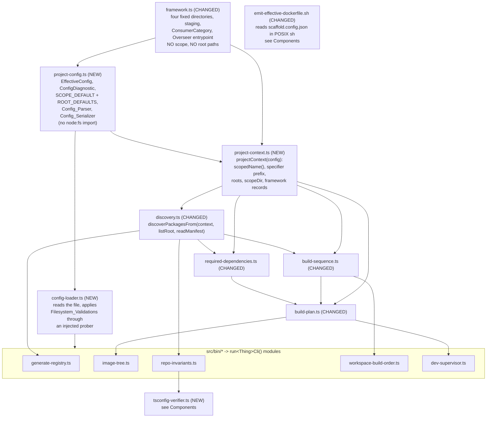

# Design Document

## Overview

Three values are baked into the Build_System's sources as literals: the npm scope (`WORKSPACE_SCOPE = "@microservices"` in `packages/build-tools/src/framework.ts`), the three discovery roots (`NAMESPACE_CONTAINER`, same module, repeated as shell literals in `scripts/emit-effective-dockerfile.sh`), and — by omission rather than by declaration — the four TypeScript settings the build depends on, which nothing states and nothing verifies.

This design turns the first two into one declared, validated, once-per-run value and adds the verification the third needs. It is a de-hard-coding refactor plus one new check. **Every default reproduces the present state exactly**, and a project with no config file at all is valid, so this repository builds and gates identically to the Pre_Change_Baseline (Requirement 15).

Four structural moves carry the change:

1. **One declaration site.** A new `packages/build-tools/src/project-config.ts` declares the `EffectiveConfig` type, the Scope_Default, the three Root_Defaults, the Config_Parser, and the Config_Serializer. It is the only module in `packages/build-tools/src/` where the string `@microservices` or any root path appears (Requirements 1.8, 12.4). `framework.ts` loses both of its offending exports and keeps only what is genuinely scope-free.
2. **One threaded value.** `packages/build-tools/src/config-loader.ts` reads the file once per run and produces either an `EffectiveConfig` or a non-empty list of Config_Diagnostics. A pure derivation, `projectContext(config)`, turns that single value into the small set of derived strings every component actually wants — the scoped-name composer, the dependency-specifier prefix, the per-category root, the scoped `node_modules` directory, the four Framework_Singleton records with their composed names. That context is what gets threaded (Requirement 1.9); it contains exactly one `EffectiveConfig`, so two components of one run cannot disagree.
3. **Root injection into discovery.** `discoverPackagesFrom` today takes `(listContainer, readManifest)` and reads its root paths from the `NAMESPACE_CONTAINER` literal inside `candidatesOf`. It gains the context as its first parameter and reads every root from it; the injected lister is called with a path it is handed rather than a path it derives, so it never learns a category name. This is new work, not a re-parameterisation of something already parameterised.
4. **A type-enforced ordering between the pure core and the effect shell.** Parser validations run strictly before any Filesystem_Validation (Requirements 2.14, 5.6), and that ordering is enforced by the signatures: the filesystem prober is a parameter of exactly one function, and that function's first parameter is a branded value only the parser's success branch can produce. There is no code path that probes a root the parser rejected, and no convention to remember.

## Architecture

### Where the configuration layer sits



The shape to notice: `project-config.ts` is a leaf that imports only `framework.ts`, and `config-loader.ts` is the only module in the layer that touches the filesystem. Nothing below the context re-reads the config file, and nothing below it holds a scope or root literal.

### What the components stop doing

| Component | Today | After |
| --- | --- | --- |
| `discovery.ts` | `candidatesOf` reads `NAMESPACE_CONTAINER[category]`; name mirroring and dependency filtering use `WORKSPACE_SCOPE` | takes the context; roots and scope come from it (Requirements 6.1, 6.6, 6.7) |
| `repo-invariants.ts` | peer/Overseer/SPA rules compare against `OVERSEER.name`, itself composed from `WORKSPACE_SCOPE` | compares against `context.framework.overseer.name` and context-composed names (Requirement 7.1) |
| `generate-registry.ts` | emits `"@microservices/${id}"` and `"@microservices/contracts"` as literals inside the generated source | composes every emitted specifier from `context.scopedName(...)` (Requirements 8.1–8.3) |
| `build-plan.ts` | `SCOPE_DIR = node_modules/${WORKSPACE_SCOPE}` | `context.scopeDir` |
| `build-sequence.ts`, `required-dependencies.ts` | microservice directories from `NAMESPACE_CONTAINER.microservice`; specifier prefix from `WORKSPACE_SCOPE`; cycle messages name the scope | both from the context (Requirement 10.7, 10.8) |
| `emit-effective-dockerfile.sh` | three root paths and a four-name Exclusion_List as shell literals | reads the config file itself, derives the Exclusion_List from the roots (Requirements 11.1, 11.5) |

Provenance: this design implements decision D5 of `.kiro/steering/platform-split.md` in full, together with the verification half of D10 and the per-package placement rule of D11. Those citations record where the decisions came from; every decision below is stated here in its own terms and reads correctly with that document unloaded.

## Data Models

Every type below is declared in a fenced block in the subsection that owns it; this table is an index, not a second declaration.

| Type | Module | Models |
| --- | --- | --- |
| `EffectiveConfig` | `project-config.ts` | the validated scope and three roots one run operates on |
| `SCOPE_DEFAULT`, `ROOT_DEFAULTS` | `project-config.ts` | the four defaults, declared exactly once (R1.8) |
| `PROJECT_CONFIG_FILE` | `project-config.ts` | the one path the config is read from (R1.1) |
| `ConfigTag` | `project-config.ts` | the twelve diagnostic tags |
| `ConfigDiagnostic` | `project-config.ts` | one reported problem, in four non-empty parts (R2.13) |
| `Diagnostics` | `project-config.ts` | a diagnostic list whose non-emptiness is in the type (R2.1) |
| `ParsedConfig` | `project-config.ts` | a config that passed every parser validation; branded |
| `ParseOutcome` | `project-config.ts` | parser success or rejection |
| `ConfigFileRead` | `config-loader.ts` | absent, text, or unreadable (R2.11) |
| `RootProbe` | `config-loader.ts` | one Discovery_Root's filesystem state |
| `ProbeRoot` | `config-loader.ts` | the injected filesystem prober (R5.8) |
| `LoadOutcome` | `config-loader.ts` | a loaded Effective_Config or a rejection |
| `RootEntry` | `discovery.ts` | one direct entry of a Discovery_Root (R6.2) |
| `ListRoot` | `discovery.ts` | the injected directory lister (R6.11) |
| `ReadManifest` | `discovery.ts` | the injected manifest reader (R6.11) |
| `ProjectContext` | `project-context.ts` | the threaded per-run derivation of one Effective_Config (R1.9) |
| `FrameworkDirectory` | `framework.ts` | a Framework_Singleton's scope-free directory facts |
| `FrameworkSingleton` | `project-context.ts` | a Framework_Directory plus its scope-composed name (R3.7) |
| `LoadBearingSetting` | `tsconfig-verifier.ts` | the four verified TypeScript settings (R9.1) |
| `ResolvedTsconfig` | `tsconfig-verifier.ts` | one package's resolved settings, `extends` applied (R9.3) |
| `TsconfigResolution` | `tsconfig-verifier.ts` | resolved, absent, or failed (R9.7, R9.15) |
| `ResolveTsconfig` | `tsconfig-verifier.ts` | the injected resolution mechanism (R14.8, R14.13) |
| `TsconfigViolation` | `tsconfig-verifier.ts` | one reported Load_Bearing_Setting violation (R9.5) |
| `ReadTemplate` | `scope-checks.ts` | the injected Registry_Template reader (R8.10) |

## Components and Interfaces

The subsections below give each module the feature adds or changes, with its signatures. Ordering runs outward from the leaf that declares the defaults to the checks that consume them.

### The single declaration site

#### The decision: a new module, not `framework.ts`

`framework.ts` does not become the declaration site. It stops declaring both offending values.

The reason is that `framework.ts` cannot hold the scope any more even if we wanted it to. Its four `FrameworkSingleton` records are module-level constants whose `name` is composed at module evaluation time:

```ts
// today
function singleton(dirName: string, staging: FrameworkStaging): FrameworkSingleton {
  return { name: `${WORKSPACE_SCOPE}/${dirName}`, dirName, packageDir: `${PACKAGES_DIR}/${dirName}`, staging };
}
export const CONTRACTS: FrameworkSingleton = singleton("contracts", "scoped-node-modules");
```

A composed `name` is a function of the Configured_Scope, and the Configured_Scope is not known until a file has been read. A module-level constant therefore cannot carry it. Requirement 3.7 requires each Framework_Singleton's name to be the Configured_Scope followed by `/` and its unchanged directory name, so those four names must be derived per run.

So the split is by *what varies*:

- **`framework.ts` keeps everything scope-free and root-free.** The four directory names, the four repo-relative package directories, `PACKAGES_DIR`, each singleton's `staging`, `ALWAYS_STAGED_SCOPED_ENTRIES` (directory names, no scope), `OVERSEER_ENTRYPOINT` (`packages/overseer/dist/index.js`, no scope), `ConsumerCategory`, `CONSUMER_CATEGORIES`, and `assertFrameworkDirectoriesPresent`. Requirement 3.7 and the Glossary fix the four directories as literals in this feature, so they stay exactly where they are.
- **`project-config.ts` declares the four defaults** — `SCOPE_DEFAULT` and the three members of `ROOT_DEFAULTS` — and nothing else declares them (Requirement 1.8). It is also the one module the `[scope:literal]` check of Requirement 12.4 exempts, which is only coherent if the Scope_Default has exactly one home.

#### What happens to the two existing exports

**`WORKSPACE_SCOPE` is deleted.** Its five call sites in `packages/build-tools/src/` change as follows:

| Call site | Use today | After |
| --- | --- | --- |
| `framework.ts` `singleton()` | composes each framework `name` | `singleton()` drops `name`; the context composes it |
| `discovery.ts` `scopedDependencySpecifiers` | `key.startsWith(\`${WORKSPACE_SCOPE}/\`)` | `key.startsWith(context.specifierPrefix)` |
| `discovery.ts` `assertNamesMirrorDirectories` | expected name and its message | `context.scopedName(dirName)` |
| `build-plan.ts` `SCOPE_DIR` | `node_modules/@microservices` | `context.scopeDir` |
| `build-sequence.ts`, `required-dependencies.ts` | specifier prefix filter; `[build-order:cycle]`, `[deps:cycle]`, `[shared:unresolved]` message text | `context.specifierPrefix` and `context.config.scope` in the message |

**`NAMESPACE_CONTAINER` is deleted.** Its call sites are `discovery.ts` (`candidatesOf`), `build-plan.ts` (`microserviceDir`), `build-sequence.ts` (`microservicePackageDir`, and the Overseer ordering edge), and `required-dependencies.ts` (`rootDirectories`). Each takes `context.roots[category]` — for those four, always `context.roots.microservice` except `candidatesOf`, which iterates all three.

Framework records split in two so that modules needing only a directory keep a plain import:

```ts
// framework.ts — scope-free, unchanged in spirit
export interface FrameworkDirectory {
  readonly dirName: string;    // "contracts"
  readonly packageDir: string; // "packages/contracts"
  readonly staging: FrameworkStaging;
}
export const CONTRACTS: FrameworkDirectory;
export const OVERSEER: FrameworkDirectory;
export const BUILD_TOOLS: FrameworkDirectory;
export const INTEGRATION_TESTS: FrameworkDirectory;
export const FRAMEWORK_DIRECTORIES: readonly FrameworkDirectory[];

// project-context.ts — per run, scope applied
export interface FrameworkSingleton extends FrameworkDirectory {
  readonly name: string; // `${config.scope}/${dirName}` (Requirement 3.7)
}
```

`OVERSEER.packageDir` therefore keeps working unchanged wherever a path is what was wanted (`repo-invariants.ts` section 5, `generate-registry.ts`'s `OUTPUT_PATH`, `build-sequence.ts`'s ordering edges, `image-tree.ts`'s staging), and only the handful of sites that read `.name` move to the context. `frameworkSingletonByName(name)` becomes `context.frameworkByName(name)`, since resolution is now scope-dependent and must stay exact and case-sensitive (Requirement 3.8).

#### Types and defaults

```ts
// project-config.ts
import { type ConsumerCategory } from "./framework.js";

/** The fully defaulted, validated configuration one run operates on. */
export interface EffectiveConfig {
  readonly scope: string;
  readonly roots: Readonly<Record<ConsumerCategory, string>>;
}

/** The only declaration of the Scope_Default in the repository (R1.8, R12.4). */
export const SCOPE_DEFAULT = "@microservices";

/** The only declaration of the three Root_Defaults (R1.8). */
export const ROOT_DEFAULTS: Readonly<Record<ConsumerCategory, string>> = {
  microservice: "packages/microservices",
  common: "packages/common",
  spa: "packages/spa",
};

/** The Effective_Config of a project that declares nothing (R1.5, R1.7). */
export function defaultEffectiveConfig(): EffectiveConfig;

/** The one path the config is read from, Project_Directory-relative (R1.1). */
export const PROJECT_CONFIG_FILE = "scaffold.config.json";
```

The Root_Defaults are spelled as whole literals rather than composed from `PACKAGES_DIR`. A Discovery_Root is not required to live under `packages/` (Requirement 4.9), so treating `packages` as a shared prefix of the defaults would encode a constraint the feature explicitly removes.

`defaultEffectiveConfig()` is a function rather than a frozen constant so that the absent-file path (Requirement 1.5) and the `{}` path (Requirement 1.6) provably return equal values by construction: both call it.

### Threading the Effective_Config

#### The load happens once, in the CLI module of each entry point

There are five `src/bin/` entry points, each already a three-line wrapper:

```
bin/build-image-tree.ts    -> image-tree.ts            buildImageTree()
bin/build-workspaces.ts    -> workspace-build-order.ts runOrderedBuildCli()
bin/check-repo-invariants  -> repo-invariants.ts       runRepoInvariantsCli()
bin/dev-supervisor.ts      -> dev-supervisor.ts        runDevSupervisorCli()
bin/generate-registry.ts   -> generate-registry.ts     generateRegistry()
```

Two of them call a domain function directly rather than a CLI function. Under this feature both gain one, because config loading, diagnostic reporting, and the non-zero exit of Requirement 1.10 are CLI policy and the structure convention puts CLI policy in the module, never in the bin:

- `bin/build-image-tree.ts` calls `runImageTreeCli()`, new in `image-tree.ts`; `buildImageTree(context)` becomes the config-taking domain function.
- `bin/generate-registry.ts` calls `runGenerateRegistryCli()`, new in `generate-registry.ts`; `generateRegistry(context, selector, discovery)` becomes the domain function.

Every bin stays exactly a shebang, one import, one call.

Each `run<Thing>Cli()` begins the same way, through one shared adapter exported by `config-loader.ts`:

```ts
// config-loader.ts — the only place a Config_Diagnostic reaches stderr and the
// only place the process exits over one (R1.10).
export function requireProjectContext(): ProjectContext;
```

`requireProjectContext()` calls the pure loader with the real filesystem readers; on the diagnostics branch it writes every rendered diagnostic to stderr in the loader's order and calls `process.exit(1)`, so no discovery runs, no registry is written, no order is derived and no Image_Tree is assembled (Requirement 1.10). On the success branch it returns `projectContext(config)`. A CLI is then three statements:

```ts
export function runGenerateRegistryCli(): void {
  const context = requireProjectContext();
  generateRegistry(context, process.env.MICROSERVICES);
}
```

`runRepoInvariantsCli()` differs in one respect only, to satisfy Requirement 7.10: it reports the Config_Diagnostics it received and exits non-zero *without performing any check*, which is what `requireProjectContext()` already does. No special case is needed.

#### The call graph after threading

```
requireProjectContext()            <- reads scaffold.config.json  (once per run)
  -> projectContext(config)        <- pure derivation
    -> discoverPackages(context)                                  R6.1
      -> requiredDependencies(context, discovery, selected)       R10.7
      -> buildSequence(context, discovery, selector)              R10.7, R10.8
        -> buildPlan(context, discovery, selector)                (junction)
          -> buildImageTree(context, plan)                        R1.9
          -> devProjectList(context, plan)                        R1.9
      -> generateRegistry(context, selector, discovery)            R8.1
      -> collectViolations(context, discovery)                    R7.1
        -> verifyTsconfigs(context, discovery)                    R9.8 (the Tsconfig_Verifier)
```

Every arrow is a parameter, not a module-level import. The seams, named:

| Seam | Signature change |
| --- | --- |
| Package_Discovery | `discoverPackages(context)`, `discoverPackagesFrom(context, listRoot, readManifest)` |
| Dependency resolution | `requiredDependencies(context, …)` |
| Build_Sequence | `buildSequence(context, …)` |
| Build plan (Selector × Discovery junction) | `buildPlan(context, …)` |
| Image assembly | `buildImageTree(context, plan)` |
| Project_List | `devProjectList(context, plan)` |
| Registry generation | `generateRegistry(context, selector, discovery?)` |
| Repo_Invariant_Checker | `collectViolations(context, discovery)` |
| Tsconfig_Verifier | `verifyTsconfigs(context, discovery)` |
| Emit_Script | reads the file itself in POSIX sh (the Emit_Script subsection) |

The Emit_Script is the one component that cannot be handed the context: it runs before anything is installed or compiled and cannot import a compiled module (Requirement 11.1). It reads the same file with the same defaults, and Requirement 11.7 makes a value it cannot read a named failure rather than a silent divergence.

#### The context

```ts
// project-context.ts
export interface ProjectContext {
  /** The one Effective_Config of this run (R1.9). */
  readonly config: EffectiveConfig;
  /** `${scope}/${name}` — every scoped name the run composes (R3.6, R3.7). */
  scopedName(name: string): string;
  /** `${scope}/` — the Dependency_Specifier prefix to match (R3.6). */
  readonly specifierPrefix: string;
  /** `node_modules/${scope}` — where scoped packages are staged. */
  readonly scopeDir: string;
  /** The configured Discovery_Root of each Consumer_Category (R6.1). */
  readonly roots: Readonly<Record<ConsumerCategory, string>>;
  /** The four Framework_Singletons with names composed under this scope (R3.7). */
  readonly framework: {
    readonly contracts: FrameworkSingleton;
    readonly overseer: FrameworkSingleton;
    readonly buildTools: FrameworkSingleton;
    readonly integrationTests: FrameworkSingleton;
    readonly all: readonly FrameworkSingleton[];
  };
  /** Exact, case-sensitive lookup by declared name (R3.8). */
  frameworkByName(name: string): FrameworkSingleton | undefined;
}

export function projectContext(config: EffectiveConfig): ProjectContext;
```

`projectContext` is pure and total over any `EffectiveConfig`, which is what lets a property test build one from a generated config with no filesystem at all (Requirements 14.5–14.7).

### Pure core and effect shell

#### Config_Parser — total, filesystem-free

```ts
// project-config.ts

export type ConfigTag =
  | "config:unparsable" | "config:shape" | "config:unknown-key"
  | "config:scope" | "config:root-path" | "config:root-overlap"
  | "config:root-framework" | "config:unreadable" | "config:root-missing"
  | "config:root-not-directory" | "config:root-is-package" | "config:root-unreadable";

/** One reported problem, four parts, each non-empty (R2.13). */
export interface ConfigDiagnostic {
  readonly tag: ConfigTag;
  /** The JSON key path, Consumer_Category, or Project_Directory-relative file path. */
  readonly at: string;
  /** The offending value, the JSON type found, or the underlying failure text. */
  readonly found: string;
  /** Why the value is rejected. */
  readonly reason: string;
}

/** A non-empty list, in the type system rather than in a comment (R2.1). */
export type Diagnostics = readonly [ConfigDiagnostic, ...ConfigDiagnostic[]];

declare const PARSED: unique symbol; // module-private brand, never exported

/** A configuration that HAS passed every parser validation of R2, R3 and R4.
 *  Constructible only by {@link parseProjectConfig}. */
export interface ParsedConfig {
  readonly [PARSED]: true;
  readonly config: EffectiveConfig;
}

export type ParseOutcome =
  | { readonly kind: "parsed"; readonly parsed: ParsedConfig }
  | { readonly kind: "rejected"; readonly diagnostics: Diagnostics };

/**
 * Turns config text into a ParsedConfig or a non-empty diagnostic list. Total
 * over every string, including "", non-JSON, and >= 1 MiB (R2.1). Performs no
 * filesystem, network, environment, clock or random access (R2.2): the module
 * imports neither `node:fs` nor `node:process`, so that is a compile-time fact.
 *
 * @param text the file's bytes as UTF-8 text, unmodified (R2.14).
 * @param configPath the Project_Directory-relative path diagnostics name (R2.2).
 */
export function parseProjectConfig(text: string, configPath: string): ParseOutcome;

/** Renders an Effective_Config as JSON declaring all four values (R2.9). */
export function serializeProjectConfig(config: EffectiveConfig): string;

/** `[tag] at — found; reason`, the one rendering of a diagnostic (R2.13). */
export function renderDiagnostic(diagnostic: ConfigDiagnostic): string;
```

Totality is discharged structurally, not by a `try`/`catch` around the whole body: `JSON.parse` is the only throwing call, it is wrapped once, and every validation after it operates on an already-parsed `unknown` through type predicates. There is no `throw` in the module and no `process.exit`.

The parser never sees an absent file: absence is the loader's business (Requirement 1.5), which is why `parseProjectConfig` takes a `string` and not `string | undefined`.

#### Config_Loader — the effect shell

```ts
// config-loader.ts

/** What reading the config file yielded. Absence is a distinct outcome from
 *  failure, which is what R2.11 requires. */
export type ConfigFileRead =
  | { readonly kind: "absent" }
  | { readonly kind: "text"; readonly text: string }
  | { readonly kind: "unreadable"; readonly reason: string };

export type ReadConfigFile = (configPath: string) => ConfigFileRead;

/** What probing one Discovery_Root yielded. One call answers every
 *  Filesystem_Validation of R5 for that root, so R5.8's "no other path" holds by
 *  the shape of the prober rather than by inspection of its callers. */
export type RootProbe =
  | { readonly kind: "absent" }
  | { readonly kind: "not-directory" }
  | { readonly kind: "directory"; readonly holdsPackageJsonFile: boolean }
  | { readonly kind: "failed"; readonly reason: string };

/** The injected prober of R5.8. Its only parameter is a root path. */
export type ProbeRoot = (rootPath: string) => RootProbe;

export type LoadOutcome =
  | { readonly kind: "loaded"; readonly config: EffectiveConfig }
  | { readonly kind: "rejected"; readonly diagnostics: Diagnostics };

/**
 * The Filesystem_Validations of R5, and the ONLY function in the layer that
 * takes a prober. Its first parameter is a {@link ParsedConfig}, so it cannot be
 * called before the parser has succeeded.
 */
export function validateDiscoveryRoots(
  parsed: ParsedConfig,
  probeRoot: ProbeRoot,
): LoadOutcome;

/** The whole load, pure over its two injected effects. */
export function loadProjectConfig(
  readConfigFile: ReadConfigFile,
  probeRoot: ProbeRoot,
  configPath?: string,
): LoadOutcome;

/** The CLI adapter: real filesystem, stderr, exit 1 (R1.10). */
export function requireProjectContext(): ProjectContext;
```

`loadProjectConfig` is four statements, and its shape *is* the ordering rule:

```ts
export function loadProjectConfig(readConfigFile, probeRoot, configPath = PROJECT_CONFIG_FILE) {
  const read = readConfigFile(configPath);
  if (read.kind === "unreadable")            // R1.12, R2.12 — no default substituted
    return rejected(unreadableDiagnostic(configPath, read.reason));
  const outcome = read.kind === "absent"     // R1.5 — absence is not a diagnostic
    ? parseProjectConfig("{}", configPath)   // R1.6 — `{}` and absent are equal by construction
    : parseProjectConfig(read.text, configPath);
  if (outcome.kind === "rejected") return outcome;   // R2.14, R5.6 — no probe happens
  return validateDiscoveryRoots(outcome.parsed, probeRoot);
}
```

#### How the type signatures enforce the ordering

Requirements 2.14 and 5.6 forbid probing a root the parser rejected. Three properties of the signatures above make that unrepresentable rather than merely untrue:

1. **`project-config.ts` has no prober in scope at all.** The parser module does not import `config-loader.ts` — the dependency runs the other way — so no parser validation can reach a probe even by accident, and Requirement 2.2's "no filesystem access" is a fact about the module graph.
2. **`validateDiscoveryRoots` is the only function taking a `ProbeRoot`.** A grep for the type is a complete list of probe call sites, and it has one entry.
3. **Its first parameter is branded.** `ParsedConfig` carries a `unique symbol` key whose declaration is module-private and never exported, so no caller can synthesize one from a raw `EffectiveConfig`, from parsed JSON, or from a `rejected` outcome. The only way to obtain one is to narrow a `ParseOutcome` to `kind: "parsed"` — which is exactly "the parser succeeded". The compiler rejects the inverted order.

`validateDiscoveryRoots` returns `{ kind: "loaded"; config }` rather than the `ParsedConfig`, so the brand does not leak downstream: components take a plain `EffectiveConfig` through the context, and the brand exists solely to sequence these two steps.

Requirement 5.8's "probes no path other than the three Discovery_Roots and the `package.json` entry directly inside each of them" is likewise structural: the prober's only parameter is a root path, `validateDiscoveryRoots` calls it exactly three times (once per Consumer_Category, in `microservice, common, spa` order), and the `package.json` question is answered by a field of the returned `RootProbe` rather than by a second call the loader could aim anywhere.

#### The pure discovery core

```ts
// discovery.ts

/** One direct entry of a Discovery_Root, as the lister reports it. */
export interface RootEntry {
  readonly name: string;
  readonly isDirectory: boolean;   // symlink already resolved (R6.2)
}

/** Lists the direct entries of the path it is HANDED — it derives no path and
 *  knows no category. `undefined` means the path is absent (R5.2, R6.14). */
export type ListRoot = (rootDir: string) => readonly RootEntry[] | undefined;

export type ReadManifest = (packageDir: string) => ManifestRead;

/**
 * Package_Discovery's pure core (R6.11). Roots come from `context.roots`; the
 * only path literal left in the module is the `package.json` filename.
 */
export function discoverPackagesFrom(
  context: ProjectContext,
  listRoot: ListRoot,
  readManifest: ReadManifest,
): Discovery;

/** The real-filesystem wrapper every other module calls. */
export function discoverPackages(context: ProjectContext): Discovery;
```

`candidatesOf` changes from

```ts
const containerDir = NAMESPACE_CONTAINER[category];      // today
```

to

```ts
const rootDir = context.roots[category];                  // R6.1
```

and the five validation stages change only where they compose or match a scoped name: `assertNamesMirrorDirectories` expects `context.scopedName(dirName)` (Requirement 6.6), `scopedDependencySpecifiers` filters on `context.specifierPrefix` (Requirement 6.7), and `assertNamesUnique` seeds its claim map from `context.framework.all` (Requirement 6.8, which also keeps the framework exclusion effective under relocated roots, since the exclusion compares composed paths and names rather than fixed prefixes).

Everything else about discovery is unchanged, deliberately: the required-versus-tolerant root distinction (`[discovery:container-missing]` for microservice only) moves to the Config_Loader's `[config:root-missing]` per Requirement 5.1, the five stages keep their order and their tags, and category membership stays decided by location alone (Requirement 6.9).

### Config_Diagnostic representation

#### The four parts

A `ConfigDiagnostic` is four non-empty strings (Requirement 2.13) and exactly one rendering:

```
[<tag>] <at> — <found>; <reason>
```

`at` is a JSON key path (`scope`, `roots.microservice`), a Consumer_Category name (`microservice`), or a Project_Directory-relative POSIX file path (`scaffold.config.json`) — never an absolute path and never a host-separator path. `found` is the offending value reproduced exactly as declared, the JSON type found, or the underlying failure text. `reason` states why the value is rejected and, for the overlap and framework tags, which relation holds. The renderer asserts non-emptiness of all four parts at construction through a single factory, so a diagnostic with a blank part cannot be built.

#### The twelve tags and their owners

Seven belong to the Config_Parser and five to the Config_Loader. No run reports both sets: Requirement 5.6 makes a parser rejection terminal before any Filesystem_Validation runs.

| Tag | Owner | `at` | Cardinality | Stated in |
| --- | --- | --- | --- | --- |
| `[config:unparsable]` | Parser | config file path | exactly one, and no other diagnostic for that input | 2.3 |
| `[config:shape]` | Parser | config file path (non-object top level) or key path (wrong-typed `scope`, `roots`, or `roots` member) | one for a non-object top level, with no further validation; otherwise one per wrong-typed key | 2.4, 2.5, 3.4 |
| `[config:unknown-key]` | Parser | the unrecognised key path | one per unknown key; recognised keys still validated | 2.6 |
| `[config:scope]` | Parser | `scope` | one per rejected value, not one per offending character | 3.2, 3.3 |
| `[config:root-path]` | Parser | `roots.<category>` | one per rejected value, naming every violated condition | 4.2, 4.3 |
| `[config:root-overlap]` | Parser | the two categories, in `microservice, common, spa` order | at most one per unordered pair, so at most three; equality suppresses the nesting report | 4.5, 4.6 |
| `[config:root-framework]` | Parser | category and Framework_Singleton directory | one per offending category-and-directory pair, at most four per category | 4.7 |
| `[config:unreadable]` | Loader | config file path | exactly one; no default substituted | 1.12, 2.12 |
| `[config:root-missing]` | Loader | `microservice` | at most one; microservice only, and never for an existing-but-empty root | 5.1 |
| `[config:root-not-directory]` | Loader | category | at most one per category; only where an entry exists | 5.3 |
| `[config:root-is-package]` | Loader | category | at most one per category; skipped for a root already reported missing or non-directory | 5.4, 5.5 |
| `[config:root-unreadable]` | Loader | category | at most one per category, and suppresses that category's other Filesystem_Validation diagnostics | 5.7 |

The scope and root-path tags are the reason Requirement 3.4 and Requirement 4.10 exist: a wrong-typed value gets `[config:shape]` and nothing else, and a rejected root value is excluded from the overlap and framework comparisons instead of having a default substituted for it. Both are implemented by carrying, per recognised key, one of three states — *declared and accepted*, *declared and rejected*, *undeclared* — and by defaulting only the third. The overlap and framework checks then range over accepted-or-defaulted roots only (Requirement 4.8 keeps a defaulted root in the comparison; Requirement 4.10 keeps a rejected one out).

#### Collection, deduplication, ordering

Diagnostics accumulate in a `Map` keyed by `` `${tag}\u0000${at}` ``, first write wins. That single structure discharges three requirements at once:

- **Collect everything** (Requirement 2.7): every validation of Requirements 2, 3 and 4 runs and adds to the map before the parser returns, so one run reports every problem in the file. The two exceptions — `[config:unparsable]` and a non-object top level — return early with a single-entry list, which is what Requirements 2.3 and 2.4 require and what the map's other entries would contradict.
- **At most one per pair** (Requirement 2.7): the key is exactly the tag-and-key-path pair, so duplication is impossible rather than merely avoided.
- **Total order** (Requirement 2.8): the returned list is the map's values sorted by ascending code-point comparison of tag, then of `at`. Because the key is that same pair, the comparison never ties, so the order is total and two runs over one input string return byte-identical text in an identical order.

The Config_Loader uses the same construction with a different comparator: ascending code-point comparison of Consumer_Category name, then of tag (Requirement 5.5). That is a different rule from the parser's, and deliberately so — Requirement 5.5 names the category first because a reader debugging three roots wants a category's problems together. Since the two sets never appear in one run, no cross-component comparator is needed.

Both comparators compare code points with `<`/`>` on the raw strings, never `localeCompare`, so ordering is independent of the ambient locale.

### The Tsconfig_Verifier

#### The decision: the TypeScript compiler API in-process, not `tsc --showConfig` per package

Requirement 9.2 permits either mechanism. This design uses the compiler API, in the process that is already running, and spawns nothing.

The cost argument is the decisive one. `check:invariants` is positioned deliberately: Requirement 9.12 keeps it after the build and *before* typecheck, lint, test and the type-level assertions, precisely so that a cheap structural mistake fails before the slow gates. It runs one compiled Node process today and finishes in well under a second. `tsc --showConfig` is a full `tsc` binary start per package — Node startup plus loading the compiler — for every Tsc_Project. This repository has nine of them today (four Framework_Singletons, three microservices, two Common_Packages), and a consuming project has as many as it has packages, so the spawn count grows with the thing being checked. Turning the fast gate into a nine-to-N-spawn gate to read four numbers per package inverts why the gate sits where it sits.

The correctness argument points the same way. `ts.getParsedCommandLineOfConfigFile` is the entry point `tsc` itself uses to turn a config path into `CompilerOptions`: it applies the whole `extends` chain, and it returns `outDir` and `rootDir` **already resolved to absolute paths** against the directory of the file that declared them. That is exactly what Requirement 9.4 asks for, and getting it from the compiler rather than re-implementing it is the difference between honouring the rule and re-deriving a rule that has to agree with the compiler. It also reports resolution failures as `Diagnostic` values instead of as text on another process's stderr, which is what Requirement 9.15 needs to name a reason.

Two consequences worth stating rather than discovering:

- **`typescript` becomes a `devDependency` of `packages/build-tools/`, not a `dependency`.** The verifier only ever runs in `check:invariants`, which runs in development and CI and never inside an image or at run time. Declaring the compiler in `dependencies` would pull it into the `prod-deps` stage's `npm ci --omit=dev` tree and grow every image for a check no image performs.
- **Resolution is per package and uncached.** `getParsedCommandLineOfConfigFile` re-reads `tsconfig.base.json` once per package. At nine packages that is nine small reads; the simplicity is worth more than the caching, and if a project's package count ever makes it matter, a `ts.ParseConfigFileHost` with a memoising `readFile` is a local change behind the injected resolver below.

#### Signature and result types

```ts
// tsconfig-verifier.ts

/** The four Load_Bearing_Settings, in the order R9.10's comparator produces. */
export type LoadBearingSetting = "composite" | "declaration" | "outDir" | "rootDir";

/** One package's resolved TypeScript configuration, reduced to what R9.1 judges.
 *  `undefined` means the setting is unset in the RESOLVED view — after every
 *  `extends` has been applied, which is what makes inheritance count as
 *  satisfaction (R9.3). `outDir`/`rootDir` are absolute, compiler-resolved
 *  paths, never declared text (R9.4). */
export interface ResolvedTsconfig {
  readonly composite: boolean | undefined;
  readonly declaration: boolean | undefined;
  readonly outDir: string | undefined;
  readonly rootDir: string | undefined;
}

/** What resolving one package's configuration yielded. The three shapes are the
 *  three outcomes R9.1, R9.7 and R9.15 distinguish. */
export type TsconfigResolution =
  | { readonly kind: "resolved"; readonly resolved: ResolvedTsconfig }
  | { readonly kind: "absent"; readonly configPath: string }
  | { readonly kind: "failed"; readonly configPath: string; readonly reason: string };

/** The injected resolution mechanism. Its only parameter is a package
 *  directory, so a property test supplies resolved values directly (R14.8) while
 *  the real implementation reads a real `extends` chain (R14.13). */
export type ResolveTsconfig = (packageDir: string) => TsconfigResolution;

/** One reported violation. `setting` is absent for the whole-package shapes. */
export interface TsconfigViolation {
  readonly tag: "tsconfig:setting" | "tsconfig:absent" | "tsconfig:unresolvable";
  /** Project_Directory-relative POSIX path (R1.11). */
  readonly packageDir: string;
  readonly setting?: LoadBearingSetting;
  /** The resolved value found, or that the setting is unset (R9.5). */
  readonly found: string;
  /** The value required (R9.5). */
  readonly required: string;
  /** Why the Build_System requires it — the four texts R9.6 fixes. */
  readonly reason: string;
}

/**
 * Verifies every Tsc_Project of one run: the four Framework_Singletons, the
 * discovered Microservice_Packages and the discovered Common_Packages, and no
 * Spa_Package (R9.8, R9.9). Selector-independent by construction — it takes no
 * Selector.
 */
export function verifyTsconfigs(
  context: ProjectContext,
  discovery: Discovery,
  resolveTsconfig: ResolveTsconfig,
): readonly TsconfigViolation[];

/** `[<tag>] <packageDir>[ <setting>] — found <found>; required <required>; <reason>` */
export function renderTsconfigViolation(violation: TsconfigViolation): string;

/** The real mechanism: `ts.getParsedCommandLineOfConfigFile` over `ts.sys`. */
export const resolveTsconfigWithCompiler: ResolveTsconfig;
```

`verifyTsconfigs` returns violations rather than throwing, because Requirement 9.11 has the Repo_Invariant_Checker run its other checks whether or not this one found anything, and Requirement 9.5 has it continue past the first offending package.

#### What each rule becomes

**Which packages are verified, and which settings each is judged on (9.8, 9.9).** The verified list is `context.framework.all` — whose `packageDir` values are the four fixed directories from `framework.ts` — concatenated with `discovery.byCategory.microservice` and `discovery.byCategory.common`. A Spa_Package is not in the list, so its `tsconfig.json` is never even read; Requirement 9.9's "reports no violation for a Spa_Package whether or not that package declares a `tsconfig.json`" holds because the resolver is never called for one. No Selector appears in the signature, which is how "for every Selector value and independently of any Selector" is discharged.

The verified *list* does not change — it is still those three sources concatenated. What varies per package is the *set of Load_Bearing_Settings judged on it*, and that variation has exactly one axis: whether the package is a Non_Shipping_Singleton. A Non_Shipping_Singleton is a Framework_Singleton whose `dist` no image stages and which no package imports by name — precisely the two Framework_Singletons whose `staging` value is `"none"` (`build-tools` and `integration-tests`; see `framework.ts`). `composite` and `declaration` are judged for every verified package without exception, because every one is a root of the single `tsc --build`. `outDir` and `rootDir` are judged for every verified package **except** a Non_Shipping_Singleton, because those two settings exist only to pin the shipping output layout the Image_Assembler and the Overseer entrypoint depend on, and a Non_Shipping_Singleton reaches neither (9.8, 9.13).

The verifier carries this as a per-package boolean `verifyLayout`, computed once as each package enters the loop: `false` exactly for a `FrameworkSingleton` whose `staging === "none"`, and `true` for every other package. The `context.framework.all` records carry `staging` (they are `FrameworkSingleton` values), so `contracts` (`scoped-node-modules`) and `overseer` (`package-dir`) get `verifyLayout: true` and are judged on all four settings, while `build-tools` and `integration-tests` (`none`) get `verifyLayout: false` and are judged on `composite` and `declaration` alone. A discovered Microservice_Package or Common_Package is never a `FrameworkSingleton` and so always has `verifyLayout: true`. `integration-tests`, whose sources are its Vitest tests under `tests/` and whose `tsconfig.json` therefore legitimately declares `rootDir: ./tests` and no `src`, satisfies Requirement 9 without any `tsconfig.json` change precisely because its `outDir`/`rootDir` are never judged; `build-tools` already declares the shipping-shaped `./dist`/`./src`, so exempting it changes nothing observable (9.13, 15.9).

**Inheritance counts as satisfaction (9.3).** Nothing in the verifier reads a package's own JSON text. `microservice1/tsconfig.json` declares only `outDir` and `rootDir` and inherits `composite` and `declaration` from `tsconfig.base.json`; the resolved view carries all four, and all four pass. The requirement is satisfied by the choice of input, not by a special case.

**`outDir`/`rootDir` compared by location (9.4), when judged at all.** These two settings are judged only when the package's `verifyLayout` is `true` — every shipping package, never a Non_Shipping_Singleton. When judged, the compiler hands back absolute paths. The verifier compares them, after normalising away a trailing separator, against `resolve(projectDirectory, packageDir, "dist")` and `…, "src")`. `"./dist"`, `"dist"`, and `"../microservice1/dist"` all resolve to the same absolute path and all pass; anything resolving elsewhere fails. The comparison is code-point exact on the normalised absolute paths, so a differently-cased spelling such as `"./DIST"` is reported as a violation even on a case-insensitive filesystem — which is the right answer, because the Image_Assembler copies the literal `dist` directory name (`image-tree.ts`'s `DIST_DIR`). For a Non_Shipping_Singleton neither comparison runs, so its `outDir`/`rootDir` — whatever they resolve to, including `integration-tests`' `rootDir: ./tests` — produce no violation.

**`composite` and `declaration` (9.1).** Judged as resolved `=== true` for **every** verified package, including a Non_Shipping_Singleton, because every verified package is a root of the single `tsc --build` and the exemption touches only the two layout settings. Note deliberately: the compiler *implies* declaration emit from `composite`, but `options.declaration` can still be `undefined` in the resolved view. The verifier judges the setting, not the implication, because Requirement 9.1 names the setting and because the Image_Assembler and every cross-package import depend on `.d.ts` files being emitted with a declared, inspectable reason. This repository declares both explicitly in `tsconfig.base.json`, so nothing is affected (Requirement 15.9).

**Absent and unresolvable configurations (9.7, 9.15).** The resolver returns `absent` when the package directory holds no `tsconfig.json`, and `failed` when a `tsconfig.json` exists but cannot be read, cannot be parsed, or names an unresolvable `extends` target — the latter read off the `Diagnostic` list `getParsedCommandLineOfConfigFile` reports. Both shapes make the verifier emit exactly one violation for that package and skip the per-setting checks entirely, which is what "SHALL report no per-Load_Bearing_Setting violation for that same package" means, and it continues to the next package in both cases. The suppression is structural: the per-setting checks live in the `resolved` branch of a single `switch` over `TsconfigResolution`, so there is no path that reaches them for the other two shapes.

Inside that `resolved` branch the per-setting checks split by the package's `verifyLayout` flag: `composite` and `declaration` are checked unconditionally, and `outDir` and `rootDir` are checked only when `verifyLayout` is `true`. A Non_Shipping_Singleton therefore contributes at most two setting violations (both layout settings simply are not examined), while a shipping package contributes at most four:

```ts
export function verifyTsconfigs(
  context: ProjectContext,
  discovery: Discovery,
  resolveTsconfig: ResolveTsconfig,
): readonly TsconfigViolation[] {
  const targets = [
    ...context.framework.all,
    ...discovery.byCategory.microservice,
    ...discovery.byCategory.common,
  ];
  const violations: TsconfigViolation[] = [];

  for (const pkg of targets) {
    // false exactly for a Framework_Singleton that never ships (staging "none":
    // build-tools, integration-tests). Discovered microservices and common
    // packages are not FrameworkSingletons, so this is true for them (9.8, 9.13).
    const verifyLayout = !isNonShippingSingleton(pkg);

    const resolution = resolveTsconfig(pkg.packageDir);
    switch (resolution.kind) {
      case "absent":
        violations.push(absentViolation(pkg, resolution)); // 9.7
        break;
      case "failed":
        violations.push(unresolvableViolation(pkg, resolution)); // 9.15
        break;
      case "resolved": {
        const r = resolution.resolved;
        // composite and declaration: every Tsc_Project, no exception (9.1).
        checkTrue(violations, pkg, "composite", r.composite);
        checkTrue(violations, pkg, "declaration", r.declaration);
        // outDir and rootDir: shipping packages only (9.1, 9.8, 9.13).
        if (verifyLayout) {
          checkLocation(violations, pkg, "outDir", r.outDir, "dist");
          checkLocation(violations, pkg, "rootDir", r.rootDir, "src");
        }
        break;
      }
    }
  }
  return sortByPackageThenSetting(violations); // 9.10
}

/** A FrameworkSingleton with staging "none" — the Non_Shipping_Singletons. Any
 *  package lacking a `staging` field (a discovered microservice or common
 *  package) is not one, so its layout settings are always verified. */
function isNonShippingSingleton(pkg: { readonly staging?: FrameworkStaging }): boolean {
  return pkg.staging === "none";
}
```

The `staging` field is present only on the `FrameworkSingleton` records in `context.framework.all`; discovered packages carry no such field, so `pkg.staging === "none"` is `false` for them and `verifyLayout` is `true`, exactly as Requirement 9.8 requires for every Microservice_Package and Common_Package.

**The four reason texts (9.6).** Fixed constants in this module, one per setting, unchanged in wording: `composite` because the build is a single `tsc --build` over project references; `declaration` because packages are consumed across package boundaries by package name; `outDir` because the Image_Assembler stages each package's `dist` directory; `rootDir` because it pins the output layout the Image_Assembler and the Overseer entrypoint depend on. The `outDir` and `rootDir` reasons name exactly the shipping paths a Non_Shipping_Singleton does not reach, which is why those two settings are not judged for it at all; the `composite` and `declaration` reasons apply to every Tsc_Project including a Non_Shipping_Singleton. Because the exemption is a gate on *whether* the two layout settings are checked rather than a change to their text, no reason string is added, removed, or reworded.

**Deterministic ordering (9.10).** The returned list is sorted by ascending code-point comparison of `packageDir`, then of setting name, with the whole-package shapes (`absent`, `unresolvable`) sorting ahead of any setting name by using the empty string as their sort key. Setting names sort naturally into `composite`, `declaration`, `outDir`, `rootDir`. Because a package contributes at most one violation per setting and at most one whole-package violation, the comparator never ties and the order is total.

#### Wiring into the Repo_Invariant_Checker

`collectViolations(context, discovery)` gains one call:

```ts
violations.push(
  ...verifyTsconfigs(context, discovery, resolveTsconfigWithCompiler)
     .map(renderTsconfigViolation),
);
```

It is appended to the existing violation list, so the Repo_Invariant_Checker's single non-zero exit already covers it (Requirement 9.11) and its other checks are unaffected by what this one finds. The root `ci` script is unchanged, which is how Requirement 9.12 stays satisfied. Requirement 9.14 — no violation over this repository under the default configuration — is a fact this repository's nine `tsconfig.json` files already satisfy: `microservice1`'s `./dist`/`./src` shape is the one every shipping package shares, and `integration-tests`, the one package that departs from it (`rootDir: ./tests`, no `src`), is a Non_Shipping_Singleton whose `outDir`/`rootDir` are never judged, so its shape is legitimate rather than a violation (9.13). The Migration Order section makes verifying the empty violation list a precondition of wiring the check in rather than a hope.

### The Emit_Script reading the config in POSIX sh

#### The constraint, and what it does and does not forbid

Requirement 11.1 forbids three things: importing a compiled Build_System module, requiring a completed install or compile, and invoking any external command the Pre_Change_Baseline Emit_Script does not invoke. The last is the one that shapes the design, and it is worth reading precisely: it constrains *which* commands, not how many times one of them runs. The baseline script already invokes exactly one external command, `awk` (plus `mktemp` and `mv` for the atomic write), and does all of its text processing in a single `awk` pass with the program supplied on stdin.

So the config read goes into `awk` too. No `jq`, no `node`, no `sed`, no `grep`, no `python`.

#### Why two `awk` passes rather than one

Pass 2 — the existing document-building pass — needs the *directory listings* of the configured Discovery_Roots, and listing a directory is pathname expansion, which only the shell does. Pass 1 must therefore finish before the shell can expand `"$MS_ROOT"/*/`. Hence:

```
awk (pass 1)  -> reads scaffold.config.json, validates, prints three KEY=value lines
sh            -> expands globs under the roots pass 1 reported
awk (pass 2)  -> builds the whole document from the environment, as today
```

That is one more invocation of a command already invoked, and it keeps every piece of work where the tool for it lives: JSON extraction and validation in `awk`, pathname expansion in the shell. The alternative — having the shell parse the JSON with parameter expansion and `case` — would put a hand-rolled string scanner in the layer with the worst tools for it.

#### Pass 1, concretely

The shell part is a single command substitution; `set -eu` makes a non-zero pass 1 abort the run before the temp file for pass 2 is even created, so nothing is written to the generated `Dockerfile` path (Requirement 11.7):

```sh
PROJECT_CONFIG_FILE="${PROJECT_CONFIG_FILE:-scaffold.config.json}"
export PROJECT_CONFIG_FILE

# Pass 1. Prints exactly three lines (MS_ROOT=, COMMON_ROOT=, SPA_ROOT=),
# each already defaulted. On a value it cannot read it writes the R11.7 message
# to stderr and exits 1; `set -e` then aborts before any output file exists.
config_lines=$(awk -f - </dev/null <<'AWK'
BEGIN {
  cfg = ENVIRON["PROJECT_CONFIG_FILE"]

  # The three Root_Defaults, restated here as awk literals. See the
  # cross-reference note below: this script cannot import project-config.ts.
  root["microservice"] = "packages/microservices"
  root["common"]       = "packages/common"
  root["spa"]          = "packages/spa"

  # An absent file is not an error (R11.2): getline returns -1 and every value
  # keeps its default. An unreadable one is indistinguishable from an absent one
  # at this layer, and that is deliberate — the Config_Loader is the component
  # that reports `[config:unreadable]`, and it runs later in the same build.
  depth = 0; in_roots = 0
  while ((getline line < cfg) > 0) scan(line)
  close(cfg)

  print "MS_ROOT=" root["microservice"]
  print "COMMON_ROOT=" root["common"]
  print "SPA_ROOT=" root["spa"]
}

# One line, character by character. Tracks object depth, remembers the key seen
# at depth 1 and at depth 2 inside `roots`, and reads a value only when it is a
# `"`-delimited run on this same line — which is exactly the extraction rule
# R11.1 states.
function scan(s,   i, c, n, key, val) {
  n = length(s); i = 1
  while (i <= n) {
    c = substr(s, i, 1)
    if (c == "\"") {
      val = readString(s, i)              # sets G_str, G_next; -1 on failure
      if (G_next < 0) fail("unterminated or escaped string")
      i = G_next
      # A string is a key when the next non-blank character is ":".
      if (nextNonBlank(s, i) == ":") { key = G_str; i = skipTo(s, i, ":") + 1
        assign(key, s, i) }               # may consume this line's value
      continue
    }
    if (c == "{") { depth++; i++; continue }
    if (c == "}") { if (in_roots && depth == 2) in_roots = 0; depth--; i++; continue }
    i++
  }
}

# Records a recognised key's value, or enters/leaves the `roots` object.
function assign(key, s, i,   c) {
  c = nextNonBlank(s, i)
  if (depth == 1 && key == "roots") {
    if (c != "{") fail("roots")           # not an object -> R11.7
    in_roots = 1; return
  }
  if (in_roots && depth == 2 && (key == "microservice" || key == "common" || key == "spa")) {
    if (c != "\"") fail("roots." key)             # not a one-line quoted string
    readString(s, indexOfNonBlank(s, i)); if (G_next < 0) fail("roots." key)
    if (!validRoot(G_str)) fail("roots." key)     # Valid_Root_Path set (R4.3)
    root[key] = G_str; return                     # a later duplicate wins, as JSON.parse does
  }
  # Every other key is skipped: unrecognised, or nested deeper than `roots`.
}

# The Valid_Root_Path character and segment rules, restated as ERE tests.
function validRoot(p) {
  if (p == "" || p ~ /^\// || p ~ /\/$/) return 0
  if (p ~ /[\\*?[:space:]]/) return 0
  if (p ~ /(^|\/)\.\.?(\/|$)/) return 0        # no "." and no ".." segment
  if (p ~ /\/\//) return 0                      # no empty segment
  return 1
}

function fail(key) {
  print "[emit-effective-dockerfile] " ENVIRON["PROJECT_CONFIG_FILE"] \
        ": cannot read the value of \"" key "\" as a single-line unescaped JSON string" \
        > "/dev/stderr"
  exit 1
}
AWK
)

# Read the three lines back with builtins only — no external command, no eval.
MS_ROOT=""; COMMON_ROOT=""; SPA_ROOT=""
while IFS='=' read -r k v; do
  case $k in
    MS_ROOT) MS_ROOT=$v ;;
    COMMON_ROOT) COMMON_ROOT=$v ;; SPA_ROOT) SPA_ROOT=$v ;;
  esac
done <<EOF
$config_lines
EOF
```

`readString`, `nextNonBlank`, `indexOfNonBlank` and `skipTo` are four small helpers over `substr`/`index`; `readString` returns failure for a run of characters that reaches end of line without a closing `"`, and for any run containing a `\`. Setting values through the globals `G_str`/`G_next` rather than returning a pair is POSIX awk's only option and is called out so the implementation does not invent a different convention.

The `while IFS='=' read` loop is the reason pass 1 prints `KEY=value` rather than being `eval`ed: a config value never reaches the shell as code. Values are already validated against the Valid_Root_Path set by then, so they hold no metacharacter, but the shape keeps that from being load-bearing.

**What keeping the scope out of pass 1 buys.** Requirement 11.1 has this script read the three Discovery_Roots and no other value, and Requirement 11.12 routes the scope to the image as a build argument instead (last paragraph of this subsection). That deletes one of the two `fail()` paths and the whole Valid_Scope validation from the riskiest component in the design — hand-rolled JSON extraction in POSIX sh with no parser and no library — leaving three `roots` members to extract and one character-set predicate to get right.

#### Exactly which valid-JSON shapes are accepted

**Accepted.** Any JSON object in which each recognised key's value is a `"`-delimited string written entirely on one line with no `\` escape sequence and no character outside the Valid_Root_Path set. Within that constraint the script is indifferent to formatting: any indentation and inter-token whitespace, the members in any order, the whole object on one line, `roots` before or after any unrecognised key, and any number of unrecognised keys — including `scope`, which this script no longer reads, and including unrecognised keys whose values are nested objects or arrays, which the depth counter skips because a key is only recognised at the depth it belongs to (`roots` at depth 1, the three members at depth 2 inside `roots`). A recognised key declared twice takes its last occurrence, matching what `JSON.parse` does, so the Emit_Script and the Config_Parser agree on a duplicate.

**Rejected, as the named failure of Requirement 11.7** — a message naming the Project_Config_File and the key, a non-zero exit, no generated `Dockerfile` written, and any file already at that path left byte-identical: a recognised key whose value is a number, boolean, `null`, object or array; a recognised key whose string value is split across lines; a value string containing a `\` escape sequence, including `"\u002f"` for `/` and `"\\"` for a separator; a value string containing a character outside the Valid_Root_Path set; an unterminated string on any line, recognised key or not, because it makes the depth counter unreliable from that point on; and a `roots` whose value is not `{`.

**Read as undeclared, taking the default** — this is Requirement 11.1's "SHALL treat a recognised key for which it finds no such value as undeclared": a key spelled with an escape, such as `"micro\u0073ervice"` inside `roots`, is not the recognised key `microservice`. The Config_Parser would reject that same input with `[config:unknown-key]` (Requirement 2.6) and fail the run, so the two components disagree about that one input — the Emit_Script writes a default-configured `Dockerfile` and the build then fails at its first Build_System step. That is the Accepted Imprecision the requirements already record ("The Emit_Script reads JSON with POSIX sh"): a Project_Config_File the Config_Parser can read and this script cannot is a named failure, and this direction — one the script reads as absent and the parser rejects — costs a wasted `Dockerfile` write and no wrong image, because no image is built from a run whose Build_System steps fail.

**Cross-reference, as in the baseline.** The three Root_Defaults are restated as awk literals because this script cannot import `project-config.ts` — it must run on a fresh clone before anything is installed. Requirement 1.8's single-declaration rule and Requirement 10.5's single-declaration convention are both scoped to `packages/build-tools/src/`, deliberately leaving this script outside; the baseline already carries the same note for `NAMESPACE_CONTAINER`, and it stays, now pointing at `project-config.ts` and naming the three Root_Defaults it duplicates. The Scope_Default is not among them: this script no longer restates it, and the only place outside `project-config.ts` that carries it is the `ARG WORKSPACE_SCOPE` default in `Dockerfile.template`.

#### The Exclusion_List, derived

The four literals `integration-tests`, `microservices`, `common`, `spa` become one derivation (Requirement 11.5): a top-level `packages/<name>` entry is excluded exactly when the whole path `packages/<name>` equals one of the configured Discovery_Roots, plus the single by-name test-only exclusion `integration-tests`. The `integration-tests` name goes in `excl`; the three configured root *paths* go in a separate `configured_root_path` set, and a top-level entry named `name` is excluded when either lookup hits. In `awk`:

```awk
excl["integration-tests"] = 1
configured_root_path[ENVIRON["MS_ROOT"]]     = 1
configured_root_path[ENVIRON["COMMON_ROOT"]] = 1
configured_root_path[ENVIRON["SPA_ROOT"]]    = 1

# per top-level packages/<name> entry:
if (name in excl || ("packages/" name) in configured_root_path) next
```

Under the default configuration — roots `packages/microservices`, `packages/common`, `packages/spa` — the excluded top-level names are exactly `microservices`, `common`, and `spa` (each name whose `packages/<name>` equals a configured root path) plus `integration-tests` by name: the baseline's four names, which is what makes Requirement 11.2's byte-identical output hold for all three Selector spellings. Requirement 11.4 excludes a top-level `packages/<name>` entry that is "named in the Exclusion_List" or "equal to a configured Discovery_Root"; the two clauses are the two lookups above, so the implementation is one guarded test and the clauses cannot drift apart.

The exclusion stays top-level-only, exactly as today: a *member* of a root — including a member that happens to be named `common` or `integration-tests` — always gets its `COPY` line, because the member loops never consult `excl` or `configured_root_path` (Requirement 11.3 of the baseline feature, preserved).

A root outside `packages/` changes the arithmetic without changing the rule. For roots `services`, `libs`, `web`, none is of the form `packages/<name>`, so no `packages/<name>` equals any configured root path and nothing under `packages/` is excluded except `integration-tests` by name; the four Framework_Singletons plus any other top-level package each contribute a `COPY` line while the three root groups add their members. That is the intended behaviour of Requirement 4.9 reaching the Dockerfile.

#### The Manifest_Copy_Block at both anchors, including when empty

The block is built once in pass 2 and written at both `# --- MANIFEST_COPY_BUILD ---` and `# --- MANIFEST_COPY_PRODDEPS ---`, unchanged from the baseline. What changes is that the three member groups now iterate the configured roots, and that Requirement 11.3 makes the zero-member case explicit: when every configured root holds no package, the block is its generated header plus `COPY package.json package-lock.json ./` and nothing else, and it is still written at *both* anchors. Emitting nothing at an anchor would leave the two build stages with no root manifest and produce a `Dockerfile` that fails on its first `npm ci`; a block with no member lines is well-formed and builds.

The two anchors keep their existing missing-anchor validations, and validation still runs in `END` before any output, so a template missing an anchor still produces no stdout and never clobbers the generated `Dockerfile`.

#### Deterministic, locale-independent ordering

`LC_ALL=C` is exported before any glob expands, unchanged from the baseline, so pathname expansion sorts by byte value rather than by the ambient collating sequence. Requirement 11.11's order is emitted literally by construction:

1. the generated block header, then `COPY package.json package-lock.json ./`;
2. the non-excluded direct subdirectories of `packages/` holding a `package.json`, in the byte order the `packages/*/` glob produced;
3. the microservice root's members, then the common root's, then the spa root's — the group order fixed in the code, each group in the byte order its own glob produced.

Two runs over an unchanged tree with an unchanged Project_Config_File and Selector therefore produce byte-identical output on any machine. The `ENV` block keeps its baseline behaviour in full (Requirement 11.6): the same selector resolution, including the comma-only and whitespace-only spellings falling back to every member of the microservice root, and the same ASCII-only uppercasing.

Two failure paths keep the baseline's shape with the configured root substituted for the literal (Requirement 11.10): a Selector resolving to every microservice while no filesystem entry exists at the configured microservice root, and a Selector resolving to zero identifiers, each a non-zero exit with a message naming the root path or the Selector value and no `Dockerfile` written. An absent or empty configured common or spa root is not a failure — those groups simply contribute no `COPY` line and the run exits zero (Requirement 11.9), which the baseline's "a glob that matches nothing stays literal and the `-f` test drops it" already gives for free.

**The scope reaches the image as a build argument.** One functional scope literal survives in `Dockerfile.template`: the prod-deps stage's workspace-symlink removal. It exists because `npm ci --omit=dev --workspaces` materialises the workspace packages as symlinks at `node_modules/@microservices/*` pointing into `packages/` — a directory absent from the runtime image — and Docker cannot `COPY` a real directory over an existing symlink, so those links must be removed before the build stage's `/out` overlay lands on top of them. Requirement 11.12 makes that step configurable without involving the Emit_Script: the template declares `ARG WORKSPACE_SCOPE` with the Scope_Default as its default value, re-declares it inside the prod-deps stage (an `ARG` declaration does not cross a stage boundary — the build stage already re-declares `MICROSERVICES` for the same reason), and the removal step interpolates `WORKSPACE_SCOPE` instead of naming `@microservices`. A project whose Configured_Scope is not the Scope_Default passes `--build-arg WORKSPACE_SCOPE=<scope>` alongside `--build-arg MICROSERVICES=<selector>`.

A build argument rather than a third emit anchor, for two reasons. It keeps the POSIX-sh reader down to the three root paths, which is the whole point of the paragraph above. And because the default lives in committed source rather than in generated output, the documented two-command build is unchanged for a default-scope project and the generated `Dockerfile` is byte-identical to the Pre_Change_Baseline's, so the recorded `dockerfile.<selector>` baseline fixtures stay byte-identical too.

The accepted consequence, stated plainly: the Project_Config_File's `scope` and the `WORKSPACE_SCOPE` build argument are independent inputs whose agreement nothing verifies. A wrong or empty argument removes the wrong symlinks or none, and the build then fails inside the ephemeral prod-deps stage — the runtime stage's `COPY --from=prod-deps /app/node_modules` fails on a path the overlay could not land on. That is garbage-in, garbage-out with a loud failure and no host effect, and this design deliberately adds no guard, no validation, and no test for the mismatched or empty argument: a guard would have to re-read the config from the one layer that cannot, and the failure it would pre-empt is already unmissable and already confined to a stage nothing keeps.

### The `[scope:literal]` and `[scope:template]` checks

Both checks live in a new `packages/build-tools/src/scope-checks.ts`, called from `collectViolations` alongside the Tsconfig_Verifier. Neither writes anything.

#### `[scope:literal]`: a real TypeScript parse, not a regex scan

Requirement 12.4 asks for an occurrence "outside a line comment and outside a block comment". That single qualifier decides the mechanism.

A regex scan would be dependency-free and cheap, and it is wrong here for a reason this repository demonstrates on every page: its Build_System sources carry long explanatory comments that name `@microservices` constantly. `build-sequence.ts` alone mentions the scope in its header comment and in half a dozen doc comments. A regex that finds the scope in source text finds all of them, and a regex that tries to exclude comments is a lexer written badly — it has to know about `//` inside a string, `/*` inside a template literal, and a `"` inside a comment. The requirements themselves state the standard to apply: a false positive on a build gate is worse than the drift it would catch. A scanner that cries wolf on documentation gets the check deleted, and then nothing catches a surviving literal.

Section F already brings the TypeScript compiler into `packages/build-tools/`'s devDependencies, so the marginal cost of a real parse is zero:

```ts
const source = ts.createSourceFile(
  filePath, text, ts.ScriptTarget.ES2023, /* setParentNodes */ false,
);
```

This is parse-only: no `Program`, no type checker, no `lib.d.ts` loading. It is a syntax tree for one file, in milliseconds, over the few dozen files under `packages/build-tools/src/`.

**What counts as an occurrence.** The walk visits every node and collects the *cooked text* of `StringLiteral`, `NoSubstitutionTemplateLiteral`, and each template chunk (`TemplateHead`, `TemplateMiddle`, `TemplateTail`) of a template expression. A violation is a collected text containing the Scope_Default as a substring. Three consequences fall out of using the cooked text rather than the source text, and each is a reason parsing beats scanning:

- Comments are not nodes, so they are excluded with no code and no exception list — the qualifier of Requirement 12.4 is satisfied structurally.
- A template literal's substitutions are not part of any chunk, so `` `${context.config.scope}/contracts` `` is clean while `` `@microservices/${id}` `` is caught. That distinction is exactly the one the check exists to draw.
- An escaped spelling is normalised before comparison: `"\u0040microservices/contracts"` cooks to `@microservices/contracts` and is caught. A regex over source text would miss it.

**Accepted imprecision, stated once.** A literal split across a concatenation — `"@micro" + "services"` — is not detected, because neither chunk contains the Scope_Default. Detecting it would require constant folding, and nobody writes that by accident; the check is a drift guard against a plain forgotten literal, not an adversary.

**Reported shape and the exemption.** Each violation carries the file path relative to the Project_Directory, the 1-based line number from `ts.getLineAndCharacterOfPosition(source, node.getStart(source)).line + 1`, and the offending literal, and is tagged `[scope:literal]` (Requirement 12.4).

The scanned set is TypeScript files under `packages/build-tools/src/`, walked recursively, and nothing else — no `tests/` directory, no manifest, no Markdown, no Registry_Template, no other package (Requirements 12.6). Exactly one file is exempt:

```ts
/** The single module R1.8 makes the declaration site, and R12.4 exempts. */
const SCOPE_DECLARATION_FILE = "packages/build-tools/src/project-config.ts";
```

That is a path literal, not a scope literal, so the exemption does not have to exempt itself. The checker imports `SCOPE_DEFAULT` from `project-config.ts` rather than spelling it, so the check that forbids the literal does not contain the literal — which is why the exemption is coherent at all (Requirement 1.8's "exactly one module" is what makes a one-file exemption a complete one).

**Exit status independent of rendering (Requirement 12.4, second clause).** The violation count and the run's status derive from the collected list, never from the rendered report. `collectViolations` returns the list; the CLI's exit status is a function of its length. Even a future decision to truncate a very long report cannot make a `[scope:literal]` violation exit zero.

**The passing case (Requirement 12.7).** After the migration step that deletes `WORKSPACE_SCOPE`, no module under `packages/build-tools/src/` other than `project-config.ts` spells the scope outside a comment, so the check reports zero violations and `check:invariants` does not fail on its account. The check is a guard against regression, and its steady state is silence.

#### `[scope:template]`: inspect the committed template, never rewrite it

The Registry_Template at `packages/overseer/src/generated/microservice-registry.template.ts` is committed source that the root `prepare` script copies. No compiled generator can write it — the copy happens before anything is compiled — which is why the requirements keep it as an Accepted Imprecision and ask only for a named failure when a project's scope no longer matches it (Requirements 8.9, 8.10).

The check reads the file and reports. Its whole filesystem surface is one `readFileSync`; the module imports no write function from `node:fs` at all, so "SHALL leave the Registry_Template byte-identical to its content before the run" is a property of the module graph rather than a promise about a code path.

```ts
export type ReadTemplate = (path: string) => { kind: "text"; text: string }
                                           | { kind: "unreadable"; reason: string };

/** At most one violation, ever (R8.9, R8.10). */
export function checkRegistryTemplateScope(
  context: ProjectContext,
  readTemplate: ReadTemplate,
): readonly string[];
```

**Inspection.** On the `text` branch the template is parsed with the same parse-only `createSourceFile` call, and every `ImportDeclaration` and `ExportDeclaration` module specifier is collected. A specifier is *scoped* when it begins with `@`; its scope part is the text up to the first `/`, or the whole specifier when it holds none. Three outcomes:

- Every scoped specifier begins with `context.specifierPrefix` — no violation.
- At least one does not — exactly one violation tagged `[scope:template]`, naming the template path, the scope the template declares (the scope part of the first offending specifier in source order), and the Configured_Scope.
- No scoped specifier exists at all — exactly one violation tagged `[scope:template]`, naming the template path, that none was found, and the Configured_Scope.

Aggregating to one violation is deliberate: Requirement 8.9 says "exactly one violation", and a template that fails does so for one reason — the project changed its scope — so listing every specifier would repeat one fact.

**Unreadable (Requirement 8.10).** The `unreadable` branch yields exactly one violation naming the path and the reason, and no specifier inspection is attempted.

Reading the specifier out of a parse rather than with a substring search matters for the same reason as above: the template is a TypeScript file with a header comment that mentions the scope, and a text search would pass on a template whose *comment* names the right scope while its import names the wrong one — the precise failure this check exists to catch.

Both checks appear in `collectViolations` after the existing ones, so Requirement 7.8's byte-identical output for the pre-existing checks holds: the new tags are appended, and no existing message moves.

## Error Handling

Every failure this feature introduces is a reported value rather than a thrown exception, and each is specified in the subsection that owns it. This section is the index.

| Failure class | Reported as | Specified in |
| --- | --- | --- |
| A Project_Config the parser rejects | one or more Config_Diagnostics, run terminates before any discovery (R1.10) | Config_Diagnostic representation |
| A Project_Config_File that exists and cannot be read | `[config:unreadable]`, no default substituted (R1.12, R2.12) | Config_Diagnostic representation |
| A Discovery_Root absent, not a directory, unreadable, or itself a package | `[config:root-missing]`, `[config:root-not-directory]`, `[config:root-unreadable]`, `[config:root-is-package]` (R5.1-R5.7) | Config_Diagnostic representation |
| A package whose manifest does not satisfy its category contract | Package_Discovery fails the run, naming the package and the reason (R6.6, R6.12, R6.13) | The pure discovery core |
| An unsatisfied Load_Bearing_Setting | one `TsconfigViolation` per package-and-setting pair (R9.5) | The Tsconfig_Verifier |
| A tsconfig that is absent or cannot be resolved | one whole-package violation, per-setting checks suppressed (R9.7, R9.15) | The Tsconfig_Verifier |
| A config value the Emit_Script cannot read as a one-line unescaped string | non-zero exit, named message, no `Dockerfile` written (R11.7) | The Emit_Script reading the config in POSIX sh |
| A Selector resolving to zero microservices | non-zero exit, no registry written (R8.8) | Migration Order and Baseline Comparison |
| A surviving scope literal, or a Registry_Template whose scope no longer matches | `[scope:literal]`, `[scope:template]` (R12.4, R8.9, R8.10) | The two scope checks |

## Testing Strategy

### Test-safety rules as design constraints

Requirements 13.5 to 13.11 are not test hygiene advice; they constrain what the code below is allowed to be. Stated once, they apply to every file in this section:

- **No destructive git command, ever, under any name.** No `git checkout -- <path>`, no `git reset`, no `git clean`, no `git stash`, and no helper that restores a file through git however it is named (Requirement 13.8). A file a test captured is restored by writing back the captured bytes.
- **Nothing is written into the checked-out tree** except the three permitted locations: a package's gitignored `dist/`, a gitignored `*.tsbuildinfo`, and the generated Microservice_Registry — the last only if the test captured its bytes first and writes them back when it finishes (Requirements 13.6, 13.7). No package directory, no `node_modules` symlink, and in particular **no `scaffold.config.json`**: this repository deliberately has no Project_Config_File, which is what Requirement 15.1's fresh-clone claim rests on, so a test that needed one and wrote it into the tree would destroy the very thing being asserted.
- **A Synthesized_Tree is either in-memory inputs to a pure function or a directory inside an OS temporary directory** outside the Project_Directory, removed when its suite finishes including on failure and on throw (Requirement 13.5). A suite needing a real repository copy uses `pristineWorktree()` from `packages/integration-tests/tests/helpers.ts`, materialised once in `beforeAll` and skipped with the returned reason when unavailable (Requirement 13.10).
- **A test needing a non-default configuration puts the config file in a Synthesized_Tree** and passes that directory as both the Project_Directory and the working directory of every process it spawns (Requirement 13.11).

The existing `packages/integration-tests/tests/worktree-safety-guard.test.ts` enforces the first rule mechanically today. It is extended to enforce the second as well — scanning every test file's source for a write whose destination is inside the checked-out tree and outside the three permitted locations, naming the offending file and line (Requirement 13.9). That extension is the only reason the rules above can be treated as constraints rather than as intentions.

The vast majority of the new tests are pure functions over generated values, which is what makes these rules cheap to obey: a pure test has no tree to pollute.

### Files to add

Property files, in `packages/build-tools/tests/`:

| File | Properties | Requirements |
| --- | --- | --- |
| `project-config.totality.property.test.ts` | P1 | 14.1, 2.1, 2.3, 2.13 |
| `project-config.roundtrip.property.test.ts` | P2, P3 | 14.2, 14.3, 2.9, 2.10 |
| `project-config.defaults.property.test.ts` | P4 | 14.4, 1.4, 1.5, 1.6 |
| `project-config.scope.property.test.ts` | P5 | 3.1, 3.2, 3.3 |
| `project-config.roots.property.test.ts` | P6, P7, P8 | 14.9, 4.2–4.8 |
| `project-config.determinism.property.test.ts` | P9 | 14.10, 2.8 |
| `config-loader.filesystem.property.test.ts` | P10 | 14.14, 5.1–5.8 |
| `project-context.property.test.ts` | — (composition) | 3.7, 3.8 |
| `discovery.relocation.property.test.ts` | P11 | 14.5, 6.1–6.5 |
| `discovery.scope-invariance.property.test.ts` | P12 | 14.6, 6.6, 6.7 |
| `registry-generator.scope.property.test.ts` | P14 | 14.7, 8.1–8.4 |
| `tsconfig-verifier.property.test.ts` | P15 | 14.8, 9.1, 9.5, 9.7, 9.10, 9.15 |
| `workspace-order.permutation.property.test.ts` | P16 | 14.15, 10.1–10.9 |
| `repo-invariants.relocation.property.test.ts` | P17 | 14.16, 7.2–7.6 |
| `scope-literal.property.test.ts` | P18 | 12.4, 12.6, 12.7 |

Example and smoke files, in `packages/build-tools/tests/`:

| File | Covers |
| --- | --- |
| `project-config.shape.test.ts` | 2.4 per JSON type, 3.4, 4.10 — the validation-interaction rules whose input space is enumerable |
| `config-loader.unreadable.test.ts` | 1.12, 2.11, 2.12 — absent versus unreadable, and that no default is substituted |
| `config-loader.root-missing.test.ts` | 5.1 — the relocated `[config:root-missing]`, replacing `discovery-container-missing.test.ts` |
| `project-config.purity.test.ts` | 4.11, 2.2 — asserts `project-config.ts` imports neither `node:fs` nor `node:process` |
| `tsconfig-verifier-real-tree.test.ts` | 14.13, 9.2, 9.3, 9.14 — real `extends` resolution over this repository's Tsc_Projects |
| `scope-template.test.ts` | 8.9, 8.10 — three failure branches through the injected reader, one pass over the committed template |

In `packages/integration-tests/tests/`:

| File | Covers |
| --- | --- |
| `emit-dockerfile-config.test.ts` | 11.1–11.6, 11.9, 11.11 under a non-default config, in a `pristineWorktree()` copy carrying its own `scaffold.config.json` |
| `emit-dockerfile-failures.test.ts` | 11.7, 11.10 — one case per rejected value shape, each asserting non-zero exit, the named message, and no `Dockerfile` written |
| `scope-rename-retired.test.ts` | 12.1, 12.2 — no tracked `scripts/rename-scope.sh` and no reference in any manifest, workflow or Markdown file |
| `non-default-configuration.test.ts` | 13.2 — end-to-end over a copy whose scope and all three roots differ from their defaults |

### Files to change

`discovery.containers.property.test.ts` and `discovery-container-missing.test.ts` are the two the `[config:root-missing]` relocation reaches, and they move in opposite directions:

- **`discovery-container-missing.test.ts` is retired.** Its subject — discovery throwing `[discovery:container-missing]` for an absent microservice container — no longer exists: the Config_Loader fails the run before discovery is called, so discovery can never see that state. Its assertion is replaced by `config-loader.root-missing.test.ts`, which asserts the same *handling* (the run fails, no Effective_Config, no discovery) under the new tag. Requirement 5.1 preserves the handling, not the tag, and that is the one intentional message change in the feature.
- **`discovery.containers.property.test.ts` keeps its file and changes its claim.** With the required-versus-tolerant distinction gone from discovery, its property becomes uniform: for every generated tree, an absent root yields zero packages for that category, no error, and the remaining categories unaffected (Requirements 6.14, 5.2) — including the microservice category, which is now the loader's business. It also takes its roots from the generated context rather than from `NAMESPACE_CONTAINER`.

The two real-tree tests are kept for exactly the narrower purpose Requirement 13.4 gives them — detecting disagreement between the pure core and the committed repository — and are retargeted, not rewritten:

- **`discovery-real-tree.test.ts`** keeps its six-row oracle and its four negative assertions. Every `NAMESPACE_CONTAINER.<category>` becomes `context.roots.<category>` and every `"@microservices/…"` constant becomes `context.scopedName(…)`, with the context obtained from the loaded Effective_Config. Per Requirement 13.3 it fails with a reported reason if the config cannot load and substitutes no literal.
- **`workspace-build-order-real-tree.test.ts`** keeps its ten-position table and its two focused statement assertions, with the same substitution. Its general claim — that the derivation is a correct Build_Sequence for *any* layout — already lives in the Build_Sequence property suites, so nothing moves out of it; what moves is only where its paths come from.

Mechanically changed, one class rather than a list of behaviour changes: every existing property and example file that calls a threaded seam gains a context as the new first argument, almost always `projectContext(defaultEffectiveConfig())`. That is `build-plan.property.test.ts`, `build-sequence*.property.test.ts` and `build-sequence.test.ts`, `workspace-build-order.property.test.ts`, `required-dependencies.property.test.ts`, `image-tree.*.property.test.ts` and `image-tree-minimality.test.ts`, `dev-*.property.test.ts`, `registry-generator*.property.test.ts`, `repo-invariants.property.test.ts`, `workspace-coverage.property.test.ts`, `selector-semantics.property.test.ts`, `ordered-build.property.test.ts`, `build-order-*.property.test.ts`, `spa-build-sequencing.property.test.ts`, `check-repo-invariants.test.ts` and `build-workspaces-bin.test.ts`. Their claims are unchanged; only the way they obtain a scope and a root changes.

`framework.test.ts` and `framework.property.test.ts` lose their assertions about `WORKSPACE_SCOPE`, `NAMESPACE_CONTAINER` and the composed `FrameworkSingleton.name`, keeping the four directory names, the staging classification, and `assertFrameworkDirectoriesPresent`. The name-composition and exact-lookup claims (Requirements 3.7, 3.8) move to `project-context.property.test.ts`, where a generated scope makes them meaningful — which they were not while the scope was a constant.

In the integration suite: `effective-dockerfile.test.ts`, `emit-dockerfile.property.test.ts` and `dockerfile.test.ts` keep their default-configuration cases and cite the baseline recordings of the Migration Order section; `stale-documentation-guard.test.ts` is updated for the retired Scope_Rename_Script and the new steering statements of Requirement 16; `ci-wiring.test.ts` gains the `check:invariants` position assertion of Requirement 9.12; `migration-facts.test.ts` and `baseline-equivalence.test.ts` become the home of the Requirement 15 comparisons (the Migration Order section); `worktree-safety-guard.test.ts` gains the write-destination scan of Requirement 13.9.

### The arbitraries, and where they live

Plain modules under `packages/build-tools/tests/arbitraries/`, imported by the property files. They are not `*.test.ts`, so Vitest does not collect them, and putting them in one place is what keeps the generated inputs of two properties genuinely the same inputs.

`arbitraries/config.ts`:

- `validScope()` — `@` followed by 1 to 31 characters from `[a-z0-9-]`, giving the 2-to-32-character range Requirement 14.2 names.
- `invalidScope()` — a pool seeded with each spelling Requirement 3.3 enumerates: `""`, whitespace-only, leading and trailing space, no `@`, bare `@`, an inner `@`, an uppercase letter, a `/`, a `.`, a `_`, plus generated strings outside the set. Seeding matters: without these as constants a generator over arbitrary strings would rarely produce "leading `@` present but one uppercase letter".
- `validRootPath()` — 1 to 4 segments, each 1 to 8 characters from a set excluding `/`, `\`, `*`, `?`, whitespace, and excluding the segments `.` and `..`.
- `invalidRootPath()` — the same pool-with-constants treatment for each Valid_Root_Path condition, plus deliberate two-condition combinations (a leading `/` *and* a `..` segment) so Requirement 4.2's "names every violated condition rather than only the first" is actually exercised.
- `nonOverlappingRootTriple()` — three `validRootPath()` values satisfying Requirements 4.5, 4.6 and 4.7. Built **constructively**, by prefixing each root with a distinct generated first segment, rather than by `fc.filter` over three independent draws: a filter here rejects a large fraction of draws and makes shrinking slow and noisy. One `filter` remains as a guard on the constructed triple, so the arbitrary cannot silently produce an overlapping case if the construction is later changed.
- `overlapProneRootTriple()` — the opposite requirement, for Property 7: three draws from a *narrow* pool (`a`, `a/b`, `a/b/c`, `ab`, `b`, `packages/contracts`, `packages`) chosen so that equality, nesting at a `/` boundary, the near-miss `a` versus `ab`, and the framework relations all occur among 100 runs. A wide pool would make the biconditional vacuously true because collisions would never be drawn.
- `configText()` — JSON object texts declaring any subset of the recognised keys with accepted values, optionally mixing in unrecognised keys and wrong-typed values, with varied member order and insignificant whitespace (Requirements 14.3, 14.4).
- `pathologicalText()` — the totality pool of Requirement 14.1: the empty string, whitespace-only, non-JSON strings, the JSON text of each of the six JSON types, and **one** `fc.constant` of a 1,048,576-character string. A single constant rather than a generator of megabyte strings, because varying the megabyte adds nothing and 100 fresh megabytes per property does add seconds.

`arbitraries/tree.ts`:

- `synthesizedTree()` — 0 to 5 packages per category, each carrying a manifest whose fields satisfy or violate its category's contract, with `@`-scoped dependency specifiers drawn from the tree's own declared names so a specifier always resolves. Returned as the two injected functions `discoverPackagesFrom` takes (`ListRoot`, `ReadManifest`) plus a plain description used to compute expected values — so a tree is never materialised on disk for the pure properties.
- `acyclicTree()` — `synthesizedTree()` with edges restricted to a generated topological numbering, for Property 16.
- `relocatedAs(tree, roots)` and `rescopedAs(tree, scope)` — the two metamorphic transformations of Properties 11 and 12, as functions rather than arbitraries, so the property reads as "run the same tree twice".
- `importLayout()` — per-package import specifier sets for Property 17, including peer-microservice, Overseer, Spa_Package and escaping-relative specifiers as labelled positives, so the expected violation set is known by construction rather than recomputed by a second implementation of the checker.

`arbitraries/tsconfig.ts`:

- `resolvedTsconfig()` — the assignment space of Requirement 14.8: `composite` and `declaration` each from `true`, `false`, unset; `outDir` and `rootDir` each from the package's own `dist`/`src`, a differently spelled path resolving to that same directory, a path resolving elsewhere, and unset. Plus the `absent` and `failed` resolution shapes, so Requirements 9.7 and 9.15 are inside the same property.

`arbitraries/probe.ts`:

- `proberResponses()` — a response per Consumer_Category drawn from absent, directory, entry-resolving-to-non-directory, directory-holding-a-`package.json`, and probe failure, wrapped in a **recording** prober so Property 10 can assert the probed path set (Requirement 5.8).

`arbitraries/source.ts`:

- `buildToolsSource()` — a TypeScript source text assembled from labelled fragments for Property 18: the scope inside a line comment, inside a block comment, inside a doc comment, in a string literal, in a template chunk, behind a `\u0040` escape, and as a template *substitution* that composes it. The expected verdict per fragment is fixed by its label, so the property never re-implements the checker.

### Cost of the 100-run minimum

Requirement 14.11 sets a floor of 100 generated inputs per property. Seventeen of the eighteen properties are pure and in-memory: no process spawn, no filesystem, no network, over layouts of at most about twenty packages. Their cost is dominated by `JSON.parse` and small array work, and 1,800 evaluations of that shape is a fraction of a second — I have not measured the existing suite as part of this design, so this is a statement about where cost can arise, not a benchmark.

Where cost genuinely arises is the two places the design keeps *out* of the properties:

- **Anything that spawns a process.** The Emit_Script tests spawn `sh`, and the container tests build images. Requirement 14.12 already routes those to example-based tests, and this design follows it exactly: the Emit_Script gets a handful of enumerated cases per Selector and per rejected value shape, not 100 generated ones. `emit-dockerfile.property.test.ts` exists today and stays a property over the script's *pure* decisions where it already is one; nothing new is added to it that spawns.
- **Anything that materialises a repository copy.** `pristineWorktree()` runs `npm ci`, which is the slow step. Every suite using it materialises **one** copy in `beforeAll` and reuses it across its examples — the pattern `dev-error-recovery.test.ts` and `dev-session-scope.test.ts` already establish.

The one new file that touches real files in a loop is `tsconfig-verifier-real-tree.test.ts`, which resolves nine `tsconfig.json` files through the compiler API once each. That is an example test by design (Requirement 14.13) and reads nine small files.

## Correctness Properties

*A property is a characteristic or behavior that should hold true across all valid executions of a system — essentially, a formal statement about what the system should do. Properties serve as the bridge between human-readable specifications and machine-verifiable correctness guarantees.*

Each is implemented as a single `fast-check` property, in a file whose name ends `.property.test.ts`, over at least 100 generated inputs, tagged in a comment with **Feature: config-driven-discovery, Property N: {property text}** (Requirement 14.11).

### Property 1: Config parsing is total

*For any* input string — including the empty string, a whitespace-only string, a string containing no JSON, the JSON text of a value of any JSON type, a JSON object text mixing recognised keys with unrecognised keys and wrong-typed values, and a string of 1,048,576 characters or more — the Config_Parser returns exactly one of a ParsedConfig or a non-empty list of Config_Diagnostics, raises no exception, terminates no process, and returns every Config_Diagnostic with all four of its parts present and non-empty; and for an input that is not parseable as JSON the returned list holds exactly one Config_Diagnostic, tagged `[config:unparsable]`.

**Validates: Requirements 2.1, 2.3, 2.13, 14.1**

### Property 2: Parse and print round-trip

*For any* Effective_Config whose Configured_Scope is a Valid_Scope of 2 to 32 characters and whose three Discovery_Roots are Valid_Root_Paths of 1 to 4 segments satisfying the overlap and framework constraints, parsing the text the Config_Serializer produced from it yields an Effective_Config equal to it in all four values, yields no Config_Diagnostic, and yields text declaring exactly those four values and no other key.

**Validates: Requirements 2.9, 2.10, 14.2**

### Property 3: Print is idempotent under re-parsing

*For any* JSON object text the Config_Parser accepts, serializing the resulting Effective_Config, then parsing and serializing that text again, produces text identical to the first serialization.

**Validates: Requirements 14.3**

### Property 4: An undeclared value takes its default

*For any* Project_Config text declaring any proper subset of the four recognised value keys with accepted values, each declared value appears in the Effective_Config character for character and each undeclared value equals that key's Scope_Default or Root_Default.

**Validates: Requirements 1.4, 1.5, 1.6, 14.4**

### Property 5: A scope is accepted exactly when it is a Valid_Scope

*For any* string declared as `scope`, the Config_Parser accepts it and sets the Configured_Scope to it character for character if and only if it is `@` followed by one or more lowercase ASCII letters, ASCII digits, or hyphens; and for any string it rejects, it returns exactly one Config_Diagnostic tagged `[config:scope]` naming the key `scope` and reproducing the rejected value exactly as declared.

**Validates: Requirements 3.1, 3.2, 3.3**

### Property 6: A root path is accepted exactly when it is a Valid_Root_Path

*For any* string declared as a `roots` member, the Config_Parser accepts it if and only if it is a Valid_Root_Path, and for any string it rejects, it returns exactly one Config_Diagnostic tagged `[config:root-path]` for that member naming the key path, the rejected value, and every Valid_Root_Path condition the value violates rather than only the first.

**Validates: Requirements 4.1, 4.2, 4.3, 4.4**

### Property 7: Root overlap is diagnosed exactly when two roots are equal or nested

*For any* three Discovery_Roots drawn from a pool in which equality and nesting at a path-segment boundary both occur, the Config_Parser reports a `[config:root-overlap]` Config_Diagnostic for an unordered pair of Consumer_Categories if and only if that pair's two roots are equal code point for code point or one begins with the other followed by a single `/`, and it reports at most one such Config_Diagnostic per unordered pair.

**Validates: Requirements 4.5, 4.6, 14.9**

### Property 8: A root colliding with a Framework_Singleton is rejected, defaults included

*For any* assignment of Discovery_Roots, including an assignment in which one or more roots took their Root_Default, the Config_Parser reports exactly one `[config:root-framework]` Config_Diagnostic per Consumer_Category and Framework_Singleton directory pair for which the root is equal to, lies inside, or contains that directory, naming which of the three relations holds, and reports none for any other pair.

**Validates: Requirements 4.7, 4.8**

### Property 9: Diagnostics are deterministic and identically ordered

*For any* input string, two runs of the Config_Parser return Config_Diagnostic lists of equal length carrying byte-identical text in an identical order.

**Validates: Requirements 2.8, 14.10**

### Property 10: The Config_Loader accepts exactly the root sets passing every Filesystem_Validation

*For any* Effective_Config the Config_Parser accepts and any set of injected prober responses drawing each Discovery_Root as absent, a directory, an entry resolving to a non-directory, a directory holding a `package.json` regular file directly inside it, or a probe failure, the Config_Loader yields an Effective_Config if and only if no Filesystem_Validation fails, reports at most one Config_Diagnostic per pair of Filesystem_Validation and Consumer_Category, probes no path other than the three Discovery_Roots and the `package.json` entry directly inside each of them, and returns byte-identical diagnostic text in an identical order across two runs over one response set.

**Validates: Requirements 5.1, 5.2, 5.3, 5.4, 5.5, 5.7, 5.8, 14.14**

### Property 11: Discovery is invariant under relocating a Discovery_Root

*For any* Synthesized_Tree holding 0 to 5 Consumer_Packages per Consumer_Category and any two Discovery_Root assignments each satisfying the overlap and framework constraints, Package_Discovery over the tree re-rooted at the first assignment and over the same tree re-rooted at the second yields, for each Consumer_Category, sequences of equal length in the same order whose corresponding entries carry identical Consumer_Category, directory name, declared name, build kind, and Dependency_Specifier list, and whose recorded package directories differ only in that Consumer_Category's Discovery_Root prefix.

**Validates: Requirements 6.1, 6.2, 6.3, 6.4, 6.5, 6.10, 14.5**

### Property 12: Discovery is invariant under a consistent scope rename

*For any* Synthesized_Tree and any ordered pair of distinct Valid_Scopes, rewriting every declared package `name`, every Dependency_Specifier, and every composed Framework_Singleton name from the first scope to the second yields, for each Consumer_Category, a discovery result identical to the original in order, directory name, recorded directory, build kind, and Dependency_Specifier list once the scope prefix is disregarded, and neither run reports an error.

**Validates: Requirements 6.6, 6.7, 6.8, 14.6**

### Property 13: A non-conforming package fails the run by name

*For any* Synthesized_Tree seeded with a package whose manifest declares no `name`, declares a `name` not mirroring its directory under the Configured_Scope, cannot be read or parsed, or does not satisfy its Consumer_Category's manifest contract, Package_Discovery fails the run with an error naming that package directory and the reason, and records no Consumer_Package, Dependency_Specifier, or build kind for it.

**Validates: Requirements 6.6, 6.12, 6.13**

### Property 14: Every emitted specifier carries the Configured_Scope

*For any* Valid_Scope and any set of 1 to 5 Selected_Microservices whose identifiers are lowercase alphanumeric strings of 1 to 12 characters, every scoped specifier the Registry_Generator emits begins with that Configured_Scope followed by `/`, and the emitted text contains the Scope_Default followed by `/` only when the Configured_Scope equals the Scope_Default.

**Validates: Requirements 8.1, 8.2, 8.3, 8.4, 14.7**

### Property 15: The Tsconfig_Verifier accepts exactly the configurations satisfying the four settings

*For any* assignment of resolved values to the four Load_Bearing_Settings — `composite` and `declaration` each `true`, `false`, or unset, and `outDir` and `rootDir` each the package's own `dist` or `src` directory, a differently spelled path resolving to that same directory, a path resolving elsewhere, or unset — *and for either kind of verified package, a shipping package or a Non_Shipping_Singleton*, the Tsconfig_Verifier judges exactly the settings that kind is judged on — all four for a shipping package, and `composite` and `declaration` alone for a Non_Shipping_Singleton, whose assigned `outDir` and `rootDir` are never examined and can never produce a violation — and over its judged settings reports no violation if and only if every judged value satisfies its required value, reports exactly one violation per unsatisfied judged setting naming the package directory and the setting, reports exactly one violation and no per-setting violation when the configuration is absent or cannot be resolved, and returns its violations ordered by ascending code-point comparison of package directory and then of setting name. The property is parameterized by whether the verified package is a Non_Shipping_Singleton (a `FrameworkSingleton` whose `staging` is `"none"`), so a Non_Shipping_Singleton with an `outDir` or `rootDir` resolving elsewhere is asserted to yield no violation while a shipping package with the same value is asserted to yield one.

**Validates: Requirements 9.1, 9.4, 9.5, 9.7, 9.8, 9.10, 9.13, 9.15, 14.8**

### Property 16: Build order and Project_List are invariant under `workspaces` permutation

*For any* Synthesized_Tree whose Dependency_Specifier graph holds no cycle, any Discovery_Root assignment satisfying the overlap and framework constraints, and any permutation of that tree's Root_Manifest `workspaces` entries, the derived workspace build order places `packages/contracts` first and each package ahead of every package declaring a Dependency_Specifier resolving to it, and the derived order, the derived Project_List, and the reported Workspace_Coverage violation set are identical across every permutation and depend on the Discovery_Root assignment only through each package's recorded directory.

**Validates: Requirements 10.1, 10.2, 10.4, 10.7, 10.8, 10.9, 14.15**

### Property 17: Import-discipline violations are invariant under relocation and rename

*For any* Synthesized_Tree carrying import specifiers and Dependency_Specifiers, any Discovery_Root assignment satisfying the overlap and framework constraints, and any Valid_Scope, the Repo_Invariant_Checker reports the same set of import-discipline and Common_Package dependency-direction violations for that layout under every assignment and every scope, and each reported violation names the offending file or package by a Project_Directory-relative POSIX path and names the offending specifier verbatim.

**Validates: Requirements 7.2, 7.3, 7.4, 7.5, 7.6, 7.9, 14.16**

### Property 18: A scope literal is reported exactly when it is outside a comment

*For any* TypeScript source text assembled from fragments placing the Scope_Default in a line comment, a block comment, a doc comment, a string literal, a template literal chunk, an escaped spelling inside a string literal, or a template substitution that composes it, the `[scope:literal]` check reports exactly the fragments that placed it in a string literal, a template chunk, or an escaped spelling, each with its 1-based line number, and reports nothing for the comment and substitution fragments.

**Validates: Requirements 12.4, 12.6, 12.7**

## Migration Order and Baseline Comparison

### Recording the Pre_Change_Baseline

Requirement 15 asks for the change to be observably invisible under the default configuration, and four of its criteria (15.3, 15.4, 15.5, 15.10) are comparisons against values that only exist *before* the change lands. So they are recorded first, as committed fixtures, and compared by tests thereafter.

**The recorder** is `scripts/record-baseline.js`: plain Node, no TypeScript, invoked once by a developer on the Pre_Change_Baseline commit. It is a repo-level script and deliberately not a test — Requirement 13.6 forbids a *test* from writing into the checked-out tree, and this writes committed fixtures on purpose, under a human's hand, exactly once. It lives in `scripts/` because it must run unchanged both before the change (against the baseline's `WORKSPACE_SCOPE`-era modules) and after (against the threaded ones), which it manages by going through the compiled bins and the two public entry points rather than through internal signatures.

**The recordings** live in `packages/integration-tests/baseline/`:

| File | Observable | Requirement |
| --- | --- | --- |
| `discovery.json` | every Consumer_Package's category, directory name, package directory, declared name, build kind, and sorted Dependency_Specifier list | 15.3 |
| `build-order.<selector>.json` | the workspace build order and the Project_List, each an ordered sequence of package directories, for `*`, blank, and `microservice1,microservice2` | 15.4 |
| `image-tree.<selector>.json` | the sorted set of Project_Directory-relative entry paths staged into the Image_Tree, for `*` and `microservice1,microservice2` | 15.5 |
| `registry.<selector>.ts` | the generated Microservice_Registry's exact bytes, for `*`, blank, and `microservice1,microservice2` | 15.10, 8.5 |
| `dockerfile.<selector>` | the generated `Dockerfile`'s exact bytes, for `*`, unset, and `microservice1,microservice2` | 11.2 |
| `check-invariants.txt` | the Repo_Invariant_Checker's exact output over this repository | 7.8 |

Selector spellings appear in filenames as `all`, `blank` and `microservice1-microservice2` so the set is legible in a directory listing.

**The comparison** lives in `packages/integration-tests/tests/baseline-equivalence.test.ts` (discovery, build order, Project_List, registry bytes, invariant output) and `packages/integration-tests/tests/migration-facts.test.ts` (the image-tree entry sets and the generated Dockerfiles, which are the two that cost a build). Both are example-based, per Requirement 14.12. Requirements 15.12 and 15.13 fix their failure shape: name the observable compared, the recorded value and the observed value; fail non-zero; leave the checked-out tree unmodified — and fail even when every observable matches, if a Config_Diagnostic was reported during the run.

The registry comparison is the one that needs the capture-and-restore discipline of Requirement 13.7: generating a registry writes the generated Microservice_Registry, one of the three permitted locations, so the suite snapshots its bytes before the first write and writes them back when it finishes, never through git.

Note what these recordings are *not*: they are not the specification. The requirements are. The recordings exist because "identical to what it did before" is a claim about a previous commit that no requirement text can carry, and Requirement 15.12 wants the diff reported rather than discovered.

### The ordered steps

Every step ends with `npm run ci` passing and the baseline comparison passing. The comparison is what makes "green" mean something stronger than "compiles": each step must leave every recorded observable identical.

**Step 1 — record and compare, changing nothing else.** Add `scripts/record-baseline.js`, run it, commit `packages/integration-tests/baseline/`, and add `baseline-equivalence.test.ts` and the Requirement 15 half of `migration-facts.test.ts`. They pass trivially, because nothing has changed yet — which is the point: the comparison harness is proven working against a tree it cannot fail on, before it is asked to catch anything.

**Step 2 — the configuration layer, wired to nothing.** Add `project-config.ts`, `project-context.ts` and `config-loader.ts` with their property and example tests (Properties 1 to 10, plus `project-context.property.test.ts` and `project-config.purity.test.ts`). No existing module imports them. Purely additive, so green by construction, and the layer arrives with its full test suite rather than acquiring one later. No `scaffold.config.json` is added to this repository, then or ever.

**Step 3 — split `framework.ts`, keeping shims.** Introduce `FrameworkDirectory` and the four directory records. Keep `WORKSPACE_SCOPE`, `NAMESPACE_CONTAINER`, `FRAMEWORK_SINGLETONS` and `frameworkSingletonByName` as deprecated exports derived from `SCOPE_DEFAULT` and `ROOT_DEFAULTS` — the same values, now with one declaration site. Nothing else changes, so green.

The shims are what make step 4 incremental instead of one atomic rewrite of nine modules. Without them, deleting `NAMESPACE_CONTAINER` and threading every seam would have to land in a single commit that cannot be bisected.

**Step 4 — thread the context, innermost seam first.** In this order, because each seam's callers are the next seam out: `discovery.ts`, then `required-dependencies.ts`, then `build-sequence.ts`, then `build-plan.ts`, then `image-tree.ts` and `dev-supervisor.ts`, then `generate-registry.ts`, then `repo-invariants.ts` and `workspace-build-order.ts`. Each sub-step changes one signature, updates its callers to pass a context, and updates that module's tests to construct one — mechanically `projectContext(defaultEffectiveConfig())`, which is why every recorded observable stays identical.

The five bins reach `requireProjectContext()` in this step, and the two that call a domain function directly gain their CLI module functions: `runImageTreeCli()` in `image-tree.ts` and `runGenerateRegistryCli()` in `generate-registry.ts`. Every bin stays a shebang, one import, one call.

`npm run ci` and the baseline comparison run after each seam, not only at the end. A recorded observable that moves identifies the seam that moved it.

**Step 5 — relocate the container-missing failure.** Delete the `[discovery:container-missing]` throw from `discovery.ts`, add `[config:root-missing]` to the Config_Loader, retire `discovery-container-missing.test.ts`, add `config-loader.root-missing.test.ts`, and change `discovery.containers.property.test.ts` to its uniform claim. This is the feature's one intentional message change, and it is its own step so that it is the only thing in its diff.

**Step 6 — delete the shims.** Remove `WORKSPACE_SCOPE` and `NAMESPACE_CONTAINER`. The compiler enumerates every remaining reader, so this step either compiles or hands over a complete worklist. `framework.test.ts` and `framework.property.test.ts` drop their assertions about the deleted exports here.

**Step 7 — the Tsconfig_Verifier, verified before it is wired.** Add `tsconfig-verifier.ts`, `tsconfig-verifier.property.test.ts` (Property 15) and `tsconfig-verifier-real-tree.test.ts`. The real-tree test asserts an empty violation list over this repository (Requirement 9.14) — which holds only because `integration-tests` is a Non_Shipping_Singleton whose `rootDir: ./tests` is never judged — and must pass *before* `collectViolations` calls the verifier. Wiring it in is the second half of the same step, and it is safe because the first half established that the answer is silence.

**Step 8 — `[scope:template]`, then `[scope:literal]`.** The template check first, because it is a check whose subject nothing in the migration has touched. Then `scope-checks.ts`'s literal check with Property 18. `[scope:literal]` lands *after* step 6, and that ordering is deliberate: step 6 removed the last literal from `packages/build-tools/src/`, so this check arrives green. If it does not, its output is the list of what step 6 missed — which is the more useful of the two possible outcomes and neither of them is a surprise.

**Step 9 — the Emit_Script.** Rewrite `scripts/emit-effective-dockerfile.sh` per the Emit_Script subsection: pass 1 reading the config, the derived Exclusion_List, the configured root groups. The recorded `dockerfile.<selector>` fixtures are the acceptance test — Requirement 11.2 demands byte-identical output for the default configuration and all three Selector spellings, and this is the one step where a byte-level diff is the expected review artefact. `emit-dockerfile-config.test.ts` and `emit-dockerfile-failures.test.ts` land with it, each operating in a `pristineWorktree()` copy.

**Step 10 — retire the Scope_Rename_Script and update steering.** Delete `scripts/rename-scope.sh`, remove every reference from manifests, workflows and Markdown (Requirements 12.1, 12.2), add `scope-rename-retired.test.ts`, and rewrite the affected parts of `tech.md` and `structure.md` per Requirement 16. `stale-documentation-guard.test.ts` moves with them, since it is what keeps the documents honest. The script is deleted last among the behavioural steps because until step 9 there is still a path that reads a scope from a shell literal, and a repository that has retired its rename tool while still carrying baked-in scopes is in a worse state than one that has neither.

**Step 11 — the test restructuring of the Testing Strategy section.** Retarget the two real-tree tests to the loaded Effective_Config (Requirements 13.3, 13.4), add the remaining relocation and scope-invariance properties (11, 12, 16, 17), add `non-default-configuration.test.ts` for Requirement 13.2, and extend `worktree-safety-guard.test.ts` with the write-destination scan of Requirement 13.9. This lands last because Requirement 13.2 — at least one assertion under a non-default scope and at least one under three non-default roots — is only meaningful once every seam actually reads the configuration, and asserting it earlier would test the shims.

### Why the sequence stays green

Three mechanisms, not diligence:

1. **Steps 2 and 3 are additive**, so they cannot regress an observable.
2. **Step 4 passes the default context everywhere**, so every threaded seam computes what it computed before by construction, not by coincidence — the Root_Defaults and the Scope_Default were chosen for exactly this (Requirement 1.7).
3. **The baseline comparison runs after every step**, so "invisible under the default configuration" is checked continuously rather than asserted once at the end. Requirement 15.13's rule that a Config_Diagnostic fails the comparison even when every observable matches is what stops a step from passing while quietly emitting a diagnostic nobody read.

The remaining Requirement 15 criteria are checked by the pipeline rather than by a recording: 15.1 and 15.2 are what `npm ci && npm run ci` on a fresh clone *is*; 15.5's image builds and 15.6's mount set run in the existing container and mount-dispatch suites; 15.8 and 15.11 run in the existing `start-parity`, `dev-start-parity` and `dev-warm-tree` suites. 15.9 is satisfied by not touching a single `tsconfig.json`, which the Tsconfig_Verifier's design is what makes possible.

## What Does Not Change

This section bounds the feature. Everything below stays as it is in the Pre_Change_Baseline, and each is deliberate rather than deferred-by-omission.

- **No package moves.** The three microservices stay at `packages/microservices/*`, the two common packages at `packages/common/*`, the Spa_Package at `packages/spa/demo`, and the four Framework_Singletons directly under `packages/`. The Root_Defaults are chosen precisely so that this repository's layout is what a project declaring nothing gets (Requirement 1.7).
- **Nothing is published.** No package gains a publish configuration, no npm registry is involved, and the platform is not split into published packages. That split, and the second scope it would introduce, belong to a later spec.
- **The bootstrap build stays.** `scripts/common-startup.js` still compiles `contracts` and `build-tools` by workspace name before invoking any compiled bin, for the same reason as today: on a clean checkout the tooling that derives the order does not yet exist. Removing it is a later spec.
- **The generated registry stays where it is, and the Overseer still imports it statically.** The Microservice_Registry remains at `packages/overseer/src/generated/microservice-registry.ts`, written by the Registry_Generator, imported by the Overseer through a static import. Only the *specifiers inside it* become scope-derived (Requirements 8.1–8.3), and for the default configuration they are byte-identical to today's (Requirement 8.5). Inverting the registry into a consuming project is a later spec.
- **The Registry_Template stays committed source and is only inspected.** `packages/overseer/src/generated/microservice-registry.template.ts` is still committed, still copied by the root `prepare` script, and is never written, rewritten or generated by this feature. The `[scope:template]` check of Requirements 8.9 and 8.10 reads it and reports; it does not repair it. A project that changes its scope learns at its next `check:invariants` run that the committed template no longer compiles.
- **`contracts` still builds and stages for every Selector.** It remains a Framework_Singleton, remains the first `tsc --build` root, and is still staged as a real directory under the scoped `node_modules` directory for every Selector, with the same file set including `dist/testing/`. Whether a types-only package needs to ship at all stays an open question, untouched.
- **The four Framework_Singleton directories stay fixed.** `packages/contracts`, `packages/overseer`, `packages/build-tools`, `packages/integration-tests` remain literals in `framework.ts` (the single-declaration-site subsection). Only their *scoped names* follow the Configured_Scope, composed as the scope followed by `/` and the unchanged directory name (Requirement 3.7). No Discovery_Root may be, contain, or sit inside one of them (Requirement 4.7).
- **Runtime behaviour is untouched.** The Overseer mounts the same routers at the same Microservice_Paths, and the toggle variables keep the name `MICROSERVICE_<IDENTIFIER>_ENABLED` and their enabled/disabled semantics (Requirements 15.6, 15.7).
- **`workspaces` keeps its present role.** It still declares membership, npm still reads it statically before any project code runs, and its entry order still carries no meaning. Relocating a Discovery_Root requires updating the array in the same change, and `check:invariants` reports the mismatch if it is not (Requirements 10.1–10.9).
- **The existing invariant messages keep their text.** Every check the Pre_Change_Baseline already performs keeps its bracketed tag and message text, so `check:invariants` over this repository under the default configuration produces output identical to today's (Requirement 7.8). The new checks are additive.
- **Every `tsconfig.json` keeps its present settings; not one is moved or relocated.** Each shipping package keeps declaring `outDir: "./dist"` and `rootDir: "./src"`, `integration-tests` keeps its `rootDir: "./tests"` (legitimate, because as a Non_Shipping_Singleton its `outDir`/`rootDir` are never judged), and `tsconfig.base.json` keeps `composite` and `declaration` at `true`. The new verification passes without moving a setting (Requirements 9.13, 15.9).
- **Out of scope entirely,** each a later spec: registry inversion, the published platform packages, removal of the bootstrap build, the platform/fixture/example tier split, shipped tsconfig/eslint/prettier presets (only the *verification* of the four load-bearing settings lands here), the wiring generator, and the CI/release split.
