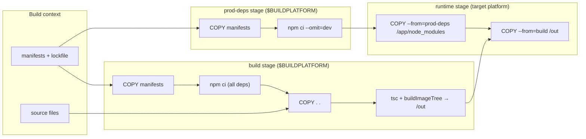

# Design Document — Docker Build Optimization

## Overview

This design restructures the Docker image build to exploit layer caching and eliminate the slow `npm prune` step. The core idea is straightforward: split the single `COPY . .` into two layers (manifests first, then sources) and replace the in-place `npm prune --omit=dev` with a parallel `prod-deps` stage that runs `npm ci --omit=dev` from a clean slate.

The `emit-effective-dockerfile.sh` script — currently responsible only for injecting toggle-default `ENV` lines — is extended to also generate the per-workspace `COPY` instructions. This keeps `Dockerfile.template` free of hardcoded workspace paths, so adding a microservice still requires zero changes to the template.

As part of this change, `Dockerfile` is renamed to `Dockerfile.template` (the committed source with anchors) and the generated output takes the conventional name `Dockerfile` (gitignored). This eliminates `-f Dockerfile.effective` from every `docker build` invocation and makes it obvious that `Dockerfile` is generated output that should not be edited by hand.

## Architecture

### Current Dockerfile flow (two stages)

```
build stage:
  COPY . .                          ← busts npm ci cache on ANY change
  npm ci (all deps, ~4.5 min)
  tsc --build contracts + build-tools
  buildImageTree:
    generateRegistry
    tsc --build selected packages
    npm prune --omit=dev (~3.5 min) ← re-resolves entire dep graph
    assemble /out (copies pruned node_modules + workspace packages)

runtime stage:
  COPY --from=build /out ./
```

### New Dockerfile flow (three stages)

```
build stage:
  COPY manifests + lockfile         ← generated by emit-effective-dockerfile.sh
  npm ci (all deps)                 ← cached unless a manifest changes
  COPY . .                          ← source changes only bust from here
  tsc --build contracts + build-tools
  buildImageTree:
    generateRegistry
    tsc --build selected packages
    assemble /out (workspace packages only, NO node_modules)

prod-deps stage:
  COPY manifests + lockfile         ← same generated lines, same cache
  npm ci --omit=dev                 ← clean production deps, no pruning

runtime stage:
  COPY --from=prod-deps node_modules  ← third-party runtime deps
  COPY --from=build /out ./           ← workspace packages + overseer
```

### Stage dependency diagram



The `build` and `prod-deps` stages run in parallel (buildkit parallelizes independent stages), so the prod-deps install overlaps with compilation.

## Design Decisions

### D1: Anchor-based injection in Dockerfile.template

**Decision:** `Dockerfile.template` (the committed source) uses comment anchors (`# --- MANIFEST_COPY ---`) at the injection points. `emit-effective-dockerfile.sh` replaces each anchor with the generated COPY lines and writes the result to `Dockerfile`.

**Rationale:** This is the same pattern the script already uses for ENV toggle injection (anchoring on the last ENTRYPOINT). A comment anchor is simpler and more robust than trying to parse Dockerfile syntax to find the right insertion point. The anchors appear twice in the template: once in the build stage and once in the prod-deps stage.

**Tradeoff:** `Dockerfile.template` is not a valid standalone Dockerfile — it must be processed through the emit script to produce a buildable `Dockerfile`. This is already the case today (the ENV toggle lines are injected), so the constraint is not new.

### D2: Workspace discovery via glob-style filesystem listing

**Decision:** The emit script discovers workspaces by listing every direct subdirectory of `packages/` and every direct subdirectory of `packages/microservices/`, not by hardcoding specific package names or parsing `package.json`'s `workspaces` array. This is the equivalent of `packages/*/package.json` and `packages/microservices/*/package.json`.

**Rationale:** The script is dependency-free POSIX sh. Parsing a JSON array in POSIX sh is fragile and error-prone. Glob-style listing is future-proof: adding a new top-level package alongside `contracts`, `build-tools`, and `overseer` requires no script change. The script already lists `packages/microservices/` this way for selector resolution.

**Exclusion:** `packages/integration-tests` is excluded by name (a simple exclusion check). It is a test-only workspace — it has no production code, no `dist/` output consumed by the image, and no runtime dependencies. Including it would add an unnecessary `package.json` to the manifest layer and cause `npm ci --omit=dev` in the prod-deps stage to attempt resolving its workspace topology, which adds nothing to the image.

**Tradeoff:** Any new top-level package under `packages/` is automatically included. If a new test-only package were added alongside `integration-tests`, it would need to be added to the exclusion list in `emit-effective-dockerfile.sh`. This induces a steering update: the structure steering must document that new test-only packages require an exclusion-list entry in the emit script.

### D3: prod-deps stage shares the manifest COPY lines

**Decision:** The prod-deps stage uses the identical set of generated COPY lines as the build stage.

**Rationale:** Both stages need `npm ci` to see the same workspace topology. Sharing the COPY lines guarantees cache invalidation is symmetric: a manifest change invalidates both stages, a source change invalidates neither's npm-install layer.

### D4: buildImageTree drops npm prune and copyThirdPartyDependencies

**Decision:** The `buildImageTree` function in `image-tree.ts` no longer runs `npm prune --omit=dev` and no longer copies third-party dependencies into `/out`. It assembles only the workspace packages (contracts, selected microservices, overseer) into `/out`.

**Rationale:** The prod-deps stage provides clean production `node_modules/` as a separate layer. The runtime stage composes the two via two `COPY` instructions. The in-place prune was the second-largest time sink (~3.5 min); eliminating it requires no compensating logic because the clean install is functionally equivalent.

**Tradeoff:** The `/out` staging tree no longer contains `node_modules/`. The runtime stage needs two `COPY` instructions instead of one. This changes the structural assertion in `dockerfile.test.ts` (which currently expects a single `COPY --from=build /out ./` in the runtime stage).

### D5: Runtime COPY composition — prod-deps node_modules (minus @microservices), then build output

**Decision:** The runtime stage copies `node_modules/` from prod-deps first, then copies `/out` from the build stage on top. Crucially, the prod-deps stage **removes `node_modules/@microservices` before it is copied** (`RUN rm -rf node_modules/@microservices` at the end of that stage), so the two COPYs never collide.

**Rationale:** The build stage's `/out` contains `node_modules/@microservices/contracts/`, `node_modules/@microservices/<selected>/` (the workspace packages as **real directories**), and `packages/overseer/`. The prod-deps stage's `node_modules/` contains the third-party dependencies — but `npm ci` also materializes the `@microservices/*` workspaces there as **symlinks** into `../../packages/...`, which would dangle in the image (`packages/` is absent from runtime).

The obvious plan — copy prod-deps first, then let `/out` "overlay" the real directories on top of those symlinks — **does not work**: `COPY --from=build /out ./` fails with `cannot copy to non-directory: .../node_modules/@microservices/contracts`, because Docker's `COPY` will not replace an existing symlink with a directory. A real `docker build` surfaces this at the final runtime COPY; the structural tests do not, because they never invoke `docker build`.

The fix is to make the two sources disjoint at the `@microservices` scope: the prod-deps stage owns the third-party dependencies only, and `/out` is the sole source of `@microservices/*`. Deleting `node_modules/@microservices` in the prod-deps stage (rather than filtering it out of the COPY, which BuildKit `COPY` cannot express per-entry) is the simplest way to enforce that. The removal targets only the workspace scope; `.bin`, third-party scopes, and unscoped packages are untouched.

This also explains why the `copyThirdPartyDependencies` filter (D4) is gone and did **not** need replacing: it used to skip the `@microservices` scope while copying third-party deps into `/out`; now that responsibility is split cleanly across stages — prod-deps carries third-party deps (with `@microservices` stripped), `/out` carries the real `@microservices/*` and `packages/overseer/`.

**Implementation detail:** the prod-deps COPY copies only `node_modules/` (not the whole working directory), and `buildImageTree` places the workspace packages under `/out/node_modules/@microservices/` as real directories. Because the prod-deps `@microservices` symlinks are gone by the time `/out` is copied, the runtime layout is exactly: third-party deps + real `@microservices/*` directories + `packages/overseer/`.

### D6: Dockerfile.template is the committed source, Dockerfile is generated

**Decision:** The committed source is `Dockerfile.template` (with anchors). The generated output is `Dockerfile` (gitignored). The generated file begins with a comment marking it as auto-generated, naming the template and the script, and warning not to edit.

**Rationale:** `Dockerfile` is the conventional name that Docker discovers by default, so using it for the generated output eliminates the `-f Dockerfile.effective` flag from `docker build`, `docker/build-push-action`, and the root `package.json` scripts. The `.template` suffix on the committed source makes it immediately clear this file is not directly buildable. The auto-generated header comment prevents accidental edits. The release workflow already runs `emit-effective-dockerfile.sh` before `docker build`, so the only workflow change is dropping the `file:` override and updating the input reference.

### D6.1: The registry template is staged statically, before `npm ci`

**Decision:** Each install stage (`build` and `prod-deps`) copies the single file `packages/overseer/src/generated/microservice-registry.template.ts` into `packages/overseer/src/generated/` **before** its `npm ci` step. These are two fixed `COPY` lines committed directly in `Dockerfile.template` (one right after each `# --- MANIFEST_COPY_* ---` anchor), not part of the generated manifest block.

**Rationale:** The root `package.json` has a `prepare` lifecycle script — `cp packages/overseer/src/generated/microservice-registry.template.ts .../microservice-registry.ts` — which npm runs automatically at the end of every `npm ci`. It exists so a fresh clone's Overseer has a valid (empty) registry to compile against. With manifest-splitting (D2/O2), `npm ci` now runs *before* `COPY . .`, so at that point only the workspace `package.json` files are in the image and the template source is absent; `prepare` then fails with `cp: can't stat '.../microservice-registry.template.ts'` and aborts the install. This fires in **both** install stages, because `prepare` runs during every `npm ci` (including the prod-deps `--omit=dev` install).

Staging that one source file before `npm ci` makes `prepare` succeed in-image. The real registry is still regenerated after `COPY . .` by `build-image-tree`, exactly as before — this only satisfies the lifecycle script's precondition.

**Why static, not generated:** the manifest COPY block is generated because its contents are *derived from filesystem discovery* and vary as packages are added or removed. The registry template is the opposite — a single, fixed, selector-independent path that is a permanent structural fact of the repo. Injecting it through the emit script would put a hardcoded constant inside a generator whose whole purpose is to compute variable content, and would force re-baselining the byte-for-byte oracle for no benefit. A committed line in the static template is the honest home for a static build instruction; it also keeps the emit script, its awk program, and the O9 baseline untouched. The `.dockerignore` already excludes only the *generated* `microservice-registry.ts` (not the `.template.ts`), so the template is present in the build context.

## Emit_Script Refactor (O9)

This section covers Requirement O9 only. It is additive to D1–D6.1 above: those decisions describe *what* the emit script produces (manifest COPY blocks, the prod-deps anchor, the toggle ENV block). O9 is purely about *how* the script is shaped internally. The observable output — every byte of the generated `Dockerfile` — must stay identical, which is what makes this a safe refactor: the unchanged Acceptance_Oracle (`effective-dockerfile.test.ts`) plus `dockerfile.test.ts` are the regression net.

### Motivation

The current script is a valid but sprawling POSIX-sh implementation: it uses `awk` (for the ENTRYPOINT pre-scan and the final injection pass), plus `grep` (anchor presence checks), `sed` (per-entry selector trimming), `tr` (whitespace stripping and lower→upper casing), and several shell `for` loops that concatenate the manifest and ENV blocks string-by-string before exporting them to awk via `ENVIRON`. The logic that "belongs together" (selector resolution, block construction, anchor injection, validation) is spread across a pre-scan, four external tools, and the final awk pass.

O9 collapses this into a clean two-part shape:

- **A thin shell part** that resolves configuration variables and discovers directories with globs, then hands raw strings to awk through the environment.
- **A single awk pass** that does *all* text processing — selector resolution, exclusion filtering, block construction, anchor injection, validation, and header emission.

`grep`, `sed`, and `tr` are removed entirely (O9.2). The only external process the script spawns is one `awk` invocation over `Dockerfile.template` (O9.1, O9.3).

### D7: Split of responsibilities — thin shell, one awk pass

**Decision:** The shell does only what awk cannot do portably and cheaply: expand filesystem globs and test file existence. Everything textual moves into awk.

**Shell responsibilities (the whole shell part):**

1. Resolve `DOCKERFILE` (default `Dockerfile.template`), `EFFECTIVE_DOCKERFILE` (default `Dockerfile`), and `NAMESPACE` (default `packages/microservices`) exactly as today.
2. Capture the *raw* selector string `MICROSERVICES` (default `*`). The shell does **not** trim, split, or interpret it — selector resolution moves into awk (O9.7, O9.14, O9.15). The shell only forwards the raw value.
3. Fail fast if the template file does not exist (kept in shell because there is nothing for awk to read otherwise), and if the namespace directory is missing when the selector needs it.
4. Discover directories with the shell globs `packages/*/` and `packages/microservices/*/` (O9.4). For each candidate, perform the `package.json` existence check in shell with `[ -f "$dir/package.json" ]` and drop any directory that has none (O9.5). Build two lists of *basenames*:
   - `PKG_DIRS` — top-level `packages/*` directory names that have a `package.json` (this still includes `integration-tests`; the `microservices` container dir is naturally dropped here because it has no `package.json`, but awk also excludes it by name as belt-and-suspenders).
   - `MS_DIRS` — `packages/microservices/*` directory names that have a `package.json`.
5. Export the raw selector and both lists through the environment and invoke awk exactly once.

Note the `MS_DIRS` list does double duty: it is both the microservice manifest source *and*, for the `*`/empty/whitespace selector, the resolved identifier set. awk therefore always needs the microservice basenames regardless of selector form (O9.14).

**Rationale:** Glob expansion and per-file `-f` tests are exactly what POSIX sh is good at and what POSIX awk cannot do without spawning helpers. Keeping discovery in shell means awk receives plain name lists and never touches the filesystem, so the awk program is a pure text transform that is trivial to reason about and portable across awk dialects.

### D8: Environment hand-off with a comma delimiter

**Decision:** The shell passes three values to awk via the process environment, read in awk through `ENVIRON[]` (O9.6): the raw selector, `PKG_DIRS`, and `MS_DIRS`. The two directory lists are **comma-separated**, joined from the discovered basenames. The raw selector is likewise comma-separated (it already is — it is the user's `MICROSERVICES` value verbatim), so all three `ENVIRON` inputs now use one uniform delimiter and awk resolves each with the same `split(str, arr, ",")` idiom.

```sh
# shell part (illustrative)
PKG_DIRS=""
for dir in "$PACKAGES_ROOT"/*/; do
  [ -d "$dir" ] || continue
  [ -f "$dir/package.json" ] || continue
  PKG_DIRS="${PKG_DIRS}$(basename "$dir"),"   # trailing comma per entry
done

MS_DIRS=""
for dir in "$NAMESPACE"/*/; do
  [ -d "$dir" ] || continue
  [ -f "$dir/package.json" ] || continue
  MS_DIRS="${MS_DIRS}$(basename "$dir"),"
done

export SELECTOR="${MICROSERVICES:-*}" PKG_DIRS MS_DIRS
awk -f - "$DOCKERFILE" <<'AWK' >"$tmp_out"
  ... single pass; split(ENVIRON["PKG_DIRS"], a, ",") etc. ...
AWK
```

**Why `ENVIRON[]` instead of `-v`:** `ENVIRON[]` is the established POSIX mechanism the current script already uses to hand its blocks to awk, and keeping all three inputs on it is uniform with that. It also sidesteps the quoting/escaping concerns of a `-v` assignment, whose parsing rules for the assigned value are awkward to get right portably. `ENVIRON[]` is plain POSIX (O9.6) and needs none of that ceremony.

**Why comma as the delimiter:**

- **(a) Uniformity.** The selector is comma-separated by external contract, so using comma for the directory lists too gives awk a single `split(..., ",")` idiom — one split-and-trim helper can be reused across the selector and both directory lists.
- **(b) Safety.** Directory identifiers are lowercase-alphanumeric per the naming steering rule, so they never contain a comma (or whitespace); comma is therefore a safe join/split delimiter for these values.
- **(c) Why not newline.** Newline is not more "shell-ish" here: discovery is glob iteration (`for dir in packages/*/`), which is space-safe regardless of the join delimiter, so newline buys nothing on the shell side. Nor is it more robust — POSIX filenames can legally contain either commas or newlines, so neither delimiter is injection-proof; the naming convention is what actually guarantees safety. Given that, comma wins on uniformity.

**Trailing-delimiter handling:** a trailing comma from the shell join yields an empty final element that awk skips when building blocks — the same harmless behavior the earlier form had. `split()` on a trailing-comma string produces that empty last element, and the BEGIN block ignores empty elements.

### D9: Single awk pass — construction, injection, and the one-pass "last ENTRYPOINT" problem

**Decision:** One awk invocation does everything. In `BEGIN` it reads `ENVIRON[]`, resolves the selector, filters exclusions, and pre-builds the two block strings. During the pass it **buffers every input line into an array** and records anchor sightings. In `END` it validates, then emits the whole document from the buffer, inserting the ENV block at the right point.

**BEGIN — selector resolution and block construction:**

- Trim the raw selector with POSIX ERE: `s = ENVIRON["SELECTOR"]; gsub(/^[[:space:]]+|[[:space:]]+$/, "", s)` (O9 confirms POSIX `gsub` suffices for trimming — no `gensub` needed).
- If the trimmed selector is empty or `*`, the resolved identifier list is the `MS_DIRS` entries in listed order (O9.14). Otherwise split the *raw* selector on `,`, trim each entry with the same `gsub`, and drop empties (O9.15).
- Build the exclusion set for the top-level packages: skip `integration-tests` and `microservices` by name (O9.7). Filtering lives in awk, not shell, so the shell hands over the unfiltered `PKG_DIRS`.
- Build the manifest COPY block string, in this exact order (O9.11, O9.12): the header comment line `# --- manifest COPY (generated by scripts/emit-effective-dockerfile.sh) ---`, then `COPY package.json package-lock.json ./`, then one `COPY packages/<name>/package.json packages/<name>/` per non-excluded top-level package in listed order, then one `COPY packages/microservices/<id>/package.json packages/microservices/<id>/` per microservice in listed order.
- Build the ENV toggle block string: the header `# --- R6.6 toggle defaults (generated by scripts/emit-effective-dockerfile.sh; selector: <RAW_SELECTOR>) ---` (the *raw*, untrimmed selector text, matching today's output), then one `ENV MICROSERVICE_<UPPER>_ENABLED=enabled` per resolved identifier, uppercased with `toupper()` (O9.13).

**The pass — buffer and mark:**

```awk
{ line[NR] = $0 }                                  # buffer every line
$0 ~ /^[[:space:]]*# --- MANIFEST_COPY_BUILD ---[[:space:]]*$/    { build_anchor = NR }
$0 ~ /^[[:space:]]*# --- MANIFEST_COPY_PRODDEPS ---[[:space:]]*$/ { prod_anchor  = NR }
$0 ~ /^[[:space:]]*ENTRYPOINT([[:space:]]|\[)/                    { last_entry  = NR }
END { ... }
```

**The one-pass "last ENTRYPOINT" nuance (O9.3):** awk is a single forward pass, so at the moment it sees an `ENTRYPOINT` it cannot yet know whether a later one exists. The requirement says the ENV block goes *before the last* ENTRYPOINT. Two options were considered:

- **(a) Buffer all lines, resolve in END.** Record the line number of the most recent ENTRYPOINT sighting; because assignment happens on every match, after EOF `last_entry` holds the *last* ENTRYPOINT's line number. In END, walk the buffered `line[1..NR]` and, when the counter reaches `last_entry`, print the ENV block first, then the line.
- **(b) Match ENTRYPOINT directly and inject before the first one seen.** Simpler, but only correct under the assumption that the template has exactly one ENTRYPOINT. It silently does the wrong thing if a future template gains a build-stage ENTRYPOINT.

**Chosen: (a), buffer-in-array then emit-in-END.** It robustly satisfies "last ENTRYPOINT" in a single invocation (no awk pre-scan, honoring O9.3), and — more importantly — buffering is what lets *all* printing happen in END *after* validation. That is the mechanism behind the "SHALL NOT produce output on error" guarantees (O9.16–O9.18): nothing is emitted until validation has passed. This reconciles the "last ENTRYPOINT" wording with reality — we genuinely find the last one — rather than leaning on the single-ENTRYPOINT assumption of option (b).

**END — validate, then emit:**

```awk
END {
  if (!last_entry)    { print MISSING_ENTRY_MSG  > "/dev/stderr"; exit 1 }
  if (!build_anchor)  { print MISSING_BUILD_MSG  > "/dev/stderr"; exit 1 }
  if (!prod_anchor)   { print MISSING_PROD_MSG   > "/dev/stderr"; exit 1 }
  if (id_count == 0)  { print EMPTY_SEL_MSG      > "/dev/stderr"; exit 1 }

  print HEADER1            # "# AUTO-GENERATED from Dockerfile.template ..."
  print HEADER2            # "# Selector: <raw selector>"
  for (i = 1; i <= NR; i++) {
    if (i == build_anchor || i == prod_anchor) { print MANIFEST_BLOCK; continue }
    if (i == last_entry)                        { print ENV_BLOCK }
    print line[i]
  }
}
```

Anchor lines are *replaced* by the manifest block (the anchor comment itself is not re-emitted), matching today's behavior. The ENV block is printed immediately before the last ENTRYPOINT line, which is then printed normally.

**Validation order (ENTRYPOINT first).** The guards run ENTRYPOINT → build anchor → prod-deps anchor → empty-resolution, matching the pre-refactor script's behavior. The order is load-bearing for the Acceptance_Oracle: its no-ENTRYPOINT fixture also omits the manifest anchors, and it asserts the emitted stderr names the missing ENTRYPOINT (with empty stdout). Checking a manifest anchor first would surface the missing-anchor message instead and fail that assertion. Because a real `Dockerfile.template` always has all three, this ordering only affects which diagnostic a malformed template reports — never the successful output.

### D10: Header lines move into awk's END (no-output-on-error)

**Decision:** The two header lines — `# AUTO-GENERATED from Dockerfile.template by scripts/emit-effective-dockerfile.sh. Do not edit.` and `# Selector: <selector>` — are emitted by awk's END block *after* validation passes, as the first two lines of output. They no longer come from a shell `printf` that runs before awk.

**Rationale:** Today the shell prints both headers, then runs awk, all inside one `{ ...; } >"$EFFECTIVE"` redirect. If awk fails mid-stream the file still contains the two headers — acceptable today only because validation happens *before* the output block. Once validation moves into awk (O9.8), the headers must move with it, otherwise a validation failure would leave a two-line file and break the oracle's `expect(result.out).toBe("")`. Emitting the headers from END, after the validation guards, means a failed run prints nothing at all to stdout.

**Shell side of the guarantee:** awk writes to a temporary file; the shell checks awk's exit status and only moves the temp file into `EFFECTIVE_DOCKERFILE` (and prints the final `wrote` line) on success. On failure the shell removes the temp file and exits non-zero, so an existing `Dockerfile` is never clobbered with partial output.

```sh
tmp_out=$(mktemp)
if awk -f - "$DOCKERFILE" <<'AWK' >"$tmp_out"
  ...
AWK
then
  mv "$tmp_out" "$EFFECTIVE_DOCKERFILE"
  echo "[emit-effective-dockerfile] wrote $EFFECTIVE_DOCKERFILE for selector '$SELECTOR'"
else
  status=$?
  rm -f "$tmp_out"
  exit "$status"
fi
```

A plain `>"$EFFECTIVE_DOCKERFILE"` redirect would also satisfy the oracle (a failed END emits nothing, so the file reads back as `""`), but the temp-file-then-`mv` preserves today's no-clobber behavior for the real generated file and is the recommended form. The final `wrote ... for selector '<selector>'` line stays in the shell because the oracle asserts it appears on **stdout** (`stdout).toContain("for selector '...'")`), separate from the file body.

### Error messages (byte-for-byte)

The messages must match today's script exactly, because the oracle asserts on substrings (e.g. `no ENTRYPOINT instruction`) and CI parity depends on identical stderr. They move verbatim from shell/`grep` checks into awk's END guards (and the two pre-awk shell checks stay in shell):

| Condition | Where | Message (verbatim) |
|---|---|---|
| Template file missing | shell (before awk) | `[emit-effective-dockerfile] no such Dockerfile template: <DOCKERFILE>` |
| Namespace dir missing (needed for `*`/empty) | shell | `[emit-effective-dockerfile] no such Microservice_Namespace: <NAMESPACE>` |
| A manifest anchor absent (O9.16) | awk END | `[emit-effective-dockerfile] <DOCKERFILE> is missing the '<marker>' anchor` |
| No `ENTRYPOINT` (O9.17) | awk END | `[emit-effective-dockerfile] <DOCKERFILE> has no ENTRYPOINT instruction to anchor the toggle-default ENV injection` |
| Selector resolves to nothing (O9.18) | awk END | `[emit-effective-dockerfile] selector '<selector>' resolved to no microservices` |

The `<DOCKERFILE>`, `<marker>`, `<NAMESPACE>`, and `<selector>` interpolations are passed into awk through `ENVIRON[]` (the template path and the raw selector) so the messages read identically. The missing-anchor message names the same `# --- MANIFEST_COPY_BUILD ---` / `# --- MANIFEST_COPY_PRODDEPS ---` marker text the current per-marker `grep` loop reports; awk reports whichever anchor it did not see (checking build then prod-deps in that order).

### Risks / dialect notes

- **`ENVIRON[]` portability.** `ENVIRON` is specified by POSIX and is present in BSD awk (macOS), busybox awk (Alpine CI), gawk, and mawk. The hand-off in D8 relies only on this standard array, so it works uniformly across the three target environments named in O9.9.
- **`split(str, arr, sep)` with a single-char separator** is portable across all four awks. Using a literal `","` (or a one-character FS) avoids the regex-vs-literal separator ambiguities that only arise with multi-character/regex separators, so the comma delimiter of D8 is safe everywhere.
- **POSIX-only awk features (O9.9).** The design uses only `toupper()`, `split()`, `sub`/`gsub` with POSIX ERE (`[[:space:]]`, `[[:lower:]]`-free — casing is done with `toupper()`), integer-indexed arrays, string concatenation, `ENVIRON[]`, and `NR`. It avoids `gensub` (gawk-only), `length(array)` (not universally supported — the design counts entries with an explicit integer during `split`/loop instead), the `\<`/`\>` word-boundary escapes (not POSIX ERE), and any GNU `--` option quirks. Trimming uses `gsub(/^[[:space:]]+|[[:space:]]+$/, "", s)`, which is POSIX ERE and behaves identically on BSD, busybox, mawk, and gawk.
- **Anchor regexes** reuse the current tolerant forms (`^[[:space:]]*# --- ... ---[[:space:]]*$` and `^[[:space:]]*ENTRYPOINT([[:space:]]|\[)`), so no new regex-dialect surface is introduced.

### Verification

O9 is verified entirely by existing tests, which must remain **unmodified** (O9.19):

- **`effective-dockerfile.test.ts`** (the Acceptance_Oracle, 18 tests): pins selector resolution against `resolveSelected()` across all selector forms, asserts the auto-generated header and `# Selector:` lines, the R6.6 block header and ENV-before-last-ENTRYPOINT placement, the manifest COPY block content/ordering in both stages, the exclusion of `integration-tests`, and the `expect(result.out).toBe("")` no-output-on-error case. Because the refactor keeps output byte-for-byte identical (O9.11), this suite passes untouched.
- **`dockerfile.test.ts`**: structural assertions over `Dockerfile.template` (the three-stage layout and COPY pattern), unaffected by the internal refactor.

The refactor is complete when both suites pass with no test edits and the generated `Dockerfile` is identical, byte-for-byte, for every selector form enumerated in O9.11 (`*`, unset, empty, whitespace-only, single identifier, comma list with and without surrounding whitespace).

## Files Changed

| File | Change |
|---|---|
| `Dockerfile` → `Dockerfile.template` | Rename. Three stages (build, prod-deps, runtime). Anchor comments for manifest COPY injection. Static `COPY` of the registry template before each `npm ci` so the root `prepare` script succeeds (D6.1). Prod-deps drops `node_modules/@microservices` symlinks before it is copied (D5). Two runtime COPYs. Remove `npm prune` comment. |
| `Dockerfile` (generated, gitignored) | New: generated by `emit-effective-dockerfile.sh` from `Dockerfile.template`. Begins with auto-generated comment. |
| `scripts/emit-effective-dockerfile.sh` | Read `Dockerfile.template`, write `Dockerfile`. Discover workspace `package.json` files via glob-style listing, generate COPY lines, inject at anchors (twice: build + prod-deps). Add auto-generated header comment. Existing ENV toggle injection unchanged. **(O9)** Refactored to a thin shell + single awk pass: `grep`/`sed`/`tr` removed, selector resolution/formatting/exclusion/block-construction/injection/validation all move into one awk invocation (see Emit_Script Refactor (O9)). Output stays byte-for-byte identical. |
| `packages/build-tools/src/image-tree.ts` | Remove `run("npm", ["prune", ...])`, remove `copyThirdPartyDependencies` function and its call. `/out` contains only workspace packages. |
| `packages/integration-tests/tests/dockerfile.test.ts` | Read `Dockerfile.template`. Update structural assertions for three stages and two runtime COPYs. |
| `packages/integration-tests/tests/effective-dockerfile.test.ts` | Update to use `Dockerfile.template` as base and `Dockerfile` as output. Add assertions for generated COPY lines matching workspace structure. Verify auto-generated header comment. |
| `.kiro/steering/structure.md` | Document that new test-only packages under `packages/` must be added to the emit script's exclusion list. Update file tree to show `Dockerfile.template`. |
| `.gitignore` | Replace `Dockerfile.effective` with `Dockerfile`. |
| `.dockerignore` | Update comments referencing `Dockerfile.effective` to `Dockerfile`. |
| `package.json` | Drop `-f Dockerfile.effective` from docker:build scripts. |
| `.github/workflows/release.yml` | Drop `file: Dockerfile.effective` from build-push-action (Docker finds `Dockerfile` by default). Update comments. |
| `scripts/start.js` | No changes needed (local dev, doesn't use Docker). |

## Layer Cache Behavior (Expected)

| Change type | Layers invalidated (build) | Layers invalidated (prod-deps) | Estimated time |
|---|---|---|---|
| Source-only change | COPY . . + tsc + assemble | None | ~10s |
| Manifest change | Everything from manifest COPY | Everything from manifest COPY | ~4.5 min (first time), cached thereafter |
| Lockfile change | Everything from manifest COPY | Everything from manifest COPY | ~4.5 min |
| No change (cached) | Nothing | Nothing | ~2s |
