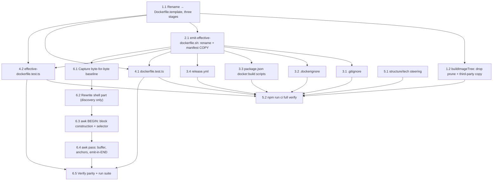

# Implementation Plan: Docker Build Optimization

## Overview

This plan turns [requirements.md](./requirements.md) and [design.md](./design.md) into an ordered series of tasks. The optimization restructures the Docker image build from a two-stage (build + runtime) to a three-stage (build + prod-deps + runtime) layout with manifest-splitting COPY generation. The committed template is renamed from `Dockerfile` to `Dockerfile.template`; the generated output takes the conventional name `Dockerfile` (gitignored).

The changes touch production code (`Dockerfile.template`, `scripts/emit-effective-dockerfile.sh`, `packages/build-tools/src/image-tree.ts`), config files (`.gitignore`, `.dockerignore`, `package.json`, release workflow), integration tests, and steering.

## Task Dependency Graph

Groups 1–5 are completed and ran in order (1 → 2 → 3 → 4 → 5). Group 6 (the O9 script refactor) depends only on the emit script's current shape (2.1) and is otherwise independent of groups 3–5; internally it is strictly sequential.



```json
{
  "waves": [
    { "id": 0, "tasks": ["1.1"] },
    { "id": 1, "tasks": ["1.2", "2.1"] },
    { "id": 2, "tasks": ["3.1", "3.2", "3.3", "3.4", "4.1", "4.2", "6.1"] },
    { "id": 3, "tasks": ["5.1", "6.2"] },
    { "id": 4, "tasks": ["6.3"] },
    { "id": 5, "tasks": ["6.4"] },
    { "id": 6, "tasks": ["5.2", "6.5"] }
  ]
}
```

## Tasks

- [x] 1. Rename and restructure the Dockerfile template
  - [x] 1.1 Rename `Dockerfile` to `Dockerfile.template` and restructure to three stages
    - `git mv Dockerfile Dockerfile.template`
    - Replace the single `COPY . .` + `npm ci` + `npm prune` pattern with the new three-stage layout
    - **Build stage:** Add a `# --- MANIFEST_COPY_BUILD ---` anchor comment before the `npm ci` step. Keep `COPY . .` after `npm ci`. Remove the comment about `COPY . .` keeping things in sync. The `npm ci` step keeps its `--mount=type=cache` and `--workspaces --include-workspace-root` flags
    - **Prod-deps stage:** Add a new `FROM --platform=$BUILDPLATFORM node:${NODE_VERSION}-alpine${ALPINE_VERSION} AS prod-deps` stage between build and runtime. Add `WORKDIR /app`, then a `# --- MANIFEST_COPY_PRODDEPS ---` anchor comment, then `RUN --mount=type=cache,target=/root/.npm npm ci --omit=dev --workspaces --include-workspace-root`. No source copy, no compilation — this stage produces only `node_modules/`
    - **Runtime stage:** Replace the single `COPY --from=build /out ./` with two COPYs: `COPY --from=prod-deps /app/node_modules ./node_modules` (third-party runtime deps) followed by `COPY --from=build /out ./` (workspace packages overlay). Update the stage header comment to describe the three-stage composition
    - Keep all existing runtime instructions (dumb-init, NODE_ENV, PORT, EXPOSE, USER, ENTRYPOINT, CMD) unchanged
    - Keep the ENV toggle injection marker comment in the runtime stage — `emit-effective-dockerfile.sh` still anchors on the last ENTRYPOINT
    - Update the file header comment to describe the three stages and note that this is a template processed by `emit-effective-dockerfile.sh`
    - _Requirements: O2, O3, O4, O8.1_
  - [x] 1.2 Update `buildImageTree` in `packages/build-tools/src/image-tree.ts`
    - Remove the `run("npm", ["prune", "--omit=dev"])` call
    - Remove the `copyThirdPartyDependencies` function entirely
    - Remove the call to `copyThirdPartyDependencies` in `buildImageTree`
    - The function now assembles `/out` with only: `node_modules/@scaffold/contracts/` (package.json + dist), `node_modules/@scaffold/<selected>/` per selected microservice (package.json + dist), `packages/overseer/` (package.json + dist)
    - Keep the post-assemble integrity check (no unselected microservice in `/out`)
    - Remove the `BIN_DIR` constant (no longer needed without the third-party copy)
    - Keep the `SCAFFOLD_SCOPE` constant, `run` helper, `copyPackage` helper, `generateRegistry` + `resolveSelected` imports
    - _Requirements: O3.4, O3.5, O5.3, O5.4_

- [x] 2. Enhance `emit-effective-dockerfile.sh` for template rename and manifest COPY generation
  - [x] 2.1 Update `scripts/emit-effective-dockerfile.sh` for new file names and manifest COPY generation
    - Change the default input from `Dockerfile` to `Dockerfile.template` (`DOCKERFILE="${DOCKERFILE:-Dockerfile.template}"`)
    - Change the default output from `Dockerfile.effective` to `Dockerfile` (`EFFECTIVE="${EFFECTIVE_DOCKERFILE:-Dockerfile}"`)
    - The generated `Dockerfile` SHALL begin with a comment: `# AUTO-GENERATED from Dockerfile.template by scripts/emit-effective-dockerfile.sh. Do not edit.` (this replaces the existing `# AUTO-GENERATED from Dockerfile by ...` header the script already emits)
    - After discovering microservice identifiers (existing logic), build a block of COPY lines by listing every direct subdirectory of `packages/` (excluding `integration-tests` and `microservices`) and every direct subdirectory of `packages/microservices/`. This is glob-style discovery (`packages/*/package.json`, `packages/microservices/*/package.json`) — no individual package names are hardcoded
    - Each COPY line SHALL create the target directory structure, e.g.: `COPY packages/contracts/package.json packages/contracts/`
    - The root files go first: `COPY package.json package-lock.json ./`
    - Then one COPY per top-level package: `COPY packages/<name>/package.json packages/<name>/` for each dir in `packages/` (skip `integration-tests`, skip `microservices`)
    - Then one COPY per microservice: `COPY packages/microservices/<id>/package.json packages/microservices/<id>/`
    - Inject this block twice: once replacing the `# --- MANIFEST_COPY_BUILD ---` anchor, once replacing the `# --- MANIFEST_COPY_PRODDEPS ---` anchor
    - Use the same awk pattern already used for ENV injection: find the anchor line number, insert the block before/at that line
    - Keep all existing ENV toggle injection logic unchanged — it continues to anchor on the last ENTRYPOINT
    - The manifest COPY block SHALL include a header comment naming it as generated, e.g.: `# --- manifest COPY (generated by scripts/emit-effective-dockerfile.sh) ---`
    - Validate that both anchors exist in `Dockerfile.template`; abort with a clear error if either is missing
    - _Requirements: O1.1, O1.2, O1.3, O1.4, O1.5, O5.5, O8.2, O8.3_

- [x] 3. Update config files and workflow for the rename
  - [x] 3.1 Update `.gitignore`
    - Replace the `Dockerfile.effective` entry with `Dockerfile` (the generated output is now `Dockerfile`)
    - Update the comment above it to reference `Dockerfile.template` and `emit-effective-dockerfile.sh`
    - _Requirements: O8.4_
  - [x] 3.2 Update `.dockerignore`
    - Update the comment block that references `Dockerfile.effective` to say `Dockerfile` instead, and note that `Dockerfile.template` is excluded from the build context (add it to the exclusion list — the build context only needs the generated `Dockerfile`, not the template)
    - _Requirements: O8.5_
  - [x] 3.3 Update root `package.json` docker:build scripts
    - Remove `-f Dockerfile.effective` from `docker:build:generic` and `docker:build:microservice1-microservice2` scripts (Docker now finds `Dockerfile` by default)
    - Update the `emit-effective-dockerfile.sh` invocations if they reference the old names (they use env var defaults, so no change needed there)
    - _Requirements: O8.6_
  - [x] 3.4 Update `.github/workflows/release.yml`
    - Remove the `file: Dockerfile.effective` line from the `docker/build-push-action` step (Docker discovers `Dockerfile` by default)
    - Update the step name "Generate effective Dockerfile" and its `grep` command to reference `Dockerfile` instead of `Dockerfile.effective`
    - Update comments that mention `Dockerfile` or `Dockerfile.effective` to use the new names (`Dockerfile.template` for the source, `Dockerfile` for the output)
    - _Requirements: O5.2, O8.7_

- [x] 4. Update integration tests
  - [x] 4.1 Update `packages/integration-tests/tests/dockerfile.test.ts`
    - Change the file read from `Dockerfile` to `Dockerfile.template`
    - Update the "defines exactly the build and runtime stages" test to expect three stages: `["build", "prod-deps", "runtime"]`
    - Update the "takes its whole runtime payload from a single copy of the staged tree" test to expect two COPY instructions in the runtime stage: `COPY --from=prod-deps /app/node_modules ./node_modules` and `COPY --from=build /out ./`
    - Update the "uses BUILDPLATFORM for the build stage" test to also verify that the prod-deps stage uses `$BUILDPLATFORM`
    - Keep all other assertions unchanged: MICROSERVICES ARG before FROM, no packages/microservices COPY, EXPOSE 8080, dumb-init ENTRYPOINT, USER node, no removed entry points
    - _Requirements: O6.1, O8.7_
  - [x] 4.2 Update `packages/integration-tests/tests/effective-dockerfile.test.ts`
    - Update to read `Dockerfile.template` as the base input and `Dockerfile` as the generated output
    - Update the `emit()` helper to pass `DOCKERFILE=Dockerfile.template` and `EFFECTIVE_DOCKERFILE=<temp path>` (or adjust defaults)
    - Add a new describe block: "emit-effective-dockerfile.sh generates manifest COPY lines"
    - Test that the generated `Dockerfile` contains COPY lines for every workspace `package.json` discovered via directory listing: every direct subdirectory of `packages/` (except `integration-tests` and `microservices`), and every direct subdirectory of `packages/microservices/`
    - Test that the manifest COPY lines appear in both the build stage and the prod-deps stage (i.e., the block appears twice in the output)
    - Test that root `package.json` and `package-lock.json` are COPYed
    - Test that `packages/integration-tests/package.json` is NOT COPYed (test-only workspace excluded from image)
    - Test that the generated `Dockerfile` begins with the auto-generated header comment referencing `Dockerfile.template`
    - Keep all existing tests: selector pinning, ENV line placement, structure preservation (the "preserves original content verbatim" test will need adjustment since anchors are replaced by generated COPY blocks, and the base filename changed)
    - _Requirements: O6.2, O6.3, O8.3, O8.7_

- [x] 5. Update steering and verify end-to-end
  - [x] 5.1 Update structure steering with test-only package exclusion rule and new filenames
    - Add a note to `.kiro/steering/structure.md` in the "Where things go" section (or equivalent) documenting that new test-only packages under `packages/` must be added to the exclusion list in `scripts/emit-effective-dockerfile.sh`
    - Explain that `emit-effective-dockerfile.sh` uses glob-style discovery (`packages/*/`) and automatically includes every subdirectory; test-only packages that should not appear in the Container image must be excluded by name
    - Update the file tree in structure steering to show `Dockerfile.template` instead of `Dockerfile`, and update the description of `emit-effective-dockerfile.sh` to reference the new names
    - Update references to `Dockerfile.effective` in structure and tech steering to use the new names
    - _Requirements: O7.1, O7.2, O8.7_
  - [x] 5.2 Run the full test suite
    - Run `npm run ci` from the repo root to verify typecheck, lint, and all tests pass
    - Verify that `emit-effective-dockerfile.sh` produces a valid `Dockerfile` for both `*` and `microservice1,microservice2` selectors
    - Verify the generated `Dockerfile` begins with the auto-generated header comment
    - _Requirements: O5, O6.3, O8.3_

- [x] 6. Refactor emit-effective-dockerfile.sh to a thin-shell + single-awk-pass shape
  - [x] 6.1 Capture a byte-for-byte output baseline before refactoring
    - Before touching the script, generate and save the current output for every selector form the oracle exercises (`*`, unset, empty, whitespace-only `"   "`, `microservice1`, `microservice1,microservice2`, ` microservice1 , microservice2 `, `microservice1,microservice2,microservice3`) to temp files, using `EFFECTIVE_DOCKERFILE` redirection so the real `Dockerfile` is not touched
    - These baselines are the local diff oracle for the refactor (the committed test suite is the authoritative oracle)
    - _Requirements: O9.11, O9.19_

  - [x] 6.2 Rewrite the script: thin shell part (discovery only)
    - Shell resolves `DOCKERFILE` (default `Dockerfile.template`), `EFFECTIVE_DOCKERFILE` (default `Dockerfile`), `NAMESPACE` (default `packages/microservices`) as today
    - Keep the two shell-side fail-fast checks: template file missing, and namespace dir missing (needed for the `*`/empty selector) — same messages
    - Capture the RAW selector string (`MICROSERVICES`, default `*`) without trimming, splitting, or interpreting it
    - Discover directories with globs `packages/*/` and `packages/microservices/*/`; for each do the `[ -f "$dir/package.json" ]` existence check in shell; build two comma-separated basename lists: `PKG_DIRS` (top-level, unfiltered — exclusion happens in awk) and `MS_DIRS` (microservices)
    - Export `SELECTOR` (raw), `PKG_DIRS`, `MS_DIRS` via the environment; invoke awk exactly once over the template into a temp file; on awk success `mv` temp → `EFFECTIVE_DOCKERFILE` and echo the existing `wrote ... for selector '<selector>'` line to stdout; on failure `rm` temp and exit non-zero
    - Remove `grep`, `sed`, `tr`, and the separate ENTRYPOINT pre-scan awk invocation entirely
    - _Requirements: O9.1, O9.2, O9.3, O9.4, O9.5, O9.6, O9.10_

  - [x] 6.3 Write the single awk pass: BEGIN block construction + selector resolution
    - In `BEGIN`, read `ENVIRON["SELECTOR"]`/`ENVIRON["PKG_DIRS"]`/`ENVIRON["MS_DIRS"]`, split all three on comma with one shared `split(str, arr, ",")` idiom (skip empty trailing element)
    - Resolve selector in awk: trim with `gsub(/^[[:space:]]+|[[:space:]]+$/,"",s)`; if empty or `*` → all `MS_DIRS` in listed order; else split raw selector on comma, trim each entry, drop empties
    - Filter top-level packages by name in awk: skip `integration-tests` and `microservices`
    - Pre-build the manifest COPY block string: header `# --- manifest COPY (generated by scripts/emit-effective-dockerfile.sh) ---`, then `COPY package.json package-lock.json ./`, then top-level packages in order, then microservices in order — exact `COPY packages/<name>/package.json packages/<name>/` format
    - Pre-build the ENV toggle block: header `# --- R6.6 toggle defaults (generated by scripts/emit-effective-dockerfile.sh; selector: <RAW SELECTOR>) ---` then one `ENV MICROSERVICE_<UPPER>_ENABLED=enabled` per resolved id via `toupper()`
    - Use POSIX awk only: no `gensub`, no `length(array)`, no non-POSIX regex
    - _Requirements: O9.7, O9.9, O9.11, O9.12, O9.13, O9.14, O9.15_

  - [x] 6.4 Write the single awk pass: buffer, mark anchors, emit-in-END
    - During the pass, buffer every line into `line[NR]` and record `build_anchor`, `prod_anchor`, and `last_entry` (last ENTRYPOINT) line numbers using the existing tolerant regexes
    - In `END`, validate in order: missing `MANIFEST_COPY_BUILD` anchor, missing `MANIFEST_COPY_PRODDEPS` anchor, missing ENTRYPOINT, empty selector resolution — each writes the exact existing message to `/dev/stderr` and `exit 1` BEFORE any output
    - After validation passes, emit the two header lines (`# AUTO-GENERATED from Dockerfile.template by scripts/emit-effective-dockerfile.sh. Do not edit.` then `# Selector: <raw selector>`), then replay buffered lines: replace each manifest anchor line with the manifest block, print the ENV block immediately before the last ENTRYPOINT line
    - Confirm the no-output-on-error guarantee: a failed validation prints nothing to stdout so the oracle's `expect(result.out).toBe("")` holds
    - _Requirements: O9.3, O9.8, O9.16, O9.17, O9.18_

  - [x] 6.5 Verify byte-for-byte parity and run the suite
    - Diff the new output against the 6.1 baselines for every selector form — must be identical
    - Run the unchanged Acceptance_Oracle (`effective-dockerfile.test.ts`) and `dockerfile.test.ts`; then `npm run ci` from the repo root — all must pass with NO test edits
    - Verify no `grep`/`sed`/`tr` remain in the script and only one awk invocation is present
    - _Requirements: O9.1, O9.2, O9.11, O9.19_
