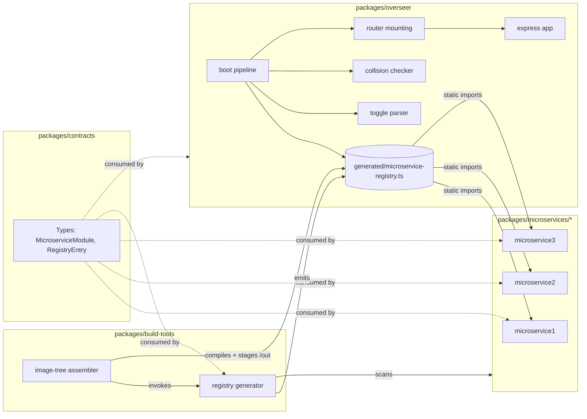
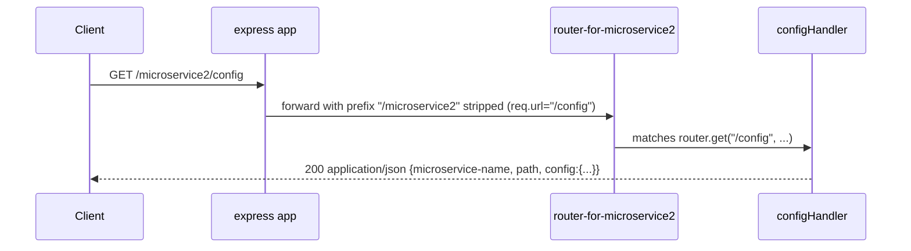
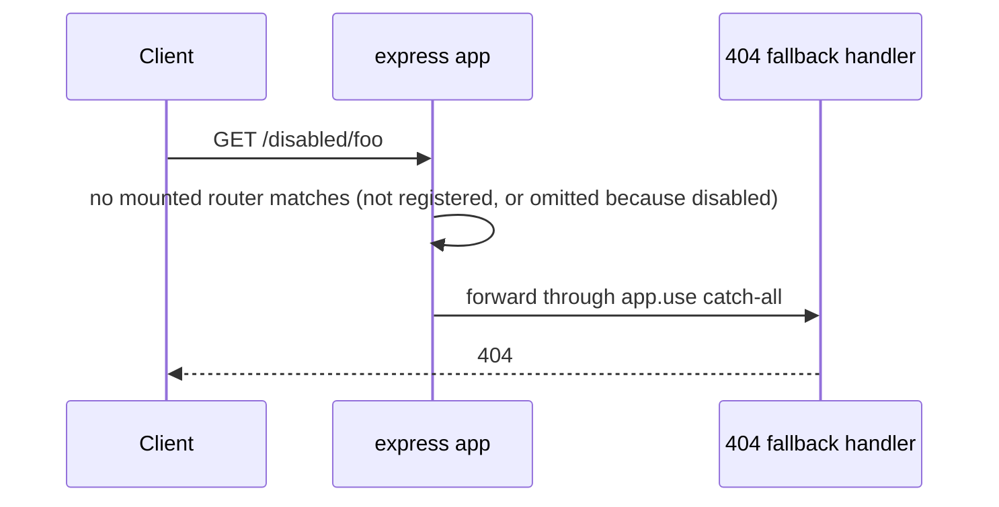
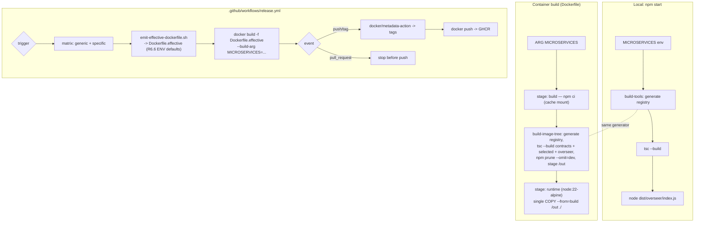

# Design Document — Microservice Scaffold

## Overview

The Microservice Scaffold is a monorepo template composed of independent Node modules coordinated by a small routing frontend (the Overseer). The design realizes the product goals from `.kiro/steering/product.md` — independent microservice modules, trivial add/remove, generic and specific container builds, and a runtime enable/disable toggle — with the minimum viable surface area.

The design commits to the following technical choices, both of which trade optionality for simplicity:

1. **HTTP layer: Express (v5).** The Overseer uses Express as its HTTP server and router. Each microservice exports an `express.Router` that the Overseer mounts at the microservice's declared Microservice_Path via `app.use(microservicePath, router)`. Express handles both the outer prefix matching (does this incoming request fall within a mounted microservice's subtree?) and the inner method/path routing (within the microservice, which of its registered routes handles this request?). Alternatives considered were `node:http` alone (rejected because subtree ownership by microservices — Requirement 2.5 — would require re-implementing method/path routing inside every microservice, duplicating what Express provides) and Fastify (rejected because Express is more ubiquitous, has stable v5 semantics for `Router()` mounting, and the scaffold's non-goals explicitly rule out performance optimization at this stage). Steering (`.kiro/steering/tech.md`) explicitly names Express (v5) as the framework, so this choice is aligned.
2. **Loading vs routing for disabled microservices: load-then-route.** All microservice modules baked into the current Container are loaded at Overseer startup (via the static imports emitted by the registry generator), regardless of their toggle state. Load-then-route is chosen because:
   - Static imports in the generated registry are unconditional, and that is what turns "missing export" (Requirement 8.5) into a *build* failure rather than a runtime one: the generated registry is a `.ts` file in the Overseer's `src/`, so `tsc` checks every imported module namespace against `MicroserviceModule`. Making a module's import contingent on a runtime environment variable would require dynamic `import()`, which erases that guarantee entirely — the shape check would move back to runtime, and it would land after the point at which Requirement 9 wants collision detection to happen.
   - The Overseer's own import of the generated registry is static too (`import { microserviceRegistry } from "./generated/microservice-registry.js"` in `src/index.ts`), which makes this argument stronger rather than weaker: the chain from entrypoint to microservice module is static end to end, so the registry's *own* export name and type are compile-time facts as well, not an `as` cast over an `await import()`. An earlier revision used a dynamic import behind a variable specifier so the package would typecheck without the gitignored generated file; that bought nothing for module shape checking (the generated file is a program root of the Overseer's `tsconfig` either way, so `tsc` checks it regardless of who imports it) and cost the one type assertion in the package. The generated file's presence is guaranteed by the root `prepare` script instead — see "Registry Generator — Invocation".
   - Path-collision detection (R9), and unknown-enabled-toggle detection (R7.1), require the Overseer to have visibility into every microservice present in the Container, not just the enabled ones. Load-first gives that visibility for free.
   - The tradeoff is that a disabled microservice still incurs its module's import-time cost (memory, side effects). For the scaffold's target audience — stateless hello-world modules — this cost is negligible. Authors of side-effect-heavy modules can defer initialization into their router's individual route handlers rather than the module's top level.

The rest of this document describes how the Overseer, the microservice modules, and the build tooling realize the eleven numbered requirements.

## Architecture

### Package layout

The workspace layout mirrors `.kiro/steering/structure.md`:

```
/
├─ package.json                             # root; workspaces, scripts, engines
├─ tsconfig.base.json
├─ Dockerfile                                # single, parameterized image build
├─ .dockerignore                             # keeps host artifacts out of the build context
├─ scripts/
│  ├─ start.js                               # npm start wrapper (registry + build + run)
│  └─ emit-effective-dockerfile.sh           # R6.6 toggle-default injection (POSIX sh)
├─ .github/workflows/release.yml
└─ packages/
   ├─ contracts/                             # shared TS types
   ├─ build-tools/                           # registry generator + image-tree assembler
   ├─ overseer/                              # Express server, dispatcher, boot pipeline
   │  └─ src/generated/microservice-registry.ts # emitted by build-tools; gitignored
   └─ microservices/                         # Microservice_Namespace
      ├─ microservice1/
      ├─ microservice2/
      └─ microservice3/
```

Every package is a standalone npm workspace with `"type": "module"`, `tsconfig.json` extending `../../tsconfig.base.json` (or `../../../tsconfig.base.json` for the microservice subpackages), a `src/` for TypeScript sources, a `dist/` for compiled output, and the four required scripts (`build`, `test`, `lint`, `typecheck`).

### Component diagram



Dependency rules (enforced by TypeScript project references and code review):

- `packages/microservices/*` depend only on `packages/contracts`.
- `packages/overseer` depends on `packages/contracts` and, via generated code only, on the selected `packages/microservices/*`.
- `packages/build-tools` depends on `packages/contracts` because the code it *emits* imports `MicroserviceRegistry` from it (and its property tests draw generators from `@scaffold/contracts/testing`); its own sources no longer import a contracts type, since the parsed-selector type moved into `selector.ts` when the parser stopped being exported. It lists the microservice directories; it neither reads their package metadata nor imports their runtime code.
- No microservice imports another microservice. No microservice imports the Overseer.

### Request-routing sequence — enabled microservice (`GET /microservice2/config`)



Note: Express strips the mount path before passing the request to the router. When a microservice registers its identifier response as `router.get("/", ...)`, Express treats both the empty remainder and `/` remainder equivalently for a request that arrives at the mount point itself.

### Request-routing sequence — disabled or unknown path (`GET /disabled/foo`)



Note: only enabled microservices' routers are mounted at boot (see Overseer Startup Sequence below). Disabled microservices' paths never reach a mounted router, so the "no mounted router matches" branch covers R4.2 (disabled) as well as R3.3 (unknown) via the same app-level 404 fallback.

### Build and release flow



## Components and Interfaces

### `packages/contracts/`

Owns the shared TypeScript types that every other package depends on. The public API is limited to `packages/contracts/src/index.ts` re-exports.

Exported types (details in Data Models):

- `MicroserviceModule` — the required exported shape from a microservice package: `{ path: string, router: express.Router }`.
- `RegistryEntry` — the shape of one row in the generated registry: `{ identifier, module, sourcePackage }`. The identifier lives here, not on the module (see Data Models).
- `MicroserviceRegistry` — the shape of the module the generator emits.
- `ToggleMap` — the parsed toggle map produced during boot.

Note that the request-handler type from the previous design is gone; the module contract now uses `Router` from the `express` package directly, so contracts re-exports that type rather than defining its own.

This package contains no runtime code. The `Router` re-export from `express` is a type-only convenience; the path-value check that used to live here (`validateMicroservicePath`) has been inlined into the Overseer's boot loop as a single `path.startsWith("/")` call (see Overseer Startup Sequence step 2).

There is **no identifier validation anywhere in the toolchain** — not in the generator, not at boot. A microservice does not declare an identifier, so there is no exported value to check; the directory name is the identifier, and validating directory names would contradict the existing "discovery does not inspect candidates" stance (a malformed candidate surfaces as a build failure on the generated static import). One consequence worth knowing: nothing rejects a directory name that maps badly onto its toggle variable name (see Toggle Handling).

### `packages/microservices/<identifier>/`

Each subdirectory is a standalone microservice. Its `src/index.ts` exports exactly the two named values from `MicroserviceModule`; the directory name is its identifier and is not exported:

```ts
import express from "express";

export const path: string = "/microservice2";
export const router: express.Router = createRouter();
```

Each reference microservice's `createRouter()` factory builds its Express router in this shape:

1. `const router = express.Router();`
2. `router.get("/", (req, res) => res.status(200).type("application/json").json({ "microservice-name": "microservice2", path }));` — the identifier response for a GET at the mount root (R2.1, R2.2, R2.3). The name is a **hardcoded literal** while `path` is a reference to the exported constant. That asymmetry is deliberate: `path` is the value the Overseer mounts at, so referencing the export makes the response agree with the mount by construction, whereas the name has no export left to agree with. *Rationale:* the `microservice-name` field exists only to make the three reference samples distinguishable in a demo; a real microservice is identified by its API surface and functionality, so a literal is the appropriate expression of "this sample's name" rather than a production contract worth deriving from somewhere.
3. `router.all("/", (req, res) => res.set("Allow", "GET").status(405).end());` — the 405 fallback for non-GET methods at the mount root (R2.4). This handler runs only for non-GET methods because Express walks handlers in registration order and the `router.get("/", ...)` above has already responded for GET requests.
4. For microservice2 only, additionally: `router.get("/config", (req, res) => res.status(200).type("application/json").json({ "microservice-name": identifier, path, config: { sampleSetting: "example-value", description: "demonstration sub-endpoint" } }));` — the sub-endpoint required by R2.6. The exact payload shape is illustrative; the requirement is only that it is a JSON object different from the root response.

Because the JSON key names on the root response are fixed at exactly `"microservice-name"` and `"path"` and no other fields, the router's root handler constructs the object with only those keys (not by shallow-cloning the module) so R2.2's "no additional fields" clause is structurally enforced.

The three reference microservices ship at these paths:

| Directory (= identifier) | reported `microservice-name` | exported `path`     | Sub-routes                    |
|--------------------------|------------------------------|---------------------|-------------------------------|
| microservice1            | `microservice1`              | `/`                 | (root only)                   |
| microservice2            | `microservice2`              | `/microservice2`    | `/`, `/config` (per R2.6)     |
| microservice3            | `microservice3`              | `/microservice3`    | (root only)                   |

The reported name is a literal inside each router; the identifier column is the directory name the generator records in the registry. Keeping the two equal is a convention of the samples, not something the toolchain checks.

The exact `path` values are illustrative; what matters is that they are distinct and that each mirrors the "microservices may declare arbitrary full paths" property described in the requirements.

Note on the 405 pattern: `router.all("/", ...)` is registered AFTER `router.get("/", ...)` so Express order dispatches GETs to the identifier handler and everything else to the 405 handler. For microservice2, a `router.all("/config", ...)` 405 fallback could be registered alongside the GET, but leaving it off means non-GET methods at `/config` fall through the router and reach the app-level 404. That is acceptable because R2.4's 405 contract only covers the microservice's root path.

Note on HEAD (R2.4 refinement): HEAD is treated as a bodiless GET per HTTP semantics and Express's built-in HEAD handling — a resource that answers GET also answers HEAD, so Express auto-routes HEAD through the registered `router.get("/", ...)` handler. HEAD therefore returns the 200 GET response (headers only) rather than 405. The 405/`Allow: GET` contract in R2.4 applies to POST/PUT/DELETE/PATCH/OPTIONS and other non-GET, non-HEAD methods.

### `packages/build-tools/`

Contains two entry points:

1. **Registry generator (`generate-registry.ts`).** A Node script that:
   - Reads the `MICROSERVICES` selector from the environment (see "Registry Generator" below).
   - Lists the direct subdirectories of `packages/microservices/` as candidates (names only; contents are not validated).
   - Applies the selector to produce the final set.
   - Emits `packages/overseer/src/generated/microservice-registry.ts`, a TypeScript module that statically imports each selected microservice module and re-exports them as a typed `MicroserviceRegistry`.
2. **Image-tree assembler (`image-tree.ts`).** `buildImageTree(outDir = "/out")`, invoked by the Dockerfile's build stage through the four-line `build-image-tree` bin. It generates the registry for the selector, compiles only the projects the image needs, drops devDependencies, and stages the complete runtime payload at `outDir`. It is what makes minimality a property of construction rather than of cleanup; documented in "Container Images" below.

**No barrel, and no `main`/`types`.** This package has no `src/index.ts`: it is a bin-only tooling package whose interface is its two CLI entry points, `generate-registry` and `build-image-tree` (the `bin` block in its `package.json`). Nothing in production imports the package by name — each bin imports its own module by path, and the modules import each other by path — so a barrel plus `main`/`types` would advertise a package-level API that no consumer has. The one non-bin consumer is a test: `packages/integration-tests/tests/effective-dockerfile.test.ts` deep-imports the compiled modules (`@scaffold/build-tools/dist/selector.js`, `@scaffold/build-tools/dist/generate-registry.js`), the same way the suite already reaches the Overseer (`@scaffold/overseer/dist/router.js`). There is no `exports` map, so deep specifiers resolve. See the exception clause in `.kiro/steering/structure.md`.

The module surfaces are correspondingly narrow: `selector.ts` exports only `resolveSelected` (the parser, the parsed-selector type and the unmatched-identifier error are internal to it — see "Selector application"), `generate-registry.ts` exports `generateRegistry` and `listMicroserviceDirectories`, and `image-tree.ts` exports `buildImageTree`.

### `packages/overseer/`

The Overseer's `src/index.ts` composes the boot pipeline (see "Overseer Startup Sequence") and then starts the Express app. The Overseer is organized into small, individually testable modules:

- `src/config.ts` — reads `PORT` (default `8080`) and other process-level config.
- `src/toggles.ts` — parses `MICROSERVICE_*_ENABLED` env vars against a supplied registry, produces `{ enabled: Map<identifier, boolean>, errors: ToggleError[] }`.
- `src/collision.ts` — **deleted**; path-collision detection is now inlined in `src/boot.ts` step 3 as a simple exact-equality check. Only exact duplicate paths are collisions; parent/child overlaps (e.g. `/api` and `/api/v2`) are a valid Express mount topology because `buildApp` sorts mounts by path length descending.
- `src/router.ts` — builds the mount table: constructs an Express `app`, then calls `app.use(entry.module.path, entry.module.router)` for every enabled `RegistryEntry` in a deterministic order (sorted by path descending by length for debuggability), and finally registers an app-level 404 catch-all (`app.use((req, res) => res.status(404).end())`).
- `src/server.ts` — starts the Express app via `app.listen(port)`.
- `src/boot.ts` — the ordered composition (see "Overseer Startup Sequence"). Step 2 (module-path validation) is inlined here: it loops the registry entries, checks `entry.module.path.startsWith("/")`, and collects `[module] <sourcePackage>: path "<path>" does not start with "/"` messages. Cross-module aggregation is kept (R8.5). The check was previously delegated to `validateMicroservicePath` from `@scaffold/contracts`; that function reduced to a single `startsWith` call once the non-empty guard was recognized as redundant (empty strings return `false` from `startsWith("/")`), so the indirection was removed and the validator file deleted.
- `src/generated/microservice-registry.ts` — the emitted microservice registry (gitignored, produced by `build-tools`). `src/index.ts` imports it statically, so the Overseer does not compile without it; the root `prepare` script copies the committed empty template into this location on every install so a fresh clone has one (see "Registry Generator — Invocation").

### Container images (Dockerfile)

One Dockerfile at the repository root, parameterized by a build ARG, with exactly two stages:

```dockerfile
# syntax=docker/dockerfile:1.7
ARG MICROSERVICES=*
ARG NODE_VERSION=22
ARG ALPINE_VERSION=3.21

FROM --platform=$BUILDPLATFORM node:${NODE_VERSION}-alpine${ALPINE_VERSION} AS build
WORKDIR /app
ARG MICROSERVICES
ENV MICROSERVICES=${MICROSERVICES}
COPY . .
RUN --mount=type=cache,target=/root/.npm npm ci --workspaces --include-workspace-root
RUN npx tsc --build packages/contracts packages/build-tools \
  && node packages/build-tools/dist/bin/build-image-tree.js

FROM node:${NODE_VERSION}-alpine${ALPINE_VERSION} AS runtime
RUN apk add --no-cache dumb-init
WORKDIR /app
ENV NODE_ENV=production
ENV PORT=8080
COPY --from=build /out ./
# --- R6.6 toggle-default ENV injection marker ---
EXPOSE 8080
USER node
ENTRYPOINT ["dumb-init", "--"]
CMD ["node", "packages/overseer/dist/index.js"]
```

**The runtime payload is a single `COPY`.** Everything the image runs is staged by `buildImageTree` at `/out` in the build stage, so the runtime stage copies one directory and adds nothing else. This is the design's central claim about R6.2: minimality holds *by construction*, not by deleting things afterwards. A microservice the selector did not name is never compiled and never staged, so it cannot be in the image. (The previous shape copied `/app/packages/microservices` wholesale plus the full install tree, which meant a Specific_Container shipped every microservice and the entire devDependency tree — the requirement was satisfied only in the routing sense.)

**`/out` layout, and why:**

```
node_modules/                       third-party RUNTIME deps only
node_modules/@scaffold/contracts/   real directory: package.json + dist
node_modules/@scaffold/<selected>/  real directories, selected services only
packages/overseer/                  package.json + dist
```

- Microservices are reachable **only** as `node_modules/@scaffold/<identifier>`, because the generated registry imports them by package name (`import * as m0 from "@scaffold/microservice1"`). `packages/microservices/` is therefore absent from the image entirely, and a structural test asserts no `COPY` mentions it.
- Those are **real directories, not npm's workspace symlinks.** A symlink pointing into an absent `packages/microservices/` would dangle. The assemble step copies with `dereference: true` for the same reason: nothing in the image points outside it.
- The Overseer stays at `packages/overseer/` because the entrypoint invokes it by path.
- No root `package.json` is needed (verified against the built image): the Overseer is loaded by absolute file path and resolves its imports through `node_modules/`.
- The assemble step skips the `@scaffold` scope (materialized separately), `.bin` (build-time shims whose symlinks dangle after pruning), and the empty scope directories `npm prune` leaves behind.

**Build-stage sequence** (all of it inside `buildImageTree`, except the bootstrap `tsc`):

1. `npx tsc --build packages/contracts packages/build-tools` — bootstrap only; build-tools consumes contracts' declarations and contracts is not a project reference of it.
2. `generateRegistry(process.env.MICROSERVICES)` — emits the registry for this image's selector.
3. `npx tsc --build packages/contracts <selected microservices…> packages/overseer` — **explicit order, not project references.** The generated registry imports `@scaffold/<identifier>`, and those microservice projects are not references of the Overseer project, so their declarations must exist before the Overseer compiles. `packages/contracts` precedes the microservices because they resolve it through `node_modules`. Compiling only these projects is also what keeps unselected microservices out of the tree.
4. `npm prune --omit=dev` — run *before* the assemble step reads `node_modules`, so devDependencies never reach `/out` and nothing has to be deleted later.
5. Assemble `/out` as described above.

**No manifest enumeration.** The build stage does `COPY . .` rather than listing per-package `package.json` files, so adding a microservice requires **no Dockerfile edit** — the workspace list, the registry, and the tsc invocation all derive from the filesystem. The cost of copying the whole context before installing is paid back by `--mount=type=cache,target=/root/.npm`, which keeps `npm ci` fast across rebuilds; `.dockerignore` is what makes `COPY . .` safe (see below).

**`express` as a runtime dependency.** `packages/overseer/package.json` must list `express` under `dependencies` (not `devDependencies`), or `npm prune --omit=dev` removes it from the tree the assemble step copies.

**R6.6 toggle defaults are injected by a shell script, not by Node.** Dockerfile `ENV` cannot be templated from a build variable, so the per-identifier defaults have to exist as literal instructions. `scripts/emit-effective-dockerfile.sh` writes `Dockerfile.effective` — the base Dockerfile with one `ENV MICROSERVICE_<UPPER>_ENABLED=enabled` line per resolved identifier injected immediately before the **last** `ENTRYPOINT` instruction, plus a two-line auto-generated header naming the selector — and the build runs `docker build -f Dockerfile.effective`. Details and the rationale for shell over TypeScript are in "Container Images" below. Deploy-time environment variables override image `ENV` defaults, which is Docker's own precedence rule; nothing extra is required for R6.6's "overridable" clause.

**`.dockerignore`.** `COPY . .` would otherwise drag host artifacts into the build, so the context excludes `node_modules`, `dist`, `*.tsbuildinfo`, `packages/overseer/src/generated`, `.git`, `.env*`, and editor junk. `Dockerfile.effective` is deliberately **not** excluded — it has to be in the context to be passed via `-f`. It is gitignored instead.

Adding `.dockerignore` also fixed a latent correctness bug rather than merely shrinking the context: the old Dockerfile could not build from a clean context at all. Three failures were masked by `COPY . .` dragging in host build output — (a) build-tools' `tsc` needs `packages/contracts/dist`, which nothing in the image built first; (b) committed `*.tsbuildinfo` files made `tsc --build` a no-op, so the image "compiled" using host artifacts; (c) `npm run build --workspaces` built the Overseer before the microservices, which cannot work once the registry imports them. The explicit build order in step 3 above is the fix for (c) inside the image; the root cause — a root `workspaces` array that listed `overseer` ahead of `packages/microservices/*`, while `--workspaces` follows that array's order — has since been fixed at the source by reordering it topologically to `contracts`, `build-tools`, `packages/microservices/*`, `overseer`, `integration-tests`.

### Root scripts (root `package.json`)

- `npm start` runs `dotenvx run -- node scripts/start.js`, which:
  1. Bootstrap-builds contracts and build-tools (`npm run build --workspace @scaffold/contracts --workspace @scaffold/build-tools`). The registry generator is invoked as its **compiled** bin, and nothing builds or links that bin at install time, so on a fresh clone the next step would otherwise fail with `MODULE_NOT_FOUND` before any TypeScript ran. This mirrors the Dockerfile build stage's `npx tsc --build packages/contracts packages/build-tools`; on a warm tree it is a near no-op.
  2. Invokes the registry generator to write `packages/overseer/src/generated/microservice-registry.ts`. The generator reads `MICROSERVICES` from the environment it inherits (unset means `*`).
  3. Runs `npm run build --workspaces`. Building every workspace rather than only the selected microservices' tsconfig projects costs a few seconds locally and keeps the script free of a second copy of the selector logic. Generating **before** building is what gives `npm start` its build-parity semantics (the Overseer compiles against the fresh registry rather than a stale one), and it is only sound because the root `workspaces` array is in topological order: the generated registry statically imports `@scaffold/microservice<N>`, so the microservices must compile before the Overseer. With `overseer` listed ahead of them, a fresh clone's `npm start` failed with `TS2307: Cannot find module '@scaffold/microservice1'` and only appeared to work on a machine whose `dist/` was already warm.
  4. Runs `node packages/overseer/dist/index.js` and mirrors its exit code.
- The `dotenvx run --` wrapper injects the local `.env` (the `MICROSERVICE_<IDENTIFIER>_ENABLED` toggle vars) into `scripts/start.js` and the Overseer child it spawns, at the invocation boundary — per the local-env conventions. Env-loading stays out of source code (no dotenv/dotenvx import in `scripts/start.js` or any package `src/`), so the code behaves identically whether toggles come from `.env`, a container secret, or CI. The production container entrypoint (`node packages/overseer/dist/index.js`) runs directly without dotenvx; its defaults come from the R6.6 baked `ENV` lines plus deploy-time env.
- `npm run prepare` is npm's install hook, not a command anyone types: after `npm install`/`npm ci` it copies the committed empty template (`packages/overseer/src/generated/microservice-registry.template.ts`) into the generated-file location so a fresh clone can compile the statically-importing Overseer. It never fails an install — the `cp` is unconditional.rms steps 1 and 2 of the `npm start` sequence above (bootstrap contracts + build-tools, then the generator bin) so a fresh clone can compile the statically-importing Overseer. It never fails an install — see "Registry Generator — Invocation" for the failure policy and why `npm start` and CI still generate for themselves.
- `npm run build --workspaces`, `test`, `lint`, `typecheck` per steering conventions.

## Registry Generator

**Inputs.**

- `MICROSERVICES` selector: read from `process.env.MICROSERVICES` only; there is no CLI flag. Both callers already have it in the environment — `npm start` inherits it, and the Dockerfile's build stage sets `ENV MICROSERVICES=${MICROSERVICES}` from the build ARG — so a single source keeps the bins to one call each.
- On-disk `packages/microservices/` contents, listed relative to cwd (the repo root for npm scripts and for the Dockerfile build stage's `RUN` steps).

**Selector parsing** — matches R5.2 and R10.3 precisely:

1. Treat the selector as "empty" if it is undefined, the empty string, whitespace-only, or, after step 3, parses to zero identifier entries.
2. Split the input by `,`.
3. Trim whitespace from each entry and discard empty entries.
4. If the resulting list is empty, or if the original input was literally `*`, the selector selects "every discovered candidate."
5. Otherwise the selector selects exactly the listed identifiers.

**Discovery.**

1. `readdirSync("packages/microservices", { withFileTypes: true })`.
2. Keep the direct subdirectories; each one is a candidate, and its identifier IS the directory name (per structure steering). Nothing cross-checks that against the module, here or at Overseer startup: the module declares no identifier, so there is no second value to reconcile. The generator writes the directory name onto each emitted `RegistryEntry`, which is the only place an identifier ever comes from.
3. Sort the directory names lexicographically for deterministic output.

Discovery deliberately does NOT validate a candidate's contents — no `package.json` read, no module-shape check, no skip-with-warning path. A directory that is not a usable microservice module surfaces at build time instead: the generated registry's static `import * as m<N> from "@scaffold/<dir>"` fails to resolve or typecheck under `tsc`, which is both earlier than runtime and closer to the actual defect than a discovery-time warning. This is the accepted trade-off for keeping discovery to a directory listing.

**Selector application.**

- If the selector selects "every discovered candidate": the selected set is exactly the discovered candidates.
- Otherwise: intersect the requested identifiers with the discovered candidates. Any requested identifier absent from the discovered set is a **selector error** (R5.4, R10.4).

Parsing and application live in `src/selector.ts`, which exports **only** `resolveSelected(selector, directories)`. The parse step, the parsed-selector type and the unmatched-identifier error are internal to that one function: `resolveSelected` is the only caller of the parser, nothing catches the error (it propagates out of the bin), and the two properties that constrain this module are stated over the selection outcome and the thrown message respectively (Properties 2 and 4). The error is therefore a plain `Error` carrying the documented message rather than a subclass with an inspectable field.

**Output.** The generator writes `packages/overseer/src/generated/microservice-registry.ts`:

```ts
// AUTO-GENERATED by @scaffold/build-tools. Do not edit.
// Selector: microservice1,microservice2
import * as m0 from "@scaffold/microservice1";
import * as m1 from "@scaffold/microservice2";
import type { MicroserviceRegistry } from "@scaffold/contracts";

export const microserviceRegistry: MicroserviceRegistry = [
  { identifier: "microservice1", module: m0, sourcePackage: "@scaffold/microservice1" },
  { identifier: "microservice2", module: m1, sourcePackage: "@scaffold/microservice2" },
];
```

Each row carries the directory name as its `identifier`. That is the generator's contribution to the single-source-of-truth arrangement: it already knows the directory name (it just listed it), so it records it, and the Overseer reads it from there rather than from the module or by parsing `sourcePackage`.

The static imports are what commit the design to "load-then-route": every module in the registry is loaded when the Overseer imports the generated file, before any toggle is inspected.

Note that the generator is framework-agnostic: it emits static imports of each microservice module and types the resulting array via `MicroserviceRegistry` from `contracts`, regardless of whether a module exports a handler, a router, or anything else the contract allows. Changing the module contract from a request handler to an Express router (see Data Models) is transparent to the generator — only the contract's type definition changed.

**Error paths.** The generator throws on every one of these and lets the error propagate out of the bin; Node prints it and exits non-zero, so there is no CLI-level error mapping. (It does not return a result union — throwing keeps it consistent with the image-tree assembler that composes it and removes a layer of plumbing. The accepted trade-off is a stack trace instead of a one-line message.)

- **Unmatched identifier** — one or more identifiers in the selector that don't correspond to a discovered candidate: an error naming every unmatched identifier. (R5.4, R10.4)
- **Unreadable namespace** — `readdirSync` throws and the error propagates with the namespace path. (R5.5)
- **Empty namespace with `*` selector** — zero candidates discovered and selector is `*`/empty: a "no candidate microservices found" error. (R5.5)
- **Duplicate identifier at namespace level** — not a condition at any stage. Directory names are unique within a filesystem, the identifier IS the directory name, and the generator emits exactly one entry per discovered directory, so neither discovery nor generation can produce two entries with the same identifier. There is no boot-time guard either: the Overseer's identifier-collision check was removed (R9.1, R9.3) because the state it looked for is unrepresentable in a generated registry, and the generated registry is the only registry the Overseer is handed.

**Invocation.** The same generator runs in every path: `npm start`'s wrapper script spawns the `generate-registry` bin, the Dockerfile's `build` stage reaches it through `buildImageTree`, which calls `generateRegistry` directly before compiling. Same function, same environment variable, so R10.2's "identical registry generation semantics" comes for free.

The `prepare` hook copies a committed empty template (`packages/overseer/src/generated/microservice-registry.template.ts`) into the generated-file location so a fresh clone can compile the statically-importing Overseer without running the generator first. It is a simple `cp`, not a build — the template is a zero-microservice placeholder.

One property of `prepare` matters to everything downstream:

- **It is a convenience, not a contract other steps may lean on.** `scripts/start.js` and `ci.yml` keep their own bootstrap-and-generate steps: `npm start` must regenerate because its `MICROSERVICES` may differ from the empty template, and CI's registry state should be deliberate rather than an install side effect. In the Dockerfile's build stage, `buildImageTree` generates the registry itself.

## Overseer Startup Sequence

Executed in order by `packages/overseer/src/boot.ts`. Every step that fails aborts startup with a non-zero exit code and writes a specific, identifier-naming error to stderr. Nothing binds the HTTP server until the final step.

1. **Load the generated microservice registry.** `import { microserviceRegistry } from "./generated/microservice-registry.js"` — a top-level static import in `src/index.ts`, so the registry and every microservice module it imports are loaded before any Overseer code runs, and `microserviceRegistry`'s type is derived from the generated module rather than asserted. This is what makes load-then-route work: the runtime has visibility into every baked microservice. It also means a wrong export name in the generator's template is a compile error in `index.ts` (`TS2305: Module '"./generated/microservice-registry.js"' has no exported member 'microserviceRegistry'`) instead of a `TypeError` at boot.

   The generated file is gitignored, so the static import makes it a build prerequisite of the Overseer: `tsc` fails with `TS2307` on `index.ts` when it is missing. The root `prepare` script copies the empty template into place on every install (see "Registry Generator — Invocation"), and `npm start`, CI and the image build each generate the real registry explicitly. The trade-off accepted here: if the file is absent at *runtime*, Node aborts with `ERR_MODULE_NOT_FOUND` naming the specifier, before the Overseer can print a friendlier "run the registry generator first" message. That condition means the build never completed, so Node's own error is an adequate report.
2. **Validate module paths (R8.5).** For each `RegistryEntry`, `entry.module.path.startsWith("/")` checks that the path begins with `/`. Empty strings return `false` from `startsWith`, so the non-empty guard is already covered. That is the whole check — a single standard-library call inlined in the boot loop.
   R8.5's two-export contract is satisfied jointly by the build and this step, not by this step alone. The export **shape** half is enforced at compile time: the generated registry lives in this package's `src/`, so `tsc` checks each `{ module: mN }` against `RegistryEntry.module: MicroserviceModule` = `{ path: string; router: Router }`. A module that stops exporting `router` fails the build with `error TS2741: Property 'router' is missing … but required in type 'MicroserviceModule'` on `src/generated/microservice-registry.ts`, and one that types `path` as a number fails with `TS2322: … Type 'number' is not assignable to type 'string'` — both on the generated registry, both before the Overseer can run. Re-testing `typeof path` or structurally probing the router at boot would re-derive a settled fact. The `path` **value** is the one thing `tsc` cannot express, hence this step.
   Defects are aggregated **across** entries, so one startup attempt reports every offending module; within an entry there is nothing to aggregate, because `path` is a single field whose two failure modes (empty, not `/`-prefixed) are mutually exclusive. Any failure aborts startup with `[module] <sourcePackage>: <defect>`.
   There is deliberately **no** identifier cross-check here. An earlier revision asserted `entry.module.identifier === directoryName(entry.sourcePackage)` to catch drift between the directory name and the module's exported copy of it. With the identifier no longer a module export, that drift is not a representable state, so the check has nothing left to detect and both it and its `directoryName()` helper are gone. The identifier the Overseer uses is `entry.identifier`, written by the generator from the directory name.
3. **Path collision detection (R9.2, R9.4, R9.5).** Inlined in `boot.ts`. Collect a `Map<path, identifier[]>` across all registry entries. Any path declared by two or more entries is an exact-duplicate collision. Parent/child overlaps (e.g. `/bla` + `/bla/blu` + `/`) are a valid Express mount topology: `buildApp` sorts mounts by path length descending, so the longer mount always wins for its subtree. Only exact duplicates are ambiguous, which is what this step rejects. The root path `/` is allowed.
   There is **no identifier-uniqueness check** in this step (R9.1, R9.3). A Microservice_Identifier IS a directory name under the Microservice_Namespace, and the generator emits exactly one registry entry per discovered directory; a directory cannot hold two children of the same name, so a generated registry carrying two entries with the same identifier is unrepresentable.
4. **Parse toggles (R4.1, R4.3, R4.5, R7.1).** For each registered identifier `X`, the parser reads `process.env.MICROSERVICE_${uppercase(X)}_ENABLED`. Then it scans `process.env` for any `MICROSERVICE_*_ENABLED` variable whose implied identifier is not in the registry.
   - Missing variable for a registered identifier → collect as a **missing-toggle error** (R4.3).
   - Present but not one of `enabled|disabled|true|false|1|0` (case-insensitive) → collect as an **invalid-toggle error** naming the identifier and the rejected value (R4.5).
   - Present for an unregistered identifier and mapping to enabled → collect as an **unknown-enabled-toggle error** naming that identifier (R7.1).
   - Present for an unregistered identifier and mapping to disabled → **ignored** (R7.2).
   
   All three error categories are collected, then reported together: if any errors exist, the Overseer prints every one and exits non-zero. R4.3, R4.5, R7.1, and R7.3 all require identifying every offending variable, so batching prevents "fix one, hit the next."
5. **Build the routing table.** Construct an Express `app`. For each `RegistryEntry` whose evaluated toggle is enabled, call `app.use(entry.module.path, entry.module.router)`, in path-length-descending order. Finally, register the catch-all 404 fallback: `app.use((req, res) => res.status(404).end())`.
6. **Bind the HTTP server (R3.1).** Start the Express `app` on the port from `PORT` (default `8080`) via `app.listen(port)`; log the full registered-microservice table (identifier, path, and enabled/disabled for every microservice in the Container) and the listening port.
7. **Accept requests.** Only now does the server call `listen`. Startup is complete.

## Request Routing

Express does the routing; the Overseer does not implement a hand-written dispatcher. For any incoming request, Express walks its middleware/mount stack in registration order. The mounts are, in order: each enabled microservice's router (one `app.use(microservicePath, router)` per entry, in path-length-descending order), then the app-level 404 fallback (`app.use((req, res) => res.status(404).end())`).

Parent/child path overlaps (e.g. `/api` and `/api/v2`) are safe because `buildApp` sorts mounts by path length descending: the longer `/api/v2` mount is registered first and wins for its subtree, while the shorter `/api` mount handles the remaining paths under `/api`.

Behavior for each requirement clause:

- **Subtree ownership and pass-through (R3.2, R2.5).** For a request whose path equals a mounted `microservicePath` or begins with `microservicePath + "/"`, Express strips the prefix and hands off to that microservice's router. The router then dispatches by method and remaining path. Express does not transform `req.method`, `req.headers`, the query string, or the request body when forwarding to a mounted router, and the response bytes the router writes to `res` reach the client unchanged. This directly satisfies R3.2 and, because the router owns everything under the mount, R2.5.
- **Method handling per R2.4.** The 405/`Allow: GET` semantics for the microservice's root live inside the microservice's router (via `router.all("/", ...)` registered after `router.get("/", ...)`). The Overseer is not involved.
- **Unknown path 404 (R3.3) and disabled-microservice 404 (R4.2) — unified.** For a request whose path is not covered by any enabled mount — either because no microservice's path is a prefix, or because the covering microservice is disabled and therefore not mounted — Express falls through to the final `app.use` 404 handler. R3.3 and R4.2 thus share one code path, and the observable behavior is identical (404 with empty body).

Note on `req.url` semantics with mounted routers in Express 5: after `app.use("/microservice2", router)`, a request to `/microservice2` reaches the router with `req.url = "/"` (or `""` in some code paths — `router.get("/", ...)` matches both). A request to `/microservice2/config` reaches the router with `req.url = "/config"`. This is standard Express mount-path stripping and is what makes the microservice's `router.get("/", ...)` and `router.get("/config", ...)` registrations align with the paths the requirements describe.

Because Express is a deterministic function of the mount table and the request, the routing correctness properties in the next section are testable by constructing an app with a fixture set of mounts and issuing requests.

## Toggle Handling

**Environment variable naming.** For a microservice whose identifier — i.e. whose directory name — is `X`, the variable name is `MICROSERVICE_${X.toUpperCase()}_ENABLED`. The naming convention in the structure steering (lowercase, alphanumeric directory names) is what keeps that mapping unambiguous.

**Nothing enforces that convention.** No component validates identifier shape: the module does not declare an identifier, discovery deliberately does not inspect candidates, and boot step 2 validates `path` and `router` only. A directory name outside `[a-z0-9]` therefore reaches the toggle mapping unchecked, and a name that uppercases into an invalid environment-variable identifier produces a toggle variable that cannot be set — at which point the Overseer's missing-toggle abort (R4.3) is the failure surface. The convention is enforced by review, not by code.

**Accepted tokens (R4.1).** The set `{ enabled, disabled, true, false, 1, 0 }` case-insensitive. Mapping:

| Token (any case)         | Boolean  |
|--------------------------|----------|
| `enabled`, `true`, `1`   | `true`   |
| `disabled`, `false`, `0` | `false`  |

Leading/trailing whitespace is trimmed before matching. Anything else is an invalid-toggle error.

**Startup-only evaluation (R4.4).** The parser runs once during boot step 4; the resulting `Map<identifier, boolean>` is captured by the router closure. `process.env` is never re-read during request handling.

**Error reporting.** The three error classes below produce distinct messages and are all collected before exit, so operators see every problem in a single startup attempt:

- **Missing toggle (R4.3):** `MICROSERVICE_<X>_ENABLED must be set for microservice <X>` — one line per missing variable.
- **Invalid toggle value (R4.5):** `MICROSERVICE_<X>_ENABLED has invalid value "<raw>"; accepted values are enabled|disabled|true|false|1|0` — one line per invalid variable.
- **Unknown enabled toggle (R7.1, R7.3):** `MICROSERVICE_<X>_ENABLED is enabled for identifier <X> which is not in the current Container` — one line per offender.

Downstream disabled toggles for unregistered identifiers are silently ignored (R7.2).

## Container Images

**Single parameterized Dockerfile** at the repo root, as sketched in Components and Interfaces. A build is two commands — generate the effective Dockerfile for a selector, then build it — and the two shipped variants (R6.5) differ only in the selector:

```sh
# Generic
MICROSERVICES='*' sh scripts/emit-effective-dockerfile.sh
docker build -f Dockerfile.effective --build-arg MICROSERVICES='*' -t <name>:<tag> .

# Specific
MICROSERVICES=microservice1,microservice2 sh scripts/emit-effective-dockerfile.sh
docker build -f Dockerfile.effective --build-arg MICROSERVICES=microservice1,microservice2 -t <name>:<tag> .
```

The selector is passed twice on purpose, to two different consumers: the script uses it to decide which toggle defaults to bake, and the build arg carries it into the build stage where the registry generator is the authority on validity.

**Two-stage layout:**

1. **`build`:** `FROM --platform=$BUILDPLATFORM node:${NODE_VERSION}-alpine${ALPINE_VERSION}` (native speed, no emulation for `tsc`/`npm ci`), `COPY . .`, then `npm ci --workspaces --include-workspace-root` with an npm cache mount, then the bootstrap `tsc` plus `build-image-tree`. `ARG NODE_VERSION=22` and `ARG ALPINE_VERSION=3.21` parameterize both stages. Everything selector-dependent — registry generation, the selective compile, `npm prune --omit=dev`, staging `/out` — happens inside `buildImageTree`, in TypeScript, where it is testable and where the selector logic already lives.
2. **`runtime`:** `node:${NODE_VERSION}-alpine${ALPINE_VERSION}`, `apk add --no-cache dumb-init`, `ENV NODE_ENV`/`PORT`, one `COPY --from=build /out ./`, `EXPOSE 8080`, `USER node`, `ENTRYPOINT ["dumb-init", "--"]`, and `CMD ["node", "packages/overseer/dist/index.js"]`.

**R6.6 toggle defaults — `scripts/emit-effective-dockerfile.sh`.** The script reads `$MICROSERVICES`, resolves it to an identifier list (`*`, unset, empty, or whitespace-only → every directory under `packages/microservices`; otherwise the comma-separated entries, whitespace-trimmed), and writes `Dockerfile.effective`: the base Dockerfile with a commented block plus one `ENV MICROSERVICE_<UPPER>_ENABLED=enabled` line per identifier injected immediately before the last `ENTRYPOINT`, and a header naming the source Dockerfile and the selector. `DOCKERFILE`, `EFFECTIVE_DOCKERFILE`, and `MICROSERVICE_NAMESPACE` are overridable, which is how the pinning test drives it against temp files.

*Why shell rather than the TypeScript build-tools.* CI has to produce the effective Dockerfile **before** anything is installed: the workflow does checkout → emit → `docker build`, with no `actions/setup-node` and no `npm ci` on the runner. All Node work happens inside the container. A dependency-free POSIX `sh` + `awk` script is the only thing that satisfies that ordering without adding a host toolchain to every build.

*Its contract is deliberately narrow.* The script does not validate that the identifiers exist and does not handle exotic selector spellings (`,,,`, duplicates, quoting games). That is not a gap: `generate-registry` running inside the container remains the authority on selector validity and fails the build with `[selector:unmatched]`. The worst case for a selector the script mis-reads is a harmless extra `ENV` line in a build the container-side generator then rejects anyway. The duplication of selector resolution is what the pinning test in Testing Strategy exists to control.

**Rationale for one Dockerfile, not two.** Two Dockerfiles would drift; the parameterization is small enough that a single file with a build arg is strictly better. The naming of the produced images distinguishes them at the registry layer (see below).

## GHCR Release Pipeline

**File:** `.github/workflows/release.yml`.

**Triggers (R11.2):**

```yaml
on:
  push:
    branches: [main]
    tags: ["v*.*.*"]
  pull_request:
    branches: [main]
  workflow_dispatch:
```

**Permissions block (R11.6):**

```yaml
permissions:
  contents: read
  packages: write
  id-token: write
```

**Job matrix.** One `build-and-publish` job with a strategy matrix over the two shipped configurations:

```yaml
strategy:
  matrix:
    include:
      - variant: generic
        selector: "*"
        image_suffix: generic
      - variant: specific
        selector: "microservice1,microservice2"
        image_suffix: microservice1-microservice2
```

There is no `enabled_env` field: the image bakes its own R6.6 defaults, so no leg carries `-e` toggle flags.

**Image naming rule (R11.4).** Images are published as:

```
ghcr.io/${{ github.repository_owner }}/${{ github.event.repository.name }}-<image_suffix>
```

The suffix for a Specific_Container is the selector with `,` replaced by `-` and lowercased. This yields `ghcr.io/<owner>/<repo>-generic` and `ghcr.io/<owner>/<repo>-microservice1-microservice2`. The rule is deterministic and mechanical: given a selector, the image name is fixed, and there is exactly one image per shipped configuration, so the two shipped configurations cannot collide (R11.4's non-collision clause).

The rule is expressed directly in the workflow matrix: each leg carries its own literal `image_suffix` (`generic`, `microservice1-microservice2`) alongside its selector. There is no TypeScript implementation of the rule — an earlier `deriveImageSuffix` helper in build-tools was removed once its only in-repo consumer disappeared, since CI never called it.

**Step outline:**

1. `actions/checkout@v4`.
2. `docker buildx create --name mybuilder --use --bootstrap` — creates a Buildx builder for multi-arch builds.
3. `docker/login-action@v3` with `registry: ghcr.io`, `username: ${{ github.actor }}`, `password: ${{ secrets.GITHUB_TOKEN }}`.
4. `docker/metadata-action@v5` to compute tags per R11.5:
   - `type=sha` (always).
   - `type=ref,event=branch`.
   - `type=ref,event=tag`.
   - `type=raw,value=latest,enable={{is_default_branch}}`.
5. **Generate the effective Dockerfile and log the selector (R6.6, R11.9):** a `run` step with `env: MICROSERVICES: ${{ matrix.selector }}` that echoes `MICROSERVICES=...`, runs `sh scripts/emit-effective-dockerfile.sh`, and greps the injected `ENV MICROSERVICE_*_ENABLED=` lines into the log. The selector is thus recorded three times over (the echo, the script's own line, and the generated file's header), tying each publish to its selector. No `actions/setup-node` and no `npm ci` precede it.
6. **Build and push (multi-arch)** — `docker/build-push-action@v6`:
   - `context: .`, `file: Dockerfile.effective` — the generated file from step 5, not the base Dockerfile.
   - `platforms: linux/amd64,linux/arm64` — multi-arch via the Buildx builder created in step 2.
   - `build-args: MICROSERVICES=${{ matrix.selector }}`, `NODE_VERSION=22`, `ALPINE_VERSION=3.21`.
   - `tags: ${{ steps.meta.outputs.tags }}`, `labels: ${{ steps.meta.outputs.labels }}`.
   - `push: ${{ github.event_name != 'pull_request' }}` — this single expression realizes R11.7 (PR builds do not push).
   - `cache-from: type=gha`, `cache-to: type=gha,mode=max` — GitHub Actions cache for layer reuse.
   - The image-tree assembler's own post-assemble integrity check verifies at build time that no unselected microservice leaked into the staged tree, so there is no post-build assertion step.
7. Job-level `fail-fast: false` on the matrix and default per-step `continue-on-error: false` ensure R11.8: any non-zero step fails the workflow without any downstream publish.

**Cleanup job.** A separate `cleanup` job runs after `build-and-publish`, using `dataaxiom/ghcr-cleanup-action@v1` with `keep-n-untagged: 10` to prune old untagged GHCR versions — one step per image name (generic and specific).

**Why one workflow, not two.** The generic and specific variants share triggers, secrets, credentials, and tagging logic. A matrix keeps them in one YAML with one place to update tag rules.

## Data Models

All types live in `packages/contracts/src/index.ts` and are consumed by every other package.

```ts
import type { Router } from "express";

// The shape every microservice module MUST export (R8.1, R8.5)
export interface MicroserviceModule {
  readonly path: string;   // starts with "/"
  readonly router: Router; // Express router owning the subtree at `path`
}

// One entry in the generated registry
export interface RegistryEntry {
  readonly identifier: string;    // the microservice's directory name, emitted by the generator
  readonly module: MicroserviceModule;
  readonly sourcePackage: string; // e.g. "@scaffold/microservice1"; used only in diagnostics
}

// The generated registry type
export type MicroserviceRegistry = ReadonlyArray<RegistryEntry>;

// The parsed toggle map used by the Overseer at runtime
export interface ToggleMap {
  // key: microservice identifier; value: evaluated boolean
  readonly enabled: ReadonlyMap<string, boolean>;
}
```

**Design notes on the shapes:**

- The two required exports (R8.1) are `path` and `router`, captured in `MicroserviceModule` — nothing else is part of the contract, and R8.4 forbids the Overseer from touching anything else. These are exactly the two values only the microservice itself can decide.
- **`identifier` lives on `RegistryEntry`, not on `MicroserviceModule`, so it has a single source of truth.** The directory name under `packages/microservices/` is authoritative: the selector matches it, the generator derives `sourcePackage` from it, and `scripts/emit-effective-dockerfile.sh` derives `MICROSERVICE_<UPPER>_ENABLED` from it at build time. A module-level `identifier` export would be a second copy of that value, which is why an earlier revision needed a boot-time `module.identifier === directoryName(sourcePackage)` cross-check. Putting the identifier on the entry — where the generator, which already knows the directory name, writes it — makes the drift unrepresentable instead of merely detected. The Overseer therefore reads `entry.identifier` and never parses `sourcePackage`, which stays purely diagnostic.
- **The `router` export is validated by the compiler, not at boot.** Because the generated registry is a `.ts` file inside the Overseer's `src/`, assigning `{ module: mN }` into `MicroserviceRegistry` makes `tsc` check each module namespace against `MicroserviceModule`. Express `Router()` instances are function-callable objects, and TypeScript's structural typing accepts them against the `Router` type — so the assignment both catches a missing `router` export and pins its type. There is no boot-time structural probe of the router's method members; it would only restate the build's own conclusion.
- `RegistryEntry.sourcePackage` exists purely so error messages in boot steps 2 and 3 can name the offending package (R8.5 and R9.4 both require identifying the module).
- **The parsed selector type is not a contract type.** It is a discriminated union rather than a boolean or `string[]`, so the selection logic can pattern-match `kind: "all"` unambiguously — but it lives in `packages/build-tools/src/selector.ts` as a local, non-exported declaration, not here. It used to be exported from contracts as `Selector`; once `parseSelector` became internal to `selector.ts`, the only consumer of the parsed shape was the one function that produces it, and a cross-package contract type with a single module-internal consumer is not a contract.
- The introspection response contract has been removed — R6.3 is now satisfied by a boot log message listing every registered microservice with its path and toggle state.


## Correctness Properties

*A property is a characteristic or behavior that should hold true across all valid executions of a system — essentially, a formal statement about what the system should do. Properties serve as the bridge between human-readable specifications and machine-verifiable correctness guarantees.*

The properties below were derived from the acceptance-criteria prework analysis. Related criteria have been consolidated: each property here validates several requirement clauses, and the "Validates" annotation lists all of them.

### Property 1: Microservice endpoint contract at the mount path

The property is stated over each **reference** microservice's own router, mounted at its own exported `path` — not over generated routers. Let `M` be one of the three reference microservices, `P = M.path` (its exported constant) and `N` its documented reported name (the literal `"microservice1"`, `"microservice2"`, `"microservice3"`). Then:

- **GET branch (example-based, one case per microservice).** A GET at `P` against `M.router` mounted at `P` returns `res.statusCode === 200`, header `Content-Type: application/json`, and a body that parses as a JSON object whose keys are exactly `{"microservice-name", "path"}` with values `N` and `P` respectively (no additional keys).
- **405 branch (*for any* non-GET method).** *For any* HTTP method `m` drawn from the non-GET, non-HEAD set (`arbHttpMethodNonGet`), a request with method `m` at `P` returns `res.statusCode === 405` and header `Allow: GET`.

**Why it is not quantified over generated routers.** An earlier revision stated this property over "any router built to report `N` at `P`", sourced from a generator (`arbIdentifiedMicroserviceModule`, since deleted along with `arbExpressRouter`). That quantification is circular: the only thing that builds such routers is `buildExpressRouter`, a test helper, so the property would assert that the helper behaves the way the helper behaves and would say nothing about shipped code. The real subjects of R2.1–R2.4 are the three reference routers, and there are exactly three of them — an enumerable set, hence an example-based claim. The genuine universal in R2.4 is over the *method* ("any method other than GET"), which is unbounded and is where fast-check earns its place.

**The reported name is a pinned literal.** A `MicroserviceModule` is `{ path, router }` and carries no identifier, so `N` has no second copy anywhere to check against: the assertion `body["microservice-name"] === "microservice1"` in `packages/microservices/microservice1/tests/handler.property.test.ts` is the only pin on that value, and nothing at boot can detect a sample that misreports its own name. That is acceptable because `microservice-name` is demo scaffolding whose only job is to make the three samples distinguishable in a response — an unverifiable literal costs a comment, whereas a module-exported `identifier` would cost a second source of truth and the boot-time cross-check that goes with it (see Data Models). `path`, by contrast, *is* structural: the test asserts the body's `path` equals the exported constant the Overseer mounts at, so a drift there fails.

This property covers only the root of the router's subtree; R2.5 explicitly delegates sub-endpoint contracts to individual microservices, and Property 1b below covers the microservice2-specific sub-endpoint.

R2.4 refinement — HEAD: HEAD is treated as a bodiless GET per HTTP semantics and Express's built-in HEAD handling (a resource that answers GET also answers HEAD), so HEAD returns the 200 GET response (headers only) rather than 405 and is excluded from the non-GET set exercised by this property. Accordingly, the 405 branch above applies to POST/PUT/DELETE/PATCH/OPTIONS and other non-GET, non-HEAD methods (`arbHttpMethodNonGet` omits HEAD for this reason).

**Validates: Requirements 2.1, 2.2, 2.3, 2.4**

### Property 1b: microservice2 sub-endpoint contract

*For any* HTTP request `r` whose method is `GET` and whose path equals `microservice2.path + "/config"`, the microservice2 router (mounted at `microservice2.path`) produces a response with `res.statusCode === 200`, `Content-Type: application/json`, and a body that parses as a JSON object.

**Validates: Requirement 2.6**

### Property 2: Selector parsing

*For any* string `s` (including undefined, empty, whitespace-only, `*`, and arbitrary comma-separated forms) and any non-empty discovered directory set `D` that contains every identifier `s` names plus at least one directory `s` cannot name:

- `resolveSelected(s, D)` returns exactly `D`, in discovery order, iff `s` is undefined, empty after trimming, exactly `*`, or splits into zero non-empty entries after trimming.
- Otherwise `resolveSelected(s, D)` returns exactly `L`, where `L` is the list obtained by splitting `s` on `,`, trimming each entry, and discarding empty entries, preserving order (and duplicates).

**Stated over the selection outcome, not the parse representation.** An earlier revision stated this property over `parseSelector(s)` directly. `parseSelector` is now internal to `selector.ts` — `resolveSelected` is the only thing production calls, and the parse result exists solely as its input — so the property is expressed over the observable outcome instead. That is the better level: it constrains the surface a caller can actually reach, so it survives any refactor of the intermediate representation, and it is no weaker, because both branches of the parse rule are injectively visible in the outcome. An all-selector resolves to *every* discovered directory; a list-selector resolves to *exactly* the named identifiers, in selector order. The `D`-shape precondition above is what makes the two branches impossible to confuse: the test's namespace always includes a sentinel directory no selector under test can name, so an all-resolution contains it and a list-resolution cannot. Each run therefore pins trimming, empty-entry dropping, order, duplicate preservation, and the all/list classification itself. Verified by mutation: making `parseSelector` treat `""` as a list selector fails the property with counterexample `""`.

**Validates: Requirements 5.2, 6.1, 6.2, 10.3**

### Property 3: Registry selection

*For any* selector string `s` and any namespace state `n` — the set `D(n)` of direct subdirectory names present in the Microservice_Namespace (discovery does not inspect their contents, so the directory names fully describe the state) — then:

- If `parseSelector(s) = {kind: "all"}` and `D(n)` is non-empty: `resolveSelected(s, D(n))` succeeds, and the set of identifiers it returns equals `D(n)`.
- If `parseSelector(s) = {kind: "list", identifiers: L}` and `L ⊆ D(n)`: `resolveSelected(s, D(n))` succeeds, and the set of identifiers it returns equals `set(L)`.
- If `parseSelector(s) = {kind: "all"}` and `D(n)` is empty: `resolveSelected(s, D(n))` throws an "empty namespace" error.

The property is stated over `resolveSelected` — the pure selection function `generateRegistry` composes with the namespace listing — because selection is exactly what it constrains: the emitted module's identifiers are `resolveSelected`'s return value. `parseSelector` above names the parse *rule*, not an importable function: it is internal to `selector.ts`, so the test computes the all/list classification with a local oracle.

**Validates: Requirements 5.1, 5.3, 5.5, 6.1, 6.2, 10.2**

### Property 4: Unmatched-identifier error

*For any* selector string `s` naming a list of identifiers `L` (repeats allowed) and any namespace `n` such that `L \ D(n)` is non-empty (where `D(n)` is the set of directory names present in the namespace), `resolveSelected(s, D(n))` throws an error whose **message** names exactly the deduplicated, sorted set difference `L \ D(n)` — no missing identifier, no extra one, no duplicate:

```
[selector:unmatched] MICROSERVICES names unknown identifier(s): "a", "b"
```

As with Property 3, the property is stated over the selection function `generateRegistry` composes with the namespace listing.

**Stated over the message, because the message is the contract.** An earlier revision asserted `instanceof UnmatchedIdentifiersError` and read a structured `unmatched: string[]` field off it. Nothing ever caught that error — it propagates out of the bin, Node prints it and the build fails — so the class and its field existed only so this property could read the set back. What operators and log parsers actually see is the message line pinned in "Error message shape" above, so that is what the property holds. Exactness is preserved rather than weakened: the test *parses* the quoted identifiers out of the message and compares them as a whole list, which is set equality in both directions plus the documented dedup-and-sort ordering, not a substring check. It also asserts the full message shape, so a changed prefix or a mangled list fails rather than yielding a vacuously empty set. The selector generator deliberately repeats some requested identifiers, because a large identifier space makes accidental repeats vanishingly rare and dedup would otherwise go untested. Verified by mutation: reporting the difference without deduplicating fails the property with counterexample `L = ["a", "a"]`, `D(n) = {}`.

**Validates: Requirements 5.4, 6.4, 10.4**

### Property 6: Collision detection (inlined in boot step 3)

The collision check (now inlined in `boot.ts` rather than in a separate `collision.ts`) succeeds iff no two registry entries share a `module.path`. Parent/child path overlaps (e.g. `/api` and `/api/v2`) are a valid Express mount topology because `buildApp` sorts mounts by path length descending. Only exact duplicates are ambiguous.

The root path `/` is permitted — it does not collide with other paths that are not exact duplicates.

The property is over **paths only**. There is no identifier clause: identifier uniqueness holds by construction.

This property is covered by example-based tests in `packages/overseer/tests/boot.test.ts` rather than a fast-check property test file. The collision check is an exact-equality comparison inlined in a six-line loop; the interesting cases (duplicate path, distinct paths, root path) are finite and pinned as concrete examples.

**Validates: Requirements 9.2, R9.4, R9.5**

### Property 7: Toggle-token parsing

*For any* string `t`, letting `norm(t) = t.trim().toLowerCase()`:

- If `norm(t) ∈ {"enabled", "true", "1"}`: `parseToggle(t)` returns `{ok: true, enabled: true}`.
- If `norm(t) ∈ {"disabled", "false", "0"}`: `parseToggle(t)` returns `{ok: true, enabled: false}`.
- Otherwise: `parseToggle(t)` returns `{ok: false, rawValue: t}` (an invalid-toggle error carrying the original unmodified token for diagnostics).

**Validates: Requirements 4.1, 4.5**

### Property 8: Boot toggle validation

*For any* registry `R` with identifier set `I(R)` and any environment `E` (a partial mapping from `MICROSERVICE_*_ENABLED` variable names to strings), let:

- `Missing = { x ∈ I(R) : env-var for x not in E }`,
- `Invalid = { x ∈ I(R) : env-var for x is present but `parseToggle` rejects it }`,
- `PhantomEnabled = { x ∉ I(R) : env-var for x is present and `parseToggle` accepts it as enabled }`,
- `PhantomDisabled = { x ∉ I(R) : env-var for x is present and `parseToggle` accepts it as disabled }`.

Then `validateToggles(R, E)`:

- Succeeds iff `Missing = ∅ ∧ Invalid = ∅ ∧ PhantomEnabled = ∅`, ignoring `PhantomDisabled` entirely (it does not affect the outcome).
- On failure, returns an error whose missing-set equals `Missing`, invalid-set equals `Invalid`, and unknown-enabled-set equals `PhantomEnabled`, all reported together in one aggregated error.
- On success, produces a `ToggleMap` whose enabled set equals `{ x ∈ I(R) : parseToggle(E[env-var-for-x]).enabled === true }`.

**Validates: Requirements 4.3, 7.1, 7.2, 7.3**

### Property 9: Routing decision

*For any* set `M` of enabled `MicroserviceModule` values whose paths pass the collision check, any Express app built by mounting each `m ∈ M` at `m.path` followed by the app-level 404 fallback, and any request `r`:

- Let `p = extractPath(r.url)`.
- Exactly one of the following two cases holds:
  - There exists exactly one `m ∈ M` such that `p === m.path` OR `p` begins with `m.path + "/"`: the request is dispatched into `m.router` with the mount prefix stripped from `req.url`. The router's dispatch preserves `r.method`, `r.headers`, `r.url`'s query string, and `r.body`; the response bytes written by the router reach the client unchanged (no post-processing by the Overseer).
  - Otherwise: the request receives HTTP 404 from the app-level fallback.

"Exactly one" in the first case is guaranteed by collision detection: no two enabled microservices can have overlapping subtrees. Because a disabled microservice is absent from `M`, requests to its subtree take the second branch — this is what makes R3.3 and R4.2 share one code path.

**Validates: Requirements 3.2, 3.3, 4.2**

## Error Handling

The design's error-handling strategy is uniform: every fatal condition is detected at boot or build time and produces a human-readable message that names the offending entity, then exits with a non-zero status. Nothing is logged and swallowed; nothing is retried. This matches the requirements' consistent "abort with an error identifying every X" phrasing.

**Error categories and their sinks:**

| Category                             | Detected in            | Sink              | Exit  | Requirement clauses                |
|--------------------------------------|------------------------|-------------------|-------|------------------------------------|
| Unreadable namespace                 | Registry generator     | stderr + non-zero | build | R5.5                               |
| Empty namespace with `*` selector    | Registry generator     | stderr + non-zero | build | R5.5                               |
| Unmatched selector identifier        | Registry generator     | stderr + non-zero | build | R5.4, R6.4, R10.4                  |
| Unresolvable microservice package     | `tsc` build of the generated registry | compiler error | build | R5.1 (malformed candidate)   |
| No `ENTRYPOINT` to anchor the toggle-default injection | `emit-effective-dockerfile.sh` | stderr + non-zero, no output file | build | R6.6         |
| Image ships microservices the selector excluded | Image-tree assembler post-assemble check | build failure | build | R6.2, R11.3              |
| Missing/wrong-typed `path` or `router` export | `tsc` build of the generated registry | compiler error | build | R8.5                |
| Empty or non-`/`-prefixed `path` value | Overseer boot step 2 | stderr + non-zero | boot  | R8.5                               |
| Path collision (exact duplicate)     | Overseer boot step 3   | stderr + non-zero | boot  | R9.4, R9.5                         |
| Missing MICROSERVICE_*_ENABLED       | Overseer boot step 4   | stderr + non-zero | boot  | R4.3                               |
| Invalid MICROSERVICE_*_ENABLED value | Overseer boot step 4   | stderr + non-zero | boot  | R4.5                               |
| Enabled toggle for unknown ID        | Overseer boot step 4   | stderr + non-zero | boot  | R7.1, R7.3                         |
| Unknown HTTP path at runtime         | Express app.use 404 fallback | 404 response | none  | R3.3, R4.2                         |
| Non-GET at microservice root         | Microservice router (router.all fallback) | 405 response | none | R2.4                       |
| Any container image build step failure | GHCR release pipeline | workflow failure  | run   | R11.8                              |

**Batched-error reporting.** All boot-time errors from a single step are collected before exit, not raised on the first offender. Boot step 2 reports every module whose `path` value is invalid, not just the first (R8.5), and boot step 4 collects missing, invalid, and unknown-enabled toggles in one pass so an operator sees every problem in one startup attempt. R4.3, R4.5, and R7.3 all specifically require identifying "every" offending variable; batching turns that requirement into a natural fold.

**Error message shape.** Each error line names:

- The category of the error (fixed prefix, so operators and log parsers can distinguish),
- The identifier or path or variable that triggered it,
- Where applicable, the source package or module that declared the offending value.

Example lines:

```
[toggle:missing]     MICROSERVICE_MICROSERVICE1_ENABLED must be set for microservice microservice1
[toggle:invalid]     MICROSERVICE_MICROSERVICE2_ENABLED has invalid value "yes"; accepted: enabled|disabled|true|false|1|0
[toggle:unknown]     MICROSERVICE_LEGACY_ENABLED is enabled for identifier legacy which is not in the current Container
[collision:path]     path "/shared" declared by microservice-a and microservice-b
[module]             @scaffold/microservice2: export "path" ("hello") does not start with "/"
[module]             @scaffold/microservice3: export "path" is an empty string
[selector:unmatched] MICROSERVICES names unknown identifier(s): "microservice4"
```

**HTTP error responses.** Unknown/disabled paths receive a `404` from the Express app-level catch-all `app.use` fallback and do not include a body. Microservices respond `405 Method Not Allowed` with `Allow: GET` for non-GET requests to their mount root (via `router.all("/", ...)` registered after `router.get("/", ...)`). The Overseer does not synthesize error bodies of its own for microservice responses, so no internal state leaks in error responses.

## Testing Strategy

**Framework.** Vitest for all tests (per `.kiro/steering/tech.md`); `vitest --run` in CI. Property-based tests use **fast-check**, chosen because it is the mature, actively-maintained property-based testing library for TypeScript and is explicitly called out by the steering document. We do not roll our own PBT infrastructure.

**PBT applicability assessment.** Property-based testing is a good fit for this feature: the registry generator, the toggle parser, the collision detector, and the request router are all pure functions of well-defined inputs (strings, filesystem states, request objects, environment maps), with universal properties that hold across a large input space. The eleven properties above formalize those universal claims. Structural claims about the repo layout (which files exist, what the Dockerfile and the workflow YAML look like) are covered by example-based tests, and the image-build/CI concerns are covered by integration tests. Where PBT would test infrastructure or configuration rather than logic — the Dockerfile, the GitHub Actions workflow — we use example-based or integration tests instead, as covered in the "When PBT Is NOT Appropriate" guidance.

**Layered test taxonomy:**

1. **Property-based unit tests.** One vitest test file per property in the Correctness Properties section, using fast-check `it.prop(...)` or `fc.assert`. Every property runs at least 100 iterations (`{ numRuns: 100 }` at minimum; some run more where the input space is larger). Each test is tagged in a comment matching:

   ```
   // Feature: microservice-scaffold, Property <N>: <property text>
   ```

   Property files live in the package they exercise:
   - `packages/build-tools/tests/selector-semantics.property.test.ts` — Property 2 (renamed from `selector-parser.property.test.ts` when the property moved off the internal parser and onto `resolveSelected`; "parser" no longer describes what it exercises)
   - `packages/build-tools/tests/registry-generator.property.test.ts` — Properties 3, 4
   - `packages/overseer/tests/toggle-token.property.test.ts` — Property 7
   - `packages/overseer/tests/toggle-validation.property.test.ts` — Property 8
   - `packages/overseer/tests/router.property.test.ts` — Property 9 (exercises Express mount+dispatch by building a real app and issuing requests, rather than a hand-written Map lookup). Its fixtures come from `buildExpressRouter` directly: it generates a unique index `N` per service and calls `buildExpressRouter("svcN", "/svcN")`, so identifier and path are derived from the same index. That is deliberate — the property's premise is "a set of modules whose paths pass the collision check"; a fully random module generator gives neither guarantee, and post-filtering random paths for non-collision would discard most draws while still leaving the identifier unrelated to the path the assertions compare against. Registry-shaped properties need controlled identifier/path relationships, which is why the builder is the right input and a whole-module generator was the wrong one (see the generators list).
   - `packages/microservices/microservice1/tests/handler.property.test.ts` — Property 1 (one test file per reference microservice: the GET contract as one example against that service's own router, the 405 branch quantified over `arbHttpMethodNonGet`)
   - `packages/microservices/microservice2/tests/handler.property.test.ts` — Properties 1 and 1b (covers both the root identifier response and the `/config` sub-endpoint required by R2.6)
   - `packages/microservices/microservice3/tests/handler.property.test.ts` — Property 1

2. **Example-based unit tests.** Concrete-example tests covering things that don't universally quantify:
   - The three reference microservices' expected reported name and exported `path` (R1.1, R1.3). These pins live inside each service's `tests/handler.property.test.ts` alongside Property 1 rather than in a separate file, because the reported name is the only thing left to pin and Property 1's assertions are where it is consumed.
   - Boot pipeline once-only toggle-evaluation behavior (R4.4): mutate `process.env` post-boot, verify routing unchanged.
   - Selector parsing spot cases: `"*"`, `""`, `"  "`, `",,,"`, `" microservice1 , microservice2 "` — these are edge cases already covered by fast-check generators but pinned as regression tests.
   - **Workflow YAML structural assertions** (`packages/integration-tests/tests/release-workflow.test.ts`, 8 tests). Deliberately narrower than "assert the workflow": it parses `.github/workflows/release.yml` (plus `ci.yml`'s `permissions` block) and asserts only the clauses a workflow *run* cannot verify — the exact `permissions` grant on both workflows (R11.6), `push` gated on `github.event_name != 'pull_request'` (R11.7), the four metadata-action tag rules (`type=sha`, `type=ref,event=branch`, `type=ref,event=tag`, `type=raw,value=latest,enable={{is_default_branch}}` — R11.5), all four triggers (R11.2), and that every matrix leg's `image_suffix` is distinct and matches the naming rule derived from its selector (R11.4).

     **Why it stops there.** Every pull request runs `release.yml` for real: it builds both images, and the image-tree assembler's own integrity check verifies at build time that no unselected microservice leaked into the staged tree. Asserting in YAML that those steps *exist* adds nothing a green run does not already prove, and it turns every harmless refactor of the workflow into a test failure. What a static test uniquely guards is the clauses whose failure is **invisible** (over-broad `permissions` never fails at runtime, it just grants more authority than the job needs), **unobservable** (a wrongly-published PR run is still green; an *absent* publish cannot turn a run red), or **deferred** (the tag rules are dormant on a PR — `latest` is disabled and no semver tag exists, so a mistake first surfaces on a release, when it is expensive; likewise a deleted trigger produces silence rather than a failure). R11.1, R11.3, R11.8 and R11.9 are therefore left to the executed steps, not asserted here.
   - **Dockerfile structure** (`packages/integration-tests/tests/dockerfile.test.ts`, 6 tests): text-level assertions on the parts that decide image minimality — `ARG MICROSERVICES=*` before the first `FROM`, exactly the `build` and `runtime` stages, the runtime stage's *only* `COPY` being `COPY --from=build /out ./`, no `COPY` anywhere mentioning `packages/microservices`, `EXPOSE`/`ENTRYPOINT` present, and no references to the removed build-tools entry points. A real `docker build` is too slow for this suite; CI's own steps cover the built artifact.
   - **Effective-Dockerfile emission** (`packages/integration-tests/tests/effective-dockerfile.test.ts`, 13 tests): runs the real `scripts/emit-effective-dockerfile.sh` against a temp output path for a table of 8 selectors (`*`, unset, empty, whitespace-only, one identifier, two, stray whitespace, all three explicit) and asserts exact set equality between the identifiers it baked and `resolveSelected(selector, listMicroserviceDirectories())` from the compiled build-tools — plus one anchor case pinning the `*` result against the real namespace listing, injection position (all `ENV` lines before the last `ENTRYPOINT`), the auto-generated header naming the selector, byte-for-byte preservation of the base Dockerfile content, and the no-`ENTRYPOINT` failure path. **This pinning test is what makes the shell/TypeScript duplication of selector resolution acceptable**: the two implementations exist for a real reason (no host Node in CI) and would otherwise drift silently into baking the wrong toggle defaults.

3. **Cross-package integration tests** in `packages/integration-tests/` (per steering):
   - End-to-end boot with all three microservices, request each `path`, assert the R2 endpoint contract on the wire.
   - Boot with a Specific_Container selector, request the disabled/absent microservice's path, assert 404 (R3.3, R4.2).
   - `npm start` with `MICROSERVICES=microservice1` produces a working Overseer serving only `/` (R10.1).
   - Toggle-abort integration: launch with a missing toggle and verify non-zero exit + stderr contains the required message (R4.3).
   - Collision integration: launch with two mock microservice packages declaring the same path and verify abort (R9.4).

4. **Build-time image-tree integrity check (R6.2, R11.3).** The image-tree assembler (`buildImageTree` in `packages/build-tools/src/image-tree.ts`) verifies after assembly that no unselected microservice leaked into the staged tree. This check runs identically in local builds, `npm start`, and CI docker builds — it is not a post-build pipeline step. The "a Specific_Container ships only its selected microservices" claim is enforced at build time by construction (only selected microservices are compiled and staged) and verified by this check.

### Where the suite runs: `.github/workflows/ci.yml`

The "`vitest --run` in CI" claim above was aspirational until `.github/workflows/ci.yml` existed; it is now literal. The repository has two workflows with disjoint jobs:

- **`ci.yml` — the quality gate.** Triggered on pushes to `main`, pull requests against `main`, and `workflow_dispatch`. Steps: checkout → `actions/setup-node@v4` (Node 22, npm cache) → `npm ci` → `npm run ci` → actionlint. It publishes nothing, so its token grant is exactly `permissions: contents: read` — asserted by `release-workflow.test.ts`.
- **`release.yml` — the publish pipeline.** Builds and publishes the two shipped Container configurations to GHCR. It needs `packages: write` and a Docker daemon, and deliberately does not run the test suite.

Keeping them apart means a test failure is reportable independently of an image build, and the gate workflow never holds write authority it cannot use.

**`npm run ci` is the quality gate.** It runs `npm run typecheck --workspaces && npm run lint --workspaces && npm test && npm run test:types`. The root `pretest` script (`npm run build --workspaces`) makes `npm test` self-contained: on a fresh clone after `npm ci` it compiles everything (including the registry generator, the microservice registry, and every workspace's `dist/`), so the integration tests that deep-import compiled output work without a separate build step. On a warm tree it is an incremental no-op (~2 s). No explicit bootstrap-build or generate step is needed in CI: the empty template from `prepare` (which `npm ci` runs) is enough for the build to succeed, and the spawn-based integration suites (start-parity, toggle-abort) generate the registry themselves in setup.

**actionlint.** Pinned as `docker://rhysd/actionlint:1.7.12` (the upstream release image rather than a wrapper action: one thing to pin, and the image already bundles the shellcheck binary actionlint delegates to). It catches the class of workflow defects no unit test can see: malformed `${{ }}` expression syntax, references to undefined `matrix` keys, misspelled action input names, and shellcheck findings inside `run:` blocks.

**Generators (fast-check).** The property tests share a small library of arbitraries under `packages/contracts/testing/arbitraries.ts` (test-only export, not shipped):

- `arbIdentifier` — matches `/^[a-z][a-z0-9-]{0,31}$/`.
- `arbPath` — starts with `/`, contains one or more segments, occasionally includes shared prefixes with other paths (to exercise R9.5's "shared raw prefix without a segment boundary is not a collision" edge case).
- There is deliberately **no** whole-module generator. `arbMicroserviceModule` (a generator of contract-shaped `{path, router}` values built from `buildExpressRouter`) existed for exactly one consumer: the former Property 5, back when that property validated a module's export *shape* at runtime. Shape is now a compile-time guarantee, and the path-value check reduced to a single `startsWith("/")` call inlined in boot — so Property 5 was deleted entirely (testing a standard-library built-in is not useful), taking the module generator's last consumer with it. Two earlier generators, `arbIdentifiedMicroserviceModule` (`{identifier, module}`) and `arbExpressRouter`, went the same way: they existed only to support a Property 1 quantified over generated routers, which would have meant testing `buildExpressRouter` against itself (see Property 1). `buildExpressRouter` itself stays and is used directly wherever a test needs a module with a controlled identifier/path relationship (Properties 8, 9).
- `buildExpressRouter(identifier, path, withConfigRoute?)` — not an arbitrary but the plain builder underneath it: a real `express.Router()` with the R2 root contract (`GET /` → 200 JSON, `ALL /` → 405 `Allow: GET`, registered after the GET) plus the optional `/config` sub-route. It is the most widely used symbol in the repo's test surface — registry-shaped tests (Properties 8, 9) call it directly with controlled identifiers and paths, because those properties need known identifier/path relationships that a fully random module cannot provide.
- `arbSelectorString` — random combinations of `*`, whitespace, `,`, and identifier tokens, including deliberately empty and whitespace-only cases.
- `arbNamespaceDirectories` — a set of directory names present in the Microservice_Namespace (including the empty set), used to exercise Property 3's selection and empty-namespace cases.
- `arbEnvironment` — a map of `MICROSERVICE_*_ENABLED` names to strings drawn from the accepted set, the accepted set with random casing/whitespace, and arbitrary rejected strings. There is no shared registry arbitrary to pair it with: Property 8 composes it with a local `arbUniqueRegistry` (`packages/overseer/tests/toggle-validation.property.test.ts`), because each property needs a different registry/toggle relationship.
- `arbHttpMethodNonGet` — draws from `{POST, PUT, DELETE, PATCH, OPTIONS}`, covering R2.4's "any method other than GET" as refined for HEAD. HEAD is deliberately absent (Express answers it through the registered GET handler, so it returns the 200 GET response headers, not 405), and so are arbitrary uppercase method strings: the tests issue requests through supertest, which exposes one helper per known method, so a random token could not be sent at all — and if it could, it would exercise Node's HTTP parser rather than the router's 405 branch.

**Balance.** Unit tests handle a small number of concrete examples for readability and regressions. Property tests do the heavy lifting on input coverage — the ratio should be roughly 1 example per property to 100+ generated cases per property. Do not multiply example tests for cases the properties already cover; that duplicates work without adding signal.

**Type-level assertions.** `packages/contracts/tests/types.test-d.ts` contains negative tests that the Overseer cannot import a microservice's internal symbols (R8.4). This is a compile-time property enforced by the module boundary and captured as a type test rather than a runtime property.

These assertions only execute under `vitest --run --typecheck`, and they need a tsconfig whose program actually contains them: the package's `tsconfig.json` is the *emit* config (`rootDir: ./src`, `include: src/**/*`), so `tests/` sits outside every program it defines. Run against it, `--typecheck` reported "no errors" even with a blatant type error planted in the file — the script was checking nothing. `packages/contracts/tsconfig.test.json` exists for this: same base config with `composite`/`declaration` off and `noEmit: true`, including `src`, `testing` and `tests`. The contracts package's `test:types` script points `--typecheck.tsconfig` at it, the root `test:types` script fans out with `npm run test:types --workspaces --if-present`, and `ci.yml` runs that root script as a step separate from `npm test` (a plain run does not enable `--typecheck`). Those three pieces are what make the `@ts-expect-error` lines live assertions instead of dead weight.

## Requirements Traceability

Every requirement in `requirements.md` maps to at least one design section. The property numbers in parentheses reference the Correctness Properties section above.

| Requirement | Design section(s) | Correctness property |
|-------------|-------------------|----------------------|
| R1 Reference Microservices              | Components and Interfaces — `packages/microservices/<identifier>/`; Architecture — Package layout            | Example-based (see Testing Strategy §2) |
| R2 Microservice Endpoint Contract       | Components and Interfaces — `packages/microservices/<identifier>/` (router with `router.get("/", ...)` and `router.all("/", ...)` fallback, plus `router.get("/config", ...)` for microservice2 per R2.6) | Properties 1 and 1b     |
| R3 Overseer Routing                     | Components and Interfaces — `packages/overseer/`; Overseer Startup Sequence step 6; Request Routing (Express `app.use` mounting, prefix subtree ownership)                                    | Property 9              |
| R4 Per-Microservice Runtime Toggle      | Overseer Startup Sequence step 4; Toggle Handling; Request Routing (R4.2)                                    | Properties 7, 8, 9       |
| R5 Microservice Registry                | Registry Generator                                                                                            | Properties 2, 3, 4       |
| R6 Container Composition                | Container Images (two-stage Dockerfile, `/out` staging tree, `emit-effective-dockerfile.sh`); Components and Interfaces — `packages/build-tools/` (image-tree assembler with post-assemble integrity check), Container images (Dockerfile); Registry Generator; Boot log message (R6.3) | Properties 3, 4; structural Dockerfile tests + the effective-Dockerfile pinning test for R6.5/R6.6; image-tree assembler integrity check for R6.2 |
| R7 Toggling a Microservice Absent From the Container | Overseer Startup Sequence step 4; Toggle Handling                                              | Property 8               |
| R8 Independent Microservice Modules     | Components and Interfaces — `packages/contracts/`, `packages/microservices/<identifier>/`; Data Models (`express.Router` in place of the previous handler type); Overseer Startup Sequence step 2 | R8.5 is split: export shape is enforced at compile time by `tsc` on the generated registry (no property — an unreachable state has no runtime behavior to quantify over), and the path value by a `startsWith("/")` check inlined in boot step 2 (no property — testing a standard-library built-in); structural for R8.1–R8.4 |
| R9 Startup Collision Detection          | Overseer Startup Sequence step 3 (exact-duplicate collision rule)                                                        | Property 6 (exact-duplicate collision rule, covered by example-based tests in boot.test.ts) for R9.2/R9.4/R9.5. R9.1/R9.3 need no verification: the identifier IS a namespace directory name and the generator emits one entry per directory, so an identifier collision is unrepresentable |
| R10 Local Development Parity            | Root scripts (`npm start`); Registry Generator (shared invocation)                                            | Properties 2, 3, 4       |
| R11 GHCR Release Pipeline               | GHCR Release Pipeline (effective-Dockerfile step); Testing Strategy — Where the suite runs (`ci.yml`)                          | No correctness property backs R11.4 — the naming rule lives in the `release.yml` matrix as a literal `image_suffix` per leg. It is now covered structurally instead: `packages/integration-tests/tests/release-workflow.test.ts` (task 11.2) asserts each leg's suffix against the rule derived from its selector, plus R11.2, R11.5, R11.6 and R11.7 (see Testing Strategy §2 for why it stops there). The image-tree assembler's post-assemble integrity check covers R11.3 at build time; R11.8 is covered by the workflow's `continue-on-error: false` default. |

Any change to a requirement should be cross-referenced against this table; any design section that gains a new behavior should get a new row.
