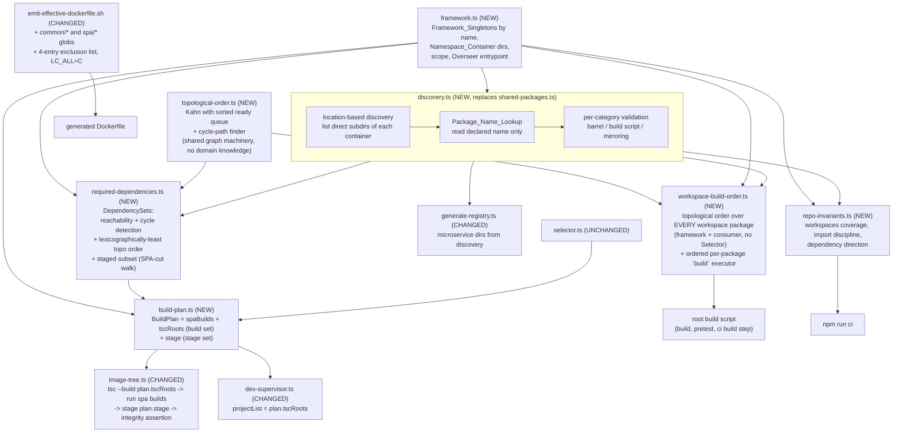

# Design Document

## Overview

Today the Build_System has one classifier and it decides too much. `classify()` in `packages/build-tools/src/shared-packages.ts` reads a candidate's `package.json` and returns a `SharedPackage` when the manifest declares an `@microservices`-scoped `name` with both `main` and `types` and is not the Overseer. That single predicate simultaneously decides four unrelated questions: is this package part of the framework or the consumer's application, is it a library or a service, does it get compiled, and does it ship into an image. Because the predicate reads manifest *shape*, the answers move when a manifest field moves: adding `main`/`types` to `packages/build-tools/` promotes bin-only tooling into every container image, and dropping `types` from a real library silently deletes it from discovery, from the build order, and from the image with no diagnostic.

This design replaces the predicate with a **taxonomy plus two discovery rules**, one per tier:

- **The framework tier is known by name.** A new `packages/build-tools/src/framework.ts` — the Framework_Constants_Module — declares the four Framework_Singletons (`contracts`, `overseer`, `build-tools`, `integration-tests`) with their package names and directories, the three Namespace_Container directories, the workspace scope, and the Overseer entrypoint. It is the only place in `packages/build-tools/src/` where any of those literals appears.
- **The consumer tier is discovered by location.** A new `packages/build-tools/src/discovery.ts` lists the direct subdirectories of `packages/microservices/`, `packages/common/`, and `packages/spa/`. Location alone assigns the category. Manifests are still read, but only to answer questions that are *not* membership: what name does this package declare (the Package_Name_Lookup), and does it satisfy its category's contract (a Common_Package needs a barrel; a Spa_Package needs a `build` script).

Two consequences drive most of the remaining work. First, `contracts` leaves the discovered set and joins the framework tier, so everything that used to fall out of dependency reachability for it — being a `tsc --build` root, being first in build order, being staged into every image — now has to be stated explicitly. Second, `config` moves from `packages/config/` to `packages/common/config/`, which is where a consumer-written library now lives; its consumers change not at all, because they already import it by package name.

The design also introduces the `spa` category with **no content**: a `packages/spa/` container that ships empty, a `packages/spa/*` workspace entry that matches zero directories, and a Bundler_Project Build_Kind that runs a package's own `npm run build` instead of feeding it to `tsc --build`. Everything downstream of discovery — registry generation, the Project_List, the Image_Tree — must tolerate a category with zero members, for every Selector.

Four structural moves do the heavy lifting:

1. **One shared derivation.** A new `build-plan.ts` turns (Selector, Discovery) into a complete `BuildPlan`: the Spa builds to run, the ordered `tsc --build` roots, and the staging list. The Image_Assembler executes the whole plan; the Dev_Server consumes only `plan.tscRoots`. Requirement 13.8 — dev and image roots equal element for element — therefore holds *by construction* rather than by two implementations agreeing. The plan carries **two** dependency sets rather than one: what gets built and what gets staged are separate questions with separate answers (see "Two sets: what is built and what ships").
2. **One integrity assertion, enumerating what is actually there.** The two existing guards (`assertNoUnselectedMicroservice`, `assertNoNonRequiredSharedPackage`) each iterate a *discovered* set and probe for its presence, so anything that leaves the discovered set stops being checked — exactly what happens to `contracts` under this change. The replacement enumerates the real entries under `<outDir>/node_modules/@microservices/` and checks each against the union of Selected_Microservices, the Staged_Dependencies, and the always-staged Framework_Singletons, in both directions.
3. **The platform derives the build order from what packages already declare.** The entry order of the root `workspaces` array stops carrying build-order meaning. A new `workspace-build-order.ts` derives a topological Workspace_Build_Order over *every* workspace package — the four Framework_Singletons and every discovered Consumer_Package — from the `@microservices`-scoped `dependencies` each declares, and the repository-wide build invokes each package's own `build` script in that order (R12.1–R12.9). Declaring a dependency once, in `package.json`, is the whole obligation: no `tsconfig.json` `references`, no `tsc -b` in a consumer, no registration list, no hand-maintained array order (R12.4, R12.14). `contracts`-first and `integration-tests`-last become graph consequences rather than asserted facts, and `common → common` becomes plainly supported (R12.13). What the array still owes is Workspace_Coverage — every workspace package matched by exactly one entry, in any order (R12.15, R12.16).
4. **Loud failures where the old code was silent.** A missing barrel on a Common_Package, a duplicated declared name, a declared name that does not mirror its directory (now for every Consumer_Category, microservices included), an unresolvable specifier, a forbidden dependency edge (`common → spa`, `spa → spa`, or anything into a Microservice_Package), an `import` of a Spa_Package from a Tsc_Project, a dependency cycle in either derivation, a missing `dist/`, an unjustified image entry, and a `workspaces` array that fails to cover a workspace package exactly once all become named, prefixed, non-zero failures. Every new message follows the existing `[selector:unmatched]` / `[shared:unresolved]` style, and the two existing messages are preserved verbatim because Requirements 13.10 and 13.11 pin them.

Runtime behavior does not change. The Overseer mounts the same routers at the same paths, the generated registry imports the same specifiers, and the toggle variables keep their names and semantics (Requirement 14).

### Research findings

Everything below was read in the current tree rather than assumed.

- **`shared-packages.ts`** carries `classify()` (manifest-shape membership), `discoverSharedPackagesFrom` (pure, over an injected listing + `ReadManifest`), and `requiredSharedPackages` (a DFS post-order walk over `@microservices`-scoped `dependencies`, with a `visited` set that makes a cycle *terminate* rather than fail). It declares `WORKSPACE_SCOPE`, `OVERSEER_NAME`, `MICROSERVICES_DIR`, and `PACKAGES_DIR` as its own literals. The pure/impure split (pure core, `discoverSharedPackages()` wrapper supplying `readdirSync`/`readFileSync`) is the pattern to preserve.
- **`image-tree.ts`** declares its own `WORKSPACE_SCOPE`, builds the `tsc --build` argument list inline (`...required`, `...selected`, `"packages/overseer"`), stages with `copyPackage` (`package.json` + `dist`, `dereference: true`), `rmSync(outDir)` *after* the build, and ends with the two assertions. It has its own `readSharedDeps`.
- **`dev-supervisor.ts`** declares `OVERSEER_PACKAGE_DIR`, `WORKSPACE_SCOPE`, and `OVERSEER_ENTRYPOINT` as its own literals and has `readSharedDependencies`, a near-copy of `readSharedDeps` whose doc comment explicitly says it "mirrors" the other one. `projectListFrom` composes `resolveSelected` + `requiredSharedPackages` and re-derives the root order inline — the same order as `image-tree.ts`, by convention rather than by construction. This is the duplication Requirement 13.8 targets.
- **`generate-registry.ts`** owns `listMicroserviceDirectories()` (a third declaration of the microservices container path) and `OUTPUT_PATH`, which embeds `packages/overseer/`. Import specifiers are **directory-derived**: `import * as m${i} from "@microservices/${id}"` where `id` is the directory name. Requirement 14.2 preserves that.
- **`selector.ts`** is already exactly what Requirement 13.1 wants: `resolveSelected(selector, directories)`, total, with `[selector:empty]` and `[selector:unmatched]`. Untouched by this design.
- **`emit-effective-dockerfile.sh`** builds `PKG_DIRS` from `for dir in packages/*/` and `MS_DIRS` from `for dir in packages/microservices/*/`, each guarded by `[ -f "$dir/package.json" ]`, then hands both as comma-separated basename lists to **one** `awk` pass through the environment. The exclusion is inline in awk: `name == "integration-tests" || name == "microservices"`. Failure handling already satisfies Requirement 11.9 — awk writes to a temp file and the shell only `mv`s on success, so a missing anchor leaves any previous `Dockerfile` byte-unchanged. Directory names are taken with `basename` (an external process per directory), and glob expansion order follows the ambient locale, not byte order.
- **Current generated manifest block** (verified by running the script) is: `COPY package.json package-lock.json ./`, then `build-tools`, `config`, `contracts`, `overseer`, then the three microservices — identical at both anchors.
- **Manifests.** `overseer`, `build-tools`, `microservice1` → `@microservices/contracts`; `microservice2`, `microservice3` → `@microservices/config` + `@microservices/contracts`; `config` → `@microservices/contracts`; `integration-tests` → `build-tools`, `contracts`, all three microservices, `overseer`. That last set is what makes `integration-tests` land last in the derived Workspace_Build_Order: it declares specifiers resolving to the Overseer, to `build-tools`, to `contracts`, and to all three microservices, so every one of them precedes it as an ordering edge (R12.2, R12.3). Nothing has to assert its position.
- **`contracts` is not a plain package.** It has an `exports` map with a `./testing` subpath, three tsconfigs (`tsconfig.json` for `src/` → `dist/`, `tsconfig.testing.json` for `testing/` → `dist/testing/` with a project reference, `tsconfig.test.json` as a typecheck-only program), and a two-step `build`. Requirement 5.8 (staged file set byte-identical to today's) therefore includes `dist/testing/`, and promoting `contracts` must not disturb its build scripts — only *who names it as a root*.
- **`npm` tolerates a zero-match workspaces glob.** Verified locally (npm 11.13.0): a root manifest with `"packages/spa/*"` and an empty `packages/spa/` installs with exit 0 and `npm query .workspace` returns the other workspaces. Requirement 9.4 is therefore satisfiable with the entry present from day one, which is what Requirement 9.5 needs.
- **Root `ci` script** is `build --workspaces && typecheck --workspaces && lint --workspaces && npm test && test:types`. It begins with a build, so a check implemented as a compiled `build-tools` bin can be appended safely. That leading `npm run build --workspaces` is what becomes the ordered pass (R12.21): the step disappears from the root scripts entirely, and every gate after it still relies on compiled output being present, which the ordered pass supplies.
- **`scripts/common-startup.js` already performs a Bootstrap_Build** of exactly `@microservices/contracts` and `@microservices/build-tools`, by workspace name, before it runs the compiled registry-generator bin — and its comments record *why* that ordering is forced on a genuinely clean checkout. It is the pattern the repository-wide build reuses to bootstrap the tooling that derives the Workspace_Build_Order (R12.11).
- **Existing build-tools tests** are all pure-function property tests over in-memory layouts, each asserting against an independently written oracle, at `numRuns: 200`. `image-tree-minimality.test.ts` is the one exception: an example test over a real temp `outDir` that pins the exact `assertNoNonRequiredSharedPackage` message.

## Architecture

### Module map



The shape to notice: `framework.ts` is a leaf every other module reads from, and `build-plan.ts` is the single junction where the Selector meets discovery. Nothing downstream of `build-plan.ts` re-derives selection, required dependencies, or ordering.

`workspace-build-order.ts` sits *beside* `build-plan.ts` rather than under it, and that placement is the point: it is the one derivation that is not Selector-scoped. It orders every workspace package — including `build-tools` and `integration-tests`, which no Selector ever justifies — so it cannot be a projection of `plan.tscRoots`. What it does share with `required-dependencies.ts` is the graph machinery, not the graph.

### The two discovery rules

**Framework tier, by name.** `framework.ts` declares one record per Framework_Singleton carrying its package name, its repo-relative directory, where (if anywhere) it is staged, and what position it occupies among the `tsc --build` roots. Membership is a set lookup on the declared name; no manifest is consulted (R1.2, R5.1). The four records are exposed as one ordered, enumerable collection so any check over "every Framework_Singleton" needs no second list (R10.6).

**Consumer tier, by location.** For each of the three Namespace_Containers, list the direct entries; keep those that resolve to a directory and whose name does not begin with `.`; sort by code point; that is the category's membership (R1.3, R2.1–R2.5). Depth is the whole rule, so anything two or more levels down is private content of its nearest depth-1 ancestor — which is precisely how a SPA source directory inside a microservice stays private (R1.4, R9.6). A container that is absent or empty yields the empty set for `common` and `spa` with no diagnostic (R2.6); an absent `packages/microservices/` still fails, preserving today's behavior (R2.7).

`classify()` is deleted. There is no manifest-shape predicate left anywhere in the Build_System.

### Manifests are demoted from gate to lookup

Discovery still reads each discovered Consumer_Package's `package.json`, but never to decide *whether* the package exists or *which* category it belongs to. It reads three things:

| Read | Purpose | Failure mode |
| --- | --- | --- |
| `name` | the Package_Name_Lookup entry, recorded byte-exactly (R3.1) | absent/unreadable/unparsable manifest → fail naming the dir and the condition (R3.4); missing/non-string/blank name → fail (R3.5) |
| `name` vs directory | mirroring check, for every discovered Consumer_Package (R3.6) | mismatch → fail naming dir, declared, expected |
| `main`/`types` (Common), `scripts.build` (Spa) | category contract (R4.1, R4.3) | missing → fail naming the dir and each missing field |
| `dependencies` keys under `@microservices/` | Dependency_Specifiers (R3.10) | resolution failures belong to the Dependency_Resolver |

Resolution is exact, case-sensitive string equality against a recorded declared name or a Framework_Singleton name — never a prefix, alias, version range, path, or directory-derived name (R3.2, R3.3). Duplicate declared names are an injectivity violation and fail the build naming the name and every declaring directory (R3.9).

The inversion worth stating plainly: **the old code used the manifest to decide membership and ignored it otherwise; the new code decides membership without the manifest and then holds the manifest to a contract.** A Common_Package that forgets `types` used to vanish; now it fails the build by name.

### Build_Kind, and what a category is *for*

| Category | Discovery | Build_Kind | `tsc --build` root | Staged under `node_modules/@microservices/` |
| --- | --- | --- | --- | --- |
| `contracts` (framework) | by name | Tsc_Project | always, **first** | always (R5.6) |
| `overseer` (framework) | by name | Tsc_Project | always, **last** | no — staged at `packages/overseer/` |
| `build-tools` (framework) | by name | Tsc_Project | never (bootstrap only) | never |
| `integration-tests` (framework) | by name | Tsc_Project | never | never |
| Microservice_Package | by location | Tsc_Project | iff selected | iff selected (R7.5) |
| Common_Package | by location | Tsc_Project | iff in Required_Dependencies | iff in **Staged_Dependencies** (R7.3) |
| Spa_Package | by location | **Bundler_Project** | **never** (R6.3, R13.4) | iff in **Staged_Dependencies** (R7.4) |

Build_Kind is a total function of the category and reads no manifest field (R6.1, R6.2). The build runs in **two phases, `tsc` first**: the single Tsc_Build_Pass over the ordered roots, and then — only if it exited zero — the Bundler_Build_Phase, one `npm run build` per required Spa_Package in that package's own directory (R6.4, R6.5). Staging is uniform across every category: `package.json` plus the complete `dist/`, nothing else (R6.8).

**Why `tsc` first, and why no interleaving is needed.** A Spa_Package may declare `@microservices/contracts` or a Common_Package in its `dependencies`, and both are Tsc_Projects whose `dist/` has to exist before a bundler resolves the import. So the bundler must run *after* `tsc`. The converse never arises: no Tsc_Project imports a Spa_Package (R14.13), and a Spa_Package has no Barrel to import in the first place (R4.2), so no Spa_Package is ever a compile-time prerequisite of anything (R6.13). The dependency direction between the two Build_Kinds is therefore one-way, and one-way direction needs two phases rather than an interleaved topological schedule across both.

Two consequences fall out with no special case:

- A Common_Package reachable *only* through a Spa_Package is still a required dependency, and `tscRoots` selects it purely by `buildKind === "tsc-project"` — so it is compiled in the Tsc_Build_Pass and its `dist/` exists when the bundler runs (R6.12). Nothing in the *root* derivation asks who reached a required dependency. Staging is where the reaching path does matter: that same Common_Package is not a member of the Staged_Dependencies and ships in no Image_Tree entry (R6.14, R7.13).
- No ordering among the Spa builds is needed, because `spa → spa` is a hard failure (R9.11). `plan.spaBuilds` is therefore a set-like list whose iteration order is irrelevant to correctness, and two Spa_Packages sharing code must share it through a Common_Package both depend on — which lands that code in the Tsc_Build_Pass where it belongs.

### Order, minimality, integrity

The Required_Dependencies are the discovered Consumer_Packages reached transitively from the Selected_Microservices and the Overseer by following `@microservices`-scoped dependencies, with the Selected_Microservices, the Overseer, and every Framework_Singleton excluded (R7.1). A Framework_Singleton specifier — `@microservices/contracts` being the one that matters — *resolves* and is *not* followed and does *not* become a required dependency (R3.7, R5.3, R5.7).

Order is now canonical, not incidental. Today's DFS post-order is topological but its tiebreak depends on root visit order; R7.2 additionally requires unrelated packages to appear in lexicographic directory order. The resolver therefore runs two phases to produce the build set: a coloured DFS that collects the reachable subgraph and *fails* on a cycle naming every participant (R7.10 — today's `visited` set silently terminates instead), then Kahn's algorithm over the induced subgraph with a lexicographically-ordered ready queue, which yields the unique lexicographically-least topological order. A third phase derives the stage set from what those two already collected — see below.

Minimality still holds by construction: only plan members are ever copied and nothing is pruned afterwards (R7.6). The Integrity_Assertion changes from *probing a known set* to *enumerating the actual tree*, which is what keeps `contracts` checked after it leaves the discovered set (R7.7, R7.9). It reports every unjustified entry and every missing staged entry, naming all of them (R7.8, R7.11).

### Two sets: what is built and what ships

Reachability answers two questions that are not the same question. *What has to be compiled before the build can finish?* and *what has to be present in the container at runtime?* One set answering both is one set too few, so the resolver returns two:

- **Required_Dependencies** — the **build set**, unchanged in definition (R7.1): every discovered Consumer_Package reached transitively from the Selected_Microservices and the Overseer. Everything in it is built. `tscRoots` and `spaBuilds` are derived from it and from nothing else (R6.3, R6.4, R6.12).
- **Staged_Dependencies** — the **stage set** (R7.14): the subset reached from those same roots by a traversal that **arrives at** a Spa_Package but does **not expand** a Spa_Package's outgoing specifiers. `stage` is derived from it (R7.3, R7.4).

Three consequences, in the order a reader is likely to ask about them:

- **A Common_Package reached only via a Spa_Package is built but never staged** (R6.14, R7.13). It has to be built, because the bundler needs its `dist/` to resolve the import. It must not ship, because after bundling nothing at runtime can reach it.
- **A Common_Package reached both directly and via a SPA is in both sets.** Membership is a disjunction over the paths that reach a package, not a label the package carries: one qualifying path is enough. `packages/common/config` on the current tree is reached directly by `microservice2` and `microservice3`, so it is in both sets.
- **A required Spa_Package is in both sets.** The traversal stops *after* arriving, not before, because the Spa_Package's bundled assets are precisely what a runtime serves (R9.7).

The justification for cutting the walk at a Spa_Package is R9.12: a Spa_Package's build output must be self-contained, every module its bundled assets need resolving from within that output. Given that obligation, nothing at runtime can reach a Common_Package the bundler consumed, so staging it would ship bytes no process can load.

**Why two traversals rather than one flag-propagating traversal.** The tempting shape is a single walk that carries a "reached through a SPA" flag and marks each node on first visit. That is wrong, and not marginally: a node can be reached both through a SPA and not through one, and which happens *first* depends on visit order, so a flag set on first visit records an accident of traversal rather than a property of the graph. The property is a disjunction over reaching paths — "some path to this node expands no Spa_Package" — and a second walk restricted to non-SPA expansion expresses exactly that disjunction, with no ordering sensitivity and no flag to reconcile when the two answers disagree. It is also independently property-testable: the stage set has its own oracle (Property 31) that does not have to be threaded through the build set's oracle.

### Residual imprecision — self-containment is required but not verified

R9.12 obliges a Spa_Package to emit a self-contained build output, and the Build_System takes that obligation on trust: no mechanical check verifies it. That is a deliberate choice, not an oversight, and the option that was rejected is worth recording.

Scanning a Spa_Package's `dist/` for surviving `@microservices/` specifiers was considered and rejected. Such a specifier can appear in a source map, or in a string literal in the SPA's own source, and in both cases it is harmless — so the scan produces false positives. On a build gate a false positive is a worse outcome than the risk the gate guards against: it fails builds that are correct, and the only way past it is to disable the gate.

The consequence, stated plainly: a Spa_Package whose bundler is configured to externalize a workspace dependency fails at **runtime** rather than at build time, because the stage set deliberately does not ship what that bundler chose not to inline. Keeping the bundler configured to inline its workspace dependencies is the Spa_Package author's responsibility, and requirements.md records this under "Accepted Imprecisions" rather than leaving it as an unexamined consequence.

### Migration shape

`packages/config/` becomes `packages/common/config/` (R8). Its `tsconfig.json` `extends` deepens by one level; its manifest, barrel, and tests are unchanged; `microservice2` and `microservice3` change not at all, because a Common_Package is imported by declared name and never by path (R8.6, R14.4). `packages/spa/` is created with no members (R9.2), and the root `workspaces` array gains `common/*` and `spa/*` and loses `packages/config` (R8.4) — a change to the *set* of entries it declares, which is now the only thing about that array the Build_System cares about (R12.15, R12.16). The array's order stops being load-bearing: the repository-wide build takes its visiting order from the derived Workspace_Build_Order instead (R12.7, R12.21), and `npm run ci` guards the array with a Workspace_Coverage check rather than an ordering check (R12.17).

## Pipeline walkthrough

Plain text rather than a diagram, and every step names the file it lives in, so a reader can go from a line here straight to the code. Two levels: the per-directory loop discovery runs, and the end-to-end pipeline the loop sits inside.

### (a) The per-directory discovery loop

```
for each Namespace_Container in NAMESPACE_CONTAINER                  [framework.ts]
    list its direct entries                                          [discovery.ts  listContainer]
        absent container?
            "microservices" -> FAIL [discovery:container-missing]     (R2.7)
            "common" / "spa" -> zero members, no diagnostic           (R2.6)
        skip entries that do not resolve to a directory               (R2.4, R9.8)
        skip entries whose name starts with "."                       (R2.4)
        sort the survivors by ascending code point                    (R2.5)
        -> one ConsumerPackage per survivor, category = the container  (R1.3)
           buildKind = buildKindOf(category), reading no manifest      (R6.1, R6.2)
        never descend: depth 2 and below is private content            (R1.4, R9.6)

    read that package's own package.json                             [discovery.ts  readManifest]
        absent / unreadable / unparsable -> collect offender           (R3.4)
        record the declared `name` byte-exactly    (Package_Name_Lookup, R3.1)
        collect its @microservices-scoped `dependencies` keys          (R3.10)

    validate in fixed stages, each collecting EVERY offender          [discovery.ts]
    before failing, so one run reports as much as it can              (R4.7)
        1. manifest readability   -> [discovery:manifest]
        2. `name` validity        -> [discovery:name]                  (R3.5)
        3. name mirrors directory -> [discovery:mirror]  EVERY category (R3.6)
        4. name uniqueness        -> [discovery:duplicate]             (R3.9)
        5. category contract      -> [barrel:invalid]
             common: `main` and `types` non-empty                      (R4.1)
             spa:    `scripts.build` non-empty                        (R4.3)
             microservice: nothing checked; `tsc` is the late gate      (R4.5)

-> Discovery { byCategory, nameByDir, byName }                        [discovery.ts]
```

No Framework_Singleton is ever reached by this loop: a framework directory is a direct child of `packages/`, never a child of a Namespace_Container (R1.6, R5.2).

### (b) The end-to-end build pipeline

The image path, in order. **Can fail** marks a step that aborts the run.

```
 1. framework directories present?          [framework.ts  assertFrameworkDirectoriesPresent]
                                            called from [image-tree.ts  buildImageTree]
                                            CAN FAIL  [framework:missing]          (R10.7)

 2. discovery + per-category validation     [discovery.ts  discoverPackages]
                                            CAN FAIL  see loop (a)          (R2.7, R3.x, R4.x)

 3. registry generation                     [generate-registry.ts  generateRegistry]
                                            writes packages/overseer/src/generated/…
                                            downstream of step 2 so a bad manifest
                                            emits no registry                       (R3.4)
                                            CAN FAIL  [selector:unmatched]          (R14.2)

 4. selector resolution                     [selector.ts  resolveSelected]
                                            called from [build-plan.ts  buildPlanFrom]
                                            CAN FAIL  [selector:empty] / [selector:unmatched]
                                                                              (R13.1, R13.10)

 5. dependency sets                         [required-dependencies.ts]
      phase 1  reachability + cycle detect    reachableSubgraph
                 resolve each specifier        resolveSpecifiers
                   framework name -> resolved, not followed, not a member  (R3.7, R5.3)
                   declared name  -> the ConsumerPackage                   (R3.2)
                   microservice target -> CAN FAIL  [deps:peer]      (R7.12, R14.5)
                   common -> spa       -> CAN FAIL  [deps:common-to-spa]      (R8.13)
                   spa    -> spa       -> CAN FAIL  [deps:spa-to-spa]         (R9.11)
                   no match       -> CAN FAIL  [shared:unresolved]            (R3.8)
                 grey re-entry    -> CAN FAIL  [deps:cycle]                  (R7.10)
                 records rootReached: members reached directly from the roots
      phase 2  lexicographically-least order   topologicalOrder
                 Kahn over the induced subgraph, ready queue sorted          (R7.2)
                 -> the BUILD set (Required_Dependencies)                    (R7.1)
      phase 3  staged subset                   stagedSubset
                 re-walk the ALREADY-COLLECTED subgraph from rootReached;
                 no new manifest read, no new I/O
                 expand a member's edges only when category !== "spa":
                   arrive at a Spa_Package -> member, do not continue        (R7.14, R9.7)
                 -> the STAGE set (Staged_Dependencies), in required order    (R7.13)
      -> resolveDependencySets() = { required, staged }

 6. plan derivation                         [build-plan.ts  buildPlanFrom]
      spaBuilds  = REQUIRED where buildKind === "bundler-project"            (R6.4)
      tscRoots   = contracts, REQUIRED tsc-projects, selected, overseer      (R6.3, R6.6, R6.12)
      stage      = always-staged framework + STAGED + selected + overseer    (R7.3–R7.5, R6.14)

 7. Tsc_Build_Pass                          [image-tree.ts  executeBuildPlan]
      one `npx tsc --build …plan.tscRoots`
      CAN FAIL  non-zero exit; nothing staged                         (R6.10)

 8. Bundler_Build_Phase                     [image-tree.ts  executeBuildPlan]
      one `npm run build` per plan.spaBuilds member, cwd = its own dir (R6.4)
      entered only after step 7 exited zero                            (R6.5)
      CAN FAIL  non-zero exit; nothing staged                          (R6.9)

 9. build-output assertion                  [image-tree.ts  assertBuildOutputsPresent]
      CAN FAIL  [image-tree:framework-output] / [image-tree:no-dist]   (R5.9, R6.11)

10. staging                                 [image-tree.ts  stageImageTree]
      rmSync(outDir), then one copyPackage per plan.stage member
      package.json + dist/ only, dereferenced to real directories      (R6.8, R5.6)

11. integrity assertion                     [image-tree.ts  assertImageTreeIntegrity]
      enumerate the real node_modules/@microservices/ entries
      CAN FAIL  [image-tree:unjustified] / [image-tree:missing]     (R7.7–R7.11)
```

**The single most important ordering fact: every step that can fail does so before the first byte is staged.** Steps 1–9 all precede step 10, which is why "stages no package" holds for a failed Tsc_Build_Pass (R6.10), a failed Bundler_Build_Phase (R6.9), a missing `dist/` (R5.9, R6.11), and a dependency cycle (R7.10) with no rollback path anywhere in the assembler. Step 3 is the one emitter that runs mid-sequence, and it sits after step 2 precisely so R3.4's "no generated Microservice_Registry" holds.

### The other entry paths

**Dev.** `[dev-supervisor.ts  projectListFrom]` runs steps 1–6 and then consumes `plan.tscRoots` and nothing else. There is no Bundler_Build_Phase on this path: a Spa_Package under development runs its own dev server, which does its own watching and its own bundling, so the supervisor has nothing useful to invoke for it (R13.4). Steps 7–11 have no dev counterpart at all — the Build_Watcher compiles in place and the Overseer runs from `packages/overseer/dist/index.js`, so nothing is staged.

**Repository-wide build.** `[workspace-build-order.ts  runOrderedBuildCli]`, reached through `[src/bin/build-workspaces.ts]` and the root `build` script (and through it `pretest` and the `ci` build step). It shares steps 1 and 2 with the image path and then diverges completely: it consults no Selector, derives the Workspace_Build_Order over *every* workspace package, and invokes each package's own `build` script in that order. It has no counterpart to steps 3–11 — it generates no registry, computes no plan, and stages nothing. It is also the one path that must bootstrap itself, because the module deriving the order is compiled output; see component 9.

**CI.** `[repo-invariants.ts  runRepoInvariantsCli]`, reached through `[src/bin/check-repo-invariants.ts]` and the root `check:invariants` script. It runs its own discovery and then three independent static checks over the repository rather than the build pipeline; it produces no build output and stages nothing.

**Pre-install.** `[scripts/emit-effective-dockerfile.sh]` is a separate path entirely and shares no code with the above: it must run on a fresh clone before anything is installed or compiled, so it cannot import `framework.ts` and re-declares the container directories and the Exclusion_List as shell literals (R11.7). See component 10.

## Dependency edges

Every possible edge between the categories, and where each verdict is enforced. "Edge" here means a `dependencies` entry, which is a different question from whether an `import` is permitted — the two rows where those answers differ are called out explicitly.

The third column answers "is this edge allowed"; the fourth answers the separate question the two dependency sets create — **does traversing this edge justify staging its target**.

| Edge | Allowed? | Enforced where | Does the edge stage its target? |
| --- | --- | --- | --- |
| `spa → contracts` | yes | — resolves as a Framework_Singleton, not followed, never a required dependency (`required-dependencies.ts` `resolveSpecifiers`, R3.7) | irrelevant — `contracts` is always staged on Framework_Singleton grounds (R5.6) |
| `spa → common` | yes | — the sanctioned way two Spa_Packages share code; the target is compiled in the Tsc_Build_Pass (R6.12) | **no — built but not staged**, unless some non-SPA path also reaches the target (R6.14, R7.13) |
| `microservice → contracts` | yes | — as `spa → contracts` | irrelevant — always staged (R5.6) |
| `microservice → common` | yes | — | yes (R7.3) |
| `common → contracts` | yes | — | irrelevant — always staged (R5.6) |
| `common → common` | **yes** (R8.9) | — nothing rejects it. The derived Workspace_Build_Order places the resolved Common_Package ahead of the declaring one, so its compiled output exists under `node_modules` before the declarer's `build` runs; both packages matching the single `packages/common/*` glob is irrelevant, because the array's order carries no build-order meaning (R12.13, R12.14, R12.19) | yes, when the declaring Common_Package is itself on a staged path (R7.14) |
| `overseer → contracts` | yes | — | irrelevant — always staged (R5.6) |
| `overseer → common` | yes | — | yes (R7.3) |
| `microservice → spa` | yes, **dependency only, never imported** | staging and npm linking only, no `tsc --build` ordering (`build-plan.ts`, R9.9); the import ban is `repo-invariants.ts` `checkImportDiscipline` → `[imports:spa]` (R14.13) | yes — the traversal arrives at the Spa_Package and stops there; its bundled assets are what a runtime serves (R7.4, R9.7) |
| `overseer → spa` | same as above | same as above | same as above |
| `common → spa` | **no** | `required-dependencies.ts` `resolveSpecifiers` → `[deps:common-to-spa]` (R8.13) | n/a — the build fails |
| `spa → spa` | **no** | `required-dependencies.ts` `resolveSpecifiers` → `[deps:spa-to-spa]` (R9.11) | n/a — the build fails |
| `spa → microservice` | **no** | `required-dependencies.ts` `resolveSpecifiers` → `[deps:peer]`, reworded to name the declarer without attributing a category to it (R7.12) | n/a — the build fails |
| `microservice → microservice` | **no** | `required-dependencies.ts` `resolveSpecifiers` → `[deps:peer]` (R7.12, R14.5); the import ban is `checkImportDiscipline` → `[imports:peer]` (R14.5) | n/a — the build fails |
| `common → microservice`, `common → overseer` | **no** | `resolveSpecifiers` → `[deps:peer]` for the microservice target; `repo-invariants.ts` `checkDependencyDirection` → `[deps:direction]` for both (R8.9) | n/a — the build fails |
| any → `build-tools`, any → `integration-tests` | n/a | never discovered and in no Consumer_Category; the specifier resolves as a Framework_Singleton and is not followed (R3.7). `integration-tests` depends on almost everything and is last in the Workspace_Build_Order for that reason | never staged (`staging: "none"`) |
| any cycle, of any length | **no** | `required-dependencies.ts` `reachableSubgraph` → `[deps:cycle]`, naming every participant (R7.10) | n/a — the build fails |

Two organizing principles generate every row above, and they are worth stating separately from the table because they are what a reviewer should check a new edge against.

**A Spa_Package is a sink in the code-import graph.** Nothing imports it — it has no Barrel to import (R4.2) and its output is a directory of bundled assets, not a module surface — and it imports downward only, to `contracts` and to Common_Packages. That is what makes `common → spa` and `spa → spa` failures rather than merely discouraged: an edge *into* a Spa_Package from something that compiles would be an import of a package with no importable API, and an edge between two Spa_Packages is shared code in the wrong place. It is also what makes the two-phase build order sound (R6.13), and what lets `microservice → spa` be a real `dependencies` entry with no compile-time consequence: npm links it and the assembler stages it, but no `import` specifier ever names it, so it constrains no build order (R9.9).

**Being a sink is also why nothing downstream of a Spa_Package ships.** The same closure that makes a Spa_Package unimportable makes its own dependencies unreachable at runtime: R9.12 requires the bundle to be self-contained, so once the bundler has run, the only thing a runtime can load is the Spa_Package's own build output. A Common_Package the bundler consumed has no caller left — the code that used to import it now *is* the bundle — so staging it would ship bytes no process can reach. That is the whole content of the Staged_Dependencies cut: the traversal stops at a Spa_Package for the same reason the import graph stops there. The one asymmetry to keep in mind is that the *build* graph does not stop: the bundler needs that Common_Package's `dist/` to exist in order to inline it, which is why the package is a Tsc_Build_Pass root it never ships as (R6.12, R6.14).

**A Microservice_Package is never a dependency target.** Not from a peer, not from a Common_Package, not from a Spa_Package, not from the Overseer — which is why one error, `[deps:peer]`, covers every declarer and why R7.12 requires its wording to attribute no category to the declarer. The Overseer reaches a microservice through the *generated registry* rather than through a `dependencies` entry, and that is the only inbound path a microservice has.

## Components and Interfaces

### 1. `packages/build-tools/src/framework.ts` (new) — the Framework_Constants_Module

The single declaration site for every framework name, every framework directory, every Namespace_Container directory, the workspace scope, and the Overseer entrypoint (R10.1, R10.5). Every other module under `packages/build-tools/src/` references these bindings and declares none of these literals itself (R10.2, R10.3, R10.4).

```ts
/** The npm scope every workspace package of this repository lives under. */
export const WORKSPACE_SCOPE = "@microservices";

/** The directory every workspace package lives under, repo-relative. */
export const PACKAGES_DIR = "packages";

/** Where the Image_Assembler stages a Framework_Singleton, if anywhere. */
export type FrameworkStaging =
  /** A real directory at `<outDir>/node_modules/@microservices/<dirName>`. */
  | "scoped-node-modules"
  /** A real directory at `<outDir>/<packageDir>` (the Overseer, invoked by path). */
  | "package-dir"
  /** Never staged into an image. */
  | "none";

/** Where a Framework_Singleton sits among the ordered `tsc --build` roots. */
export type FrameworkBuildPosition =
  /** Always the first root, ahead of every other Tsc_Project (R5.5). */
  | "first"
  /** Always the last root; its generated registry imports the microservices. */
  | "last"
  /** Never a root of the image/dev build (bootstrap or test-only tooling). */
  | "excluded";

/** A package of the scaffold itself, known to the Build_System by name. */
export interface FrameworkSingleton {
  /** Declared package name, e.g. "@microservices/contracts". */
  readonly name: string;
  /** Directory name under `packages/`, e.g. "contracts". */
  readonly dirName: string;
  /** Repo-relative package directory, e.g. "packages/contracts". */
  readonly packageDir: string;
  readonly staging: FrameworkStaging;
  readonly buildPosition: FrameworkBuildPosition;
}

export const CONTRACTS: FrameworkSingleton;         // staging: scoped-node-modules, build: first
export const OVERSEER: FrameworkSingleton;          // staging: package-dir,        build: last
export const BUILD_TOOLS: FrameworkSingleton;       // staging: none,               build: excluded
export const INTEGRATION_TESTS: FrameworkSingleton; // staging: none,               build: excluded

/**
 * Every Framework_Singleton, in a fixed repeatable order and containing exactly
 * the four entries above (R10.6). Any check over "every Framework_Singleton"
 * iterates this rather than restating a list.
 */
export const FRAMEWORK_SINGLETONS: readonly FrameworkSingleton[];

/** Framework_Singleton for an exact, case-sensitive package name (R3.7). */
export function frameworkSingletonByName(name: string): FrameworkSingleton | undefined;

/**
 * The `dirName`s the Integrity_Assertion accepts under
 * `node_modules/@microservices/` on Framework_Singleton grounds alone — i.e.
 * every singleton whose `staging` is "scoped-node-modules" (R5.10, R7.7).
 */
export const ALWAYS_STAGED_SCOPED_ENTRIES: readonly string[];

/** The Overseer's compiled entrypoint, composed from OVERSEER.packageDir (R10.1). */
export const OVERSEER_ENTRYPOINT: string; // "packages/overseer/dist/index.js"

/** A Consumer_Category: the kind a consumer-written package belongs to. */
export type ConsumerCategory = "microservice" | "common" | "spa";

/** Every Consumer_Category, in a fixed order, for exhaustive iteration. */
export const CONSUMER_CATEGORIES: readonly ConsumerCategory[];

/** The Namespace_Container directory of each Consumer_Category (R10.1). */
export const NAMESPACE_CONTAINER: Readonly<Record<ConsumerCategory, string>>;
// { microservice: "packages/microservices", common: "packages/common", spa: "packages/spa" }

/**
 * Fail when a Framework_Singleton's declared directory is absent (R10.7). Pure
 * over an injected existence predicate so it is testable without a filesystem;
 * the real-filesystem caller passes `existsSync`.
 *
 * @throws `[framework:missing]` naming every absent singleton and its directory.
 */
export function assertFrameworkDirectoriesPresent(
  exists: (packageDir: string) => boolean,
): void;
```

Two literals that used to live elsewhere are now *composed* here rather than restated: `OVERSEER_ENTRYPOINT` is built from `OVERSEER.packageDir` (it was a standalone string in `dev-supervisor.ts`), and `generate-registry.ts`'s `OUTPUT_PATH` becomes `join(OVERSEER.packageDir, "src/generated/microservice-registry.ts")`. Both otherwise embed `packages/overseer` a second time and would violate R10.5.

`WORKSPACE_SCOPE`, `PACKAGES_DIR`, and the container directories are deleted from `shared-packages.ts` (which is itself deleted), `image-tree.ts`, `dev-supervisor.ts`, and `generate-registry.ts`. R10.5 is a review-upheld convention — no scanner enforces it, per the requirement — but the convention is cheap to check by eye because every one of these literals now appears exactly once in a file whose entire purpose is to declare it.

### 2. `packages/build-tools/src/discovery.ts` (new, replaces `shared-packages.ts`)

Location-based discovery, the Package_Name_Lookup, and per-category validation. Pure over injected inputs, following the existing pure-core / effect-shell split (`discoverPackagesFrom` is the core; `discoverPackages` supplies real filesystem readers).

```ts
/** How a package's build output is produced (R6.1, R6.2). */
export type BuildKind = "tsc-project" | "bundler-project";

/** A discovered Consumer_Package. */
export interface ConsumerPackage {
  readonly category: ConsumerCategory;
  /** Directory name inside its Namespace_Container, e.g. "config". */
  readonly dirName: string;
  /** Repo-relative package directory, e.g. "packages/common/config". */
  readonly packageDir: string;
  /** The exact `name` its own package.json declares (R3.1). */
  readonly name: string;
  /** `@microservices`-scoped `dependencies` keys, sorted (R3.10). */
  readonly dependencySpecifiers: readonly string[];
  /** Derived from `category` alone (R6.1, R6.2). */
  readonly buildKind: BuildKind;
}

/** The result of one discovery run. */
export interface Discovery {
  /** Members of each category, ordered by ascending code point of dirName (R2.5). */
  readonly byCategory: Readonly<Record<ConsumerCategory, readonly ConsumerPackage[]>>;
  /**
   * The Package_Name_Lookup keyed by repo-relative package directory (R3.1).
   * Its values are the exact declared strings.
   */
  readonly nameByDir: ReadonlyMap<string, string>;
  /**
   * The resolution index: declared name -> package. Injective, because a
   * duplicate declared name fails discovery (R3.9). This is what a
   * Dependency_Specifier is matched against (R3.2, R3.3).
   */
  readonly byName: ReadonlyMap<string, ConsumerPackage>;
}

/** One direct entry of a Namespace_Container, as the lister reports it. */
export interface ContainerEntry {
  readonly name: string;
  readonly isDirectory: boolean;
}

/**
 * List the direct entries of a Namespace_Container. Returns `undefined` when the
 * container directory is absent — which is tolerated for `common` and `spa`
 * (R2.6) and fatal for `microservices` (R2.7).
 */
export type ListContainer = (containerDir: string) => readonly ContainerEntry[] | undefined;

/** The outcome of reading one package manifest; the three failure kinds are
 *  distinguished because R3.4 requires the error to say which occurred. */
export type ManifestRead =
  | { readonly kind: "ok"; readonly manifest: PackageManifest }
  | { readonly kind: "absent" }
  | { readonly kind: "unreadable" }
  | { readonly kind: "unparsable" };

/** The manifest fields discovery reads. Nothing here decides membership. */
export interface PackageManifest {
  readonly name?: unknown;
  readonly main?: unknown;
  readonly types?: unknown;
  readonly scripts?: Readonly<Record<string, unknown>>;
  readonly dependencies?: Readonly<Record<string, string>>;
}

export type ReadManifest = (packageDir: string) => ManifestRead;

/**
 * Discover every Consumer_Package by location, record the Package_Name_Lookup,
 * and validate each category's contract. Pure over its two injected readers, so
 * it is property-testable against in-memory layouts.
 *
 * Category membership is decided by the container the entry sits in and nothing
 * else: no field of any manifest participates (R1.3, R1.5, R2.8, R2.9). A
 * Framework_Singleton is never a container member, and a container entry whose
 * declared name collides with a Framework_Singleton name fails the mirroring or
 * duplicate check rather than being admitted (R1.6, R2.10, R5.2).
 *
 * @throws `[discovery:container-missing]` when `packages/microservices` is absent (R2.7).
 * @throws `[discovery:manifest]` for absent/unreadable/unparsable manifests (R3.4).
 * @throws `[discovery:name]` for a missing, non-string, or blank `name` (R3.5).
 * @throws `[discovery:mirror]` when ANY discovered Consumer_Package's declared
 *   name does not mirror its directory — Microservice_Packages included (R3.6).
 * @throws `[discovery:duplicate]` when two packages declare the same name (R3.9).
 * @throws `[barrel:invalid]` for a Common_Package without `main`/`types` or a
 *   Spa_Package without a `build` script, naming every offender (R4.1, R4.3, R4.7).
 */
export function discoverPackagesFrom(
  listContainer: ListContainer,
  readManifest: ReadManifest,
): Discovery;

/** Real-filesystem discovery: `readdirSync(withFileTypes)` + `readFileSync`. */
export function discoverPackages(): Discovery;

/** Build_Kind from category alone; total over the union (R6.1, R6.2). */
export function buildKindOf(category: ConsumerCategory): BuildKind;

/**
 * The `@microservices`-scoped `dependencies` keys of the workspace at
 * `packageDir`. THE single reader for microservice, Overseer, and Common/Spa
 * roots — `image-tree.ts`'s `readSharedDeps` and `dev-supervisor.ts`'s
 * `readSharedDependencies` are both deleted in favour of this one, so the two
 * build paths cannot read dependencies differently.
 */
export function readDependencySpecifiers(packageDir: string): readonly string[];
```

**Validation pipeline and its ordering.** Validation runs in fixed stages, each collecting *every* offender before failing, so output is deterministic and a single run reports as much as it can (R4.7):

1. manifest readability → `[discovery:manifest]`, offenders sorted by `packageDir`
2. `name` validity → `[discovery:name]`, sorted by `packageDir`
3. mirroring, **every** discovered Consumer_Package — Microservice_Packages included → `[discovery:mirror]`, sorted by `packageDir`
4. name uniqueness → `[discovery:duplicate]`, sorted by name then `packageDir`
5. category contract, Common barrel *and* Spa `build` script together in one failure → `[barrel:invalid]`, sorted by `(dirName, packageDir)`

Stage 5 combines Requirement 4's criterion 1 and criterion 3 into one thrown error because R4.7 requires every criterion-1-or-3 offender to be reported "within one failure". `packageDir` is the tiebreak on equal `dirName`, since two containers may hold same-named directories.

**Stage 3 is category-blind; only stage 5 is category-scoped.** R3.6 applies the mirroring check to every discovered Consumer_Package of all three categories, so a Microservice_Package whose declared name diverges from its directory name fails here, naming the directory, the declared name, and the expected name. Microservice_Packages remain exempt from **stage 5 alone** — no barrel and no build-script contract is applied to them (R4.5) — and Framework_Singletons are exempt from both stages, never being container members in the first place (R4.6). A microservice that is not a usable *module* still fails later at `tsc` on the generated static import, exactly as today; what stage 3 now catches is the narrower, entirely mechanical case of a manifest whose `name` disagrees with its directory.

Why that case has no valid outcome is worth stating, because it is the reason the check belongs at discovery: npm links a microservice under its **declared** name, while the generated Microservice_Registry imports the **directory-derived** name (R14.2) and the Image_Assembler stages the package at the directory-derived path. A divergence therefore satisfies nothing — it is not a configuration with different-but-workable behavior, it is a build that cannot resolve. On the current tree the check is vacuous: all three microservices already mirror their directories, so extending stage 3 is behavior-neutral for any repository that was valid before.

**Design decision — why `ManifestRead` is a union.** The current `ReadManifest` returns `PackageManifest | undefined`, collapsing "no file", "unreadable", and "invalid JSON" into one value. That was fine when the manifest was a membership gate (all three meant "not a shared package"); R3.4 requires the error to say which occurred, so the reader now reports the three separately.

### 3. `packages/build-tools/src/required-dependencies.ts` (new) — the Dependency_Resolver

```ts
/** Read the `@microservices`-scoped `dependencies` keys of a package dir. */
export type ReadDependencies = (packageDir: string) => readonly string[];

/**
 * The Required_Dependencies: the discovered Consumer_Packages reached
 * transitively from the Selected_Microservices and the Overseer through
 * `@microservices`-scoped Dependency_Specifiers, excluding the
 * Selected_Microservices, the Overseer, and every Framework_Singleton (R7.1),
 * returned in the lexicographically-least topological order (R7.2).
 *
 * Resolution of one specifier, in order:
 *   1. equals a Framework_Singleton name -> resolved, not followed, not a member
 *      (R3.7, R5.3, R5.7);
 *   2. equals a recorded declared name -> the discovered Consumer_Package
 *      (R3.2, R3.3);
 *   3. otherwise unresolved -> `[shared:unresolved]` (R3.8), message preserved
 *      verbatim from the current implementation because R13.11 pins it.
 *
 * Three specifier targets are rejected outright, by the declaring package's
 * category rather than by the target alone (see "Dependency edges"):
 *   - any package -> Microservice_Package: `[deps:peer]` (R7.12, R14.5). A
 *     Microservice_Package is never a dependency target, so ONE error covers
 *     every declarer, and its wording names the declaring package's
 *     repo-relative directory and the offending specifier while attributing NO
 *     category to the declarer — R7.12 requires wording that holds when the
 *     declarer is a Spa_Package or a Common_Package, not only a peer.
 *   - Common_Package -> Spa_Package: `[deps:common-to-spa]` (R8.13). A
 *     Common_Package points downward only, and a Spa_Package is not downward of
 *     anything.
 *   - Spa_Package -> Spa_Package: `[deps:spa-to-spa]` (R9.11). The message must
 *     state that code shared between two Spa_Packages belongs in a Common_Package
 *     both of them depend on.
 *
 * The recursion needs no change to admit `microservice -> spa -> common`. The
 * `visit` inside `reachableSubgraph` is category-agnostic and discovery records
 * `dependencySpecifiers` for every Consumer_Package regardless of category, so a
 * Spa_Package's own dependencies are followed exactly like a Common_Package's.
 * That is the property that makes R6.12 possible: a Common_Package reached only
 * through a Spa_Package lands in the Required_Dependencies like any other, and
 * `tscRoots` then picks it up on Build_Kind alone. Whether that package also
 * SHIPS is a separate question the build set does not answer — see
 * `stagedSubset` below (R6.14, R7.13).
 *
 * Phases 1 and 2 produce the build set. A three-colour depth-first walk collects
 * the reachable subgraph and its edges, and raises `[deps:cycle]` on a grey
 * re-entry, naming every package on the cycle — today's `visited` set makes a
 * cycle terminate silently, which R7.10 forbids. Then Kahn's algorithm over the
 * induced subgraph with a lexicographically-ordered ready queue emits the unique
 * lexicographically-least topological order, which satisfies both clauses of
 * R7.2 (dependency-before-dependent, and lexicographic among unrelated
 * packages) and makes the result identical across runs by construction.
 *
 * This function is a thin wrapper returning `resolveDependencySets(...).required`
 * so every existing caller and every shipped property test keeps working.
 *
 * @param selected the Selected_Microservices, in Selector order.
 * @param discovery the discovery result; supplies both members and the name index.
 * @param readDependencies reads the root consumers' specifiers (microservice
 *   dirs and the Overseer dir); Consumer_Package edges come from discovery.
 * @throws `[shared:unresolved]`, `[deps:peer]`, `[deps:common-to-spa]`,
 *   `[deps:spa-to-spa]`, `[deps:cycle]`.
 */
export function requiredDependencies(
  selected: readonly string[],
  discovery: Discovery,
  readDependencies: ReadDependencies,
): readonly ConsumerPackage[];

/**
 * What phase 1 collects. `members` and `edges` are what phase 2 orders;
 * `rootReached` is new and is what phase 3 starts from.
 *
 * Phase 1 already computes the root edges — it resolves each root's specifiers
 * before it recurses — but discards them once it has seeded the walk. It now
 * RECORDS them, because the stage-set walk needs the same seed and must not
 * re-read a manifest to get it.
 */
export interface Subgraph {
  /** Every reachable discovered Consumer_Package, unordered. */
  readonly members: readonly ConsumerPackage[];
  /** `packageDir` -> the member `packageDir`s it declares a specifier for. */
  readonly edges: ReadonlyMap<string, readonly string[]>;
  /**
   * The member `packageDir`s a Selected_Microservice or the Overseer names
   * DIRECTLY — the roots' own resolved specifiers, before any recursion. The
   * seed of the Staged_Dependencies traversal (R7.14).
   */
  readonly rootReached: readonly string[];
}

/**
 * Phase 3: the Staged_Dependencies (R7.14). A second walk over the
 * ALREADY-COLLECTED subgraph — no new manifest read, no new filesystem access,
 * no re-resolution, and therefore no new failure mode: every specifier was
 * already resolved or rejected in phase 1.
 *
 * Start from `subgraph.rootReached` and expand a member's `edges` only when that
 * member's `category !== "spa"`. A Spa_Package is therefore ARRIVED AT and
 * included, and not expanded, so a Consumer_Package reachable only by way of a
 * Spa_Package is absent from the result (R6.14, R7.13) while one reachable both
 * ways is present — membership is a disjunction over reaching paths, not a label
 * on a package.
 *
 * The result preserves the relative order of `required`, so it is a subsequence
 * of it and inherits the lexicographically-least topological order (R7.2, R7.13)
 * without a second sort.
 *
 * @param subgraph phase 1's output, including `rootReached`.
 * @param required phase 2's output, which fixes the returned order.
 */
export function stagedSubset(
  subgraph: Subgraph,
  required: readonly ConsumerPackage[],
): readonly ConsumerPackage[];

/**
 * The pair the rest of the Build_System consumes. Two sets, because "what is
 * built" and "what ships" are different questions (see "Two sets: what is built
 * and what ships"): `tscRoots` and `spaBuilds` derive from `required`, `stage`
 * derives from `staged`.
 */
export interface DependencySets {
  /** The BUILD set: every reachable discovered Consumer_Package (R7.1, R7.2). */
  readonly required: readonly ConsumerPackage[];
  /**
   * The STAGE set: the subset reached without expanding a Spa_Package (R7.14).
   * Always a subsequence of `required`, so `staged ⊆ required` holds
   * structurally rather than by an assertion (R7.13).
   */
  readonly staged: readonly ConsumerPackage[];
}

/**
 * Run all three phases and return both sets. THE entry point; every failure
 * listed on `requiredDependencies` above surfaces from here, unchanged, because
 * all of them are raised in phase 1.
 */
export function resolveDependencySets(
  selected: readonly string[],
  discovery: Discovery,
  readDependencies: ReadDependencies,
): DependencySets;
```

With those three rejections in place, a cycle can only form **among Common_Packages**. An edge into a microservice is a peer-dependency failure, an edge naming the Overseer or `contracts` resolves as a Framework_Singleton and is not followed, an edge out of a Common_Package into a Spa_Package fails, and an edge between two Spa_Packages fails — so a Spa_Package is a leaf of the traversal and no root is ever re-entered. The colour walk is written generally anyway, and its property test generates cycles of length 1 through k.

**Design decision — two traversals, not one flag-propagating traversal.** The single-walk alternative carries a "reached through a Spa_Package" flag down the recursion and marks each node when it is first visited. It is wrong for a structural reason, not a tuning reason: a node can be reached both through a Spa_Package and through a path that expands none, and which of the two the walk sees *first* depends on visit order. A flag set on first visit therefore records an accident of traversal. The property the requirement states is a disjunction over reaching paths — *some* path to this package expands no Spa_Package (R7.14) — and a second walk restricted to non-SPA expansion is that disjunction, directly: reachability under a restricted edge relation. It is also independently property-testable, because its oracle (Property 31) is a plain restricted-reachability computation that does not have to be threaded through the build set's oracle, and it costs one pass over an in-memory graph that is already fully materialized.

**Note for implementation.** `packages/build-tools/src/required-dependencies.ts` and `packages/build-tools/tests/required-dependencies.property.test.ts` currently carry the pre-R7.12 `[deps:peer]` wording ("microservices may not depend on each other"), which is wrong whenever the declarer is a Spa_Package or a Common_Package. The exact replacement text is in the Error Handling catalog below, so the follow-up code task has a byte-level target rather than a description.

### 4. `packages/build-tools/src/build-plan.ts` (new) — the one shared derivation

This module is the answer to Requirement 13.8. Both build paths call it; neither re-derives anything.

```ts
/** One package to stage, and why it is justified. */
export interface StagedPackage {
  /** Repo-relative source directory, e.g. "packages/common/config". */
  readonly sourceDir: string;
  /** Image_Tree-relative target, e.g. "node_modules/@microservices/config". */
  readonly targetDir: string;
  /** The `node_modules/@microservices/` entry name, when that is where it lands. */
  readonly scopedEntry: string | undefined;
  readonly justification:
    | "framework-singleton"    // R5.6, R5.10, R7.7
    | "required-dependency"     // R7.3, R7.4 — populated from the STAGE set
    | "selected-microservice"; // R7.5
}

/** Everything a build of one Selector consists of. */
export interface BuildPlan {
  /** Selected_Microservices, in Selector order (R13.1). */
  readonly selected: readonly string[];
  /**
   * The BUILD set: the Required_Dependencies, topologically ordered (R7.1,
   * R7.2). Everything here is built — `tscRoots` and `spaBuilds` come from this
   * and from nothing else (R6.3, R6.4, R6.12).
   */
  readonly requiredDependencies: readonly ConsumerPackage[];
  /**
   * The STAGE set: the Staged_Dependencies, a subsequence of
   * `requiredDependencies` (R7.13, R7.14). Only this set justifies a
   * `node_modules/@microservices/` entry — `stage` comes from this and from
   * nothing else (R7.3, R7.4). A member of `requiredDependencies` absent from
   * here is built and never shipped (R6.14).
   */
  readonly stagedDependencies: readonly ConsumerPackage[];
  /**
   * Required Spa_Packages to build via their own `npm run build` (R6.4),
   * filtered from `requiredDependencies` — the build set — by Build_Kind. Order
   * carries no meaning: `spa -> spa` is rejected during resolution (R9.11), so
   * no Spa_Package can be a prerequisite of another and this is a set-like list.
   */
  readonly spaBuilds: readonly ConsumerPackage[];
  /**
   * The ordered roots of the single Tsc_Build_Pass: contracts first, then the
   * required Common_Packages in required-dependency order, then the selected
   * microservices in Selector order, then the Overseer last. Contains no
   * Spa_Package and each root exactly once (R5.4, R5.5, R6.3, R6.6, R6.13,
   * R9.9, R13.3–R13.6). Derived from `requiredDependencies`, the BUILD set, and
   * never from `stagedDependencies`. Membership is by Build_Kind alone, so a
   * Common_Package reached only through a Spa_Package is a root here too
   * (R6.12) even though it is staged nowhere (R6.14).
   */
  readonly tscRoots: readonly string[];
  /**
   * Everything to stage, in the order it is written (R7.3–R7.5, R5.6). Derived
   * from `stagedDependencies`, the STAGE set, for its Consumer_Package groups;
   * the Framework_Singleton and Selected_Microservice groups are unaffected by
   * the build/stage split.
   */
  readonly stage: readonly StagedPackage[];
}

/**
 * Derive the complete BuildPlan for a Selector. Pure over its injected inputs,
 * so it is property-testable against in-memory layouts, and the SINGLE
 * derivation both the Image_Assembler and the Dev_Server use — which is what
 * makes R13.8 (dev roots equal image roots, element for element) hold by
 * construction rather than by two implementations agreeing.
 *
 * Composes `resolveSelected` (R13.1) and `resolveDependencySets` (R13.2) — which
 * returns both dependency sets in one call — and reimplements neither, so
 * `[selector:unmatched]`, `[selector:empty]`, and `[shared:unresolved]` surface
 * unchanged on both paths (R13.10, R13.11).
 */
export function buildPlanFrom(
  selector: string | undefined,
  discovery: Discovery,
  readDependencies: ReadDependencies,
): BuildPlan;

/** Real-filesystem plan for the current `MICROSERVICES` value. */
export function buildPlan(selector?: string): BuildPlan;
```

Root uniqueness (R6.6) falls out rather than being enforced: `contracts` is never a required dependency (R5.3), the Selected_Microservices are never required dependencies (R7.1), and the Overseer is a Framework_Singleton. `tscRoots` filters the Required_Dependencies by `buildKind === "tsc-project"`, which is exactly the Common_Packages, so no Spa_Package can reach the root list (R6.3, R13.4). The filter is on Build_Kind alone and asks nothing about *who* reached a required dependency, which is why a Common_Package reachable only through a Spa_Package is a root too (R6.12) with no special case anywhere in this module.

The staging list is assembled in this order: the always-staged Framework_Singletons (`contracts`), then the **Staged_Dependencies** in their (required-order-preserving) order (Common *and* Spa, R7.3/R7.4/R9.7), then the Selected_Microservices in Selector order, then the Overseer at `packages/overseer/` (`justification: "framework-singleton"`, `scopedEntry: undefined`). Only the Consumer_Package group moves with this change; the framework and microservice groups are derived exactly as before.

**The asymmetry, stated plainly, because it is the one thing to remember about this module: root membership comes from the build set, staging comes from the stage set** (R6.14). `tscRoots` and `spaBuilds` read `plan.requiredDependencies`; `stage` reads `plan.stagedDependencies`. Both fields are on the plan so that neither consumer has to re-derive anything and a reader can diff the two lists to see exactly which packages are compiled without shipping. On a layout with no Spa_Package the two lists are equal and the asymmetry is invisible — which is why it is worth writing down here rather than leaving it to be inferred from the current tree.

#### `microservice → spa` is a staging edge, not a build edge

A `dependencies` entry naming a Spa_Package does three things and no more: npm links it into the declarer's `node_modules/`, it puts the Spa_Package into **both** dependency sets — the build set because it must be built, the stage set because the stage walk arrives at a Spa_Package before it stops (R7.14) — and through that it earns the Spa_Package a Bundler_Build_Phase invocation and a staged entry at `node_modules/@microservices/<name>` (R9.7). It imposes **no** ordering on the Tsc_Build_Pass and contributes nothing to `tscRoots` (R9.9), because the declarer never `import`s it — the import ban is enforced separately in component 8 (R14.13).

The runtime counterpart is how the serving microservice finds the assets (R9.10). It resolves the directory **from the Spa_Package's declared package name**, not from a path:

```ts
const assetDir = join(
  dirname(fileURLToPath(import.meta.resolve("@microservices/example-spa/package.json"))),
  "dist",
);
```

Two properties matter here, and they are why this is the sanctioned shape:

- **Working-directory independence.** Node resolves the specifier against the importing module's own location, so the same directory comes out whether the microservice was started from the repo root, from its own package directory, or from `/app` inside a container — where the workspace symlink has been replaced by a real directory at the same specifier. A `join(process.cwd(), …)` or a relative `../../spa/example-spa/dist` would resolve differently in each of those three cases, and the relative form would additionally trip `[imports:escape]`.
- **No compile-time coupling.** `import.meta.resolve` takes a *string*. TypeScript never resolves it, so the Spa_Package needs no `types`, no Barrel, and no presence in the Tsc_Build_Pass for the microservice to typecheck (R4.2, R6.13). The `package.json` subpath is used rather than `dist` directly because a `package.json` is guaranteed to exist and to be resolvable without an `exports` map entry for the asset directory.

### 5. `packages/build-tools/src/image-tree.ts` (changed)

`buildImageTree` becomes an executor of the plan. The order of operations carries several requirement obligations, so it is fixed:

```ts
export function buildImageTree(outDir = "/out"): void {
  assertFrameworkDirectoriesPresent(existsSync);        // R10.7
  const discovery = discoverPackages();                 // R3.4/R3.5/R3.6/R4 validation
  const selector = process.env.MICROSERVICES;
  generateRegistry(selector, discovery);                // R14.2, unchanged output
  const plan = buildPlanFrom(selector, discovery, readDependencySpecifiers);

  executeBuildPlan(plan, outDir);
}

/** The two build phases, then staging. Split out so a test can inject a runner. */
export function executeBuildPlan(
  plan: BuildPlan,
  outDir: string,
  runner: CommandRunner = run,
  stage: (plan: BuildPlan, outDir: string) => void = stageImageTree,
): void {
  runner("npx", ["tsc", "--build", ...plan.tscRoots]);  // Tsc_Build_Pass — R6.3, R6.6
  for (const spa of plan.spaBuilds) {                   // Bundler_Build_Phase — R6.4
    runner("npm", ["run", "build"], { cwd: spa.packageDir }); // R6.5: after the tsc pass
  }
  stage(plan, outDir);
}

export function stageImageTree(plan: BuildPlan, outDir: string): void {
  assertBuildOutputsPresent(plan, existsSync, isNonEmptyDir); // R5.9, R6.11 — before any copy
  rmSync(outDir, { recursive: true, force: true });
  for (const staged of plan.stage) {
    copyPackage(staged.sourceDir, join(outDir, staged.targetDir)); // R6.8
  }
  assertImageTreeIntegrity(outDir, plan, listScopedEntries);      // R7.7–R7.11
}
```

**Two phases, `tsc` first, and that direction is the whole contract of `executeBuildPlan`.** A Spa_Package may declare `@microservices/contracts` or a Common_Package, both Tsc_Projects, so its bundler needs their `dist/` to already exist — running the Bundler_Build_Phase first would hand the bundler an unresolvable import. Nothing pulls in the other direction: no Tsc_Project imports a Spa_Package (R14.13), a Spa_Package has no Barrel to import (R4.2), and therefore no Spa_Package is ever a compile-time prerequisite of anything (R6.13).

That one-way direction is also why two phases beat any interleaved schedule. An interleaving would only be necessary if the two Build_Kinds could alternate along a dependency chain; they cannot, so the entire Tsc_Project subgraph can be discharged in a single `tsc --build` and every bundler invocation is then unblocked at once. Two smaller consequences complete the picture:

- A Common_Package reachable only through a Spa_Package is still filtered into `tscRoots` by `buildKind === "tsc-project"` and is therefore compiled in the Tsc_Build_Pass (R6.12). This falls out of the existing filter; there is no "reached via a Spa_Package" case anywhere.
- No ordering among the Spa builds is needed, because `spa → spa` is rejected during dependency resolution (R9.11). `plan.spaBuilds` stays a set-like list and the loop's iteration order is not part of the contract.

Everything that can fail does so **before the first copy**. The failure ordering shifts with the phase inversion — a failed Tsc_Build_Pass (R6.10) now precedes the Bundler_Build_Phase entirely, and a failed Spa build (R6.9) can only happen after `tsc` has already succeeded — but both still precede staging, so "stages no package" holds for either with no rollback path, as it does for a missing `dist/` (R5.9, R6.11). Nothing after the first copy removes, prunes, or empties anything (R7.6) — the single `rmSync` targets `outDir` itself and runs before staging begins, as it does today. `stage` is a single injected step so a test can assert it never ran when a build failed.

`copyPackage` is unchanged: `package.json` plus `dist/` with `recursive: true, dereference: true`, which is what makes staged packages real directories rather than workspace symlinks (R5.6) and what keeps the staged file set for `contracts` byte-identical, `dist/testing/` included (R5.8).

```ts
/**
 * Fail before staging when a planned package produced no build output (R5.9,
 * R6.11). Two message variants because R5.9 requires a Framework_Singleton's
 * failure to say so; every offender is named in one failure.
 *
 * @throws `[image-tree:framework-output]` for a framework member with no
 *   `dist/` or an empty one; `[image-tree:no-dist]` otherwise.
 */
export function assertBuildOutputsPresent(
  plan: BuildPlan,
  exists: (path: string) => boolean,
  isNonEmptyDir: (path: string) => boolean,
): void;

/**
 * The single Integrity_Assertion, replacing `assertNoUnselectedMicroservice`
 * and `assertNoNonRequiredSharedPackage`.
 *
 * The two old guards each iterated a DISCOVERED set and probed for its
 * presence, so anything that leaves the discovered set silently stops being
 * checked — which is exactly what happens to `contracts` under Requirement 5.
 * This one inverts the direction: it ENUMERATES the actual direct entries under
 * `<outDir>/node_modules/@microservices/` and checks each against the justified
 * union, so an entry no set knows about is still caught (R7.9). It reads that
 * union off `plan.stage` — the `scopedEntry` values — rather than recomputing it,
 * so the union is Selected_Microservices, STAGED_Dependencies, and always-staged
 * Framework_Singletons without this function knowing that the dependency sets
 * were ever split (R7.7, R7.11).
 *
 * Soundness: every enumerated entry must be justified; unjustified entries are
 * ALL named (R7.7, R7.8). Completeness: every justified entry must be present;
 * absent ones are ALL named (R7.11). Both offender lists are sorted; when both
 * are non-empty the unjustified failure is raised first.
 *
 * @param listScopedEntries lists the direct entry names of the scope directory,
 *   returning an empty list when it is absent. Injected so the assertion is
 *   property-testable over generated (plan, actual-entries) pairs.
 * @throws `[image-tree:unjustified]`, `[image-tree:missing]`.
 */
export function assertImageTreeIntegrity(
  outDir: string,
  plan: BuildPlan,
  listScopedEntries: (scopeDir: string) => readonly string[],
): void;
```

**This component needs no change for the build/stage split, and that is worth saying out loud rather than leaving implicit.** `stageImageTree` copies `plan.stage` and `assertImageTreeIntegrity` derives its justified set from the `scopedEntry` values of that same `plan.stage`. Narrowing `plan.stage` therefore narrows both the copying and the assertion, in step, with no edit here: a Common_Package that leaves the stage set stops being copied *and* stops being expected, and the completeness half cannot go stale against the soundness half because there is only one list (R7.7, R7.9, R7.11). This is the payoff of deriving everything from one plan — the change lands in `required-dependencies.ts` and `build-plan.ts` and stops there. Had the assertion recomputed its own justified set from the Required_Dependencies, this feature would have had to edit it too, and a mismatch between the two derivations would have been a silent `[image-tree:missing]` on every build with a Spa_Package.

The old `assertNoNonRequiredSharedPackage` message is pinned by `packages/build-tools/tests/image-tree-minimality.test.ts`. That message is a Build_System-internal diagnostic, not one of the two contracts Requirements 13.10/13.11 preserve, so it is free to change; the test is rewritten against the new assertion.

**Design decision — `image-tree.ts` must avoid the additive-only Dev_Server tokens.** `packages/integration-tests/tests/dev-additive-only.test.ts` (from the api-dev-server feature) asserts that the image pipeline files, `image-tree.ts` among them, contain none of a reserved set of Dev_Server tokens (the literal `Dev_Server`, `dev-supervisor`, `devProjectList`, `runDevSupervisor`, and the rest), which is how that feature proved it stayed additive and left the production image pipeline unchanged. The rewrite of `image-tree.ts` therefore keeps its comments and identifiers clear of those tokens: it references the one shared derivation by naming `build-plan.ts` / `buildPlanFrom` (component "build-plan.ts", R13.8), never by naming the dev server or its symbols. Because both the image path and the dev Project_List route through `buildPlanFrom` — the plan equals the dev roots element for element by construction — the shared logic is stated without tripping the invariant, so the R9.4/R9.5 additive-only guarantee is preserved.

### 6. `packages/build-tools/src/dev-supervisor.ts` (changed)

Only the Project_List derivation and the constant declarations change; the decision core (`decide`, `reduceDevEvents`) and the process shell are untouched.

```ts
/**
 * The Project_List: the root projects handed to the solution builder, in build
 * order. It IS `buildPlanFrom(...).tscRoots` — not a parallel derivation of the
 * same thing — so it equals the Image_Assembler's roots element for element for
 * any Selector and layout (R13.8), and inherits membership (R13.3, R13.4,
 * R13.7), ordering (R13.5, R13.6), determinism (R13.9), and the two preserved
 * error contracts (R13.10, R13.11) from the plan.
 */
export function projectListFrom(
  selector: string | undefined,
  discovery: Discovery,
  readDependencies: ReadDependencies,
): readonly string[] {
  return buildPlanFrom(selector, discovery, readDependencies).tscRoots;
}

/** Real-filesystem Project_List for the current `MICROSERVICES` value. */
export function devProjectList(
  selector = process.env.MICROSERVICES,
): readonly string[] {
  return projectListFrom(selector, discoverPackages(), readDependencySpecifiers);
}
```

Deleted from this file: `OVERSEER_PACKAGE_DIR`, `WORKSPACE_SCOPE`, `OVERSEER_ENTRYPOINT`, and `readSharedDependencies` (R10.3). The first three come from `framework.ts`; the reader comes from `discovery.ts`. `discoverPackages()` is still called exactly once per Dev_Session at startup, and `packages/microservices/` is still listed exactly once, preserving the api-dev-server design's "nothing re-lists in the steady state" property.

The signature change from `(selector, directories, shared, readDependencies)` to `(selector, discovery, readDependencies)` is not cosmetic: passing the `Discovery` rather than a bare directory list is what lets one argument carry the microservice list, the Common/Spa members, and the name index, so the dev path cannot be handed a *different* view of the repository than the assembler.

### 7. `packages/build-tools/src/generate-registry.ts` (changed)

```ts
/** The generated registry path, composed so `packages/overseer` appears once (R10.5). */
const OUTPUT_PATH = join(OVERSEER.packageDir, "src/generated/microservice-registry.ts");

/**
 * Generate the registry for the Selector. Emitted text is unchanged (R14.2):
 * one `import * as mN from "@microservices/<dirName>"` per Selected_Microservice
 * and one entry carrying the same three fields.
 *
 * Microservice directory names now come from the Discovery rather than from a
 * local `listMicroserviceDirectories()`, which is what R3.4 requires: a
 * Consumer_Package with an unreadable manifest must produce NO registry, so
 * registry generation has to sit downstream of discovery validation. The
 * `packages/microservices` literal moves to `framework.ts` at the same time
 * (R10.4).
 */
export function generateRegistry(
  selector = process.env.MICROSERVICES,
  discovery = discoverPackages(),
): void;
```

`listMicroserviceDirectories` is deleted; callers use `discovery.byCategory.microservice.map((p) => p.dirName)`, which is already sorted (R2.5) exactly as the old function's `.sort()` produced.

**The generated specifier stays directory-derived, and mirroring now guarantees that is also the declared name.** R14.2 pins the emitted specifier set to the baseline, so the registry keeps writing `@microservices/${dirName}`. R3.6 extends the mirroring check to every Consumer_Category, Microservice_Packages included, so a microservice's declared `name` is required to equal `@microservices/` + its directory name — which means the directory-derived specifier and the declared name can no longer diverge. A manifest that tries to diverge fails at discovery with `[discovery:mirror]` naming the directory, the declared name, and the expected name, instead of surfacing later as an unresolved-module `tsc` error pointing at the generated registry rather than at the manifest that caused it. Nothing in this module has to change for that: the guarantee is established upstream, in discovery stage 3.

### 8. `packages/build-tools/src/repo-invariants.ts` (new) — the `npm run ci` static checks

The repository invariants Requirements 12.17, 14.10, 14.14, and 8.9 require the toolchain to enforce. The module holds three parts, mirroring how `dev-supervisor.ts` is organized: three pure checks, a real-filesystem effect shell that reads the Root_Manifest's `workspaces` array, resolves each entry to the directories it matches, builds one `WorkspacePackage` per workspace package, and walks the `src/` and tests of every discovered Consumer_Package **and of every Framework_Singleton** — the framework walk is what R14.13 adds, since a Framework_Singleton is a Tsc_Project too and so is equally forbidden to import a Spa_Package; and an exported CLI entry. Each check stays pure and *returns* its violation messages rather than throwing, so each is property-testable and one run reports every problem found instead of stopping at the first. The CLI entry `runRepoInvariantsCli()` runs all three.

**This module's subject changed with Requirement 12, and the change is a narrowing.** Its first check used to be an *ordering* check over the `workspaces` array — `contracts` at index 0, `integration-tests` last, tier precedence, and a per-edge rule that the depended-on package's entry precede the depending package's. All of that is gone, because the array no longer encodes build order (R12.16): the platform derives the order from declared dependencies instead (component 9). What survives is the one obligation the array still carries — Workspace_Coverage — so `checkWorkspaceOrder` becomes `checkWorkspaceCoverage`, and the rename is not cosmetic: the function verifies a *set* property now and would be misnamed if it kept a name promising an order.

**Three functions, six invariants.** `checkWorkspaceCoverage` enforces one rule (exactly-one-entry coverage, in both its zero-match and multi-match directions). `checkImportDiscipline` enforces four — no relative escape, no `microservice → peer microservice` import, no `microservice → overseer` import, and no `Tsc_Project → Spa_Package` import. `checkDependencyDirection` enforces one. So `check-repo-invariants` reports on six distinct invariants across its three checks. The count is worth stating because it is what the bin actually verifies, and because the first check contributes one rule now where it previously contributed five.

**The message prefix becomes `[workspaces:coverage]`, not `[workspaces:order]`.** The prefix names the concern a reader is being told about, and the concern is no longer order — keeping `[workspaces:order]` would point an operator at a rule the toolchain has stopped having. Neither prefix is a pinned contract: only `[selector:unmatched]` and `[shared:unresolved]` are (R13.10, R13.11), so this one is free to change, and changing it is cheaper than leaving a message that misdescribes its own check.

```ts
/** One `workspaces` entry and the package directories it matches. */
export interface WorkspaceEntry {
  readonly pattern: string;   // "packages/contracts" or "packages/common/*"
  readonly index: number;
  readonly matches: readonly string[]; // repo-relative dirs it matches on disk
}

/** The workspace packages the check reasons about. */
export interface WorkspacePackage {
  readonly packageDir: string;
  readonly name: string;
  readonly dependencySpecifiers: readonly string[];
}

/**
 * Check Workspace_Coverage: every workspace package directory is matched by
 * exactly one `workspaces` entry (R12.15, R12.17). Returns one message per
 * offending package, empty when coverage holds; never mutates anything, and in
 * particular leaves the Root_Manifest untouched (R12.18).
 *
 * ONE rule, and it says nothing about order:
 *  - a package matched by ZERO entries is a violation — npm would not discover
 *    it as a workspace at all;
 *  - a package matched by TWO OR MORE entries is a violation — the declaration
 *    is ambiguous;
 *  - the message names the package's repo-relative directory and EVERY entry
 *    matching it, so a duplicate names both entries and a zero-match names none
 *    (R12.18).
 *
 * What this function deliberately does NOT check:
 *  - the relative order of any two entries. The entry order carries no
 *    build-order meaning (R12.16), so reordering the array without changing the
 *    set of directories it matches must not change this verdict.
 *  - anything about a dependency edge. A dependency resolving to a package the
 *    SAME single entry also matches is fine and reports nothing (R12.19) — the
 *    derived Workspace_Build_Order handles the ordering, and `common -> common`
 *    is exactly that case.
 *  - a glob entry matching nothing. It contributes zero matches and is not
 *    itself a violation (R12.20), which is what lets the committed
 *    `packages/spa/*` entry coexist with an empty `packages/spa/`.
 *
 * Entry matching: an entry with no trailing `/*` matches that exact directory;
 * an entry ending in `/*` matches every direct subdirectory of its prefix.
 */
export function checkWorkspaceCoverage(
  entries: readonly WorkspaceEntry[],
  packages: readonly WorkspacePackage[],
): readonly string[]; // "[workspaces:coverage] ..." messages

/**
 * Check that no source imports across a package boundary illegally. Four rules
 * (R14.4, R14.5, R14.10, R14.13, R14.14):
 *
 *   1. no relative specifier that escapes the importing package's own directory
 *      -> `[imports:escape]` (R14.4);
 *   2. for a Microservice_Package, no specifier naming a peer
 *      Microservice_Package -> `[imports:peer]` (R14.5);
 *   3. for a Microservice_Package, no specifier naming the Overseer
 *      -> `[imports:peer]` (R14.5);
 *   4. for ANY Tsc_Project — Framework_Singleton, Microservice_Package, or
 *      Common_Package — no specifier naming a Spa_Package -> `[imports:spa]`
 *      (R14.13, R14.14).
 *
 * Rule 4 is the static counterpart of R6.13: a Spa_Package exposes no importable
 * API (R4.2), so an `import` naming one is a mistake the two-phase build order
 * would otherwise surface as a confusing bundler-stage or module-resolution
 * error. It applies to a package's tests as well as its `src/`, and it is the
 * only one of the four whose scope is Build_Kind rather than category: a
 * Common_Package importing a Spa_Package trips both this rule and
 * `[deps:common-to-spa]`, from the source side and the manifest side.
 *
 * `import.meta.resolve("@microservices/<spa>/package.json")` in a microservice
 * that serves a Spa_Package's assets (R9.10) is NOT an `import` specifier and is
 * not reported — the check reads `import`/`export … from` specifiers, and the
 * distinction is exactly what makes the staging-only `microservice -> spa` edge
 * expressible.
 *
 * Pure over an injected file list and reader so it is property-testable; this
 * module's own effect shell supplies a real-filesystem walk of each discovered
 * package's `src/` and tests.
 */
export function checkImportDiscipline(
  discovery: Discovery,
  files: readonly string[],
  readSource: (file: string) => string,
): readonly string[]; // "[imports:escape]" / "[imports:peer]" / "[imports:spa]" messages

/**
 * Check that every discovered Common_Package points downward only: its
 * `dependencies` may name third-party packages, other Common_Packages, and
 * Framework_Singletons, and may not name a Microservice_Package or the Overseer
 * (R8.9).
 */
export function checkDependencyDirection(
  discovery: Discovery,
): readonly string[]; // "[deps:direction] ..." messages

/**
 * Run all three checks over the real repository, write every message to stderr,
 * and exit 1 when any check reported anything; stay silent and exit 0 when the
 * repository is clean (R12.17). The bin at `src/bin/check-repo-invariants.ts`
 * is a thin wrapper that imports and calls this.
 */
export function runRepoInvariantsCli(): void;
```

`runRepoInvariantsCli()`, exported from `repo-invariants.ts`, runs all three, writes every message to stderr, and exits 1 when any list is non-empty; `packages/build-tools/src/bin/check-repo-invariants.ts` is a thin wrapper that imports and calls it, per the repository's bin convention — the same shape as `build-image-tree.ts`, `generate-registry.ts`, and `dev-supervisor.ts`. Root `package.json` gains `"check:invariants": "node packages/build-tools/dist/bin/check-repo-invariants.js"` and the `ci` script becomes:

```
npm run build && npm run check:invariants && npm run typecheck --workspaces && npm run lint --workspaces && npm test && npm run test:types
```

`npm run build` is the root `build` script, which is the ordered pass of component 9 rather than `npm run build --workspaces` (R12.21). `check:invariants` is placed after it — the bin is compiled output, so it needs the build to have run — and before the slower gates, so a coverage mistake fails fast (R12.17).

### 9. `packages/build-tools/src/workspace-build-order.ts` (new) — the platform-derived build order

This module is the answer to Requirement 12. It derives the Workspace_Build_Order and executes the repository-wide build in it.

**It is not `plan.tscRoots`, and conflating the two would be the easy mistake.** Four differences, each load-bearing:

| | `BuildPlan.tscRoots` (component 4) | Workspace_Build_Order (this component) |
| --- | --- | --- |
| Scope | Selector-scoped: `contracts`, required Common_Packages, Selected_Microservices, Overseer | every workspace package, unconditionally |
| Coverage | excludes `build-tools` and `integration-tests` (R13.7), excludes unselected microservices, excludes every Spa_Package (R13.4) | includes all of them (R12.1) |
| Consumer | one `tsc --build` invocation over the roots | one `npm run build` per package, each the package's *own* script (R12.7) |
| Sort key | `dirName`, per R7.2 | repo-relative `packageDir`, per R12.5 |

So this is a second derivation, not a projection of the first. What it shares with `required-dependencies.ts` is the graph *machinery*; what it does not share is the graph, the scope, the sort key, or the rejections.

#### What is shared, and what is new

The Kahn-with-sorted-ready-queue pass already in `required-dependencies.ts` is promoted, unchanged in behavior, into a new leaf module both consume:

```ts
// packages/build-tools/src/topological-order.ts (new) — the shared machinery

/** Ascending code-point comparison: the primitive R7.2 and R12.5 are stated in. */
export function compareCodePoints(a: string, b: string): number;

/**
 * The unique lexicographically-least topological order of a finite graph:
 * Kahn's algorithm with the ready queue held in `compareNodes` order, so a
 * package is emitted only once everything it depends on has been emitted, and
 * the least ready node is always taken next.
 *
 * Identity is `keyOf`; ready-queue order is `compareNodes`. The two are separate
 * parameters precisely because the callers differ on the second: the
 * Dependency_Resolver orders by `dirName` (R7.2) and this component orders by
 * `packageDir` (R12.5).
 *
 * Assumes an acyclic graph — every caller runs `findCyclePath` first, because
 * Kahn's residual set includes nodes merely DOWNSTREAM of a cycle and naming
 * those as participants would over-report.
 */
export function leastTopologicalOrder<T>(
  nodes: readonly T[],
  keyOf: (node: T) => string,
  dependenciesOf: (node: T) => readonly string[],
  compareNodes: (a: T, b: T) => number,
): readonly T[];

/**
 * A closed cycle path in `keyOf` terms — first and last element equal — or
 * `undefined` for an acyclic graph. A three-colour walk with a live stack, which
 * is what lets a caller name every participant and only the participants.
 */
export function findCyclePath<T>(
  nodes: readonly T[],
  keyOf: (node: T) => string,
  dependenciesOf: (node: T) => readonly string[],
): readonly string[] | undefined;
```

- **Shared:** the Kahn pass, the code-point comparator, and the colour-walk cycle *finder*. `required-dependencies.ts`'s private `topologicalOrder` becomes a call into `leastTopologicalOrder`; its `compare` and the ready-queue sort move out.
- **Not shared:** `required-dependencies.ts` keeps its own three-colour walk, because that walk is a *resolver* — it resolves specifiers as it descends and raises `[shared:unresolved]`, `[deps:peer]`, `[deps:common-to-spa]`, and `[deps:spa-to-spa]` in the process. Only the cycle *shape* extraction is common, and each caller keeps its own error formatting because the prefixes differ (`[deps:cycle]` versus `[build-order:cycle]`).
- **New here:** the node model spanning both tiers, edge derivation over every workspace package, framework specifiers as ordering edges, the ordered executor, and the bootstrap.

#### The derivation

```ts
/**
 * A node of the Workspace_Build_Order: any workspace package, either tier.
 *
 * One type covers both tiers deliberately. `contracts` and `overseer` are
 * ordered by the same rule a Common_Package is, so the derivation needs no
 * framework special case — which is what makes "`contracts` first" and
 * "`integration-tests` last" consequences of the graph rather than assertions
 * (R12.3).
 */
export interface WorkspaceNode {
  /** Repo-relative package directory: node identity AND the R12.5 sort key. */
  readonly packageDir: string;
  /** Declared package name — what a Dependency_Specifier resolves against. */
  readonly name: string;
  /** This package's own `@microservices`-scoped `dependencies` keys (R12.4). */
  readonly dependencySpecifiers: readonly string[];
  /** Framework tier, or the Consumer_Category. Diagnostics only; no rule reads it. */
  readonly tier: "framework" | ConsumerCategory;
}

/**
 * Every workspace package as a node: the four Framework_Singletons from
 * `FRAMEWORK_SINGLETONS`, and every discovered Consumer_Package of all three
 * categories (R12.1). Exactly once each, and nothing else.
 *
 * A Framework_Singleton's specifiers come from the injected reader because no
 * `Discovery` records them (a Framework_Singleton is never discovered); a
 * Consumer_Package's come from its `ConsumerPackage.dependencySpecifiers`, which
 * discovery already read.
 */
export function workspaceNodesFrom(
  discovery: Discovery,
  readDependencies: ReadDependencies,
): readonly WorkspaceNode[];

/**
 * The Workspace_Build_Order: every node exactly once (R12.1), each node after
 * every node it declares a Dependency_Specifier resolving to (R12.2), nodes with
 * no dependency relation in ascending code-point order of `packageDir` (R12.5),
 * and therefore identical element for element across runs over an unchanged
 * repository.
 *
 * A specifier is resolved against the union of the declared Consumer_Package
 * names and the Framework_Singleton names, and a framework match yields an
 * ORDERING EDGE rather than being skipped (R12.3). That is the whole reason
 * `packages/contracts` lands first — every other package declares
 * `@microservices/contracts`, so every other package has an edge from it — and
 * the reason `packages/integration-tests` lands last: it declares specifiers
 * resolving to `contracts`, `build-tools`, all three microservices, and the
 * Overseer, so all of them precede it. Neither position is asserted anywhere.
 *
 * This is exactly where R12.3 diverges from R3.7 and R5.3: those exclude a
 * Framework_Singleton from the Required_Dependencies — a question about what
 * gets built and staged for a Selector — while this asks only what must be
 * compiled before what. A package excluded from a set can still constrain an
 * order, and here it does.
 *
 * NO dependency-direction rule is applied. The rejections the Dependency_Resolver
 * raises are absent by design, not by omission: `packages/integration-tests`
 * legitimately declares specifiers resolving to every Microservice_Package and to
 * the Overseer, so applying `[deps:peer]` here would fail every build. Direction
 * is `checkDependencyDirection`'s and the resolver's concern; this function only
 * orders.
 *
 * @throws `[build-order:cycle]` naming every participating package, computed no
 *   order, per R12.6 — the caller therefore invokes no `build` script.
 * @throws `[shared:unresolved]` for an `@microservices`-scoped specifier matching
 *   neither a declared consumer name nor a Framework_Singleton name.
 */
export function workspaceBuildOrder(
  nodes: readonly WorkspaceNode[],
): readonly WorkspaceNode[];
```

**Design decision — an unresolved specifier fails rather than being dropped.** R12 does not say what to do with an `@microservices`-scoped specifier that names nothing, and the tempting reading is "no resolution, no edge". That is silently wrong: a typo'd specifier would produce an order that *looks* fine and builds a package before its real dependency. So the derivation reports it, reusing the preserved `[shared:unresolved]` message verbatim (declaring directory plus the deduplicated, sorted specifier set) because it is the same defect the Selector-scoped resolver names and that wording is already correct for it. The message is pinned by R13.11 and is emitted unchanged here — no second wording for one defect.

#### The ordered executor

```ts
/** Spawn one command; injected so the executor is testable without spawning. */
export type CommandRunner = (
  command: string,
  args: readonly string[],
) => { readonly status: number };

/**
 * Invoke each workspace package's own `build` script exactly once, in the
 * Workspace_Build_Order (R12.7), via
 * `npm run build --workspace <declared name>` — the same by-name invocation
 * `scripts/common-startup.js` already uses for its Bootstrap_Build.
 *
 * Stops at the first non-zero exit, reporting the offending package's
 * repo-relative directory and the observed status, and invokes the `build` script
 * of no package that follows it in the order (R12.8).
 *
 * Because it invokes each package's OWN script, a Spa_Package is built by its own
 * bundler, and criterion R12.2 has already positioned it after every Tsc_Project
 * it declares a specifier resolving to. The derived order therefore subsumes the
 * two-phase constraint on this path: there is one ordered pass and no phase logic
 * at all (R12.9).
 *
 * @throws `[build-order:failed]` naming the package directory and the exit status.
 */
export function runOrderedBuild(
  order: readonly WorkspaceNode[],
  runner?: CommandRunner,
): void;

/**
 * The CLI: derive the order over the real repository and run the ordered build.
 * All CLI policy lives here — `[build-order:*]` framing, stderr, exit status —
 * so `packages/build-tools/src/bin/build-workspaces.ts` is a thin wrapper with a
 * shebang, one import, and one call, per the repository's bin convention.
 */
export function runOrderedBuildCli(): void;
```

**The Image_Assembler keeps its Tsc_Build_Pass / Bundler_Build_Phase structure, unchanged.** The two paths do *not* converge, and a reader should not expect them to (R12.10). The assembler compiles every Tsc_Project in **one** `tsc --build` invocation over an ordered root list, which is a single command whose internal ordering `tsc` owns — so a per-package sequence is not what it needs, and its Spa builds still form a separate phase after that command exits zero. Its root list is also Selector-scoped and narrower, excluding `build-tools` and `integration-tests`. Two paths, two shapes, one shared fact: a Tsc_Project's output exists before anything that consumes it runs.

#### Bootstrapping: the order is computed by code that must first be built

`runOrderedBuildCli` is compiled output under `packages/build-tools/dist/`, which does not exist on a fresh clone — so the repository-wide build cannot start by asking it anything. It starts with the Bootstrap_Build of exactly `packages/contracts` and `packages/build-tools`, then computes the order, then runs the ordered pass (R12.11).

`scripts/common-startup.js` already establishes this pattern and already records the clean-checkout rationale in its comments. Rather than duplicating it, that step is **factored out of `runCommonStartup` and exported alongside it**:

```js
// scripts/common-startup.js (changed — extraction only, behavior identical)

/**
 * The Bootstrap_Build: compile @microservices/contracts and
 * @microservices/build-tools only, so a compiled build-tools bin exists.
 * Extracted so BOTH callers share one implementation: runCommonStartup (npm
 * start / npm run dev) and scripts/build.js (the repository-wide build).
 */
export function runBootstrapBuild(env) { /* the existing step body, verbatim */ }
```

`runCommonStartup` calls it as its first step and pushes the same `"bootstrap-build"` step name in the same position, so its returned `steps` array is byte-identical and `dev-common-startup.property.test.ts` needs no change (R12.22, R14.11).

The repository-wide entry point is `scripts/build.js`, plain uncompiled ESM under `scripts/`, and it must be — for exactly the reason `common-startup.js` records: a module that *performs* the Bootstrap_Build cannot itself require compilation. It does two things: call `runBootstrapBuild()`, then spawn the now-compiled `packages/build-tools/dist/bin/build-workspaces.js` and exit with its status. The root `build` script becomes `node scripts/build.js`. A compiled module under `packages/` could not have imported `scripts/common-startup.js` anyway — a relative specifier escaping its own package directory is exactly what `[imports:escape]` forbids (R14.4).

**`contracts` and `build-tools` are built a second time when the ordered pass reaches them, and that is fine (R12.12).** Each is an incremental `tsc` over output the bootstrap just produced, so the second invocation is a near no-op, exits zero, and prints nothing. The alternative — having the executor skip whatever the bootstrap covered — would couple the ordered pass to the bootstrap's contents, so that changing the bootstrap pair silently changes which packages the ordered build skips. Paying two incremental compiles to keep the ordered pass total over its input is the better trade, and "total over its input" is also what R12.1 asks for.

#### `common → common` works, with no second declaration anywhere

The mechanism is ordinary Node resolution, and it is worth spelling out because the absence of machinery is the point:

1. `packages/common/b` declares `@microservices/a` in its `dependencies`. That is the only declaration.
2. npm links `@microservices/a` into `node_modules/` (a workspace symlink locally, a real directory in an image).
3. The derived order places `packages/common/a` ahead of `packages/common/b` (R12.13), because the specifier is an ordering edge.
4. `a`'s `build` — a plain `tsc` — runs first, so `packages/common/a/dist/` exists before `b`'s `build` starts (R12.14).
5. `b`'s plain `tsc` resolves `@microservices/a` through `node_modules` to that `dist/`, using `a`'s `main`/`types`. Its barrel is required for exactly this reason (R4.1).

That is the same path `microservice2 → config` takes today, with no step added. No project reference, no `tsc -b` in either package, no `references` array, and no edit to any file other than `b`'s own `package.json` (R12.13).

**Design decision — rejecting `tsconfig.json` `references`.** The TypeScript-native way to express `b` depends on `a` is a `references` entry in `b`'s `tsconfig.json` plus `composite: true` and a `tsc -b` build. It was considered and rejected: it makes the author declare the same dependency **twice** — once in `package.json` for resolution and linking, once in `tsconfig.json` for build order — and keeping the two in sync is a manual obligation with a silent failure mode, since a `dependencies` entry with no matching `references` entry compiles fine on a warm tree and fails only on a cold one. That is precisely the class of hand-maintained duplicate declaration the rest of this design removes: it is the same defect as a `workspaces` array whose order has to be maintained by hand, and the same defect as `classify()`'s manifest-shape gate. One declaration, derived consequences. The cost of the rejection is that the build is a sequence of `tsc` invocations rather than one solution build — which is what the ordered executor is.

#### What the `workspaces` array still owes

Nothing about order (R12.16). Only Workspace_Coverage: every Framework_Singleton directory and every Consumer_Package directory matched by exactly one entry, which is what npm needs to discover the workspaces at all (R12.15). That obligation is checked by `checkWorkspaceCoverage` in component 8, and the array itself is component 14.

### 10. `scripts/emit-effective-dockerfile.sh` (changed)

The script keeps its shape exactly: a thin POSIX-sh part that expands globs and tests file existence, handing raw strings to a **single** `awk` pass through the environment (R11.7). Four concrete changes:

**a. Two more discovery loops.** Alongside the existing `PKG_DIRS` and `MS_DIRS` loops, add `COMMON_DIRS` (`for dir in packages/common/*/`) and `SPA_DIRS` (`for dir in packages/spa/*/`), each with the same `[ -f "$dir/package.json" ] || continue` guard. An absent container leaves the glob literal and the guard drops it, so the container contributes nothing and the script still exits zero (R11.5) — the mechanism the existing loops already rely on. All four lists go into the exported environment (R11.1).

**b. Byte-ordered, process-free directory names.** Add `LC_ALL=C; export LC_ALL` near the top, so glob expansion sorts by byte value rather than by the ambient locale's collation — which is what R11.6's "ascending byte order" requires and what today's script does not guarantee. Replace `name=$(basename "$dir")` with `name=${dir%/}; name=${name##*/}`, pure parameter expansion, which removes one external process per directory and strengthens R11.7's "no installed dependencies, exactly one external process" claim as the number of directories grows.

**c. A four-entry exclusion list, top-level only.** In awk, the top-level loop's condition becomes:

```awk
if (name == "" || name == "integration-tests" || name == "microservices" \
    || name == "common" || name == "spa") continue
```

applied **only** to the `pkg[]` loop (R11.3). A container member named `common` or `integration-tests` therefore still gets its `COPY` line, because the container loops never consult the list.

**d. Manifest block order.** The block becomes: the root manifest line, the non-excluded top-level packages, then one group per container in the fixed order microservices, common, spa, each group in the byte order the shell glob produced (R11.6). Both anchors receive the same `manifest` string, so the two blocks stay character-identical (R11.2) — unchanged from today, since one variable feeds both.

For the current tree with `config` relocated, the emitted block is:

```
COPY package.json package-lock.json ./
COPY packages/build-tools/package.json packages/build-tools/
COPY packages/contracts/package.json packages/contracts/
COPY packages/overseer/package.json packages/overseer/
COPY packages/microservices/microservice1/package.json packages/microservices/microservice1/
COPY packages/microservices/microservice2/package.json packages/microservices/microservice2/
COPY packages/microservices/microservice3/package.json packages/microservices/microservice3/
COPY packages/common/config/package.json packages/common/config/
```

satisfying R11.8, with `packages/spa/` contributing nothing.

Unchanged: the template/anchor/ENTRYPOINT validation and its temp-file-then-`mv` discipline, which already gives R11.9 (no `Dockerfile` written, any previous one byte-unchanged, the missing anchor named, non-zero exit); the selector resolution and the toggle-default `ENV` block; and the `MICROSERVICE_NAMESPACE` probe.

**Known, requirement-sanctioned duplication.** This script cannot import `framework.ts` — it must run on a fresh clone before anything is installed or compiled (R11.7) — so `packages/microservices`, `packages/common`, `packages/spa`, and the four exclusion names appear here as literals too. R10.5 scopes the single-declaration convention to `packages/build-tools/src/`, so the script is deliberately outside it. A comment in both `framework.ts` and the script cross-references the other, which is the only available mitigation.

### 11. `Dockerfile.template` (unchanged)

No change is needed and none is made (R9.5, R1.8): the anchors are filled by the emit script, and the bootstrap line `npx tsc --build packages/contracts packages/build-tools` still names the two Framework_Singletons the image-tree bin is made of. The template's layout comment already describes `node_modules/@microservices/contracts` and `node_modules/@microservices/<selected>`; a Common_Package or Spa_Package lands in exactly that shape, so the comment stays accurate. It contains no reference to `packages/config` today, which R8.2 requires it not to acquire.

### 12. `packages/common/config/` (relocated from `packages/config/`)

Contents move unchanged except one line. `package.json` keeps its `name`, `type`, `main`, `types`, four scripts, and its `@microservices/contracts` dependency, so it satisfies Common_Package barrel validation and the mirroring rule (`@microservices/config` mirrors directory `config`) with no manifest edit (R8.10, R8.5). `src/index.ts` and the test suite move byte-unchanged, so the barrel exports the identical names and signatures (R8.7). Only `tsconfig.json` changes:

```json
{
  "extends": "../../../tsconfig.base.json",
  "compilerOptions": { "outDir": "./dist", "rootDir": "./src" },
  "include": ["src/**/*"]
}
```

one extra `../` for the extra directory level (R8.3). `microservice2` and `microservice3` change in no file: they already declare `@microservices/config` in `dependencies` and import it by name (R8.6, R14.4).

### 13. `packages/spa/` (new, empty)

The container ships with no members and no `package.json` of its own (R9.2). Since git cannot track an empty directory, it holds a single `.gitkeep` file — which discovery ignores twice over: it is not a directory, and its name begins with `.` (R2.4, R9.8). The root `workspaces` array gains `packages/spa/*`, verified to install cleanly against zero matches. Adding the first Spa_Package then requires no edit to any Build_System source, to the emit script, to `Dockerfile.template`, or to any existing package (R9.5).

### 14. Root `package.json` (changed)

```json
"workspaces": [
  "packages/contracts",
  "packages/build-tools",
  "packages/common/*",
  "packages/spa/*",
  "packages/microservices/*",
  "packages/overseer",
  "packages/integration-tests"
]
```

**The array's justification is Workspace_Coverage, not order.** Its seven entries match every Framework_Singleton directory and every Consumer_Package directory exactly once, which is what npm needs in order to discover the workspaces (R12.15) and the only thing `checkWorkspaceCoverage` asks of it (R12.17). Relative to the Pre_Change_Baseline the *set* changes: `packages/config` is removed and `packages/common/*` and `packages/spa/*` are added (R8.4, R9.2). Coverage holds on the current tree — `packages/common/*` matches `packages/common/config`, `packages/spa/*` matches nothing (which is fine, R12.20), and no directory is matched twice.

**The contents above still need to be as written; the ordering rationale that used to accompany them does not, and is deleted.** There is no longer anything to say about why `contracts` is at index 0 or why `integration-tests` is last — those positions are now graph consequences of the derived Workspace_Build_Order (component 9), and reordering these seven entries would change nothing about the build (R12.16). The entries are kept in their current sequence purely so the diff against the baseline stays small and the file reads in a familiar order; a reviewer should treat that sequence as cosmetic and resist reintroducing a rule about it.

Scripts change in three places:

```json
"build": "node scripts/build.js",
"pretest": "node scripts/build.js",
"ci": "npm run build && npm run check:invariants && npm run typecheck --workspaces && npm run lint --workspaces && npm test && npm run test:types"
```

`npm run build --workspaces` disappears from the root scripts entirely — `build`, `pretest`, and the `ci` build step each build every workspace package in the derived Workspace_Build_Order instead (R12.21), through the bootstrap-then-ordered-pass entry point of component 9. `check:invariants` is added as `node packages/build-tools/dist/bin/check-repo-invariants.js`, positioned after the build as shown in component 8. Everything else — `test`, `test:workspaces`, `test:types`, `lint`, `typecheck`, `start`, `dev`, `prepare`, the `docker:build:*` scripts — is unchanged; `--workspaces` remains correct for those because none of them depends on visiting order.

### 15. Unchanged components (confirmed by reading them)

- **`selector.ts`** — `resolveSelected` is already the single selector semantics both paths need (R13.1); no change.
- **The Dev_Server decision core and shell** — `decide`, `reduceDevEvents`, and `runDevSupervisor` are untouched; only the Project_List derivation feeding the shell changes (R14.12).
- **`copyPackage`** — unchanged, which is what keeps the staged `contracts` file set byte-identical (R5.8).
- **The Overseer's runtime** — no source change; mounting, toggles, and paths are untouched (R14.1, R14.3).
- **`scripts/start.js` / `scripts/dev.js`** — unchanged. Both still perform their existing Bootstrap_Build and their existing Selector-scoped Project_List derivation, and the Workspace_Build_Order alters neither the set nor the order of what either builds (R12.22, R14.11).
- **`scripts/common-startup.js`** — changed by **extraction only**, and behaviorally unchanged. `runBootstrapBuild(env)` is lifted out as a named export so `scripts/build.js` can share it (component 9); the step body, the step names, their order, and the returned `steps` array are all byte-identical, which is what keeps `dev-common-startup.property.test.ts` passing without an edit. The bootstrap still builds `@microservices/contracts` and `@microservices/build-tools` by workspace name, both of which remain Framework_Singletons at their current directories.

## Data Models

### Package_Category

```
Package_Category
├── Framework_Singleton        known by name (framework.ts)
│   ├── @microservices/contracts          packages/contracts
│   ├── @microservices/overseer           packages/overseer
│   ├── @microservices/build-tools        packages/build-tools
│   └── @microservices/integration-tests  packages/integration-tests
└── Consumer_Category          discovered by location
    ├── microservice   packages/microservices/<identifier>/
    ├── common         packages/common/<name>/
    └── spa            packages/spa/<name>/
```

Total and disjoint over the packages a `workspaces` pattern matches (R1.1): a framework directory is never inside a container, and a container member is never named by `framework.ts`. A direct subdirectory of `packages/` that is neither has no category, and that is not an error (R1.9).

### Discovery over the current tree

| packageDir | category | declared name | Build_Kind | dependencySpecifiers |
| --- | --- | --- | --- | --- |
| `packages/microservices/microservice1` | microservice | `@microservices/microservice1` | tsc-project | `@microservices/contracts` |
| `packages/microservices/microservice2` | microservice | `@microservices/microservice2` | tsc-project | `@microservices/config`, `@microservices/contracts` |
| `packages/microservices/microservice3` | microservice | `@microservices/microservice3` | tsc-project | `@microservices/config`, `@microservices/contracts` |
| `packages/common/config` | common | `@microservices/config` | tsc-project | `@microservices/contracts` |

`packages/spa/` contributes no row. `packages/contracts`, `packages/overseer`, `packages/build-tools`, and `packages/integration-tests` contribute no rows either — they are framework, not discovered (R1.6, R5.2).

### BuildPlan for the two shipped Selectors

Both resolutions treat `@microservices/contracts` as a Framework_Singleton, so it never appears as a required dependency (R5.3) yet is always the first root and always staged (R5.4, R5.5, R5.6).

**Selector `*` (Generic_Container)**

| field | value |
| --- | --- |
| `selected` | `microservice1`, `microservice2`, `microservice3` |
| `requiredDependencies` | `packages/common/config` |
| `stagedDependencies` | `packages/common/config` |
| `spaBuilds` | (empty) |
| `tscRoots` | `packages/contracts`, `packages/common/config`, `packages/microservices/microservice1`, `packages/microservices/microservice2`, `packages/microservices/microservice3`, `packages/overseer` |
| `stage` scoped entries | `contracts`, `config`, `microservice1`, `microservice2`, `microservice3` |
| `stage` package dirs | `packages/overseer` |

**Selector `microservice1,microservice2` (Specific_Container)**

| field | value |
| --- | --- |
| `selected` | `microservice1`, `microservice2` |
| `requiredDependencies` | `packages/common/config` (via `microservice2`) |
| `stagedDependencies` | `packages/common/config` |
| `spaBuilds` | (empty) |
| `tscRoots` | `packages/contracts`, `packages/common/config`, `packages/microservices/microservice1`, `packages/microservices/microservice2`, `packages/overseer` |
| `stage` scoped entries | `contracts`, `config`, `microservice1`, `microservice2` |
| `stage` package dirs | `packages/overseer` |

**`stagedDependencies` equals `requiredDependencies` for both shipped Selectors, and that is expected rather than a sign the split does nothing.** `config` is reached *directly* by `microservice2` and `microservice3` — no path to it expands a Spa_Package, because the tree has no Spa_Package to expand (R9.2) — so it is a member of both sets and every shipped value above is unchanged from what a single-set derivation produced. A reader should not expect a difference on the current tree; the two lists diverge for the first time when a Spa_Package is added whose Common_Package dependency nothing else names.

Compared with the Pre_Change_Baseline the scoped entry sets are identical and the root lists differ only in that `packages/config` is spelled `packages/common/config` (R14.7). A selector of `microservice1` alone stages `contracts` and `microservice1` and no `config`, which is now a statement about the Staged_Dependencies (R8.12).

### Project_List

The Project_List is `plan.tscRoots` — the same array, not a copy derived by parallel logic. For `MICROSERVICES=*` on the post-migration tree it is the six entries listed above, which is what the existing `dev-cold-start` integration test pins (with `packages/config` updated to `packages/common/config`).

### Workspace_Build_Order over the current tree

Derived from the `@microservices`-scoped `dependencies` above plus each Framework_Singleton's own manifest — `build-tools`, `overseer`, and `config` each declare `@microservices/contracts`; `integration-tests` declares `build-tools`, `contracts`, all three microservices, and the Overseer; `contracts` declares no scoped dependency.

| # | package | why it is here | why not earlier |
| --- | --- | --- | --- |
| 1 | `packages/contracts` | no scoped dependency, so ready first | — |
| 2 | `packages/build-tools` | depends on `contracts` | least `packageDir` among the four packages ready after `contracts` |
| 3 | `packages/common/config` | depends on `contracts` | `packages/build-tools` sorts before `packages/common/config` |
| 4 | `packages/microservices/microservice1` | depends on `contracts` | `packages/c…` entries sort first |
| 5 | `packages/microservices/microservice2` | depends on `config`, `contracts` | `config` had to be emitted first |
| 6 | `packages/microservices/microservice3` | depends on `config`, `contracts` | tiebreak after `microservice2` |
| 7 | `packages/overseer` | depends on `contracts` | `packages/m…` sorts before `packages/o…` |
| 8 | `packages/integration-tests` | depends on all three microservices, the Overseer, `build-tools`, `contracts` | every one of those precedes it |

**This is element-for-element the order the hand-maintained `workspaces` array produces today**, with `packages/common/*` expanded to its single member. That equality is the change's best evidence of being behavior-neutral on the current tree: the platform derives what a maintainer was previously obliged to keep correct by hand. Note also that positions 1 and 8 — the two the old order check *asserted* — fall out of the graph with nothing asserting them (R12.3).

### Image_Tree layout

```
<outDir>/
├── node_modules/@microservices/
│   ├── contracts/    package.json + dist/ (incl. dist/testing/)  framework-singleton
│   ├── config/       package.json + dist/                        required-dependency
│   └── <selected>/   package.json + dist/                        selected-microservice
└── packages/overseer/  package.json + dist/                      framework-singleton
```

Every entry is a real directory (R5.6). The Integrity_Assertion's justified set is exactly the `scopedEntry` values of `plan.stage`, which is `ALWAYS_STAGED_SCOPED_ENTRIES ∪ {staged dirNames} ∪ Selected_Microservices` — the **staged** dependencies, not the required ones, so a Common_Package that is built without shipping is neither copied here nor expected here (R6.14, R7.7, R7.11).

### Error message shapes

| Prefix | Raised by | Names |
| --- | --- | --- |
| `[selector:empty]` | `resolveSelected` | *(preserved verbatim)* |
| `[selector:unmatched]` | `resolveSelected` | *(preserved verbatim, R13.10)* |
| `[shared:unresolved]` | `requiredDependencies` | *(preserved verbatim, R13.11)* |
| `[framework:missing]` | `assertFrameworkDirectoriesPresent` | every absent singleton + its declared dir |
| `[discovery:container-missing]` | `discoverPackagesFrom` | the missing container directory |
| `[discovery:manifest]` | `discoverPackagesFrom` | each dir + which of absent/unreadable/unparsable |
| `[discovery:name]` | `discoverPackagesFrom` | each dir + missing-or-empty |
| `[discovery:mirror]` | `discoverPackagesFrom` | each dir + declared + expected, for every Consumer_Category (R3.6) |
| `[discovery:duplicate]` | `discoverPackagesFrom` | the name + every declaring dir |
| `[barrel:invalid]` | `discoverPackagesFrom` | each dir + each missing field or the missing `build` script |
| `[deps:peer]` | `requiredDependencies` | the declaring dir + the microservice specifier, attributing no category to the declarer (R7.12) |
| `[deps:common-to-spa]` | `requiredDependencies` | the declaring Common_Package dir + the Spa_Package specifier |
| `[deps:spa-to-spa]` | `requiredDependencies` | both Spa_Package dirs + the Common_Package remedy |
| `[deps:cycle]` | `requiredDependencies` | every package on the cycle, in cycle order |
| `[image-tree:framework-output]` | `assertBuildOutputsPresent` | the framework dir + no compiled output |
| `[image-tree:no-dist]` | `assertBuildOutputsPresent` | each dir + the missing `dist/` |
| `[image-tree:unjustified]` | `assertImageTreeIntegrity` | every unjustified scoped entry |
| `[image-tree:missing]` | `assertImageTreeIntegrity` | every absent staged/selected entry |
| `[build-order:cycle]` | `workspaceBuildOrder` | every workspace package on the cycle, in cycle order |
| `[build-order:failed]` | `runOrderedBuild` | the offending package dir + the observed exit status |
| `[workspaces:coverage]` | `checkWorkspaceCoverage` | the package dir + every matching entry (none, or two or more) |
| `[imports:escape]` / `[imports:peer]` / `[imports:spa]` | `checkImportDiscipline` | the importing file + the offending specifier |
| `[deps:direction]` | `checkDependencyDirection` | the Common_Package + the offending specifier |

## Correctness Properties

*A property is a characteristic or behavior that should hold true across all valid executions of a system — essentially, a formal statement about what the system should do. Properties serve as the bridge between human-readable specifications and machine-verifiable correctness guarantees.*

This feature is almost entirely pure decision logic over a repository layout — location-based classification, name resolution, a dependency-graph walk, two orderings (one Selector-scoped, one over every workspace package), a plan, and three static checks — with a thin effect shell that spawns builds and copies directories. That is exactly the shape property-based testing is for, and the repository already tests its Build_System this way: every existing `packages/build-tools/tests/*.property.test.ts` drives a pure function over an in-memory layout and compares against an independently written oracle. The properties below follow that pattern. Documentation content (Requirement 15), the review-upheld single-declaration and top-level-layout conventions (R1.7, R10.5), baseline-equivalence claims for two named Selectors (R14.1, R14.2, R14.7), and process-level behavior (R14.6, R14.8, R14.11, R14.12) are covered by example, integration, and smoke tests in the Testing Strategy instead.

### Property 1: Location determines Package_Category, exactly once

*For any* repository layout — any set of Namespace_Container entries with any manifests, plus the four Framework_Singleton directories — every package is assigned exactly one Package_Category: a container's direct subdirectory is assigned that container's Consumer_Category, a Framework_Singleton is assigned the framework tier by name, no package appears in two categories, and no discovered Consumer_Package is a Framework_Singleton, including when a container entry is named after one.

**Validates: Requirements 1.1, 1.2, 1.3, 1.6, 5.1, 5.2**

### Property 2: Manifest fields cannot change a category or a staged set

*For any* discovered layout and *any* mutation of the `main`, `types`, `bin`, and `dependencies`-shape fields of its manifests that leaves them valid, the discovered members of every Consumer_Category are unchanged and the set of packages staged for a given Selector is unchanged — so a Framework_Singleton that declares `main` and `types` yields no Consumer_Package, and a Common_Package's category does not depend on whether it declares a barrel.

**Validates: Requirements 1.5, 2.8, 2.9, 2.10**

### Property 3: Discovery enumerates exactly the qualifying direct entries, in code-point order

*For any* Namespace_Container contents — directories, regular files, dot-prefixed names, and directories nested two or more levels deep — the discovered members of that category are exactly the direct entries that resolve to a directory whose name does not begin with `.`, one member per such entry, ordered by ascending code-point comparison of directory name, with every deeper directory excluded and treated as private content of its nearest depth-1 ancestor; two invocations over unchanged input return identical sequences.

**Validates: Requirements 1.4, 1.10, 2.1, 2.2, 2.3, 2.4, 2.5, 9.1, 9.6, 9.8**

### Property 4: An absent or empty consumer container is tolerated; an absent microservices container is not

*For any* layout, when the `common` or `spa` container is absent or holds zero qualifying entries, discovery yields zero members for that category, raises nothing, and returns the same members for every other category as it would with that container populated; when the `microservices` container is absent, discovery fails naming that directory and returns no result for any category.

**Validates: Requirements 1.9, 2.6, 2.7, 9.3**

### Property 5: The Package_Name_Lookup records exactly and resolves only on exact equality

*For any* discovered Consumer_Package, the recorded name is byte-identical to the string its own `package.json` declares, keyed by its repo-relative directory; and *for any* Dependency_Specifier, resolution succeeds only when the specifier equals a recorded declared name or a Framework_Singleton name character for character and case-sensitively — every case-flipped, prefixed, suffixed, whitespace-padded, or directory-derived near-miss resolves to nothing.

**Validates: Requirements 3.1, 3.2, 3.3**

### Property 6: Duplicate declared names fail, naming every declaring directory

*For any* layout in which two or more discovered Consumer_Packages, in the same or different containers, declare the same `name`, discovery fails with an error naming the duplicated name and the repo-relative directory of every package declaring it, in a deterministic order.

**Validates: Requirements 3.9**

### Property 7: An unusable or nameless manifest fails, naming the directory and the condition

*For any* layout in which a subset of discovered Consumer_Packages have manifests that are absent, unreadable, or unparsable, or that declare a missing, non-string, or blank `name`, discovery fails with an error naming every offender's repo-relative directory and, for the first class, which of the three conditions occurred — and produces no Package_Name_Lookup, no Microservice_Registry, no Project_List, and no Image_Tree.

**Validates: Requirements 3.4, 3.5**

### Property 8: Every discovered Consumer_Package's declared name must mirror its directory

*For any* discovered Consumer_Package of *any* of the three Consumer_Categories — Microservice_Package, Common_Package, and Spa_Package alike — discovery succeeds only when the declared name equals `@microservices/` followed by the directory name character for character and case-sensitively; otherwise it fails naming the directory, the declared name, and the expected name. The check is applied uniformly across the three categories with no category exemption, so a Microservice_Package whose declared name diverges from its directory name fails at discovery rather than later at `tsc` on the generated registry's static import.

**Validates: Requirements 3.6, 4.5**

### Property 9: Category-contract validation is exact, total, and reported once

*For any* set of discovered Consumer_Packages with arbitrary `main`, `types`, and `scripts.build` values, the set of packages the category-contract stage reports as offending equals exactly the set of Common_Packages lacking `main` or `types` as non-empty strings plus the set of Spa_Packages lacking a non-empty `scripts.build` — no Microservice_Package and no Spa_Package barrel state is ever reported, no offender is skipped, and every offender appears in one failure whose lines are sorted by directory name and identical across repeated runs. This is the one validation stage a Microservice_Package is exempt from; mirroring, which it is not exempt from, is Property 8.

**Validates: Requirements 4.1, 4.2, 4.3, 4.4, 4.5, 4.7**

### Property 10: A Framework_Singleton specifier resolves and never becomes a required dependency

*For any* Selector and *any* dependency graph in which consumers declare Framework_Singleton names — `@microservices/contracts` in particular — dependency resolution reports no unresolved specifier and the returned Required_Dependencies contain no Framework_Singleton, while `packages/contracts` is nevertheless always a `tsc --build` root and always staged.

**Validates: Requirements 3.7, 5.3, 5.4, 5.7, 7.1**

### Property 11: An unresolvable specifier fails with the preserved message; unscoped keys are ignored

*For any* consumer declaring one or more `@microservices`-scoped specifiers that match neither a recorded declared name nor a Framework_Singleton name, dependency resolution fails with the existing `[shared:unresolved]` message unmodified, naming the declaring package's repo-relative directory and the deduplicated, sorted set of unresolved specifiers; and *for any* graph, injecting arbitrary non-`@microservices` `dependencies` keys changes neither the Required_Dependencies nor the failure behavior.

**Validates: Requirements 3.8, 3.10, 13.11**

### Property 12: The Required_Dependencies equal the reachability oracle

*For any* Selector and *any* dependency graph over discovered Consumer_Packages, the Required_Dependencies equal the set of discovered Consumer_Packages transitively reachable from the Selected_Microservices and the Overseer through `@microservices`-scoped specifiers, minus the Selected_Microservices, the Overseer, and every Framework_Singleton — nothing reachable is missing and nothing unreachable is present.

**Validates: Requirements 7.1, 8.12**

### Property 13: The Required_Dependencies are in the lexicographically-least topological order

*For any* acyclic dependency graph and Selector, the returned Required_Dependencies list every package before each package that declares a specifier resolving to it, list packages having no dependency relation in ascending directory-name order, contain each member exactly once, and are identical across repeated runs over unchanged input.

**Validates: Requirements 7.2**

### Property 14: A dependency cycle fails, naming every participant

*For any* dependency graph containing a cycle of any length among the discovered Consumer_Packages reachable from the Selector, dependency resolution fails with an error naming exactly the packages participating in that cycle, returns no Required_Dependencies, and causes no Image_Tree entry to be staged.

**Validates: Requirements 7.10**

### Property 15: Build_Kind is total and determined by category alone

*For any* Package_Category, Build_Kind is defined and is exactly one of Tsc_Project or Bundler_Project — Tsc_Project for every Framework_Singleton, Microservice_Package, and Common_Package, and Bundler_Project for every Spa_Package — and *for any* mutation of that package's manifest, its Build_Kind is unchanged.

**Validates: Requirements 6.1, 6.2**

### Property 16: The `tsc --build` roots are exactly the Selector-justified Tsc_Projects, correctly ordered

*For any* Selector and layout, the root list equals `packages/contracts`, the required Common_Packages, the Selected_Microservices, and the Overseer — containing no Spa_Package even when a Spa_Package is required or is named by a `microservice → spa` dependency, and no `packages/build-tools` or `packages/integration-tests` — with `packages/contracts` first, the Overseer last, every root appearing exactly once, and every root that a resolved specifier names appearing before the root that names it; repeated derivations over unchanged input are identical. The root set is selected by Build_Kind alone and never by which root reached a required dependency, so a Common_Package reachable *only* through a Spa_Package is a root exactly as one reached from a microservice is.

**Validates: Requirements 5.4, 5.5, 6.3, 6.6, 6.7, 6.12, 6.13, 9.9, 13.3, 13.4, 13.5, 13.6, 13.7, 13.9**

### Property 17: The dev Project_List equals the image `tsc --build` roots

*For any* Selector value and *any* repository layout, the Project_List the Dev_Server derives and the ordered `tsc --build` roots the Image_Assembler passes are equal element for element and in the same order, because both are the same `BuildPlan.tscRoots` produced by one derivation invoking one selector resolution and one Dependency_Resolver.

**Validates: Requirements 13.1, 13.2, 13.8**

### Property 18: The Bundler_Build_Phase is exactly the required Spa_Packages, each built once in its own directory, entirely after the Tsc_Build_Pass

*For any* Selector and layout, the recorded build invocations contain exactly one `npx tsc --build` over the plan's roots followed by one `npm run build` per required Spa_Package with that package's own directory as the working directory — every bundler invocation strictly after the single `tsc` invocation, no Spa_Package that is not a required dependency built, and each required one built exactly once. No ordering is required *among* the Spa builds, because `spa → spa` is rejected before a plan exists; the invocation multiset is identical across repeated derivations. A non-zero `tsc --build` exit yields zero bundler invocations and no staging.

**Validates: Requirements 6.4, 6.5, 6.7, 6.9, 6.10, 6.13, 9.7, 9.11**

### Property 19: A package is staged if and only if the Selector justifies it

*For any* Selector and layout, the entries staged under `<Image_Tree>/node_modules/@microservices/` are exactly the always-staged Framework_Singletons, the **Staged_Dependencies**, and the Selected_Microservices — a discovered Common_Package or Spa_Package is staged iff it is a member of the Staged_Dependencies, a discovered Microservice_Package is staged iff it is selected, and the Overseer is staged at its package directory.

**Validates: Requirements 5.6, 7.3, 7.4, 7.5, 8.11, 8.12, 9.7**

### Property 20: A staged package contributes exactly its manifest plus its `dist/` contents

*For any* package source tree containing arbitrary additional files and directories alongside `package.json` and `dist/`, the set of tree-relative paths the assembler stages for that package equals `package.json` plus every file under `dist/`, with no other file from the source tree added and no `dist/` file omitted, for every Package_Category including Spa_Package.

**Validates: Requirements 6.8**

### Property 21: A planned package with no build output fails before anything is staged

*For any* plan in which one or more members have an absent or empty `dist/` after their build, the assembler fails naming every offending package directory and its missing output — using the Framework_Singleton-specific message for a framework member — and stages no package, so the Image_Tree gains no entry for any member.

**Validates: Requirements 5.9, 6.11**

### Property 22: The Integrity_Assertion is sound and complete over the enumerated entries

*For any* plan and *any* set of entries actually present under `<Image_Tree>/node_modules/@microservices/`, the assertion succeeds exactly when that set equals the union of the Selected_Microservices, the **Staged_Dependencies**, and the always-staged Framework_Singletons; when entries outside that union are present it fails naming every one of them, including entries belonging to no discovered category, and including a member of the Required_Dependencies that is not a member of the Staged_Dependencies; and when members of the union are absent it fails naming every one of them.

**Validates: Requirements 5.10, 7.7, 7.8, 7.9, 7.11**

### Property 23: The Workspace_Coverage check verdict equals the coverage oracle

*For any* `workspaces` array and *any* set of workspace package directories, the check reports exactly those packages matched by a number of entries other than one — naming each such package's repo-relative directory together with every entry matching it — and reports nothing otherwise, leaving the Root_Manifest unmodified in every case. Three invariances hold over the same inputs: *for any* permutation of the array's entries that leaves the set of directories they match unchanged, the verdict and the message set are unchanged; *for any* dependency edge added between two packages the same single entry matches, the verdict is unchanged and no violation is reported; and *for any* glob entry matching zero directories, the entry contributes zero matches and is itself no violation.

**Validates: Requirements 12.15, 12.16, 12.17, 12.18, 12.19, 12.20**

### Property 24: The Emit_Script emits one `COPY` per discovered non-excluded manifest at both anchors

*For any* repository skeleton — containers present, absent, or empty, with any set of member directories, some holding no `package.json`, some named after an excluded top-level entry — the generated `Dockerfile` carries exactly one manifest `COPY` line per directory that directly holds a readable `package.json` and is not an excluded top-level entry; the blocks at the two anchors are character-identical; the block orders the root manifest first, then the non-excluded top-level packages, then one group per Namespace_Container with entries in ascending byte order of directory name; and two consecutive runs over unchanged input produce byte-identical output.

**Validates: Requirements 11.1, 11.2, 11.3, 11.4, 11.5, 11.6, 11.10**

### Property 25: Import discipline is enforced over every Consumer_Package source

*For any* set of Consumer_Package source files and import specifiers, the check reports exactly those specifiers that are relative paths escaping the importing package's own directory, plus those declared by a Microservice_Package that name a peer Microservice_Package or the Overseer — naming the importing file and the offending specifier for each — and reports nothing for a specifier that names another workspace package by its declared name from a package permitted to depend on it.

**Validates: Requirements 14.4, 14.5, 14.10**

### Property 26: A Common_Package's declared dependencies point downward only

*For any* discovered layout, the dependency-direction check reports exactly those Common_Packages declaring a Dependency_Specifier that resolves to a Microservice_Package or to the Overseer, and reports nothing for a Common_Package whose specifiers name only third-party packages, other Common_Packages, and Framework_Singletons.

**Validates: Requirements 8.9**

### Property 27: An absent Framework_Singleton directory fails, naming it

*For any* subset of the four Framework_Singleton directories present in the repository, the framework-directory check succeeds exactly when all four are present, and otherwise fails naming every absent Framework_Singleton together with the directory the Framework_Constants_Module declares for it.

**Validates: Requirements 10.7**

### Property 28: A forbidden inbound edge into a Spa_Package fails, naming the declarer and the remedy

*For any* dependency graph over the discovered Consumer_Packages, dependency resolution fails exactly when the graph contains at least one `common → spa` edge or at least one `spa → spa` edge — reporting `[deps:common-to-spa]` naming the declaring Common_Package's repo-relative directory and the offending specifier, or `[deps:spa-to-spa]` naming both Spa_Package directories together with the statement that shared code belongs in a Common_Package each of them depends on — and returns no Required_Dependencies in either case; a graph whose Common_Packages and Spa_Packages name only third-party packages, Framework_Singletons, and Common_Packages resolves without either failure.

**Validates: Requirements 8.13, 9.11**

### Property 29: A Microservice_Package is never a dependency target, whatever the declarer

*For any* declaring package — a Microservice_Package, a Common_Package, a Spa_Package, or the Overseer — that declares a Dependency_Specifier resolving to a Microservice_Package, dependency resolution fails with `[deps:peer]` naming that declarer's repo-relative directory and the offending specifier, returns no Required_Dependencies, and produces a message that names no Package_Category for the declarer — so the identical wording is correct for every one of the four declarer kinds.

**Validates: Requirements 7.12, 14.5**

### Property 30: No Tsc_Project source imports a Spa_Package

*For any* set of source files belonging to Tsc_Projects of every kind — Framework_Singleton, Microservice_Package, and Common_Package — and *any* set of `import` specifiers over Spa_Package names, Common_Package names, Framework_Singleton names, third-party names, and near-misses of each, the import-discipline check reports exactly those specifiers that name a discovered Spa_Package, naming the importing file and the offending specifier, and reports nothing for any other specifier — including a Spa_Package name that appears only as a substring of another specifier and a Spa_Package name passed to `import.meta.resolve`, which is not an `import` specifier.

**Validates: Requirements 14.13, 14.14**

### Property 31: The Staged_Dependencies equal the SPA-cut reachability oracle

*For any* repository layout and *any* Selector, the Staged_Dependencies equal the set of discovered Consumer_Packages reachable from the Selected_Microservices and the Overseer under the restricted edge relation that follows every `@microservices`-scoped specifier of a root and of every reached non-Spa_Package, and follows no specifier declared by a Spa_Package — so a reached Spa_Package is *arrived at* and is a member, a Common_Package reachable only by way of a Spa_Package is not a member, a Common_Package reachable both by way of a Spa_Package and by a path expanding no Spa_Package *is* a member, and a required Spa_Package is a member; the result is identical across repeated runs over unchanged input and independent of the order in which the roots and their specifiers are visited.

**Validates: Requirements 7.14, 9.12**

### Property 32: Staged ⊆ Required, and the difference is built but never shipped

*For any* layout and Selector, every member of the Staged_Dependencies is a member of the Required_Dependencies and appears in the same relative order; every member of the Required_Dependencies is a build target — appearing in `tscRoots` when its Build_Kind is Tsc_Project and in `spaBuilds` when it is Bundler_Project; and every member of the Required_Dependencies that is not a member of the Staged_Dependencies appears in `tscRoots` when it is a Tsc_Project and in no `stage` entry, so its compiled output is produced and copied nowhere.

**Validates: Requirements 6.14, 7.13**

### Property 33: The Workspace_Build_Order equals the topological oracle

*For any* set of workspace packages — the four Framework_Singletons plus any set of discovered Consumer_Packages across the three categories — and *any* assignment of `@microservices`-scoped `dependencies` to them, the derived Workspace_Build_Order contains every workspace package exactly once and nothing else; places each package after every package it declares a Dependency_Specifier resolving to, counting a specifier resolving to a Framework_Singleton as an ordering edge exactly as a specifier resolving to a Consumer_Package is; places packages having no dependency relation to each other in ascending code-point order of repo-relative package directory; and is identical element for element across repeated derivations over unchanged input, independent of the order in which the packages are presented to the derivation. In particular, *for any* such acyclic input, every package declaring `@microservices/contracts` follows `packages/contracts`, and a Common_Package declaring a specifier resolving to another Common_Package follows that Common_Package — with no input other than the declaring package's own `dependencies`. *For any* input whose specifiers form a cycle of any length, the derivation fails naming exactly the packages participating in that cycle, computes no order, and causes no `build` script to be invoked.

**Validates: Requirements 12.1, 12.2, 12.3, 12.4, 12.5, 12.6, 12.13**

### Property 34: The ordered build invokes each package's own `build` once, in order, and stops at the first failure

*For any* set of workspace packages and dependency assignment, and *for any* choice of at most one package whose `build` exits non-zero, the recorded invocations are exactly one `build` invocation per package in the Workspace_Build_Order up to and including the first failing package, with no invocation for any package following it and no package invoked twice; a run in which every `build` exits zero invokes every package exactly once in that order, and a failing run reports the offending package's repo-relative directory and the observed exit status. *For any* input containing a Spa_Package, that Spa_Package's invocation occurs after the invocation of every Tsc_Project it declares a Dependency_Specifier resolving to, within the same single pass and with no phase boundary anywhere in the invocation sequence.

**Validates: Requirements 12.7, 12.8, 12.9**

## Error Handling

Every failure is a plain `Error` whose **message is the whole contract**, following the convention `selector.ts` and `shared-packages.ts` already established: a bracketed prefix, then the offending subjects in double quotes, deduplicated and sorted, with every offender named rather than only the first. Nothing catches these by class, so no subclass carries an inspectable field. They propagate out of the bin, Node prints them, and the process exits non-zero.

### Preserved verbatim

Two messages are pinned by Requirements 13.10 and 13.11 and must not change by a character:

```
[selector:unmatched] MICROSERVICES names unknown identifier(s): "x", "y"
[shared:unresolved] "packages/microservices/microservice2" depends on unknown @microservices package(s): "@microservices/nope"
```

`[selector:empty] no candidate microservices found in the Microservice_Namespace` is likewise unchanged. The dev path continues to write a Selector or resolution failure to stderr **verbatim, with no `[dev]` framing added**, so a bad Selector fails the dev command with exactly the message an image build fails with (R13.10, R13.11); only a Build_Watcher launch failure gets the `[dev] failed to start the build watcher: <reason>` frame.

The `[shared:` prefix is deliberately retained even though the concept is now called Common_Package. Renaming it to `[common:unresolved]` would be tidier and would break the contract R13.11 states, so the prefix stays and a comment in `required-dependencies.ts` records why.

### New failures

**Framework directory absent (R10.7)** — checked first, before discovery, since everything downstream assumes these directories exist:

```
[framework:missing] Framework_Singleton "@microservices/contracts" declares directory "packages/contracts", which is absent from the repository
```

**Namespace_Container absent (R2.7)** — only fatal for `microservices`; `common` and `spa` yield the empty set silently (R2.6):

```
[discovery:container-missing] no such Microservice_Namespace: "packages/microservices"
```

**Manifest unusable (R3.4)** — one line per offender, sorted by directory, each stating which of the three conditions occurred:

```
[discovery:manifest] cannot read the package.json of 2 discovered package(s):
  "packages/common/broken" — package.json is not parseable as JSON
  "packages/microservices/msx" — package.json is absent
```

**Declared name missing or empty (R3.5)**:

```
[discovery:name] 1 discovered package(s) declare no usable "name":
  "packages/common/nameless" — the declared name is missing or empty
```

**Mirroring violation (R3.6)** — every Consumer_Category, Microservice_Packages included:

```
[discovery:mirror] 2 discovered package(s) declare a name that does not mirror the directory:
  "packages/common/config" — declared "@microservices/Config", expected "@microservices/config"
  "packages/microservices/microservice1" — declared "@microservices/svc-one", expected "@microservices/microservice1"
```

The second line is the case that previously had no diagnostic: npm would link that microservice as `@microservices/svc-one` while the generated registry imported `@microservices/microservice1` and the assembler staged it at the directory-derived path, so the build failed at the Overseer's `tsc` with an unresolved module pointing at generated code rather than at the manifest. Naming it here costs one predicate and points at the file to fix.

**Duplicate declared name (R3.9)**:

```
[discovery:duplicate] 1 package name(s) are declared by more than one package:
  "@microservices/config" — "packages/common/config", "packages/spa/config"
```

**Category contract violation (R4.1, R4.3, R4.7)** — one failure covering every criterion-1 and criterion-3 offender, sorted by directory name then directory path, because R4.7 requires them reported together:

```
[barrel:invalid] 2 discovered package(s) do not satisfy their category's manifest contract:
  "packages/common/lib" — Common_Package is missing "main", "types"
  "packages/spa/admin" — Spa_Package is missing a non-empty "scripts.build"
```

**A Microservice_Package as a dependency target (R7.1, R7.12, R14.5)** — reworded. The old text, `…; microservices may not depend on each other`, is wrong whenever the declarer is not itself a microservice, and R7.12 requires wording that holds for a declarer of *every* Package_Category and attributes no category to it. The replacement names only the declaring package's repo-relative directory and the offending specifier:

```
[deps:peer] "packages/microservices/microservice2" depends on Microservice_Package "@microservices/microservice1"; a Microservice_Package is never a dependency target
[deps:peer] "packages/spa/admin" depends on Microservice_Package "@microservices/microservice1"; a Microservice_Package is never a dependency target
```

`packages/build-tools/src/required-dependencies.ts` and `packages/build-tools/tests/required-dependencies.property.test.ts` still carry the old sentence; the two lines above are the byte-level target for the follow-up code task.

**A Common_Package depending on a Spa_Package (R8.13)** — a Common_Package points downward only, and a Spa_Package is downward of nothing:

```
[deps:common-to-spa] Common_Package "packages/common/config" depends on Spa_Package "@microservices/admin"; a Common_Package must point downward only and a Spa_Package exposes no importable API
```

**A Spa_Package depending on a Spa_Package (R9.11)** — the message must name both directories and state the remedy, because the remedy is the point:

```
[deps:spa-to-spa] Spa_Package "packages/spa/admin" depends on Spa_Package "packages/spa/portal"; code shared between two Spa_Packages belongs in a Common_Package that each of them declares a dependency on
```

**Dependency cycle (R7.10)** — names every participant in cycle order, which is why the resolver uses a coloured DFS with a live stack rather than today's `visited` set (which terminates silently and would report nothing):

```
[deps:cycle] the @microservices dependency graph contains a cycle: "@microservices/a" -> "@microservices/b" -> "@microservices/a"
```

**Build output missing (R5.9, R6.11)** — raised *before the first copy*, so the Image_Tree gains no entry:

```
[image-tree:framework-output] Framework_Singleton "packages/contracts" produced no compiled output: "packages/contracts/dist" is absent or empty
[image-tree:no-dist] 1 package(s) have no build output to stage:
  "packages/common/config" — "packages/common/config/dist" is absent
```

**`tsc --build` failure (R6.10)** and **Spa build failure (R6.9)** reuse the existing `run()` helper's shape, extended with the working directory for a Spa build. Both occur before staging, so nothing is staged; and because the Tsc_Build_Pass now runs first, a `tsc` failure aborts before any bundler is invoked at all, so the two can no longer both appear in one run:

```
[image-tree] "npx tsc --build …" failed with exit code 2
[image-tree] "npm run build" in "packages/spa/admin" failed with exit code 1
```

**Integrity violations (R7.7–R7.9, R7.11)** — soundness first, then completeness; each names every offender, sorted:

```
[image-tree:unjustified] 2 entr(ies) under /out/node_modules/@microservices/ are not justified by the selection: "microservice3", "stray" — the image tree must contain only selected microservices, staged dependencies, and always-staged Framework_Singletons
[image-tree:missing] 1 staged entr(ies) are absent from /out/node_modules/@microservices/: "config"
```

**Workspace_Build_Order cycle (R12.6)** — the derivation computes no order and the executor invokes nothing, so a cyclic repository builds no package at all:

```
[build-order:cycle] the @microservices dependency graph contains a cycle among workspace packages: "packages/common/a" -> "packages/common/b" -> "packages/common/a"
```

The prefix is `[build-order:` rather than `[deps:` on purpose: the two cycle checks have different scopes and a reader needs to know which one fired. `[deps:cycle]` is Selector-scoped and reachability-scoped; `[build-order:cycle]` covers every workspace package, so it can name a cycle involving `integration-tests` or `build-tools` that `[deps:cycle]` would never see.

**Ordered build failure (R12.8)** — the first non-zero `build` exit stops the pass; every package after the offender in the Workspace_Build_Order is left unbuilt:

```
[build-order:failed] "packages/common/config" failed its own "build" script with exit code 2; 5 package(s) later in the Workspace_Build_Order were not built
```

**Repository invariant violations (R12.18, R14.10, R8.9)** — the bin prints every message from all three checks, then exits 1, so one run surfaces every problem:

```
[workspaces:coverage] "packages/common/config" is matched by 2 "workspaces" entries: "packages/common/*" (index 2), "packages/common/config" (index 5); exactly one entry must match each workspace package
[workspaces:coverage] "packages/spa/admin" is matched by no "workspaces" entry; exactly one entry must match each workspace package
[imports:escape] "packages/microservices/microservice2/src/index.ts" imports "../../../common/config/src/index.js", a relative path that escapes the package directory
[imports:peer] "packages/microservices/microservice2/src/index.ts" imports "@microservices/microservice1", a peer Microservice_Package
[imports:spa] "packages/common/config/src/index.ts" imports "@microservices/admin", a Spa_Package; a Spa_Package exposes no importable API
[deps:direction] Common_Package "packages/common/config" depends on "@microservices/microservice1"; a Common_Package must point downward only
```

### Emit_Script failures (unchanged)

The script keeps its existing messages and its temp-file-then-`mv` discipline: awk writes nothing until every validation passes, so a failed run produces no stdout, the shell removes the temp file, and any previously generated `Dockerfile` is left byte-unchanged (R11.9).

```
[emit-effective-dockerfile] Dockerfile.template is missing the '# --- MANIFEST_COPY_BUILD ---' anchor
[emit-effective-dockerfile] Dockerfile.template is missing the '# --- MANIFEST_COPY_PRODDEPS ---' anchor
[emit-effective-dockerfile] no such Microservice_Namespace: packages/microservices
[emit-effective-dockerfile] selector '…' resolved to no microservices
```

### Ordering guarantee

Failures are raised in a fixed sequence so that a broken repository produces the same first error every time: framework directories → container listing → manifest readability → name validity → mirroring → name uniqueness → category contract → selector resolution → dependency resolution (peer, common-to-spa, spa-to-spa, cycle, unresolved) → **Tsc_Build_Pass → Bundler_Build_Phase** → build outputs → staging → integrity. The two build phases are in that order and not the reverse: a Spa_Package's bundler may need a Tsc_Project's `dist/`, while no Tsc_Project ever needs a Spa_Package's output (R6.5, R6.13). Every stage up to and including build outputs runs before the first byte is copied, which is what makes "emits no Microservice_Registry, no Project_List, and no Image_Tree" (R4.8) and "stages no package" (R6.9, R6.10, R7.10) true without a rollback path. Registry generation is the one emitter that runs mid-sequence, and it sits *after* discovery validation precisely so R3.4's "no generated Microservice_Registry" holds.

The repository-wide build has its own short sequence, and it shares the first stages with the image path: Bootstrap_Build → framework directories → container listing → the discovery validation stages → Workspace_Build_Order derivation (`[shared:unresolved]`, then `[build-order:cycle]`) → the ordered pass (`[build-order:failed]`). Every failure before the ordered pass means no package's `build` script ran at all (R12.6), and a failure inside it means every package after the offender in the order was left unbuilt (R12.8).

## Testing Strategy

### Property-based testing

`fast-check` is already a root devDependency and every Build_System test uses it. New and changed property tests live in `packages/build-tools/tests/`, drive pure functions over in-memory layouts, assert against independently written oracles, and run at **`numRuns: 200`** to match the existing suites (well above the 100-iteration minimum).

Each test carries a tag comment in the established format:

```
// Feature: package-categories, Property {number}: {property_text}
```

| Property | File | What varies |
| --- | --- | --- |
| 1, 2 | `discovery.categories.property.test.ts` | container membership, framework-named entries, manifest mutations |
| 3 | `discovery.entries.property.test.ts` | entry kinds, dot names, nesting depth, shuffled order |
| 4 | `discovery.containers.property.test.ts` | container present / empty / absent, per container |
| 5, 6, 7, 8 | `discovery.names.property.test.ts` | declared name values, near-miss specifiers, collisions, manifest-read outcomes |
| 9 | `discovery.validation.property.test.ts` | `main`/`types`/`scripts.build` state matrix × category |
| 10, 11, 12, 13, 14, 28, 29, 31 | `required-dependencies.property.test.ts` | dependency DAGs, framework edges, dangling names, unscoped keys, injected cycles, injected `common → spa` and `spa → spa` edges, declarer category for the peer rule; for Property 31, graphs whose Common_Packages are reached only via a Spa_Package, only directly, and both ways, with shuffled root and specifier order |
| 15, 16, 32 | `build-plan.property.test.ts` | Selectors; layouts with and without Spa members, including a Common_Package reachable only through a Spa_Package and a `microservice → spa` edge; for Property 32, the `requiredDependencies` \ `stagedDependencies` difference cross-checked against `tscRoots` membership and `stage` absence |
| 18 | `spa-build-sequencing.property.test.ts` | Selectors × Spa member counts, driving `executeBuildPlan` with a recording `CommandRunner` and an injected `stage` step |
| 17 | `dev-image-parity.property.test.ts` | Selectors × layouts, asserting deep array equality of the two derivations |
| 19, 21, 22 | `image-tree.integrity.property.test.ts` | plans × actual-entry sets with injected strays and omissions; the plan generator produces plans whose `stagedDependencies` is sometimes a strict subset of `requiredDependencies`, so a built-but-unstaged package present in the tree registers as `[image-tree:unjustified]` |
| 20 | `image-tree.staging.property.test.ts` | synthetic package source trees in a temp dir |
| 23 | `workspace-coverage.property.test.ts` (renamed from `workspace-order.property.test.ts`) | `workspaces` arrays × workspace package sets: zero-match globs, duplicate-matching entries, entries permuted while the matched set is held fixed, dependency edges inside one entry |
| 33 | `workspace-build-order.property.test.ts` | synthetic workspace sets spanning both tiers and all three categories × dependency assignments: framework edges, `common → common` edges, diamonds, presentation order shuffled, `packageDir` values chosen to make the code-point tiebreak observable, and injected cycles of length 1..k |
| 34 | `ordered-build.property.test.ts` | the same synthetic sets, driving `runOrderedBuild` with a recording `CommandRunner` × which package (if any) exits non-zero; Spa members included so the invocation sequence can be checked against their Tsc_Project dependencies |
| 24 | `emit-dockerfile.property.test.ts` (in `packages/integration-tests/`) | generated temp repository skeletons, driving the real script |
| 25, 26, 30 | `repo-invariants.property.test.ts` | generated file/specifier sets and manifests; importing packages spanning every Tsc_Project kind, with Spa_Package names, near-misses, and `import.meta.resolve` call sites |

Property 24 lives in `packages/integration-tests/` rather than `packages/build-tools/tests/` because it executes a shell script against a temp filesystem, which is integration-shaped even though the assertion is a property. Property 20 stays in `build-tools` but uses a real temp directory, mirroring how `image-tree-minimality.test.ts` does today.

**Which of the new properties are pure and which need an injected runner.** Properties 23 and 33 are pure functions over synthetic layouts: `checkWorkspaceCoverage` takes entries and packages, and `workspaceBuildOrder` takes nodes — neither touches a filesystem or spawns anything, so both test exactly like the existing suites, against an independently written oracle (a coverage count for 23, a Kahn-with-sorted-ready-queue reference for 33). Property 34 is the one that needs an injected `CommandRunner`: it asserts *which commands ran, in what sequence, and where the sequence stopped*, which is a claim about effects. It follows `spa-build-sequencing.property.test.ts`'s shape — a recording runner returning a caller-chosen exit status — so nothing is spawned there either, and the whole set stays fast enough for `numRuns: 200`. The Bootstrap_Build's own sequencing is *not* property-tested: it is a fixed two-package step with no input to vary, so it gets the example coverage listed below.

### Existing tests, and what happens to each

| Existing test | Effect of this change |
| --- | --- |
| `shared-packages.discovery.property.test.ts` | **Deleted.** It is a property test *of* `classify()` — its oracle re-implements the manifest-shape rule the feature removes. Replaced by `discovery.categories.property.test.ts` and `discovery.entries.property.test.ts`. |
| the retired `shared-packages` dependency-walk property suite | **Rewritten as `required-dependencies.property.test.ts`.** Its in-memory graph generator and reference reachability oracle carry over almost intact; the graph model changes from `Map<name, SharedPackage>` to a `Discovery`, `contracts` moves from "pinned at index 0 of the shared list" to a framework edge that resolves without becoming a required dependency, and the Property-5 dangling-dependency block is preserved as-is because its `[shared:unresolved]` assertion is a pinned contract. New blocks cover cycles and peer dependencies. The build/stage split adds Property 31 as further blocks in the same file and leaves every existing block untouched, because `requiredDependencies` stays a thin wrapper returning `resolveDependencySets(...).required`. |
| `shared-packages.order.property.test.ts` | **Split.** The DAG ordering block becomes part of `required-dependencies.property.test.ts` and is *strengthened*: today it asserts only "every dependency precedes its dependents"; Property 13 additionally requires the lexicographically-least order, so the oracle gains a Kahn-with-sorted-ready-queue reference. The concrete `workspaces` block (`packages/config` before the microservices glob) is **deleted rather than retargeted**: it asserts an ordering the array no longer carries (R12.16), so retargeting its `packages/config` literal would preserve a rule that has been removed. What replaces it is `workspace-coverage.property.test.ts` for the array's remaining obligation and `workspace-build-order.property.test.ts` for the ordering that used to be asserted there. |
| `image-tree-minimality.test.ts` | **Rewritten** against `assertImageTreeIntegrity`. The old test pins the `assertNoNonRequiredSharedPackage` message; that function is deleted. The new example test keeps the temp-`outDir` approach and gains a completeness case (a staged entry absent → `[image-tree:missing]`) that the old two-guard design could not express. |
| `dev-project-list.property.test.ts` | **Updated, kept.** Its Property-1 membership/order oracle and Property-2 selector-equivalence blocks survive; `projectListFrom`'s signature changes from `(selector, directories, shared, readDependencies)` to `(selector, discovery, readDependencies)`, and the build-tools/integration-tests exclusion assertions stay (R13.7). The parity assertion (Property 17) is a new sibling file rather than an addition here, because it must invoke *both* derivations. |
| `registry-generator.property.test.ts`, `registry-generator.unmatched.property.test.ts` | **Updated, kept.** They exercise `resolveSelected` and the registry's identifier set; the generator's signature gains a `discovery` parameter but its emitted text is unchanged (R14.2). Generators are extended so layouts include Common and Spa members, asserting the registry's identifier set stays exactly the microservice directories and is disjoint from every other category. |
| `selector-semantics.property.test.ts` | **Unchanged.** `selector.ts` is untouched. |
| `dev-common-startup.property.test.ts`, `dev-restart-decision.property.test.ts` | **Unchanged, and `dev-common-startup` is the evidence for one claim.** The Dev_Server decision core and startup steps are untouched. Extracting `runBootstrapBuild` out of `runCommonStartup` (component 9) must leave the returned `steps` array and their order byte-identical, and this suite is what proves it — if it needs an edit, the extraction was not behavior-preserving (R12.22, R14.11). |
| `workspace-order.property.test.ts` | **Rewritten as `workspace-coverage.property.test.ts`.** Its entry-matching helper and its generated-`workspaces`-array generator carry over; every ordering assertion — fixed positions, tier precedence, per-edge entry precedence, and the shared-entry rule — is deleted, because each states a rule R12.16 removes. Two invariance blocks are added in their place: permuting the entries must not change the verdict, and an edge between two packages inside one entry must report nothing (R12.19). |
| `packages/config/tests/build-config-payload.property.test.ts` | **Moves with the package** to `packages/common/config/tests/`, content unchanged. |
| `integration-tests/shared-package-conventions.test.ts` | **Retargeted** to `packages/common/config`, and renamed to reflect Common_Package. Its workspaces-order block is superseded by the automated check but kept as a committed-manifest example. |
| `integration-tests/shared-package-staging.test.ts` | **Retargeted.** Assertions on staged `config` and `contracts` keep their meaning; `contracts` is now justified as a Framework_Singleton rather than as a required dependency, so the test's comments change even where its assertions do not. |
| `integration-tests/effective-dockerfile.test.ts` | **Retargeted and extended.** The `COPY packages/config/package.json packages/config/` expectation becomes `COPY packages/common/config/package.json packages/common/config/` (R11.8), and new cases cover the four-entry exclusion list and an empty `packages/spa/`. |
| `integration-tests/dev-cold-start.test.ts` | **Updated.** Its pinned `PROJECT_LIST_PACKAGES` array replaces `packages/config` with `packages/common/config`. Its `pristineWorktree()` helper (in `integration-tests/tests/helpers.ts`, from the api-dev-server feature) is switched to materialize the pristine tree from the **working tree** rather than from `HEAD` — see the cold-start constraint under "Cross-cutting constraints" for why. |
| Remaining `integration-tests` suites (endpoint contracts, routing, toggles, collision abort, dev lifecycle, specific-container 404) | **Unchanged, and they are the R14 evidence.** They must pass without modification; any edit needed to one of them is a signal that runtime behavior moved. |

### Example and unit tests

- **`framework.ts` surface** — `FRAMEWORK_SINGLETONS` enumerates the four expected names in a fixed order and nothing else (R10.6); the composed `OVERSEER_ENTRYPOINT` and registry output path are correct (R10.1).
- **Absent microservices container** — one case asserting `[discovery:container-missing]` (R2.7).
- **Real-tree discovery** — `discoverPackages()` over the committed repository yields exactly the four rows of the Data Models table, no framework directory among them, and no `build-tools` entry despite its `main`/`types` (R2.10, R4.6, R8.5).
- **Migration facts** — `packages/common/config/` holds `package.json`, `tsconfig.json`, `src/`, `tests/` (R8.1); the `tsconfig` `extends` is `../../../tsconfig.base.json` (R8.3); the root `workspaces` array covers every workspace package exactly once and has no `packages/config` entry (R8.4, R12.15); the relocated manifest declares the same `name`/`type`/`main`/`types`/four scripts (R8.10); both consumers still declare `@microservices/config` (R8.6).
- **No stale path references** — a scan of `packages/build-tools/src/`, `scripts/`, `Dockerfile.template`, the root manifest, and every test source asserting zero occurrences of the string `packages/config` and the absence of that directory (R8.2, R8.8).
- **`packages/spa/` shape** — the container exists, holds no qualifying subdirectory, and has no `package.json` (R9.2).
- **Barrel export equality** — the relocated barrel exports `sampleConfig`, `buildConfigPayload`, `SampleConfig`, `ConfigPayload` and nothing else (R8.7), with the type signatures pinned by a `*.test-d.ts` assertion under `npm run test:types`.
- **Build phase sequencing** — no longer an example test. It is promoted to Property 18 in `spa-build-sequencing.property.test.ts`, which **replaces** `spa-build-sequencing.test.ts`, and its assertion is **inverted**: the recording runner must now see the single `npx tsc --build` *before* every `npm run build` (R6.5), a non-zero `tsc --build` must prevent every bundler invocation and any staging (R6.10), and a non-zero Spa build must prevent staging (R6.9). The old file pins the previous sequence, so it is deleted rather than extended — a test asserting that order is now asserting a bug.
- **Bin exit behavior** — `check-repo-invariants` exits 0 on a clean tree and 1 with every message on a seeded violation (R12.17). `build-workspaces` is a thin wrapper: one case asserting the bin file contains a shebang, one import, and one call, and no CLI policy of its own.
- **Real-tree Workspace_Build_Order** — the derivation over the committed repository yields the eight entries of the Data Models table, in that order, with `packages/contracts` first and `packages/integration-tests` last (R12.1–R12.5). One case, because the tree is one input; the general claim is Property 33.
- **Bootstrap then ordered pass** — `scripts/build.js` runs `runBootstrapBuild` before it spawns the compiled ordered-build bin (R12.11), and the ordered pass invokes `contracts` and `build-tools` a second time, both exiting zero with no error or warning about the repeat (R12.12). Asserted with a recording runner rather than by spawning.
- **Root script wiring** — `build` and `pretest` both invoke `scripts/build.js`, the `ci` script's build step is `npm run build`, and `npm run build --workspaces` appears in no root script (R12.21).

### Integration tests

- **Baseline registry equivalence** — generate the registry for `*` and for `microservice1,microservice2` and compare against the expected text: the same specifier set and the same per-entry fields as the Pre_Change_Baseline (R14.2).
- **Baseline Image_Tree equivalence** — assemble for both shipped Selectors and assert the scoped entry set equals the baseline set plus `config` where it is a member of the Staged_Dependencies, that each entry is a real directory (not a symlink), and that the Overseer sits at `packages/overseer/` (R14.7, R5.6, R7.6).
- **`contracts` staged file set** — for both Selectors, the sorted tree-relative path set under `node_modules/@microservices/contracts` equals `package.json` plus every file of `dist/`, `dist/testing/` included (R5.8).
- **Two-command build** — the emit script followed by `docker build`, for both shipped Selectors, all four commands exiting zero (R14.6). Run at each migration step, not only at the end.

### Smoke checks and review-only obligations

- `npm ci` then `npm run ci` on a fresh clone (R14.8, R14.9); `npm install` with `packages/spa/*` matching zero directories (R9.4, verified locally already); `npm start` and `npm run dev` on the post-migration tree (R14.11, R14.12).
- **Review-only, by requirement:** R1.7 (only the seven directories directly under `packages/`) and R10.5 (exactly one textual declaration of each framework literal) both state that no Build_System check validates them. R10.2–R10.4 are source-level facts with no behavioral observable. R15's documentation content is checked by reading each criterion against the edited files. Adding automated checks for these would contradict the requirements, so the design records them as conventions and relies on the fact that each literal now lives in a module whose only job is to declare it.

### Why property-based testing fits here, and where it does not

It fits because nearly every decision is a pure function from a repository description to a set, a list, or a failure — and the interesting bugs are in the *edges* of the input space: an empty container, a dot-prefixed entry, a name that differs only in case, a diamond in the dependency graph, a glob matching nothing, two packages inside one `workspaces` entry that depend on each other, a package presented to the ordering before the package it depends on. Those are precisely the cases a hand-written example set misses and a generator finds.

It does not fit the parts of this feature that are single artifacts or external behavior: whether `docker build` succeeds, whether npm tolerates a zero-match glob, whether the steering documents say the right thing, whether the Overseer still answers on a mounted path. Those get one or two runs each, because a hundred would find nothing a single run does not.

## Migration and Sequencing

This refactor touches the Build_System, the repository layout, the root manifest, a shell script, and the steering documents. The sequence below is chosen so that every step ends on a tree that builds — with one unavoidable exception, called out explicitly — and so that the blast radius of that exception is as small as it can be made.

**The verification gate at the end of every step is the same three things:** `npm run ci` (which after step 6 includes the repository-invariant checks), and both documented two-command container builds — `MICROSERVICES='*' sh scripts/emit-effective-dockerfile.sh && docker build --build-arg MICROSERVICES='*' .` and the same pair for `microservice1,microservice2` (R14.6). From step 4 onward, add `npm start` and a short `npm run dev` session with one source edit (R14.11, R14.12).

### Step 1 — Introduce `framework.ts` (inert)

Add the Framework_Constants_Module with its four singleton records, the three container directories, the scope, the composed Overseer entrypoint, `assertFrameworkDirectoriesPresent`, and its unit tests. Nothing imports it yet.

Purely additive, so the gate cannot regress. Doing this first means every later step *removes* a literal rather than adding one.

### Step 2 — Emit_Script and the `spa` category (backward-compatible)

Two changes that are safe *before* anything moves, because both are no-ops on the current tree:

- Update `scripts/emit-effective-dockerfile.sh`: `LC_ALL=C`, the `basename` → parameter-expansion replacement, the two new container loops, the four-entry exclusion list, and the container-group ordering. With `packages/common/` and `packages/spa/` absent or empty, the emitted `Dockerfile` is **byte-identical** to the one the current script produces — which is the step's acceptance check: emit before and after, and `diff` the two outputs.
- Create `packages/spa/.gitkeep` and add `"packages/spa/*"` to the root `workspaces` array (verified to install against zero matches). Add the `packages/spa/` structural example test.

Doing the script first means the atomic step in step 4 does not also have to change shell code, and it proves the new globs are inert before they matter.

### Step 3 — Add the new Build_System modules (inert)

Add `discovery.ts`, `topological-order.ts`, `required-dependencies.ts`, `build-plan.ts`, `workspace-build-order.ts`, `repo-invariants.ts`, the `check-repo-invariants` and `build-workspaces` bins, and every new property test from the Testing Strategy table. Nothing in a production path imports them yet: `image-tree.ts`, `dev-supervisor.ts`, and `generate-registry.ts` still use `shared-packages.ts`, and the root scripts still run `npm run build --workspaces`.

The new property tests can run at full strength here, against in-memory layouts, before any real file moves. `discovery.ts` over the *real* tree at this point finds zero Common_Packages (the container does not exist yet) and zero Spa_Packages, which is a useful check of Property 4 against reality.

### Step 4 — The atomic core swap

**This step cannot be split, and the reason is worth stating.** The moment location-based discovery becomes authoritative, `contracts` and `config` change status simultaneously: `contracts` leaves the discovered set (it is framework, and it is not inside a container) and `config` can only be discovered from `packages/common/config/`. Wiring the new discovery without moving `config` loses `config` from the Required_Dependencies, the build order, and the image; moving `config` without wiring the new discovery loses it from `classify()`'s `packages/*` scan. Either half alone produces a tree where `microservice2` and `microservice3` have no compiled `@microservices/config` to link against. So the following land together, in one commit:

1. `git mv packages/config packages/common/config`, then **`rm -rf packages/config`** — `git mv` moves only tracked files, so the untracked `packages/config/dist/` and `packages/config/tsconfig.tsbuildinfo` are left behind as an orphan directory. Neither may be carried to the new location: `*.tsbuildinfo` must stay untracked (a committed buildinfo makes `tsc` trust it over the gitignored, therefore absent, `dist/` on a fresh clone and skip emitting), and a stale buildinfo whose recorded `rootDir` is `packages/config/src` would suppress the first emit at the new path. The new location must build from nothing.
2. Deepen `packages/common/config/tsconfig.json`'s `extends` to `../../../tsconfig.base.json`.
3. Root `workspaces`: remove `packages/config`, add `packages/common/*`. Position is free — at this step the array's order still drives `npm run build --workspaces`, so place the entry ahead of `packages/microservices/*` for now; step 5 removes the constraint entirely and the position stops mattering. Run `npm install` so the `@microservices/config` link retargets to `packages/common/config` (R8.4).
4. Rewire `image-tree.ts` to `buildPlanFrom` + `assertBuildOutputsPresent` + `assertImageTreeIntegrity`; delete `assertNoUnselectedMicroservice`, `assertNoNonRequiredSharedPackage`, `readSharedDeps`, and the local `WORKSPACE_SCOPE`. `executeBuildPlan` runs the **Tsc_Build_Pass first and the Bundler_Build_Phase second** (R6.5, R6.13); `spa-build-sequencing.test.ts` is rewritten as Property 18 against that order rather than the reverse.
5. Rewire `dev-supervisor.ts`'s `projectListFrom`/`devProjectList`; delete `readSharedDependencies`, `OVERSEER_PACKAGE_DIR`, `WORKSPACE_SCOPE`, `OVERSEER_ENTRYPOINT`.
6. Rewire `generate-registry.ts` to take the `Discovery`; delete `listMicroserviceDirectories`; compose `OUTPUT_PATH` from `OVERSEER.packageDir`.
7. **Delete `packages/build-tools/src/shared-packages.ts`** — `classify()` and all of it.
8. Update the affected tests per the Testing Strategy table: delete `shared-packages.discovery.property.test.ts`, rewrite the dependency-walk and order suites, rewrite `image-tree-minimality.test.ts`, update `dev-project-list`, retarget the four `integration-tests` suites that name `packages/config`.

**The build/stage separation rides along in this step and adds no verification risk.** Splitting the reachability result into a build set and a stage set is a *further* correction on top of the build-order fix item 4 lands: inverting the two phases makes sure a Spa_Package's Common_Package dependency is **compiled** before the bundler runs (R6.12), and this separation makes sure that same package is not also **shipped** (R6.14, R7.13). It touches `required-dependencies.ts` (phase 3, `Subgraph.rootReached`, and the `DependencySets` pair) and `build-plan.ts` (the new `stagedDependencies` field, and `stage` deriving from it), and it touches `image-tree.ts` **not at all** — the Integrity_Assertion already reads its justified set off `plan.stage`, so narrowing that list narrows the assertion with it. On the current tree the change is behavior-neutral: `packages/spa/` ships empty (R9.2), so no traversal ever arrives at a Spa_Package, the stage set equals the build set for every Selector, and every staged entry and every `tsc --build` root is identical either way. Its evidence is therefore Properties 31 and 32 over generated layouts rather than anything observable on the two shipped Selectors.

Verify the full gate, and additionally: the generated registry text for both shipped Selectors is unchanged from the baseline (R14.2), and the scoped entry sets of both Image_Trees match the baseline plus `config` (R14.7). Compare the staged `contracts` file set against the baseline list including `dist/testing/` (R5.8).

If this step needs to be de-risked further, the only clean seam is to land items 1–3 (the move) and items 4–8 (the rewiring) as two commits on one branch that is merged as a unit — the intermediate commit does not build, and CI must not be asked to prove that it does.

### Step 5 — Re-point the root scripts at the derived Workspace_Build_Order

Four edits, and this step deserves its own gate because it touches CI:

1. Extract `runBootstrapBuild(env)` out of `runCommonStartup` in `scripts/common-startup.js`, exported alongside it. Behavior-preserving: same step body, same step name, same position, same returned `steps` array. `dev-common-startup.property.test.ts` must pass unedited — if it needs an edit, the extraction was wrong.
2. Add `scripts/build.js`: call `runBootstrapBuild()`, then spawn `packages/build-tools/dist/bin/build-workspaces.js` and exit with its status.
3. Root scripts: `build` and `pretest` become `node scripts/build.js`, and the `ci` script's leading `npm run build --workspaces` becomes `npm run build` (R12.21). After this edit `npm run build --workspaces` appears in no root script.
4. Add the real-tree order example and the bootstrap/ordered-pass examples from the Testing Strategy.

**This step removes an invariant rather than adding one, which is unusual enough to state plainly.** Everything else in this refactor makes a previously-silent mistake loud. This one deletes a hand-maintained obligation: the `workspaces` array's topological order stops being something a maintainer has to get right, so there is nothing left to check about it. Requirement 12's automated check is correspondingly *narrowed* — the ordering check becomes the Workspace_Coverage check of component 8 — and the array's contents survive only as a coverage declaration. Nothing about ordering is enforced anywhere after this step, because nothing about ordering is *declared* anywhere after this step.

**Doing it before step 6 is deliberate**, and for a specific reason: the order stops mattering before any check stops enforcing it. Landing the coverage check first would leave a window in which the array's order still drives the build and nothing verifies it.

**The risk, stated plainly: this touches CI, and the failure mode is loud.** If the derivation is wrong, a package builds before something it depends on and that package's plain `tsc` says so immediately — an unresolved-module error naming the file and the specifier, on the first run, on any machine. There is no silent-wrong-output mode and no state to clean up, because nothing has been staged or published at that point. The two things worth checking by hand at this gate, since they are the claims a warm tree can hide: run the gate once on a genuinely cold tree (no `dist/`, no `*.tsbuildinfo`, no `node_modules/`), and confirm the derived order over the real repository matches the eight entries of the Data Models table.

### Step 6 — Wire the repository-invariant checks into `npm run ci`

Add `check:invariants` to the root scripts and insert it into `ci` after the build. Expect this step to *surface* violations rather than pass immediately: the coverage check is the first automated statement that every workspace package is declared exactly once, and the import-discipline check is the first automated statement of R14.4, R14.5, and R14.13. Fix whatever it names, then re-run the gate. The `[imports:spa]` rule is vacuous on the shipped tree (`packages/spa/` is empty, so there is no Spa_Package name to import) and is proved by Property 30 over generated layouts rather than by the repository itself.

Wiring the checks late is deliberate. Wiring them earlier would have the coverage check failing on the pre-migration `packages/config` entry and turning every intermediate gate red for a reason unrelated to the step being verified.

### Step 7 — Steering documents

Update `.kiro/steering/structure.md` and `.kiro/steering/tech.md` per Requirement 15, in the same pass:

- `structure.md`: the framework/consumer taxonomy and the "framework by name, consumer by location" rule (R15.1); a layout listing with `packages/common/`, `packages/spa/`, `packages/common/config/` and no `packages/config/` (R15.2); a per-category section giving the path pattern, directory naming rule, whether a Barrel is required, the permitted dependency direction, whether and when the category ships into an image, and a "Where things go" entry (R15.3, R15.9); the Common_Package guidance replacing the whole "Shared packages" section, with no guidance placing a consumer library directly under `packages/` and none tying category to `main`/`types` (R15.4); the Exclusion_List stated in terms of the four excluded top-level entries, with the note that Common and Spa packages are never added because they ship (R15.10); `contracts` as a Framework_Singleton (R15.7) and the open question about shipping a types-only package (R15.8).
- `tech.md`: the Build_Kind rule, naming which categories are Tsc_Project and that a Spa_Package builds through its own `npm run build` and is never a `tsc --build` root (R15.5); the Workspace_Build_Order as something the Build_System **derives** from each package's declared `@microservices`-scoped `dependencies`, with the repository-wide build invoking each package's own `build` script in that derived order, the statement that the `workspaces` array's entry order carries no build-order meaning and its remaining obligation is Workspace_Coverage, and the reason building a package before a package it depends on breaks a fresh-clone build (R15.6) — this criterion is the one whose prose changes most, since the shipped `tech.md` currently documents the array order *as* the build order; the same `contracts` and open-question notes (R15.7, R15.8); and the `check:invariants` addition to the `ci` command description, alongside the replacement of `npm run build --workspaces` in the documented common commands.

Documentation last, so it describes what the repository actually does rather than what it is about to.

### Cross-cutting constraints to respect throughout

- **`*.tsbuildinfo` stays untracked.** Already in `.gitignore`; the risk in this refactor is specifically *carrying* one along with the `config` move (see step 4, item 1) and *committing* one when adding `packages/common/config`.
- **`dist/` stays untracked and is never moved.** Every relocated package must be rebuilt at its new path from nothing.
- **The cold-start pristine tree is materialized from the working tree, not from `HEAD`.** The step-4 relocation (`packages/config` → `packages/common/config`, plus the new build-tools modules) is intentionally uncommitted while the atomic step is assembled, and CI must not be asked to prove a committed intermediate state. `pristineWorktree()` (in `integration-tests/tests/helpers.ts`) is therefore decoupled from commit state: it materializes the tree from `git ls-files --cached --others --exclude-standard` (tracked files plus untracked-but-not-gitignored files) piped into `tar`, instead of `git archive HEAD` (which emits only committed files and would still carry the old layout). The tree stays pristine by construction — `dist/`, `*.tsbuildinfo`, and the generated registry are all gitignored, so `--exclude-standard` omits them exactly as the archive did (see the `*.tsbuildinfo`/`dist/` untracked guarantees above) — while the cold-start gate now verifies the working tree, including the uncommitted atomic-step changes. This is what lets the step-4 verification gate run before step 4 is committed.
- **`packages/overseer/src/generated/microservice-registry.ts` stays generated.** The `prepare` script that copies the template into place is untouched, so a fresh clone still compiles before any registry is generated (R14.9).
- **The two preserved error messages.** Any refactor of `required-dependencies.ts` must keep `[shared:unresolved]` byte-identical, and `selector.ts` must not be touched at all (R13.10, R13.11).
- **No edit to `Dockerfile.template`** in any step (R1.8, R9.5).

## Requirements Traceability

| Requirement | Design element | Test type |
| --- | --- | --- |
| R1.1 | Package_Category model; discovery + `framework.ts` partition | Property 1 |
| R1.2 | `framework.ts` name-keyed membership | Property 1; `framework.ts` surface example |
| R1.3 | `discoverPackagesFrom` location rule | Property 1 |
| R1.4 | depth-1-only enumeration | Property 3 |
| R1.5 | no manifest field in the classification path | Property 2 |
| R1.6 | Framework_Singletons are never container members | Property 1 |
| R1.7 | convention recorded in `structure.md` | Review only (requirement forbids a check) |
| R1.8 | no registration list anywhere; container listing per build | Property 3; design confirmation |
| R1.9 | unrecognized top-level directory has no category, no error | Property 4 |
| R1.10 | qualifying-entry filter | Property 3 |
| R2.1, R2.2, R2.3 | per-container depth-1 enumeration | Property 3 |
| R2.4 | directory + non-dot predicate | Property 3 |
| R2.5 | code-point sort, deterministic | Property 3 |
| R2.6 | absent/empty `common` and `spa` tolerated | Property 4 |
| R2.7 | `[discovery:container-missing]` | Example (absent microservices container) |
| R2.8 | classification reads no manifest field | Property 2 |
| R2.9 | category and staged set invariant under `main`/`types` | Property 2 |
| R2.10 | `build-tools` declares `main`/`types` and is never discovered | Property 2; real-tree discovery example |
| R3.1 | `Discovery.nameByDir`, byte-exact | Property 5 |
| R3.2 | exact case-sensitive resolution in `required-dependencies.ts` | Property 5 |
| R3.3 | declared names + framework names are the only sources | Property 5 |
| R3.4 | `ManifestRead` union; `[discovery:manifest]` | Property 7 |
| R3.5 | `[discovery:name]` | Property 7 |
| R3.6 | `[discovery:mirror]`, validation stage 3, applied to every Consumer_Category including Microservice_Package | Property 8 |
| R3.7 | `frameworkSingletonByName` short-circuit | Property 10 |
| R3.8 | `[shared:unresolved]`, preserved | Property 11 |
| R3.9 | `[discovery:duplicate]` (byName injectivity) | Property 6 |
| R3.10 | `@microservices`-scope filter in `readDependencySpecifiers` | Property 11 |
| R4.1 | Common barrel check → `[barrel:invalid]` | Property 9 |
| R4.2 | Spa exempt from barrel validation | Property 9 |
| R4.3 | Spa `scripts.build` check → `[barrel:invalid]` | Property 9 |
| R4.4 | validation stage 5 applies to every member, no exemptions | Property 9 |
| R4.5 | Microservice_Packages take stage 3 (mirroring) and are exempt from stage 5 alone; `tsc` remains the late gate for an unusable module | Properties 8, 9 |
| R4.6 | Framework_Singletons are never discovered | Example (real-tree discovery) |
| R4.7 | one aggregated failure, sorted by `(dirName, packageDir)` | Property 9 |
| R4.8 | validation precedes every emitter; error ordering guarantee | Property 7; example (no output written) |
| R5.1 | `CONTRACTS` record in `framework.ts` | Property 1; `framework.ts` surface example |
| R5.2 | framework exclusion from discovery | Properties 1, 2 |
| R5.3 | framework specifier resolves without becoming a required dependency | Property 10 |
| R5.4 | `contracts` always a root | Properties 10, 16 |
| R5.5 | `buildPosition: "first"` | Property 16 |
| R5.6 | `staging: "scoped-node-modules"`; `copyPackage` unchanged | Property 19; staging integration test |
| R5.7 | framework resolution for any consumer or the Overseer | Property 10 |
| R5.8 | `copyPackage` untouched (`dist/testing/` included) | Integration (staged file-set comparison) |
| R5.9 | `assertBuildOutputsPresent` framework variant | Property 21 |
| R5.10 | `ALWAYS_STAGED_SCOPED_ENTRIES` in the justified set | Property 22 |
| R6.1, R6.2 | `buildKindOf`, total over the category union | Property 15 |
| R6.3 | `tscRoots` filters `buildKind === "tsc-project"` | Property 16 |
| R6.4 | `plan.spaBuilds`, one `npm run build` per member, own cwd | Property 18 |
| R6.5 | Bundler_Build_Phase runs only after the Tsc_Build_Pass exits zero | Property 18 |
| R6.6 | root ordering + uniqueness by construction | Property 16 |
| R6.7 | plan determinism | Properties 16, 18 |
| R6.8 | `copyPackage` = `package.json` + `dist/` | Property 20 |
| R6.9 | `run()` failure before staging | Property 18 |
| R6.10 | `tsc --build` failure before staging, and before any bundler invocation | Property 18 |
| R6.11 | `assertBuildOutputsPresent` general variant | Property 21 |
| R6.12 | `tscRoots` filters on Build_Kind alone, not on the reaching path | Property 16 |
| R6.13 | no Spa_Package in `tscRoots`; `[imports:spa]` is the static counterpart | Properties 16, 18, 30 |
| R6.14 | the asymmetry in `build-plan.ts`: roots from the build set, staging from the stage set | Property 32 |
| R7.1 | `requiredDependencies` exclusions; `[deps:peer]` | Properties 10, 12 |
| R7.2 | coloured DFS + Kahn with lexicographic ready queue | Property 13 |
| R7.3, R7.4 | `plan.stage`'s Consumer_Package groups derive from `plan.stagedDependencies` | Properties 19, 31 |
| R7.5 | `plan.stage`'s `selected-microservice` justification | Property 19 |
| R7.6 | single `rmSync(outDir)` before staging; no prune step | Integration (enumerated == staged); review |
| R7.7 | `assertImageTreeIntegrity` enumerates the real tree; justified set read off `plan.stage`, so it narrows with the stage set and needs no edit | Property 22 |
| R7.8 | every unjustified entry named | Property 22 |
| R7.9 | enumeration-based check survives `contracts` leaving discovery, and catches a built-but-unstaged package present in the tree | Property 22 |
| R7.10 | `[deps:cycle]` with the live DFS stack | Property 14 |
| R7.11 | `[image-tree:missing]` completeness half, over the Staged_Dependencies | Property 22 |
| R7.12 | `[deps:peer]` reworded: declarer dir + specifier, no category attributed | Property 29 |
| R7.13 | `staged` is a subsequence of `required`; the difference is built and copied nowhere | Property 32 |
| R7.14 | `stagedSubset` — the SPA-cut walk over the already-collected subgraph, seeded from `Subgraph.rootReached` | Property 31 |
| R8.1 | `packages/common/config/` contents | Example (migration facts) |
| R8.2 | no `packages/config` path or reference remains | Example (repository scan) |
| R8.3 | `extends: ../../../tsconfig.base.json` | Example; `npm run ci` typecheck |
| R8.4 | `packages/common/*` workspace entry; link retargeted | Example; `npm install` smoke |
| R8.5 | discovery finds it as a Common_Package named `@microservices/config` | Example (real-tree discovery) |
| R8.6 | consumers unchanged (name-only imports) | Example (consumer manifests); Property 25 |
| R8.7 | barrel moved byte-unchanged | Example + `*.test-d.ts` under `test:types` |
| R8.8 | tests assert the new path only | Example (repository scan) |
| R8.9 | `checkDependencyDirection` → `[deps:direction]`; `common → common` is plainly allowed, ordered by the derived Workspace_Build_Order with no second declaration (see the Dependency edges table and component 9) | Properties 26, 33 |
| R8.10 | relocated manifest unchanged | Example (migration facts) |
| R8.11 | staged when `microservice2`/`microservice3` selected | Integration (staging) |
| R8.12 | omitted when the Staged_Dependencies do not include it | Properties 12, 19, 31; integration (staging) |
| R8.13 | `resolveSpecifiers` → `[deps:common-to-spa]` | Property 28 |
| R9.1 | `NAMESPACE_CONTAINER.spa`; container listing | Property 3 |
| R9.2 | `packages/spa/` holds only `.gitkeep` | Example (`packages/spa/` shape) |
| R9.3 | zero-member tolerance through the whole pipeline | Properties 4, 16; container-build integration |
| R9.4 | `packages/spa/*` matches zero directories | Smoke (verified: npm exits 0) |
| R9.5 | no Build_System, script, or template edit to add one | Properties 3, 18, 24 |
| R9.6 | a SPA directory inside a microservice is depth-2 content | Property 3 |
| R9.7 | required Spa_Package build + staging | Properties 18, 19 |
| R9.8 | non-directory entries ignored | Property 3 |
| R9.9 | `microservice → spa` is a staging/linking edge, absent from `tscRoots` | Properties 16, 18 |
| R9.10 | `import.meta.resolve` by package name, documented in component 4 | Deferred example (no Spa_Package ships, R9.2) |
| R9.11 | `resolveSpecifiers` → `[deps:spa-to-spa]`; no order among Spa builds | Properties 18, 28 |
| R9.12 | self-containment is the justification for cutting the stage walk at a Spa_Package; required but not mechanically verified (residual imprecision) | Property 31; review only — a `dist/` specifier scan was considered and rejected |
| R10.1 | `framework.ts` exported surface | Example (`framework.ts` surface) |
| R10.2 | `image-tree.ts` imports, declares no literal | Review only (no observable) |
| R10.3 | `dev-supervisor.ts` imports, declares no literal | Review only (no observable) |
| R10.4 | `discovery.ts` imports names and container dirs | Review only (no observable) |
| R10.5 | one declaration site per literal | Review only (requirement forbids a check) |
| R10.6 | `FRAMEWORK_SINGLETONS` ordered collection | Example (`framework.ts` surface) |
| R10.7 | `assertFrameworkDirectoriesPresent` → `[framework:missing]` | Property 27 |
| R11.1 | four globs + `package.json` existence guard | Property 24 |
| R11.2 | one `manifest` string feeding both anchors | Property 24 |
| R11.3 | four-entry list matched against top-level names only | Property 24 |
| R11.4 | Common and Spa members emit `COPY` lines | Property 24 |
| R11.5 | absent/empty container contributes nothing, exit 0 | Property 24 |
| R11.6 | `LC_ALL=C` + fixed group order | Property 24 |
| R11.7 | single `awk` pass, no dependencies, parameter expansion | Smoke (fresh-tree run); review |
| R11.8 | `COPY packages/common/config/package.json …` at both anchors | Example (`effective-dockerfile`) |
| R11.9 | temp-file-then-`mv` discipline (unchanged) | Example (existing anchor tests) |
| R11.10 | glob-based discovery, no script edit | Property 24 |
| R12.1 | `workspaceNodesFrom` — four Framework_Singletons + every discovered Consumer_Package, once each | Property 33; real-tree order example |
| R12.2 | `workspaceBuildOrder` — dependency precedes dependent | Property 33 |
| R12.3 | a Framework_Singleton specifier is an ordering edge, independently of R3.7/R5.3 excluding it from the Required_Dependencies; `contracts` first and `integration-tests` last are graph consequences | Property 33; real-tree order example |
| R12.4 | `dependencySpecifiers` as sole input; no `references`, no `tsc -b`, no registration list | Property 33; review (no `references` array in any package `tsconfig.json`) |
| R12.5 | `leastTopologicalOrder` with the ready queue in `packageDir` code-point order | Property 33 |
| R12.6 | `findCyclePath` → `[build-order:cycle]`; no order computed, no `build` invoked | Property 33 |
| R12.7 | `runOrderedBuild` — each package's own `build`, once, in the derived order | Property 34 |
| R12.8 | first non-zero exit stops the pass → `[build-order:failed]` | Property 34 |
| R12.9 | a Spa_Package is built by its own script, positioned by R12.2, in the same single pass with no phase logic | Property 34 |
| R12.10 | the Image_Assembler retains Tsc_Build_Pass / Bundler_Build_Phase unchanged; the two paths deliberately do not converge | Properties 16, 18; design confirmation |
| R12.11 | Bootstrap_Build before derivation, via `scripts/build.js` reusing `runBootstrapBuild` | Example (bootstrap then ordered pass) |
| R12.12 | `contracts` and `build-tools` built a second time inside the ordered pass, exit zero, no warning | Example (bootstrap then ordered pass); Property 34 (totality over the input) |
| R12.13 | `common → common` supported; the resolved Common_Package precedes the declaring one | Property 33 |
| R12.14 | the dependency's `dist/` exists under `node_modules` before the declarer's plain `tsc` runs | Property 34 (invocation order); cold-tree gate at step 5 |
| R12.15 | root `workspaces` array as a coverage declaration | Property 23; committed-manifest example |
| R12.16 | no build-order meaning in entry order — permutation invariance | Property 23; Property 33 (presentation-order invariance) |
| R12.17 | `checkWorkspaceCoverage` in `check-repo-invariants`, wired into `npm run ci` | Property 23; example (bin exit behavior); CI |
| R12.18 | `[workspaces:coverage]` names the package and every matching entry; Root_Manifest unmodified | Property 23 |
| R12.19 | a dependency inside one entry is no violation | Property 23 |
| R12.20 | a zero-match glob entry is no violation | Property 23 |
| R12.21 | root `build`, `pretest`, and the `ci` build step all use the derived order; `npm run build --workspaces` gone | Example (root script wiring); CI |
| R12.22 | `npm start` / `npm run dev` unchanged: existing Bootstrap_Build and Selector-scoped Project_List | Property 17; `dev-common-startup.property.test.ts` unedited; start/dev integration suites |
| R13.1, R13.2 | `buildPlanFrom` composes `resolveSelected` + `requiredDependencies` | Property 17 |
| R13.3–R13.7 | `plan.tscRoots` membership and order | Property 16 |
| R13.8 | Project_List **is** `plan.tscRoots` (one derivation) | Property 17 |
| R13.9 | plan determinism | Property 16 |
| R13.10 | `[selector:unmatched]` unframed on the dev path | Existing selector property; dev integration |
| R13.11 | `[shared:unresolved]` preserved | Property 11; dev integration |
| R14.1 | no Overseer source change | Integration (endpoint/routing suites, unmodified) |
| R14.2 | registry text unchanged; directory-derived specifiers | Integration/example (both Selectors) |
| R14.3 | toggle derivation untouched | Existing toggle property tests |
| R14.4 | `checkImportDiscipline` escape rule | Property 25 |
| R14.5 | `checkImportDiscipline` peer/Overseer rule | Property 25 |
| R14.6 | both two-command builds at every step | Integration (container builds) |
| R14.7 | baseline scoped entry sets + `config`, whose Staged_Dependencies membership is unchanged because it is reached directly | Integration (Image_Tree comparison) |
| R14.8 | `npm run ci` covering the repository-wide build in the derived Workspace_Build_Order, the Workspace_Coverage check, then typecheck, lint, test, and test:types | Smoke (CI, on a cold tree) |
| R14.9 | `prepare` template copy untouched | Smoke (CI `npm ci`) |
| R14.10 | `check:invariants` wired into `ci` | Property 25; CI wiring example |
| R14.11 | `scripts/start.js` and `common-startup.js` untouched | Integration (start suite) |
| R14.12 | Dev_Server core and shell untouched | Integration (dev lifecycle suites) |
| R14.13 | `checkImportDiscipline` rule 4, scoped by Build_Kind | Property 30 |
| R14.14 | `[imports:spa]` reported through `check:invariants` in `ci` | Property 30; bin exit example |
| R15.1–R15.4, R15.9, R15.10 | `structure.md` rewrite (step 6) | Review against each criterion |
| R15.5 | `tech.md` Build_Kind section | Review against the criterion |
| R15.6 | `tech.md` rewritten: derived Workspace_Build_Order, per-package `build` in that order, `workspaces` entry order carries no build-order meaning, remaining obligation is Workspace_Coverage, fresh-clone rationale | Review against the criterion |
| R15.7, R15.8 | `contracts` note and the recorded open question, both documents | Review against each criterion |

### Open question carried forward

Whether `packages/contracts/`, being types-only, needs to ship into a runtime image at all. This design keeps shipping it and keeps the staged file set byte-identical (R5.6, R5.8), and records the question in both steering documents (R15.8). Answering it would change `CONTRACTS.staging` from `"scoped-node-modules"` to `"none"` and remove one entry from `ALWAYS_STAGED_SCOPED_ENTRIES` — a one-line change in `framework.ts` plus an Integrity_Assertion expectation, which is the point of centralizing the decision there.
