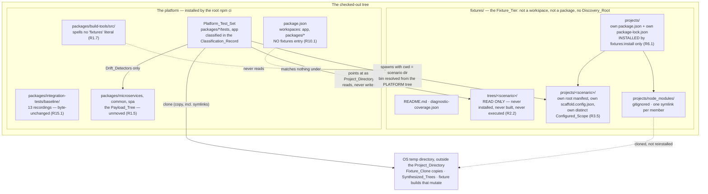

# Design Document

## Overview

This feature adds a **Fixture_Tier** — a new top-level `fixtures/` directory holding test subjects the platform owns — and gives every payload-coupled platform test a fixture-based equivalent. It moves nothing, deletes nothing, and rewires nothing.

**The ordering argument is the whole design.** A fixture-based equivalent is added *beside* a payload-coupled test that still passes, while the Payload_Tree is still present under `packages/` (R1.5, R13.1). Both tests assert; both pass. Their *agreement* is the evidence that the fixture is a faithful subject — the fixture claim and the payload claim are the same claim over two different trees, and if the fixture were a caricature the two would disagree and the suite would go red. The next feature's deletion of the payload-coupled test is then the deletion of something already superseded, with a recorded successor named for it, rather than a leap of faith taken after the subject has already vanished. Doing it in the other order — move the payload, then rebuild the tests — means the moment of maximum risk is also the moment with no working comparison available.

Two committed records are the durable output. The **Diagnostic_Coverage_Record** (`fixtures/diagnostic-coverage.json`) says, for every Diagnostic_Tag the Build_System emits, which Fixture_Scenario provokes it or why committed bytes cannot express it (R5.1). The **Classification_Record** (`packages/integration-tests/platform-test-classification.json`) assigns every platform test to exactly one of Payload_Coupled_Test, Drift_Detector, or Payload_Independent_Test, and names the Fixture_Equivalent for each coupled one (R12.1, R12.2). The first makes "which diagnostics have subjects" a checked fact instead of folklore; the second makes the next feature's deletions safe by construction instead of by inspection.

What each affected mechanism gains:

| Mechanism | Before | After this feature | Discharges |
| --- | --- | --- | --- |
| Diagnostic coverage | Each diagnostic is exercised by whichever suite happened to need it; nothing says which are unexercised | Every emitted tag has either a named scenario or a recorded inexpressibility reason, checked against a scan of the sources | R5.1, R5.2, R5.3 |
| Hostile-tree testing | Each suite synthesises its own tree in a temp directory, or points at the committed payload | A committed, named, legible scenario per fault, reusable and reviewable, plus the synthesized trees which stay | R2.5, R3.10 |
| Installed-project testing | `pristineWorktree()` — one `npm ci` of the whole repository per suite that needs one | One `npm ci` of `fixtures/projects/`, cloned per suite from the installed state | R6.1, R7.1, R7.8 |
| Test classification | Implicit; "does this test depend on the payload?" answered by reading it | A committed record, mechanically checked for totality, single-valuedness, and fixture-completeness | R12.1, R12.5, R12.6 |
| Payload-coupled claims | Asserted only over the committed payload | Asserted over the payload *and* over a fixture or synthesized tree | R13.1, R13.3 |
| Drift detection | Indistinguishable from general claims asserted over the real tree | An explicitly listed, deliberately retained set with a recorded reason | R14.1, R14.2, R12.7 |
| Worktree safety | Guard scans the integration tests; permitted writes are three locations | Guard scans every platform test source; six permitted locations, fixture paths treated as checked-out anchors | R9.1, R9.3, R9.8 |
| Non-default configuration | Exercised mostly by synthesized trees | Exercised by every Project_Fixture, each carrying its own distinct Configured_Scope | R3.5, R13.6 |

**The strongest guarantee, and the one mechanical statement of additivity:** all thirteen Baseline_Recordings under `packages/integration-tests/baseline/` are **byte-unchanged** (R15.1). Those thirteen files record every observable the platform's own derivations produce over this repository — one discovery result, three build orders and Project_Lists, three generated registries, three generated Dockerfiles, two staged Image_Trees, and the Repo_Invariant_Checker's whole stdout-plus-stderr. A feature that changed *any* recorded observable would have to change one of those thirteen files. This feature changes none, and R15.5–R15.10 name each one so the claim is checked rather than asserted.

Provenance: this feature implements decisions D2, D3, and D4 of `.kiro/steering/platform-split.md`, together with the test-decoupling intent recorded as D5. Those citations record where the decisions came from; every behaviour described below is stated here in its own terms and reads correctly with that record unloaded.

## Architecture

The tier is partitioned by a single question: **can npm install this?** Hostility npm itself rejects — malformed JSON, a manifest with no `name`, two packages declaring the same name — can only live in a tree nobody installs. Hostility npm does not care about — a missing `main`, a peer import, a missing `scripts.build`, a Selector naming nothing — needs a genuinely installed tree to be observed the way the platform observes a real project. That question, and nothing aesthetic, decides which of the two subdirectories a scenario goes in (R2.1, R3.1).



Two properties carry the whole architecture, and both are stated as checkable obligations rather than left to care:

**1. The Build_System never learns the tier exists.** No Build_System module reads a path under `fixtures/`, and no Build_System source spells `fixtures` as a path literal (R1.7). A fixture becomes a subject only because a *test* passes that fixture's directory as the Project_Directory of a platform entry point, or spawns a platform bin with that directory as its working directory (R2.6, R3.7). This is what keeps the tier additive: a mechanism that cannot see the tier cannot change behaviour because of it. It is also what makes R10.3–R10.7 consequences rather than separate work — the Tsconfig_Verifier verifies what discovery yields, discovery scans the configured Discovery_Roots, the Image_Assembler stages Framework_Singletons plus Required_Dependencies, and no fixture is reachable through any of those. A grep of `packages/build-tools/src/` confirms the literal is absent today, so R1.7 is a *preservation* obligation, not a cleanup.

**2. The two npm workspace roots do not nest.** The Fixture_Projects_Root declares its own `workspaces` array, and every glob in it matches a **member package inside** a Project_Fixture — `*/packages/*` shapes — and matches **no Project_Fixture's own directory** (R3.3). Because npm treats a matched directory as a workspace package and never recurses into a matched package's own `workspaces` array, a Project_Fixture's root manifest is invisible to the install: it is read only by the Repo_Invariant_Checker when a test points the checker at that Project_Fixture, which is exactly the role R3.4 gives it. One install therefore serves every member of every scenario, while each scenario still owns a root manifest whose `workspaces` array a test can assert Workspace_Coverage against.

The complementary half is the root `package.json`, whose `workspaces` array matches **nothing** under `fixtures/` (R10.1). This is not tidiness. If it did match, npm would install every deliberately-broken fixture package into this repository's own `node_modules`, symlink it under this project's Configured_Scope, and require a Workspace_Coverage entry for it — and the platform's `lint`, `typecheck`, and `test` fan-outs, which enumerate that same array, would be asked to accept a package that is broken on purpose (R10.2).

Where each Test_Class points:

- A **Payload_Independent_Test** points at a Synthesized_Tree (pure inputs, or directories in an OS temp directory) or at a Fixture_Scenario. It is already decoupled and this feature changes none of them.
- A **Payload_Coupled_Test** points at the committed Payload_Tree. Each stays in place and passing, and each gains a **Fixture_Equivalent** pointing at a fixture or a synthesized tree (R13.1).
- A **Drift_Detector** points at the real filesystem on purpose — `discovery-real-tree.test.ts` and `workspace-build-order-real-tree.test.ts` exist to catch a pure Build_System core disagreeing with the committed repository (R14.1, R14.3). Its assertions are untouched, because the payload is untouched (R14.5).

The Fixture_Tier is excluded from the container build context by one `.dockerignore` entry (R10.8), so a deliberately-broken manifest never reaches an image build's whole-context copy. It needs no `.gitignore` change: the existing `node_modules/`, `dist/`, and `*.tsbuildinfo` patterns are unanchored and already cover every path under `fixtures/` (R11.2).

## Components and Interfaces

### The Fixture_Tier layout and scenario anatomy

```
fixtures/
├─ README.md                      # what the tier is, the partition criterion, where a new scenario goes (R1.2)
├─ diagnostic-coverage.json        # the Diagnostic_Coverage_Record (R5.1)
├─ trees/                          # read, never installed, never built (R2.2)
│  ├─ config--unparsable/
│  │  ├─ fixture.json              # the Scenario_Manifest — the ONLY non-subject file at the root (R4.4)
│  │  ├─ package.json              # the scenario's own Root_Manifest (R2.4)
│  │  ├─ scaffold.config.json      # optional; here, the malformed subject
│  │  └─ packages/...              # whatever the Expected_Diagnostic concerns (R2.4)
│  ├─ config--shape.scope/
│  ├─ discovery--duplicate/
│  └─ ...
└─ projects/                       # ONE npm workspace root, installed once (R3.2)
   ├─ package.json                 # private:true, its own workspaces array, its own devDependencies
   ├─ package-lock.json            # committed (R11.1)
   ├─ barrel--invalid/
   │  ├─ fixture.json
   │  ├─ package.json              # the SCENARIO's own Root_Manifest; its workspaces array is the
   │  │                            #   array the Repo_Invariant_Checker reads (R3.4) — invisible to npm
   │  ├─ scaffold.config.json      # declares this scenario's distinct Configured_Scope (R3.5)
   │  └─ packages/common/broken/    # the member package — matched by the ROOT's glob (R3.3)
   └─ ...
```

A **Fixture_Scenario** is one directory, one named fault, one declared diagnostic. Its anatomy is fixed by three rules that together make a scenario legible without opening a test:

**The Scenario_Manifest.** Every scenario holds `fixture.json` at its scenario root (R4.3), and that file is the only file at the scenario root that is not part of the tree under test (R4.4). No Build_System component reads it; it is read by the fixture suite and by a human.

```ts
/** `fixtures/{trees,projects}/<Scenario_Directory_Name>/fixture.json`. */
export interface ScenarioManifest {
  /** The single Diagnostic_Tag this scenario is built to provoke, brackets
   *  included — e.g. "[config:root-overlap]". Must equal the tag recovered
   *  from the Scenario_Directory_Name (R4.2). */
  readonly expectedDiagnostic: string;
  /** The platform entry point that produces it. Named as the exported function
   *  or the bin a test invokes, so the assertion of R4.6 has one subject. */
  readonly entryPoint: string;
  /** One sentence stating the fault, in the present tense. */
  readonly fault: string;
  /** Which partition criterion places this scenario where it is (R2.1, R3.1),
   *  and why. For a Tree_Fixture: what an npm clean install would reject.
   *  For a Project_Fixture: that an install succeeds and which entry point
   *  still reports. */
  readonly partition: {
    readonly kind: "tree" | "project";
    readonly justification: string;
  };
}
```

**The Scenario_Directory_Name, and why the hyphen is doubled.** A scenario's directory name is derived from its Expected_Diagnostic: take the tag's text without brackets and replace the single `:` with `--`, optionally followed by `.` and a qualifier of lowercase letters, digits, and hyphens distinguishing several scenarios covering the same tag (R4.1). So `[config:root-overlap]` → `config--root-overlap`, and `[config:shape]` with three scenarios → `config--shape.scope`, `config--shape.roots`, `config--shape.entry`.

The doubled hyphen rather than a single one is what keeps the derivation **reversible**, and the reason is that a tag's *category* may itself contain a hyphen. Three real categories do: `build-order`, `entry-registry`, `image-tree`. With a single hyphen, `[build-order:cycle]` would become `build-order-cycle`, from which the split point is unrecoverable — `build:order-cycle`, `build-order:cycle`, and `build-order-cycle:` are all consistent with that text, and a reader (or a test) cannot tell which tag was meant. With the doubled hyphen, `build-order--cycle` has exactly one `--`, the split is unambiguous, and `build-order` is recovered intact. Recovery is therefore: discard any `.` qualifier, split on the **first** `--`, rejoin with `:` (R4.2). The suite asserts that the recovered tag equals the tag the Scenario_Manifest declares, and fails naming the directory when the name holds no `--` or more than one — so a renamed directory and a stale manifest cannot disagree silently.

```ts
/** `[build-order:cycle]` → `build-order--cycle`; qualifier appended by the author. */
export function scenarioDirectoryName(tag: string, qualifier?: string): string;
/** `build-order--cycle.nested` → `[build-order:cycle]`; throws naming the
 *  directory when the name holds no `--` or more than one (R4.2). */
export function expectedDiagnosticOf(directoryName: string): string;
```

**One scenario, one tag.** A scenario provokes its Expected_Diagnostic and **no other** Diagnostic_Tag (R4.5). This is a minimality rule with a purpose: because the reported tag set is exactly one element, a test asserting over a scenario asserts the **whole** reported output rather than a subset of it (R4.6), which is a strictly stronger assertion than "the expected tag is among those reported" and catches a diagnostic that fires when it should not. It also means a scenario stays readable — a directory named for one fault contains one fault. Note the asymmetry R3.8 records: a *package inside* a Project_Fixture may be entirely well-formed, and usually is. That is precisely what lets a scenario isolate one fault: the fixture's other packages are there to make the fault visible, not to add faults of their own.

Two structural guards keep the set honest: every direct subdirectory of `fixtures/trees/` and of the Fixture_Projects_Root (other than that root's own files) must be a scenario holding a manifest and bearing a well-formed name, failing naming the offender otherwise (R4.7), and no two scenarios share a name across both partitions (R4.8). A scenario therefore cannot be added without being declared.

**`fixtures/README.md`** states what the tier is, states the partition criterion of R2.1 and R3.1 in the terms above, and names the directory a new scenario of each kind belongs in (R1.2). It is the document a contributor finds before they find the tests, and it duplicates the steering guidance deliberately — a contributor adding a fixture is already inside `fixtures/`.

### Tree_Fixtures: read, never installed

A Tree_Fixture is an **inert manifest tree**. A test reads it, and does nothing else to it: it is never installed, never built, never executed, and never written to (R2.2). That is not a precaution — it is the definition of the partition. These trees exist precisely because an npm clean install over them would *fail*, so asking npm to install one would fail the suite for the scenario's own reason.

**How a test points the platform at one.** The whole interface is: pass the scenario's directory as the **Project_Directory** of the entry point under test, and as the **working directory** of every process spawned for that scenario (R2.6). Every path a test reports is then derived from that directory, never from a path literal of the test's own. That is the same interface a real project presents — the Build_System's notion of "the project" is the working directory of the running command plus whatever `scaffold.config.json` it finds directly inside it — so a Tree_Fixture is not a special mode. It is a project the Build_System is pointed at.

**Pure core versus effect shell.** The Build_System's components are already split: a pure core that takes a tree as in-memory input and returns a result, and a thin effect shell that reads the real filesystem and calls the core. A fixture suite honours that split rather than routing around it (R2.7): it passes the fixture's tree to the **pure core** where the component exposes one, and reaches the real filesystem **only through that component's own effect shell**. The consequence is the one that matters — a Tree_Fixture exercises the same code path a real project exercises. A suite that read the fixture itself and hand-assembled the core's input would be testing its own transcription, and the fixture would stop being evidence about the real path. This is also what makes the model-based agreement property of R13.5 meaningful: the fixture-read-from-disk result and the transcribed in-memory result are two routes through the same core.

**Self-containment.** Every file a scenario's Expected_Diagnostic depends on lies inside that scenario's own directory; the tree declares no dependency resolved from outside it and contains no symlink (R2.3). Two reasons. A dependency resolved from outside would resolve *upward* — into this repository's own `node_modules` — and the scenario's behaviour would then depend on what the platform happens to have installed, which is the coupling the whole feature exists to remove. And a symlink in a committed tree is a portability and a clone hazard: it survives a `git` checkout differently across platforms, and the Fixture_Clone's symlink-preserving contract exists for the *installed* projects tier, not for these.

**The enumerated scenario set.** The set below is derived from the real diagnostic tags the Build_System emits, read out of `packages/build-tools/src/`, rather than from the requirements' prose alone. R2.5 names fifteen faults as the minimum; the tags in the Config_Parser's and Config_Loader's own unions add two more that committed bytes can express, and R5.1 forces those to be covered too.

| Scenario_Directory_Name | Expected_Diagnostic | Fault |
| --- | --- | --- |
| `config--unparsable` | `[config:unparsable]` | `scaffold.config.json` is not valid JSON |
| `config--shape.not-object` | `[config:shape]` | the config file parses to a JSON array, not an object |
| `config--shape.scope` | `[config:shape]` | `scope` is declared as a number |
| `config--shape.roots` | `[config:shape]` | `roots` is declared as a string |
| `config--shape.entry` | `[config:shape]` | `entry` is declared as an object |
| `config--unknown-key` | `[config:unknown-key]` | an unrecognised top-level key is declared |
| `config--scope` | `[config:scope]` | the declared scope is not a Valid_Scope |
| `config--root-path` | `[config:root-path]` | a `roots` member is not a Valid_Root_Path |
| `config--root-overlap` | `[config:root-overlap]` | two Discovery_Roots nest |
| `config--root-framework` | `[config:root-framework]` | a Discovery_Root collides with a Framework_Singleton directory |
| `config--root-missing` | `[config:root-missing]` | the microservice Discovery_Root does not exist |
| `config--root-not-directory` | `[config:root-not-directory]` | a declared Discovery_Root path is a regular file |
| `config--root-is-package` | `[config:root-is-package]` | a declared Discovery_Root is itself a package |
| `config--entry-path` | `[config:entry-path]` | the declared `entry` is not a Valid_Root_Path |
| `config--entry-overlap` | `[config:entry-overlap]` | the Entry_Root collides with a reserved path |
| `discovery--manifest` | `[discovery:manifest]` | a package manifest is not valid JSON |
| `discovery--name` | `[discovery:name]` | a package manifest declares no `name` |
| `discovery--duplicate` | `[discovery:duplicate]` | two packages declare the same name |
| `discovery--mirror` | `[discovery:mirror]` | a declared name does not mirror its directory |

Two tags are recorded in the Diagnostic_Coverage_Record as **not Expressible**: `[config:unreadable]` and `[config:root-unreadable]`. Each requires a permission state — a config file or a Discovery_Root that exists and cannot be read — which committed bytes cannot express, since git records no mode beyond the execute bit and a CI runner's umask is not ours to choose. That is exactly the one kind of reason R5.4 permits to be recorded, so "not covered" can never stand in for "not got round to".

**Two findings in the code that contradict a requirement, reported rather than designed around.**

1. **R2.5 requires a scenario for "a package manifest declaring a name that is not a valid npm package name", and the Build_System emits no tag for that fault.** `packages/build-tools/src/discovery.ts` rejects a `name` that is missing, non-string, or blank with `[discovery:name]`, and a name that does not mirror its directory with `[discovery:mirror]`. A name that is present, non-blank, and *does* mirror its directory is accepted whatever its npm validity — a package in directory `UPPER` declaring `@fx/UPPER` provokes nothing. So this fault has no Expected_Diagnostic to declare, and a scenario for it would violate R4.6 by provoking an empty tag set. The table above therefore covers `[discovery:mirror]` (which is genuinely provokable) and omits the invalid-npm-name fault. Resolving this needs a requirements decision, not a design decision: either drop that item from R2.5's minimum, or add a name-validity check to discovery — which would be new Build_System behaviour and is forbidden by R15.12.

2. **R5.2's textual scan cannot see six tags the Build_System really emits.** The scan derives the tag set by looking for the bracketed `[<category>:<detail>]` form in `packages/build-tools/src/`. But `project-config.ts` builds every config diagnostic as `` `[${diagnostic.tag}] …` `` from a `ConfigTag` string union, and `tsconfig-verifier.ts` does the same from a three-member union. Six tag texts therefore appear in the sources only as bare union members, never bracketed: `config:unparsable`, `config:root-not-directory`, `config:root-is-package`, `tsconfig:setting`, `tsconfig:absent`, and `tsconfig:unresolvable`. A bracketed-form scan silently omits all six — including three this feature covers with the scenarios above, and three (`tsconfig:*`) whose subjects are Project_Fixtures. The "Accepted Imprecisions" section anticipated a composed tag escaping the scan; what the code shows is that this is not a hypothetical corner but six of roughly forty tags, two of them whole categories. The pass-two Error Handling section must specify a derivation that also recognises the two tag-union declarations, and R5.2's wording needs widening to match; a scan of the bracketed form alone would make the Diagnostic_Coverage_Record's completeness claim false on the day it lands.

### The Fixture_Projects_Root: one install, hostile members

`fixtures/projects/` is a **single npm workspace root** with its own manifest and its own committed lockfile, so one install serves every package under it (R3.2). Its manifest declares `private: true`, its own `workspaces` array, and its own `devDependencies` — and nothing else of consequence. It is deliberately **hostile-only**: every Project_Fixture provokes at least one Diagnostic_Tag from at least one platform entry point (R3.8), and no happy-path project fixture is added (R3.9), because the happy-path live subject is the `example/` project the next feature introduces and a second one here would be a second thing to keep in step with it for no gain.

**The non-nesting glob rule.** Every glob in the root's `workspaces` array matches a **member package inside** a Project_Fixture and matches **no Project_Fixture's own directory** (R3.3). npm resolves `workspaces` statically, before any repository code runs, and a matched directory becomes a workspace package — it does not recurse into that package's own `workspaces` array. So a glob shaped `*/packages/*` (and, for scenarios whose fault concerns a relocated Discovery_Root, the specific member paths that scenario's own config makes discoverable) installs the members while leaving each scenario's root manifest entirely unread by npm. That root manifest exists for one consumer: the Repo_Invariant_Checker, when a test points it at that Project_Fixture and it reads the array for Workspace_Coverage (R3.4). The rule is what makes "a scenario whose fault *is* a Workspace_Coverage violation" possible at all — the scenario's array can be deliberately wrong without npm ever objecting.

**A distinct Configured_Scope per scenario, solving two problems at once.** Each Project_Fixture declares a Configured_Scope distinct from every other Project_Fixture's and from this project's own (R3.5). The first problem it solves is mechanical: one workspace root means one hoisted `node_modules`, and npm symlinks each member under its declared name. Two scenarios each needing "a Common_Package called `config`" would, under a shared scope, both declare `@fx/config` and collide — the install would either fail or silently give one scenario the other's package, which is worse. Distinct scopes make the declared-name sets of any two scenarios disjoint by construction, which is the property R16.9 states. The second problem it solves is a testing one, and it is free: every Project_Fixture assertion then runs against a **non-default** scope, so none of the fixture subjects can silently re-import the `@microservices` assumption the payload-coupled tests carried (R13.6). One decision, two obligations discharged.

**No platform dependency, and why that governs install order.** A Project_Fixture declares no dependency on a package of this platform and imports no module of it (R3.6). Two consequences, both about ordering. First, installing the Fixture_Projects_Root needs **no platform build output**: if a fixture depended on `@microservices/contracts`, the fixture install would need the platform built first, and `fixtures:install` would stop being a step that can run immediately after the root install and become a step that must run after a build. Second, a fixture's install cannot **resolve upward** out of `fixtures/projects/` into this repository's own `node_modules` — node resolution walks parent directories, and `fixtures/projects/` is a child of the Project_Directory, so a specifier the fixture root cannot satisfy would be found in the platform's tree and the scenario's behaviour would depend on the platform's installed state. The cost is recorded in the requirements' Accepted Imprecisions: a scenario needing the request-handler contract declares its own local stub, which can drift from the real type. The real contract is covered by the platform's own typecheck and by the Drift_Detectors.

The root's `devDependencies` declare every third-party package a Project_Fixture's build needs, each at a version this repository's own lockfile already resolves, and declare nothing the root `package.json` does not already declare (R3.11). That bounds the second lockfile's maintenance cost: the two move together because the versions are the same versions.

**Resolving the platform's bin from the platform's own tree.** A test invokes a platform entry point against a Project_Fixture in one of two ways: as a **process** spawned with the scenario's directory as its working directory, or as an **imported function** taking that directory as its Project_Directory (R3.7). In both cases the platform's bin or module is resolved from the **platform's own tree** — `packages/build-tools/dist/bin/<bin>.js`, reached from the test file's own location — and never from the fixture's `node_modules`. This follows from R3.6 (the fixture declares no platform dependency, so its `node_modules` holds no platform bin to resolve) but it is worth stating as an interface rule rather than leaving as an inference: the thing under test is *this* checkout's Build_System, and a bin resolved through the fixture would be either absent or, worse, some other copy.

**`fixtures:install`, its CI step, and its probe.** The Fixture_Install is exposed as exactly one root npm script:

```json
"fixtures:install": "npm ci --prefix fixtures/projects"
```

It is the **only** writer of the Fixture_Projects_Root's `node_modules/` (R6.1) — no test writes it, which is what makes that directory a Permitted_Write_Location rather than a violation. It invokes no build with `--workspaces`, so the Repo_Invariant_Checker's build-order-source check stays silent over the root manifest (R6.4). And it is reached by **nothing automatically**: the root `npm install` and `npm ci` perform no Fixture_Install, no lifecycle script performs one, and the root `ci` script keeps the composition and order it has today and performs none (R6.2, R6.3). A clone's install cost and its resolved dependency set are therefore unchanged, and the local quality gate does not pay the fixture install cost. The root `package.json` gains this one script and nothing else — no dependency, no devDependency, no edit to any existing script's text (R15.13).

`ci.yml` gains one step, between `Install dependencies` and `Quality gate`, failing the workflow when it exits non-zero (R6.5):

```yaml
      - name: Install fixture projects
        run: npm run fixtures:install
```

The gap that creates — the gate does not install the fixtures, so a local run has them or does not — is closed by one shared **availability probe** returning the Clone_Handle shape, so no suite spells its own (R6.8):

```ts
/** Probe for Installed_Fixture_Projects. Returns the Clone_Handle shape so a
 *  suite branches on `available` exactly as it does for a Fixture_Clone. */
export function installedFixtureProjects(): CloneHandle;
```

Its asymmetry is deliberate. Locally, absent `node_modules/` under the Fixture_Projects_Root yields `available: false` with a reason naming the `fixtures:install` script, and the suite **skips** — a developer who has not run the install gets a clear instruction, not a wall of failures, and no assertion runs against an uninstalled fixture (R6.6). But where the environment variable `CI` holds a non-empty value, the same absence **fails** with the same reason (R6.7). Without that asymmetry, deleting the workflow's install step would make every fixture assertion skip and the workflow would go green having tested nothing — the exact failure mode a skip-on-absence probe invites.

### Fixture_Clone and Output_Clearing

These are the two helpers that let tests mutate and build without touching the checked-out tree. Both live in the platform's own test harness, alongside `pristineWorktree()`.

**Fixture_Clone — install once, clone many.** One shared function, taking the Project_Directory-relative path of a Fixture_Scenario or of the Fixture_Projects_Root, returning a Clone_Handle (R7.1):

```ts
/** Copy a fixture (or the whole installed Fixture_Projects_Root) into an OS
 *  temp directory outside the Project_Directory and return a handle to the
 *  copy. Reads the source only; writes nothing inside the checked-out tree. */
export function fixtureClone(relativePath: string): CloneHandle;
```

Its guarantees are what make the copy a usable substitute for an install:

- On success the handle carries `available: true`, an absolute path **inside an OS temp directory located outside the Project_Directory**, and an idempotent `cleanup` removing that directory (R7.2). Outside the Project_Directory matters twice: a copy inside it would be caught by the worktree guard, and a copy inside it would be discovered by npm or by a `--workspaces` fan-out.
- The copy reproduces the source's relative path set **exactly**, every regular file's bytes **byte-for-byte**, and every symlink **as a symlink with the same target text** rather than as a copy of the file it names (R7.3). The symlink clause is the load-bearing one: a copy of the *installed* Fixture_Projects_Root is only useful if the member symlinks under `node_modules/@fx-*/` survive as symlinks, because that is what makes the copy resolvable **without a further install**. A dereferencing copy would produce a tree where each member appears twice with no link between them, and the clone would have bought nothing over reinstalling.
- The copy mechanism is chosen per host: a copy-on-write or hard-linking copy where the filesystem supports one, falling back to a plain recursive copy otherwise, with the R7.3 guarantees holding under either (R7.4). Concretely, `cp -c` on APFS (macOS) and `cp --reflink=auto -a` on a Linux CoW filesystem reduce a `node_modules` copy from seconds to near-instant; Node's own `cpSync` with `dereference: false, preserveTimestamps: true` is the portable fallback. The choice is an optimisation behind a fixed contract, which is why R7.4 states the contract as mechanism-independent — a test must never be able to tell which path ran.
- **Cleanup on failure is total.** If the copy cannot be made for an environmental reason, the helper removes any directory it had already created, returns `available: false` with a reason **naming the step that failed**, and leaves no partially copied directory behind (R7.5). A half-copied fixture that a suite then skipped over would be worse than no copy: the next run's clone of the same source could reuse it.
- **A clone can never modify a fixture.** The helper writes nothing inside the checked-out tree and reads the source only (R7.6).
- **Per-suite lifecycle.** A suite clones a given source at most once and reuses the directory across its examples; a suite whose examples mutate the copy restores bytes it **captured from that copy** rather than re-cloning (R7.8). Every directory a clone created is removed when the creating suite finishes — including when an assertion fails, when a test throws, and when the suite is interrupted after the directory was created (R7.7), which in practice means registering cleanup in the same `beforeAll` that created it and in an `afterAll` that runs unconditionally.

**Its relationship to `pristineWorktree()`, which stays.** The two helpers have different **subjects**, and that is the whole reason both exist (R7.9). `pristineWorktree()`'s subject is **uncommitted platform source in the checked-out tree**: it lists `git ls-files --cached --others --exclude-standard`, so the copy it makes captures a developer's in-progress edits exactly as they are on disk, which is precisely what a git-based restore throws away. Its reason to exist is that the test tree and the platform tree are currently the *same* tree, so a cold-start test of the platform has to capture the platform's working state. The Fixture_Clone's subject is a **fixture** — committed bytes plus an installed `node_modules` — where there is no uncommitted state to capture and the expensive thing is the install, not the capture. So the Fixture_Clone neither calls `pristineWorktree()` nor duplicates its working-tree capture (R7.9), and `pristineWorktree()` is retained unchanged. It is retired by the next feature, when the platform tree and the test tree stop being the same tree; retiring it here would remove the capture while the reason for it still holds.

The prohibition both helpers exist to honour is unchanged and absolute: no function that restores a file in the checked-out tree, under any name, and no destructive git subcommand — `checkout`, `reset`, `clean`, `stash` (R7.10). The deleted `restoreWorktreeFile()` destroyed in-progress work twice, silently, and each time the suite passed.

**Output_Clearing.** One shared function taking a directory path, removing every `dist/` directory and every `*.tsbuildinfo` file under it, run before any build against a fixture directory (R8.1, R8.2):

```ts
/** Remove every Generated_Fixture_Output under `directory`. Idempotent.
 *  Refuses — making no removal and reporting the path — when `directory` is
 *  neither inside the Fixture_Tier nor inside an OS temp directory. */
export function clearOutput(directory: string): void;
```

Its contract has four parts, and each answers a specific way a build-output helper goes wrong:

- **It exists because a failed build leaves partial output.** A `tsc` run that failed part-way leaves some emitted `dist/` files and a `*.tsbuildinfo` claiming they are current. The next build over that directory can then *skip* emitting — `composite: true` means the compiler trusts the buildinfo — and a test asserting on the presence of output passes for entirely the wrong reason. R8.6 states the guarantee directly: a fixture build run immediately after a *failed* fixture build over the same directory reports the same result it reports over a directory that was never built. That equivalence is the function's whole purpose.
- **It is idempotent.** Two applications leave the directory in the state one application leaves it in, and an application over a directory holding no Generated_Fixture_Output succeeds and removes nothing (R8.3). Idempotence is what lets a suite call it unconditionally in a `beforeEach` without tracking whether a build has happened.
- **Its removal set is exactly the Generated_Fixture_Output.** It removes no file that is neither a `*.tsbuildinfo` nor inside a `dist/` directory, and — stated separately because it is the expensive mistake — removes no `node_modules/` directory and no file inside one (R8.4). Clearing output must never force a reinstall, or the install-once design collapses into install-per-suite.
- **It refuses a path outside the tier or a temp directory.** Asked to operate on a path that is neither inside the Fixture_Tier nor inside an OS temp directory, it makes **no removal** and reports the rejected path (R8.5). This is the guard against the helper being pointed at a platform package — a mistyped relative path that resolved to `packages/` would delete the platform's build output, which is recoverable but would waste a long debugging session. Refusing loudly, with the path named, converts that into an immediate failure.


### The Classification_Record and its guard

The Classification_Record is the committed JSON file `packages/integration-tests/platform-test-classification.json` (R12.1). It lives with the platform's own test package rather than under `fixtures/` because its subject is the platform's tests, not a fixture — and because it must survive a future in which `fixtures/` has been reorganised.

Its shape is one array of entries, each carrying the Project_Directory-relative POSIX path, exactly one `class` field holding one of the three Test_Class names, and exactly one per-class field: `fixtureEquivalent` (a path) for a Payload_Coupled_Test, `retainedReason` (prose) for a Drift_Detector, and neither for a Payload_Independent_Test (R12.2, R12.10). Entries are ordered by ascending code-point comparison of `path`, so a reviewer reading the next feature's deletion diff reads a stable diff rather than a reshuffle (R12.10).

#### Deriving the Platform_Test_Set from the filesystem

The Classification_Guard derives the set rather than reading it (R12.5). The derivation is:

1. List tracked files — `git ls-files` — so an untracked scratch test in a developer's tree is neither swept into the set nor able to fail the guard.
2. Keep those whose name ends `.test.ts`, `.property.test.ts`, or `.test-d.ts`. The second is a suffix of the first; all three are named because the requirement names all three and because a future non-`.test.ts` suffix must be a deliberate addition here.
3. Keep those lying under a Framework_Singleton's directory or under the Entry_Root. Both come from threaded configuration — the Framework_Singleton directory names from the Build_System's single list of them, the Entry_Root from the `ProjectContext` — so the derivation spells no path literal and follows a relocated Entry_Root (R13.2 applied to the guard itself).
4. Add each tracked non-test module in the same directory that such a file imports by relative path. Today that yields exactly one member, `packages/integration-tests/tests/helpers.ts`; the rule rather than the file is encoded, so a second shared harness joins the set by existing.

Step 3 is what makes R12.4 hold by construction rather than by a filter: a Payload_Owned_Test lies under a Consumer_Package's own directory, which is under a Discovery_Root, which is neither a Framework_Singleton directory nor the Entry_Root. It is never derived, so it can never be classified. The guard additionally asserts that the record names no path under any configured Discovery_Root, so a hand-added payload entry is a named failure rather than a silently accepted one.

#### Totality, single-valuedness, and both-ways completeness

Three checks, each failing by naming the offending path:

- **Totality and single-valuedness.** Every derived path appears in the record with exactly one Test_Class. The guard rejects an entry declaring no class, declaring more than one, or declaring a class other than the three (R12.1, R12.6). Single-valuedness is checked structurally rather than trusted to the JSON shape, because an entry carrying both `fixtureEquivalent` and `retainedReason` is a two-class claim in substance even when it declares one `class` string.
- **Referential integrity of the equivalent.** A Payload_Coupled_Test entry must name a `fixtureEquivalent`, and that path must itself be a member of the derived Platform_Test_Set (R12.6). A record naming an equivalent that does not exist, or that exists but is a payload test, is the failure mode this catches — and it is the one the next feature depends on most, since it is what makes "the claim is asserted elsewhere" checkable rather than asserted.
- **Both-ways completeness.** The derived path set and the record's path set are compared in both directions, and every path present in one and absent from the other is named, with the direction stated (R12.5). The two directions catch different mistakes: a test added without a classification, and a record entry outliving the test it names. Reporting both in one failure rather than short-circuiting on the first matters, because a rename shows up as one of each and the pair together identifies it immediately.

#### The explicitly listed Drift_Detector set

The guard holds a literal list of Drift_Detector paths in its own source and asserts set equality with the Drift_Detectors the record declares (R12.7, R14.2). The list contains `packages/build-tools/tests/discovery-real-tree.test.ts` and `packages/build-tools/tests/workspace-build-order-real-tree.test.ts` (R14.1), plus any further member whose assertions are confined to the same narrow purpose.

Equality rather than containment is the point. A Drift_Detector classification exempts a test from the Fixture_Equivalent obligation of R12.2, so it is the one classification that can make the record's coverage claim weaker without making any check fail. Requiring the set to equal a list in the guard's source converts "retain this one too" from a field a classification chose in passing into an edit a reviewer sees.

#### The non-vacuity floor

The guard fails when the derived Platform_Test_Set holds fewer than two members (R12.9). Every check above quantifies over the derived set, so all of them pass trivially over an empty one — and the derivation depends on directory names and file-name suffixes, both of which a rename can invalidate silently. The floor is the same device the Worktree_Guard already uses for the same reason, and the two are stated in the same terms deliberately.

#### The mechanical necessary condition, and what it cannot catch

For each Payload_Independent_Test, the guard asserts that the file declares no static import and no dynamic import whose specifier is this repository's Configured_Scope followed by `/` and the name of a discovered Consumer_Package, and fails naming the file and the specifier otherwise (R12.8). Both halves of the forbidden specifier set are derived — the scope from the Effective_Config, the package names from a Package_Discovery run over this repository — so the check follows a renamed payload package and a changed scope without an edit, and it spells no scope literal of its own (R13.2).

This is a **necessary condition for payload independence, not a sufficient one**, and the design says so plainly because the gap is where a wrong classification will hide. A test can assert a fact about the committed Payload_Tree without importing anything from it:

- by asserting a payload-shaped string against a derived result — `expect(order).toContain("packages/common/config")` imports nothing;
- by reading a payload path off the real filesystem rather than resolving a package by name;
- by spawning a platform bin with the repository root as its working directory and asserting on output that names payload packages.

None of those trips the import check. What the check does catch is the drift that actually happens: a test classified Payload_Independent_Test today acquiring a payload import later, which is exactly the change that would silently invalidate a recorded classification. The criterion that decides the classification is R12.3's — the **subject of the assertion**, would the assertion have to change if a payload package were renamed, relocated, or removed — and that criterion is applied by a human and recorded, which is why R12.3 states it in those terms and why the guard's check is described as a necessary condition in the requirement itself.

One asymmetry makes the residual risk tolerable. An under-classification (calling a Payload_Coupled_Test independent) loses a claim when the payload moves. An over-classification (calling an already-decoupled test payload-coupled) costs a redundant Fixture_Equivalent. The guard catches neither, but only the first is harmful, and only the first is the direction the import check constrains — a file with a payload import cannot be classified independent at all. The classification is therefore mechanically pinned on its dangerous side and reviewed on its safe one.

### Fixture_Equivalents and the drift detectors

#### What makes an equivalent faithful

A Fixture_Equivalent is a member of the Platform_Test_Set that asserts, over a Fixture_Scenario or a Synthesized_Tree, the claim a named Payload_Coupled_Test asserts over the Payload_Tree (R13.1). Four conditions make it faithful, and all four are checkable:

1. **Same claim, different subject.** The equivalent asserts the same property of the same component's output; only the tree the component reads changes.
2. **Configuration derived, never spelled.** Every Discovery_Root, Configured_Scope, Entry_Root, and package path it uses comes from the configuration of the subject it points at — the scenario's own Project_Config_File, or the generated configuration of a Synthesized_Tree — and it spells no path literal and no scope literal of its own (R13.2). This is what stops an equivalent re-importing the assumptions it was written to remove.
3. **Its subject is never the Payload_Tree** (R13.7), so no Fixture_Equivalent is itself a Payload_Coupled_Test. Mechanically, this is the same import check R12.8 applies, since an equivalent is classified Payload_Independent_Test in the record.
4. **The Payload_Coupled_Test stays, and stays passing** (R13.1). The two assert the same claim over two subjects, and their agreeing is the evidence that the fixture subject is faithful. That evidence exists only while both run, which is the whole reason this feature is additive and the deletions belong to the next one.

#### The claim families that must be covered

R13.3 names seven families, each currently asserted somewhere against the committed payload. Each acquires an equivalent whose subject kind follows from what the claim needs:

| Claim family | Subject kind | Why that subject |
| --- | --- | --- |
| Package_Discovery per-category results (R13.3) | Tree_Fixture and Synthesized_Tree | Discovery reads manifests and never builds; an inert tree is a complete subject |
| Derived build order and Project_List (R13.3) | Tree_Fixture | The Build_Sequence is a derivation over discovered records, not over compiled output |
| Staged Image_Tree entry set (R13.3) | Tree_Fixture | The assembler's entry set is derived from categories and Required_Dependencies, not from bytes on disk |
| Repo_Invariant_Checker reported violation set (R13.3) | Project_Fixture | Import discipline and dependency direction need real sources, and the checker is a process a test spawns at the fixture's directory |
| Registry_Generator emitted specifiers and entries (R13.3) | Tree_Fixture | The generator lists a Discovery_Root's subdirectories without inspecting their contents |
| Tsconfig_Verifier violation set (R13.3) | Project_Fixture | Resolution follows an `extends` chain, so the tree must be one TypeScript can resolve over |
| Emit_Script manifest `COPY` and toggle `ENV` lines (R13.3) | Tree_Fixture | The script is dependency-free and reads manifests by glob-style listing |

Every one of these subjects is read-only or built into permitted locations, which is what keeps the set of in-fixture writes as small as the six locations the next subsection pins.

#### Mounting and routing, without executable handlers in a fixture

R13.4 is the one family whose claim cannot be restated over a manifest tree: mounting, routing, and toggle behaviour are claims about real Express routers answering real requests, and the tests asserting them today hand the Overseer the three payload microservice modules imported by package name.

The equivalent constructs those modules **in the test itself**: an `express.Router()` with the routes the claim needs and a path constant, assembled into registry entries and passed to `boot` as an argument. Nothing is read from disk, so no fixture ships an executable handler.

This works because of a property the platform already has rather than one this feature adds: the Overseer_Library takes the registry as an argument to `boot` and imports no generated file, so a registry entry is an ordinary value a test can build. The consequences are worth stating, because they are why R13.4 chose this over a fourth kind of fixture:

- A Tree_Fixture stays inert — read, never installed, never built, never executed (R2.2) — and a mountable handler would have to be built and executed.
- The Fixture_Projects_Root stays hostile-only (R3.8, R3.9): a fixture whose routers must run is a happy-path project by another name, and the live happy-path subject is the example project a later feature introduces.
- The claim survives the payload's departure without anything needing to be kept in step with it, because the subject is constructed in the file that asserts over it.

#### The fixture-versus-synthesized agreement assertion

For at least one Fixture_Scenario per Consumer_Category, a test transcribes that fixture into an in-memory Synthesized_Tree and asserts that the result the component's pure core yields over the transcription equals the result its effect shell yields over the fixture read from the filesystem (R13.5). Equality is per category: sequences of equal length in the same order, corresponding entries agreeing on Consumer_Category, directory name, declared name, build kind, and Dependency_Specifier list — the same comparison the property form of this claim uses over generated trees holding 0 to 5 Consumer_Packages per category (R16.2).

This assertion is load-bearing for the rest of the block. Without it, "a Fixture_Scenario or a Synthesized_Tree" in R13.1 is a choice made per test with nothing connecting the two, and a reader has no reason to believe that a claim asserted over a synthesized tree is the same claim the filesystem path would produce. With it, the two subject kinds are interchangeable, and a claim may be asserted over whichever is cheaper: a generated tree where the claim quantifies over shapes, a committed fixture where the claim is about a specific fault and wants to be legible in a directory listing. It is also the assertion that keeps R2.7 honest — a fixture exercises the same code path a real project exercises — by pinning that the effect shell adds nothing the pure core does not already produce.

One further constraint keeps the fixture subjects from smuggling the payload's assumptions back in: at least one assertion exercises a Configured_Scope other than the Scope_Default, and at least one exercises a set of Discovery_Roots all differing from their Root_Defaults (R13.6). The first is free — every Project_Fixture declares a distinct non-default scope already (R3.5) — and the second requires a scenario that declares all three roots.

#### Why the drift detectors stay, and stay unchanged

Everything above decouples **general** claims: a component's behaviour for any conforming layout. That leaves a question nothing else answers — is the platform's view of *this* tree correct? A pure core can be perfectly right about every synthesized tree and still disagree with the repository it actually runs over, and no fixture-based test would notice.

A Drift_Detector is the narrow test that notices. It runs the same derivation the platform's own entry point runs, over the real filesystem, and asserts the one result this repository's committed tree produces (R14.3). Its scope is confined to that purpose: no general claim is added to it, and every general claim goes to a fixture or a synthesized tree instead (R14.4). It is a Payload_Coupled_Test by R12.3's criterion, and it gets its own Test_Class precisely so that it is exempt from the Fixture_Equivalent obligation and visible to the next feature's deletion pass as a deliberate exception rather than an oversight.

Two things about them this feature does, and one it does not:

- It **retains** the two named detectors and classifies them (R14.1), lists them in the guard's explicit set (R14.2, R12.7), and records for each that it is retained pending the payload's relocation and that the next feature decides its fate (R14.6).
- It **changes no assertion** in any of them (R14.5). That is not restraint; it is entailed. A Drift_Detector asserts the one result this tree produces, this feature changes nothing about this tree, and so any edit to a Drift_Detector's assertions would be evidence that something did change. The thirteen byte-unchanged Baseline_Recordings make the same statement from the other direction.
- It does **not** decide whether they survive the payload's departure. When the payload moves to `example/`, the thing a detector compares the core against is no longer this repository, and whether the comparison is still worth making — against the example project, or not at all — is a question the next feature answers with the payload in hand.

### Worktree safety, extended

#### The widened scanned set

The Worktree_Guard today scans `packages/integration-tests/tests/*.test.ts` (excluding itself) plus `helpers.ts`. That was the right set when the only suites writing to the filesystem lived in that directory. R9.8 widens it to **every member of the Platform_Test_Set except the guard itself** — which adds the `build-tools` test suites, the Entry_Package's tests, the `.property.test.ts` files, and the `.test-d.ts` files.

The derivation is the same one the Classification_Guard uses, extracted into one shared module with two consumers. That is a deliberate coupling: the set of files that must be classified and the set of files that must be scanned for unsafe writes are the same set, and two derivations that were meant to agree would eventually not.

Two existing properties of the guard are retained and are more important after the widening than before. The **non-vacuity floor** — fail when the scanned set holds fewer than two sources — now guards a derivation with four moving parts rather than a `readdirSync` of one directory (R9.8). And the **token fragmentation**, by which the guard assembles every forbidden token it searches for from fragments so its own source never holds one contiguously, now also protects against the guard being swept into its own widened set by a future rename; the self-exclusion is by basename, and the fragmentation is what makes the self-exclusion non-critical.

The widening has a consequence the design names rather than discovers later: files that were never scanned before will now be scanned, and any write in them is classified for the first time. Two outcomes are possible. A write anchored at an OS temp path or at a pristine copy carries no checked-out anchor and is not flagged — the classification is positive, so an unrecognised anchor passes. A write that does name a checked-out anchor outside the six permitted locations is a real violation that was invisible, and the response is to fix the test, not to widen the permitted set. Because the classification is positive, the widening cannot by itself turn the repository red for a write the guard merely fails to understand, which is what lets R15.11 — every existing test passing with assertions unchanged — hold alongside R9.8.

#### The six permitted write locations

R9.1 extends the Permitted_Write_Location set by exactly three, all under the Fixture_Tier, giving six and no more:

| # | Location | Provenance |
| --- | --- | --- |
| 1 | A package's gitignored `dist/` | existing |
| 2 | A `*.tsbuildinfo` file | existing |
| 3 | The Generated_Registry at `<Entry_Root>/src/generated/microservice-registry.ts` | existing, derived (R9.6) |
| 4 | A `dist/` directory under `fixtures/` | new (R9.1) |
| 5 | A `*.tsbuildinfo` file under `fixtures/` | new (R9.1) |
| 6 | The `node_modules/` directory of the Fixture_Projects_Root | new (R9.1) |

Location 3 stays derived from the Build_System's single derivation rather than spelled, so it follows a relocated Entry_Root, and every location under a Framework_Singleton's directory stays outside the set — a write aimed at the registry's retired location under `packages/overseer/src/generated/` is a violation (R9.6).

Locations 4 and 5 are the interesting ones, because the textual scan cannot fully distinguish them from 1 and 2: the permitted-location predicate already admits a bare `dist` token and a `tsbuildinfo` token anywhere in a call's argument span, so a fixture `dist/` was textually permitted before this feature named it. R9.4 nevertheless requires the fixture permissions to be restricted to destinations whose text names the Fixture_Tier, and the design honours that where it bites: the **explicitly held set** of R9.5 carries 4 and 5 as fixture-qualified entries, so the set the guard asserts over is the six-membered set the requirement states, even in the region where the scan is coarser than the statement. The genuinely new textual permission is location 6, `node_modules/` under the Fixture_Projects_Root — a token the predicate rejects today, and must, since `node_modules` anywhere else is not a permitted destination.

Location 6 is also narrow in a way worth stating: it permits the Fixture_Install's own write, performed by the `fixtures:install` script, which is the only writer of that directory (R6.1). No test writes there; a test that needs a mutated installed tree clones it (R7.1, R9.2).

#### The fixture anchors, and the care the bare `dir` and `root` tokens demand

R9.3 requires the Worktree_Guard to treat the Fixture_Tier's root and each fixture path constant a test source declares as a Checked_Out_Anchor, so that a mutating call whose destination is anchored at a fixture path is **classified** — flagged unless it names a permitted location — rather than passing unexamined for want of a recognised anchor.

Adding the anchors is easy. The hazard is in the set they are added alongside. The guard's `TEMP_ANCHORS` list contains the bare tokens `dir` and `root`, and the classification flags a call only when its span carries a checked-out anchor. Consider a suite that does this:

```ts
const root = resolve(FIXTURES_DIR, "projects", "barrel--invalid");
writeFileSync(resolve(root, "package.json"), "…");
```

The call's argument span carries `root` and nothing else. `root` is a temp anchor; `FIXTURES_DIR` is not in the span, only in the declaration two lines up. Adding `FIXTURES_DIR` to the anchor list changes nothing here, because the span-local scan never sees it. The write goes unexamined — into the checked-out tree, into a committed fixture manifest. The anchors of R9.3 are necessary and not sufficient, and the design specifies the sufficiency explicitly:

1. **Checked-out anchors are decisive.** A span carrying both a checked-out anchor and a temp anchor is classified as checked-out. The conservative reading is the safe one, and a test that genuinely writes inside a clone names the Clone_Handle's `dir` and no fixture constant, so the combination is evidence of confusion rather than of a legitimate pattern.
2. **A bare `dir` or `root` requires file-level temp provenance.** `dir` and `root` remain temp anchors, but only in a file that also contains a temp-creating call — `mkdtemp`, `tmpdir`, `pristineWorktree`, or the Fixture_Clone. A file that never creates a temporary directory cannot claim a temporary anchor, so the span above is no longer excused and falls through to the checked-out classification. This is conservative in the direction that matters and costs nothing today: every existing legitimate user of a bare `dir` or `root` is a consumer of `pristineWorktree()` or of `mkdtemp`, so the strengthening flags nothing that currently passes, which is again what R15.11 needs.
3. **Fixture constants are checked-out anchors by name and by shape.** The Fixture_Tier root token, the two partition roots, the Fixture_Projects_Root, and — so that a new constant does not need a guard edit — any identifier whose name matches `FIXTURE` case-insensitively. Word-boundary matching means these do not collide with the bare tokens: `\broot\b` does not match inside `FIXTURE_PROJECTS_ROOT`, since the underscore is a word character.

Together these give R9.3 its intended effect: an in-fixture write is examined, and it passes only by naming one of the six locations.

#### The guard's own self-check

A scan that reports nothing when every write is permitted cannot distinguish a clean repository from a permitted set that has quietly widened to admit everything. R9.5 therefore requires the guard to hold its Permitted_Write_Location set explicitly and to assert over that set directly: each of the six locations is permitted, and each of five named destinations is rejected.

The five rejections are a tracked source under a Consumer_Package's `src/`; a Project_Config_File written into the checked-out tree; a file at the Generated_Registry's retired location under `packages/overseer/src/generated/`; a **Scenario_Manifest**; and a **manifest inside a Fixture_Scenario**. The first three already exist and are retained. The last two are this feature's additions, and they exist because the Fixture_Tier's arrival invites exactly the wrong inference — that `fixtures/` is now writable because tests build in it. It is not. Only generated output and the single install are writable; every committed byte of every scenario is as protected as a payload source, and the self-check is what says so in a form that fails.

Both new rejections impose a small obligation on the tier's naming, which the design records rather than leaves to be discovered:

- A Scenario_Manifest path such as `fixtures/trees/config--unparsable/fixture.json` is rejected only because it contains no permitted-location token. That holds as long as no Scenario_Directory_Name contains `dist` — which it cannot, since a Scenario_Directory_Name is derived from a Diagnostic_Tag and no tag's category or detail is `dist`, and since a qualifier naming `dist` is forbidden on exactly this ground. The negative case in the self-check pins it.
- A member manifest such as `fixtures/projects/barrel--invalid/packages/lib/package.json` is rejected because it contains no `node_modules` segment; location 6 permits the installed directory, not the sources beside it.

The remaining prohibitions are unchanged and re-asserted over the widened set: no destructive git subcommand — `checkout`, `reset`, `clean`, `stash` — under any circumstance, and no function that restores a file in the checked-out tree under any name (R7.10, R9.8). The reason is recorded in the guard's own header and does not need restating here beyond its conclusion: the deleted helper destroyed uncommitted work twice, silently, and the suite passed both times.

Finally, the tier does not weaken the rule for Synthesized_Trees. Every synthesized tree is either an input to a pure function or a directory inside an OS temporary directory outside the Project_Directory, and no directory, package, or symlink is created inside the checked-out tree (R9.7) — including inside `fixtures/`, where a test needing a mutated scenario clones it (R9.2, R7.1).

### Excluding the tier from every platform mechanism

R10 reads like eleven exclusions to implement. It is two obligations and nine consequences, and the distinction is the point of this subsection: a tier that had to be filtered out of nine mechanisms would be a tier the platform knew about, and the next feature would inherit nine places to keep in step.

#### The one structural obligation: the root `workspaces` array

The root `workspaces` array matches no path under `fixtures/` (R10.1). This is the load-bearing decision, and it is a decision rather than a consequence because npm reads the array statically, before any repository code runs. Were a fixture path matched, npm would install every deliberately-broken fixture package into this repository's own `node_modules`, symlink each under the Configured_Scope, and the Repo_Invariant_Checker's Workspace_Coverage check would then demand an entry for it — a package that is broken on purpose would become a package the platform is asked to accept.

The alternative the tier takes instead is the Fixture_Projects_Root's own Root_Manifest, its own `workspaces` array, and its own committed lockfile (R3.2), installed by its own script (R6.1). Two workspace roots that do not nest, because the outer array matches nothing inside the inner one and the inner array matches member packages rather than Project_Fixture directories (R3.3).

#### The two `--workspaces` fan-outs

`npm run lint --workspaces` and `npm run typecheck --workspaces` — and the `test` fan-out with them — enumerate the `workspaces` array. An array holding no fixture path cannot produce a fixture package to lint (R10.2). There is nothing to exclude and no flag to pass; the exclusion *is* R10.1.

What the feature adds is the assertion, not the mechanism: the enumerated workspace set holds no path under `fixtures/`, read from the Root_Manifest at run time. That converts a future `fixtures/*` entry — added by someone reasoning that a workspace entry is how npm finds things — into a named failure here, rather than into a confusing lint error about a package that is broken by design.

#### The Tsconfig_Verifier

The verifier's verified set is the four Framework_Singletons, the Entry_Package, and the discovered microservices and Common_Packages (R10.3). Membership in that set is by name for the singletons and by location for everything else. `fixtures/` is not one of the four fixed directory names under `packages/`, is not the Entry_Root, and lies under no Discovery_Root of this project — all three of which default under `packages/`. So no fixture is a Tsc_Project of this repository, and a fixture's deliberately-wrong `tsconfig.json` is verified only when a test passes that fixture's directory as the Project_Directory.

This is the cleanest illustration of the general shape: the exclusion follows from the framework/consumer taxonomy — the framework knows its own parts by name and discovers the consumer's by location — and the Fixture_Tier is neither named nor discoverable. Nothing filters it.

#### The Repo_Invariant_Checker

Its six checks are rooted in four places: the Root_Manifest `workspaces` array (Workspace_Coverage, and the build-order-source check), the discovered package set (import discipline, Common_Package dependency direction), the verified Tsc_Project set (the Load_Bearing_Setting check), and `packages/build-tools/src/` (the scope-literal check). None of the four enumerates the filesystem downward from the Project_Directory, so none can reach `fixtures/`, and the checker reports no violation concerning any path under it (R10.4). A Fixture_Scenario's violations are observed only when a test passes that scenario's directory as its Project_Directory — which is the whole mechanism by which the tier is useful.

R15.5 is the mechanical statement of the same fact: the checker's combined output over this repository is byte-identical to the committed `check-invariants.txt` recording. A feature that had changed what any of those four roots enumerates would have to change that file.

#### The Image_Assembler and the container build context

The assembler stages Framework_Singletons, the Entry_Package, and the packages in the Required_Dependencies, the last reached by following `@microservices`-scoped dependency specifiers from the Selected_Microservices and the Overseer (R10.7). A fixture is in none of those three sets and is named by no specifier in any of them — R3.6 forbids a Project_Fixture depending on a platform package, and no platform package depends on a fixture. So no Selector can stage one, and minimality holds for the same reason it always did.

The **container build context is the second genuine obligation**: `.dockerignore` gains exactly one `fixtures` entry (R10.8). Nothing derives this one. The build stage copies the whole context, so without the entry a deliberately-broken manifest reaches an image build even though no `COPY` line names it and the assembler stages none of it. One line, and the reason for it is that the context copy is the only mechanism in the pipeline that is not selective.

By contrast `.gitignore` needs no change at all: its existing `node_modules/`, `dist/`, and `*.tsbuildinfo` patterns already cover everything R11.2 requires to be untracked under `fixtures/`. And the Emit_Script needs no change either (R10.9) — its manifest globs are the top-level `packages/*` manifests, one glob per configured Discovery_Root, and the Entry_Package's own manifest, none of which matches `fixtures/projects/package.json`. The Exclusion_List gains nothing, because its members are `packages/<name>` entries and `fixtures` is not one; the Entry_Root is outside that list for the same reason.

#### Discovery, the Build_Sequence, and Vitest collection

Package_Discovery yields the same result with the tier present as absent (R10.5), and the Build_Sequence derives the same order and the same Project_List and makes no fixture a `tsc --build` root (R10.6). Both follow from discovery-by-location: the tier lies under no Discovery_Root, so no scan reaches it, and the Build_Sequence's input is the discovered set.

These two are asserted in the strongest available form — the additive-invariance property (R16.6), computing discovery, the order, the Project_List, and the staged Image_Tree over a copy of this repository with generated Fixture_Tier content present and with it absent, and comparing, quantified over generated Selectors. The byte-identical Baseline_Recordings (R15.6–R15.10) are that property's instance at this repository's actual content; the property is what makes the claim hold for content the tier has not acquired yet.

The root Vitest run collects no file from under `fixtures/` (R10.10), which needs one restraint rather than a mechanism: no Fixture_Scenario holds a Vitest test file, and none declares a `scripts.test` invoking Vitest. A fixture is a subject, and a subject that tested itself would be a second test suite nobody runs deliberately. The assertion is over the collected file list.

#### The absent `fixtures` literal

R1.7 and R10.11 forbid any Build_System module from reading a path under `fixtures/` and forbid any Build_System source from spelling `fixtures` as a path literal, and the same holds for `scripts/emit-effective-dockerfile.sh`, `scripts/build.js`, `scripts/start.js`, and `scripts/dev.js`.

Today **no such literal exists** in `packages/build-tools/src/` or in `scripts/`. These criteria are therefore **preservation obligations**: the work is to add none, and the design's contribution is to say what would be lost by adding one. Every fixture path a test uses is spelled test-side — in the test, or in one shared constants module under `packages/integration-tests/tests/` — and reaches the Build_System only as an argument, the way a real project's Project_Directory does.

The reason is the tier's central claim. R2.7 says a fixture exercises the same code path a real project exercises; R2.6 says a test passes the fixture's directory as the Project_Directory and derives every path it reports from that directory. A Build_System that recognised `fixtures/` would be a platform special-casing its own test data, and the claim that a fixture is a faithful subject would stop being true the moment the special case fired. Keeping the literal out is what makes the fixture a *subject* rather than a *mode*.

The obligation is mechanically checkable in the way the scope-literal check is already checkable — a scan of the tracked `.ts` sources under `packages/build-tools/src/` and of the repo-level scripts for the token, asserting zero occurrences — and it is stated here as a preservation obligation so that the check is understood as protecting a property the repository already has rather than establishing a new one.

## Data Models

Every type and committed data file this feature introduces:

| Name | Location | What it models |
| --- | --- | --- |
| `ScenarioManifest` | `fixture.json` in each Fixture_Scenario; type in the fixture test harness | One scenario's Expected_Diagnostic, producing entry point, fault sentence, and partition justification (R4.3) |
| `DiagnosticCoverageRecord` | `fixtures/diagnostic-coverage.json`; type in the fixture test harness | Every Diagnostic_Tag the Build_System emits, mapped to its covering scenario or its recorded inexpressibility reason (R5.1) |
| `ClassificationRecord` | `packages/integration-tests/platform-test-classification.json`; type in the integration harness | Every member of the Platform_Test_Set, its Test_Class, and its per-class field (R12.1, R12.10) |
| `CloneHandle` | The integration harness, beside `PristineWorktreeResult` | The outcome of a Fixture_Clone or of the installed-fixtures probe (R7.2, R6.8) |
| Fixture_Projects_Root manifest | `fixtures/projects/package.json` | `private: true`, the non-nesting `workspaces` globs, the shared `devDependencies` (R3.2, R3.3, R3.11) |
| Fixture_Projects_Root lockfile | `fixtures/projects/package-lock.json` | The resolved dependency set one Fixture_Install produces (R3.2, R11.1) |
| Per-scenario root manifest | `fixtures/**/<scenario>/package.json` | The scenario's own `workspaces` array, read by the Repo_Invariant_Checker only (R3.4) |
| Per-scenario project config | `fixtures/**/<scenario>/scaffold.config.json` | The scenario's Configured_Scope, Discovery_Roots, and Entry_Root (R2.4, R3.5) |
| `fixtures/README.md` | `fixtures/README.md` | The tier's purpose, the partition criterion, and where a new scenario goes (R1.2) |

```ts
// ---------------------------------------------------------------------------
// fixtures/<partition>/<Scenario_Directory_Name>/fixture.json  (R4.3)
// ---------------------------------------------------------------------------

/** Which partition a scenario is in, and why the criterion places it there. */
export interface ScenarioPartition {
  /** "tree" — an npm clean install over this tree would fail (R2.1).
   *  "project" — an install succeeds and an entry point still reports (R3.1). */
  readonly kind: "tree" | "project";
  /** The justification the criterion requires, in the scenario's own terms. */
  readonly justification: string;
}

export interface ScenarioManifest {
  /** The single Diagnostic_Tag this scenario provokes, brackets included. */
  readonly expectedDiagnostic: string;
  /** The platform entry point that produces it — the exported function or bin
   *  name a test invokes, so R4.6's assertion has exactly one subject. */
  readonly entryPoint: string;
  /** One sentence stating the fault. */
  readonly fault: string;
  readonly partition: ScenarioPartition;
}

// ---------------------------------------------------------------------------
// fixtures/diagnostic-coverage.json  (R5.1, R5.4)
// ---------------------------------------------------------------------------

/** A tag covered by a scenario: the Scenario_Directory_Name that provokes it. */
export interface CoveredTag {
  readonly covered: true;
  /** The Scenario_Directory_Name; must exist as a directory (R5.3). */
  readonly scenario: string;
}

/** A tag no committed tree can provoke. The ONLY permitted reason shape: the
 *  filesystem state committed bytes cannot express (R5.4), so "not covered"
 *  can never stand for "not got round to". */
export interface InexpressibleTag {
  readonly covered: false;
  readonly inexpressibleBecause: string;
}

/** Keys are Diagnostic_Tags WITHOUT brackets — "config:root-overlap" — so the
 *  record's key set compares directly against the derived tag set (R5.2). */
export type DiagnosticCoverageRecord = Readonly<
  Record<string, CoveredTag | InexpressibleTag>
>;

// ---------------------------------------------------------------------------
// packages/integration-tests/platform-test-classification.json  (R12.1, R12.10)
// ---------------------------------------------------------------------------

export type TestClass =
  | "payload-coupled"
  | "drift-detector"
  | "payload-independent";

interface ClassificationEntryBase {
  /** Project_Directory-relative POSIX path of the Platform_Test_Set member. */
  readonly path: string;
  readonly testClass: TestClass;
}

/** Names the Fixture_Equivalent that asserts this test's claim over a
 *  Fixture_Scenario or a Synthesized_Tree. Must itself be a member of the
 *  Platform_Test_Set (R12.2, R12.6). */
export interface PayloadCoupledEntry extends ClassificationEntryBase {
  readonly testClass: "payload-coupled";
  readonly fixtureEquivalent: string;
}

/** Records why the test is retained, that the retention is pending the
 *  payload's relocation, and that the next feature decides its fate (R14.6). */
export interface DriftDetectorEntry extends ClassificationEntryBase {
  readonly testClass: "drift-detector";
  readonly retainedBecause: string;
}

export interface PayloadIndependentEntry extends ClassificationEntryBase {
  readonly testClass: "payload-independent";
}

export type ClassificationEntry =
  | PayloadCoupledEntry
  | DriftDetectorEntry
  | PayloadIndependentEntry;

/** Ordered by ascending code-point comparison of `path`, so a reviewer reads a
 *  stable diff (R12.10). */
export interface ClassificationRecord {
  readonly entries: readonly ClassificationEntry[];
}

// ---------------------------------------------------------------------------
// The Clone_Handle  (R7.2, R7.5, R6.8)
// ---------------------------------------------------------------------------

/** The shape `pristineWorktree()` already returns, reused deliberately: a
 *  suite branches on `available` identically whichever helper produced it. */
export type CloneHandle =
  | {
      readonly available: true;
      /** Absolute path of the copy, inside an OS temp directory located
       *  OUTSIDE the Project_Directory (R7.2). */
      readonly dir: string;
      /** Removes the copy. Idempotent; safe from an unconditional afterAll. */
      cleanup(): void;
    }
  | {
      readonly available: false;
      /** Skip reason naming the step that failed (R7.5) or, for the installed-
       *  fixtures probe, naming the `fixtures:install` script (R6.6, R6.7). */
      readonly reason: string;
    };
```

## Error Handling

Every failure this feature introduces is a test failure or a script exit status; the feature adds no new Build_System diagnostic and changes no existing one (R15.12). The table indexes them.

| Failure class | How it is reported | Specified in |
| --- | --- | --- |
| Scenario_Directory_Name holds no `--`, or more than one | Test failure naming the directory (R4.2) | the tier layout and scenario anatomy |
| Recovered tag ≠ the tag the Scenario_Manifest declares | Test failure naming the directory, the recovered tag, and the declared tag (R4.2) | the tier layout and scenario anatomy |
| A scenario directory with no Scenario_Manifest, or a malformed name | Test failure naming the offending directory (R4.7) | the tier layout and scenario anatomy |
| Two scenarios sharing a Scenario_Directory_Name across partitions | Test failure naming the shared name and both paths (R4.8) | the tier layout and scenario anatomy |
| A scenario is not minimal — reported tag set ≠ the one-element set | Test failure naming the scenario, the expected tag, and the extra tags (R4.5, R4.6); generalised over behaviour-preserving perturbations (R16.3) | Tree_Fixtures; the Fixture_Projects_Root |
| A file inside a Tree_Fixture is written, installed, built, or executed | Worktree_Guard offence, or the scenario's own minimality assertion failing (R2.2) | Worktree safety, extended |
| Fixture_Projects_Root `node_modules/` absent, `CI` unset or empty | Suite **skipped** with a reported reason naming `fixtures:install` (R6.6); no assertion runs against an uninstalled fixture | Fixture_Clone and Output_Clearing |
| Fixture_Projects_Root `node_modules/` absent, `CI` non-empty | Suite **fails** with the same reason naming `fixtures:install` (R6.7), so a workflow whose install step was removed cannot pass by skipping | Fixture_Clone and Output_Clearing |
| The availability probe itself | One shared function returning the Clone_Handle shape; no suite spells its own (R6.8) | Fixture_Clone and Output_Clearing |
| Fixture_Install step exits non-zero in CI | Workflow fails at its own step, before the quality gate step (R6.5) | the Fixture_Projects_Root |
| Fixture_Clone cannot copy for an environmental reason | `{ available: false, reason }` naming the step that failed; any created directory removed; no partial copy left (R7.5) | Fixture_Clone and Output_Clearing |
| Output_Clearing pointed at a path outside the Fixture_Tier and outside an OS temporary directory | No removal performed; the rejected path reported (R8.5) | Fixture_Clone and Output_Clearing |
| Platform_Test_Set and Classification_Record disagree | Test failure naming every path present in one and absent from the other, with the direction (R12.5) | the Classification_Record and its guard |
| A record entry declares no Test_Class, more than one, or an unknown one | Test failure naming the offending path (R12.6) | the Classification_Record and its guard |
| A Payload_Coupled_Test entry names no Fixture_Equivalent, or names one outside the Platform_Test_Set | Test failure naming the path and the named equivalent (R12.6) | the Classification_Record and its guard |
| Drift_Detector set ≠ the guard's explicit list | Test failure naming the symmetric difference (R12.7, R14.2) | the Classification_Record and its guard |
| A Payload_Independent_Test imports a discovered Consumer_Package by scoped name | Test failure naming the file and the specifier (R12.8) | the Classification_Record and its guard |
| Derived Platform_Test_Set holds fewer than two members | Test failure — the non-vacuity floor (R12.9) | the Classification_Record and its guard |
| Record entries out of ascending code-point order by path | Test failure naming the first out-of-order pair (R12.10) | the Classification_Record and its guard |
| A destructive git subcommand in any scanned source | Worktree_Guard offence naming file, line, and rule (R7.10, R9.8) | Worktree safety, extended |
| A working-tree restore helper declared under any name | Worktree_Guard offence naming file and line (R7.10) | Worktree safety, extended |
| A write inside the checked-out tree outside the six permitted locations | Worktree_Guard offence naming file, line, and the call's first line (R9.1, R9.2, R9.3) | Worktree safety, extended |
| The Permitted_Write_Location set has widened or gone stale | Worktree_Guard self-check failure over the explicitly held set: six positives, five rejections (R9.5) | Worktree safety, extended |
| Worktree_Guard's scanned set holds fewer than two sources | Test failure — the guard's own non-vacuity floor (R9.8) | Worktree safety, extended |
| A Diagnostic_Tag the Build_System emits with no Diagnostic_Coverage_Record entry, or an entry naming no emitted tag | Test failure naming every tag present in one set and absent from the other (R5.2) | the Classification_Record and its guard (derivation below) |
| A record entry naming a nonexistent scenario, or a scenario the record does not name | Test failure naming the entry and the scenario (R5.3) | the tier layout and scenario anatomy |
| A non-Expressible reason of any kind other than a filesystem state committed bytes cannot express | Test failure naming the tag and the rejected reason (R5.4) | Tree_Fixtures |
| A record entry claiming coverage with no passing minimality assertion for the named scenario | Test failure naming the tag and the scenario (R5.5) | the tier layout and scenario anatomy |
| A file under `fixtures/` that is neither tracked nor ignored | Test failure naming the path (R11.5) | What Does Not Change |
| A Baseline_Recording differs from its observable | Non-zero exit naming the observable, the recorded value, and the observed value; no recording rewritten; the checked-out tree unmodified (R15.3, R15.4) | What Does Not Change |
| The set of files under `packages/integration-tests/baseline/` is not exactly the thirteen | Test failure naming the added or missing file (R15.2) | What Does Not Change |

#### Deviation: the Diagnostic_Tag derivation must recognise tag unions, not only bracketed literals

R5.2 requires the tag set to be derived by scanning every tracked `.ts` source under `packages/build-tools/src/` **for the Diagnostic_Tag form** — and the Glossary defines that form as the bracketed `[<category>:<detail>]`. A bracketed-only scan is insufficient, and the shortfall is not marginal: **six tags the Build_System really emits would be missed**, because two modules compose the brackets at render time from a string union rather than spelling a bracketed literal.

- `packages/build-tools/src/project-config.ts` declares a `ConfigTag` union of fourteen members and renders a diagnostic as `` `[${diagnostic.tag}] …` ``. Three of the fourteen appear nowhere in the sources as a bracketed literal: **`config:unparsable`**, **`config:root-not-directory`**, **`config:root-is-package`**.
- `packages/build-tools/src/tsconfig-verifier.ts` declares its tag inline as a three-member union on `TsconfigViolation.tag` and renders it the same way, `` `[${violation.tag}] …` ``. All three are missed: **`tsconfig:setting`**, **`tsconfig:absent`**, **`tsconfig:unresolvable`**.

A record built from a bracketed-only scan would omit six keys, and the Diagnostic_Coverage_Record's completeness claim — every tag the Build_System emits is either covered or recorded as non-Expressible (R5.1) — would be **false on the day it lands**, with nothing failing to say so. The design specifies a widened derivation and surfaces the requirement change rather than making it quietly.

**The derivation.** Over each tracked `.ts` file under `packages/build-tools/src/`, take the union of two recognisers:

- **Form A — bracketed literal.** Every match of `\[([a-z][a-z-]*):([a-z][a-z-]*)\]` in the file's raw text, comments and JSDoc included. Comments are deliberately *not* stripped: for several tags the only occurrence in the module that raises them is a `@throws` annotation, the message itself being assembled in another module, and a comment-stripping scan would lose them.
- **Form B — tag-union member.** Within the span of a `type <Name>Tag = …;` declaration or of a `readonly tag: …;` property signature, every quoted string literal matching `^[a-z][a-z-]*:[a-z][a-z-]*$`.

The derived set is the union of both forms across all files, compared both ways against the record's key set (R5.2).

Form B is confined to those two declaration positions on purpose. The obvious simplification — accept any quoted tag-shaped literal anywhere — would import phantom keys, since a `category:detail`-shaped string can appear as a selector token, a map key, or a test fixture name, and each phantom would demand a record entry for a tag the Build_System does not emit. Confining the recogniser to a declaration whose type alias ends `Tag` or whose field is named `tag` keeps the derivation tight while catching every tag the Build_System *composes* rather than *spells*.

**What needs changing in the requirements.** R5.2's wording, and with it the Glossary's definition of Diagnostic_Tag, needs widening to name both forms. A Diagnostic_Tag is the tag *text*; the brackets are its rendering, and a tag whose brackets are interpolated is no less emitted than one whose brackets are typed. This is recorded here as a surfaced deviation, for the requirements to absorb — not as a repair applied silently in the design.

**One consequence worth naming.** Of the six recovered tags, four are already covered by scenarios the minimum lists of R2.5 and R3.10 demand: `config:unparsable` by the not-valid-JSON config scenario, `tsconfig:setting` by the four Load_Bearing_Setting violations, `tsconfig:absent` by the no-`tsconfig.json` scenario. The remaining three — `config:root-not-directory`, `config:root-is-package`, and `tsconfig:unresolvable` — are each an Expressible_Tag (a file committed where a root is declared; a `package.json` committed at a Discovery_Root; a `tsconfig.json` whose `extends` names a path that is not there) and each acquires a scenario that neither minimum list names. That is the intended relationship between the two obligations: the minimum lists are a floor on what must be covered, and the Diagnostic_Coverage_Record (R5.1) is the binding total.

#### Open item: no diagnostic exists for an invalid npm package name

R2.5's minimum list names, among the faults Tree_Fixtures must cover, *"a package manifest declaring a name that is not a valid npm package name"*. **No diagnostic corresponds to it.** `packages/build-tools/src/discovery.ts` rejects a `name` that is missing, not a string, or blank with `[discovery:name]`, and a name that does not mirror its directory with `[discovery:mirror]` — and accepts anything else. Nothing validates a declared name against npm's own name grammar.

That item is therefore **dropped from the minimum set**, and the gap is recorded rather than closed:

- **It is a coverage gap in the platform, not in the fixture tier.** A fixture can only provoke a diagnostic the Build_System emits. There is nothing to point a scenario at.
- **Closing it means new Build_System behaviour** — a new validation and a new tag — which R15.12 forbids this feature outright, and which would change the Repo_Invariant_Checker's and discovery's observable output, contradicting R15.5 and R15.6.
- **It cannot even be recorded as a non-Expressible reason.** R5.4 restricts those reasons to filesystem states committed bytes cannot express, and an absent diagnostic is not a tag at all — it has no key in the Diagnostic_Coverage_Record, so the record has no place to mention it. This paragraph is the only place it is written down.
- **No tag is invented and no scenario is added for it.** A scenario whose Expected_Diagnostic named a tag nothing emits would fail its own minimality assertion (R4.6) on the first run, and a Scenario_Directory_Name derived from an invented tag would fail the coverage comparison (R5.2) in both directions.

A future change may add the validation, its tag, its scenario, and its record entry together. Until then the platform accepts a syntactically invalid package name from a mirroring directory, and this is the record that it does so knowingly.
## Correctness Properties

*A property is a characteristic or behavior that should hold true across all valid executions of a system — essentially, a formal statement about what the system should do. Properties serve as the bridge between human-readable specifications and machine-verifiable correctness guarantees.*

Every property below is generated with `fast-check`, lives in a file whose name ends `.property.test.ts`, and declares its own run count of at least 100 on every `fc.assert` call (R16.1). Every property derives its subject from a generated configuration or from a Fixture_Scenario's own declared configuration, never from a path literal or a scope literal written in the test (R16.11).

### Property 1: Discovery over a materialised fixture tree agrees with discovery over the equivalent in-memory Synthesized_Tree

*For any* Synthesized_Tree holding 0 to 5 Consumer_Packages per Consumer_Category, each package carrying a generated directory name, a declared name composed from the tree's generated Configured_Scope, and a generated Dependency_Specifier list, and *for any* assignment of Discovery_Roots the Config_Parser accepts: materialising that tree as real directories and manifests inside an operating-system temporary directory and running Package_Discovery's effect shell with that directory as its Project_Directory yields, for each Consumer_Category, a sequence of equal length and identical order to the sequence the pure core yields over the same tree supplied as in-memory inputs, and corresponding entries at every index carry equal Consumer_Category, equal directory name, equal declared name, equal build kind, and equal Dependency_Specifier lists compared element-by-element in order.

**Validates: Requirements 13.5, 16.2**

### Property 2: Every Fixture_Scenario reports exactly the Diagnostic_Tag its name declares, under every behaviour-preserving perturbation

*For any* Fixture_Scenario in either partition and *for any* behaviour-preserving perturbation of it drawn from the three perturbation kinds — a permutation of the scenario's Root_Manifest `workspaces` entries, an added well-formed package in a Consumer_Category the scenario's Expected_Diagnostic does not concern, and a relocation of the scenario's Discovery_Roots to any assignment the Config_Parser accepts — applying that perturbation to a copy of the scenario and invoking the platform entry point the scenario's Scenario_Manifest names with the copy's directory as its Project_Directory yields a reported Diagnostic_Tag set exactly equal to the one-element set holding that scenario's Expected_Diagnostic: no additional tag, and not the empty set.

**Validates: Requirements 4.5, 4.6, 16.3**

### Property 3: A Fixture_Clone reproduces its source's path set, bytes, and symlinks, and its cleanup removes the copy

*For any* directory tree of 0 to 20 files distributed across 0 to 4 nesting levels, including generated symlinks whose targets are generated relative path texts, materialised inside an operating-system temporary directory: a Fixture_Clone of that tree returns a Clone_Handle carrying `available` true and a directory outside the Project_Directory whose set of source-relative paths equals the source's set exactly, in which every regular file's bytes equal the corresponding source file's bytes, in which every symlink is itself a symlink whose target text equals the source symlink's target text rather than a copy of the file that target names, and after whose idempotent `cleanup` no path of the copy is present; and the source's own path set and bytes are unchanged by the clone.

**Validates: Requirements 7.2, 7.3, 7.6, 16.4**

### Property 4: Output_Clearing is idempotent and removes exactly the Generated_Fixture_Output

*For any* directory tree materialised inside an operating-system temporary directory carrying an arbitrary set of `dist/` directories at arbitrary depths with arbitrary contents, an arbitrary set of `*.tsbuildinfo` files, an arbitrary set of other files, and a `node_modules/` directory with arbitrary contents: the filesystem state after one application of Output_Clearing equals the state after two applications, compared as the set of relative paths together with each regular file's bytes; after the first application no `dist/` directory and no `*.tsbuildinfo` file remains anywhere under the tree; and every other path, including every path under `node_modules/`, is still present with bytes unchanged.

**Validates: Requirements 8.3, 8.4, 16.5**

### Property 5: The Fixture_Tier's presence changes no discovery result, no derived order, no Project_List, and no staged Image_Tree

*For any* Selector the Build_System accepts and *for any* generated Fixture_Tier content — a generated set of scenario directories, manifests, and Project_Config_Files placed at `fixtures/` inside a copy of this repository — the Package_Discovery result, the derived build order, the Project_List, and the sorted staged Image_Tree entry path set computed over that copy each equal those computed over the same copy with the whole Fixture_Tier removed, compared value-for-value in order.

**Validates: Requirements 10.5, 10.6, 10.7, 16.6**

### Property 6: Scenario_Directory_Name and Diagnostic_Tag round-trip, and the derivation is injective

*For any* generated string of the Diagnostic_Tag form — `[<category>:<detail>]` with both parts non-empty strings of lowercase letters and hyphens — and *for any* generated optional qualifier of lowercase letters, digits, and hyphens: deriving a Scenario_Directory_Name by removing the brackets, replacing the single `:` with `--`, and appending `.` and the qualifier when one is generated, then recovering a tag from that name by discarding any `.` qualifier and replacing the first `--` with `:`, yields exactly the tag that was generated; and *for any* two distinct generated tags, the Scenario_Directory_Names derived from them with the same qualifier differ, so the derivation is injective over the set of Diagnostic_Tags the Build_System emits.

**Validates: Requirements 4.1, 4.2, 16.7**

### Property 7: The Classification_Guard accepts exactly the total, single-valued, fixture-complete records

*For any* generated list of Platform_Test_Set-shaped paths and *for any* generated candidate Classification_Record over that list — records that omit a path, name a path outside the list, assign a path no Test_Class, assign a path more than one Test_Class, assign a Test_Class other than the three, and name for a Payload_Coupled_Test entry either no Fixture_Equivalent or a Fixture_Equivalent that is not itself a member of the list — the Classification_Guard's verdict is acceptance if and only if the record assigns every path in the list exactly one of the three Test_Classes, names for every Payload_Coupled_Test entry a Fixture_Equivalent that is a member of the list, names for every Drift_Detector entry a retention reason, and names no path outside the list; and for every rejected record the reported offence names the offending path.

**Validates: Requirements 12.5, 12.6, 16.8**

### Property 8: Distinct Project_Fixture scopes yield disjoint declared-name sets

*For any* generated pair of distinct Configured_Scopes, each a Valid_Scope and each distinct from this project's own Configured_Scope, and *for any* generated pair of member-directory-name sets: the set of declared package names composed for the first assignment and the set composed for the second assignment are disjoint, even where the two directory-name sets are equal, so that the Fixture_Projects_Root's single hoisted `node_modules` can hold every member of every Project_Fixture without a name collision.

**Validates: Requirements 3.5, 16.9**

### Property 9: The Worktree_Guard flags a fixture-anchored write outside the Permitted_Write_Location set and no write inside it

*For any* generated mutating-filesystem-call source fragment — a generated call name drawn from the mutating set, whose destination expression is built by joining a generated fixture path anchor with a generated destination tail — the Worktree_Guard reports an offence naming the fragment's line when the destination tail resolves outside the six Permitted_Write_Locations, and reports no offence when the destination tail resolves to a `dist/` directory under the Fixture_Tier, a `*.tsbuildinfo` file under the Fixture_Tier, or the Fixture_Projects_Root's `node_modules/`; and *for any* generated destination whose text does not name the Fixture_Tier, the `dist/` and `*.tsbuildinfo` permissions do not apply and an offence is reported.

**Validates: Requirements 9.3, 9.4, 16.10**

### Property 10: The thirteen Baseline_Recordings are byte-unchanged

*For any* permutation of the thirteen Baseline_Recordings under `packages/integration-tests/baseline/` and *for any* order in which their observables are recomputed over this repository through the same public functions and the same `scripts/record-baseline.js` entry points that produced them: each recomputed observable's bytes equal the committed recording's bytes exactly, the recomputation rewrites no recording, and the set of files under `packages/integration-tests/baseline/` is exactly those thirteen names — so no recording is added, removed, or made order-dependent by the tier's presence. A failing comparison names the observable compared, the recorded value, and the observed value.

**Validates: Requirements 15.1, 15.2, 15.4, 15.5, 15.6, 15.7, 15.8, 15.9, 15.10**

## Testing Strategy

### Test files added and changed

Every path below is fixed by the requirements or by the package conventions the requirements assume. Nothing is deleted (R1.4, R13.1, R15.11).

#### Added under `packages/build-tools/tests/`

These suites reach the Build_System's pure cores and effect shells as imported functions, so they belong to the package that owns them and need no process spawn.

| File | Subject |
| --- | --- |
| `fixture-synthesized-agreement.property.test.ts` | Property 1 (R13.5, R16.2) |
| `fixture-clone.property.test.ts` | Property 3 (R7.2, R7.3, R7.6, R16.4) |
| `output-clearing.property.test.ts` | Property 4 (R8.3, R8.4, R16.5) |
| `output-clearing.rejection.test.ts` | R8.5 — a path neither inside the Fixture_Tier nor inside an OS temp directory is rejected with the path reported and nothing removed |
| `output-clearing.stale-output.test.ts` | R8.6 — a build after a failed build over the same directory reports what a never-built directory reports |
| `scenario-naming.property.test.ts` | Property 6 (R4.1, R4.2, R16.7) |
| `fixture-scope-disjointness.property.test.ts` | Property 8 (R3.5, R16.9) |
| `discovery-fixture-tree.test.ts` | Fixture_Equivalent for the per-category Package_Discovery claim (R13.3) |
| `workspace-build-order-fixture-tree.test.ts` | Fixture_Equivalent for the derived build order and the Project_List (R13.3) |
| `tsconfig-verifier-fixture-tree.test.ts` | Fixture_Equivalent for the Tsconfig_Verifier violation set (R13.3) |
| `image-tree-fixture.test.ts` | Fixture_Equivalent for the staged Image_Tree entry set (R13.3) |
| `registry-generator-fixture.test.ts` | Fixture_Equivalent for the emitted specifiers and entries (R13.3) |

#### Added under `packages/integration-tests/tests/`

These suites spawn a platform bin, read the committed records, or scan the Platform_Test_Set, which is this package's job.

| File | Subject |
| --- | --- |
| `fixture-tier-layout.test.ts` | R1.1, R1.2, R1.3, R1.7, R10.1, R10.2, R10.8, R10.9, R10.10, R10.11, R11.1, R11.5 — the tier's shape, its exclusions, and that every file under `fixtures/` is tracked or ignored |
| `fixture-scenario-diagnostics.test.ts` | R4.3–R4.8 — per scenario, the recovered tag equals the declared tag and the named entry point's reported tag set is exactly the one-element Expected_Diagnostic set, invoked as a spawned process |
| `fixture-scenario-diagnostics.property.test.ts` | Property 2 (R4.5, R4.6, R16.3) |
| `diagnostic-coverage.test.ts` | R5.1–R5.5 — the scanned tag set against the Diagnostic_Coverage_Record, every named scenario exists, every scenario is named, every non-Expressible reason is a filesystem state committed bytes cannot express |
| `platform-test-classification.test.ts` | The Classification_Guard: R12.1, R12.5–R12.11 including the explicit Drift_Detector set and the two-member floor |
| `classification-guard.property.test.ts` | Property 7 (R12.5, R12.6, R16.8) |
| `fixture-install.test.ts` | R6.1–R6.4, R6.8 — the `fixtures:install` script's shape, that no lifecycle script and no root install performs a Fixture_Install, that `ci` keeps its composition, that the script passes no `--workspaces`, and that the availability probe is one shared function |
| `fixture-additive-invariance.property.test.ts` | Property 5 (R10.5, R10.6, R10.7, R16.6) |
| `baseline-byte-stability.property.test.ts` | Property 10 (R15.1, R15.2, R15.4–R15.10) |
| `fixture-worktree-cleanliness.test.ts` | R11.2, R11.3, R11.4 — after a Fixture_Install, a fixture build, and an Output_Clearing, both the modified-tracked set and the untracked-not-ignored set are empty |
| `worktree-guard-fixture-anchors.property.test.ts` | Property 9 (R9.3, R9.4, R16.10) |
| `fixtures-property-run-floor.test.ts` | R16.12 — this feature's property files exist, carry the `.property.test.ts` suffix, import `fast-check`, declare a run count on every `fc.assert`, and declare none below 100 |
| `fixture-steering-guard.test.ts` | R17.14 — no Steering_Document permits an in-fixture write outside the Permitted_Write_Location set, and `tech.md` names all three in-fixture locations and the `fixtures:install` script |
| `mount-dispatch-constructed.test.ts` | R13.4 — the mounting and dispatch claim over microservice modules the test constructs |
| `toggle-behaviour-constructed.test.ts` | R13.4 — the toggle claim over constructed modules |
| `registry-boot-constructed.test.ts` | R13.4 — the registry-to-boot claim over constructed modules |
| `check-repo-invariants-fixture.test.ts` | Fixture_Equivalent for the Repo_Invariant_Checker's reported violation set (R13.3) |
| `emit-dockerfile-fixture.test.ts` | Fixture_Equivalent for the emitted manifest `COPY` and toggle `ENV` lines (R13.3) |

#### Changed

| File | Change |
| --- | --- |
| `packages/integration-tests/tests/worktree-safety-guard.test.ts` | Gains the three in-fixture Permitted_Write_Locations and no others (R9.1); treats the Fixture_Tier root and each declared fixture path constant as a Checked_Out_Anchor (R9.3); restricts the two in-fixture permissions to destinations whose text names the Fixture_Tier (R9.4); holds its six-location set explicitly and asserts the five rejections R9.5 enumerates; widens its scanned set to every member of the Platform_Test_Set except itself with the two-member floor (R9.8). Its existing anchors, its existing three permitted locations, and its fragment-assembly discipline are unchanged. |
| `packages/integration-tests/tests/ci-wiring.test.ts` | Asserts the Fixture_Install step exists in `ci.yml` after the root install step and before the quality-gate step, and that the workflow fails when it exits non-zero (R6.5). |
| `packages/integration-tests/tests/baseline-equivalence.test.ts` | Asserts the set of files under `packages/integration-tests/baseline/` is exactly the thirteen names, if that assertion is not already present (R15.2). Its existing per-recording comparisons are unchanged either way (R15.3, R15.11). |
| `packages/integration-tests/tests/property-run-floor.test.ts` | **Not changed.** Its file list stays exactly as it is, so the two features' floors are checked side by side (R16.12). |

New helper modules — `fixture-paths.ts` in each test directory that needs one, and the shared helpers described below — become members of the Platform_Test_Set the moment a test imports them by relative path, so each is classified in the Classification_Record like any other member (R12.1, R12.5).

### Property-to-file map

| Property | File |
| --- | --- |
| 1 — fixture/synthesized discovery agreement | `packages/build-tools/tests/fixture-synthesized-agreement.property.test.ts` |
| 2 — scenario reports exactly its Expected_Diagnostic | `packages/integration-tests/tests/fixture-scenario-diagnostics.property.test.ts` |
| 3 — Fixture_Clone fidelity and cleanup | `packages/build-tools/tests/fixture-clone.property.test.ts` |
| 4 — Output_Clearing idempotence and exactness | `packages/build-tools/tests/output-clearing.property.test.ts` |
| 5 — additive invariance of the tier's presence | `packages/integration-tests/tests/fixture-additive-invariance.property.test.ts` |
| 6 — Scenario_Directory_Name round-trip and injectivity | `packages/build-tools/tests/scenario-naming.property.test.ts` |
| 7 — Classification_Guard acceptance set | `packages/integration-tests/tests/classification-guard.property.test.ts` |
| 8 — distinct scopes, disjoint declared names | `packages/build-tools/tests/fixture-scope-disjointness.property.test.ts` |
| 9 — fixture-anchored write classification | `packages/integration-tests/tests/worktree-guard-fixture-anchors.property.test.ts` |
| 10 — thirteen Baseline_Recordings byte-unchanged | `packages/integration-tests/tests/baseline-byte-stability.property.test.ts` |

Each property is implemented by exactly one `fast-check` property test, tagged in a leading comment with **Feature: platform-fixtures, Property N: <property text>**, and each `fc.assert` declares `numRuns` of at least 100 (R16.1).

### Arbitraries, and where they live

The existing modules under `packages/build-tools/tests/arbitraries/` are extended rather than duplicated; nothing generated there is re-generated elsewhere.

| Module | Reused for | Added generators |
| --- | --- | --- |
| `arbitraries/tree.ts` | Properties 1, 5 — the existing Synthesized_Tree generator is the subject generator for the agreement and additive-invariance properties | a materialiser-friendly variant carrying per-package manifests, and a generic filesystem-tree generator with symlinks and depth bounds for Properties 3 and 4 |
| `arbitraries/config.ts` | Properties 1, 2, 5, 8 — the existing Configured_Scope, Discovery_Root, and Entry_Root generators supply every scope and root a property needs, so no property spells a scope or root literal (R16.11) | a generator of Discovery_Root reassignments the Config_Parser accepts, used as Property 2's third perturbation kind, and a generator of distinct scope pairs for Property 8 |
| `arbitraries/source.ts` | Property 9 — the existing source-fragment generator already drives the scope-literal and worktree scans | a mutating-call fragment generator whose destination is composed from a generated fixture path anchor and a generated tail |
| `arbitraries/tsconfig.ts` | The Tsconfig_Verifier Fixture_Equivalent — the existing resolved-configuration generator | none |
| `arbitraries/probe.ts` | The availability probe suites | none |
| `arbitraries/fixtures.ts` *(new)* | Properties 2, 6, 7 | a Diagnostic_Tag generator over the tag form, a Scenario_Directory_Name qualifier generator, a behaviour-preserving perturbation generator, a Platform_Test_Set-shaped path list generator, and a candidate Classification_Record generator |

Generators two packages need cross the package boundary the sanctioned way: they live in `packages/build-tools/src/testing/`, compile to `dist/testing/`, and are imported by compiled path from `@microservices/build-tools/dist/testing/index.js` by a package declaring `@microservices/build-tools` as a development dependency. That is where the Diagnostic_Tag, Scenario_Directory_Name, and perturbation generators go, because both the build-tools suites and the integration suites draw on them; the rest stay private to `packages/build-tools/tests/arbitraries/` and are imported by relative path inside that package only.

### Shared helpers, and why they hold no `fixtures` literal

The availability probe (R6.8), the Fixture_Clone (R7.1), and Output_Clearing (R8.2) are each exactly one shared function, and each lives in `packages/build-tools/src/testing/` alongside the shared arbitraries so that both test packages reach one implementation rather than two. R1.7 forbids any Build_System source from spelling `fixtures` as a path literal or reading a path under it, and these helpers satisfy that by being wholly path-parameterised: the Fixture_Clone copies the directory it is handed, Output_Clearing walks the directory it is handed, and Output_Clearing's R8.5 containment check takes the Fixture_Tier root as an argument rather than knowing it. The single `fixtures/` literal per test package lives in a declared fixture path constant in that package's test directory — which is precisely the constant R9.3 requires the Worktree_Guard to treat as a Checked_Out_Anchor.

### How each suite obtains its subject

- **A Tree_Fixture is read in place.** The suite passes the fixture's own directory as the Project_Directory of the entry point under test and as the working directory of anything it spawns, derives every reported path from that directory (R2.6), and hands the tree to the component's pure core where one exists, reaching the filesystem only through that component's own effect shell (R2.7). It installs nothing, builds nothing, executes no module of the fixture, and writes no file inside it (R2.2).
- **A Project_Fixture is exercised at its own directory.** The suite either spawns the platform's bin with the Project_Fixture's directory as the working directory or calls an imported platform function with that directory as its Project_Directory, and in both cases resolves the platform's own bin or module from the platform's tree rather than from the fixture's `node_modules` (R3.7). It first confirms Installed_Fixture_Projects through the shared availability probe, skipping with a reason naming `fixtures:install` locally and failing with that same reason when `CI` is set (R6.6, R6.7).
- **Anything that mutates works on a clone.** A suite that perturbs a scenario, builds inside one beyond the permitted `dist/` and `*.tsbuildinfo`, or needs a different installed state takes a Fixture_Clone of the scenario or of the Installed_Fixture_Projects subtree, mutates only the returned copy in an OS temp directory, and calls `cleanup` in teardown including on assertion failure, throw, and interruption (R7.2, R7.5, R7.7). Property 2 is the principal such suite: each perturbation is applied to the clone, never to the committed scenario. A suite that needs a copy of *this repository* rather than of a fixture uses `pristineWorktree()`, which is retained unchanged and whose subject remains uncommitted platform source (R7.9) — Property 5 is its one new consumer.
- **Nothing synthesized touches the checked-out tree.** Every Synthesized_Tree is either in-memory input to a pure function or a directory inside an OS temp directory outside the Project_Directory (R9.7).

### Cost

The install cost is one `npm ci` of the Fixture_Projects_Root, run by the `fixtures:install` script and by nothing else: the root `npm install` and `npm ci` perform none, no lifecycle script performs one, and the local `ci` script performs none (R6.1–R6.3), so a fresh clone and the local quality gate are no slower for the tier's existence. CI pays it once as its own step between the root install and the quality gate (R6.5). Every mutating suite then pays a copy rather than an install, and each source is cloned at most once per suite with the copy reused across that suite's examples, a suite whose examples mutate restoring captured bytes rather than re-cloning (R7.8); where the host filesystem offers copy-on-write or hard linking the copy uses it, falling back to a plain recursive copy otherwise (R7.4).

Cost sits almost entirely in process spawns, not in generated inputs, and that is what shapes where the 100-run floor is paid. Every property with a run floor of 100 or more runs in-process: it materialises into an OS temp directory and calls an imported entry point, which is what makes Property 2 affordable despite R16.3 quantifying over every scenario times every perturbation — it invokes the entry point as an imported function taking the Project_Directory, the alternative R3.7 explicitly permits. Process spawning is confined to the deterministic suites, where it is one spawn per scenario: `fixture-scenario-diagnostics.test.ts` for the R4.6 assertion, and the Fixture_Equivalents for the Repo_Invariant_Checker and the Emit_Script. Property 5 is the one property whose per-run cost is a repository copy; it takes a single copy in `beforeAll` and re-runs the four derivations in-process against it with the tier present and absent, so the copy is amortised over all 100 runs.

### The worktree prohibition as a design constraint

The prohibition is unchanged in force and widens only in reach. No test writes into the checked-out tree outside the Permitted_Write_Location set, no test invokes a destructive git subcommand, and no function that restores a file in the checked-out tree is declared under any name (R7.10). The set is now exactly six locations: a package's gitignored `dist/`, a `*.tsbuildinfo`, the Generated_Registry at its derived `<Entry_Root>/src/generated/` path, a `dist/` under the Fixture_Tier, a `*.tsbuildinfo` under the Fixture_Tier, and the Fixture_Projects_Root's `node_modules/` (R9.1). The last of those is written by the `fixtures:install` script and by no test (R6.1).

Three consequences constrain the design rather than merely the tests. First, the Worktree_Guard's scanned set widens to every member of the Platform_Test_Set except itself, with a floor of two sources so a rename that emptied the derivation cannot let it pass (R9.8) — which is why the new suites are all members of that set and none is placed where the scan cannot reach it. Second, the guard now treats the Fixture_Tier root and each declared fixture path constant as a Checked_Out_Anchor, so a mutating call whose destination is composed from a fixture path is classified rather than passing unexamined for want of a recognised anchor (R9.3), and the two in-fixture permissions apply only to destinations whose text names the Fixture_Tier, so the extension widens nothing outside `fixtures/` (R9.4). Third, because a scan that finds nothing reports nothing, the guard holds its six-location set explicitly and asserts over it — each of the six permitted, and each of a tracked Consumer_Package source, a Project_Config_File written into the tree, a file at the Generated_Registry's retired `packages/overseer/src/generated/` location, a Scenario_Manifest, and a manifest inside a Fixture_Scenario rejected (R9.5, R9.6).

Synthesized trees therefore live only in OS temp directories outside the Project_Directory, never as a directory, package, or symlink inside the checked-out tree (R9.7); and a fixture test needing any in-fixture mutation other than the two permitted output locations clones and mutates the clone (R9.2). A Scenario_Manifest and a fixture manifest are committed bytes a test reads and never writes, which is what makes the R9.5 rejection list correct rather than merely cautious.

## Migration Order and Baseline Comparison

The sequence below is ordered so that `npm run ci` passes after every step and the baseline diff stays empty throughout. Nothing is relocated, nothing is deleted, and no existing Build_System behaviour changes (R1.4, R15.11, R15.12), so each step is additive by construction rather than by compensation.

### How the byte-unchanged claim is verified at each step

After every step, two commands run and both must be clean:

```
git diff --exit-code packages/integration-tests/baseline/
git status --porcelain packages/integration-tests/baseline/
npm run ci
```

The first exits zero with empty output when no tracked recording's bytes changed; the second's empty output rules out an added or removed recording, which a diff of tracked files alone would miss. Together they are the mechanical form of R15.1: all thirteen recordings byte-unchanged, none added, none removed. `npm run ci` then carries R15.5–R15.10 as assertions rather than as inspection, because the existing `baseline-equivalence.test.ts` recomputes each observable and compares it with the committed bytes.

**`scripts/record-baseline.js` is not re-run by this feature, at any step.** It is a one-shot developer script that writes into the checked-out tree, and re-running it would be the one action that could change a recording's bytes without anyone intending to. Nothing in this feature changes an observable it records: the tier is matched by no `workspaces` entry, discovered under no Discovery_Root, verified by no Tsconfig_Verifier target, staged into no Image_Tree, and adds no scope literal under `packages/build-tools/src/` (R15.5). The recorder's own correctness is therefore attested by the recomputation the test suite performs, not by a fresh recording.

### Step 1 — the tier skeleton and its exclusions

Create `fixtures/`, `fixtures/trees/`, `fixtures/projects/`, and `fixtures/README.md` stating what the tier is, the partition criterion, and where a new scenario of each kind belongs (R1.1, R1.2). Add `fixtures/` to `.dockerignore` (R10.8) and confirm the existing `.gitignore` patterns already cover `node_modules/`, `dist/`, and `*.tsbuildinfo` under the tier (R11.2). Add `fixture-tier-layout.test.ts` and `fixture-additive-invariance.property.test.ts` (Property 5).

Green because the tier is empty: no `workspaces` entry matches it (R1.3, R10.1), so the `--workspaces` fan-out, the Tsconfig_Verifier, Package_Discovery, the Build_Sequence, the Image_Assembler, and the Emit_Script all see exactly what they saw before (R10.2–R10.7, R10.9). Property 5 holds trivially over an empty tier and non-trivially over the generated tier contents it places in the copy.

**This is the first step at which the repository can fail for a fixture reason.** That ordering is safe because every assertion the step adds has the tier's own shape or the tier's exclusion as its subject: a failure names a fixture fact — a scenario directory in the wrong place, an untracked file under `fixtures/`, a `workspaces` entry matching the tier — and can never name a platform observable, because the same step changes none. The baseline diff being empty at this step is the proof of that, and nothing later in the sequence depends on the step's assertions having been added earlier.

### Step 2 — the Fixture_Projects_Root, the install script, and the CI step

Add the Fixture_Projects_Root's Root_Manifest with `private: true`, an empty `workspaces` array, and its `devDependencies` drawn only from versions this repository's lockfile already resolves (R3.2, R3.11), plus its own committed `package-lock.json`. Add the root script `fixtures:install` — the one script the root `package.json` gains, with no new dependency and no existing script's text altered (R15.13) — performing an npm clean install with the Fixture_Projects_Root as its working directory and passing no `--workspaces` (R6.1, R6.4). Add the `ci.yml` step between the root install and the quality gate (R6.5). Add `fixture-install.test.ts` and extend `ci-wiring.test.ts`.

Green because installing a workspace root with no members succeeds, the root install and the `ci` composition are untouched (R6.2, R6.3), and the build-order-source check stays silent over the Root_Manifest (R6.4). The baseline diff is unaffected: the `ci` script's text is unchanged, so `check-invariants.txt` recomputes identically.

### Step 3 — the shared helpers

Add the availability probe, the Fixture_Clone, and Output_Clearing to `packages/build-tools/src/testing/`, each path-parameterised and each free of a `fixtures` literal (R1.7, R6.8, R7.1, R8.2), with the fixture path constant declared in each test directory that needs one. Add Properties 3 and 4, `output-clearing.rejection.test.ts`, and `output-clearing.stale-output.test.ts`.

Green because the helpers are self-contained: their properties generate their own trees in OS temp directories and need no scenario to exist. This is the step that adds to `packages/build-tools/src/` — only what the tier's tests require of the Build_System, changing no existing behaviour (R15.12) — so the baseline check at this step is the one that matters most, and it is empty because nothing the recorder reaches is touched.

### Step 4 — the Tree_Fixtures

Add a Tree_Fixture for each fault R2.5 enumerates, each with its Scenario_Manifest, its Scenario_Directory_Name, and its partition justification (R2.1, R2.3, R2.4, R4.1, R4.3). Add `fixture-scenario-diagnostics.test.ts`, `fixture-scenario-diagnostics.property.test.ts` (Property 2), `scenario-naming.property.test.ts` (Property 6), and `fixture-synthesized-agreement.property.test.ts` (Property 1). The layout suite's per-scenario enumeration (R4.7, R4.8) activates here.

Green because each scenario is minimal — it provokes its Expected_Diagnostic and no other tag (R4.5) — and because no scenario is installed or built (R2.2). The baseline diff stays empty because no Tree_Fixture is under any Discovery_Root of this project and none is matched by a `workspaces` entry.

### Step 5 — the Project_Fixtures

Add a Project_Fixture for each fault R3.10 enumerates, each with its own Root_Manifest and `workspaces` array, its own distinct Configured_Scope, no dependency on and no import of any platform package, and at least one provoked Diagnostic_Tag (R3.4–R3.8). Extend the Fixture_Projects_Root's `workspaces` array to match the member packages inside each Project_Fixture and no Project_Fixture's own directory (R3.3), and re-resolve its lockfile. Add no happy-path Project_Fixture (R3.9). Add `fixture-scope-disjointness.property.test.ts` (Property 8) and `fixture-worktree-cleanliness.test.ts`.

Green because the two workspace roots do not nest and the platform's own `workspaces` array matches nothing under `fixtures/`, so the deliberately-broken packages are outside the platform's lint and typecheck fan-out (R10.1, R10.2). The suites added here gate on the availability probe, so a developer who has not run `fixtures:install` sees skips with a reason rather than failures, while CI cannot pass by skipping (R6.6, R6.7).

### Step 6 — the Diagnostic_Coverage_Record and its guard

Commit `fixtures/diagnostic-coverage.json` naming, for every Diagnostic_Tag scanned from `packages/build-tools/src/`, either the covering Scenario_Directory_Name or the filesystem state committed bytes cannot express (R5.1, R5.4). Add `diagnostic-coverage.test.ts`.

The guard lands after steps 4 and 5 deliberately: it asserts that every named scenario exists and every scenario is named (R5.3), and that a tag's coverage claim is backed by a present and passing R4.6 assertion (R5.5). Placed before the scenarios it would fail on its first run; placed here it lands green.

### Step 7 — the Fixture_Equivalents

Add the seven claim-family equivalents R13.3 enumerates and the three constructed-module equivalents R13.4 requires. Each derives every Discovery_Root, Configured_Scope, Entry_Root, and package path from the configuration of the subject it points at, spelling no path or scope literal of its own (R13.2); at least one exercises a non-default Configured_Scope and at least one a set of Discovery_Roots all differing from their defaults (R13.6); and none asserts a fact about the committed Payload_Tree (R13.7).

Green because every Payload_Coupled_Test stays in place and passing alongside its new equivalent (R13.1) — the two agreeing is the evidence the fixture is a faithful subject — and because the Drift_Detectors' assertions are untouched, the Payload_Tree being unchanged (R14.5).

### Step 8 — the Classification_Record and its guard

Commit `packages/integration-tests/platform-test-classification.json` assigning every member of the Platform_Test_Set — including the helper modules and the suites added in steps 1 through 7 — exactly one Test_Class, naming a Fixture_Equivalent for each Payload_Coupled_Test and a retention reason for each Drift_Detector, ordered by ascending code-point comparison of path (R12.1, R12.2, R12.10), and including no Payload_Owned_Test (R12.4). Add `platform-test-classification.test.ts` (the guard, with its explicit Drift_Detector set per R12.7 and R14.2) and `classification-guard.property.test.ts` (Property 7).

The guard lands after step 7 because R12.6 fails an entry naming a Fixture_Equivalent that is not itself a member of the Platform_Test_Set: the equivalents must exist before the record can name them. Placed earlier, every Payload_Coupled_Test entry would name a missing file and the guard would land failing.

### Step 9 — the Worktree_Guard extension

Extend `worktree-safety-guard.test.ts` with the three in-fixture Permitted_Write_Locations, the fixture Checked_Out_Anchors, the Fixture_Tier-text restriction on the two in-fixture permissions, the explicit six-location set with its five rejections, and the widened scanned set with its two-source floor (R9.1, R9.3–R9.6, R9.8). Add `worktree-guard-fixture-anchors.property.test.ts` (Property 9).

The guard's extension lands after the helpers, the fixture path constants, and the fixture-writing suites all exist, so its widened scan has a real population to classify and its anchor recognition has real anchors to recognise. Placed before them the widened set would be smaller than the floor it now asserts.

### Step 10 — the run-floor check for this feature's properties

Add `fixtures-property-run-floor.test.ts` listing this feature's ten property files and asserting for each that it exists, ends `.property.test.ts`, imports `fast-check`, declares a run count on every `fc.assert` call, and declares none below 100 (R16.1, R16.12). `property-run-floor.test.ts` keeps its own file list unchanged, so the two features' floors are checked side by side.

Placed after every property file exists, so its list names no absent file.

### Step 11 — the steering update

Update `.kiro/steering/structure.md` and `.kiro/steering/tech.md` per R17.1–R17.13, and add `fixture-steering-guard.test.ts` per R17.14. The documents describe the repository as it stands after step 10 and describe none of the out-of-scope behaviours (R17.12), and every statement they make about the Payload_Tree's present location stays true because this feature moves nothing (R17.13).

Last because the steering guard asserts that `tech.md` names all three in-fixture Permitted_Write_Locations and the `fixtures:install` script, both of which are only final after steps 2 and 9.

### Step 12 — final verification

Run the two baseline commands and `npm run ci` once more, then run `fixtures:install`, a fixture build, and an Output_Clearing, and confirm both `git status --porcelain` sets are empty (R11.3). No step of this sequence adds, removes, or re-records a Baseline_Recording: the thirteen files are exactly the thirteen they were, byte for byte, and the recorder was never invoked.
## What Does Not Change

This feature is additive, and the bound is worth stating explicitly because almost everything a reader might expect to move, moves in the *next* feature instead.

- **No package moves.** Every microservice, Common_Package, Spa_Package, Framework_Singleton, and the Entry_Package stays at the directory it occupies in the Pre_Change_Baseline (R1.4, R1.5). The Payload_Tree stays under `packages/`, exactly where it is.
- **No test is deleted.** Every member of the Platform_Test_Set and every Payload_Owned_Test stays in place, with its assertions unchanged, and passing (R1.4, R12.11, R15.11). Classification is a record *about* tests, not a change *to* them. The Drift_Detectors in particular keep their assertions byte-for-byte, because the payload they assert over is unchanged (R14.5).
- **No configuration of this project changes.** No Discovery_Root, no Entry_Root, and no Configured_Scope moves (R1.4), and this repository still declares **no** `scaffold.config.json` at all — it takes all five defaults, and a fresh clone's `npm ci && npm run ci` reports no Config_Diagnostic (R1.6). Every non-default scope and root this feature exercises lives inside a fixture.
- **The bootstrap build stays.** `scripts/build.js` and `scripts/common-startup.js` keep their present behaviour; the root build is not collapsed to a plain `tsc --build` (R15.12). Nor is any existing Build_System behaviour changed — only what the fixture tests require of it is added.
- **`pristineWorktree()` stays, unchanged.** Its subject — uncommitted platform source in the checked-out tree — still exists, because the platform tree and the test tree are still the same tree (R7.9). The Fixture_Clone is added beside it, not over it.
- **The root `ci` script keeps its composition and its order, and performs no fixture install** (R6.3). Its text is unchanged; the `fixtures:install` step is added to `ci.yml` as its own step instead (R6.5), so the local gate does not pay the install cost.
- **The root install's cost and resolved dependency set are unchanged.** No lifecycle script performs a Fixture_Install (R6.2), and the root `package.json` gains exactly one script and no dependency or devDependency, with every existing script's text untouched (R15.13). The Fixture_Projects_Root's own dependencies are restricted to versions this repository's lockfile already resolves (R3.11), so the second lockfile adds no new resolution to the ecosystem.
- **Nothing is published.** No package goes to any registry, and the three-package split that goes with publishing is not begun.
- **None of the next feature's work is started.** No `example/` directory, no relocated payload, no deleted payload-coupled test, no example-as-subject test, no shipped tsconfig/eslint/prettier preset, no wiring generator, and no CI/release split — `release.yml` is untouched.
- **And the mechanical expression of all of the above:** the thirteen Baseline_Recordings under `packages/integration-tests/baseline/` are byte-unchanged (R15.1), and the set of files in that directory is still exactly those thirteen (R15.2).
