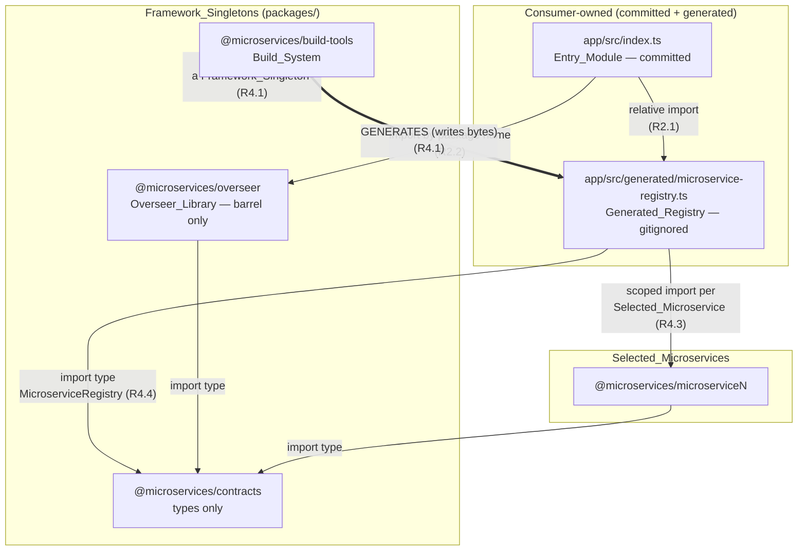

# Design Document

## Overview

This feature moves one module and relocates one generated file. It does not redesign the Overseer.

Two facts already present in the code make that true, and this design takes them as given rather than re-deriving them:

- **`boot({ microserviceRegistry, env })` is already a pure pipeline over an injected registry.** `packages/overseer/src/boot.ts` takes the registry as an option, performs no `process.exit`, writes nothing to stderr, and returns a discriminated `BootResult`. `startServer(app, port)` wraps `listen` in a promise and rejects on a bind failure. Neither signature changes.
- **`packages/overseer/src/index.ts` is, by its own file header, the sole owner of every process effect**: the static import of the generated registry, every stderr write, every `process.exit`, and the socket bind. Everything that has to move lives in that one file.

So the change is: that file moves out of the Overseer package into a consumer-owned **Entry_Package** at the **Entry_Root** (default `app`), taking the static import of the **Generated_Registry** with it; the **Registry_Generator** writes the registry into the Entry_Package's own `src/generated/` instead of into a Framework_Singleton's `src/`; and the Overseer's remaining modules become the **Overseer_Library**, a package the Entry_Module imports by name.

The static import is the thing worth preserving, and the mechanism that preserves it is worth stating plainly: the guarantee never came from the registry living inside the Overseer. It came from the registry being compiled by the same `tsc` project that imports it. Move both to the Entry_Package and the guarantee moves intact — the Entry_Package's own compilation resolves the registry's scoped specifiers, so a microservice whose module does not satisfy `MicroserviceRegistry` is a compile error in the consumer's tree (R2.8, R2.9) exactly as it is a compile error in the Overseer's tree today.

What each affected component stops and starts doing:

| Component | Stops | Starts |
| --- | --- | --- |
| `packages/overseer/src/index.ts` | Being a process entrypoint: no `void main()`, no stderr write, no `process.exit`, no `startServer` call, no import of a generated file (R3.4, R3.5) | Being the Overseer_Library's barrel: re-exports `boot`, `startServer`, and the types their signatures name (R3.1, R3.2) |
| `packages/overseer/src/generated/` | Existing at all — directory and Registry_Template both deleted (R3.6) | — |
| `<Entry_Root>/src/index.ts` | — | Being the Entry_Module: the only module that statically imports the Generated_Registry, writes stderr, calls `process.exit`, and binds the socket (R2.1–R2.6) |
| Registry_Generator (`generate-registry.ts`) | Writing to `packages/overseer/src/generated/…`; emitting the template coupling note; holding an output-path literal keyed to a Framework_Singleton | Writing to `<Entry_Root>/src/generated/microservice-registry.ts` derived from the ProjectContext, atomically, with a template-free header (R4.1, R4.2, R4.6) |
| Config_Parser (`project-config.ts`) | Recognising two top-level keys | Recognising three; validating `entry` shape and overlap with two new tags (R1.2, R1.4, R1.6, R1.7) |
| `ProjectContext` | — | Carrying the Entry_Root and the Entry_Point_Path, derived once and threaded (R1.3, R7.1) |
| Root `package.json` | Declaring a `prepare` script that copies the Registry_Template (R5.1) | Declaring `app` as a workspace (R1.8, R1.15) |
| Repo_Invariant_Checker | Performing the `[scope:template]` Scope_Template_Check and reading the Registry_Template (R6.1) | Nothing new: the Entry_Package is checked by the same Workspace_Coverage, import-discipline, and Load_Bearing_Setting checks as any other package (R6.2, R6.5) |
| Fresh-clone compilability | Being answered by an install-time template copy | Being answered by generation preceding compilation on every path, plus a named diagnostic when the registry is absent (R5.3, R5.4, R5.5) |
| `contracts` | Carrying `testing/arbitraries.ts` and a `./testing` subpath | Carrying types only; the arbitraries live under `build-tools` (R11.1, R11.2) |
| Entrypoint path (`CMD`, `scripts/start.js`, Dev_Supervisor) | Naming `packages/overseer/dist/index.js` | Naming the Entry_Point_Path, `<Entry_Root>/dist/index.js` (R7.1, R7.2) |

Provenance: decision D6 of `.kiro/steering/platform-split.md` in full, together with the arbitraries relocation of D8. Those are citations of where the decisions came from. Every behaviour this document specifies is stated here in its own terms and reads correctly with that record unloaded.

The document is organised so that each component subsection specifies one module's behaviour in its own terms, **Error Handling** indexes every failure the feature introduces or moves back to the subsection that specifies it, **Correctness Properties** states one property per criterion of Requirement 13, **Testing Strategy** maps each property to a file, and **Migration Order and Baseline Comparison** sequences the change so that `npm run ci` and the baseline comparison pass at every step boundary.

## Architecture

The inversion changes which package holds the generated file and therefore which `tsc` project compiles it. Everything else about the module graph is a consequence.



Three properties of this graph carry the design.

**Every arrow out of the platform into the consumer is a write, never an import.** `build-tools` writes the Generated_Registry's bytes; no Framework_Singleton imports it, and after this feature no module of the Overseer_Library carries a specifier containing the segment `generated` or a final segment named `microservice-registry` (R3.4). The Overseer stops being a package that imports a file it does not own — which is the whole point, because code generation into an installed `node_modules` package is not possible, and a scaffold whose tooling is consumed rather than forked cannot keep the generated registry inside the tooling.

**The consumer's own `tsc` pass is what resolves the generated registry's specifiers, so the static-import guarantee moves with the file.** The Entry_Package is a Tsc_Project (R1.14) and a root of the single selective `tsc --build`. When that pass reaches the Entry_Package it compiles `app/src/index.ts` *and* `app/src/generated/microservice-registry.ts` together, because the latter is inside the former's `rootDir`. That single fact discharges three requirements at once:

- the Registry_Export's type is *derived* from the generated module's own declaration rather than asserted over a dynamic `import()` (R2.8), so a generator emitting a differently named binding is a compile error in the consumer's tree;
- each emitted `import * as mN from "@microservices/microserviceN"` is resolved and type-checked during that compilation, so a microservice module that does not satisfy `MicroserviceRegistry` fails the build rather than failing at run time (R2.9);
- the Build_Sequence must therefore place the Entry_Package strictly after every Selected_Microservice and after the Overseer (R8.1), with one synthetic Prerequisite_Edge per Selected_Microservice (R8.4) — synthetic because the Entry_Package must *not* declare a Microservice_Package dependency (R1.11), the selected set being Selector-dependent.

Those specifiers resolve at compile and run time through the `node_modules/@microservices/*` symlinks npm creates for every workspace, exactly as the Overseer's generated imports resolve today. This is a recorded imprecision, not a new one: a genuine consumer project outside this workspace would declare those dependencies for real, and making that work belongs to the spec that publishes the platform.

**The Entry_Root sits outside the directory holding the Framework_Singletons, and the Config_Parser enforces that.** An Entry_Root equal to, inside, or containing a Discovery_Root, the `packages` container, or a Framework_Singleton directory is rejected before any discovery (R1.6). The reason is the graph above: an Entry_Package inside a Discovery_Root would be discovered as a Consumer_Package of that category, and an Entry_Package inside `packages/` would put the consumer's generated file back inside the platform's tree — reintroducing exactly the coupling this feature removes.

Ordering across a run, unchanged in shape from today and extended only at the ends:

1. Load the Project_Config_File once; derive one `ProjectContext` (now carrying the Entry_Root and the Entry_Point_Path). A rejected config terminates before discovery (R1.17).
2. Discover packages by location. The Entry_Package appears in no Consumer_Category's discovered set (R1.9).
3. Resolve the Selector; generate the registry into `<Entry_Root>/src/generated/` (R4.1). Generation precedes compilation on every path that compiles the Entry_Package (R5.3).
4. Derive the order from the Build_Sequence; run the single `tsc --build`, the Entry_Package last among the shipping Tsc_Projects (R8.1).
5. Spa bundler phase, then — for an image build — stage the Image_Tree, the Entry_Package at its package directory so the Entry_Point_Path resolves inside the image (R9.6).

## Components and Interfaces

### The `entry` configuration key

`packages/build-tools/src/project-config.ts` stays the single declaration site for the project's layout defaults and the single, total, filesystem-free Config_Parser. It gains a third recognised top-level key.

**The declaration site gains one literal and one field.** `ENTRY_ROOT_DEFAULT` joins `SCOPE_DEFAULT` and `ROOT_DEFAULTS` as the only place the string `app` appears in the Build_System (R1.3); `EffectiveConfig` gains `entry`; and the two functions that render a whole configuration — `defaultEffectiveConfig()` and `serializeProjectConfig()` — gain it too, so an absent file and `{}` continue to produce equal values by construction and a serialized config continues to declare every recognised value.

```ts
/** The only declaration of the Entry_Root_Default in the repository (R1.3). */
export const ENTRY_ROOT_DEFAULT = "app";

export interface EffectiveConfig {
  readonly scope: string;
  readonly roots: Readonly<Record<ConsumerCategory, string>>;
  /** The Entry_Root: the Entry_Package's Project_Directory-relative path (R1.1). */
  readonly entry: string;
}
```

`entry` is deliberately a sibling of `roots` rather than a fourth member of it. A `roots` member is a *Discovery_Root* — a directory whose direct subdirectories are the members of a Consumer_Category — and the Entry_Root is not that: it is one package's own directory, belonging to no category and discovered by nothing (R1.8, R1.9). Putting it inside `roots` would make `ConsumerCategory` and the `roots` record disagree about what they enumerate, and would force every existing iteration over `CONSUMER_CATEGORIES` to special-case one member.

**Two new tags.** `ConfigTag` grows from twelve to fourteen members, both belonging to the parser:

```ts
export type ConfigTag =
  | "config:unparsable" | "config:shape" | "config:unknown-key"
  | "config:scope"
  | "config:root-path" | "config:root-overlap" | "config:root-framework"
  | "config:entry-path"      // R1.4 — the value is not a Valid_Root_Path
  | "config:entry-overlap"   // R1.6 — the value collides with a reserved path
  | "config:unreadable" | "config:root-missing"
  | "config:root-not-directory" | "config:root-is-package"
  | "config:root-unreadable";
```

`parseProjectConfig(text, configPath): ParseOutcome` keeps its signature. Its internal shape gains a fourth per-value block, mirroring the `roots` block exactly:

- **Undeclared** — `entry` takes `ENTRY_ROOT_DEFAULT` and *participates* in the criterion R1.6 comparisons, just as a defaulted Discovery_Root participates in the existing overlap checks. A default that happened to collide is still a rejection.
- **Declared, wrong JSON type** — exactly one `[config:shape]` at key path `entry`, naming the JSON type found and `string` as required; no `[config:entry-path]` for the same key, no Entry_Root_Default substituted, and the value excluded from the overlap comparisons (R1.5). One wrong-typed `entry` yields exactly one diagnostic.
- **Declared, string, not a Valid_Root_Path** — exactly one `[config:entry-path]`, whose `reason` names *every* violated condition rather than the first, and whose `found` reproduces the value exactly as declared (R1.4). This reuses `rootPathViolations(value)` unchanged: the Valid_Root_Path predicate is the same one `roots` values are held to, which is what makes R1.1's "resolve that path exactly as it resolves a Discovery_Root" true by construction rather than by parallel maintenance.
- **Declared, string, a Valid_Root_Path** — taken character for character with no trimming, no separator normalisation, and no case normalisation (R1.1), then subjected to the overlap comparisons.

**The overlap check.** One helper, over the existing `liesInside(inner, outer)` primitive:

```ts
/** The reserved paths an Entry_Root may neither equal, lie inside, nor contain
 *  (R1.6): the three accepted-or-defaulted Discovery_Roots, the directory
 *  holding the Framework_Singletons, and the four Framework_Singleton package
 *  directories. Rejected `roots` values are absent from this list (R1.6). */
function entryReservedPaths(
  roots: Readonly<Record<ConsumerCategory, string>>,
  rootRejected: Readonly<Record<ConsumerCategory, boolean>>,
): readonly string[];

type EntryOverlapRelation = "is equal to" | "lies inside" | "contains";
```

For each reserved path the check reports at most one `[config:entry-overlap]`, naming the `entry` key, the Entry_Root, the colliding path, and which of the three relations holds. Every relation is decided code point for code point and case-sensitively, with no normalisation: equality is string equality, "lies inside" means the Entry_Root begins with the other path followed by a single `/`, and "contains" means the other path begins with the Entry_Root followed by a single `/`. The relations are tested in that order and the first that holds is reported, so one pair never yields two diagnostics.

**The eight-diagnostic cap is a consequence of the reserved set, not a clamp.** `entryReservedPaths` yields at most eight members — three Discovery_Roots, `packages`, and four Framework_Singleton directories — and the Entry_Root is compared against each exactly once, so "at most eight such diagnostics" (R1.6) holds by arithmetic. No counter is maintained and no diagnostic is ever suppressed by a limit. A run that rejected a `roots` value yields fewer, because that value is excluded (R1.6), which is what keeps the guarantee that no `[config:entry-overlap]` diagnostic names an already-rejected value.

**Ordering falls out of the existing collector.** `DiagnosticCollector` keys by `tag\u0000at` and returns the list sorted by ascending code point of tag then of `at`. Encoding the pair in `at` as `` `entry, ${collidingPath}` `` — the same shape `[config:root-framework]` already uses for `` `${category}, ${dir}` `` — makes two properties true at once: the key is unique per offending pair, so "exactly one per pair" needs no separate guard; and within the `[config:entry-overlap]` group every `at` shares the prefix `entry, `, so sorting by `at` *is* sorting by ascending code-point comparison of the colliding path (R1.6). No second comparator is introduced.

**The unknown-key message.** `RECOGNISED_TOP_LEVEL_KEYS` becomes `["entry", "roots", "scope"] as const` — already ascending code-point order, which is the order every `[config:unknown-key]` top-level diagnostic must list (R1.7). The array is the single source of both the recognition test and the message, so the two cannot drift.

**No filesystem access for the `entry` value.** `project-config.ts` imports neither `node:fs` nor `node:process`, so R1.16's "one input string yields the identical Config_Diagnostic list whether or not the Entry_Package is present on the filesystem" is a fact about the module graph. The Entry_Root gets **no** Filesystem_Validation: `validateDiscoveryRoots` continues to probe exactly three paths, once per Consumer_Category, and `RootProbe`/`ProbeRoot` are unchanged. This is deliberate — the Entry_Package's absence is a build failure the compiler and the Image_Assembler report against a real artefact, not a config diagnostic.

`loadProjectConfig` and `requireProjectContext` need no change beyond threading the widened `EffectiveConfig`: a `[config:entry-path]` or `[config:entry-overlap]` rejection travels the same path every other parser rejection travels, which is what gives R1.17 its behaviour — non-zero exit before any discovery, no registry written, no order derived, no Image_Tree assembled, and the bytes of any already-present Generated_Registry and generated `Dockerfile` left alone.

### ProjectContext gains the Entry_Root and the Entry_Point_Path

`packages/build-tools/src/project-context.ts` is the one place a run's scope-and-layout-dependent strings are derived, and `projectContext(config)` stays pure and total over any `EffectiveConfig` — no filesystem, so a property test builds a context from a generated config with no tree at all. It gains two readonly fields:

```ts
export interface ProjectContext {
  readonly config: EffectiveConfig;
  scopedName(name: string): string;
  readonly specifierPrefix: string;
  readonly scopeDir: string;
  readonly roots: Readonly<Record<ConsumerCategory, string>>;

  /** The Entry_Package's directory, Project_Directory-relative POSIX (R1.1). */
  readonly entryRoot: string;
  /** `${entryRoot}/dist/index.js` — the single derivation (R7.1). */
  readonly entryPointPath: string;

  readonly framework: { /* unchanged */ };
  frameworkByName(name: string): FrameworkSingleton | undefined;
}
```

`entryRoot` is `config.entry` verbatim. `entryPointPath` is `` `${context.entryRoot}/dist/index.js` `` — the Entry_Root joined to `dist/index.js` by a single `/`, `/` as the only separator, no normalisation of either part (R7.1). Deriving it here rather than at each call site is what makes "exactly one module derives it" checkable, and it retires `framework.ts`'s `OVERSEER_ENTRYPOINT` constant, whose every reader becomes a reader of `context.entryPointPath`. That retirement is the mechanism behind R7.2: with the constant gone there is no expression in the Build_System that names a Framework_Singleton's compiled path in the entrypoint role.

Neither field is a scope literal or a root literal, so the `[scope:literal]` check over `packages/build-tools/src/` continues to report nothing (R6.4).

Consumers of the two values, each reading them from the threaded context and holding no path literal of its own:

| Consumer | Reads | For |
| --- | --- | --- |
| Registry_Generator (`generate-registry.ts`) | `entryRoot` | the Generated_Registry's output path (R4.1) |
| Registry-presence guard (`entry-registry.ts`, new) | `entryRoot` | the path it reports as absent (R5.5) |
| Build_Sequence (`build-sequence.ts`) | `entryRoot` | the Entry_Statement's single member and its Prerequisite_Edges (R8.1, R8.4, R8.5) |
| Project_List derivation (`build-plan.ts`, `workspace-build-order.ts`) | `entryRoot` | the Entry_Package's entry in the ordered Project_List (R8.7) |
| Image_Assembler (`image-tree.ts`) | `entryRoot`, `entryPointPath` | the one package-directory staging target and the file the staged tree must hold (R9.6) |
| Dev_Supervisor (`dev-supervisor.ts`) | `entryPointPath` | the child process it spawns and respawns (R10.1) |
| `scripts/start.js` | `entryPointPath` | the process it spawns and whose status it exits with (R10.6, R10.7) |
| Repo_Invariant_Checker (`repo-invariants.ts`) | `entryRoot` | the Workspace_Coverage match the Root_Manifest must declare exactly once (R6.5) |
| Emit_Script (`emit-effective-dockerfile.sh`) | — reads the `entry` key from the Project_Config_File directly | the manifest `COPY` line and the single `CMD` instruction (R7.3, R7.4) |

The Emit_Script is the one exception, and for the reason it is already an exception for the three `roots`: it runs on a fresh clone before anything is compiled, so it cannot import a TypeScript module. It extracts `entry` from the Project_Config_File text the same way it extracts each root — the character sequence delimited by the surrounding double quotes, no trimming, no normalisation — and falls back to the Entry_Root_Default when the key or the file is absent (R7.4). Its detailed behaviour, including the R7.5 failure path, is a second-pass subsection.

### The Registry_Generator writes into the consumer's tree

`packages/build-tools/src/generate-registry.ts` keeps its two-function shape — the pure-ish domain function `generateRegistry(context, selector, discovery)` and the CLI adapter `runGenerateRegistryCli()` that owns the config load. Four things change.

**The output path is derived, not declared.** The module-level `OUTPUT_PATH` constant keyed to `OVERSEER.packageDir` is deleted and replaced by a derivation from the threaded context, exported so that every path that writes, guards, or gitignores the registry names one function (R5.8):

```ts
/** The Generated_Registry's path for this run: `<Entry_Root>/src/generated/
 *  microservice-registry.ts` (R4.1). The single derivation; every writer, every
 *  presence guard, and every test reads it from here (R5.8). */
export function generatedRegistryPath(context: ProjectContext): string;
```

With the constant gone, "writes no file under any Framework_Singleton's directory" (R4.1) holds because there is no expression left in the module that composes a Framework_Singleton path.

**The write is whole-file and leaves nothing partial.** `generateRegistry` creates every absent directory of the path, then writes the complete text to a sibling temporary file in the same directory and renames it over the destination. The rename is what discharges R4.2's "any path reading the file observes either its previous complete contents or the complete new contents": a plain `writeFileSync` over an existing file truncates first, so a concurrent `tsc --build` — and the dev session runs one — can read a half-written module. Same-directory placement keeps the rename on one filesystem, so it is a single atomic operation rather than a copy. The rename also gives whole-file replacement for free: the destination's previous bytes are discarded entirely, never appended to and never truncated-and-extended.

**Nothing is written on a failure path.** `resolveSelected` runs *before* the first `mkdirSync`, as it does today, so a Selector resolving to no microservice or naming an unmatched identifier fails with the existing `[selector:empty]` or `[selector:unmatched]` diagnostic, creates no directory of the registry's path, writes no registry, and leaves an already-present registry's bytes untouched (R4.8). The temporary-file-plus-rename discipline extends the same guarantee to a failure during the write itself: a failed write leaves a stray temporary file, never a damaged registry, and the generator removes the temporary file before propagating.

**The emitted text loses its template reference and keeps everything else.** The header keeps exactly two lines — the generator attribution, composed as `context.scopedName("build-tools")`, and the Selector it ran for — and the four-line `COUPLING NOTE` block naming `microservice-registry.template.ts` is deleted, because the template it describes no longer exists (R4.6). The header carries no timestamp, no absolute filesystem path, no host name, and no user name, so two runs over the same ProjectContext, Selector, and discovered packages emit byte-identical text (R4.6, R4.7). The import-specifier sequence, the exported binding's name and type annotation, and every entry's field set, field order, and field values are unchanged from the Pre_Change_Baseline (R4.9); each identifier and each specifier continues to come from the directory name rather than from the name the microservice's own manifest declares (R4.3), and every scoped name is composed through `context.scopedName(...)` so the module holds no scope literal (R4.5).

The emitted shape, for reference:

```ts
// AUTO-GENERATED by @microservices/build-tools. Do not edit.
// Selector: *
import * as m0 from "@microservices/microservice1";
import type { MicroserviceRegistry } from "@microservices/contracts";

export const microserviceRegistry: MicroserviceRegistry = [
  { identifier: "microservice1", module: m0, sourcePackage: "@microservices/microservice1" },
];
```

**Encoding and newline discipline.** The text is assembled from template literals containing only `\n`, written with the `utf8` encoding and no byte-order mark, and ends in exactly one `\n` (R4.10). The generator performs no platform-dependent line-ending translation, and this is worth stating rather than assuming: a `\r\n` would make the emitted bytes host-dependent and so break both the determinism requirement and the baseline comparison.

**Determinism has one remaining input, and it is ordered upstream.** The entry order is the Selector resolution order — for `*` and the blank spelling, ascending code-point order of directory name as Package_Discovery yields the candidates; for a comma-separated list, the order the identifiers appear in that list (R4.3). `resolveSelected` already fixes this, so the generator introduces no ordering of its own and no set iteration whose order it would have to pin.

### The Overseer becomes a library, and the Entry_Module takes its place

**The barrel.** `packages/overseer/src/index.ts` is rewritten from a process entrypoint into a re-export barrel. It exports `boot` and `startServer` — both unchanged in signature and behaviour — together with every type either names in its signature, so that a consumer importing the package by name can type its own call sites without deep-importing:

```ts
export { boot } from "./boot.js";
export { startServer } from "./server.js";
export type {
  BootOptions,
  BootResult,
  RegisteredMicroserviceInfo,
} from "./boot.js";
export type { AppConfig } from "./config.js";
```

`Express` and `http.Server` appear in those signatures but are re-exported by neither: they are types of declared dependencies a consumer imports from `express` and `node:http` directly. The rule the barrel is held to is R3.2's: every symbol the Entry_Module imports, plus every symbol the Overseer package's own tests import other than by relative path. `loadConfig`, `buildApp`, `validateToggles`, and `toggleVarName` stay internal unless that rule pulls one out; the barrel is the sole stable public API either way.

`main` and `types` need no edit — `packages/overseer/package.json` already declares `./dist/index.js` and `./dist/index.d.ts` (R3.3). What changes is that those fields stop being a misdescription. Today the manifest advertises a barrel at a path that is in fact a process entrypoint ending in `void main()`, so importing `@microservices/overseer` by name would start a server as an import side effect. Nothing does that today, which is why the discrepancy is invisible; the Entry_Module will do exactly that, so the rewrite is what makes the declared interface true.

`packages/overseer/src/generated/` is deleted with the Registry_Template inside it (R3.6). `boot.ts`'s file-header note explaining why it deliberately avoids a static import of the generated registry becomes obsolete in its reasoning — the file is no longer in this package at all — and is rewritten to say the registry is injected by the consumer's entrypoint. No other Overseer module changes: every routing, toggle-evaluation, and validation behaviour keeps the same mount order, the same duplicate-path rejection, the same toggle variable names and accepted values, and the same message text (R3.8), because none of those modules is touched.

**The Entry_Module is a verbatim move with two specifier edits.** `<Entry_Root>/src/index.ts` receives the current `main()` function and its `void main()` call unchanged. Exactly three lines differ from the file it replaces:

```ts
import { boot, startServer } from "@microservices/overseer";
import { microserviceRegistry } from "./generated/microservice-registry.js";
```

— the two Overseer imports collapse into one package-name import (R2.2), and the registry import becomes a relative specifier inside the Entry_Package (R2.1). No import reaches into another package's `src` or `dist` (R2.2). Every string literal, every template literal, every loop, and every `process.exit` call is carried across unedited, which is the mechanism for R2.7's byte-identical stdout and stderr: the failure path writes each boot message on its own line terminated by a single `\n` and exits 1 before binding anything (R2.4); the bind-failure path writes one port-naming message and exits 1 with no table line written (R2.5); the success path writes the table header, one two-space-indented line per registry entry in registry order carrying identifier, path, and toggle state, then the listening-port line, and nothing to stderr (R2.6). Preserving those bytes by *not editing the statements that produce them* is the whole reason the move is verbatim rather than a rewrite.

The file header is rewritten, since its current text describes a location and a template-copy guarantee that no longer exist. Its new content states the same ownership claim — the only module that statically imports the Generated_Registry, writes stderr, calls `process.exit`, and binds the socket (R2.3) — and states the Entry_Package's side of the contract: the Build_System reads no content of this file, writes nothing into it, and applies no validation to it beyond the checks every package of the repository gets (R2.10).

**The Entry_Package's manifest and tsconfig.** `app/package.json` declares `name: "@microservices/app"` — the Configured_Scope followed by `/` and the last segment of the Entry_Root (R1.10) — `type: "module"`, the four standard scripts, and `dependencies` naming the scoped `overseer` and `contracts` packages. It declares no Microservice_Package dependency and gets no exemption from the `[deps:peer]` check (R1.11), and it declares neither `main` nor `types`, because nothing imports it by name and the container invokes it by path (R1.12). `app/tsconfig.json` extends `../tsconfig.base.json` — one `../`, the Entry_Root being a direct child of the Project_Directory — and declares `outDir: "./dist"` and `rootDir: "./src"` of its own, inheriting `composite` and `declaration` from the base, so all four Load_Bearing_Settings verified for a shipping Tsc_Project are satisfied (R1.13). The root `workspaces` array gains exactly one entry matching `app` (R1.8, R1.15); its *position* in the array is load-bearing for nothing, since no build path derives an order from it.

**The fresh-clone guarantee that replaces the template.** The retired Template_Copy_Step answered one question: how does a clone that has never built anything typecheck a module that imports a generated file? The replacement answer is structural rather than material — **generation precedes compilation on every path that compiles or typechecks the Entry_Package** (R5.3), and there are five such paths:

| Path | Where its Registry_Generation_Step sits |
| --- | --- |
| `npm run build` / `npm test` (ordered repository build) | inside the ordered build, before the `tsc --build` pass |
| `npm start` | startup step 3, unchanged in position (R10.6) |
| `npm run dev` | startup step 3, unchanged in position (R10.6) |
| container image build stage | before the selective `tsc --build`, unchanged in position |
| the Entry_Package's own `build` and `typecheck` | first statement of each script (R5.4) |

The last row is the new one, and it is what makes `npm run build` and `npm run typecheck` succeed *inside the Entry_Package's directory* on a clone that has never generated a registry (R5.4). It requires the Build_System's own compiled output, which is why R5.4 is qualified "provided the Build_System itself is compiled" and why R5.9 exists.

**The named diagnostic, and how it is produced without reading the Entry_Module.** Two guards, both operating on paths rather than on source text.

*Registry absent (R5.5).* A new module `packages/build-tools/src/entry-registry.ts` holds the policy, pure over an injected existence probe so it is testable without a tree:

```ts
export type PathExists = (path: string) => boolean;

/** The R5.5 diagnostic text for an absent Generated_Registry, naming the path
 *  and the command that produces it — or `undefined` when the file is present. */
export function absentRegistryDiagnostic(
  context: ProjectContext,
  exists: PathExists,
): string | undefined;

/** CLI: on an absent registry, writes the one diagnostic to stderr and exits
 *  non-zero, invoking no compiler and emitting no output (R5.5). */
export function runAssertRegistryPresentCli(): void;
```

This guard runs immediately before every `tsc` invocation that includes the Entry_Package as a root. **It reads no content of the Entry_Module and no content of the registry**: it asks the filesystem whether a file exists at `generatedRegistryPath(context)`, a path derived entirely from the Effective_Config. That is the whole answer to "how is the diagnostic produced without the Build_System reading the Entry_Module" (R2.10) — the Build_System knows the registry's path because it is the party that writes it, so it never has to discover the dependency by inspecting the importer. The compiler is not invoked and no compiled output is emitted for the Entry_Package when the guard fires, which is what distinguishes the diagnostic from `tsc`'s unresolved-module error: the operator is told which file is absent and which command writes it, instead of being told a specifier could not be resolved.

*Build_System not compiled (R5.9).* The Entry_Package's own `build` and `typecheck` scripts cannot use the guard above to report this condition, because the guard *is* Build_System compiled output — if `packages/build-tools/dist/` is absent, the bin cannot run and npm reports its own ENOENT. R5.9 assigns the diagnostic to "THAT script", so the Entry_Package commits one small, dependency-free ESM shim of its own, `<Entry_Root>/scripts/generate-registry.mjs`, importing nothing beyond `node:fs` and `node:child_process`. It does three things in order: verify the Build_System's compiled entry point exists, and if not write exactly one diagnostic naming that absent path and the repository-root command that produces it, invoke no compiler, write no registry, and exit non-zero (R5.9); otherwise spawn the generator; then let the script chain continue. The scripts are therefore:

```json
{
  "build":     "node scripts/generate-registry.mjs && tsc",
  "typecheck": "node scripts/generate-registry.mjs && tsc --noEmit"
}
```

This shim is consumer-owned committed source, like the Entry_Module, and it is the kind of boilerplate the later wiring-generator spec will emit rather than ask an author to write. Its cost is one file; the alternative — a committed empty registry stand-in copied by an install hook — is the Registry_Template under another name, carries the same scope literal, and has to be kept in sync with the generator's export shape by hand.

The accepted consequence, recorded rather than designed around: an editor opened on a never-built clone reports the Entry_Module's registry import as unresolved until the first build or the first `typecheck`. R5.5's diagnostic is the mitigation for the command-line case; the editor case is left as an imprecision.

Version control and build context: `.gitignore` loses the entry naming `packages/overseer/src/generated/microservice-registry.ts` and gains one naming `<Entry_Root>/src/generated/microservice-registry.ts`, and the container build context excludes the same path, so no registry stand-in is copied into either the build stage or the production-dependency stage before its install step (R3.6, R5.7).

### The Build_Sequence gains an Entry_Statement

`packages/build-tools/src/build-sequence.ts` stays the single module in which every statement's position is declared (R8.3). It gains one statement, moves one set of synthetic edges, and changes nothing else.

**Position, and why the statements renumber.** The Entry_Statement is inserted between the Overseer and the test-only Framework_Singletons, so the seven statements become eight and the two behind it shift:

| # | Statement | Members | Change |
| --- | --- | --- | --- |
| 1 | `contracts` | the Framework_Singleton, by name | — |
| 2 | `build-tools` | the Framework_Singleton, by name, when the membership includes it | — |
| 3 | Common_Packages | calculated order | — |
| 4 | Selected_Microservices | ascending `packageDir` | — |
| 5 | Overseer | the Framework_Singleton, by name | — |
| 6 | **Entry_Package** | **the single member, by the Entry_Root** | **new (R8.1)** |
| 7 | test-only Framework_Singletons | by name, when the membership includes them | was 6 |
| 8 | Spa_Packages | ascending `packageDir`, trailing bundler phase | was 7 (R8.2) |

`SequencedPackage.statement` widens from `1 | … | 7` to `1 | … | 8`, and `UNORDERED_STATEMENTS` becomes `{4, 7, 8}` — the same three sets of members as before, under their new numbers. Renumbering rather than appending a statement 8 after the Spa phase is what makes R8.1's "strictly before the test-only Framework_Singletons" and R8.2's "the Spa bundler phase is the trailing statement" both true of the *declared* statement order, rather than true of the declared order for one and of a comparator applied afterwards for the other.

**The statement's single member is named, not discovered, and it is unconditional.** Like statements 1 and 5, statement 6 takes its member from the threaded context rather than from a `SequenceMembership` field:

```ts
// Statement 6 — the Entry_Package, after the Overseer (R8.1).
sequenced.push({
  packageDir: context.entryRoot,
  name: context.scopedName(lastSegment(context.entryRoot)),
  statement: 6,
});
```

`SequenceMembership` therefore gains no field. That is a decision, not an omission: statements 2 and 6 carry flags because `build-tools` and `integration-tests` are excluded on the image and dev paths, whereas the Entry_Package is compiled on *every* Order_Producing_Path — the ordered repository build, the image build, and the dev session alike (R8.7). A flag would be a switch with no `false` caller.

The member's `name` is composed exactly as R1.10 requires the Entry_Package's manifest to spell it: the Configured_Scope followed by `/` and the last path segment of the Entry_Root. So the sequence needs no manifest read to name the package it hands to `--workspace`, and the composition holds no scope literal (R6.4). If a project's manifest disagreed with that composition, `npm run build --workspace <name>` would fail on an unknown workspace; no new check is introduced to catch it, because R1.10 fixes the name and Workspace_Coverage already fixes the directory (R6.5).

A consequence of statement 6 being the Entry_Package worth stating explicitly: the ordered repository build reaches it by spawning its own `build` script, which performs a Registry_Generation_Step before invoking the compiler (R5.4). Generation preceding compilation on that path is therefore the same fact as the statement's position, not a second arrangement.

**The synthetic Prerequisite_Edges move from the Overseer to the Entry_Package.** `prerequisiteEdges(context, nodes, selectedMicroservices)` keeps its signature and its de-duplication. One line changes — the `dependent` of each synthesised edge:

```ts
// The Generated_Registry the Entry_Package compiles statically imports each
// Selected_Microservice (R8.4). Synthetic because R1.11 forbids the Entry_Package
// from declaring a Microservice_Package dependency and the selected set is
// Selector-dependent, so no manifest can carry these edges.
for (const identifier of new Set(selectedMicroservices)) {
  edges.push({
    prerequisite: `${context.roots.microservice}/${identifier}`,
    dependent: context.entryRoot,
  });
}
```

No `microservice → overseer` edge is synthesised in its place (R8.4), and the reason is that the fact the edge recorded has stopped being true: the Overseer no longer imports a generated file, so nothing in its compilation reads a microservice's compiled output (R3.4).

**The `Overseer → Entry_Package` edge is declared, not synthesised (R8.5).** It arrives through the ordinary path every other edge arrives through: the Entry_Package declares `@microservices/overseer` in its own `dependencies` (R1.10), `dependencyKeysOf` resolves that specifier against the declared names, and `prerequisiteEdges` records `prerequisite: packages/overseer, dependent: <Entry_Root>`. For that to happen the Entry_Package must be one of the `WorkspaceNode`s, so `workspaceNodesFrom` collects it and `WorkspaceNode.tier` gains a fourth value, `"entry"`. Every existing filter over `tier` tests for `"common"`, `"microservice"`, or `"spa"`, so each excludes the new value unchanged — in particular `build-plan.ts`'s reconstruction of the full-workspace membership does not pick the Entry_Package up as a Consumer_Package, and the Spa exclusion in `prerequisiteEdges` does not apply to it. The Entry_Package reaches `buildSequence` through statement 6 and through nothing else.

The Entry_Package's declared `@microservices/contracts` dependency yields a third edge, `contracts → <Entry_Root>`, by the same mechanism. It is satisfied by statement 1 under every ordering and is worth naming only because R13.8 quantifies over *every* prerequisite the Entry_Package has: a relocation ahead of `contracts` violates that edge and must be reported like any other.

**What the Verification_Pass reports.** The pass is unchanged in structure — cycle, positional, structural, divergence, in that order — and the Entry_Package's violations are always positional. Statement 6 has exactly one member and is not in `UNORDERED_STATEMENTS`, so no edge can have both endpoints in it and the structural clause is unreachable for the Entry_Package. Each edge is examined exactly once and contributes at most one message, which is what makes R8.6's "exactly one `[build-order:prerequisite]` diagnostic per violated Prerequisite_Edge" hold by construction rather than by a de-duplication step, and what makes R13.8's completeness claim checkable: for an order relocated so that the Entry_Package sits at index *k*, the reported set is exactly the edges whose prerequisite sits at or after *k*, with no further diagnostic. The message wording is the existing positional clause, naming the package placed ahead and the prerequisite it precedes; `assertBuildOrder` then raises every finding before any `build` script is spawned, and the run exits non-zero (R8.6). No new tag is introduced.

The divergence check needs no attention: both orders the check compares — the image path's Selector-scoped `tscSequence` and the repository-wide `workspaceOrder` — contain the Entry_Package at the same relative position, because both derive it from the same statement.

**The consequence: the Overseer may now compile before any microservice.** With the synthetic edges moved, nothing in the Prerequisite_Graph constrains the Overseer relative to a microservice. The *produced order* is unchanged — statement 5 still follows statement 4, which is what keeps the re-recorded `build-order.<slug>.json` confined to a single inserted entry (R14.9) — but the *constraint set* is weaker, and deliberately so: an order placing the Overseer ahead of every microservice would now be accepted, correctly, because the Overseer's compilation reads no microservice's output. The tightening moved rather than vanished. It now sits on the package that does read that output, and R8.8 fixes the Entry_Package's position under every Selector: immediately after the Overseer's entry and before the first test-only entry, whatever statement 4's membership is, including a Selector resolving to a single microservice.

### Image staging follows the entrypoint

`packages/build-tools/src/image-tree.ts` executes a plan and derives nothing, so almost all of this feature's staging change is a change to `build-plan.ts`'s plan.

**The walk roots become the Entry_Package plus the Selected_Microservices (R9.1).** `resolveDependencySets(context, selected, discovery, readDependencies)` is called with the Entry_Package in the root set and the Overseer out of it. The Overseer is reached instead through the Entry_Package's declared `@microservices/overseer` dependency, which resolves to a Framework_Singleton and — by the existing rule that a Framework_Singleton specifier resolves but is not followed — becomes no member of the Required_Dependencies. It is staged on Framework_Singleton grounds, as `contracts` is.

The root-set change is what makes the consumer's own library dependencies reachable: a Common_Package an Entry_Module imports is now in the Required_Dependencies and ships, where before only the Overseer's and the microservices' dependencies were. The reverse direction is the thing to watch, and it is recorded rather than designed around: the Overseer's own scoped dependencies stop being walked from a root of their own. In this repository that removes nothing from the staged set, because the Overseer declares no Common_Package dependency — and the mechanical proof is R14.8's confinement, which permits the removal of the `packages/overseer` entry, the addition of a `node_modules/<Configured_Scope>/overseer` entry, and the addition of exactly one Entry_Root entry, and nothing else. A staged Common_Package disappearing would fail that comparison by name.

**Three changes to the plan's staging groups.**

*The Overseer moves into the scope directory (R3.7).* `OVERSEER.staging` in `framework.ts` changes from `"package-dir"` to `"scoped-node-modules"`, which moves it from `alwaysStagedAtPackageDir` to `alwaysStagedScoped` with no change to either helper. It is then staged at `node_modules/<Configured_Scope>/overseer` as a real directory holding its `package.json` and its compiled `dist` and nothing else, because `copyPackage` stages exactly that surface for every package whatever its category — so "no `src` directory of it" (R3.7) needs no rule of its own. The reason the move is correct is the whole feature: the Entry_Module imports the Overseer by package name, so it must resolve through `node_modules`, and no process invokes it by path any more.

*The Entry_Package takes the sole package-directory staging (R9.6).* `alwaysStagedAtPackageDir` now yields nothing from the Framework_Singleton records, and `stageOf` appends exactly one entry of its own:

```ts
// The one package staged at a package directory rather than under the scope
// (R9.6), so the Entry_Point_Path resolves inside the image. Not a
// FrameworkStaging record: the Entry_Package is no Framework_Singleton.
{
  sourceDir: context.entryRoot,
  targetDir: context.entryRoot,
  scopedEntry: undefined,
  justification: "entry-package",
}
```

`StagedPackage.justification` gains that fourth member. It earns its place twice over: it is the ground R9.7 requires the Integrity_Assertion to accept for the package-directory staging, and it routes the Entry_Package to the right message when its compiled output is absent (below). The staged surface is again `package.json` plus `dist`, so `<outDir>/<Entry_Root>/dist/index.js` exists — a file at the Entry_Point_Path (R9.6, R7.7) — while `<Entry_Root>/src/generated/microservice-registry.ts` is never staged, which is how R9.5's "no Generated_Registry source file" holds. Its *compiled* form does ship, inside the Entry_Package's `dist`, and must: the compiled entrypoint imports it.

The group order in `stage` becomes the always-staged scoped Framework_Singletons (`contracts`, then the Overseer, in `framework.all` order), the STAGE set, the Selected_Microservices, then the Entry_Package. The recording sorts its entries, so the group order is unobservable in `image-tree.<slug>.json`; it is stated only so the list has one definition.

*The always-staged `contracts` is retained, unchanged (R9.4).* It remains a `"scoped-node-modules"` Framework_Singleton staged for every Selector, including the complete `dist/testing/` surface `copyPackage`'s `dereference: true` already produces — noting that after the arbitraries relocation that surface no longer exists, so the file set shrinks for a reason the relocation owns rather than one staging owns. `build-tools`, `integration-tests`, and the microservice Discovery_Root are staged into no Image_Tree (R9.5) because no group of `stageOf` yields them: `build-tools` and `integration-tests` declare `"none"` staging, and a microservice is staged from its identifier into the scope directory, never from its Discovery_Root.

**The minimality diagnostics.** `assertImageTreeIntegrity` enumerates the real direct entries under `<outDir>/<scopeDir>` and compares them with the `scopedEntry` values `plan.stage` justifies, reporting `[image-tree:unjustified]` for every present-but-unjustified entry and `[image-tree:missing]` for every justified-but-absent one, each offender named, unjustified before missing, and exiting non-zero (R9.7). Two consequences of the staging change land here without a line of new logic:

- **The Entry_Package cannot be reported.** Its staged entry carries `scopedEntry: undefined`, so it is neither enumerated by `listScopedEntries` nor a member of the justified set. R9.7's "SHALL report no diagnostic for the Entry_Package's package-directory staging" holds because the check does not range over it, not because an exemption was written for it.
- **The Overseer becomes subject to the check.** At `packages/overseer` it sat outside the enumerated directory and nothing verified its presence; at `node_modules/<Configured_Scope>/overseer` it is enumerated and justified, so an image that failed to stage it now fails with `[image-tree:missing]` naming `overseer`. That is a strictly better check, obtained by moving the package rather than by adding an assertion.

`scopeDirOf(plan)` still recovers the scope directory from the first scoped staged entry, and the first entry of `stage` is still a scoped Framework_Singleton, so its derivation is untouched.

**Absent compiled output (R9.9).** `assertBuildOutputsPresent` runs over `plan.stage` before the `rmSync` of `outDir` and before the first copy, so an offender leaves no partially staged tree. The Entry_Package is now one of the packages it ranges over, and its `"entry-package"` justification is not `"framework-singleton"`, so it falls to the `[image-tree:no-dist]` branch and is reported as `package "<Entry_Root>" has no build output: "<Entry_Root>/dist" is absent or empty` — exactly one diagnostic naming the package and its absent compiled output, with the existing wording and no new tag.

**Where the registry is generated on this path.** `runImageTreeCli` already generates the registry after discovery and before plan derivation, and that position is unchanged (R5.3): the write simply lands at `generatedRegistryPath(context)` instead of under `packages/overseer/`. The registry-presence guard runs immediately before `executeBuildPlan`'s `tsc --build`, so a suppressed or failed generation is reported as the named R5.5 diagnostic rather than as an unresolved-module error from the compiler.

### The Dev_Supervisor and the startup sequences

`packages/build-tools/src/dev-supervisor.ts`'s pure decision core — `DevEvent`, `DevState`, `DevAction`, `decide`, `reduceDevEvents` — is not touched by this feature. Every rule about when a child may start, restart, or stay put is a statement about `decide`'s output, and none of those rules mentions which path is spawned.

**The spawned path becomes a parameter (R10.1, R7.2).** The module-level `import { OVERSEER_ENTRYPOINT } from "./framework.js"` is deleted along with the constant, and `runDevSupervisor` takes the path instead of reaching for it:

```ts
export function runDevSupervisor(
  entryPointPath: string,
  projectList: readonly string[],
  env: NodeJS.ProcessEnv,
): void;
```

`startOverseer` spawns `process.execPath` with `[entryPointPath]`, and `runDevSupervisorCli` passes `context.entryPointPath` from the context it already obtains through `requireProjectContext`. Threading the value rather than importing a constant is what keeps R7.1's single derivation true of the dev path: the shell composes no path of its own.

The readiness marker is unchanged. The child still announces itself with `[boot] Overseer listening on port`, because that line moved to the Entry_Module verbatim (R2.7), so the stdout scan that raises `overseer-ready` keeps matching. Every `[dev] …` log string the supervisor writes is likewise unchanged; nothing in Requirement 10 asks for new wording, and the `dev-*` integration suites compare that text.

**The watched project set (R10.2).** `devProjectList(context, plan)` returns `plan.tscRoots`, and `tscRoots` is the Build_Sequence's produced order, which now carries the Entry_Package at statement 6. So the Entry_Package joins the watched set alongside the Selected_Microservices, the Overseer_Library, and the Required_Dependencies with no change to this module — the set is one derivation shared with the image path, not two that agree. The watcher receives it as a root of `createSolutionBuilderWithWatch`, which is what makes a change to `<Entry_Root>/src/index.ts` a watched change at all.

**Restart on change (R10.3, R10.4).** An edit to a source file of any watched project raises `6032`, then `6193`/`6194`, which the shell turns into `compile-start` and `compile-complete`. A clean pass that emitted advances the generation; `decide` then stops a live child and owes a restart, the exit handler starts the replacement against the recompiled output, and the restarted child serves the changed behaviour. The Entry_Package's sources and a microservice's sources travel identical paths through that machine; the 60-second bound of R10.3 and R10.4 is an assertion an integration test makes about the whole loop, not a timer the supervisor runs — there is no debounce anywhere in the module, and a burst of edits coalesces because only a burst's final `compile-complete` can restart anything.

**A failed recompile (R10.5).** `decide`'s `errorCount > 0` branch is unchanged: the last successfully started child keeps serving, TypeScript's own formatter reports each diagnostic with its file, line, and character position, no child is started against the failed output, the compiled output the running child loaded is left alone — the shell writes nothing on this path — and the watcher keeps running for the next change. The one case worth naming is the first pass: with no last-good child the branch additionally says so, so nobody waits for a server that is not coming.

**The one-child invariant (R10.9).** `start-overseer` is emitted only from phase `none`, and a live child is moved to `stopping` with a restart owed, the replacement being started from the `overseer-exited` handler. So the previous child has exited before its replacement is spawned and the replacement binds the same port. This is a property of the phase machine rather than a check, and it is the reason the existing restart-decision property suite needs no change: the events, states, and actions it generates over are the same.

**The two startup sequences (R10.6, R10.7, R10.8).** Both keep the Pre_Change_Baseline's four ordered steps — environment load, bootstrap build, registry generation, server start — with step 3 writing the Generated_Registry at its new path and step 4 naming the Entry_Point_Path:

| | `npm start` | `npm run dev` |
| --- | --- | --- |
| steps 1–3 | unchanged in position | unchanged in position |
| step 4 | `scripts/start.js` spawns `context.entryPointPath` and exits with that process's status, watching for no change (R10.7) | `runDevSupervisorCli` derives the plan, then hands `context.entryPointPath` and the project list to the shell |

`scripts/start.js` and `scripts/dev.js` run after the bootstrap build, so both read `entryPointPath` from the compiled `ProjectContext` rather than composing a path — the same way they already reach every other config-derived value, and the reason R7.2's "no Framework_Singleton's compiled path in the entrypoint role" is checkable by the absence of the retired constant.

A dev startup that fails before the first successful compilation spawns no child and starts no watcher, and exits non-zero (R10.8). Four failure points sit ahead of the first child, each already exiting that way: the config load inside `requireProjectContext`; the registry generation of step 3; the plan derivation, whose `[selector:*]`, `[shared:unresolved]`, `[deps:*]`, and `[build-order:*]` messages reach stderr verbatim; and the registry-presence guard, run before the builder's first pass. Only a watcher that fails to start is framed by this module, with its existing `[dev] failed to start the build watcher:` prefix.

### The Emit_Script reads the `entry` key

`scripts/emit-effective-dockerfile.sh` keeps every constraint that shapes it: no external command the Pre_Change_Baseline did not already invoke (`awk` twice, plus `mktemp` and `mv`), no imported compiled Build_System module, no installed dependency directory, and no completed install or compile (R7.4's fallback exists because the script must run on a fresh clone). It gains a fourth configured value and one emitted instruction.

**Extraction, with the discipline the three roots already have.** Pass 1's `awk` program gains a depth-1 `entry` branch in `assign()`, alongside the existing depth-1 `roots` branch:

- the value must be a `"`-delimited run on the same line, read by `readString`, so no trimming and no normalisation is applied and an escape sequence or a line break makes it unreadable;
- the run is checked against the same `validRoot` Valid_Root_Path predicate the three roots are checked against;
- failure calls the existing `fail("entry")`.

`ENTRY_ROOT` is initialised to the awk literal `app` before the file is read, so an absent Project_Config_File (`getline` returning `-1`) or a file declaring no `entry` key leaves the default in place (R7.4). That literal joins the three Root_Defaults under the script's existing requirement-sanctioned-duplication note: `project-config.ts` is the single declaration site, this script cannot import it, and a change to `ENTRY_ROOT_DEFAULT` must edit both in one change. The Configured_Scope is still not among the values the script reads.

Pass 1 prints a fourth already-defaulted line, `ENTRY_ROOT=<value>`, and the shell's `while IFS='=' read` loop gains one `case` arm. No `eval`, no subshell, nothing from the config file reaching the shell as code.

**Two things the script deliberately does not do.** It does not apply the R1.6 overlap check — a colliding Entry_Root is rejected by the Config_Parser on every path that discovers, builds, or assembles, and this script runs before any of them, so a colliding config still produces a `Dockerfile` whose `CMD` names a path no build will produce. And it composes the Entry_Point_Path itself, as the Entry_Root joined to `dist/index.js` by a single `/`, which is a second derivation of the value R7.1 assigns to one module. Both are the existing `WORKSPACE_SCOPE` imprecision in another costume: the script and the Build_System read the same committed file, so they agree in practice, and nothing cross-checks them. R7.1's single-derivation rule and the `[scope:literal]` check are both scoped to `packages/build-tools/src/`, which leaves this script outside them by the same decision that already leaves the Root_Defaults duplicated here.

**The manifest `COPY` line (R7.4, R7.6).** One line is appended to the manifest block, after the spa group and last of all:

```
COPY app/package.json app/
```

It is emitted unconditionally, with no `-f` existence test, unlike the four filesystem-discovered groups. That is deliberate: the Entry_Package is a single known path rather than a discovered set, and an absent manifest should fail `docker build` at the `COPY` rather than silently produce an image with no entrypoint. Appending it last, rather than inserting it after the root manifests, keeps every retained `COPY` line at its existing index inside the block, which is what R14.7's positional confinement wants.

The Exclusion_List derivation is untouched (R7.6). The Entry_Root is not a `packages/<name>` path, so the top-level `packages/*/` loop never sees it and no top-level entry gains or loses an exclusion. Under the default configuration the excluded names remain exactly `microservices`, `common`, `spa`, and the by-name `integration-tests`.

**The single `CMD`, at a declared anchor (R7.3).** `Dockerfile.template`'s last line, `CMD ["node", "packages/overseer/dist/index.js"]`, is replaced by an anchor comment:

```
# --- CMD ---
```

Pass 2 records the anchor's line number as it already records the two manifest anchors, and in `END`, before any output, validates three things rather than two: that the anchor is present, failing with `[emit-effective-dockerfile] <template> is missing the '# --- CMD ---' anchor`; and that the template declares no `CMD` instruction of its own, failing with a message naming the offending line, because a retained `CMD` would give the generated file a second one. At the anchor's index it prints `CMD ["node", "<Entry_Point_Path>"]` and nothing else, so exactly one `CMD` instruction exists anywhere in the generated file.

`ENTRYPOINT ["dumb-init", "--"]` stays in the template as committed source, so the toggle-default `ENV` block keeps anchoring on the last `ENTRYPOINT` and lands at the same index it lands at today. The generated instruction order is therefore unchanged: `EXPOSE`, `USER`, the `ENV` toggle block, `ENTRYPOINT`, `CMD`.

Two `COPY` instructions leave the template with the Registry_Template they name — one in the build stage and one in the production-dependency stage — together with the comment blocks explaining the Template_Copy_Step (R7.3, R5.7). Nothing replaces them: `npm ci` no longer runs a `prepare` script, so there is nothing to stage before the install, and the image's build stage generates the registry inside `build-image-tree` as it already does.

**The failure path (R7.5).** `fail("entry")` writes one message to stderr naming the Project_Config_File and the key it could not read, and exits 1. Because pass 1 runs inside a command substitution guarded by `set -eu`, the script aborts there — before `mktemp` is reached, so no temporary file exists, no `mv` runs, nothing is written to the generated `Dockerfile` path, and a file already there keeps its bytes. That is the same shape the three roots' failures already have; the only new thing is the key that can name itself in the message. The same holds for pass 2's validation failures, which write to stderr and exit before printing a single line of the document, leaving the temporary file empty and unmoved.

### Relocating the arbitraries

**The new location.** `packages/contracts/testing/arbitraries.ts` and `packages/contracts/testing/index.ts` move to `packages/build-tools/src/testing/arbitraries.ts` and `packages/build-tools/src/testing/index.ts` (R11.1). Inside the `src` directory of a package whose `rootDir` is `./src` and whose `outDir` is `./dist`, so the compiled form lands at `packages/build-tools/dist/testing/`, and importers name:

```ts
import { arbIdentifier } from "@microservices/build-tools/dist/testing/index.js";
```

The source is byte-identical to the Pre_Change_Baseline's apart from its header comment, which names the new location, and the module specifiers it declares — of which it has two, `fast-check` and `express`, neither of which changes. `index.ts`'s single `export * from "./arbitraries.js"` is unchanged (R11.4). Nothing is added, nothing is removed, and no exported arbitrary's value space or exported helper's signature moves.

**A compiled deep path, not an `exports` map (R11.5).** `build-tools` declares no `exports` map today, and adding one would close every compiled deep path the existing suites already import from it — `@microservices/build-tools/dist/selector.js` among them. Declaring `"./testing"` would therefore be a breaking change to the package's de facto interface in exchange for a shorter specifier. The bin-only tooling package's interface stays "its `bin` block plus its compiled modules by path", which is the convention `structure.md` already records for it.

**This is not purely a `fast-check` move.** The relocated module exports `buildExpressRouter` and `toggleVarName` as well as arbitraries, and `buildExpressRouter` builds a real `express.Router()`. So `build-tools` declares three new development dependencies, not one: `fast-check`, `express`, and `@types/express` (R11.3). `contracts` keeps its `express` dependency, which its type surface needs; what it loses is `fast-check` — which it never declared, the dependency having been satisfied from the workspace root, so R11.2's "declares `fast-check` in neither" is satisfied by the relocation plus the absence it already had — and every value export.

Three consequences of the exported helpers, each worth naming:

- **No scope literal arrives in `packages/build-tools/src/`.** The module's strings are identifiers, path segments, toggle tokens, HTTP methods, and the `MICROSERVICE_<IDENTIFIER>_ENABLED` template. None carries the Scope_Default, so the `[scope:literal]` check continues to report nothing over that directory (R6.4).
- **No runtime dependency is created anywhere.** A package whose tests import the relocated module declares `build-tools` as a *development* dependency (R11.8). The dependency resolver and `discovery.ts` read `dependencies` keys only, so such a declaration creates no Prerequisite_Edge, adds nothing to the Required_Dependencies, stages nothing, and — the reason R14.4 can hold `discovery.json` fixed — appears in no recorded fact.
- **`fast-check` and `express` never ship through this route.** `build-tools` is staged into no Image_Tree (R9.5), so its `dist/testing/` is unreachable from any image.

**The obligation over the importers.** Every module naming the Retired_Testing_Specifier must name the relocated module instead, and the obligation stands over the set the build finds rather than over an enumerated list (R11.6). As the tree stands that set is nine test files — in `packages/overseer/tests/` (four), `packages/microservices/microservice1/tests/` (two), `packages/microservices/microservice2/tests/`, `packages/microservices/microservice3/tests/`, `packages/build-tools/tests/`, and `packages/integration-tests/tests/` (one each) — plus `contracts`' own `exports` map entry. Each importing package gains the `build-tools` development dependency; `build-tools`' own test imports the module by relative path (`../src/testing/arbitraries.js`) like every other module of its own package.

`contracts` sheds the rest of the `testing` directory's apparatus in the same change: the `./testing` entry of its `exports` map, `tsconfig.testing.json`, and the second `tsc` invocation in each of its `build` and `typecheck` scripts, which collapse to one invocation over its own `tsconfig.json` (R11.9). After that the package has no TypeScript project configuration file whose sources are a `testing` directory, and its compiled output holds no module under one and no module importing `fast-check` (R11.2).

**The mechanical guards.** Two, because the requirement asks two different questions.

*The specifier is gone (R11.7).* One test scans every tracked `.ts`, `.js`, and `.json` file of every workspace package, of the Entry_Package, and of `scripts/`, excluding `.kiro/specs/` — the specification documents record the history rather than the state — and fails naming the offending file and line if any names the Retired_Testing_Specifier. It excludes its own source, as the worktree-safety guard already excludes its own (R12.7), since it must spell the string it forbids.

*Nothing shipped can reach it (R11.10).* A second test walks import declarations outward from each shipped barrel — `contracts`' and the Overseer_Library's, each Common_Package's, each microservice's `src/index.ts` — and from the Entry_Module, and fails if any reachable module imports the relocated Arbitraries_Module or `fast-check`, naming the reachable module and the import declaration that reached it. This is the check that would catch the mistake the relocation is *for*: a test-support value drifting back into a package a consumer installs.

## Data Models

Every type this feature adds or changes. Declarations for the genuinely new shapes appear once, where they are used; this table indexes them rather than repeating them.

| Name | Module | What it models | Declaration |
| --- | --- | --- | --- |
| `EffectiveConfig` | `build-tools/src/project-config.ts` | The fully defaulted, validated configuration one run operates on. **Changed**: gains `entry: string`. | Components → *The `entry` configuration key* |
| `ENTRY_ROOT_DEFAULT` | `build-tools/src/project-config.ts` | **New.** The sole declaration of the Entry_Root_Default `app` (R1.3). | Components → *The `entry` configuration key* |
| `ConfigTag` | `build-tools/src/project-config.ts` | The closed set of diagnostic tags. **Changed**: gains `config:entry-path` and `config:entry-overlap`, twelve members to fourteen. | Components → *The `entry` configuration key* |
| `EntryOverlapRelation` | `build-tools/src/project-config.ts` | **New.** Which of the three collision relations a rejected Entry_Root bears to a reserved path, for the diagnostic's `reason` (R1.6). | Components → *The `entry` configuration key* |
| `ProjectContext` | `build-tools/src/project-context.ts` | The per-run derivation threaded through every component. **Changed**: gains `entryRoot` and `entryPointPath`. | Components → *ProjectContext gains the Entry_Root and the Entry_Point_Path* |
| `PathExists` | `build-tools/src/entry-registry.ts` | **New.** The injected existence probe the registry-presence guard is pure over. | Components → *The Overseer becomes a library…* |
| `ConfigDiagnostic`, `Diagnostics`, `ParsedConfig`, `ParseOutcome`, `LoadOutcome` | `build-tools/src/project-config.ts`, `config-loader.ts` | **Unchanged in shape.** The two new tags travel inside the existing four-part `ConfigDiagnostic`, so no consumer of these types changes. | — |
| `RootProbe`, `ProbeRoot`, `ConfigFileRead`, `ReadConfigFile` | `build-tools/src/config-loader.ts` | **Unchanged.** The Entry_Root gets no Filesystem_Validation, so the prober still answers for exactly three Discovery_Roots. | — |
| `FrameworkStaging` | `build-tools/src/framework.ts` | Where a Framework_Singleton is staged in an image. **Changed in use, not in shape**: `OVERSEER.staging` moves from `"package-dir"` to `"scoped-node-modules"` (R3.7). The `"package-dir"` member survives because the Entry_Package now uses it — via the Image_Assembler's plan, not via a `FrameworkDirectory` record, the Entry_Package being no Framework_Singleton (R9.6). | — |
| `StagedPackage` | `build-tools/src/build-plan.ts` | One package the Image_Assembler stages, and why. **Changed**: `justification` gains `"entry-package"`, the ground R9.7 requires for the one package-directory staging and the route to the right absent-output message (R9.9). | Components → *Image staging follows the entrypoint* |
| `WorkspaceNode` | `build-tools/src/workspace-build-order.ts` | One workspace package as the ordering derivations see it. **Changed**: `tier` gains `"entry"`; every existing `tier` filter excludes it unchanged (R8.5). | Components → *The Build_Sequence gains an Entry_Statement* |
| `SequencedPackage` | `build-tools/src/build-sequence.ts` | One entry of a produced order. **Changed**: `statement` widens from `1 \| … \| 7` to `1 \| … \| 8` (R8.1, R8.3). | Components → *The Build_Sequence gains an Entry_Statement* |
| `OVERSEER_ENTRYPOINT` | `build-tools/src/framework.ts` | **Deleted.** Every reader becomes a reader of `context.entryPointPath` (R7.1, R7.2). | — |
| `BootOptions`, `BootResult`, `RegisteredMicroserviceInfo`, `AppConfig` | `overseer/src/boot.ts`, `config.ts` | **Unchanged in shape, newly public.** Re-exported from the Overseer_Library's barrel so a consumer can type its own call sites (R3.1, R3.2). | Components → *The Overseer becomes a library…* |
| `MicroserviceRegistry`, `MicroserviceModule` | `contracts/src/` | **Unchanged.** The Registry_Export's type and the shape each Selected_Microservice must satisfy. The relocation of the arbitraries removes values from `contracts`, not types. | — |

Two shapes that are data models in effect, though neither is a TypeScript type:

**The Generated_Registry's emitted shape** — two header comment lines, one `import * as mN` per Selected_Microservice in Selector order, one `import type { MicroserviceRegistry }`, and one exported `microserviceRegistry` array whose entries carry exactly `identifier`, `module`, and `sourcePackage` in that order. Shown in Components → *The Registry_Generator writes into the consumer's tree*. Unchanged from the Pre_Change_Baseline except for the removal of the template coupling note (R4.9, R14.6).

**The `scaffold.config.json` shape** — three recognised top-level keys, all optional: `scope` (string), `roots` (object with exactly `microservice`, `common`, `spa`, each a string), and `entry` (string). No other top-level key and no other `roots` member carries meaning, and there is no environment-variable override of any of them (R1.2). This repository declares no config file at all and so takes all five defaults, `entry` included (R1.15, R14.1).

## Error Handling

Every failure this feature introduces or moves, indexed rather than respecified. The behaviour of each is stated once, in the subsection the last column names; this table is how a reader finds it and how a reviewer checks that none was left without an owner.

Three facts hold across the whole table and are not repeated per row: every failure exits non-zero; every failure that can occur before a write occurs before that write, so no path leaves a partially produced artefact; and no existing diagnostic tag changes its wording, its conditions, or its reporting order (R14.5, R6.2).

| Failure | Reported as | Exit / artefact effect | Specified in |
| --- | --- | --- | --- |
| Declared `entry` is not a Valid_Root_Path | one `[config:entry-path]` Config_Diagnostic per rejected value, naming the key, reproducing the value, and listing every violated condition | run terminates before any discovery; no registry written, no order derived, no Image_Tree assembled; an already-present registry and generated `Dockerfile` keep their bytes (R1.17) | *The `entry` configuration key* |
| Declared `entry` is present but not a JSON string | one `[config:shape]` naming the key path, the type found, and `string`; no `[config:entry-path]` for the same key; the value excluded from the overlap comparisons | as above | *The `entry` configuration key* |
| Entry_Root equals, lies inside, or contains a reserved path | one `[config:entry-overlap]` per offending pair, at most eight, each naming the key, the Entry_Root, the colliding path, and the relation; ordered by ascending code point of colliding path | as above | *The `entry` configuration key* |
| An unrecognised top-level config key | the existing `[config:unknown-key]`, now listing `entry`, `roots`, `scope` in ascending code-point order (R1.7) | as above | *The `entry` configuration key* |
| Generated_Registry absent when the Entry_Package is compiled or typechecked | one stderr diagnostic naming the absent path and the command that produces it | no compiler invoked, no compiled output emitted for the Entry_Package (R5.5) | *The Overseer becomes a library…* (`entry-registry.ts`) |
| Build_System's own compiled output absent when the Entry_Package's `build` or `typecheck` runs | one stderr diagnostic from `<Entry_Root>/scripts/generate-registry.mjs` naming the absent compiled entry point and the repository-root command that produces it | no compiler invoked, no registry written (R5.9) | *The Overseer becomes a library…* (the shim) |
| A write of the Generated_Registry fails | the underlying error propagates | the temporary file is removed and the destination keeps its previous complete bytes; no partial registry (R4.2) | *The Registry_Generator writes into the consumer's tree* |
| Selector resolves to nothing, or names an unmatched identifier | the existing `[selector:empty]` / `[selector:unmatched]` | raised before the first `mkdirSync`: no directory of the registry's path created, no registry written, an already-present registry unchanged (R4.8) | *The Registry_Generator writes into the consumer's tree* |
| The Entry_Package's manifest names a Microservice_Package | the existing `[deps:peer]`, with no exemption for the Entry_Package (R1.11) | run terminates before any build is spawned | *The Build_Sequence gains an Entry_Statement* |
| A produced order places the Entry_Package ahead of a prerequisite | one `[build-order:prerequisite]` per violated edge, each naming the package placed ahead and the prerequisite it precedes; always the positional clause shape | `assertBuildOrder` raises before any `build` script is spawned (R8.6) | *The Build_Sequence gains an Entry_Statement* |
| A scoped specifier of the Entry_Package resolves to nothing, or the graph cycles | the existing `[shared:unresolved]` / `[build-order:cycle]`, unchanged in wording | as above | *The Build_Sequence gains an Entry_Statement* |
| Entry_Root matched by zero or more than one `workspaces` entry | one Workspace_Coverage violation naming the Entry_Root and every matching entry, decided as for any other package (R6.5) | `check:invariants` exits non-zero | *ProjectContext gains the Entry_Root and the Entry_Point_Path* |
| A staged package has no compiled `dist`, the Entry_Package included | `[image-tree:no-dist]` naming the package and its absent output (`[image-tree:framework-output]` for a Framework_Singleton) | raised before the `rmSync` of `outDir` and before the first copy, so no partially staged tree (R9.9) | *Image staging follows the entrypoint* |
| The assembled tree holds an unjustified scope entry, or lacks a justified one | one `[image-tree:unjustified]` clause per unjustified entry, then one `[image-tree:missing]` clause per absent one, each naming the entry | non-zero; the Entry_Package's package-directory staging is outside the enumerated set and cannot be reported (R9.7) | *Image staging follows the entrypoint* |
| The Emit_Script cannot read a declared `entry` value | one stderr message naming the Project_Config_File and the key | aborts inside pass 1, before `mktemp`: no generated `Dockerfile` written, any file already at that path byte-identical (R7.5) | *The Emit_Script reads the `entry` key* |
| `Dockerfile.template` lacks the `# --- CMD ---` anchor, or declares a `CMD` of its own | one stderr message naming the template and the missing anchor or the offending line | pass 2 validates before printing anything; the temporary file stays empty and is never moved (R7.3) | *The Emit_Script reads the `entry` key* |
| An incremental recompilation fails during a dev session | TypeScript's own formatted diagnostics, naming file, line, and character position | the last successfully started child keeps serving; no child started against the failed output; the loaded compiled output untouched; the session keeps watching (R10.5) | *The Dev_Supervisor and the startup sequences* |
| A dev startup fails before the first successful compilation | the failing step's own message, verbatim, on stderr | no child spawned, no watcher started (R10.8) | *The Dev_Supervisor and the startup sequences* |
| The boot pipeline reports a failure at run time | every reported message on stderr, one per line in report order, each `\n`-terminated | no socket bound; exit 1 (R2.4) | *The Overseer becomes a library…* |
| The HTTP socket bind fails at run time | exactly one stderr message naming the port and the underlying failure | no table line written; exit 1 (R2.5) | *The Overseer becomes a library…* |
| A tracked source still names the Retired_Testing_Specifier, or a shipped barrel reaches `fast-check` | a test failure naming the offending file and line, or the reachable module and the import declaration that reached it | `npm test` non-zero (R11.7, R11.10) | *Relocating the arbitraries* |
| An observed value differs from a Baseline_Recording beyond what R14.6–R14.9 permit | a comparison failure naming the observable, the recorded value, and the observed value | no recording rewritten, checked-out tree unmodified (R14.11) | *Migration Order and Baseline Comparison* |

Two omissions are deliberate. **The Entry_Root gets no Filesystem_Validation**, so there is no `[config:entry-missing]`, no `[config:entry-not-directory]`, and no `[config:entry-is-package]` row: the Entry_Package's absence surfaces as a compile failure or as the `[image-tree:no-dist]` row above, against a real artefact rather than against a config value (R1.16). And **`[scope:template]` disappears without a replacement** — the check's subject no longer exists, so no diagnostic takes its place (R6.1).

## Correctness Properties

*A property is a characteristic or behavior that should hold true across all valid executions of a system — essentially, a formal statement about what the system should do. Properties serve as the bridge between human-readable specifications and machine-verifiable correctness guarantees.*

One property per criterion of Requirement 13, in that requirement's own order and numbering. Properties 1 through 11 are universally quantified over generated inputs and are executed with `fast-check`. Properties 12, 13, and 14 are quantified over a fixed finite set — the suite's own property files, an enumerated list of input-invariant observables, and two named scenarios — and are therefore executed as example-based tests; they are stated here in the same format because Requirement 13 states them alongside the others and this document does not renumber it.

### Property 1: The emitted import-specifier sequence is the Selected_Microservices

*For any* Synthesized_Tree in an operating-system temporary directory holding 1 to 5 Microservice_Packages whose directory names are distinct Microservice_Identifiers, paired with any generated Valid_Scope, any generated Entry_Root the Config_Parser accepts, and any Selector drawn from `*`, blank, and a non-empty comma-separated subset of those directory names, the sequence of import specifiers the Registry_Generator emits equals, element for element, the sequence of the Configured_Scope followed by `/` and each Selected_Microservice's directory name in the order Requirement 4.3 fixes, with no extra and no absent specifier.

**Validates: Requirements 4.3, 13.1**

### Property 2: Every emitted specifier carries the Configured_Scope

*For any* generated Valid_Scope and any generated set of Selected_Microservices over such a Synthesized_Tree, every scoped specifier the emitted Generated_Registry contains begins with that Configured_Scope followed by `/`, compared code point for code point, and the emitted text contains the Scope_Default followed by `/` at no position unless the generated Configured_Scope equals the Scope_Default.

**Validates: Requirements 4.5, 13.2**

### Property 3: Boot over a generated registry agrees with boot over a hand-built one

*For any* generated set of Selected_Microservices and any generated environment assigning each identifier's toggle variable a value the Overseer accepts, the boot pipeline driven with a registry value whose entries carry the identifiers and scoped source packages the Registry_Generator emitted — each paired with a module exporting a generated Microservice_Path and a router — and the boot pipeline driven with a hand-built registry value carrying the same identifier, module, and source-package fields in the same order, agree on success or failure, on the ordered sequence of mounted identifier-and-path pairs, and on the ordered list of reported messages.

**Validates: Requirements 13.3**

### Property 4: The mounted path set is a function of the Selector and the toggles alone

*For any* generated Selector over a generated Synthesized_Tree of microservices and any generated toggle environment, the ordered set of identifier-and-path pairs the boot pipeline reports as mounted, when driven with the registry the Registry_Generator emitted for that Selector, equals the pairs formed by each Selected_Microservice whose toggle evaluated as enabled together with the Microservice_Path that microservice's module declares, in the order the Generated_Registry lists its entries, with no extra and no absent pair.

**Validates: Requirements 13.4, 14.2**

### Property 5: Regenerating the registry is idempotent and replaces rather than accumulates

*For any* generated ProjectContext and Selector, two consecutive Registry_Generator runs write byte-identical Generated_Registry contents and each terminate with a zero exit status; a run over a path already holding a Generated_Registry of different contents leaves the file byte-identical to the file a run into a directory holding none produces; and a run creates every absent directory of that path.

**Validates: Requirements 4.7, 13.5**

### Property 6: Every derived path differs only in the Entry_Root prefix

*For any* generated ordered pair of distinct Entry_Roots the Config_Parser accepts and any generated Selector, holding the Configured_Scope, the three Discovery_Roots, and the Synthesized_Tree's packages fixed across the pair, replacing the first Entry_Root with the second in the Generated_Registry's written path, in the Entry_Point_Path, in the path the Dev_Supervisor spawns, and in the Image_Assembler's staged entry path each yields the path derived for the second Entry_Root; and the emitted Generated_Registry text, the derived Project_List with the Entry_Package's entry removed, and the staged entry list with the Entry_Root entry removed are byte-identical across the pair.

**Validates: Requirements 13.6**

### Property 7: The derived order places the Entry_Package last, invariantly under `workspaces` permutation

*For any* generated Synthesized_Tree whose Dependency_Specifier graph contains no cycle, any generated Selector, and any generated permutation of the Root_Manifest `workspaces` entries, the derived order places the Entry_Package at an index greater than that of every Selected_Microservice and greater than that of the Overseer, the Verification_Pass reports no violation, and the derived order and the derived Project_List are identical element for element to those derived from the unpermuted Root_Manifest.

**Validates: Requirements 8.1, 13.7**

### Property 8: The Verification_Pass rejects exactly the orders that violate a Prerequisite_Edge

*For any* generated order the Verification_Pass accepts and any generated relocation of the Entry_Package to an index ahead of at least one of its prerequisites, the Verification_Pass reports one `[build-order:prerequisite]` diagnostic per Prerequisite_Edge that relocation violates and no further diagnostic, each reported diagnostic names the Entry_Package and the prerequisite it precedes, and no build is spawned over that order.

**Validates: Requirements 8.6, 13.8**

### Property 9: Exactly one staged package sits at a package directory, and it holds the Entry_Point_Path

*For any* generated Selector over a generated Synthesized_Tree, exactly one entry of the Image_Assembler's plan stages a package at a target outside `node_modules/<Configured_Scope>/`, that target equals the Entry_Root, one staged target equals `node_modules/<Configured_Scope>/contracts` under every Selector, and staging the plan into an operating-system temporary directory produces a file at the Entry_Point_Path within that directory.

**Validates: Requirements 9.6, 13.9**

### Property 10: The Config_Parser accepts exactly the Entry_Roots satisfying the shape and overlap conditions

*For any* generated Project_Config text declaring an `entry` value, the Config_Parser accepts that value if and only if it is a Valid_Root_Path that neither equals, lies inside, nor contains a Discovery_Root, the Framework_Singleton container directory, or a Framework_Singleton directory; it reports exactly one `[config:entry-path]` Config_Diagnostic per rejected value and one `[config:entry-overlap]` Config_Diagnostic per offending pair of the Entry_Root and one colliding path, up to the eight-diagnostic limit and in ascending code-point order of colliding path; two runs over one input return byte-identical diagnostic text in an identical order; and the diagnostic list is identical whether or not a directory exists at the declared Entry_Root.

**Validates: Requirements 1.4, 1.6, 13.10**

### Property 11: Toggle variable names and value semantics are unchanged

*For any* generated set of Selected_Microservices and any generated toggle environment, the only variable the composition reads for a microservice is `MICROSERVICE_<IDENTIFIER>_ENABLED` with that microservice's directory name uppercased code point for code point, and each generated value's classification as enabled, as disabled, or as invalid equals the classification assigned by a table of the Pre_Change_Baseline's accepted values fixed in the test rather than read from the code under test.

**Validates: Requirements 14.3, 13.11**

### Property 12: Every property above is a fast-check property over at least 100 inputs

*For any* property this section states and executes with generated inputs, the test implementing it uses `fast-check`, lives in a file whose name ends `.property.test.ts`, and executes over at least 100 generated inputs per run.

**Validates: Requirements 13.12**

### Property 13: Every input-invariant observable is compared byte for byte against its expectation

*For any* observable of this repository that does not vary with input — the generated `Dockerfile` for each shipped Selector, the `check:invariants` output, the absence of the Registry_Template and of the Template_Copy_Step, the absence of any source naming the Retired_Testing_Specifier, and the container build of each shipped configuration — the suite asserts it through an example-based test over this repository rather than through generated inputs, and compares each such observable that is text byte for byte against its recorded or declared expectation.

**Validates: Requirements 13.13**

### Property 14: The fresh-clone guarantee and its named diagnostic hold over a materialized copy

*For any* copy of the repository materialized as Requirement 12 requires, the Entry_Package's own `typecheck` script run with no Generated_Registry present at its path completes with exit status zero and leaves a Generated_Registry at that path; and compiling the Entry_Package with the Registry_Generation_Step suppressed writes the diagnostic Requirement 5.5 names — naming the absent path and the command that produces it — invokes no compiler, and terminates with a non-zero exit status, rather than surfacing only the compiler's unresolved-module error.

**Validates: Requirements 5.4, 5.5, 13.14**

## Testing Strategy

Unit and property tests are complementary here in the usual way: the properties above quantify over generated selectors, scopes, layouts, and Entry_Roots, while example-based tests pin the observables that do not vary with input — the generated `Dockerfile`, the `check:invariants` output, the absence of retired files and specifiers, and the container builds (R13.13). Both are needed, and Requirement 13 already says which criterion belongs to which kind.

### Where each property is implemented

| Property | File | Package |
| --- | --- | --- |
| 1 — emitted specifier sequence | `registry-generator.property.test.ts` *(extended)* | `build-tools` |
| 2 — every specifier carries the scope | `registry-generator.scope.property.test.ts` *(extended)* | `build-tools` |
| 3 — generated registry vs hand-built registry | `registry-boot-equivalence.property.test.ts` *(new)* | `integration-tests` |
| 4 — mounted set is a function of Selector and toggles | `registry-mounted-paths.property.test.ts` *(new)* | `integration-tests` |
| 5 — regeneration idempotent, replacing, directory-creating | `registry-generator.write.property.test.ts` *(new)* | `build-tools` |
| 6 — Entry_Root relocation moves every derived path | `entry-root-relocation.property.test.ts` *(new)* | `build-tools` |
| 7 — derived order, invariant under `workspaces` permutation | `build-sequence-entry.property.test.ts` *(new)* | `build-tools` |
| 8 — Verification_Pass rejects exactly the violating orders | `build-order-violation.property.test.ts` *(extended)* | `build-tools` |
| 9 — one package-directory staging, holding the Entry_Point_Path | `image-tree.entry-staging.property.test.ts` *(new)* | `build-tools` |
| 10 — the `entry` key's acceptance, diagnostics, and determinism | `project-config.entry.property.test.ts` *(new)* | `build-tools` |
| 11 — toggle names and value semantics | `toggle-validation.property.test.ts` *(extended)* | `overseer` |
| 12 — the run floor and the file-name convention | `property-run-floor.test.ts` *(new)* | `integration-tests` |
| 13 — input-invariant observables | `baseline-equivalence.test.ts`, `migration-facts.test.ts`, `retired-testing-specifier.test.ts` *(new)*, `dockerfile.test.ts`, the container suites | `integration-tests` |
| 14 — fresh-clone typecheck and the absent-registry diagnostic | `entry-fresh-clone.test.ts` *(new)* | `integration-tests` |

Properties 3 and 4 live in `integration-tests` rather than in `build-tools` because they drive the Overseer_Library's boot pipeline *and* the Registry_Generator in one test, and `integration-tests` is the package that may depend on both. Property 11 lives in the Overseer's own suite, where `parseToggle` and `validateToggles` already are.

**A testability requirement on the Registry_Generator's shape.** Properties 1, 2, and the text half of Property 6 assert over the emitted *text* and have no interest in the filesystem. So the generator exports the composition as a pure function — `registryText(context, selected): string` — that `generateRegistry` writes through `generatedRegistryPath(context)`. Those three properties then run entirely in memory, and only Property 5 (idempotence, whole-file replacement, directory creation) and Property 9 (a real staged file at the Entry_Point_Path) touch disk. This split is the single largest lever on suite cost and is the reason the 100-run floor is affordable.

### Arbitraries, and where they live

The shared generators relocate to `packages/build-tools/src/testing/` (see *Relocating the arbitraries*) and are reached by every package's tests through `@microservices/build-tools/dist/testing/index.js`. The Build_System's own layout generators stay where they are, under `packages/build-tools/tests/arbitraries/`, which already holds `config.ts`, `tree.ts`, `tsconfig.ts`, `source.ts`, and `probe.ts`. Five additions, each in the file that already owns its shape:

| Arbitrary | Home | Generates | Used by |
| --- | --- | --- | --- |
| `arbAcceptedEntryRoot` | `tests/arbitraries/config.ts` | a Valid_Root_Path colliding with none of the eight reserved paths | 1, 6, 7, 9, 10 |
| `arbRejectedEntryRoot` | `tests/arbitraries/config.ts` | the three rejection shapes — invalid character or segment, and each of the three collision relations against each reserved path | 10 |
| `arbEntryConfigText` | `tests/arbitraries/config.ts` | Project_Config texts declaring `entry` across accepted, rejected, and wrong-typed spellings | 10 |
| `arbSynthesizedTreeWithEntry` | `tests/arbitraries/tree.ts` | a Synthesized_Tree of 1–5 microservices, 0–3 Common_Packages, and an Entry_Package at a generated Entry_Root, each with a minimal manifest and a seeded `dist/` | 1, 2, 5, 6, 7, 9 |
| `arbWorkspacesPermutation` | `tests/arbitraries/tree.ts` | a permutation of a Root_Manifest's `workspaces` entries | 7 |

The relocated module's existing generators cover the rest: `arbIdentifier` (Properties 1–4, 11), `arbPath` (3, 4), `buildExpressRouter` (3, 4), `arbSelectorString` (1, 4, 7, 9), `arbEnvironment` and `toggleVarName` (3, 4, 11), and `arbNamespaceDirectories` (1, 5). No generator is written twice, and no property builds a layout inline.

Properties 5 and 9 need a temporary directory per generated input. Each suite creates one temporary root in `beforeAll` and a per-input subdirectory inside it, removing the root in `afterAll`, so the cost is one `mkdtempSync` per suite rather than one per input.

### Tests to add

Beyond the property files above:

- `retired-testing-specifier.test.ts` (`integration-tests`) — the R11.7 guard: scans every tracked `.ts`, `.js`, and `.json` file of every workspace package, of the Entry_Package, and of `scripts/`, excluding `.kiro/specs/` and its own source, and fails naming the offending file and line.
- `shipped-import-reachability.test.ts` (`integration-tests`) — the R11.10 guard: walks import declarations outward from each shipped barrel and from the Entry_Module and fails if any reachable module imports the relocated Arbitraries_Module or `fast-check`, naming the reachable module and the import declaration that reached it.
- `entry-fresh-clone.test.ts` (`integration-tests`) — Property 14's two examples over one `pristineWorktree()` copy shared in `beforeAll`.
- `entry-package-conventions.test.ts` (`integration-tests`) — the Entry_Package's manifest and tsconfig facts that do not vary with input: the composed `name`, `type: "module"`, the four scripts, the two scoped dependencies, the absence of a Microservice_Package dependency and of `main`/`types`, and all four Load_Bearing_Settings (R1.10–R1.14). A sibling of the existing `common-package-conventions.test.ts` and `spa-package-conventions.test.ts`.
- `property-run-floor.test.ts` (`integration-tests`) — Property 12's mechanical half.

### Tests to retire

- `packages/build-tools/tests/scope-template.test.ts` — its entire subject is the `[scope:template]` check and the Registry_Template it read, both of which cease to exist (R6.1). Deleting it rather than narrowing it is the point: a check with no subject leaves no assertion behind.

Nothing else is deleted. `packages/contracts/tsconfig.testing.json` also goes, but it is configuration rather than a test (R11.9).

### Tests that must change, and why

Two relocations force edits across suites that are otherwise untouched, and in both cases the obligation stands over the set the build finds rather than over the list below — which is the set as the tree stands.

**Because the Retired_Testing_Specifier moves (R11.6).** Ten files change their import specifier and nothing else, and each one's package gains the `build-tools` development dependency (R11.8):

`packages/overseer/tests/boot.test.ts`, `toggles.test.ts`, `router.property.test.ts`, `toggle-validation.property.test.ts`; `packages/microservices/microservice1/tests/handler.property.test.ts`, `spa-root-absent.test.ts`; `packages/microservices/microservice2/tests/handler.property.test.ts`; `packages/microservices/microservice3/tests/handler.property.test.ts`; `packages/build-tools/tests/registry-generator.unmatched.property.test.ts` (to a relative `../src/testing/` path, being inside the owning package); `packages/integration-tests/tests/collision-abort.test.ts`.

**Because the registry path, the entrypoint path, and the staging move.**

| File | What changes |
| --- | --- |
| `worktree-safety-guard.test.ts` | the permitted in-place write set — see below |
| `baseline-equivalence.test.ts` | compares against four re-recorded fixture families; the two held-fixed families keep their assertions unchanged |
| `migration-facts.test.ts` | asserts the absence of the Registry_Template and the Template_Copy_Step, and the presence of the Entry_Package (R5.1, R5.2) |
| `stale-documentation-guard.test.ts` | the forbidden-string set gains the retired registry path, the Registry_Template, the Template_Copy_Step, `[scope:template]`, and the Retired_Testing_Specifier (R15.14) |
| `check-repo-invariants.test.ts` | loses its `[scope:template]` expectations; keeps every other tag, wording, and ordering assertion (R6.2, R6.3) |
| `framework.test.ts`, `framework.property.test.ts` | `OVERSEER.staging` is `"scoped-node-modules"`; `OVERSEER_ENTRYPOINT` no longer exists |
| `project-context.property.test.ts` | `entryRoot` and `entryPointPath` join the derivations asserted pure and total |
| `project-config.defaults.property.test.ts`, `.roundtrip.property.test.ts`, `.totality.property.test.ts`, `.determinism.property.test.ts`, `.shape.test.ts` | a fourth value participates in the defaults, the round trip, totality, determinism, and the unknown-key key list |
| `workspace-coverage.property.test.ts` | the Entry_Root is a covered workspace like any other (R6.5) |
| `build-sequence.test.ts`, `build-sequence.property.test.ts`, `build-sequence-spa-phase.property.test.ts`, `build-sequence-verification.property.test.ts` | eight statements instead of seven; the test-only and Spa statements renumber; the Entry_Statement's member and edges |
| `build-order-preservation.property.test.ts`, `workspace-order.permutation.property.test.ts`, `ordered-build.property.test.ts` | the derived order carries one more entry |
| `dev-project-list.property.test.ts`, `dev-image-parity.property.test.ts` | the shared `tscRoots` carry the Entry_Package |
| `image-tree.staging.property.test.ts`, `image-tree.integrity.property.test.ts`, `image-tree-minimality.test.ts`, `shared-package-staging.test.ts` | the Overseer under the scope directory, the Entry_Package at its package directory, the new justification |
| `dockerfile.test.ts`, `effective-dockerfile.test.ts`, `emit-dockerfile-config.test.ts`, `emit-dockerfile-failures.test.ts`, `emit-dockerfile.property.test.ts` | the `entry` key, the Entry_Package's manifest `COPY` line, the generated `CMD`, the retired stand-in `COPY`, and the two new failure paths |
| `start-parity.test.ts`, `dev-start-parity.test.ts`, `dev-cold-start.test.ts`, `dev-warm-tree.test.ts`, `dev-error-recovery.test.ts`, `dev-session-scope.test.ts`, `dev-selector-relay.test.ts`, `dev-environment-passthrough.test.ts`, `dev-additive-only.test.ts` | the spawned path is the Entry_Point_Path; suites that edit sources gain the Entry_Package as an editable project |
| `repository-build.test.ts`, `ci-wiring.test.ts` | the composed steps and the ordered build's membership |
| `scope-literal.property.test.ts` | unchanged in shape, but now scans a directory containing the relocated arbitraries and must still report nothing (R6.4) |
| `non-default-configuration.test.ts` | a non-default `entry` alongside a non-default scope and roots |

`dev-restart-decision.property.test.ts` deliberately does **not** change: the decision core's events, states, and actions are untouched, and only the path the shell spawns moves.

### The worktree prohibition, as a design constraint

No test writes to the checked-out tree, and no test uses git to undo what it wrote. This is a constraint on the design of the suite, not a convention it aspires to, and it binds this feature in particular because this feature moves a generated file.

- **No destructive git command, by any means** — `git checkout -- <path>`, `git reset`, `git clean`, `git stash` — and no helper that restores a file through git under any name (R12.1). `git checkout -- <path>` restores *committed* content and discards a developer's uncommitted work; in this repository a teardown helper doing exactly that destroyed in-progress work twice, silently. It stays deleted.
- **The permitted in-place write set is exactly three things** (R12.2): a package's gitignored `dist/`, a `*.tsbuildinfo`, and the Generated_Registry at `<Entry_Root>/src/generated/microservice-registry.ts`. The retired `packages/overseer/src/generated/` location is **removed** from that set, and the guard must name the new path and no path under the old one (R12.7). A test that causes the registry to be written captures its bytes beforehand when present, restores them with a filesystem write whether its assertions passed or failed, and removes the file when it was absent before the run (R12.3) — never through git.
- **Everything else goes in a copy.** A test needing a layout other than this repository's own materializes a Synthesized_Tree in an OS temporary directory, re-roots every path it writes there, passes that directory as the working directory of every process it spawns, and removes it on the way out (R12.4). No package, directory, or `node_modules` symlink is ever created inside the checked-out tree (R12.5). A copy that cannot be prepared skips its suite with a reason naming the failed preparation step, asserts nothing against the checked-out repository instead, reports no failure, and removes any partial temporary directory (R12.6).
- **The guard keeps guarding, and cannot pass by inspecting nothing.** It scans every test file of the integration-test suite plus the shared helper module, excluding its own source, and fails — naming file and line — on a destructive git command, a restore helper, or a mutation destined inside the checked-out tree outside the permitted set. It fails if its own scanned set is empty, omits the helper module, or yields no executable text after comment and literal elision, so a rename or a move cannot silence it (R12.7, R12.8).

The two new suites that need a repository copy — `entry-fresh-clone.test.ts` and any dev suite editing the Entry_Module — use `pristineWorktree()` from `packages/integration-tests/tests/helpers.ts`, which captures tracked *and* untracked-but-not-gitignored files, so a copy reflects uncommitted edits exactly as they sit on disk. `dev-error-recovery.test.ts` and `dev-session-scope.test.ts` are the worked examples already in the tree.

### The run floor, and where the cost actually sits

Each property above executes over at least 100 generated inputs per run, declared per file rather than assumed from a default, and each property file carries a comment naming the design property it implements in the form **Feature: registry-inversion, Property N: …** (R13.12). Property 12's guard is what keeps a lowered `numRuns` from passing unnoticed.

The floor is affordable because almost nothing about it is expensive. Properties 1, 2, 6, 7, 8, and 10 are pure string and array computations over in-memory layouts — no filesystem, no process — and 3, 4, and 11 drive the boot pipeline in memory without binding a socket. The measurable cost is in three places, and each is bounded deliberately:

- **Properties 5 and 9** write to disk, one subdirectory per input under a single temporary root created once per suite. Seeded packages carry a minimal manifest and a one-line `dist/index.js`, so no `tsc` runs inside a property.
- **`entry-fresh-clone.test.ts`** pays one `pristineWorktree()` copy and one `npm ci` inside it, in `beforeAll`, shared across both of Property 14's examples. This is the single slowest thing the feature adds, and the reason it is two examples rather than a property.
- **The container builds** of Property 13 are two `docker build` invocations, one per shipped configuration, unchanged in count from today. They are example-based on purpose: their behaviour does not vary with input, and 100 iterations would cost minutes each and find nothing a single build does not.

## Migration Order and Baseline Comparison

Six steps. The gate at every step boundary is the same and is not restated per step: `npm ci` followed by `npm run ci` completes every composed step with exit status zero (R5.6, R14.1), and `git diff --exit-code packages/integration-tests/baseline/` reports exactly the recordings that step is allowed to have changed — an empty diff at every step but one.

| Step | What lands | Requirements | Recordings re-recorded | Recordings held fixed |
| --- | --- | --- | --- | --- |
| 0 | Repair `scripts/record-baseline.js` so it reproduces the Pre_Change_Baseline | 14.10, 14.15 | none — the run must produce an empty diff | all thirteen |
| 1 | Relocate the arbitraries | 11.1–11.10 | none | all thirteen |
| 2 | The `entry` config key, and the two `ProjectContext` fields | 1.1–1.7, 1.16, 7.1 | none | all thirteen |
| 3 | Retire the Scope_Template_Check | 6.1–6.3 | none | all thirteen |
| 4 | The inversion | 1.8–1.15, 1.17, 2.*, 3.*, 4.*, 5.*, 6.4, 6.5, 7.*, 8.*, 9.*, 10.*, 12.2, 12.7, 13.* | `registry.<slug>.ts` ×3, `dockerfile.<slug>` ×3, `image-tree.<slug>.json` ×2, `build-order.<slug>.json` ×3 | `discovery.json`, `check-invariants.txt` |
| 5 | Steering and `README.md` | 15.1–15.14 | none | all thirteen |

### Step 0 — repair the recorder before trusting it

Requirement 14.10 requires every re-recorded fixture to come from the same `scripts/record-baseline.js` entry point, recording the same observable through the same public function, that produced the pre-change recording. Two things stand in the way, and both are fixed first, while every recording is still expected to come back byte-identical.

**`devProjectList` no longer takes a Selector.** The recorder calls `withContext(devProjectList, context, value)`, which resolves to `devProjectList(context, selectorString)`; the function's current signature is `devProjectList(context, plan)` and it returns `plan.tscRoots`. The committed `build-order.<slug>.json` fixtures carry correct, non-empty `projectList` arrays, so they were recorded against the older signature — meaning the recorder as committed cannot re-record them. `recordBuildOrders` therefore derives the plan and passes it:

```js
const { buildPlan } = await distModule("build-plan.js");
const plan = withContext(buildPlan, context, value);
const projectList = [...withContext(devProjectList, context, plan)];
```

This is a repair of the call, not a change of observable: the recorded value is still the Project_List that `devProjectList` returns, which is what R14.10 requires.

**The registry path is a literal.** `REGISTRY_PATH` is a module-level constant resolving `packages/overseer/src/generated/microservice-registry.ts`, and it is the only reader of the path, inside `recordRegistries`. It stays a literal at this step — `generatedRegistryPath` does not exist yet — and moves at step 4.

**The gate for step 0 is the empty diff.** Run `npm ci && npm run build && node scripts/record-baseline.js`, then `git diff --exit-code packages/integration-tests/baseline/`. An empty diff over all thirteen fixtures proves the repaired recorder reproduces the Pre_Change_Baseline exactly, which is what makes every later re-recording a statement about the code rather than about the recorder. A non-empty diff here is a defect in this step, never a licence to accept the new bytes.

### Step 1 — relocate the arbitraries

Entirely self-contained: it touches no generated file, no path derivation, and no ordering. It moves the two modules into `packages/build-tools/src/testing/`, adds `fast-check`, `express`, and `@types/express` to `build-tools`' development dependencies, retargets the ten importers, adds the `build-tools` development dependency to each importing package, deletes `contracts`' `./testing` `exports` entry and `tsconfig.testing.json`, collapses `contracts`' `build` and `typecheck` to one compiler invocation each, and adds the two mechanical guards.

It is placed first because it is the only part of the feature with no dependency on anything else here, and because it is the part most likely to surface an unexpected importer — better found against an otherwise unchanged tree.

`discovery.json` is held fixed and that is not an accident: the recording carries a package's `dependencies` keys only, and every dependency this step adds is a *development* dependency (R14.4). If the recording moves at this step, the step has added a runtime dependency it should not have.

### Step 2 — the `entry` key and the two context fields

Additive and unread. `ENTRY_ROOT_DEFAULT`, `EffectiveConfig.entry`, the two new `ConfigTag` members, the parser's fourth per-value block, the overlap check, the widened `RECOGNISED_TOP_LEVEL_KEYS`, and `ProjectContext.entryRoot`/`entryPointPath` all land, together with Property 10's suite and the `project-config.*` and `project-context.*` edits. `OVERSEER_ENTRYPOINT` is **not** deleted yet — it still has readers, and deleting it here would break them.

Nothing consumes the new values, so no recording can move. This is the step at which a project could declare `entry` and get a diagnostic, and nothing else.

### Step 3 — retire the Scope_Template_Check

`[scope:template]` and its Registry_Template read are removed from the Repo_Invariant_Checker, `packages/build-tools/tests/scope-template.test.ts` is deleted, and `check-repo-invariants.test.ts` loses its expectations for that tag. The Registry_Template itself still exists at this step and the root `prepare` script still copies it; only the check goes.

`check-invariants.txt` is held fixed, which R14.5 states as a hard equality: the retired check reported nothing in the Pre_Change_Baseline, so removing it must leave the printed text alone. The empty diff on that one file is the whole verification of this step, and it is worth knowing what it constrains — if the checker's clean-run report enumerated the checks it performed, retiring one would change those bytes and this step would fail. The report must therefore stay as it is.

### Step 4 — the inversion

One step, and the only one that changes a recording. It is large because the Entry_Module's import of the Generated_Registry and the Overseer's import of it cannot both be satisfied: exactly one location holds the file, so the two cannot overlap and there is no intermediate state in which both packages compile. Within the step the order below is the order to work in; the repository is red between the first and last of these and green at the step boundary.

1. **Registry_Generator** — `generatedRegistryPath(context)` replaces `OUTPUT_PATH`; the pure `registryText(context, selected)` composer is split out; the write becomes temporary-file-plus-rename; the template coupling note leaves the header (R4.1, R4.2, R4.6).
2. **The Entry_Package** — `app/package.json`, `app/tsconfig.json`, `app/scripts/generate-registry.mjs`, and `app/src/index.ts` as the verbatim move of the Overseer's entrypoint with its two specifier edits; `app` added to the root `workspaces` array (R1.10–R1.15, R2.*, R5.4, R5.9).
3. **The Overseer_Library** — the barrel rewrite; `packages/overseer/src/generated/` and the Registry_Template deleted; `boot.ts`'s header note rewritten (R3.1–R3.6).
4. **`framework.ts`** — `OVERSEER.staging` becomes `"scoped-node-modules"`; `OVERSEER_ENTRYPOINT` is deleted and every reader becomes a reader of `context.entryPointPath` (R3.7, R7.1, R7.2).
5. **Ordering** — the Entry_Statement, the statement renumbering, `WorkspaceNode.tier`'s `"entry"` member, and the moved synthetic edges (R8.*).
6. **Staging** — the walk roots, `stageOf`'s fourth group, and `StagedPackage.justification`'s `"entry-package"` member (R9.*).
7. **The registry-presence guard** — `entry-registry.ts` and its wiring ahead of every `tsc` invocation whose roots include the Entry_Package (R5.5).
8. **Startup** — `dev-supervisor.ts`'s parameterised spawn path, `scripts/start.js`, `scripts/dev.js` (R10.*).
9. **Install and ignore** — the root `prepare` script removed; `.gitignore` and `.dockerignore` retargeted (R5.1, R5.7, R3.6).
10. **The Emit_Script and the template** — the `entry` read, the manifest `COPY` line, the `# --- CMD ---` anchor and its validation, and the two retired stand-in `COPY` instructions with their comment blocks (R7.3–R7.6).
11. **The recorder's registry path** — `REGISTRY_PATH` is deleted and `recordRegistries` derives the path instead, keeping the two-module-shape tolerance the script already uses so it still runs at the Pre_Change_Baseline commit (R14.10):

    ```js
    const { generateRegistry, generatedRegistryPath } =
      await distModule("generate-registry.js");
    const registryPath =
      generatedRegistryPath === undefined
        ? resolve(repoRoot, "packages/overseer/src/generated/microservice-registry.ts")
        : resolve(repoRoot, generatedRegistryPath(context));
    ```

12. **Tests** — every suite named in *Tests that must change*, plus the new property and example suites, plus `worktree-safety-guard.test.ts`'s permitted write set, which gains `<Entry_Root>/src/generated/microservice-registry.ts` and loses every path under `packages/overseer/src/generated/` (R12.2, R12.7).
13. **Re-record** — `npm run build && node scripts/record-baseline.js`, then inspect the diff against the confinement rules below.

**The alternative that was rejected.** The step could be split by having the generator write the registry into *both* locations for one commit, keeping each half green on its own. That would mean adding a second output path to the generator purely in order to delete it, writing under a Framework_Singleton in the interim — the exact thing R4.1 forbids — and adding the checks that make R4.1 true only after the fact. A single commit whose boundary is green is the cheaper honesty.

### What each re-recorded fixture is allowed to differ by

The confinement rules are checked by reading the diff of each committed path between the Pre_Change_Baseline commit and this feature's, which is what R14.15's "re-record in place under its existing filename" makes possible. A difference outside these rules is a defect in step 4, not a new expectation (R14.11).

**`registry.<slug>.ts` ×3 (R14.6)** — the only difference is the removal of the contiguous comment lines naming the Registry_Template. The generator-and-Selector header lines, every import declaration and its position, the exported binding's name and type annotation, every entry with its field names, field order, and field values, and the single trailing newline are byte-equal.

**`dockerfile.<slug>` ×3 (R14.7)** — three items plus comments: the two stand-in `COPY` instructions gone from the build stage and the production-dependency stage, one `COPY app/package.json app/` added to each manifest block, and the single `CMD`'s path argument now `app/dist/index.js`. Every `ARG`, `ENV`, `FROM`, `WORKDIR`, `RUN`, `EXPOSE`, `USER`, `ENTRYPOINT`, and retained `COPY` instruction is byte-identical and in the same position, the toggle-default `ENV` lines included. Comment-line differences are confined to lines naming the Registry_Template, the Template_Copy_Step, or the retired entrypoint path — which is the ground on which the header's image-layout comment loses its `packages/overseer/` line.

**`image-tree.<slug>.json` ×2 (R14.8)** — exactly three edits: `packages/overseer` removed, `node_modules/@microservices/overseer` added, and one entry naming `app` added. Every other entry is present with byte-identical text, the ascending code-point order is kept, and no entry for a Selected_Microservice, for `contracts`, or for a Required_Dependency is added or removed.

**`build-order.<slug>.json` ×3 (R14.9)** — exactly one entry naming `app` inserted into each of the two recorded sequences: into `buildOrder` immediately after `packages/overseer` and before `packages/integration-tests`, and into `projectList` immediately after `packages/overseer`. The `selector` value, the membership otherwise, and the relative order of every other entry are equal, with nothing removed. For `build-order.all.json` that makes `buildOrder` ten entries become eleven and `projectList` seven become eight.

**`discovery.json` and `check-invariants.txt`** — byte-unchanged, verified by an empty diff on those two paths after the re-recording run (R14.4, R14.5). The recorder rewrites all thirteen files, so "held fixed" means "rewritten with identical bytes", and the diff is what distinguishes the two.

### Step 5 — steering and the README

Documentation only, and last, so that every statement it makes is true of the tree it ships with: the Entry_Package and the Entry_Root in `structure.md`'s layout as a direct child of the Project_Directory, the `entry` key and its rejection in `tech.md`, the registry's new path, the Overseer as a library staged under the scope, the Build_Sequence's Entry_Statement, the Entry_Point_Path as the module every run executes, the arbitraries' new home, and the worktree-safety permitted-write edit (R15.1–R15.13). `stale-documentation-guard.test.ts`'s widened forbidden-string set — the retired registry path, the Registry_Template, the Template_Copy_Step, `[scope:template]`, and the Retired_Testing_Specifier — is what turns this step from a promise into a gate (R15.14).

## What Does Not Change

This feature moves files and changes which module imports which. The following are explicitly outside it, and a change to any of them is a defect rather than a consequence.

- **The bootstrap build stays.** `scripts/build.js` and `scripts/common-startup.js` keep their current role and their current position in every startup sequence (R14.13). The bootstrap exists partly because `build-workspaces` is compiled output, which stops mattering only after the tier split.
- **Nothing is published.** No package gains a registry, a `publishConfig`, or a public version. Every workspace stays `private`.
- **No tier split.** The repository is not re-shaped into platform, fixture, and example tiers, no tsconfig, eslint, or prettier preset is shipped, no wiring generator is written, and CI and release are not split.
- **The Image_Assembler's always-staged `contracts` special case stays.** `contracts` is built and staged at `node_modules/<Configured_Scope>/contracts` for every Selector on Framework_Singleton grounds (R9.4). It becomes an ordinary dependency arriving through a production install only once the packages are genuinely published, which this feature does not do, and the open question of whether a types-only package needs to ship into a runtime image at all stays open.
- **The Selector's forms and semantics are unchanged.** `*` or blank selects every discovered Microservice_Package; a comma-separated list selects those identifiers; `[selector:empty]` and `[selector:unmatched]` keep their conditions, wording, and exit behaviour (R14.12).
- **Toggle names and semantics are unchanged.** Each microservice's variable is `MICROSERVICE_<IDENTIFIER>_ENABLED` with the directory name uppercased, and the enabled and disabled value sets, the missing-value failure, the invalid-value failure, and the unknown-identifier failure keep their conditions and their exact message text (R14.3, R3.8).
- **Routing and mount behaviour are unchanged.** The Overseer_Library mounts each enabled Selected_Microservice's router at the Microservice_Path that package exports, in the same order, with the same duplicate-path rejection and the same subtree-ownership contract. For any Selector the resulting set of identifier-and-path pairs equals the set the Pre_Change_Baseline produces (R14.2).
- **The Load_Bearing_Setting declarations of every existing package are untouched.** No package's `composite`, `declaration`, `outDir`, or `rootDir` changes; the only new declarations are the Entry_Package's own, satisfying all four (R14.14). `integration-tests` keeps its `rootDir: "./tests"`, and the two Non_Shipping_Singletons keep their exemption from the `outDir`/`rootDir` verification.
- **The three Discovery_Roots and their defaults are unchanged**, as are the four Framework_Singleton directory names and their fixed positions directly under `packages/`. The Entry_Root is a fifth configured path, not a replacement for any of them.
- **`contracts`' type surface is unchanged.** The arbitraries relocation removes values and a subpath from that package; it adds, removes, and renames no type, and every exported arbitrary keeps the same value space and every helper the same signature at its new location (R11.4).
