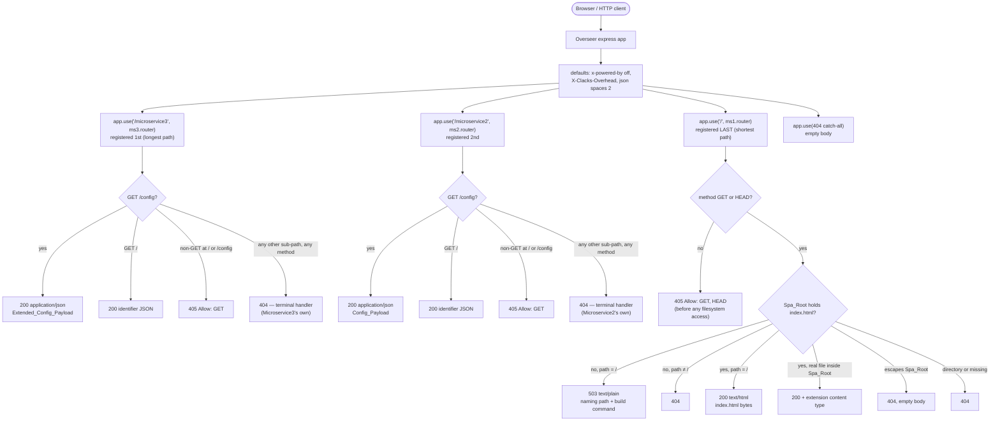
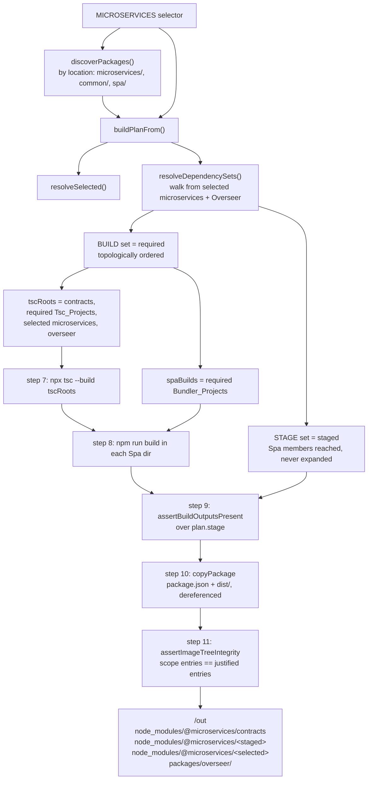

# Design Document

## Overview

This feature adds two demonstration samples, adopts one architectural principle, and corrects one
test-scope defect. None of the four adds framework capability — the principle relocates a
responsibility from the Overseer to each microservice's router rather than introducing a new one, and
it needs no Overseer code change (F11).

- **Example A** — a second Common_Package, `@microservices/extended-config` at
  `packages/common/extended-config`, depends on `@microservices/config` and widens the settings
  block by one property. Microservice3 switches to it; Microservice2 keeps the base package.
  This exercises the `common → common` dependency edge, the transitive Required_Dependencies
  walk, and selector-driven staging minimality.
- **Example B** — the first Spa_Package, `@microservices/demo` at `packages/spa/demo`, built by
  its own bundler. Microservice1 serves its bundled output as static content at its Mount_Root
  `/`. This exercises the Bundler_Project Build_Kind, the staging-only `microservice → spa`
  dependency edge, and the toggle/selector story a Specific_Container produces. The Demo_Page
  reports each request in **three** display fields — a Request_Field, a Status_Field, and a
  Body_Field — rather than in one combined result field, so that the three facts HTTP itself
  distinguishes each get a field and no two acceptance criteria compete for one string. That
  split is what dissolves the former deviation D5 and most of D8.
- **Subtree_Ownership** (Requirements 3.10–3.12, 7.7, 7.11, 7.12, 7.14, 8.2, 8.3, 12.12, 12.13) —
  the principle that a Microservice_Package owns the subtree rooted at its Mount_Root, its
  Owned_Subtree, and answers **every** request in that subtree from its own router, leaving none
  unhandled for the Overseer's catch-all. The Overseer's responsibilities are exactly two: mount
  the enabled Selected_Microservices at their exported Microservice_Paths, and respond 404 where
  no mounted microservice matches. The obligation fixes *whether* a microservice answers; the
  status, headers, and body it answers with stay that microservice's own choice — which is why
  Microservice1's `405 Allow: GET, HEAD` and Microservice2's `405 Allow: GET` are both valid.
  Adopting it changes every request-handling decision in this design that previously called
  `next()`, and it is recorded in steering so it governs microservices a template user adds.
- **The test boundary correction** (Requirement 13) — the Integration_Suite's per-microservice
  assertions are reduced to what the framework declares (a router is mounted at its declared
  path and is reachable there); every response-body, content-type, and method-handling assertion
  moves into the owning microservice's own suite.

The design's central claim, verified against the code below, is that the Build_System needs no
source change for either sample, and — per F11 — the Overseer needs none either, Subtree_Ownership
included. Two exceptions were found and are recorded as findings rather than silently designed
around (F7, F11).

---

## Verified findings

Every finding below was read out of the code, not inferred. File and function references are
given so each can be re-checked.

### F1 — A second `packages/common/*` package needs no Build_System change

`discoverPackages()` (`packages/build-tools/src/discovery.ts`) enumerates each
Namespace_Container's direct subdirectories via `candidatesOf()` and assigns the category from
`NAMESPACE_CONTAINER` (`framework.ts`) — location alone. `buildKindOf()` returns
`"tsc-project"` for `common`. The `common` contract is checked by `contractViolation()`, which
requires non-empty `main` and `types`. Nothing enumerates Common_Packages by name.

`checkWorkspaceCoverage()` (`repo-invariants.ts`) resolves `packages/common/*` through
`directSubdirectories()`, so a new member is matched by exactly one entry with no manifest edit
(R4.1). `checkDependencyDirection()` reports only `common → microservice` and
`common → overseer` edges, so `extended-config → config` passes (R4.6).

**Conclusion:** R1.1–R1.10 and R4.1–R4.10 are satisfied by the Build_System as it stands.

### F2 — A `packages/spa/*` package is discovered, typed Bundler_Project, and built by its own script

`buildKindOf("spa") === "bundler-project"`. `contractViolation()` requires a non-empty
`scripts.build` for a `spa` member and requires no barrel (R6.3, R6.16).

`buildPlanFrom()` (`build-plan.ts`) splits the BUILD set on Build_Kind:
`tscRoots` takes `pkg.buildKind === "tsc-project"` only, and `spaBuilds` takes
`"bundler-project"` only. The two filters are complements, so a Spa_Package can never be a root
of `tsc --build` (R6.8, R6.10). `executeBuildPlan()` (`image-tree.ts`) invokes
`runner("npm", ["run", "build"], { cwd: spa.packageDir })` once per `spaBuilds` member
(R6.9).

`workspace-build-order.ts` — the repo-wide path behind the root `build` script — builds every
workspace package through its own `npm run build --workspace <name>`, so a Spa_Package is built
by its bundler there too, with no separate phase (`runOrderedBuild`).

### F3 — The `microservice → spa` edge resolves, and the SPA's own dependencies are not expanded when staging

`resolveSpecifiers()` (`required-dependencies.ts`) rejects four edge kinds: any declarer naming
a Microservice_Package, `common → spa`, and `spa → spa`. `microservice → spa` and
`overseer → spa` are explicitly permitted. `stagedSubset()` seeds from `rootReached` and expands
a member's edges only when `member.category !== "spa"` — so a Spa_Package is reached and staged
but never expanded, and a Common_Package reachable only through the SPA is *built* (its `dist/`
is what the bundler inlines) and *not staged*.

**Consequence for R5.1–R5.4:** the staged Common_Package sets are unaffected by whatever the
Demo_Spa itself depends on. This design nonetheless gives the Demo_Spa no `@microservices`-scoped
dependency at all (see "Demo_Spa" below), so the point is moot as well as harmless.

### F4 — `repo-invariants.ts` does not flag a specifier passed to `import.meta.resolve`

`importSpecifiers()` scans three regexes: `\bfrom\s*(['"])…`, `\bimport\s*(['"])…`, and
`\bimport\s*\(\s*(['"])…\s*\)`. In `import.meta.resolve("@microservices/demo")` the token after
`import` is `.`, so none of the three matches. The module's own doc comment records this as
deliberate: *"A specifier passed to `import.meta.resolve` is deliberately not reported, which
keeps the staging-only `microservice -> spa` dependency expressible."*

`importViolation()`'s rule 4 would otherwise fire, because Microservice1 is a `tsc-project` and
the target resolves to a `spa` package. **R7.4 therefore depends on Microservice1 using
`import.meta.resolve` and nothing else** — a static or dynamic import of `@microservices/demo`
fails `check:invariants` by design.

### F5 — Two run-time module-resolution pairs locate the Spa_Root; measured, one fresh process per variant

**Measurement correction.** An earlier probe ran every manifest variant inside a single Node
process. ESM resolution is cached per specifier per process, so the later rows echoed the first
row's answer rather than measuring their own. Re-measured with **one fresh process per variant**
(Node v24.16.0; the repo pins `engines.node >= 22`) against a scratch tree reproducing the
workspace layout — `node_modules/@microservices/demo` a *directory* symlink to
`packages/spa/demo`:

| Demo manifest | `dist/` | `import.meta.resolve("@microservices/demo")` | `…/demo/package.json` |
| --- | --- | --- | --- |
| `"exports": { ".": "./dist/index.html" }` | absent | resolves → `node_modules/@microservices/demo/dist/index.html` (symlinked path) | throws `ERR_PACKAGE_PATH_NOT_EXPORTED` |
| `"exports": { ".": "./dist/index.html" }` | present | resolves → `packages/spa/demo/dist/index.html` (realpath) | throws `ERR_PACKAGE_PATH_NOT_EXPORTED` |
| `"main": "./dist/index.html"` | absent | throws `ERR_MODULE_NOT_FOUND` | resolves → `packages/spa/demo/package.json` |
| `"main": "./dist/index.html"` | present | resolves → realpath | resolves |
| no `main`, no `exports` | absent or present | throws `ERR_MODULE_NOT_FOUND` | resolves → `packages/spa/demo/package.json` (stable) |

Four facts matter, the first of which the contaminated probe missed entirely:

1. **Declaring `exports` blocks every unlisted subpath.** Under the manifest this sample chooses,
   `import.meta.resolve("@microservices/demo/package.json")` throws
   `ERR_PACKAGE_PATH_NOT_EXPORTED`. That is what makes the two resolution pairs of
   "Choosing the Spa_Resolution_Pair" (Components §4) mutually exclusive rather than
   interchangeable halves.
2. **`exports` resolution does not stat the target; `main` resolution does.** Confirmed. Only the
   `exports` form lets resolution succeed while the bundle is unbuilt, which is what R7.3
   (resolve once, at initialisation) and R8.1 (a 503 naming the resolved Spa_Root) jointly
   require of pair A. Pair B reaches the same outcome differently: `package.json` exists whether
   or not `dist/` does, so a manifest declaring neither `main` nor `exports` resolves stably.
3. **The realpath / symlinked-path difference is real and benign.** With the target present Node
   returns the realpath; with it absent Node returns the symlinked path. Both strings read the
   same files, because `node_modules/@microservices/demo` is a *directory* symlink — a read
   through it reaches `packages/spa/demo/…` unchanged. So an Overseer started before the bundle
   exists holds the symlinked form for its whole lifetime (the Spa_Root is resolved once, R7.3)
   and serves the bundle correctly the moment it appears; no restart and no re-resolution are
   needed. The 503 message names whichever form resolution produced, which is exactly "the
   resolved Spa_Root path" R8.1 asks for. The one consequence for code is that a containment
   check must compare realpath against realpath rather than raw string against raw string (see
   Components §4, steps 5 and 6).
4. **Both pairs work in the image layout too.** Verified separately with a real directory at
   `node_modules/@microservices/demo` (no symlink) and the consumer at
   `node_modules/@microservices/microservice1/dist/index.js`: resolution walks up to
   `/app/node_modules` and lands on the staged package.

`import.meta.resolve(specifier)` typechecks under this repo's `tsconfig.base.json`
(`module`/`moduleResolution` `NodeNext`, `@types/node` 22) and returns `string`; verified with
the repo's own `tsc --noEmit` against a scratch project. TypeScript does not resolve the
specifier, so neither pair creates a type-level dependency on the SPA.

### F6 — The image-tree assembler's `dist/` check satisfies R8.7 in full

`assertBuildOutputsPresent()` (`image-tree.ts`) runs before the first copy and fails when any
`plan.stage` member's `dist/` is absent or empty (`[image-tree:no-dist]`); its emptiness predicate
is `isNonEmptyDir`, "a directory holding an entry", so it inspects no filename. The Demo_Spa is a
`plan.stage` member whenever a selected microservice reaches it, and `stageImageTree()` copies
nothing when the assertion fires (the only removal is the `rmSync(outDir)` that follows it). The
same "copies nothing" fact satisfies R6.15's *stage no Image_Tree* half, whose trigger — a `build`
script exiting non-zero — is raised one step earlier by `run()` (Error Handling, the
`[image-tree]` row).

**That check is now the whole of R8.7, and there is no gap.** The criterion has been rewritten:
the existence of a non-empty `dist/` is the Image_Tree_Assembler's entire staging precondition for
a Spa_Package, requiring no particular emitted filename and in particular no `index.html`. So
`assertBuildOutputsPresent()` satisfies R8.7 exactly as it stands, with no Build_System change and
nothing accepted as a residual risk (D3). What the assembler must **not** grow is a filename check:
a Spa_Package's category contract is a non-empty `scripts.build` alone, so the framework has no
basis for asserting one bundler's output shape (F2). Microservice1's own `index.html` checks
(R7.3, R7.5, R8.1, R8.3) are deliberately asymmetric with this and stay — they are one
microservice's knowledge of the one HTML-entry Spa_Package it serves, not a framework rule.

### F7 — The two-phase build order, `tsc` first, is normative in the `package-categories` spec, and `tech.md` is the stale artefact

`executeBuildPlan()` runs step 7 (`npx tsc --build …plan.tscRoots`) first, then step 8 (one
`npm run build` per `plan.spaBuilds`), then staging.
`packages/build-tools/tests/spa-build-sequencing.property.test.ts` pins that order over 200
generated plans and records the reason:

> a Spa_Package is a sink in the import graph, so its bundler build can only run AFTER the
> Tsc_Build_Pass has produced the `dist/` of every Common_Package it inlines

That order is not an implementation accident. It is normative in the `package-categories` spec,
which introduced the `spa` category, in three places:

1. **`package-categories/requirements.md`, Glossary** — the order is carried by the defined terms
   themselves. `Tsc_Build_Pass` is "the single `tsc --build` invocation over the ordered
   Tsc_Project roots a Selector justifies. The first of the two build phases."
   `Bundler_Build_Phase` is the per-Spa_Package `npm run build` invocations, "the second of the
   two build phases, entered only after the Tsc_Build_Pass has exited with status zero." Its
   R6.5 restates the same constraint as an acceptance criterion, and R6.12 requires a
   Common_Package a Spa_Package depends on to be a root of the Tsc_Build_Pass "so that the
   Common_Package's compiled output exists before the Bundler_Build_Phase begins".
2. **`package-categories/design.md`, "Ordering guarantee"** — "The two build phases are in that
   order and not the reverse: a Spa_Package's bundler may need a Tsc_Project's `dist/`, while no
   Tsc_Project ever needs a Spa_Package's output." Its Build_Kind section gives the structural
   argument: no Tsc_Project imports a Spa_Package and a Spa_Package has no barrel to import, so
   "the dependency direction between the two Build_Kinds is therefore one-way, and one-way
   direction needs two phases rather than an interleaved topological schedule across both."
3. **`package-categories/tasks.md` item 13.3**, titled "Invert the two build phases in
   `packages/build-tools/src/image-tree.ts`" — the code originally ran the Spa builds first and
   was deliberately changed. The task moved the `tsc --build` call ahead of the `spaBuilds` loop
   and explicitly replaced a doc comment that "states the old order and calls it 'not
   negotiable'", recording the reason in the task itself.

The one-way argument is not hypothetical. `package-categories/design.md` records, among its
accepted imprecisions, that a Spa_Package's bundler is expected to inline its workspace
dependencies and that "Keeping the bundler configured to inline its workspace dependencies is
the Spa_Package author's responsibility". A Spa_Package consuming a Common_Package is an
anticipated case, so building the Spa_Packages first would hand the bundler an import whose
target had not been compiled yet.

**Conclusion: no Build_System change is warranted, and none is proposed.** The code implements
the normative order. `.kiro/steering/tech.md` is the stale artefact — it still carries the
pre-inversion claim ("Required Spa builds run first… the single `tsc --build` pass runs only
after every one of them exits zero"), which is where this spec's earlier, defective R6.11 wording
came from. The requirements have since been corrected: R6.11 now states the bundler build
completes before *staging* and is the second phase entered only after the `tsc --build` pass
exits zero, R6.15 no longer mentions the `tsc --build` pass at all, and the new R12.11 requires
the stale `tech.md` paragraph to be corrected in this change (Components §6).

### F8 — The repo-wide build order is the lexicographically least topological order over declared dependencies, not the `workspaces` array

`workspaceBuildOrder()` (`workspace-build-order.ts`) builds the graph from each package's
`@microservices`-scoped `dependencies` and then calls
`leastTopologicalOrder(nodes, keyOf, dependenciesOf, compareCodePoints on packageDir)`. That is
**not** a topological sort with a tiebreak applied afterwards: it is Kahn's algorithm with a
**minimum-first ready queue** keyed on `packageDir` (`topological-order.ts` sorts the ready array
at every step and shifts its least element), so the result is the unique lexicographically least
topological order. The distinction is load-bearing and is what an earlier revision of this design
got wrong:

- **Being dependency-free makes a package eligible early, not placed early.** A package with no
  scoped dependency sits in the ready queue from the first step, but it is emitted only once no
  smaller `packageDir` is ready. `packages/spa/demo` declares no scoped dependency, yet
  `"packages/spa/…"` sorts after `"packages/microservices/…"` and after `"packages/overseer"` in
  code-point order, so the queue holds it back until those are emitted.
- **A new edge can move a package a long way.** `microservice1` now declares
  `@microservices/demo`, so it cannot precede `demo`; it moves from position 4 on the committed
  tree to position 9.

`checkWorkspaceCoverage()` deliberately ignores entry order (its comment: *"entry order, which
carries no meaning"*). The root `build`, `pretest`, and `ci` scripts all route through
`scripts/build.js` → `build-workspaces` bin → that derivation.

R4.2, R4.3, and R6.17 describe the order as derived "from the root `workspaces` array by
expanding each glob entry". The *outcomes* they require all hold against the measured order — see
the Data Models table, which records the positions — but by a different mechanism.
`.kiro/steering/tech.md`'s claim that "the `workspaces` array order IS the build order" and that
`check:invariants` enforces it is also stale.

R4.4 is the one criterion that names `npm run build --workspaces` explicitly, which is npm's own
traversal of the declared array rather than this derivation; its outcome holds on that path too,
as the next paragraph records.

One path *does* use the array order: `scripts/start.js` runs `npm run build --workspaces`, whose
order is the declared array with globs expanded. There, `packages/common/*` expands
lexicographically (`config`, `extended-config`) and `packages/spa/*` precedes
`packages/microservices/*`, so both orderings hold there too — the first by alphabetical luck,
the second by declaration.

That difference between the two paths is not cosmetic. The derived order emits `packages/overseer`
before `packages/microservices/microservice1` once `microservice1` declares `@microservices/demo`,
while npm's array traversal emits every microservice first. The Overseer's generated registry
imports the selected microservices, and nothing in the graph encodes that ordering — see D11, which
measures the consequence, gives the root cause, and records that the fix is deferred to a separate
spec and out of scope here.

### F9 — `npm run dev` never invokes a Spa build, and never touches the Spa_Root

`devProjectList()` returns `buildPlanFrom(...).tscRoots` verbatim (`dev-supervisor.ts`), which
by F2 excludes every Spa_Package. The supervisor's only build action is
`ts.createSolutionBuilderWithWatch` over that list. **R11.6 is satisfied with no change.**

The corollary is load-bearing for the test plan: in a tree where the developer has not run the
Demo_Spa's build, `npm run dev` leaves the Spa_Root absent, so Microservice1's Mount_Root answers
503 rather than 200. See F10.

### F10 — Eight Integration_Suite tests, two build-tools real-tree oracles, and five further suites assert facts this feature changes

Assertions on Microservice1's identifier body at `/`:

| Suite | What it asserts today | Why it breaks |
| --- | --- | --- |
| `endpoint-contract.test.ts` | `{microservice-name, path}` body and `405 Allow: GET`, looped over all three microservices | Microservice1 serves neither |
| `start-parity.test.ts:184` | `GET /` → body equality | body is now HTML |
| `specific-container-404.test.ts:50` | `GET /` → 200 + body | body is now HTML |
| `dev-cold-start.test.ts:205` | `GET /` → 200 + body, in a **pristine** tree | pristine + `npm run dev` ⇒ Spa_Root absent ⇒ **503** (F9) |
| `dev-warm-tree.test.ts:157` | `GET /` → 200 + body | body is now HTML |
| `dev-environment-passthrough.test.ts:123` | `GET /` → 200 + body | body is now HTML |
| `dev-start-parity.test.ts:339` | `GET /` → 200 + body | body is now HTML |
| `dev-session-scope.test.ts:239` | mutates `.json({ "microservice-name": "microservice1", path });` | anchor is deleted |
| `dev-error-recovery.test.ts:115` | same anchor, plus body probes | anchor is deleted |

Real-tree oracles that enumerate the committed package set:

- `packages/build-tools/tests/discovery-real-tree.test.ts` — pins exactly four discovered rows
  and separately asserts "discovers zero Spa_Packages".
- `packages/build-tools/tests/workspace-build-order-real-tree.test.ts` — pins exactly eight
  ordered entries.

Further Integration_Suite assertions:

- `package-categories-layout.test.ts` — four assertions that `packages/spa/` holds only
  `.gitkeep`.
- `effective-dockerfile.test.ts:445,461` — that `packages/spa/` holds no workspace and that the
  emitted Dockerfile contains no `packages/spa` COPY line.
- `migration-facts.test.ts:136` and `common-package-conventions.test.ts:141` —
  `it.each(["microservice2","microservice3"])` asserting each declares `@microservices/config`;
  R3.2 removes that from Microservice3.
- `baseline-equivalence.test.ts:77–87` — staged sets for selectors including `microservice3`.
- `shared-package-staging.test.ts` — the natural home for R11.9's new staging cases.

Two of these (`discovery-real-tree`, `workspace-build-order-real-tree`) live under
`packages/build-tools/`, which the requirements place out of scope. See "Risks and deviations"
D2.

### F11 — Nothing else needs changing

- `scripts/emit-effective-dockerfile.sh` already globs `packages/common/*/package.json` and
  `packages/spa/*/package.json` and emits a COPY line per match at both anchors; adding either
  package needs no script or `Dockerfile.template` edit (R6, R12.4 documentation aside).
- The build stage runs `npm ci --workspaces --include-workspace-root` **without** `--omit=dev`,
  so the Demo_Spa's bundler devDependency is present when `build-image-tree` invokes
  `npm run build`. The `prod-deps` stage uses `--omit=dev`, so the bundler never reaches the
  runtime image.
- `packages/overseer/src/router.ts` needs no change, exactly as the requirements' verified
  finding states: mounts are sorted by path length descending, so `/` is registered last, and an
  app-level empty-body 404 catch-all is registered after every mount. Subtree_Ownership needs no
  change there either — it is an obligation on each microservice's router, and the Overseer's two
  responsibilities (mount the enabled Selected_Microservices, 404 where no mount matches) are
  already exactly what `router.ts` does. The observable effect of the principle on the Overseer is
  that its catch-all becomes unreachable in any Container holding a microservice mounted at `/`,
  which is an outcome of the principle rather than a code change.

---

## Architecture

### Request routing topology



Every branch of every mounted router terminates in a response. That is Subtree_Ownership: each
microservice answers every request in its own Owned_Subtree, and the arrow from a router back to
the catch-all that earlier revisions of this diagram carried does not exist.

Two properties fall out of the mount order and are the whole reason no Overseer change is needed.
While a peer is enabled, its mount is reached first and Microservice1's `/` mount never sees a
request in that subtree (R7.13). While a peer is disabled or unselected, it is not mounted at all,
so the request reaches Microservice1's `/` mount — and in that Container the path *is* one
Microservice1 owns, so Microservice1 answers it by its own rules: 405 with `Allow: GET, HEAD` for a
method other than GET or HEAD, 200 for a GET or HEAD naming a file inside the Spa_Root, 404
otherwise (R7.14). The absence of an SPA-history `index.html` fallback and of any directory listing
is what keeps that last answer a 404 rather than a 200 carrying the Demo_Page.

**Consequence: with Microservice1 mounted at `/`, the Overseer's catch-all is unreachable.**
Microservice1 owns the whole origin, so no request can reach a handler registered after its mount.
That is the intended outcome of the principle, not a defect — and it is what R13.3 has the
Integration_Suite assert, with the intent stated in the assertion's description. The catch-all's
remaining job is a Container that holds no root-mounted microservice, where the path of an
unselected or toggled-off microservice belongs to nobody and the catch-all is the only thing that
can answer it (R13.2).

### Build and staging flow for one Selector



Steps 7 and 8 are in that order, and not the reverse, on normative grounds: the
`package-categories` spec defines the `tsc --build` pass as the first of the two build phases and
the per-Spa_Package `npm run build` invocations as the second, entered only after that pass exits
zero, because a Spa_Package's bundler may read a Tsc_Project's compiled output while no
Tsc_Project ever reads a Spa_Package's output (F7). This is what R6.11 requires, and it is why
the Demo_Spa is never a root of step 7.

The BUILD/STAGE asymmetry is what makes R5.1–R5.4 and R6.12–R6.13 hold by construction:
membership in `tscRoots` comes from the BUILD set, membership in `stage` from the STAGE set, and
`stagedSubset()` refuses to expand a Spa_Package's edges.

Worked staged sets (Common_Packages only; `contracts` is always staged on Framework_Singleton
grounds and never counted):

| Selector | Reached from | Staged Common set | Staged Spa set |
| --- | --- | --- | --- |
| `microservice1` | ms1 → demo | `{}` | `{demo}` |
| `microservice2` | ms2 → config | `{config}` | `{}` |
| `microservice3` | ms3 → extended-config → config | `{config, extended-config}` | `{}` |
| `microservice2,microservice3` | as above | `{config, extended-config}` | `{}` |
| `microservice1,microservice2` | union | `{config}` | `{demo}` |
| `*` | union | `{config, extended-config}` | `{demo}` |

---

## Components and Interfaces

### 1. `packages/common/extended-config/` — the Extended_Config_Package

Mirrors `packages/common/config/` in structure, scripts, and testing style.

`package.json`:

```json
{
  "name": "@microservices/extended-config",
  "version": "0.0.0",
  "private": true,
  "type": "module",
  "main": "./dist/index.js",
  "types": "./dist/index.d.ts",
  "scripts": {
    "build": "tsc",
    "test": "vitest --run",
    "test:types": "vitest --run --typecheck --typecheck.tsconfig=tsconfig.test.json",
    "lint": "eslint .",
    "typecheck": "tsc --noEmit"
  },
  "dependencies": {
    "@microservices/config": "*"
  }
}
```

`@microservices/contracts` is deliberately **not** declared: every type this package needs comes
from `@microservices/config`'s barrel, which already anchors `ConfigPayload["path"]` to
`MicroserviceModule["path"]`. R4.7 permits Framework_Singleton names but requires none, and
declaring an unused one would be noise.

`tsconfig.json` is byte-equivalent in shape to `packages/common/config/tsconfig.json`
(`extends: "../../../tsconfig.base.json"`, `outDir: ./dist`, `rootDir: ./src`,
`include: ["src/**/*"]`). `tsconfig.test.json` mirrors config's, so `vitest --typecheck` gets a
program that actually contains `tests/` (R11.15).

`src/index.ts` — the sole barrel (R1.4):

```ts
import {
  buildConfigPayload,
  sampleConfig,
  type ConfigPayload,
  type SampleConfig,
} from "@microservices/config";

/** The Sample_Config_Block widened by exactly one property (R2.2, R2.4). */
export interface ExtendedConfig extends SampleConfig {
  readonly extendedSetting: string;
}

/** The Config_Payload with its `config` member widened (R2.7). */
export interface ExtendedConfigPayload extends Omit<ConfigPayload, "config"> {
  readonly config: ExtendedConfig;
}

/**
 * The base values are SPREAD from the imported `sampleConfig`, never restated
 * as literals (R2.1). The spread copies exactly the base's own enumerable keys,
 * so the own-key count is the base's plus one (R2.3), and it mutates nothing
 * (R2.9).
 */
export const extendedConfig: ExtendedConfig = {
  ...sampleConfig,
  extendedSetting: "extended-example-value",
};

/**
 * Delegates identity to `buildConfigPayload` and overrides only `config`, which
 * is what makes the metamorphic relation of R2.6 true by construction rather
 * than by coincidence: `microservice-name` and `path` ARE the base payload's,
 * and `config` differs from the base's by exactly `extendedSetting`.
 */
export function buildExtendedConfigPayload(
  name: string,
  path: string,
): ExtendedConfigPayload {
  return { ...buildConfigPayload(name, path), config: extendedConfig };
}
```

Design decisions and why:

- **Re-exports vs. definitions.** The barrel *defines* `ExtendedConfig`,
  `ExtendedConfigPayload`, `extendedConfig`, and `buildExtendedConfigPayload`. It **re-exports
  nothing** from `@microservices/config`. A consumer that wants the base package's surface
  declares the base package; Microservice3 declares only the extended one (R3.2) and needs only
  the extended surface. Re-exporting would make the extended barrel a second, competing entry
  point to the base API.
- **R2.1 satisfied structurally.** The only occurrence of a base value in this package's sources
  is the identifier `sampleConfig`. There is no string literal `"example-value"` anywhere in
  `packages/common/extended-config/src/`, which is a grep-checkable assertion the test suite
  makes.
- **R2.5, R2.8 satisfied by delegation.** `buildConfigPayload` echoes `name` and `path`
  verbatim with no trimming or defaulting (verified in `packages/common/config/src/index.ts`);
  delegation inherits that, including for empty strings.
- **R2.4's negative half** — an object lacking `extendedSetting` must be rejected — is a
  compile-time fact, asserted in `tests/barrel-surface.test-d.ts` with `@ts-expect-error` and
  executed by `npm run test:types`.

### 2. Microservice3 and Microservice2

**Microservice3** (`packages/microservices/microservice3/`):

- `package.json`: `@microservices/config` is **replaced** by `@microservices/extended-config`.
  The scoped runtime dependency set becomes exactly
  `{@microservices/contracts, @microservices/extended-config}` (R3.1, R3.2). `express` and
  `@types/express` are unchanged.
- `src/index.ts`: `buildConfigPayload` → `buildExtendedConfigPayload`, imported by package name
  only. The Mount_Root identifier response is unchanged (R3.6).
- **New handler:** `router.all("/config", …)` returning `405` with `Allow: GET` and an empty
  body, registered *after* `router.get("/config", …)` (R3.8). This is a genuine behaviour
  addition — today a non-GET at `/microservice3/config` reaches the Overseer's 404, because the
  existing `router.all("/")` is mount-root only.
- **New terminal handler:** `router.use((_req, res) => res.status(404).end())`, registered last.
  This is the second genuine behaviour addition, and it is what satisfies Subtree_Ownership for
  Microservice3 (R3.10, R3.12): every path in `/microservice3`'s Owned_Subtree that the router does
  not otherwise serve is answered 404 by Microservice3 itself, for **any** method, instead of
  reaching the Overseer's catch-all. R3.10 is method-agnostic, and so is this handler.

**Microservice2** (`packages/microservices/microservice2/`):

- No manifest change. Its scoped dependency set is already exactly
  `{@microservices/config, @microservices/contracts}` (R3.5).
- **New handler:** the same `router.all("/config", …)` 405 (R3.9).
- **New terminal handler:** the same `router.use(… 404 …)` registered last, satisfying
  Subtree_Ownership for Microservice2 (R3.11, R3.12).

**HEAD interpretation.** R3.7–R3.9 say "a method other than GET". This repo already settled that
question: `packages/contracts/testing/arbitraries.ts` documents that HEAD is excluded from the
405 contract because Express routes HEAD through the registered GET handler, and
`arbHttpMethodNonGet` omits it. Both new `all("/config")` handlers are registered after the GET,
so HEAD reaches the GET handler and returns a bodiless 200. The 405 properties are quantified
over `arbHttpMethodNonGet`, matching every existing suite.

Registration order in both routers, which is the whole correctness argument (Express walks
handlers in registration order):

```
1. GET  "/"        → identifier response
2. GET  "/config"  → payload response
3. ALL  "/config"  → 405 Allow: GET      (after 2, so GET/HEAD never reach it)
4. ALL  "/"        → 405 Allow: GET      (mount-root only; does not shadow /config)
5. USE  (terminal) → 404                 ← new; every other path, any method
```

Step 5 **must** be last, and the reason is the same registration-order fact that makes steps 3 and
4 work: a path-less `router.use` matches every path in the subtree and every method, so registering
it anywhere earlier would shadow the four handlers above it and the router would answer 404 at
`/config` too. Registered last, it is reached only when no earlier handler matched, which is exactly
the set of requests Subtree_Ownership obliges the microservice to answer and which it previously let
fall to the Overseer.

Step 5 is deliberately method-agnostic. R3.10 and R3.11 say "a request of any method", so an
unserved path answers 404 whether the method is GET, POST, or anything else — the microservice's
method policy (`Allow: GET`) attaches to the two paths it *does* serve, not to paths it does not.
That is a choice, not an obligation: a microservice could equally answer 405 at an unserved path.
Both satisfy the obligation, which is only that it answers.

### 3. `packages/spa/demo/` — the Demo_Spa

#### Bundler choice

**Vite, pinned to the exact version `8.3.0`.** Checked against the npm registry rather than
recalled: `dist-tags.latest` is `8.3.0`, the previous major is `7.3.6`, and both declare
`engines.node: "^20.19.0 || >=22.12.0"`.

Why Vite rather than a lower-level bundler:

- R6.6 requires that a successful build write `index.html` *and* a file at every relative path
  that document references, and R6.7 requires those references to be relative. Vite's
  `index.html`-as-entry model plus `base: "./"` produces exactly that; esbuild does not process
  HTML at all and would leave the asset-reference rewriting to hand-written glue.
- `.kiro/steering/tech.md` names Vite as the category's example bundler, so choosing it keeps
  the sample and the steering aligned.
- No framework plugin is needed — Vite compiles `.ts` natively, and the Demo_Page is vanilla
  DOM.

**The Node floor is raised to match the pin, and this is settled rather than recommended.**
`vite@8.3.0` declares `engines.node: "^20.19.0 || >=22.12.0"`, while the root manifest declares
`engines.node: ">=22"` — a range admitting 22.0 through 22.11, which the bundler does not accept.
R11.16 requires the two to agree, and names the concrete value: the root `package.json` declares
`engines.node: ">=22.12.0"` in this same change. It is a one-line root-manifest edit that touches
no entry of the `workspaces` array, so it is inside the requirements' scope fence, and it belongs
in the same change as the `vite` devDependency that motivates it (Components §6).

What the edit does and does not fix, recorded so its value is not overstated: CI
(`.github/workflows/ci.yml` sets `node-version: "22"`) and the image (`NODE_VERSION=22` →
`node:22-alpine`) both resolve to the latest 22.x, so both already satisfy the bundler. Nothing is
failing today. What a developer on 22.0–22.11 sees is npm's `EBADENGINE` **warning** — not a
failure, since no `.npmrc` sets `engine-strict` — with no explanation of which package wants what.
Raising the floor removes an unexplained warning and makes the repository's declared support
window honest. The alternative of pinning `vite@6.3.6`, whose engines range covers all of 22.x, was
declined: it would hold the sample at a two-major-old bundler to preserve support for Node versions
neither CI nor the image uses.

#### Manifest

```json
{
  "name": "@microservices/demo",
  "version": "0.0.0",
  "private": true,
  "type": "module",
  "exports": { ".": "./dist/index.html" },
  "scripts": {
    "build": "vite build",
    "test": "vitest --run",
    "lint": "eslint .",
    "typecheck": "tsc --noEmit"
  },
  "devDependencies": {
    "vite": "8.3.0"
  }
}
```

- No `main`, no `types`: a Spa_Package's category contract is `scripts.build` (F2), and a barrel
  would advertise an API that `checkImportDiscipline`'s rule 4 forbids anyone from importing.
- The `exports` map is the Demo_Spa's half of the Spa_Resolution_Pair this sample chooses: it
  makes `import.meta.resolve("@microservices/demo")` succeed and point inside `dist/`, whether or
  not the bundle has been built (F5). It is one of two workable arrangements, not the only one —
  see "Choosing the Spa_Resolution_Pair" in Components §4 for the alternative and for why this
  one was picked. It also *hardens* the no-import rule: a `tsc` project that tried to import the
  package would resolve to an `.html` file and fail.
- The version specifier is a single exact version with none of `^ ~ * > < = ||` (R6.5).

#### Bundler configuration

`vite.config.ts`:

```ts
import { defineConfig } from "vite";

export default defineConfig({
  // Relative asset references: no leading "/" and no scheme, so the Demo_Page
  // keeps working if Microservice1 is later mounted somewhere other than "/"
  // (R6.7).
  base: "./",
  build: {
    outDir: "dist",
    emptyOutDir: true,
  },
});
```

`base: "./"` is the concrete mechanism for R6.7: Vite emits
`<script type="module" crossorigin src="./assets/index-<hash>.js">` and
`<link rel="stylesheet" href="./assets/index-<hash>.css">` rather than root-absolute `/assets/…`
URLs. Because the file lives in the Demo_Spa directory, `vitest --run` executed there will load
it; it declares no `test` block, so Vitest's default `node` environment stays in force (R11.3).

`tsconfig.json` for typecheck only — it is never a `tsc --build` root (F2) and emits nothing:

```json
{
  "extends": "../../../tsconfig.base.json",
  "compilerOptions": {
    "composite": false,
    "declaration": false,
    "noEmit": true,
    "module": "ESNext",
    "moduleResolution": "Bundler",
    "lib": ["ES2023", "DOM", "DOM.Iterable"],
    "types": []
  },
  "include": ["src/**/*", "tests/**/*", "vite.config.ts"]
}
```

`lib: [… "DOM" …]` is what types `document`, `window`, and `fetch` for the browser sources;
`types: []` keeps Node's globals out of a browser program.

#### The Demo_Page

`index.html` at the package root (Vite's entry):

```html
<!doctype html>
<html lang="en">
  <head>
    <meta charset="utf-8" />
    <meta name="viewport" content="width=device-width, initial-scale=1" />
    <title>Microservice Scaffold demo</title>
  </head>
  <body>
    <main>
      <h1>Microservice Scaffold demo</h1>
      <p>Call a microservice through the Overseer and read what comes back.</p>

      <p>
        <button id="call-microservice2" type="button">Microservice 2</button>
        <button id="call-microservice3" type="button">Microservice 3</button>
      </p>

      <p><label for="request">Request</label> <output id="request"></output></p>
      <p><label for="status">Status</label> <output id="status"></output></p>

      <p><label for="body">Response body</label></p>
      <textarea id="body" rows="16" cols="72" readonly></textarea>
    </main>
    <script type="module" src="./src/main.ts"></script>
  </body>
</html>
```

**No `aria-live` attribute appears anywhere in the document, and that is deliberate.** An
`output` element maps to the ARIA `status` role, and `status` is an implicit **polite live
region** — so the Request_Field and the Status_Field announce their own updates with no explicit
attribute declared, which is what R9.3 asks for. The second half of that criterion is the reason
the two short fields are `output` elements rather than a second and third `textarea`: an
`output`'s content is a **text node**, which is the thing assistive technology can announce,
and a `textarea`'s `value` is precisely not one.

How each criterion of Requirement 9's markup group is met:

- **R9.1** — exactly two `button` elements, in document order `Microservice 2` then
  `Microservice 3`. Each button's accessible name is computed from its text content, so
  accessible name and visible label are the same string by construction; no `aria-label`
  overrides it.
- **R9.2** — exactly three display fields, in the order request → status → body, all three
  positioned after both buttons in document order.
- **R9.3** — the Request_Field and the Status_Field are native `output` elements. `output` is a
  labelable element, so `<label for="request">` and `<label for="status">` are both
  programmatically associated and visibly rendered; each field carries the implicit `status`
  role, hence an implicit polite live region, with no `aria-live` declared; and each field's
  content is set as a text node.
- **R9.4** — the Body_Field is the one `textarea`. `readonly` (not `disabled`) keeps it
  focusable and in the tab order, whereas `disabled` would remove it, and it makes a body larger
  than the control scrollable and selectable; `<label for="body">` is both programmatically
  associated and visibly rendered.
- **R9.5** — the Status_Field alone announces the outcome. No `aria-live` is declared on the
  Body_Field, and none on any ancestor of it — the document declares none at all, so the
  containment condition holds trivially. The Body_Field is therefore not announced, by design.
- **R9.6** — both `output` elements are in the initially loaded document and are never replaced
  or removed: the script assigns `textContent` on the same two element references it read once at
  startup, so the live-region semantics of R9.3 apply to every update.
- **R9.7** — native `button type="button"` elements are sequentially focusable in document
  order, carry no `tabindex`, and are activated by Enter, Space, and pointer alike. The script
  binds `click` only, which is the event the browser synthesises for all three activations.
- **R9.8** — both buttons ship enabled, both `output` elements ship with no text, and the
  `textarea` ships with empty content.

**Recorded resolution — the announcement problem is gone for the two fields that matter.** An
earlier revision of this design carried a limitation here: it had one `textarea` Result_Field
inside an explicit `aria-live="polite"` wrapper, and a live region announces text-node mutations
while a `textarea`'s `value` is not one — so the region's letter was satisfied and its purpose was
not. The three-field split removes the problem at its source rather than working around it. The
outcome a screen-reader user needs is the status, and the status now lives in an `output` whose
text node a polite region can announce. The Body_Field stays unannounced, and R9.5 now states
that as the intended outcome: reading a multi-kilobyte JSON body aloud on every request would be
hostile rather than helpful. The visually-hidden-mirror remedy the earlier revision recommended is
therefore no longer needed and is **not** proposed. See D8.

#### `src/result-formatter.ts` — the Result_Formatter

One module exporting **exactly three functions**, one per display field (R10.1). It is pure — no
DOM access, no `fetch`, no browser global — so it is importable under Node and drivable by
fast-check (R10.18). That purity is why it is a separate module from `main.ts`.

```ts
/**
 * The Request_Field's text. Branchless: the Request_Line the Demo_Page composed,
 * returned character for character (R10.3).
 */
export function formatRequestLine(requestLine: string): string;

/**
 * The Status_Field's text. Two branches: a status code that arrived, or the
 * absence of one together with whatever reason was reported (R10.5–R10.7).
 */
export function formatStatus(
  status: number | undefined,
  reason: string | undefined,
): string;

/**
 * The Body_Field's text. Three branches, and NO status code parameter (R10.14).
 */
export function formatBody(body: string | undefined): string;
```

`formatRequestLine` — one rule, no branch:

| Guard | Returns | Satisfies |
| --- | --- | --- |
| (none) | `requestLine` unchanged | R10.3, R10.19 |

`formatStatus` — two branches, in evaluation order:

| # | Guard | Returns | Satisfies |
| --- | --- | --- | --- |
| S1 | `status !== undefined` | `` `${status}` `` — the code in decimal, for **every** code from 100 to 599, 2xx included | R10.5, R10.20 |
| S2 | `status === undefined` | `` `settled without a status code: ${detail}` ``, where `detail` is the reason character for character — whitespace included — when the reason holds 1 or more characters, and `transport failure` when the reason is absent or a string of 0 characters | R10.6, R10.7, R10.8 |

`formatBody` — three branches, in evaluation order:

| # | Guard | Returns | Satisfies |
| --- | --- | --- | --- |
| B1 | body absent, or a string of 0 characters | `the response carried no body` | R10.11 |
| B2 | body parses as JSON | `JSON.stringify(JSON.parse(body), null, 2)` | R10.12, R10.21 |
| B3 | otherwise | the body verbatim, untruncated | R10.13 |

Design decisions in this module, and why:

- **The body function receives no status code at all.** That is R10.14, and it is the substantive
  behavioural improvement the three-field split buys. The earlier single-function design gated
  three of its five branches on a 2xx status — not because the body's formatting depends on the
  status, but because one string had to serve every purpose, so the JSON-formatting rule was
  written as a rule about *successful responses*, that being the branch in which the body was the
  whole text. With a field of its own, the body function formats whatever body arrived: a
  microservice returning a JSON error body with status 500 now gets that body indented and
  readable instead of dumped as unparsed text.
- **Two properties become unconditional.** R10.19 — the Request_Field holds the requested path —
  previously needed an exception for the JSON branch, because a body serialised verbatim contains
  the *mount* path and not the *requested* path; that exception was deviation D5, and it is gone,
  because the path now lives in a field of its own. R10.20 — the Status_Field holds the received
  status in decimal — was previously restricted to a status outside 200 to 299, for the same
  single-string reason; branch S1 makes it hold for all of 100 to 599.
- **Branch S1's text is the bare decimal, deliberately.** R10.5 asks for text *containing* the
  status code in decimal, so a longer phrasing would satisfy it too. The bare number is chosen
  because the field is labelled `Status` and sits beside a Request_Field holding the whole request
  line: the context is already on the page, and repeating it in the value would make the field's
  content harder to read aloud, which is the one job R9.5 gives it.
- **Branch S2 splits on the reason's length alone, and Requirement 10 has no gap here.** R10.6's
  `IF` clause is a guard on the input, not an obligation about it: it states what the function
  returns when a reason of 1 to 2,048 characters *was* reported, and it does not require a reason to
  be non-empty. R10.7's "no reported reason text" covers a zero-length string, because an empty
  string reports no text. The two guards therefore partition R10.15's domain — 0 characters or
  absent on one side, 1 or more on the other — and nothing falls between them. A reason holding only
  whitespace lies in R10.6's range, so it is included verbatim rather than replaced: that is honest
  (no real transport failure reports whitespace), and R10.6 forbids a special case for it.
- **Totality, function by function** (R10.17):
  - `formatRequestLine` returns its own argument, which the signature types as `string`. There is
    no branch and no call, so nothing can throw. Note that for a Request_Line of 0 characters it
    returns the empty string — R10.3 requires character-for-character fidelity, so the return value
    is *a string* rather than *a non-empty string*, and R10.17 asks for exactly that. The Demo_Page
    composes a 0-character Request_Line for no request, which is the trivial exception R10.19
    records.
  - `formatStatus` has two branches, each a template literal, so each yields a string; neither
    branch calls anything that throws.
  - `formatBody`: B1 returns a non-empty constant; B3 returns a string the guard proved non-empty;
    B2 returns `JSON.stringify` of a value `JSON.parse` produced, which is never `undefined` (only
    `undefined`, functions, and symbols serialise to `undefined`, and `JSON.parse` yields none of
    them) — for the body `"null"` it returns the 4-character `"null"`. The only throwing call,
    `JSON.parse`, is wrapped in the try that selects between B2 and B3.
- **Determinism** (R10.16) follows from the same reading: no branch consults a clock, a random
  source, or any state outside its arguments, and `JSON.stringify`'s key order for a value
  `JSON.parse` produced is that value's own insertion order, which is fixed by the input text.

The 404 stories (R10.22, R10.23) need no dedicated code, and the three-field split makes them
read more plainly than before. A request to a Selector-excluded or toggle-disabled microservice's
path is answered by **Microservice1**, which owns that path in a Container holding no such
microservice (R7.14) and returns an empty-body 404 for a GET naming no file inside the Spa_Root.
The Request_Field then holds the Request_Line of the request that was sent, the Status_Field holds
`404` from branch S1, and the Body_Field holds branch B1's no-body indication. The Demo_Page
cannot tell — and does not need to tell — that the answer came from Microservice1 rather than from
the Overseer's catch-all; the status and the empty body are identical either way, which is why
Subtree_Ownership changes nothing in the SPA.

#### `src/main.ts` — DOM wiring

Responsibilities, and nothing else: read the DOM once, own the in-flight state, compose the
Request_Line, perform the request, and assign each of the three functions' return values to its
own field.

```ts
const ENDPOINTS = {
  "call-microservice2": "/microservice2/config",
  "call-microservice3": "/microservice3/config",
} as const;

const METHOD = "GET";
const REQUEST_LIMIT_MS = 10_000;

/** The Status_Field's in-flight text (R9.12). A constant here, NOT a fourth formatter export,
 *  because R10.1 fixes the Result_Formatter's surface at exactly three functions. */
const PENDING = "waiting for a response…";

/** The reason reported when the request limit is reached (R9.16, R10.8). */
const LIMIT_REASON = "no response within the 10-second request limit";
```

- **R9.9, R9.10, R9.11** — the paths are root-absolute, same-origin, and hard-coded. They are
  deliberately *not* relative, unlike the asset references (R6.7): a peer microservice is mounted
  at its own Microservice_Path by the Overseer regardless of where Microservice1 is mounted, so
  the API path is an absolute fact about the Overseer while an asset path is relative to the
  document. Nothing reads a host from configuration.
- **R10.2 — the Request_Line is composed here, not in the formatter.** `main.ts` builds it as
  `` `${METHOD} ${new URL(path, location.origin).href}` `` and passes the resulting string to
  `formatRequestLine`. That placement is the point: the whole dependence on the browser
  environment — `location.origin` — sits in `main.ts`, where a source-level assertion covers it,
  and the formatter stays a deterministic function of a string, where a property test covers it.
  The Request_Line carries the method, the scheme, the host, and the path, and **no HTTP protocol
  version**: `fetch` does not expose the negotiated version and the browser may well use HTTP/2,
  so any version string on the page would be a fabrication.
- **The response is always read with `res.text()`, never `res.json()`.** The body function, not
  `fetch`, owns the parse attempt — which is what lets branches B2 and B3 coexist, and what keeps
  every body-formatting criterion a property of one pure function rather than a property of the
  browser's JSON handling.
- **On activation** (R9.12) — three assignments, before the request is sent and before it can
  settle: `requestField.textContent = formatRequestLine(requestLine)`,
  `statusField.textContent = PENDING`, and `bodyField.value = ""`. The Request_Field's text is
  whatever R10.2 and R10.4 make it; `main.ts` restates no rule of its own for computing it.
- **On completion with a status** (R10.9) — `statusField.textContent = formatStatus(res.status,
  undefined)` and `bodyField.value = formatBody(await res.text())`.
- **On settling without a status** (R10.10) — `statusField.textContent = formatStatus(undefined,
  reason)`, and the Body_Field is left holding no text, no response body having arrived.
- **R9.16, R10.8** — an `AbortController` with
  `setTimeout(() => controller.abort(), REQUEST_LIMIT_MS)`, cleared in the `finally`. On abort the
  status function is called as `formatStatus(undefined, LIMIT_REASON)`, so the abandonment is one
  instance of branch S2 rather than a case of its own, and the Request_Field is left holding the
  abandoned request's Request_Line.
- **`textContent`, not `value`, for the two `output` elements.** `HTMLOutputElement` exposes both,
  and `value` reflects `textContent`; assigning `textContent` directly is what makes the text-node
  claim behind R9.3 concrete rather than incidental.
- **R9.13, R9.14, R9.15** — a module-level `inFlight` boolean guards the handler; both buttons are
  set `disabled` before the request and re-enabled in a `finally`, which runs on completion,
  transport failure, and abort alike, well inside the 1-second bound. An activation while a request
  is in flight returns early, before any field is touched, so all three field texts are left
  unchanged.
- **R9.18** — the Demo_Spa declares no `@microservices`-scoped dependency at all, which satisfies
  the constraint vacuously. This is deliberate: it keeps the Demo_Spa a true sink, and it means
  the SPA's build reads no Common_Package's `dist/`. The two-phase order compiles every
  Tsc_Project before the bundler runs (F7), so a Spa_Package that *did* consume a Common_Package
  would be served correctly too; this sample simply does not exercise that edge.

#### Lint configuration (R11.2)

`eslint.config.js` gains one block, scoped by `files`, placed before the trailing `prettier`
entry so Prettier still wins on formatting:

```js
// Browser sources: the Demo_Spa is the only package whose code runs in a
// browser, so `document`, `window`, and `fetch` are declared for its files
// ALONE. Every other package keeps the global set declared for it today.
{
  files: ["packages/spa/*/src/**/*.ts", "packages/spa/*/*.config.ts"],
  languageOptions: { globals: { ...globals.browser } },
},
```

Scoping by `packages/spa/*/…` rather than `packages/spa/demo/…` keeps the block valid for a
second SPA without another edit, and keeps the grant off every non-SPA package as R11.2
requires.

### 4. Microservice1 — serving the Demo_Spa

This is the highest-risk component. It is split into three modules so that the resolution happens
once, the policy is unit-testable, and the barrel still exports exactly `path` and `router`.

```
src/spa-root.ts       resolveSpaRoot(): string          — one module-resolution call
src/static-router.ts  createSpaRouter(spaRoot): Router  — all serving policy, Spa_Root injected
src/index.ts          path, router = createSpaRouter(resolveSpaRoot())
```

Injecting the Spa_Root into `createSpaRouter` is the key testability decision: Microservice1's own
suite can point a router at a temp directory it creates and deletes, which is the only practical
way to drive R8.5 and R8.6 (Spa_Root appearing and disappearing without an Overseer restart).
`src/index.ts` remains the single place resolution happens, so R7.3's "exactly once" holds in
production.

#### Resolving the Spa_Root (R7.3, R7.4)

```ts
import { dirname } from "node:path";
import { fileURLToPath } from "node:url";

/**
 * The Spa_Root: the `dist/` directory of the resolved `@microservices/demo`
 * package.
 *
 * Obtained through a run-time module-resolution call whose sole argument is the
 * bare package name (R7.4). There is no static import, no dynamic import, and no
 * relative path leaving this package — which is also what keeps
 * `check:invariants` silent: its scanner matches `from "…"`, `import "…"`, and
 * `import("…")`, none of which this is, and its rule 4 would otherwise reject a
 * Tsc_Project naming a Spa_Package.
 *
 * This is the consumer half of pair A of the two Spa_Resolution_Pairs (R7.15);
 * the demo package declares the matching manifest half. Its `exports` map points
 * "." at `./dist/index.html`, and Node does not stat an `exports` target while
 * resolving, so this succeeds whether or not the bundle has been built. The
 * Spa_Root is the directory holding that document. Pair B — resolving
 * "@microservices/demo/package.json" against a manifest declaring no `exports` —
 * is equally permitted by the framework, but the halves cannot be mixed.
 */
export function resolveSpaRoot(): string {
  return dirname(fileURLToPath(import.meta.resolve("@microservices/demo")));
}
```

The same call works in both layouts, which F5 measured:

- **Workspace** — `node_modules/@microservices/demo` is a symlink into `packages/spa/demo`.
  With `dist/` present, Node returns the realpath `…/packages/spa/demo/dist/index.html`; with
  `dist/` absent it returns the symlinked `…/node_modules/@microservices/demo/dist/index.html`.
  Either form reads the same files, because the intervening symlink is a *directory* link, so a
  process that resolved before the bundle existed keeps serving correctly once it appears (F5,
  fact 3). Neither form is a hazard; the only code consequence is realpath-to-realpath
  containment testing in step 6 below.
- **Image** — Microservice1 ships at `node_modules/@microservices/microservice1/`, and resolution
  from its `dist/index.js` walks up to `/app/node_modules`, where `@microservices/demo` is a
  real directory staged by `copyPackage` with `dereference: true`.

#### Choosing the Spa_Resolution_Pair (R7.15)

A microservice locating a Spa_Package's `dist/` at run time has two workable arrangements. Each
is a *pair*: a manifest declaration on the Spa_Package side and a specifier on the consumer side.

| | Spa_Package manifest | Consumer resolution |
| --- | --- | --- |
| **Pair A** | `"exports": { ".": "./dist/index.html" }` | resolve the bare `@microservices/<name>`, take `dirname()` |
| **Pair B** | neither `main` nor `exports` | resolve `@microservices/<name>/package.json`, take `dirname()`, join `dist` |

**The halves cannot be mixed.** F5 measured both failure directions: pair A's manifest makes pair
B's specifier throw `ERR_PACKAGE_PATH_NOT_EXPORTED`, because declaring `exports` blocks every
subpath it does not list; pair B's manifest makes pair A's specifier throw
`ERR_MODULE_NOT_FOUND`, because there is no entry point to resolve. A microservice and the
Spa_Package it serves must therefore agree on one pair.

**The framework constrains neither half.** A Spa_Package's category contract is a non-empty
`scripts.build` and nothing else — `contractViolation()` requires no barrel, no `main`, no
`types`, and no `exports` for a `spa` member (F2). And `repo-invariants.ts` does not inspect a
specifier passed to `import.meta.resolve` at all (F4), so neither specifier form is visible to
`check:invariants`. The Build_System cannot tell which pair is in use, which is why R7.15 states
the pair as a choice belonging to the microservice and Spa_Package that form it rather than as a
framework rule, and why a second microservice + Spa_Package added to this template may pick the
other pair freely.

**This sample chooses pair A**, for one reason: every cross-package reference in shipped `src/`
code in this repository uses the bare `@microservices/<name>` form. Verified — the only deep
specifiers anywhere in the repo are `@microservices/contracts/testing` (a declared test-support
subpath entry), `@microservices/build-tools/dist/…`, and `@microservices/overseer/dist/…`, all
three confined to test files and each carrying a recorded reason in a comment. No shipped module
reaches into another package's `dist/` by path. Locating the Spa_Root by bare package name keeps
the sample consistent with that convention, which matters more for a template than pair B's
marginally more stable resolved string.

**What pair A costs, stated plainly.** The Demo_Spa's `"."` export points at an HTML document, so
`import "@microservices/demo"` resolves to a file Node cannot parse as a module. That is a
deliberate secondary benefit — it hardens R7.4's no-static-import rule — but it does mean the
`exports` field exists to serve a *locator* rather than a module consumer, which is unusual.
Pair B avoids that oddity at the price of a deep specifier in shipped code. The tradeoff is
recorded here so the choice reads as a decision rather than an accident.

#### Why the handler is hand-written rather than `express.static`

`express.static`'s defaults were evaluated clause by clause against Requirement 7. Four of them
are wrong for this specification and two cannot be configured away:

| Requirement | `express.static` behaviour | Verdict |
| --- | --- | --- |
| R7.5 (`/` → `index.html`) | met by `index: "index.html"` | ok |
| R7.7 (a path naming a **directory** → 404 from Microservice1) | the same `index` option serves `<dir>/index.html`, and `redirect: true` issues a 301 for a directory without a trailing slash | needs `index: false, redirect: false`, which then breaks R7.5, and still `next()`s rather than answering |
| R7.7 (a path naming **nothing** → 404 from Microservice1) | `fallthrough: true` calls `next()`; `fallthrough: false` answers 404 but then also answers 405 for a non-GET method with an `Allow` header `send` chooses | neither setting yields Microservice1's own method policy, so a wrapper is required either way |
| R7.8 (an escaping path → **404**) | `send` answers **403 Forbidden** for a path that escapes the root, and does not fall through | **cannot be configured**; a wrapper would have to rewrite an already-sent response |
| R7.8 (a **symlink** whose target lies outside the root → 404) | symlinks are followed and the file is served | **cannot be configured**; there is no `denySymlinks` option |
| R7.6 (unmapped extension → `application/octet-stream`) | depends on `mime` lookup and the `send` version's fallback | not pinned by contract |
| R7.11, R7.12 (non-GET/HEAD → **405 `Allow: GET, HEAD`** from Microservice1) | `next()` for other methods when `fallthrough` is on; `send`'s own 405 when it is off, with an `Allow` header it composes itself | **not met** either way; Subtree_Ownership requires Microservice1 to answer, and R7.11 fixes the exact `Allow` value |
| R8.5, R8.6 (per-request Spa_Root presence, recovering with no restart) | `root` is captured at middleware construction; absence yields `next()`, never a 503 | needs a preceding handler anyway |

Three of the eight rows are unfixable through configuration, and satisfying R7.5 and R7.7 together
requires splitting the `/` case out of the middleware regardless. Subtree_Ownership sharpens the
verdict rather than changing it: `express.static` is built around `next()` as its answer for
everything it does not serve, and Subtree_Ownership forbids exactly that, so the wrapper would have
to intercept the fall-through on every path and supply Microservice1's own status — at which point
`express.static` contributes only the file read and the mime lookup, while still imposing a 403
branch the specification forbids. **Decision: hand-write the handler.** It needs no dependency
beyond `node:fs`, `node:path`, and `node:url`, which also makes the traversal defence auditable in
one place.

#### The handler

Registered as a single `router.use(handler)` with no path pattern, so it sees every method and
every path in the subtree and branches explicitly. Three reasons, the third new:

- it avoids depending on Express 5's changed path-pattern syntax (`path-to-regexp@8` no longer
  accepts a bare `*`);
- it keeps the method policy in one readable place;
- the handler is **total** over Microservice1's Owned_Subtree, and a path-less `router.use` is the
  registration form that matches that totality exactly — every path, every method, one handler.

```
handler(req, res):        // no `next` parameter — nothing can fall through
  1. if req.method is neither GET nor HEAD  → 405, Allow: GET, HEAD, empty body
                                              decided BEFORE any filesystem access
                                                                      (R7.11, R7.12, R8.2)
  2. pathname := req.path                    // query string excluded (R7.10)
  3. indexFile := join(spaRoot, "index.html")
     if indexFile is not an existing file:                            // evaluated PER REQUEST
        if pathname is "/"  → 503 text/plain, message naming spaRoot
                              and `npm run build --workspace @microservices/demo`   (R8.1)
        else                → 404                                     (R8.3)
  4. if pathname is "/"      → serve indexFile as text/html           (R7.5)
  5. decoded := decodeURIComponent(pathname)   // malformed → 404
     candidate := resolve(spaRoot, decoded with its leading "/" removed)
     if candidate is not inside spaRoot        → 404, empty body      (R7.8, lexical escape)
  6. real := realpath(candidate)               // ENOENT → 404        (R7.7, missing)
     if real is not inside realpath(spaRoot)   → 404, empty body      (R7.8, symlink escape)
  7. if real is not a regular file             → 404                  (R7.7, directory)
  8. serve real with the content type of its extension                (R7.6)
```

**Every branch responds, and the handler takes no `next` parameter at all.** That is the whole
mechanism behind R7.12: Subtree_Ownership is not a convention the handler observes but a structural
property of its signature. A later edit cannot erode it by adding a fall-through, because there is
nothing to fall through to — a two-argument handler has no way to defer. TypeScript enforces it as
well: the handler is typed `(req: Request, res: Response) => void`, so a `next()` call is a
compile error rather than a review finding. The eight-step listing above therefore has no `next()`
row, and the "left unhandled" outcome that earlier revisions of this design relied on does not exist
anywhere in Microservice1.

Serving, for both step 4 and step 8:

```
res.setHeader("Content-Type", contentTypeOf(extname(file)))
res.status(200)
if req.method is HEAD  → res.end()             // status + type, empty body (R7.9)
else                   → res.end(readFileSync(file))   // byte-identical
```

Specific decisions, and why:

- **The method check precedes every filesystem check (step 1).** This ordering is what makes R7.11
  a single criterion rather than a path-dependent split: because the method decision is taken
  before the Spa_Root is consulted, the 405 response is identical whether the path names a file,
  names a directory, names nothing, escapes the Spa_Root, or arrives while the Spa_Root is absent
  altogether. R8.2 then needs no separate branch — it is the same step 1 — and Property 13 covers
  the whole method axis with one generator instead of one per path shape. It is also the
  conventional shape for a static server: method admissibility is a property of the request, not
  of the filesystem, so checking it first avoids a stat the response cannot depend on.
- **Per-request presence check (step 3).** R7.3 requires the Spa_Root to be *determined* once and
  its presence *evaluated* per request; R8.5 and R8.6 require recovery in both directions with no
  restart and no intervening request. A single `existsSync(join(spaRoot, "index.html"))` per
  request covers both halves of R8.1's definition of absence ("the directory does not exist, or
  exists and holds no `index.html`") in one call.
- **Synchronous `node:fs`.** The handler must reach a status before anything is written, and every
  branch commits to one. Sync calls make that ordering unconditional and keep the module free of
  the async error-forwarding path — which matters more now than it did under the earlier design,
  because there is no `next(err)` escape available to a two-argument handler. The cost — blocking
  I/O per request — is acceptable in a scaffold sample and is noted in the module comment as the
  first thing a production adopter would change.
- **Explicit `Content-Type` header, no charset.** `res.type("text/html")` would emit
  `text/html; charset=utf-8`. R7.5 and R7.6 name bare media types, so the header is set directly.
  The document carries `<meta charset="utf-8">`, so browser decoding is unaffected.
- **Decode before normalise (step 5).** Express's `req.path` is not percent-decoded, so a
  `%2e%2e` segment would survive lexical normalisation undetected. Decoding first, then
  `path.resolve`, then a lexical containment test, is what makes R7.8's percent-encoded case fall
  into the same branch as the plain `..` case. A malformed escape sequence names no file, so it
  takes the R7.7 branch and Microservice1 answers 404 itself.
- **Two containment tests, on the raw path and on the realpath (steps 5 and 6).** F5 showed that
  the resolved Spa_Root may itself be a symlinked path in the workspace, so a realpath-only test
  would reject legitimate files, while a lexical-only test would miss a symlink pointing out of
  the tree. `isInside(root, p)` is `p === root || p.startsWith(root + sep)`.
- **One 404, and it is always Microservice1's.** An earlier revision of this design had to
  distinguish a 404 Microservice1 emitted (R7.8, an escaping path) from a 404 the Overseer's
  catch-all emitted after Microservice1 declined (R7.7, a path naming nothing), because the two
  criteria demanded different producers for the same wire status. Subtree_Ownership collapses that
  distinction: R7.7 now requires Microservice1 to answer 404 from its own router, so **every** 404
  inside `/`'s subtree is Microservice1's, and there is nothing left to tell apart. Two
  consequences follow, and both are simplifications. The handler needs no branch whose purpose is
  to select a *producer* rather than a response — steps 3, 5, 6, and 7 all just answer. And the
  test design needs no mechanism for observing which layer answered, which is why the sentinel
  terminal handler that earlier appeared in every Microservice1 suite is gone (Components §5).
- **HEAD on the 503 path.** R8.1 mentions "a GET or HEAD request" and a body naming two things,
  while R7.9 requires HEAD to carry an empty body. R7.9 governs: a HEAD at the Mount_Root with
  an absent Spa_Root returns `503` and `Content-Type: text/plain` with no body.

The extension → content type map (R7.6) is a frozen record, keyed on the lower-cased extension,
with `application/octet-stream` as the default. Because the lookup reads the extension and
nothing else, "the same content type for every request naming a file with the same extension"
holds by construction:

```
.html text/html            .js .mjs text/javascript   .css  text/css
.json .map application/json .svg image/svg+xml         .png  image/png
.jpg .jpeg image/jpeg      .gif image/gif             .webp image/webp
.ico image/x-icon          .woff2 font/woff2          .woff font/woff
.txt text/plain            (anything else) application/octet-stream
```

`packages/microservices/microservice1/package.json` gains `@microservices/demo: "*"` in
`dependencies` (R7.1). That declaration is what puts the Demo_Spa in the Required_Dependencies
and therefore in `spaBuilds` and `stage`; the code reaches it only through `import.meta.resolve`.

### 5. Test reorganisation (Requirement 13)

#### `endpoint-contract.test.ts` becomes a framework-scope mount-dispatch suite

Its two looped assertions (identical body, identical `405 Allow: GET`) and its two `/config`
body assertions all leave. What remains, over an explicit enumeration:

```ts
const MOUNTS = [
  { id: "microservice1", path: "/" },
  { id: "microservice2", path: "/microservice2" },
  { id: "microservice3", path: "/microservice3" },
] as const;

// enabled  → dispatched, i.e. NOT the Overseer's catch-all.
// The probe is the Mount_Root ITSELF and never a path under it (R13.1).
it.each(MOUNTS)("$id at its Mount_Root $path is dispatched to its own router", async ({ path }) => {
  expect((await request(server).get(path)).status).not.toBe(404);
});

// No microservice mounted at "/" is enabled here, so an unselected or toggled-off
// microservice's path belongs to nobody and the catch-all is what answers (R13.2).
it.each(PEERS)("$id at $path and under it receive the catch-all 404", async ({ path }) => {
  expect((await request(noRootMountServer).get(path)).status).toBe(404);
  expect((await request(noRootMountServer).get(`${path}/anything`)).status).toBe(404);
});

// A microservice mounted at "/" owns the whole origin, so the catch-all is
// unreachable — the intended consequence of Subtree_Ownership, not a defect (R13.3).
it("with a microservice mounted at / the catch-all 404 is unreachable, as Subtree_Ownership intends", async () => {
  for (const path of ["/", "/microservice2", "/microservice3/nothing", "/no/such/path"]) {
    expect((await request(rootMountServer).get(path)).status).not.toBe(404);
  }
});
```

Why this shape satisfies R13.1–R13.8:

- **The dispatch discriminator is a Mount_Root probe, never a whole-subtree one.** Under
  Subtree_Ownership a path *under* a Mount_Root may legitimately carry 404 — that is the owning
  microservice answering — so `status !== 404` distinguishes dispatch from the catch-all only at
  the Mount_Root itself, where a dispatched request cannot yield 404 (R13.1 says exactly this, and
  R8.4 uses the same reasoning to pick its startup probe point). Probing under the Mount_Root would
  read a legitimate 404 as a missing mount.
- The only quantified assertion is that Mount_Root dispatched-versus-catch-all-404 distinction,
  which R13.8 explicitly exempts from its prohibition. No body, content type, per-method status, or
  header is asserted anywhere in the Integration_Suite (R13.4, R13.5, R13.6).
- `status !== 404` is the weakest predicate that still distinguishes "the router answered" from
  "the catch-all answered", which is exactly what the framework declares. It is deliberately
  indifferent to whether Microservice1 answers 200 or 503 — a robustness property the next
  section relies on.
- The catch-all assertions of R13.2 and R13.3 are **mutually exclusive by construction**, and each
  states its precondition in the composition it builds: R13.2's needs a composition in which no
  enabled microservice is mounted at `/` (Microservice1 unselected or toggled off), and R13.3's
  needs one in which Microservice1 is enabled. The suite builds both rather than parameterising one,
  because the two assert opposite things about the same catch-all.
- Renaming the file to `mount-dispatch.test.ts` is proposed but not required; the current name
  describes a contract that no longer exists at framework scope.

#### Liveness probes (R13.12, R13.13)

One rule covers all six suites: **a Liveness_Probe_Test asserts `status !== 404` at the
Mount_Root of a microservice it names explicitly, and asserts nothing else about the response.**
The Mount_Root, and not a path under it, for the same reason R13.1's dispatch probe uses it: under
Subtree_Ownership a path under a Mount_Root can carry a legitimate 404 from the owning microservice,
so only the Mount_Root distinguishes "the Overseer is serving" from "nothing is mounted here".

That rule is not merely a tidy generalisation; `dev-cold-start.test.ts` forces it.
That suite materialises a pristine worktree, runs `npm ci`, and drives `npm run dev` — which by
F9 never invokes a Spa build. The Spa_Root is therefore absent and Microservice1's Mount_Root
answers **503**, not 200. Any probe asserting 200 at `/` would fail. `status !== 404` holds in
both the 200 and the 503 case, so every probe stays correct whether or not the bundle happens to
have been built.

| Suite | Change |
| --- | --- |
| `start-parity.test.ts` | `GET /` → assert `status !== 404`; drop the body equality. Selector (`microservice1`) and subject unchanged. |
| `specific-container-404.test.ts` | `GET /` → `status !== 404`; drop the body. Its unselected-microservice 404 assertions keep the status they assert today, and gain a recorded note: under the selector `microservice1,microservice2` that 404 at `/microservice3` and under it is **Microservice1's own**, returned under R7.14 because Microservice1 owns that path in a Container holding no Microservice3 — not the Overseer's catch-all, which Microservice1's `/` mount makes unreachable. The observed status is unchanged; only its source is (R13.13). |
| `dev-cold-start.test.ts` | `GET /` → `status !== 404`; drop the body. Its existing `/microservice2` → 200 check becomes `status !== 404`. |
| `dev-warm-tree.test.ts` | `GET /` → `status !== 404`; drop the body. |
| `dev-environment-passthrough.test.ts` | enabled probe at `/` → `status !== 404`; drop the body. The disabled-toggle `/microservice2` → 404 assertion keeps its status and stays framework-scope, with the same note as `specific-container-404`: with Microservice1 enabled at `/`, that 404 is Microservice1's under R7.14 rather than the catch-all's. |
| `dev-start-parity.test.ts` | `GET /` → `status !== 404`; drop the body. |

Each keeps the process-level or build-level subject it asserts today (R13.13), and each depends
on no response body, content type, or per-method status of Microservice1 (R13.12).

Two of the six suites therefore carry a 404 assertion whose *source* Subtree_Ownership changes while
its *status* does not. Recording the changed source in a comment, as R13.13 requires, is what keeps
the next reader from concluding that the Overseer's catch-all is still doing that work.

#### Mutation anchors (R13.14–R13.16)

`dev-error-recovery.test.ts` uses **two** anchors, and only one dies:

- `'export const path = "/";'` — the type-error injection anchor. Microservice1 still exports
  that exact line (R7.2), so this anchor **survives unchanged**, and with it the assertion that
  the diagnostic names `packages/microservices/microservice1/src/index.ts` (R13.14).
- `.json({ "microservice-name": "microservice1", path });` — the observable-behaviour anchor.
  This is deleted. It is retargeted to Microservice2's identical literal
  `.json({ "microservice-name": "microservice2", path });`, a single stable expression in
  `packages/microservices/microservice2/src/index.ts`, with the marker probe moving from `/` to
  `/microservice2`. The suite's selector widens from `microservice1` to
  `microservice1,microservice2` so the probed peer is mounted.

`dev-session-scope.test.ts`'s `touchExistingSource()` uses the same deleted literal and is
retargeted the same way; its selector already includes `microservice2`, so nothing else changes.
It already throws when the anchor is missing (R13.16); `dev-error-recovery.test.ts` gains the
same guard for its retargeted anchor, in the same shape as its two existing sanity checks.

Its marker probe moves to `/microservice2`, which is also a Mount_Root, so the probe reads a
dispatched response rather than a path Microservice1 might own — the same rule the liveness probes
follow.

One checkpoint for the implementation phase: `dev-session-scope.test.ts` synthesises a probe
microservice by copying Microservice1's package directory and rewriting its manifest. Once
Microservice1 declares `@microservices/demo`, the copy inherits that dependency. It resolves and
plans correctly (the probe becomes a second consumer of the Demo_Spa), but the copy step should
be checked, and the `demo` dependency dropped from the synthesised manifest if the suite's
assertions enumerate the probe's dependencies.

#### Per-microservice suites

| Package | File | Asserts | Requirements |
| --- | --- | --- | --- |
| microservice1 | `tests/handler.property.test.ts` (rewritten) | every method other than GET and HEAD, at `/` and at every path under it, → 405 with `Allow: GET, HEAD`, over `arbHttpMethodNonGet`; and the router is total over the Owned_Subtree | R7.11, R7.12 |
| microservice1 | `tests/spa-serving.test.ts` | `/` → 200 `text/html` byte-identical to `index.html`; a real file → 200 with the extension's content type; missing path and directory path → 404 from Microservice1, with no listing and no `index.html` body; traversal, percent-encoded traversal, absolute segment, escaping symlink → 404; HEAD parity; query-string indifference | R7.5–R7.10 |
| microservice1 | `tests/spa-root-absent.test.ts` | 503 shape and message at `/`; non-GET/HEAD still 405 `Allow: GET, HEAD`; every non-root path → 404 and never 503; absent→present and present→absent recovery on the next request with no restart | R8.1, R8.2, R8.3, R8.5, R8.6 |
| microservice1 | `tests/spa-serving.test.ts` (peer-subtree cases) | a path at and under an absent microservice's Microservice_Path — `/microservice2`, `/microservice3/config` — answered by Microservice1's own router: 405 for a non-GET/HEAD method, 200 for a GET or HEAD naming a file inside the Spa_Root, 404 otherwise, and never 200-with-`index.html` for a path naming no file | R7.14, R11.10 |
| microservice2 | `tests/handler.property.test.ts` (extended) | Mount_Root identifier response; `/config` Config_Payload with exactly three keys and no `extendedSetting`; 405 `Allow: GET` at `/` and at `/config`; 404 from its own router at every other path in its Owned_Subtree, any method; and the router is total over that subtree | R3.4, R3.6, R3.9, R3.11, R3.12, R13.9 |
| microservice3 | `tests/handler.property.test.ts` (extended) | Mount_Root identifier response; `/config` Extended_Config_Payload; 405 at `/` and `/config`; 404 from its own router at every other path in its Owned_Subtree, any method; and the router is total over that subtree | R3.3, R3.6, R3.7, R3.8, R3.10, R3.12, R13.10 |
| extended-config | `tests/extended-config-payload.property.test.ts` | the R2 properties (below) | R2.1–R2.3, R2.5–R2.9, R11.7 |
| extended-config | `tests/barrel-surface.test.ts`, `tests/barrel-surface.test-d.ts` | barrel surface; the type extension and its negative case | R2.4, R11.15 |
| demo | `tests/result-formatter.property.test.ts` | the R10 formatter-return-value properties (below) — Properties 15 through 21 and 26 | R9.16, R10.3, R10.5–R10.8, R10.11–R10.13, R10.16, R10.17, R10.19–R10.21, R11.8 |
| demo | `tests/demo-page.test.ts` | the markup facts of R9.1–R9.6 and R9.8 over the committed `index.html`, and the source-level wiring facts of R9.9–R9.15, R9.17, R10.1, R10.2, R10.4, R10.8–R10.10, R10.14, R10.18, R10.22, R10.23 | R9.1–R9.6, R9.8–R9.15, R9.17, R11.8 |

Two mechanics these suites need — and one they no longer need:

- **The sentinel terminal handler is gone.** Earlier revisions mounted each router in a test app
  followed by `app.use((_req, res) => res.status(599).end())`, so that a `599` proved a request had
  fallen through and a `404` proved the router had answered. Its only purpose was to make "left
  unhandled" observable. Under Subtree_Ownership nothing is left unhandled, so there is nothing to
  observe: **each router is total over its Owned_Subtree, so its own suite asserts the real status,
  headers, and body directly, with no Overseer composed and no sentinel behind it.** This is the
  largest simplification the principle brings to the test design — every assertion in every
  microservice suite now reads as the response a client would receive, instead of as a claim about
  which layer produced it. The sentinel does survive in one inverted form: a totality property per
  microservice (Properties 23, 24, and 25) mounts the router behind a sentinel and asserts that the
  sentinel is **never** reached, which is the direct expression of R3.12 and R7.12 and the one
  assertion that fails if a future edit reintroduces a `next()`.
- **Controlling the Spa_Root.** All three Microservice1 suites import `createSpaRouter` by relative
  path from within the package and pass a `mkdtemp` directory, writing and deleting
  `index.html` between requests to drive R8.5 and R8.6. No test touches the real bundle, so the
  suites pass whether or not `packages/spa/demo/dist/` exists.
- **Simulating an absent peer (R7.14).** No Overseer and no toggle are involved. In a Container that
  does not hold Microservice2, `/microservice2/config` is simply a path in Microservice1's
  Owned_Subtree, so the test requests that path on Microservice1's router directly and asserts
  Microservice1's own answer. That is why R11.10 places R7.14 in Microservice1's suite rather than in
  the Integration_Suite: with ownership settled, the criterion is a statement about one router.
- **R13.7 satisfied vacuously.** No shared parameterised helper asserts a per-method status or an
  `Allow` header for more than one Microservice_Package; each suite states its own subject, and
  Microservice1's `Allow: GET, HEAD` differs from its peers' `Allow: GET` so there is nothing worth
  sharing. There is therefore nothing to derive from discovery or from the generated registry.

#### Mechanical updates to existing suites

Required by the two new packages, with no behaviour change of their own (see D2 for the scope
note):

- `packages/build-tools/tests/discovery-real-tree.test.ts` — the `EXPECTED_ROWS` oracle gains two
  rows and two existing rows change:
  - new `common/extended-config` row — `tsc-project`, `dependencySpecifiers:
    ["@microservices/config"]`;
  - new `spa/demo` row — `bundler-project`, no specifiers;
  - `microservice1`'s specifiers go from `["@microservices/contracts"]` to
    `["@microservices/contracts", "@microservices/demo"]`;
  - `microservice3`'s go from `["@microservices/config", "@microservices/contracts"]` to
    `["@microservices/contracts", "@microservices/extended-config"]`.

  Both new lists are sorted, as discovery records them. The "discovers zero Spa_Packages" test
  inverts to "discovers exactly one Spa_Package, `demo`", and two test titles plus the file's
  header comment block enumerate "four rows" and need updating to six.
- `packages/build-tools/tests/workspace-build-order-real-tree.test.ts` — the `EXPECTED_ORDER`
  oracle is replaced wholesale by the ten-entry measured order of the Data Models table. Two
  entries are inserted **and** two move: `packages/microservices/microservice1` goes from position
  4 to 9 and `packages/integration-tests` from 8 to 10. The file's header comment reproduces the
  eight-entry table with a per-entry rationale, so it is rewritten alongside; the two focused
  assertions (contracts first, integration-tests last) still hold and need no change.
- `packages/integration-tests/tests/package-categories-layout.test.ts` — `packages/spa/` now
  holds one qualifying member; the `.gitkeep`-only assertions are replaced by assertions that
  `demo` is a member and that the container itself still declares no manifest.
- `packages/integration-tests/tests/effective-dockerfile.test.ts` — the "spa is empty" and "no
  `packages/spa` in the output" assertions invert to expectations of
  `COPY packages/spa/demo/package.json packages/spa/demo/` and
  `COPY packages/common/extended-config/package.json packages/common/extended-config/` at both
  anchors.
- `packages/integration-tests/tests/migration-facts.test.ts` and
  `common-package-conventions.test.ts` — the `it.each(["microservice2","microservice3"])`
  config-dependency assertion narrows to `microservice2`; the latter gains the
  Common_Package-convention checks for `extended-config`.
- `packages/integration-tests/tests/baseline-equivalence.test.ts` — the staged sets for selectors
  reaching Microservice3 gain `extended-config`.
- `packages/integration-tests/tests/shared-package-staging.test.ts` — extended with R11.9's
  cases: the six staged-set outcomes of R5.1–R5.6 and the three of R6.11–R6.13.

### 6. Documentation and steering (Requirement 12)

`README.md` edits, by existing section:

- **Running locally** — the Demo_Page is served by Microservice1 at the Overseer's base URL
  itself (Mount_Root `/`), and only while Microservice1 is selected and its toggle is enabled
  (R12.1). `npm run build --workspace @microservices/demo` produces the Spa_Root; `npm run dev`
  neither produces nor refreshes it; while it is absent the base URL answers 503 with the message
  of R8.1 (R12.3).
- **Shared packages** — Microservice2 consumes `@microservices/config`, Microservice3 consumes
  `@microservices/extended-config`, and `@microservices/extended-config` consumes
  `@microservices/config`, each named by package name (R12.2). A new subsection covers the `spa`
  category and `packages/spa/demo`.
- **Building a container image** — the Generic configuration (`*`) stages the Common_Packages
  `config` and `extended-config` and the Spa_Package `demo`; the Specific configuration
  (`microservice1,microservice2`) stages `config` and `demo` and does not stage
  `extended-config` (R12.4). Under that Specific configuration, activating the `Microservice 3`
  button shows the not-found outcome, because Microservice3 is not among its
  Selected_Microservices (R12.7).
- **Adding a microservice** — two statements, written adjacently and explicitly as an obligation
  and its complement, because read apart they look like a contradiction:
  - *The obligation (R12.12).* A microservice owns the subtree rooted at its exported
    Microservice_Path and answers every request in that subtree itself — including the status it
    chooses for a path it does not serve and for a method it does not serve — leaving none unhandled
    for the Overseer to answer. The Overseer's responsibilities are exactly two: mount the enabled
    Selected_Microservices at their exported paths, and respond 404 where no mounted microservice
    matches. The Overseer is not a fallback handler for a path a microservice owns but chose not to
    answer. A consequence worth stating: a microservice mounted at `/` owns the whole origin, so in
    a Container holding one the Overseer's catch-all is unreachable, and that is intended.
  - *The complement (R12.8).* A microservice's framework contract is its exported Microservice_Path
    plus its exported Express router. What it serves at that path — response bodies, content types,
    and per-method handling, including the status code and `Allow` header it returns for a method it
    does not serve — is that microservice's own choice, not a framework rule. Microservice2's
    identifier body and its `405 Allow: GET` are one sample's choices; Microservice1's
    `405 Allow: GET, HEAD` for the same situation is an equally valid one.
  - The sentence that joins them, which R12.12 requires the README to carry: the obligation fixes
    only **whether** the microservice answers; **what** it answers — status, headers, body — stays
    that microservice's own choice.
- **Shared packages → the `spa` category subsection** — a short "Locating a SPA's build output"
  block, placed immediately after the paragraph introducing `packages/spa/demo`, so a reader meets
  it while the sample is in view. It states both Spa_Resolution_Pairs as the table in Components §4
  gives them, that the manifest half and the resolution half of a pair must match and cannot be
  mixed (naming the two errors a mismatch produces), that the choice belongs to the microservice
  and Spa_Package that form the pair rather than to the framework, and that this sample uses
  pair A because every cross-package reference in shipped `src/` code in this repository uses the
  bare `@microservices/<name>` form (R12.9).

Steering updates required because this feature makes the statements untrue (R12.5):

- `structure.md` — `packages/spa/` no longer "ships empty"; the layout tree gains
  `common/extended-config/` and `spa/demo/`; the `common` section's "consumed by microservice2 +
  microservice3" annotation on `config` becomes "consumed by microservice2 and by
  extended-config".
- `tech.md` — the same "ships empty" claim, wherever it appears.
- `tech.md`, the build-phase-order paragraph — **required by R12.11**, not by the "made untrue"
  trigger: the document still carries the pre-inversion claim that "Required Spa builds run
  first, each in its own directory; the single `tsc --build` pass runs only after every one of
  them exits zero." That order is the reverse of both the implementation and the normative
  definition in the `package-categories` spec (F7). It must be replaced by the order that spec's
  glossary defines and `executeBuildPlan` implements: the single `tsc --build` pass over the
  ordered Tsc_Project roots is the **first** phase, and the required Spa_Package bundler builds
  are the **second**, entered only after that pass exits with status 0 — each still in its own
  directory — because a Spa_Package's bundler may read a Tsc_Project's compiled output while no
  Tsc_Project ever reads a Spa_Package's output. R12.11 requires this in the same change so that
  a template user adding a Spa_Package reads the order the Build_System implements, rather than
  inheriting the claim that produced this spec's earlier defective criterion.

Two steering **additions**, required not because a statement became untrue but because the feature
introduces conventions a template user needs in order to add a package of the same kind — which is
the second trigger R12.5 was widened to cover (R12.5, R12.10, R12.13).

The first records Subtree_Ownership, which is the reason it belongs in steering rather than in this
spec alone: it governs every microservice a template user adds, not only the three reference
samples.

- `structure.md`, the **Microservice package conventions** section — a new record alongside the
  existing MUST list (**required by R12.13**), stating: a microservice owns the subtree rooted at
  its exported Microservice_Path and answers every request in that subtree from its own router —
  including the status it chooses for a path it does not serve and for a method it does not serve —
  leaving none unhandled for the Overseer to answer; the Overseer's responsibilities are exactly two,
  to mount the enabled Selected_Microservices and to respond 404 where no mounted microservice
  matches the path; the obligation fixes *whether* a microservice answers while the status, the
  headers, and the body it answers with stay that microservice's own choice; and, as a noted
  consequence, a microservice mounted at `/` owns the whole origin, so the Overseer's catch-all is
  unreachable in a Container holding one. The existing MUST bullets — export a Microservice_Path,
  export a router, do not import a peer, do not import the Overseer — are unchanged; this is an
  addition to them, and the three reference microservices are its worked examples, differing
  deliberately in the status each chooses (`404` at an unserved path for Microservice2 and
  Microservice3; `405 Allow: GET, HEAD` versus `405 Allow: GET` for a method not served) so that a
  reader sees the choice half as well as the obligation half.

The second records how a microservice locates a Spa_Package's build output (R12.5, R12.10):

- `structure.md`, the **`spa` — `packages/spa/<name>/`** Consumer_Category section — a new bullet
  alongside the existing directory-naming, barrel, dependency-direction, ships-into-an-image, and
  Build_Kind bullets, so the convention is project-wide guidance rather than this sample's private
  arrangement: a microservice serving a Spa_Package locates the Spa_Root through a **run-time
  module-resolution call**; either Spa_Resolution_Pair is permitted; the manifest half and the
  resolution half of the chosen pair must match; and the Build_System constrains neither half,
  because a Spa_Package's category contract is `scripts.build` alone (F2) and `check:invariants`
  does not inspect a specifier passed to `import.meta.resolve` (F4). A user adding a second
  Spa_Package then finds the convention in steering instead of by reading this sample's source
  (R12.10).

#### One further manifest edit: the root Node floor (R11.16)

Not documentation, but listed here so it is not lost between the two packages that own everything
else in this design: the **root `package.json`** declares `engines.node: ">=22.12.0"` in place of
`">=22"`. It is one line, it touches no entry of the `workspaces` array, and it belongs in the same
change as the `vite@8.3.0` devDependency whose own `engines.node` range it is there to agree with
(Components §3). Nothing else in the root manifest changes.

#### Recommended but not required

Two touch-ups a reviewer may fold in, neither mandated by a criterion:

- `tech.md`'s claim that the `workspaces` array order **is** the build order and that
  `check:invariants` enforces it is false, but it was false *before* this feature, so it falls
  outside R12.5's trigger (F8 — the order is the lexicographically least topological order over
  declared dependencies, and the coverage check deliberately ignores entry order). Correcting it is
  worth doing in this change because a reader of the new sample lands on that paragraph immediately
  beside the ordering paragraph R12.11 does mandate — and because this feature is itself a
  demonstration of the misconception costing something, the corrected Data Models table being the
  second casualty of it.
- `tech.md`'s "Node.js 22 LTS (minimum supported version)" is **not** falsified by a `>=22.12.0`
  floor — 22.12 is a Node 22 LTS release — so R12.5's trigger does not fire and R11.16 mandates no
  steering edit. Naming the patch floor there anyway would spare a template user the arithmetic.

---

## Data Models

### Config_Payload and Extended_Config_Payload

```
Sample_Config_Block          { sampleSetting: "example-value",
                               description: "demonstration sub-endpoint" }

Extended_Config_Block        { sampleSetting: "example-value",
                               description: "demonstration sub-endpoint",
                               extendedSetting: "extended-example-value" }

Config_Payload(n, p)         { "microservice-name": n, path: p, config: Sample_Config_Block }
Extended_Config_Payload(n,p) { "microservice-name": n, path: p, config: Extended_Config_Block }
```

Own-key counts: `Extended_Config_Block` has exactly one more own key than
`Sample_Config_Block` (R2.3); both payloads have exactly the three own keys `microservice-name`,
`path`, `config` (R2.7).

Type relationships:

```
SampleConfig  ←extends—  ExtendedConfig
ConfigPayload ←Omit<…,"config"> + config: ExtendedConfig—  ExtendedConfigPayload
MicroserviceModule["path"]  →  ConfigPayload["path"]  →  ExtendedConfigPayload["path"]
```

### Discovery over the tree after this change

| category | dirName | packageDir | name | buildKind | scoped `dependencies` |
| --- | --- | --- | --- | --- | --- |
| microservice | microservice1 | packages/microservices/microservice1 | @microservices/microservice1 | tsc-project | contracts, demo |
| microservice | microservice2 | packages/microservices/microservice2 | @microservices/microservice2 | tsc-project | config, contracts |
| microservice | microservice3 | packages/microservices/microservice3 | @microservices/microservice3 | tsc-project | contracts, extended-config |
| common | config | packages/common/config | @microservices/config | tsc-project | contracts |
| common | extended-config | packages/common/extended-config | @microservices/extended-config | tsc-project | config |
| spa | demo | packages/spa/demo | @microservices/demo | bundler-project | (none) |

(`dependencySpecifiers` is recorded sorted, which is why Microservice1's reads `contracts, demo`
and Microservice3's `contracts, extended-config`.)

### Workspace_Build_Order after this change

**Measured, not hand-derived.** An earlier revision of this design carried a hand-derived table
that was wrong in five of ten positions. This one is the output of the real
`workspaceBuildOrder()` (run from `packages/build-tools/dist/workspace-build-order.js`) over a node
set modelling the post-feature tree, and the same probe was first validated against the committed
tree, where it reproduces the eight-entry oracle of
`packages/build-tools/tests/workspace-build-order-real-tree.test.ts` exactly:

```
1   packages/contracts                      (no scoped dependency)
2   packages/build-tools                    (depends on contracts)
3   packages/common/config                  (depends on contracts)
4   packages/common/extended-config         (depends on config)
5   packages/microservices/microservice2     (depends on config, contracts)
6   packages/microservices/microservice3     (depends on contracts, extended-config)
7   packages/overseer                       (depends on contracts)
8   packages/spa/demo                       (no scoped dependency — ready first, emitted here)
9   packages/microservices/microservice1     (depends on contracts, demo)
10  packages/integration-tests              (depends on everything else)
```

Two placements are counter-intuitive and both follow from F8's mechanism — the lexicographically
least topological order, i.e. a minimum-first ready queue keyed on `packageDir`:

- **`packages/spa/demo` at 8, not near the front.** It is ready from the first step, having no
  scoped dependency, but `"packages/spa/demo"` is the largest `packageDir` among the ready
  candidates at every step until `packages/overseer` has been emitted, so the queue holds it back.
  Eligibility is not placement.
- **`packages/microservices/microservice1` at 9, down from 4 on the committed tree.** It declares
  `@microservices/demo`, so it cannot precede `demo`; it inherits `demo`'s late position and drops
  five places. `packages/integration-tests` moves from 8 to 10 as a consequence of the two
  insertions.

One consequence of that second placement needs recording rather than merely noting: it puts
`packages/overseer` (7) ahead of `packages/microservices/microservice1` (9) on this path, which is
the reverse of the committed tree and of npm's array traversal, and the Overseer's generated
registry imports the selected microservices. D11 measures what that costs, records the root cause,
and states that the fix is deferred to a separate spec and out of scope for this feature.

Every requirement outcome holds against the measured order, with the positions:

| Outcome | Positions | Holds |
| --- | --- | --- |
| R4.2 — `config` before `extended-config` | 3 before 4 | yes |
| R4.3 — `extended-config` before every dependent, `microservice3` included | 4 before 6 | yes |
| R6.17 — `demo` before `microservice1` | 8 before 9 | yes |

**So this was a design error and not a requirements one.** No criterion needed revising; the table
did. The old table's explanatory sentence — that `demo` lands early "because it has no dependencies
and the tiebreak is `packageDir`" — stated the misconception itself and is gone.

The outcomes hold on npm's own array traversal too, which is the path R4.4 names and which
`scripts/start.js` uses: `packages/common/*` expands to `config`, `extended-config` and
`packages/spa/*` precedes `packages/microservices/*` in the declared array, so `config` precedes
`extended-config` and `demo` precedes `microservice1` there as well.

### Result_Formatter input domain

One row per function argument; together these are the whole domain R10.15 states, and the domain
the generators of Properties 15 through 21 and 26 range over.

| function | argument | domain | absent means |
| --- | --- | --- | --- |
| `formatRequestLine` | `requestLine` | string, 0–2 048 characters | — (always supplied) |
| `formatStatus` | `status` | integer 100–599, or `undefined` | the request settled without a status: transport failure or abandonment at the request limit |
| `formatStatus` | `reason` | string, 0–2 048 characters, or `undefined` | no reason was reported; a 0-character reason reports no text either and is treated the same way (R10.7). A reason of 1 or more characters is reported verbatim, whitespace-only included (R10.6) — branch S2 splits on length alone |
| `formatBody` | `body` | string, 0–1 048 576 characters, or `undefined` | no body was read |

No function takes an argument another function takes. In particular `formatBody` takes no status
code (R10.14) and `formatRequestLine` takes no status and no body, which is what makes each field's
rule statable and testable on its own.

### Extension → content type map

The frozen record in "The handler" above. Keys are lower-cased extensions including the dot; the
default is `application/octet-stream`.

---

## Correctness Properties

*A property is a characteristic or behavior that should hold true across all valid executions of
a system — essentially, a formal statement about what the system should do. Properties serve as
the bridge between human-readable specifications and machine-verifiable correctness guarantees.*

Twenty-six properties survive reflection, arrived at in three passes.

**Pass one — the original reflection.** The prework identified twenty-seven candidates and
consolidated six away — R2.5 into R2.7, R2.8 into a widened generator, R7.12 and R8.2 into the
method property, and the metamorphic and round-trip restatements of two of the Result_Formatter's
branch rules into those branch properties themselves — leaving twenty-one.

**Pass two — Subtree_Ownership.** Adopting it adds four, appended as Properties 22 through 25 so
that no existing number moves: Microservice2's terminal 404 (R3.11), and one totality property per
microservice (R7.12 for Microservice1, R3.12 for Microservice2 and Microservice3). R7.12 is the one
criterion that pass reverses — it was folded into the method property while "unhandled" was the
outcome, and it needs its own property now that it states a positive obligation over the whole
Owned_Subtree rather than one method's outcome. R8.2 stays consolidated into the method property,
because the method decision precedes the Spa_Root check and the two cases are literally the same
branch.

**Pass three — the three-field split.** The Result_Formatter block (15 through 21) is restated
against three functions instead of one, and the count there grows from seven to eight. Five things to
record:

- **An exception disappeared.** The old Property 15 had to exclude the (2xx ∧ non-empty ∧
  JSON-parseable) combination, because the requested path and a verbatim JSON body could not both
  be the one string. Its successor, Property 15, is unconditional: the Request_Field has a field of
  its own, so nothing competes for it. That is the whole of former deviation D5.
- **A restriction disappeared.** The status obligation was previously limited to a status outside
  200 to 299; Property 16 now covers all of 100 to 599.
- **Determinism and totality separate.** They shared one property while there was one function over
  one input triple. Across three functions with three disjoint domains the joint statement stopped
  being one assertion, so determinism is Property 21 and totality is appended as Property 26.
- **The `formatPending` property is superseded**, which is what frees number 21. The pending
  indication is no longer a formatter function — R10.1 fixes the module's surface at exactly three
  functions — but a `main.ts` constant assigned to the Status_Field, stated by R9.12 and covered by
  a source-level assertion.
- **Purity (R10.18) gets no property, deliberately.** A property test asserting "reads no document"
  would have to observe the absence of an effect, which fast-check cannot generate inputs for. The
  stronger assertion is structural and already in place: the Demo_Spa's suite runs under Vitest's
  default **Node** environment (R11.3), which provides no `document`, `window`, or `fetch`, so
  every one of the twenty-plus formatter tests calling these three functions is itself the purity
  check — any browser-global reference would throw `ReferenceError` on the first run. A source-level
  assertion that `result-formatter.ts` names none of those three identifiers backs it up.

The three router totality properties (23, 24, 25) are
the only ones that deliberately overlap their neighbours: each is implied by the per-branch
properties of its package, and each is kept because it is the single assertion that fails the moment
a router stops being total, which is exactly the regression Subtree_Ownership exists to prevent.
Each property is implemented as a **single** fast-check property test with at least 100 runs, tagged
`Feature: scaffold-demo-samples, Property N: <property text>`, in the package named. Everything
not listed here is covered by example-based tests, edge cases folded into these generators,
integration tests, or the Build_System's own existing property suites — the Testing Strategy
below says which.

### Property 1: The Extended_Config_Payload echoes identity and carries exactly the extended block

*For any* microservice name of 0 to 64 characters and *any* Microservice_Path of 0 to 128
characters, `buildExtendedConfigPayload(name, path)` returns a payload whose `microservice-name`
equals the supplied name character for character, whose `path` equals the supplied path character
for character with no trimming, normalisation, or defaulting, whose `config` member deep-equals
the Extended_Config_Block, whose own keys are exactly `microservice-name`, `path`, and `config`,
and whose `config` member's own keys are exactly the Extended_Config_Block's — raising no error
for the empty string in either position.

Lives in `packages/common/extended-config`.

**Validates: Requirements 2.5, 2.7, 2.8**

### Property 2: The extended payload differs from the base payload by exactly `extendedSetting`

*For any* name and path pair within Property 1's bounds, removing the `extendedSetting` key from
`buildExtendedConfigPayload(name, path).config` yields an object that deep-equals
`buildConfigPayload(name, path).config`, and the two payloads' `microservice-name` and `path`
members are equal character for character (metamorphic property).

Lives in `packages/common/extended-config`.

**Validates: Requirements 2.6, 2.1**

### Property 3: Repeated payload construction is pure and leaves the shared block untouched

*For any* name and path pair and *any* repeat count from 2 to 100, the payloads returned by that
many successive calls are pairwise deep-equal, and the `sampleConfig` value exported by
`@microservices/config` deep-equals a snapshot taken before the first call.

Lives in `packages/common/extended-config`.

**Validates: Requirements 2.9**

### Property 4: Microservice3 answers 405 with `Allow: GET` for every non-GET method at both routes

*For any* HTTP method other than GET and HEAD, a request to `/` and a request to `/config` on
Microservice3's router each return status 405 with the header `Allow: GET`, and the `/config`
response body carries no Extended_Config_Payload.

Lives in `packages/microservices/microservice3`.

**Validates: Requirements 3.7, 3.8**

### Property 5: Microservice2 answers 405 with `Allow: GET` for every non-GET method at `/config`

*For any* HTTP method other than GET and HEAD, a request to `/config` on Microservice2's router
returns status 405 with the header `Allow: GET` and a body carrying no Config_Payload.

Lives in `packages/microservices/microservice2`. Deliberately duplicated rather than shared
with Property 4, because R13.5 and R13.6 forbid hoisting a method-policy assertion anywhere shared,
and R13.7 would require an explicit enumeration if it were shared.

**Validates: Requirements 3.9**

### Property 6: Microservice3 answers 404 itself at every sub-path other than `/config`

*For any* path under `/microservice3` that is neither the empty sub-path nor `/config`, and *for any*
HTTP method, Microservice3's own router responds with status 404 — the request never reaching a
handler registered after the router.

Lives in `packages/microservices/microservice3`. The method axis is part of the property, not a
separate case, because R3.10 is method-agnostic: Microservice3's `Allow: GET` policy attaches to the
two paths it serves, while an unserved path is 404 whatever the method.

**Validates: Requirements 3.10**

### Property 7: The Dependency_Resolver is deterministic for an unchanged selector

*For any* selector drawn from the repository's microservice identifiers (including `*`) and *any*
repeat count from 2 to 20, every run's Required_Dependencies list and Staged_Dependencies list are
element-identical, in the same order, to the first run's.

Lives in `packages/integration-tests`.

**Validates: Requirements 5.10**

### Property 8: A file inside the Spa_Root is served byte-identically with the content type its extension alone determines

*For any* file extension and *any* file contents, a GET request naming that file inside the
Spa_Root returns status 200 with a body byte-identical to the file's contents and a
`Content-Type` determined solely by the extension — `text/html` for `.html`,
`application/octet-stream` for an extension with no mapping — and *for any* two files sharing an
extension, the two responses carry the identical content type.

Lives in `packages/microservices/microservice1`.

**Validates: Requirements 7.6**

### Property 9: A path naming no file inside the Spa_Root is answered 404 by Microservice1

*For any* GET or HEAD request at a path under Microservice1's Mount_Root that is not the Mount_Root
itself and that names no regular file inside the Spa_Root — a missing name, a nested missing name, or
an existing directory — Microservice1's own router responds with status 404, and the response body
contains neither a directory listing nor the bytes of the Spa_Root's `index.html`.

Lives in `packages/microservices/microservice1`. The negative half of the assertion is what keeps
R7.7's prohibition on an SPA-history fallback checkable: a 404 status alone would pass even if the
handler had returned the Demo_Page with the wrong status, so the body is asserted to be neither.

**Validates: Requirements 7.7**

### Property 10: A path resolving outside the Spa_Root is answered 404 and leaks nothing

*For any* escape shape — one or more `..` segments, percent-encoded `..` segments, an absolute
path segment, or a symbolic link inside the Spa_Root whose target lies outside it — at *any*
depth, the request returns status 404 and a body that does not contain the contents of a sentinel
file planted outside the Spa_Root.

Lives in `packages/microservices/microservice1`.

**Validates: Requirements 7.8**

### Property 11: HEAD mirrors GET's status and content type with an empty body

*For any* request path — the Mount_Root, an existing file, or a missing path — a HEAD request
returns the same status and the same `Content-Type` as the corresponding GET request, with an
empty body (metamorphic property).

Lives in `packages/microservices/microservice1`.

**Validates: Requirements 7.9**

### Property 12: A query string does not affect the response

*For any* request path and *any* query string, a GET or HEAD request carrying that query string
returns the same status, the same `Content-Type`, and the same body as the identical request
without it (metamorphic property).

Lives in `packages/microservices/microservice1`.

**Validates: Requirements 7.10**

### Property 13: Every method other than GET and HEAD is answered 405 with `Allow: GET, HEAD`, whatever the path and whether or not the Spa_Root is present

*For any* HTTP method other than GET and HEAD and *any* path at or under Microservice1's
Mount_Root — the Mount_Root itself, a path naming a file inside the Spa_Root, a path naming a
directory, a path naming nothing, a path that escapes the Spa_Root, or a path inside an absent
microservice's subtree — Microservice1's own router responds with status 405 and the header
`Allow: GET, HEAD`; and this holds equally when the Spa_Root is absent, so its absence changes no
method handling.

Lives in `packages/microservices/microservice1`. The property is asserted twice against the same
generator: once with a populated Spa_Root and once with an empty one. One property covers the whole
method axis — every path shape and both Spa_Root states — precisely because the handler decides on
the method before touching the filesystem (Components §4, step 1); were the order reversed, this
would have to be one property per path shape.

**Validates: Requirements 7.11, 8.2**

### Property 14: While the Spa_Root is absent, every non-root path is answered without a 503

*For any* path other than Microservice1's Mount_Root, while the Spa_Root is absent, Microservice1's
own router responds — 404 for a GET or HEAD request, since an absent Spa_Root holds no file that
could be served, and 405 with `Allow: GET, HEAD` for any other method — and no response carries
status 503, so the Mount_Root is the only path that reports the unbuilt bundle.

Lives in `packages/microservices/microservice1`.

**Validates: Requirements 8.3**

### Property 15: The Request_Line function is the identity on its whole domain

*For any* Request_Line of 0 to 2 048 characters, `formatRequestLine` returns that string character
for character, applying no branch, no truncation, no normalisation, and no substitution — so that
the Request_Field holds the requested path unconditionally, with no exception beyond the trivial one
of a Request_Line of 0 characters, which the Demo_Page composes for no request (metamorphic
property).

Lives in `packages/spa/demo`. The generator includes the empty string, the 2 048-character bound,
unicode, embedded newlines, and Request_Lines whose path segment is one of the two the Demo_Page
actually requests, so the metamorphic reading — the requested path survives verbatim — is exercised
on the real shapes as well as the extremes.

**Validates: Requirements 10.3, 10.19**

### Property 16: The status function names any received status code in decimal

*For any* status code that is an integer from 100 to 599 inclusive, and *for any* reason text that
is absent or a string of 0 to 2 048 characters, `formatStatus` returns text containing that status
code in decimal — for every code in the range, 200 to 299 included, so that the Status_Field holds
the received status unconditionally rather than only outside 200 to 299 (metamorphic property).

Lives in `packages/spa/demo`. The reason axis is quantified over even though branch S1 ignores it,
which is the point: a reason text must not be able to perturb the text a present status produces.

**Validates: Requirements 10.5, 10.20**

### Property 17: A JSON body is rendered as that JSON indented with two spaces

*For any* JSON value, `formatBody` called with `JSON.stringify(value)` returns exactly
`JSON.stringify(value, null, 2)` (round-trip property).

Lives in `packages/spa/demo`. No status code appears anywhere in the property, which is R10.14's
consequence and the improvement over the earlier design: the same body text formats identically
whether it arrived with 200 or with 500.

**Validates: Requirements 10.12, 10.21**

### Property 18: A request that settled without a status code is reported as such, with the reason when one was reported

*For any* reason text that is absent, of 0 characters, whitespace-only, or a string of 1 to 2 048
characters, `formatStatus` called with no status code returns text indicating that the request
settled without a status code; and that text contains the reason character for character whenever
the reason holds at least one character, whitespace included, or a transport-failure indication when
the reason is absent or a string of 0 characters.

Lives in `packages/spa/demo`. The split is on length alone, so a whitespace-only reason stays in the
generator as a case that must appear **verbatim** — precisely the case a whitespace carve-out would
have let through. The 10-second-limit reason of R9.16 and R10.8 is one value of the generator, so the
abandonment case is covered here rather than by a property of its own — which is exactly what R10.8
asks for by calling it one instance of the settled-without-a-status-code case.

**Validates: Requirements 10.6, 10.7, 10.8, 9.16**

### Property 19: An absent or empty body is reported as carrying no body

*For any* body that is absent or a string of 0 characters, `formatBody` returns a non-empty text
indicating that the response carried no body.

Lives in `packages/spa/demo`.

**Validates: Requirements 10.11**

### Property 20: An unparseable body is returned verbatim

*For any* body of 1 or more characters that is not parseable as JSON, `formatBody` returns that
body character for character with no truncation.

Lives in `packages/spa/demo`. A single explicit 1 048 576-character example accompanies it rather
than generating at that size on every run.

**Validates: Requirements 10.13**

### Property 21: All three functions are deterministic

*For any* call shape drawn from the three functions — a Request_Line, a status code together with a
reason text, or a body, each argument drawn from the domain of its own function including its absent
case — calling that function twice with arguments equal across the two calls returns
character-identical text both times (determinism property).

Lives in `packages/spa/demo`. One generator produces a tagged call shape, so a single property test
covers all three functions rather than three near-identical tests.

**Validates: Requirements 10.16**

### Property 22: Microservice2 answers 404 itself at every sub-path other than `/config`

*For any* path under `/microservice2` that is neither the empty sub-path nor `/config`, and *for any*
HTTP method, Microservice2's own router responds with status 404 — the request never reaching a
handler registered after the router.

Lives in `packages/microservices/microservice2`. Deliberately duplicated rather than shared
with Property 6, for the same reason Property 5 is duplicated rather than shared with Property 4:
R13.5 and R13.7 forbid hoisting a per-microservice response assertion into anything shared, and
each microservice's suite states its own subject.

**Validates: Requirements 3.11**

### Property 23: Microservice1's router is total over its Owned_Subtree

*For any* HTTP method and *any* path at or under Microservice1's Mount_Root — with the Spa_Root
present or absent — Microservice1's router produces a response, so a sentinel handler registered
after it is never reached.

Lives in `packages/microservices/microservice1`. This is the direct expression of Subtree_Ownership
for Microservice1, and it is the inverted use of the sentinel described in Components §5: the
sentinel is mounted precisely so the property can assert it is unreachable. It overlaps Properties 8
through 14, which between them determine a status for every request this property quantifies over.
The overlap is deliberate — those properties assert *which* response, this one asserts *that there is
one*, and this is the assertion that fails if a later edit reintroduces a fall-through.

**Validates: Requirements 7.12**

### Property 24: Microservice2's router is total over its Owned_Subtree

*For any* HTTP method and *any* path at or under `/microservice2`, Microservice2's router produces a
response, so a sentinel handler registered after it is never reached.

Lives in `packages/microservices/microservice2`.

**Validates: Requirements 3.12**

### Property 25: Microservice3's router is total over its Owned_Subtree

*For any* HTTP method and *any* path at or under `/microservice3`, Microservice3's router produces a
response, so a sentinel handler registered after it is never reached.

Lives in `packages/microservices/microservice3`.

**Validates: Requirements 3.12**

### Property 26: All three Result_Formatter functions are total over their domains

*For any* call shape drawn from the three functions — a Request_Line of 0 to 2 048 characters, a
status code that is absent or an integer from 100 to 599 together with a reason text that is absent
or a string of 0 to 2 048 characters, or a body that is absent or a string of 0 to 1 048 576
characters — the function called returns a string and raises no error (totality property).

Lives in `packages/spa/demo`. Appended rather than placed with the other formatter properties so
that no existing number moves; it shares Property 21's tagged call-shape generator. The assertion is
"returns a string" and deliberately not "returns a non-empty string": `formatRequestLine` must return
the empty string for an empty Request_Line under R10.3, and R10.17 asks for a string, not a non-empty
one. The other two functions do always return non-empty text, and their branch properties say so.

**Validates: Requirements 10.17**

---

## Error Handling

### Extended_Config_Package

No error path of its own. `buildExtendedConfigPayload` is total over `(string, string)`: it echoes
whatever it is given, including empty strings, and raises nothing (R2.8). Every failure mode
Requirement 1 describes — a missing `main`, a name that does not mirror the directory, a forbidden
dependency edge, an escaping relative import — is raised by the Build_System, not by this package,
with the existing messages:

| Condition | Raised by | Message prefix |
| --- | --- | --- |
| missing/blank `main` or `types` | `assertCategoryContracts` (discovery.ts) | `[barrel:invalid]` |
| name not mirroring the directory | `assertNamesMirrorDirectories` | `[discovery:mirror]` |
| `common → microservice` / `common → overseer` | `checkDependencyDirection` (repo-invariants.ts) | `[deps:direction]` |
| escaping relative import | `checkImportDiscipline` | `[imports:escape]` |
| a Tsc_Project importing the Demo_Spa by name | `checkImportDiscipline` rule 4 | `[imports:spa]` |
| specifier naming no known package | `resolveSpecifiers` / `dependencyKeysOf` | `[shared:unresolved]` |
| `dist/` absent or empty at staging | `assertBuildOutputsPresent` (image-tree.ts) | `[image-tree:no-dist]` |
| a Spa build exiting non-zero | `run` (image-tree.ts) | `[image-tree]` with cwd and exit code |

### Microservice1's static serving

Every outcome is produced by Microservice1 itself. There is no row in which another layer answers,
because Subtree_Ownership means there is no request in `/`'s subtree that Microservice1 declines:

| Condition | Outcome | Produced by |
| --- | --- | --- |
| method is neither GET nor HEAD (any path, Spa_Root present or absent) | 405, `Allow: GET, HEAD`, empty body | Microservice1 |
| Spa_Root absent, path is `/` | 503 `text/plain` naming the resolved Spa_Root and `npm run build --workspace @microservices/demo` | Microservice1 |
| Spa_Root absent, any other path (GET or HEAD) | 404 | Microservice1 |
| path names nothing, or names a directory | 404 | Microservice1 |
| path escapes the Spa_Root (lexically or through a symlink) | 404, empty body | Microservice1 |
| malformed percent-encoding | 404 | Microservice1 |
| path inside an absent or toggled-off microservice's subtree | whichever of the rows above applies to it — the path is one Microservice1 owns in that Container (R7.14) | Microservice1 |

The "Produced by" column is uniform, and that uniformity is the point: an earlier revision had four
of these rows read "fall through → Overseer catch-all", which made the Overseer a participant in
Microservice1's error handling. It no longer is. The Overseer's catch-all is unreachable while
Microservice1 is mounted.

A filesystem error other than "does not exist" — `EACCES` on a readable-looking file, say — is the
one exception, and it is deliberate: it is *not* caught, so it propagates to Express's error handler,
which answers 500. The specification enumerates absence and escape; a permission fault is neither,
and swallowing it into a 404 would hide a misconfigured image from the operator. This does not breach
Subtree_Ownership, which obliges Microservice1 to answer rather than to defer to the Overseer's
catch-all: the 500 is Microservice1's own response, emitted through the framework's error path, and
the request is not left for the catch-all. It is recorded here so the choice is visible rather than
accidental.

The 503 message is a single template so its two required elements cannot drift apart:

```
The @microservices/demo bundle has not been built.
Expected: <resolved Spa_Root>/index.html
Run: npm run build --workspace @microservices/demo
```

### Demo_Page

Every failure is a display outcome, never a thrown error, because all three formatter functions are
total (Property 26). A `fetch` rejection and an abort are caught and reported through
`formatStatus(undefined, reason)`, with the Body_Field left holding no text — no body having
arrived. There is no retry, no error dialog, and no console-only failure: the three fields are the
whole output surface, which is what makes R10.22 and R10.23 (a Specific_Container's missing
microservice, answered 404 by Microservice1 under R7.14) informative rather than mysterious. The
Request_Field says what was asked for, the Status_Field says `404`, and the Body_Field says the
response carried no body — three facts where the earlier single-field design had one string trying
to carry all three.

### Build and gate failures

`runOrderedBuild` stops at the first non-zero exit and raises
`[build-order:failed] "npm run build" for "<dir>" failed with exit code N; no subsequent package
was built`, which is what makes R11.14's "no test runs, no Overseer starts, message naming the
directory" true for both `npm test` (via `pretest`) and `npm start`. The `ci` script's `&&` chain
gives R11.13 directly.

---

## Testing Strategy

### Property-based tests

fast-check (already a root devDependency, `^3.23.0`), ≥100 runs per property, one property test
per correctness property, each tagged
`Feature: scaffold-demo-samples, Property N: <property text>`. Placement:

| Package | Properties |
| --- | --- |
| `packages/common/extended-config` | 1, 2, 3 |
| `packages/microservices/microservice2` | 5, 22, 24 |
| `packages/microservices/microservice3` | 4, 6, 25 |
| `packages/microservices/microservice1` | 8, 9, 10, 11, 12, 13, 14, 23 |
| `packages/spa/demo` | 15, 16, 17, 18, 19, 20, 21, 26 |
| `packages/integration-tests` | 7 |

Generators worth naming, because they are where these properties earn their keep:

- **Extension generator (Property 8)** — draws from the mapped set *and* from unmapped extensions
  (`.qqq`, `.tar.zst`, no extension at all, an upper-cased `.HTML`), which is what makes
  "determined solely by the extension" and the `application/octet-stream` default real rather
  than sampled.
- **Escape generator (Property 10)** — a cross product of mechanism (`..`, `%2e%2e`, `%2E%2e`, a
  leading `/`, a planted symlink) with depth 1–5 and a trailing-target choice, against a sentinel
  file written outside the Spa_Root whose contents must never appear in a response body.
- **Path generator (Properties 9, 11, 12, 13, 14, 23)** — a mixture of existing files in the temp
  Spa_Root, missing names, an existing directory, near-misses, and a path inside an absent
  microservice's subtree (`/microservice2/config`); shared across the six properties so a defect
  surfaces in whichever is most specific. The peer-subtree entry is what makes R7.14 a case of the
  same generator rather than a separate suite: with ownership settled, such a path is just another
  path Microservice1 owns.
- **Method generator (Properties 4, 5, 6, 13, 22)** — `arbHttpMethodNonGet` from
  `@microservices/contracts/testing`, which already excludes HEAD and documents why. Properties 6
  and 22 additionally quantify over GET and HEAD, because R3.10 and R3.11 are method-agnostic; they
  use `arbHttpMethod` (all methods) rather than the non-GET subset.
- **Full-method generator (Properties 23, 24, 25)** — every method including GET and HEAD, crossed
  with the path generator, since a totality property must cover the methods the router *does* serve
  as well as those it does not.
- **Request_Line generator (Property 15)** — strings of 0 to 2 048 characters, including the empty
  string, unicode, embedded newlines, and well-formed Request_Lines over the two paths the
  Demo_Page actually requests (`GET http://localhost:3000/microservice2/config` and its
  Microservice3 counterpart), so the identity rule is exercised on the real shapes as well as at
  the bounds.
- **Status generator (Properties 16, 18)** — a status that is `undefined` or an integer 100–599
  (weighted to include every hundreds band and both bounds), crossed with a reason that is
  `undefined`, empty, whitespace-only, the 10-second-limit text, or an arbitrary string up to
  2 048 characters. The `undefined` and empty entries share an outcome (the transport-failure
  wording); whitespace-only does **not** join them — it holds characters, so it must come back
  verbatim, and it is in the generator to catch exactly that confusion. One generator, two
  properties: Property 16 conditions on the status being present, Property 18 on its being absent.
- **Body generator (Properties 19, 20)** — `undefined`, the empty string, JSON text, non-JSON text,
  whitespace-only text, and text that begins as valid JSON and then breaks (a near-miss that keeps
  the try-based branch selection honest).
- **JSON value generator (Property 17)** — `fc.jsonValue()`, so objects, arrays, nulls, numbers,
  and nested structures are all exercised through the parse-then-canonically-reserialise path.
- **Tagged call-shape generator (Properties 21, 26)** — a discriminated union of the three
  functions' argument tuples, drawn from the three generators above. One generator drives both
  determinism and totality across all three functions, which is what keeps each of them a single
  property test rather than three.

One supporting mechanic, stated in "Test reorganisation" above and repeated here because every
Microservice1 property depends on it: `createSpaRouter(spaRoot)` with a `mkdtemp` Spa_Root, which
makes absence, presence, and the transitions between them drivable.

The **sentinel terminal handler** (`599`) that earlier revisions used to make "left unhandled"
observable is no longer a mechanic these properties depend on. Each router is total over its
Owned_Subtree, so Properties 4 through 6, 8 through 14, and 22 assert the router's own status,
headers, and body directly against a test app that mounts nothing but the router. The sentinel
survives only in the three totality properties, where it is mounted in order to be asserted
*unreachable* — the inverse of its former role.

### The Demo_Spa's two test treatments (R11.8)

R11.8 covers every criterion of Requirement 10 through exactly two treatments, chosen by what the
criterion constrains. The split exists so that **no test of the Demo_Spa needs a DOM**, which is
what keeps R11.3's Node-environment constraint satisfiable rather than aspirational.

**Treatment A — direct calls on the formatter functions.** For a criterion that constrains the
value one of the three functions returns for a given input: an input domain, a branch outcome, or
the determinism, totality, purity, metamorphic, or round-trip properties. These are the fast-check
properties above plus a handful of fixed examples. Where such a criterion states its constraint as
a property of a *display field's* content — R10.19 of the Request_Field, R10.20 of the Status_Field
— the assertion is made over the return value of the function that computes that field's text,
which is what R11.8 directs.

| Criterion | Treatment A test |
| --- | --- |
| 10.1 | one example over the imported namespace: its exported names are exactly the three, and each is callable |
| 10.3, 10.19 | Property 15 |
| 10.5, 10.20 | Property 16 |
| 10.6, 10.7 | Property 18 |
| 10.11 | Property 19 |
| 10.12, 10.21 | Property 17 |
| 10.13 | Property 20 (plus the 1 048 576-character example) |
| 10.14 | `formatBody.length === 1` and a type-level assertion that a second argument is rejected |
| 10.15 | realised by the generators of Properties 15 through 21 and 26 |
| 10.16 | Property 21 |
| 10.17 | Property 26 |
| 10.18 | structural: the whole suite runs under the Node environment, plus a source-level assertion that `result-formatter.ts` names no `document`, `window`, or `fetch` |

**Treatment B — assertions over the committed `index.html` and the Demo_Spa's own sources.** For a
criterion that constrains a mutation of the Demo_Page's document: that the Demo_Page displays a
function's return value in a named field, that it sets or clears a named field's text, or that a
named field holds a stated text for a Selector-excluded or toggle-disabled microservice. This is the
same treatment Requirement 9's markup and in-flight criteria already receive.

| Criterion | Treatment B assertion |
| --- | --- |
| 10.2 | `main.ts` composes the Request_Line from `METHOD`, a space, and `new URL(path, location.origin).href`, and passes it to `formatRequestLine`; no HTTP-version literal appears in the sources |
| 10.4 | the sole assignment to the Request_Field element is `formatRequestLine(...)`'s return value |
| 10.8 | the abort path calls `formatStatus(undefined, LIMIT_REASON)` and `LIMIT_REASON` names the 10-second limit |
| 10.9 | the completion path assigns `formatStatus(status, undefined)` to the Status_Field and `formatBody(text)` to the Body_Field |
| 10.10 | the no-status path assigns `formatStatus(undefined, reason)` to the Status_Field and `""` to the Body_Field |
| 10.22, 10.23 | the Status_Field's text is whatever `formatStatus` returns for the status received and the Request_Field's is whatever `formatRequestLine` returns, with no branch anywhere in the sources on a selector, a toggle, or a 404 — so the stated outcome follows from Property 16 and Property 15 together with Microservice1's R7.14 response, which its own suite asserts |

Treatment B is source-level and therefore weaker than an executed DOM assertion; that is the
deliberate trade R11.8 makes, and the reason it is acceptable here is that the *interesting* content
of each field is Treatment A's subject. What Treatment B checks is only the wiring — which function's
output lands in which element — and a wiring mistake is visible in a three-line assignment block.

### Unit and example-based tests

Deliberately few, per the prework's classification. They cover the facts that do not vary with
input:

- **Manifest and layout facts** — R1.1–R1.8, R3.1, R3.2, R3.5, R4.1, R4.7, R6.1–R6.5, R6.17,
  R7.1, R9.18, R11.16: one assertion each, in the style of the existing
  `common-package-conventions.test.ts`. R6.5's pin is `/^\d+\.\d+\.\d+$/` plus the absence of every
  range operator. R11.16's assertion is that the root manifest's `engines.node` is `">=22.12.0"`
  and that every version its range admits satisfies the `engines.node` range the pinned bundler
  declares — read from the installed `vite` manifest rather than restated, so a later bundler bump
  that raises its own floor fails this test instead of silently re-opening the mismatch.
- **Fixed-payload endpoint responses** — R3.3, R3.4, R3.6: supertest against each router with the
  exact expected body, including the negative assertion that Microservice2's `config` has no
  `extendedSetting`.
- **Extended_Config_Block content** — R2.1's "not restated" half (no base literal appears anywhere
  under `packages/common/extended-config/src/`), R2.2, R2.3.
- **Fixed static-serving responses** — R7.5 (`/` → 200 `text/html`, byte-identical), R8.1 (503
  shape and both message elements), R8.5 and R8.6 (the two transitions, on one router instance,
  with no intervening request).
- **Derived-plan facts over the real tree** — R5.1–R5.6, R5.8, R6.8–R6.10, R6.12, R6.13: derive the
  plan per selector and assert the staged sets, the `tscRoots` membership, and the staged file sets
  after copying into a temp `outDir` (with `lstat` proving a real directory, not a symlink).
- **Type-level assertions** — R2.4, R11.15: `tests/barrel-surface.test-d.ts` with `expectTypeOf`
  and a `@ts-expect-error` for the object missing `extendedSetting`, executed by
  `npm run test:types` through the package's `tsconfig.test.json`.
- **Markup facts** — R9.1–R9.6 and R9.8: parse the committed `index.html` and assert exactly two
  `button` elements with the two labels in document order; exactly three display fields, in the
  order request → status → body, all three after both buttons; exactly two `output` elements, each
  with a `label[for]` pointing at its `id` and each label visibly rendered (no `hidden` attribute
  and no display-none class); exactly one `textarea`, carrying `readonly` and not `disabled`, with
  its own associated visible label; **no `aria-live` attribute anywhere in the document**; no
  `tabindex` on either button; and all three fields initially empty — the two `output` elements with
  no text content and the `textarea` with no content. R9.6's persistence half is source-level: the
  two `output` references are read once at startup and only their `textContent` is ever assigned,
  with no `replaceChild`, `remove`, `outerHTML`, or `innerHTML` anywhere in the sources.
- **Source-level facts about the DOM wiring** — R9.9–R9.11 (the endpoint map's two literal values;
  no absolute URL and no configuration read anywhere in the SPA's sources), R9.12 (the three
  activation assignments: Request_Field ← `formatRequestLine(...)`, Status_Field ← `PENDING` with
  `PENDING` non-empty, Body_Field ← `""`), R9.13–R9.15 (both buttons disabled before the request,
  re-enabled in a `finally`, and the in-flight guard returning before any field is touched), and
  R9.17 (the single assignment to the Body_Field is `formatBody`'s return value, with no formatting
  expression of `main.ts`'s own). These are Treatment B in the table above.
- **Guard test for the boundary correction** — a cheap grep-style assertion that no file under
  `packages/integration-tests/tests/` contains a `405` status assertion or an `allow` header
  assertion (R13.4, R13.5, R13.6, R13.8). Worth having because the defect this feature corrects was
  introduced by exactly the kind of edit a reviewer waves through.
- **Terminal-404 registration order** — R3.10, R3.11: one example each asserting that a GET at
  `/config` still returns its payload with the terminal handler registered, which is the assertion
  that fails if the `router.use` is ever moved ahead of the four handlers above it.

### Integration tests

One to three executions each; no property loops around a spawned process or a built image.

- **Mount dispatch** — the rewritten `endpoint-contract.test.ts`: the Mount_Root
  dispatched-versus-catch-all-404 discriminator over an explicit enumeration (R13.1), the catch-all
  answering in a composition with no microservice mounted at `/` (R13.2), and the catch-all being
  unreachable in a composition with Microservice1 mounted at `/` (R13.3).
- **Peer shadowing** — R7.13, R11.11: in-process Overseer with all three enabled; assert that a
  request at an enabled peer's Mount_Root and under it is answered by that peer's router and never by
  Microservice1's static serving, asserting only which mounted router answered and the status it
  carried. R7.14's complement — what Microservice1 answers when the peer is *absent* — is
  deliberately **not** here: R11.11 places it in Microservice1's own suite, where it is a statement
  about one router and needs no Overseer (Components §5).
- **Overseer startup with an absent Spa_Root** — R8.4: one composition; every enabled peer's
  Mount_Root is dispatched (the Mount_Root being the probe point because a request dispatched to a
  mounted router there never yields 404), Microservice1's Mount_Root answers 503, and the process does
  not exit.
- **Bundle output shape** — R6.6, R6.7: after the workspace build, parse
  `packages/spa/demo/dist/index.html`, extract every `src`/`href`, and assert each is relative
  (no leading `/`, no scheme), resolves inside `dist/`, and has a file at that path. One
  execution, not a property loop, because nothing about the bundler's output varies with an input
  under test.
- **Clean-tree build order** — R4.4: the existing `repository-build.test.ts` extended to assert
  `config` completes before `extended-config` on a tree with no `dist/` and no `tsbuildinfo`.
- **Script wiring** — R11.4, R11.5, R11.6, R11.12, R11.13, R11.14, R12.6: the existing
  `ci-wiring.test.ts` and `release-workflow.test.ts` extended to assert that the ordered build
  reaches `demo` before any test, that `npm start`'s build step precedes the Overseer spawn, that
  `demo` is absent from `devProjectList` for every selector reaching it, that the release matrix's
  two selectors are unchanged, and that every command the README quotes resolves to a declared
  script. What R11.4 and R11.5 ask for is the exit status of the Demo_Spa's own `build` script and
  its position relative to the first test and the Overseer spawn — **not** the presence of an
  `index.html` in the Spa_Root. R11.5 was narrowed to say so, attributing that document to R6.6's
  obligation on the Demo_Spa's bundler configuration, so no step of the Build_System inspects the
  filename and no assertion here does either. The one place the file is parsed is the
  bundle-output-shape test below, which is R6.6's own coverage.
- **Container end-to-end** — R5.7: one Overseer composition (or one image run where the suite
  already builds images) asserting `GET /microservice3/config` → 200 with the
  Extended_Config_Payload.
- **The six retargeted liveness probes** — R13.12, R13.13: each keeps its existing subject and passes
  with the Mount_Root `status !== 404` rule; two of them additionally record that a 404 they observe
  is now Microservice1's under R7.14 rather than the catch-all's.
- **The two retargeted mutation suites** — R13.15, R13.16: `dev-session-scope` and
  `dev-error-recovery` against Microservice2's response literal, each guarded by an
  anchor-not-found error.

### Smoke tests

- `npm run ci` on a clean clone exits 0 with every step run in order (R11.1).
- `check:invariants` reports zero violations for both new packages (R4.6, R6.14, R7.4).
- The Demo_Spa's `test` script exits 0 under the default Node environment (R11.3).
- Each of the four scripts of both new packages exits 0 (R1.7, R6.4).

### Not tested, by decision

- **R9.7's activation equivalence** (Enter, Space, pointer) — a browser guarantee for a native
  `button` with a `click` listener. Testing it would mean adopting a DOM environment for a fact the
  platform owns, against R11.3's requirement that the SPA's suite run under Node.
- **R9.3's and R9.5's announcement behaviour** — that an `output` element's implicit `status` role
  announces politely, and that the unannotated Body_Field is not announced, are ARIA mappings the
  user agent and the screen reader own. The markup facts a test can check — element type, label
  association, and the absence of any `aria-live` attribute — are asserted; the announcement itself
  is not, and confirming it needs manual testing with assistive technology.
- **R9.14's 1-second bound** — the re-enable is in a `finally`, so the bound is structural. A
  timing test here would measure the test runner.
- **R12.1–R12.5 and R12.7–R12.13's README and steering prose** — reviewed, not asserted. Substring
  tests over prose are brittle and the repo does not police documentation wording anywhere else. This
  includes the two Subtree_Ownership statements (R12.12, R12.13): the principle's *behaviour* is
  asserted by Properties 6, 9, 13, 14, and 22 through 25, while its *documentation* is reviewed.
  The one exception, R12.6, is covered by the script-wiring test above.
- **R1.9, R1.10, R4.8–R4.10, R5.9, R6.15's staging half, R6.16, R8.7, R11.14's abort path** — each
  is a general Build_System rule already property-tested over generated layouts in
  `packages/build-tools/tests/` (`discovery.validation.property.test.ts`,
  `repo-invariants.property.test.ts`, `image-tree.integrity.property.test.ts`,
  `spa-build-sequencing.property.test.ts`, `ordered-build.property.test.ts`). Re-asserting them for
  these two packages would test the same code with less coverage. R8.7 belongs on this list now
  that it is the absent-or-empty-`dist/` rule and nothing more: it is the same
  `assertBuildOutputsPresent` predicate as R5.9, differing only in the staged package's category,
  so a Spa-specific case would re-cover one branch of an already-quantified check (F6). What no
  test asserts, deliberately, is a filename: an assertion that a `dist/` holding files but no
  `index.html` fails staging would encode exactly the framework rule R8.7 was corrected to
  remove.

---

## Requirements traceability

| Requirement | Design element |
| --- | --- |
| 1.1–1.8 | Components §1 (manifest, tsconfig, barrel); F1 |
| 1.9, 1.10 | F1; Error Handling (Build_System message table); covered by existing build-tools properties |
| 2.1 | Components §1 (`...sampleConfig` spread; no base literal in sources); Property 2 |
| 2.2, 2.3 | Components §1; Data Models (own-key counts) |
| 2.4 | Components §1 (type relationships); `barrel-surface.test-d.ts` |
| 2.5, 2.7, 2.8 | Property 1 |
| 2.6 | Property 2 (delegation makes it structural) |
| 2.9 | Property 3 |
| 3.1, 3.2, 3.5 | Components §2 (manifest changes); Data Models (discovery table) |
| 3.3, 3.4, 3.6 | Components §2; example endpoint tests |
| 3.7, 3.8 | Components §2 (new `all("/config")`); Property 4 |
| 3.9 | Components §2; Property 5 |
| 3.10 | Components §2 (new terminal `router.use` 404, registered last); Property 6 |
| 3.11 | Components §2 (the same terminal handler in Microservice2); Property 22 |
| 3.12 | Components §2 (registration order, step 5 last); Properties 24, 25 |
| 4.1 | F1; Data Models (workspaces entry unchanged) |
| 4.2, 4.3 | F8 (the least-topological-order mechanism); Data Models (measured Workspace_Build_Order table: `config` 3 before `extended-config` 4; `extended-config` 4 before `microservice3` 6) |
| 4.4 | F8 (R4.4 names npm's array traversal, where the outcome also holds); clean-tree build integration test |
| 4.5 | F1, F2; D4 — resolved, the criterion's wording now scopes the clause to the Image build path |
| 4.6 | F1; `check:invariants` smoke test |
| 4.7 | Components §1 (single `@microservices/config` dependency) |
| 4.8–4.10 | F1; existing build-tools properties |
| 5.1–5.4 | F3; Architecture (staged-set table) |
| 5.5 | F3; plan-derivation example test. The index order here is the Dependency_Resolver's own topological order over the Required_Dependencies (`dirName` as the ready-queue key), not the repository-wide Workspace_Build_Order of the Data Models table; `config` precedes `extended-config` there by the declared edge, so the outcome does not rest on the key |
| 5.6 | F6 (`copyPackage`, `dereference: true`); staged-file-set example test |
| 5.7 | Container end-to-end integration test |
| 5.8 | F3; `framework.ts` `CONTRACTS` staging |
| 5.9 | F6; existing build-tools property |
| 5.10 | Property 7 |
| 6.1–6.5 | Components §3 (manifest, bundler pin) |
| 6.6, 6.7 | Components §3 (`base: "./"`); bundle-output integration test |
| 6.8–6.10 | F2; Architecture (build flow diagram) |
| 6.11 | F7 (the normative two-phase order); Architecture (build flow diagram, steps 7 → 8 → staging) |
| 6.12, 6.13 | F3, F6; staged-file-set example tests |
| 6.14 | F4; `check:invariants` smoke test |
| 6.15 | F6 (`stageImageTree` copies nothing once the pre-copy assertion fires — the *stage no Image_Tree* half); Error Handling (`[image-tree]` row, a Spa build exiting non-zero) |
| 6.16 | F2; existing discovery property |
| 6.17 | F8; Data Models (measured build order, `demo` 8 before `microservice1` 9) |
| 7.1, 7.2 | Components §4 (manifest; unchanged exports) |
| 7.3 | Components §4 (`resolveSpaRoot` called once in `index.ts`; per-request presence check) |
| 7.4 | F4, F5; Components §4 (`import.meta.resolve`) |
| 7.5 | Components §4 step 4; example test |
| 7.6 | Components §4 (content-type map); Property 8 |
| 7.7 | Components §4 steps 3, 5, 6, 7 (each answers 404 from Microservice1's own router); Property 9 |
| 7.8 | Components §4 steps 5–6 (two containment tests); Property 10 |
| 7.9 | Components §4 (HEAD branch); Property 11 |
| 7.10 | Components §4 (`req.path`); Property 12 |
| 7.11 | Components §4 step 1 (405 `Allow: GET, HEAD`, decided before any filesystem access); Property 13 |
| 7.12 | Components §4 (the handler takes no `next` parameter, so totality is structural); Property 23 |
| 7.13 | Architecture (mount order); F11 (no Overseer change); peer-shadowing integration test |
| 7.14 | Architecture (an unmounted peer's subtree is Microservice1's to own); Components §5 (asserted in Microservice1's own suite per R11.10, path generator's peer-subtree entry); Properties 9, 13 |
| 7.15 | Components §4 "Choosing the Spa_Resolution_Pair" (pair A chosen, both halves matched); F5 (both mismatch errors measured); F2, F4 (the framework constrains neither half) |
| 8.1 | Components §4 step 3 (503 template); example test |
| 8.2 | Components §4 step 1 (the method decision precedes the Spa_Root check, so absence changes nothing); Property 13 (second run, empty Spa_Root) |
| 8.3 | Components §4 step 3 (404 for GET/HEAD, 405 for any other method, 503 only at the Mount_Root); Property 14 |
| 8.4 | Overseer-startup integration test (probing each enabled peer's Mount_Root, per R13.1's reasoning) |
| 8.5, 8.6 | Components §4 (per-request check; injected Spa_Root); transition example tests |
| 8.7 | F6 (`assertBuildOutputsPresent`'s absent-or-empty `dist/` check is the whole criterion; no filename inspected, no gap); D3 — resolved; covered by the existing `image-tree` property suite |
| 9.1, 9.2 | Components §3 (Demo_Page markup: two buttons, three fields in order); markup example tests |
| 9.3 | Components §3 (`output` elements, implicit `status` role, no `aria-live` declared, text-node content); markup example tests; announcement behaviour not tested, by decision |
| 9.4 | Components §3 (the one `readonly` `textarea` with its own visible label); markup example tests |
| 9.5 | Components §3 (no `aria-live` anywhere; the Body_Field deliberately unannounced); markup example test asserting the attribute's absence; D8 |
| 9.6 | Components §3 (both `output` references read once, only `textContent` assigned); source-level test |
| 9.7 | Components §3 (native `button`, no `tabindex`, `click` listener); markup example test; activation equivalence not tested, by decision |
| 9.8 | Components §3 (both buttons enabled, all three fields empty at load); markup example test |
| 9.9–9.11 | Components §3 (`ENDPOINTS`, absolute same-origin paths); source-level tests |
| 9.12 | Components §3 (the three activation assignments, `PENDING` constant); source-level test (Treatment B) |
| 9.13–9.15 | Components §3 (in-flight guard, `finally` re-enable, early return before any field is touched); source-level tests |
| 9.16 | Components §3 (`AbortController`, `LIMIT_REASON`); Property 18 |
| 9.17 | Components §3 (the single Body_Field assignment is `formatBody`'s return value); source-level test; Properties 17, 19, 20 for the text itself |
| 9.18 | Components §3 (no scoped dependency) |
| 10.1 | Components §3 (three exported functions, one per field); example test over the module's exports |
| 10.2 | Components §3 (`main.ts` composes the Request_Line from `METHOD` and `new URL(path, location.origin).href`, no version string); source-level test (Treatment B) |
| 10.3, 10.19 | Components §3 (the branchless Request_Line rule); Property 15 — unconditional, D5 resolved |
| 10.4 | Components §3 (the sole Request_Field assignment); source-level test (Treatment B) |
| 10.5, 10.20 | Components §3 (branch S1); Property 16 — all of 100–599, no longer restricted to non-2xx |
| 10.6, 10.7 | Components §3 (branch S2, splitting on the reason's length alone: 1 or more characters reported verbatim including whitespace-only, absent or 0 characters reported as a transport failure — the two guards partition the domain, so no gap); Property 18 |
| 10.8 | Components §3 (`formatStatus(undefined, LIMIT_REASON)` on abort); Property 18 (the limit reason is one generator value); source-level test for the call site |
| 10.9, 10.10 | Components §3 (`main.ts`'s completion and no-status paths); source-level tests (Treatment B) |
| 10.11 | Components §3 (branch B1); Property 19 |
| 10.12, 10.21 | Components §3 (branch B2); Property 17 |
| 10.13 | Components §3 (branch B3); Property 20 |
| 10.14 | Components §3 (`formatBody`'s single parameter, and why the earlier design gated on 2xx); arity and type-level assertions |
| 10.15 | Data Models (Result_Formatter input domain); realised by the generators of Properties 15–21 and 26 |
| 10.16 | Property 21 |
| 10.17 | Property 26 |
| 10.18 | Components §3 (`result-formatter.ts` touches no document and no browser global); structural — the suite runs under the Node environment (R11.3), plus a source-level assertion |
| 10.22, 10.23 | Components §3 (no dedicated code: status 404 through branch S1, empty body through branch B1, Request_Line unchanged — the 404 Microservice1 returns under R7.14, not the Overseer's catch-all); Properties 15, 16 |
| 11.1 | Smoke test (`npm run ci`) |
| 11.2 | Components §3 (scoped ESLint block) |
| 11.3 | Components §3 (no `test` block in `vite.config.ts`); smoke test |
| 11.4, 11.5 | F8; script-wiring integration test (the assertion is that the Demo_Spa's `build` script exits 0 before the first test and before the Overseer spawn; the `index.html` it leaves behind is R6.6's obligation on the bundler config, and no step inspects that filename) |
| 11.6 | F9; script-wiring integration test |
| 11.7, 11.9, 11.15 | Testing Strategy (placement tables) |
| 11.8 | Testing Strategy, "The Demo_Spa's two test treatments" (the Treatment A and Treatment B tables, covering every criterion of Requirement 10 with no test needing a DOM) |
| 11.10 | Components §5 (the three Microservice1 suites, including the R7.14 peer-subtree cases and the R7.12 totality property, all against the exported router with no Overseer composed and no sentinel) |
| 11.11 | Components §5 (peer-shadowing and Overseer-startup integration tests, asserting only which mounted router answered and the status; R7.14 excluded and placed in Microservice1's suite) |
| 11.12 | Existing `release-workflow.test.ts` |
| 11.13, 11.14 | Error Handling (gate `&&` chain, `[build-order:failed]`) |
| 11.16 | Components §3 (the pin and the floor it requires); Components §6 ("One further manifest edit"); D7 — resolved; manifest-fact unit test |
| 12.1–12.5, 12.7 | Components §6 (README and steering edits) |
| 12.8 | Components §6 (README "Adding a microservice", the complement bullet: Microservice1's `405 Allow: GET, HEAD` versus Microservice2's `405 Allow: GET` as two valid choices) |
| 12.6 | Script-wiring integration test |
| 12.9 | Components §6 (README "Locating a SPA's build output" block in the `spa` subsection) |
| 12.10 | Components §6 (the `structure.md` `spa` Consumer_Category addition) |
| 12.12 | Components §6 (README "Adding a microservice", the obligation bullet and the joining sentence) |
| 12.13 | Components §6 (the `structure.md` Microservice package conventions addition) |
| 13.1 | Components §5 (Mount_Root dispatch discriminator, explicit enumeration, `status !== 404`) |
| 13.2 | Components §5 (the catch-all composition with no microservice mounted at `/`) |
| 13.3 | Components §5 (the composition with Microservice1 at `/`: no request receives the catch-all 404, with the intent stated in the description); Architecture (unreachability consequence) |
| 13.4, 13.5, 13.7, 13.8 | Components §5 (assertions confined to the Mount_Root discriminator; no shared method-policy helper); grep guard |
| 13.6 | Components §5 (`405`/`Allow` assertions removed from the Integration_Suite entirely and relocated: `Allow: GET` to Microservice2's and Microservice3's own suites, `405 Allow: GET, HEAD` to Microservice1's); grep guard |
| 13.9, 13.10 | Components §5 (per-microservice suite table, including each microservice's own terminal 404) |
| 13.11 | Components §5 (the three Microservice1 suites; Properties 13, 23) |
| 13.12, 13.13 | Components §5 (liveness-probe Mount_Root rule and the six-suite table, including the two recorded 404-source notes); F10 |
| 13.14–13.16 | Components §5 (mutation anchors; the surviving `export const path` anchor; the anchor-not-found guard) |
| 13.17 | F11; helpers unchanged, `buildApp` composition unchanged |
| 13.18 | Smoke test (`npm run ci`) |

Every acceptance criterion appears above, and **no criterion carries a gap marker, a conflict
marker, or a scope-narrowing note any longer.** The last two are now resolved: 8.7's `index.html`
clause was removed, so the assembler's existing `dist/` check satisfies it in full (F6, D3), and
4.5's "never a package-local build script" clause was scoped to the Image build path, so the
repository-wide ordered build no longer falsifies it (D4). Every deviation entry that follows is a
record of how something was settled rather than something outstanding. Two conflicts that earlier
revisions recorded are also gone: the build-phase-order conflict that marked 6.11 and 6.15 is
resolved (F7, D1), and the Requirement 10 conflict that marked the former single-field design's
path-versus-JSON criteria is dissolved by the three-field split (D5), so no criterion of
Requirement 9 or Requirement 10 needs an exception. Adopting
Subtree_Ownership resolved rather than created conflicts: the two 404-producer distinctions the
earlier revision had to keep observable (R7.7 versus R7.8, and R7.14 versus the catch-all) are gone,
because inside a microservice's Owned_Subtree every response is that microservice's own.

---

## Risks and deviations

### D1 — Resolved: the build-phase order is settled, and no deviation remains

An earlier revision of this design recorded a conflict here between R6.11/R6.15 and the
implementation's phase order. It is resolved, and nothing is deviated from.

The two-phase order with `tsc --build` first is normative in the `package-categories` spec — in
its glossary definitions of `Tsc_Build_Pass` and `Bundler_Build_Phase`, in that spec's
design-level ordering guarantee, and in the task that deliberately inverted the shipped code to
match. F7 carries the citations and the one-way-dependency argument behind them. The code is
correct; `.kiro/steering/tech.md` was the stale artefact that produced the defective criterion.

The requirements have been corrected accordingly: R6.11 now requires the bundler build to complete
with status 0 before the Image_Tree is staged, as the second of the two phases entered only after
the `tsc --build` pass exits zero; R6.15 drops its `tsc --build` clause; the Out-of-scope section
records the investigation; and R12.11 requires the `tech.md` paragraph to be corrected in this
change (Components §6). Both criteria are satisfied by the Build_System as it stands. This entry
is retained only so a reader of the earlier revision learns the outcome; D2 through D11 keep their
numbers, D11 having been appended rather than inserted for the same reason.

### D2 — Two out-of-scope files must change, and by more than an earlier revision implied

`packages/build-tools/tests/discovery-real-tree.test.ts` and
`workspace-build-order-real-tree.test.ts` are oracles that enumerate the committed tree exactly:
four discovered rows, "zero Spa_Packages", eight ordered entries. Adding two packages invalidates
them by construction. They live under `packages/build-tools/`, which the requirements declare out
of scope.

**What actually changes, with the corrected numbers.** An earlier revision of this entry described
the build-order edit as the oracle growing "from eight entries to ten, with
`packages/common/extended-config` after `packages/common/config` and `packages/spa/demo` before
`packages/microservices/microservice1`". That understated it, because it rested on the hand-derived
order the Data Models section has since replaced with a measured one. Two entries are inserted
**and** two existing entries move: `packages/microservices/microservice1` from position 4 to 9, and
`packages/integration-tests` from 8 to 10. The `EXPECTED_ORDER` constant is therefore replaced
wholesale rather than appended to, and the file's header comment — which reproduces the eight-entry
table with a per-entry rationale — is rewritten with it.

`discovery-real-tree.test.ts` is likewise more than two added rows. Its `EXPECTED_ROWS` oracle
gains a `common/extended-config` row (`tsc-project`, specifiers `["@microservices/config"]`) and a
`spa/demo` row (`bundler-project`, no specifiers); `microservice1`'s specifiers go from
`["@microservices/contracts"]` to `["@microservices/contracts", "@microservices/demo"]` and
`microservice3`'s from `["@microservices/config", "@microservices/contracts"]` to
`["@microservices/contracts", "@microservices/extended-config"]`, both sorted as discovery records
them; the "discovers zero Spa_Packages" test inverts to exactly one; and two test titles plus the
header comment block enumerate "four rows" and need updating to six.

**Reading proposed, unchanged.** The out-of-scope clause governs Build_System *source*
(`packages/build-tools/src/`). These two files are mirrors of the repository, not of behaviour, and
updating a mirror is not a Build_System change. Each file's own header comment is the evidence for
that reading: both describe themselves as example tests over the one committed tree, existing so
that the pure derivation and reality cannot silently drift apart, with the general claim about
arbitrary layouts carried by a property test elsewhere. The edits stay mechanical — data constants
and prose — and no `src/` file under `packages/build-tools/` is touched. Recorded so the scope fence
is crossed deliberately, and now with the real size of the crossing.

### D3 — Resolved: the framework must not check for `index.html`, and R8.7 no longer asks it to

An earlier revision of this design recorded a gap here and proposed accepting it: R8.7 required the
Image_Tree_Assembler to fail on a `dist/` that exists, holds files, and lacks `index.html`, while
`assertBuildOutputsPresent` checks non-emptiness only (F6). The proposal was to accept the gap on
the grounds that no sanctioned path reaches the state it fails to catch. **There is no gap
now**, and the reason is better than reachability: the requirement was asking for a check the
framework has no business performing.

**The framework-versus-sample line.** A Spa_Package's category contract is a non-empty
`scripts.build` and nothing else — `contractViolation()` requires no barrel, no `main`, no `types`,
and no `exports` for a `spa` member (F2). The Build_System therefore knows that a Spa_Package
builds itself and knows nothing whatever about what its bundler emits. `index.html` is Vite's
entry-document convention, not a category rule: another bundler may legitimately emit a differently
named entry document, or several, or none. A framework check on that filename would promote one
sample's bundler choice into a rule every future Spa_Package must satisfy — the same defect
Requirement 13 corrects on the test side, arriving through the staging step instead.

**The user made the call**, and R8.7 has been rewritten accordingly: the existence of a non-empty
`dist/` is the assembler's whole staging precondition for a Spa_Package, requiring no particular
emitted filename, and a Spa_Package whose bundler emits a different entry document stages
successfully. No Build_System change is needed and none is proposed — `assertBuildOutputsPresent`
already satisfies the criterion exactly as it stands (F6).

**The asymmetry that stays, deliberately.** Microservice1 *does* check for `index.html` — R7.3 and
R7.5 in serving it, R8.1 and R8.3 in reporting its absence. R8.7 records that this asymmetry is
intended and must not be "fixed" in either direction. Microservice1 knows the one Spa_Package it
serves and knows that package's entry document is an HTML file; that is a consumer's knowledge of
its own dependency, not a framework rule, and the two live at different levels. Restoring symmetry
by adding the check to the assembler would invent a framework rule; restoring it by removing the
check from Microservice1 would leave it serving a file it has no reason to believe exists.

### D4 — Resolved: R4.5's wording is narrowed to the Image build path

An earlier revision recorded a deviation here. The criterion has since been narrowed, so nothing is
deviated from.

The facts are unchanged. `runOrderedBuild` (F2, F8) invokes `npm run build --workspace <name>` for
**every** workspace package, Common_Packages included — that is how `packages/common/config` is
built today by `npm run build`, `npm test`, and `npm run ci`. The "never a package-local `build`
script" clause was true only of the *image* path, where `executeBuildPlan` compiles Tsc_Projects
through a single `tsc --build` and invokes a package-local script only for a Bundler_Project.

R4.5 now says so itself: the criterion names the Image build path — the plan-driven path that
derives the `tsc --build` roots from the Required_Dependencies — and closes with a sentence stating
that it constrains that path alone and says nothing about the repository-wide ordered build, which
runs `npm run build --workspace <name>` for every workspace package, the Extended_Config_Package
included. **The criterion's wording was the defect; no code change was ever needed**, and the
repo-wide path invoking a Common_Package's own `build` script is not a violation of anything. The
one consequence for this design is negative: no test asserts a package-local `build` script is
never invoked for the Extended_Config_Package, because on one of the two paths it always is.

### D5 — Resolved: three display fields dissolve the path-versus-JSON conflict

An earlier revision of this design recorded a conflict here and adjudicated it. The conflict is now
dissolved instead, and no criterion is granted an exception.

**What the conflict was.** With one combined Result_Field, one criterion required the displayed text
always to contain the requested path, while another required the text for a successful JSON response
to *be* that response body serialised with a two-space indent. The demo payloads carry a
microservice's *mount* path (`/microservice2`), not the *requested* path (`/microservice2/config`),
so a body serialised verbatim does not contain the requested path and both criteria could not hold
at once. The revision's resolution was to let the more specific pair win and scope the path property
to exclude the (2xx ∧ non-empty ∧ JSON-parseable) combination — an exception carried in the design
and in a property.

**What replaced it.** The user proposed separating the three facts HTTP itself distinguishes —
request, status, body — into three display fields, and the requirements were revised accordingly.
That was preferred over granting an exception because it removes the contention at its source: with
a field each, no two criteria compete for one string, so there is nothing left to except. R10.19 is
now unconditional (Property 15) and R10.20 is no longer restricted to a status outside 200 to 299
(Property 16).

**Two things the split bought beyond the conflict.** The body's formatting is decoupled from the
status code (R10.14), so a microservice returning a JSON error body with a non-2xx status gets that
body indented rather than dumped as unparsed text — the old design gated three of five branches on
2xx only because one string had to serve every purpose. And the earlier design's five status-gated
branches become three short, independently statable rules, one per function.

**One constraint the requirements record deliberately, and this design honours.** The Request_Field
shows the method and the absolute URL, and **not** the HTTP protocol version: `fetch` does not
expose the negotiated version and the browser may use HTTP/2, so a version string would be a
fabrication. Components §3 states it at the composition site, and a source-level assertion checks
that no version literal appears in the Demo_Spa's sources.

### D6 — `dev-cold-start.test.ts` would break on the Spa_Root, not on the body

Beyond the body assertion every retargeted probe drops, this suite runs `npm run dev` in a
*pristine* tree, where by F9 no Spa build ever runs. Microservice1's Mount_Root answers 503 there.
The Mount_Root `status !== 404` liveness rule handles it, but the suite would have failed even with a
body-agnostic 200 assertion. Flagged because it is the one place where "Microservice1 serves the
SPA" changes a *process-level* expectation rather than a response body. Subtree_Ownership does not
change this entry: a 503 is a response Microservice1 produced, so the probe reads a dispatched mount
either way.

### D7 — Resolved: the root Node floor is raised to `">=22.12.0"`

An earlier revision recorded this as an open recommendation with two acceptable options. The user
chose the first, and R11.16 records the decision as a criterion.

The facts stay as measured. `vite@8.3.0` declares `engines.node: "^20.19.0 || >=22.12.0"`; the root
manifest declared `engines.node: ">=22"`, a range admitting 22.0 through 22.11, which the bundler
does not accept. CI (`node-version: "22"`) and the image (`NODE_VERSION=22` → `node:22-alpine`)
both resolve to the latest 22.x and therefore already satisfy the bundler, and npm's `EBADENGINE`
report is a warning rather than a failure, no `.npmrc` setting `engine-strict`. **So this change
removes an unexplained warning rather than fixing a failure** — a developer on 22.4 would otherwise
see a mismatch with no indication of which package wanted what.

**The decision:** raise the floor. The root `package.json` declares `engines.node: ">=22.12.0"` in
the same change as the `vite` devDependency (Components §3, Components §6), which is a one-line edit
touching no entry of the `workspaces` array and therefore inside the requirements' scope fence.
**The alternative was declined:** pinning `vite@6.3.6` (`engines.node: "^18 || ^20 || >=22.0.0"`)
would have held the sample two majors behind in order to preserve support for Node versions neither
CI nor the image uses. A manifest-fact test reads the bundler's own range rather than restating it,
so a later bundler bump that raises its floor again fails that test instead of quietly re-opening
the mismatch. `.kiro/steering/tech.md`'s "Node.js 22 LTS (minimum supported version)" is not
falsified by a 22.12 floor, so R12.5's trigger does not fire and no steering edit is required; naming
the patch floor there is a recommended touch-up only (Components §6).

### D8 — Largely resolved: the announcement problem was a property of the single `textarea`

An earlier revision recorded that the Demo_Page's explicit `aria-live="polite"` region could not
announce its content, because a live region announces text-node mutations and the region's only
content was a `textarea` whose `value` is not one. Its letter was satisfied and its purpose was not,
and the revision recommended mirroring the text into a visually hidden `<p>`.

That problem was a property of having one `textarea` carry everything, and the three-field split
removes it. The Request_Field and the Status_Field are `output` elements, which map to the ARIA
`status` role — an implicit polite live region — and whose content is a text node, which is what
assistive technology can announce. The document declares no `aria-live` attribute at all: the two
fields that should announce do so through their element type, which is what R9.3 asks for. **The
visually-hidden-mirror recommendation is withdrawn.** It existed to give a live region a text node
to announce, and the `output` elements are that text node.

**The residual judgement, stated so it is not mistaken for an oversight.** The Body_Field is still
not announced. That is now the requirements' explicit intent rather than a limitation this design
tolerates: R9.5 states that the Status_Field alone announces the outcome, that no `aria-live` is
declared on the Body_Field or any ancestor, and that reading a multi-kilobyte JSON body aloud on
every request would be hostile rather than helpful. A screen-reader user gets the method and URL, the
status code, and a focusable read-only control they can enter and read at their own pace. The one
judgement that remains genuinely a judgement is whether the *status text alone* is a sufficient
outcome summary; this design takes the requirements' position that it is, and notes that a reviewer
who disagrees would widen the Status_Field's wording rather than reintroduce a mirror.

What is not asserted, and cannot be by an automated test in this repo, is the announcement itself —
the ARIA role mapping and the screen reader's behaviour are the user agent's. The markup facts are
asserted; the announcement needs manual verification with assistive technology (Testing Strategy,
"Not tested, by decision").

### D9 — Synchronous filesystem calls in a request path

Microservice1's handler uses `existsSync`, `realpathSync`, `statSync`, and `readFileSync`. R7.3
forbids caching presence, so at least one stat per request is unavoidable, and the sync form keeps the
branch-to-status decision unconditional — which matters more under Subtree_Ownership than it did
before, because a two-argument handler has no `next(err)` available and every path must reach a status
in-line. This is acceptable for a scaffold sample and is the first thing a production adopter would
replace; the module comment says so, so the sample does not teach the pattern by silence. The one
deliberate exception is a filesystem error other than "does not exist", which is left to propagate to
Express's error handler as a 500 (Error Handling).

### D10 — Resolved: the shadowing exposure was the old premise; one theoretical case survives, running the other way

An earlier revision recorded an exposure here: because Microservice1 is mounted at `/`, a request
inside a not-mounted microservice's subtree reaches Microservice1 instead of the Overseer's 404. Under
Subtree_Ownership that is not an exposure at all, and the requirements say so explicitly. In a
Container holding no Microservice2, `/microservice2/config` is a path inside Microservice1's
Owned_Subtree; Microservice1 answering it — 405 for a method it does not serve, 404 for a GET or HEAD
naming no file inside the Spa_Root — is the **intended** behaviour (R7.14). Reasoning about it as "a
peer's subtree" imported a fact from a different product: the microservice set is a build-time product
decision, so in that Container there is no peer and no peer's subtree. What keeps that answer a 404
rather than a 200 carrying the Demo_Page is Microservice1's refusal to serve an SPA-history
`index.html` fallback and its refusal to list directories, both of which R7.7 requires.

**The one theoretical case that survives runs the other way.** A bundled asset path could coincide
with the subtree of a peer that *is* mounted — say the bundler emitted `dist/microservice2/…` — in
which case that peer's mount is registered first, wins the match, and the asset is unreachable. This
is not a Subtree_Ownership matter: the peer is answering inside its own Owned_Subtree, correctly.
Nothing in the repository can trigger it, because no bundler emits a directory named after a
Microservice_Identifier, and this design proposes no change for it. Constraining a Spa_Package's valid
build output by the repository's set of Microservice_Identifiers is explicitly **not** the remedy —
it would couple a consumer library to the microservice set, the coupling direction the scaffold forbids
everywhere else. The Overseer stays out of scope either way.

### D11 — Deferred to a separate spec: the derived build order places the Overseer ahead of Microservice1, because the decisive edge cannot be declared

**Status — out of scope here, deferred to a separate future spec.** This entry records a *completed
evaluation* of a framework-level Build_System defect. It carries **no requirement, no task, and no
correctness property**, and it proposes **no repository change in this change set**. The fix belongs
to a Build_System spec of its own for two independent reasons: it lives in
`packages/build-tools/src/`, which D2 keeps out of scope for this feature, and it concerns the
relationship between the four build entry points rather than either sample. This feature does not
introduce the defect and does not fix it — it removes the coincidence that has been hiding it.
Everything below was measured or read from source in the course of this evaluation, not inferred.

**What was measured.** In the derived Workspace_Build_Order after this feature, `packages/overseer`
is at position 7 and `packages/microservices/microservice1` at 9 (see the measured order in Data
Models, "Workspace_Build_Order after this change"). On the committed tree the two are the other way
round (microservice1 at 4, the Overseer at 7), so the repository-wide ordered build has never yet
compiled the Overseer before a microservice.

**Why that is a hazard at all.** The Overseer's generated registry statically imports each selected
microservice by package name, and a microservice's `types` field points into its `dist/`. Measured
rather than reasoned: with the committed registry naming `microservice1` and
`packages/microservices/microservice1/dist` moved aside, `tsc` in `packages/overseer` reports

```
src/generated/microservice-registry.ts(3,21): error TS2307: Cannot find module '@microservices/microservice1' or its corresponding type declarations.
```

#### Four entry points, three distinct order-producing mechanisms

Read from source. There is no single authority on build order in this repository; there are three,
and the four entry points a developer can invoke are spread across them:

| Entry point | Path taken | Mechanism that decides the order |
| --- | --- | --- |
| `npm run build`, root `pretest`, `npm test`, `npm run ci` | `scripts/build.js` spawns `packages/build-tools/dist/bin/build-workspaces.js` | `workspaceBuildOrder()` — derived from declared `@microservices`-scoped `dependencies` **only** |
| `npm start` | `scripts/start.js:44` runs `npm run build --workspaces` | npm's traversal of the **declared `workspaces` array sequence**; consults no dependency at all |
| Image build | `build-image-tree` → `tscRootsOf()` (`packages/build-tools/src/build-plan.ts`) | explicit composition: `positioned("first")` + required dependencies (topological) + selected microservices + `positioned("last")`, reading `FrameworkSingleton.buildPosition` |
| `npm run dev` | `devProjectList()` (`dev-supervisor.ts`) returns `buildPlanFrom(...).tscRoots` | the **same** mechanism as the image build |

Two of the four paths are correct by explicit construction, one is correct by hand-maintained
declaration, and one — the path `npm run build`, `npm test`, and `npm run ci` all take — is correct
only by accident. That is the shape of the defect.

#### Root cause: not a sorting bug, but a necessarily incomplete input

`workspaceBuildOrder()` is **correct given its input**. It computes the lexicographically least
topological order over the declared scoped-dependency graph, and it does so faithfully (F8). The
defect is in the input: the Overseer has a real compile-time dependency on the selected
microservices — its generated registry statically imports them by package name — and that edge is
structurally **undeclarable**, for two independent reasons:

1. **`required-dependencies.ts` rejects it outright.** `peerDependencyError` emits
   `[deps:peer] "<dir>" depends on Microservice_Package "<specifier>"; a Microservice_Package is
   never a dependency target` (R7.12, R14.5 of the owning spec). No declarer may name a
   Microservice_Package, and the Overseer is not exempt. Declaring the edge does not merely violate
   a convention; it fails the check.
2. **Which microservices exist is Selector-dependent.** A static declaration in the Overseer's
   manifest would be wrong for every build whose Selector omits the named microservice, so no
   correct static declaration exists.

The image path does not model the relation as a graph edge either. `rootDirectories()` in
`required-dependencies.ts` treats the selected microservices and the Overseer as **sibling roots**
of the dependency walk; the overseer → microservice relation appears nowhere in that graph. What
makes the image path correct is `tscRootsOf` composing the two positionally, outside the graph.

#### Why it is right today and wrong after this feature: alphabetical luck

Verified declared `@microservices`-scoped dependencies on the committed tree: `contracts` declares
none; `build-tools`, `overseer`, `common/config`, and `microservice1` each declare exactly
`@microservices/contracts`. So the Overseer's **only** declared edge is `→ contracts`, and its
position relative to every microservice is decided solely by `workspaceBuildOrder`'s tiebreak —
`compareCodePoints` on `packageDir`:

- `packages/microservices/…` < `packages/overseer`, because `m` < `o`. The order is correct today by
  coincidence of the alphabet, not by any modelled edge.
- `packages/spa/demo` > `packages/overseer`, because `s` > `o`.

Once `microservice1` declares `@microservices/demo`, it must follow `packages/spa/demo`, which
follows `packages/overseer`. Microservice1 therefore lands at position 9 with the Overseer at 7.
That chain is the entire mechanism behind the measured order — no new hazard is created, an old one
is uncovered.

#### The module comment presents the absence of hard-coded positions as a virtue

`workspace-build-order.ts`'s module comment observes that `contracts` comes out first and
`integration-tests` last "with neither position hard-coded." That is true, and it works for those
two, because both have **real declared edges** carrying them: everything depends on `contracts`, and
`integration-tests` depends on nearly everything. The Overseer is the single case where the decisive
edge cannot exist, so it is the single case the derivation cannot get right on its own.

#### `tsc --build` cannot self-order here

Verified across every package `tsconfig.json`: **only** `packages/overseer/tsconfig.json` declares
`references`, and only `[{"path": "../contracts"}]`. No other package declares any references, while
`tsconfig.base.json` sets `composite: true`. There is therefore no project-reference graph for the
solution builder to schedule from, and `tsc --build` builds the roots in the order given on its
command line. The image path's correctness rests entirely on `tscRootsOf`'s explicit composition —
nothing downstream would repair a bad root order.

#### The framework already holds the missing knowledge as first-class metadata

`packages/build-tools/src/framework.ts` declares `OVERSEER` with `buildPosition: "last"`, carrying
the comment "built last because its registry imports the microservices", and `CONTRACTS` with
`"first"`. `tscRootsOf` honours `buildPosition`; `workspaceBuildOrder` has no awareness of it
whatsoever. The knowledge the derived order is missing is thus already declared, in the right place,
for the right reason — which is why the eventual fix is narrow rather than a redesign.

#### Spec archaeology: why the defect exists at all

- **`.kiro/specs/package-categories/requirements.md`, Glossary** — the current, correct definitions.
  `Workspace_Build_Order` is the topological order the Build_System **derives** from declared
  `@microservices`-scoped dependencies. `Workspace_Coverage` is an obligation over the **set** of
  entries that "constrains their order in no way", and the Root_Manifest's "entry order of that
  array carries no build-order meaning".
- **`.kiro/specs/shared-packages/requirements.md`, Glossary** — older, superseded, never retracted.
  It defines `Workspace_Build_Order` as "The order of the `workspaces` array in the root
  `package.json`". Two live specs therefore define the same term two incompatible ways.
- **`.kiro/specs/microservice-scaffold/design.md:313`** — records this **same** defect historically
  as defect (c): "`npm run build --workspaces` built the Overseer before the microservices, which
  cannot work once the registry imports them." The fix chosen then was an explicit build order
  inside the image **plus reordering the root array**. So the array-order rule was itself the
  original workaround for this undeclarable edge, adopted before `workspaceBuildOrder` existed.
- **`.kiro/specs/microservice-scaffold/tasks.md:255-256`** — records why `npm start` still builds via
  the array: building all workspaces "keeps the selector logic in one place", and it "depends on the
  root `workspaces` array being topological".

**Conclusion.** The array order was the original carrier of the undeclarable edge.
`workspaceBuildOrder` replaced the array as the order source for `build`/`test`/`ci` without
inheriting that knowledge, and the alphabet has been covering the gap ever since.

#### Stale steering, to be corrected by the future spec

`.kiro/steering/tech.md` still asserts that "**the `workspaces` array order IS the build order and
must stay topological**" and that `check:invariants` "enforces (1) the Workspace_Build_Order". Both
claims are now false: `checkWorkspaceCoverage()` deliberately ignores entry order, its comment
reading "entry order, which carries no meaning" (F8). This is recorded as a **steering-correction
obligation for the future spec**, not as work for this one — R12.11 and Components §6 cover only the
separate, build-phase-order paragraph of `tech.md` that this feature is already correcting (F7).

One nuance the correction must preserve: the `workspaces` field must remain **declared**. npm reads
it statically to discover the workspaces and create the `node_modules/@microservices/*` symlinks
before any repository code runs, and it is already expressed as globs — so it declares **membership**,
not a package list and not an order. Only its **sequence** should stop being load-bearing.

#### Why deferring is safe

**The defect is latent, not an immediate failure.** It bites only where a real generated registry
meets a missing microservice `dist/` — the TS2307 measured above. Every sanctioned path avoids that
state:

- A fresh clone's registry is the **empty template**, copied into place by the root `prepare` script,
  which npm re-runs on every `npm ci`. The Overseer therefore compiles against a registry that
  imports no microservice, so R11.1 — `npm run ci` exiting 0 after `npm ci` on a clean clone — holds,
  and so does CI, whose only steps are `npm ci` then `npm run ci`.
- `npm start` does regenerate a real registry, but it builds through `npm run build --workspaces` —
  npm's traversal of the declared array — where `packages/microservices/*` precedes
  `packages/overseer` by declaration.
- The Image build path and the dev path both place the Overseer last **explicitly**: `tscRootsOf`
  (`build-plan.ts`) appends the `buildPosition: "last"` singleton after the selected microservices,
  and its comment names the generated registry as the reason. Neither depends on a tiebreak.

**What is reachable is a hand-made state:** a non-empty registry left behind by an earlier
`npm start`, plus `dist/` trees deleted without re-running `npm ci`, followed by `npm run build`,
`npm test`, or `npm run ci`. Worth recording because the obvious recovery does not work — the ordered
build stops at the first failure, so Microservice1 is never reached and a re-run fails identically at
the Overseer. Recovery is `npm ci` (which restores the empty template) or building Microservice1
directly.

#### One sequencing constraint the future spec must honour

Making `scripts/start.js` use the derived order **must not land before** `workspaceBuildOrder`
honours `buildPosition`. Today `npm start` is saved only by the hand-topological declared array; take
the array away while the derivation still ignores `buildPosition`, and every fresh clone that runs
`npm start` hits exactly the TS2307 measured above. The two changes are ordered, not independent.

#### Fix shape recommended to the future spec (explicitly not work in this one)

Recorded so the evaluation is not repeated, and as a recommendation for that spec rather than a
proposal for this change set:

1. Teach `workspaceBuildOrder` to honour `buildPosition`, ideally by sharing **one** primitive with
   `tscRootsOf` so the two orderings cannot diverge again.
2. Have `scripts/start.js` call the `build-workspaces` bin instead of `npm run build --workspaces`,
   deleting the array-sequence mechanism and reducing three order-producing mechanisms to one.
3. Correct `.kiro/steering/tech.md`'s build-order and `check:invariants` claims, keeping the
   `workspaces` field declared as a membership glob.

**Resolution for this feature: record the evaluation, change nothing.** No criterion of this document
is violated, `packages/build-tools/src/` stays out of scope (D2), and the finding is written down here
so the next reader inherits the root cause rather than rediscovering it from a TS2307.
