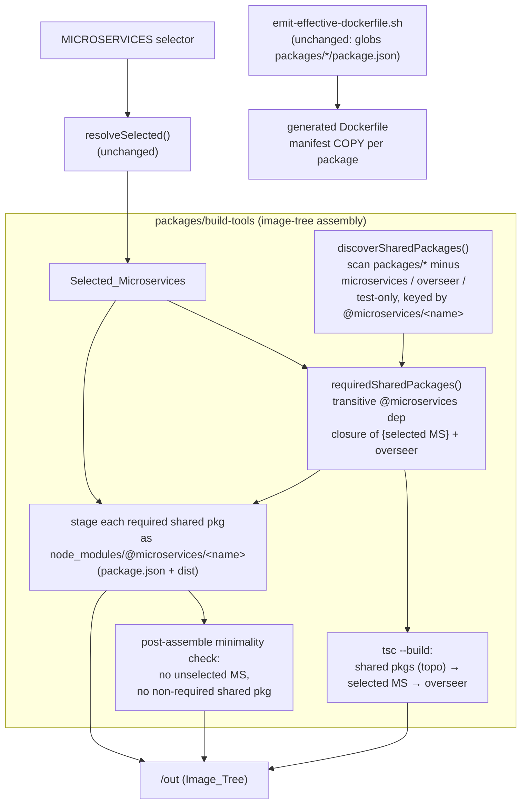

# Design Document

## Overview

Today the scaffold supports exactly one shared library — `packages/contracts` — and it is special-cased everywhere it matters. The image-tree assembler (`packages/build-tools/src/image-tree.ts`) hard-codes `copyPackage("packages/contracts", …)`, lists `packages/contracts` literally in its `tsc --build` invocation, and its post-assemble minimality check only guards against leaked *microservices*. There is no supported way to add a second shared library, have it build in topological order, ship into images only when a consumer is selected, and stay minimal in a Specific_Container.

This feature generalizes the notion of a **Shared_Package**: a non-microservice `@microservices`-scoped workspace under `packages/` that one or more microservices (and/or the Overseer) import by package name. The design:

1. **Generalizes the image-tree assembler** to discover shared packages, compute the transitive `@microservices`-scoped dependency closure of the selected microservices plus the Overseer (the **Required_Shared_Packages**), stage each required shared package as a real `node_modules/@microservices/<name>/` directory, order them ahead of their dependents in the `tsc --build`, and extend the minimality check to also fail on a leaked *non-required* shared package. `contracts` stops being special-cased and becomes just another shared package — always required because the Overseer depends on it.
2. **Leaves the registry generator untouched.** It already scans `packages/microservices/` only, so a shared package is never discovered as a microservice, never imported, never routed (R5). The design confirms this rather than changing it.
3. **Leaves `Dockerfile.template` and `scripts/emit-effective-dockerfile.sh` untouched.** The emit script already globs `packages/*/package.json` and emits a manifest `COPY` line for every top-level package except those named in its exclusion list (`integration-tests`, `microservices`). A new shared package's manifest is therefore picked up automatically (R8) — the design's only obligation is to *not* add shared packages to that exclusion list.
4. **Ships a Sample_Shared_Package** (`packages/config/`) that owns the config concern currently inline in `microservice2`'s `GET /config` handler. `microservice2` relocates its inline body to consume `@microservices/config`; `microservice3` becomes a second consumer with a new `GET /config` endpoint. `config` itself imports `@microservices/contracts` types, so it is a shared package that depends on another shared package — exercising the transitive closure end to end.

### Research findings

Grounding was done by reading the actual sources:

- **`generate-registry.ts`** scans only `packages/microservices/` (`listMicroserviceDirectories`) and emits `import * as mN from "@microservices/<id>"`. It has no knowledge of shared packages. **No change needed for R5** — confirmed by inspection.
- **`image-tree.ts`** hard-codes contracts in three places (copy, `tsc --build` list, and the layout comment) and its post-assemble check iterates only `listMicroserviceDirectories()`. This is the single file carrying the core gap for R6/R7/R14.
- **`emit-effective-dockerfile.sh`** resolves manifest COPY lines in one awk pass over `PKG_DIRS` (from `for dir in packages/*/`) minus the names `integration-tests` and `microservices`. **A new `packages/config/` is already emitted** with no script change (R8) — confirmed by reading the awk block.
- **Manifests**: `overseer` depends on `@microservices/contracts`; `microservice2` and `microservice3` currently depend only on `@microservices/contracts` + `express`. `contracts` depends on no `@microservices` package (leaf). Root `workspaces` order is `contracts, build-tools, microservices/*, overseer, integration-tests`.
- **`endpoint-contract.test.ts`** already asserts `microservice2 GET /config -> 200 application/json object`; that assertion must keep passing after relocation, and a matching one is added for `microservice3`.

## Architecture

The Build_System gains one new pure concern — **shared-package discovery and dependency-closure resolution** — and threads it through the existing image-tree assembler. Nothing else in the pipeline changes shape.



### Discovery model: exclusion by classification, keyed by package name

A candidate shared package is a directory `packages/<name>/` that:

- is **not** the `packages/microservices/` namespace container,
- has a readable `package.json`,
- whose `package.json` `name` is under the `@microservices` scope,
- is **not** the Overseer (`@microservices/overseer`),
- is **not** a bin-only tooling package that ships no runtime API — in practice `build-tools`, which has no `main`/`types` barrel — and
- is **not** a test-only package (`integration-tests` and siblings).

Rather than maintain a second hand-written exclusion list that could drift from the emit script's list, discovery is grounded in **reading each candidate's `package.json`** and keying the result by the declared `@microservices/<name>` package name. A directory only counts as a shared package if its manifest declares an `@microservices`-scoped `name`, has `main` and `types` (the barrel contract from `structure.md`), and is not the Overseer. `build-tools` is excluded because it declares no `main`/`types` (bin-only), and `integration-tests`/`microservices` are excluded because they are not `@microservices`-scoped shippable libraries. This makes discovery robust: the authority is the manifest each package already must declare, not a name list.

The map produced is `packageName ("@microservices/<name>") → { dirName, packageDir, dependencyNames }`, where `dependencyNames` is the set of `@microservices`-scoped keys in that package's `dependencies`. This map is the substrate for both the closure and the minimality check.

### Required_Shared_Packages: transitive closure over `@microservices` deps

`Required_Shared_Packages` is the transitive closure, over the discovered map, of the `@microservices`-scoped `dependencies` of:

- every **Selected_Microservice** (its `packages/microservices/<id>/package.json` `dependencies`), and
- the **Overseer** (`packages/overseer/package.json` `dependencies`).

The closure follows only edges that land on a *discovered shared package*. A microservice→microservice dep never appears (structurally prohibited by R3.2, and such a name would not be in the shared-package map anyway). Because `config` depends on `@microservices/contracts`, selecting `microservice2` pulls in `config` (direct) and `contracts` (transitive through `config`). Because the Overseer depends on `@microservices/contracts`, `contracts` is required for **every** selector — which is exactly why the old hard-coded-contracts behavior (R10.2) is preserved by construction: contracts is now always in the closure, not special-cased.

The closure is a pure function of two inputs — the selected identifier list and the on-disk `dependencies` graph — which makes it directly property-testable.

### Build order

The `tsc --build` list becomes: **required shared packages in topological order (each before its dependents) → selected microservices → overseer**. Topological order over the shared-package subgraph guarantees `contracts` compiles before `config`, and both before any microservice that imports them (R6.3, R14.1). The Overseer stays last because its generated registry statically imports the microservice packages.

### Staging and minimality

Each Required_Shared_Package is staged with the existing `copyPackage` helper as a **real** directory at `node_modules/@microservices/<name>/` (its `package.json` + compiled `dist/`), never a workspace symlink (R6.1, R6.2). Minimality holds **by construction**: only closure members are ever copied, so a Specific_Container that selects neither `microservice2` nor `microservice3` (and whose other selected services and the Overseer do not depend on `config`) never stages `config` (R7.1, R7.4, R14.3).

The post-assemble check is extended to a second guard: after staging, for every *discovered* shared package that is **not** in Required_Shared_Packages, assert its directory is absent from `node_modules/@microservices/`. If present, fail non-zero with a message naming the offending package (R7.2). This turns any future assembler regression into a build-time failure locally and in CI.

## Components and Interfaces

### 1. `packages/build-tools/src/shared-packages.ts` (new)

A new module owning discovery and closure. Pure over injected inputs (a `packages/` listing + a `readManifest` reader) so it is unit- and property-testable without touching the real filesystem.

```ts
/** A discovered shared package, keyed elsewhere by its package name. */
export interface SharedPackage {
  /** Declared package name, e.g. "@microservices/config". */
  readonly name: string;
  /** Directory name under packages/, e.g. "config". */
  readonly dirName: string;
  /** Relative package dir, e.g. "packages/config". */
  readonly packageDir: string;
  /** @microservices-scoped keys of this package's `dependencies`. */
  readonly sharedDependencies: readonly string[];
}

/**
 * Discover shared packages: top-level packages/<name>/ workspaces whose
 * package.json declares an @microservices-scoped name with main+types, that
 * are neither the Overseer, the microservices namespace, nor a bin-only /
 * test-only package. Returns a map keyed by package name.
 */
export function discoverSharedPackages(
  packagesDir?: string,
): Map<string, SharedPackage>;

/**
 * The transitive @microservices dependency closure of the selected
 * microservices plus the Overseer, restricted to discovered shared packages.
 * Returned in topological order: every package precedes its dependents.
 *
 * @throws when a selected microservice (or the Overseer) declares an
 *   @microservices dependency that resolves to no discovered shared package
 *   (R6.4) — an unresolvable shared-package dependency.
 */
export function requiredSharedPackages(
  selectedIdentifiers: readonly string[],
  shared: ReadonlyMap<string, SharedPackage>,
  readDependencies: (packageDir: string) => readonly string[],
): SharedPackage[];
```

Design notes:

- **Discovery keys on the manifest, not a name list.** A candidate is a shared package iff its `package.json` `name` starts with `@microservices/`, it declares `main` and `types`, and it is not `@microservices/overseer`. This automatically excludes `build-tools` (no `main`/`types`), `integration-tests` and `microservices` (not `@microservices`-scoped shippable libs).
- **`requiredSharedPackages` is total and pure.** Cycles cannot occur among leaf libraries in practice, but the topological walk uses a visited-set so a malformed cycle terminates rather than looping; an unresolvable `@microservices` dep raises the R6.4 error.
- **R6.4 unresolvable-dependency error** carries the format `[shared:unresolved] "<consumer>" depends on unknown @microservices package(s): "<name>"`, mirroring the selector module's message style.

### 2. `packages/build-tools/src/image-tree.ts` (changed)

`buildImageTree` is rewritten to remove the contracts special-case:

```ts
export function buildImageTree(outDir = "/out"): void {
  const selector = process.env.MICROSERVICES;
  generateRegistry(selector);
  const selected = resolveSelected(selector, listMicroserviceDirectories());

  const shared = discoverSharedPackages();
  const required = requiredSharedPackages(selected, shared, readSharedDeps);

  run("npx", [
    "tsc",
    "--build",
    ...required.map((p) => p.packageDir),                 // topo order
    ...selected.map((id) => `packages/microservices/${id}`),
    "packages/overseer",
  ]);

  rmSync(outDir, { recursive: true, force: true });

  for (const p of required) {
    copyPackage(
      p.packageDir,
      join(outDir, "node_modules", WORKSPACE_SCOPE, p.dirName),
    );
  }
  for (const id of selected) {
    copyPackage(
      join("packages", "microservices", id),
      join(outDir, "node_modules", WORKSPACE_SCOPE, id),
    );
  }
  copyPackage("packages/overseer", join(outDir, "packages", "overseer"));

  // Minimality guard 1: no unselected microservice leaked (unchanged).
  // Minimality guard 2: no non-required shared package leaked (new).
  assertNoUnselectedMicroservice(outDir, selected);
  assertNoNonRequiredSharedPackage(outDir, shared, required);
}
```

- `contracts` disappears from the literal build list and copy calls; it re-enters through `required` because the Overseer depends on it (R10.2 preserved by construction).
- `readSharedDeps(packageDir)` reads the `@microservices`-scoped `dependencies` keys from a workspace `package.json` (used for microservices and the Overseer inside the closure).
- The second minimality guard iterates the discovered shared-package map; any discovered-but-not-required package whose directory exists under `node_modules/@microservices/` triggers a named non-zero failure (R7.2).

### 3. `packages/config/` — the Sample_Shared_Package (new)

A standard shared package per `structure.md` conventions.

**`packages/config/package.json`**

```jsonc
{
  "name": "@microservices/config",
  "version": "0.0.0",
  "private": true,
  "type": "module",
  "main": "./dist/index.js",
  "types": "./dist/index.d.ts",
  "scripts": {
    "build": "tsc",
    "test": "vitest --run --passWithNoTests",
    "lint": "eslint .",
    "typecheck": "tsc --noEmit"
  },
  "dependencies": {
    "@microservices/contracts": "*"
  }
}
```

**`packages/config/tsconfig.json`** extends `../../tsconfig.base.json` (two levels up — a top-level `packages/config`, like `contracts`), emitting to `dist/`.

**`packages/config/src/index.ts`** — the barrel and stable public API. It exports the config data, its shape, and a helper that builds the Config_Payload:

```ts
/** The illustrative settings block shared by config consumers. */
export interface SampleConfig {
  readonly sampleSetting: string;
  readonly description: string;
}

/** The full Config_Payload body a consumer returns from GET /config. */
export interface ConfigPayload {
  readonly "microservice-name": string;
  readonly path: string;
  readonly config: SampleConfig;
}

/** The shared sample settings — the single source of truth. */
export const sampleConfig: SampleConfig = {
  sampleSetting: "example-value",
  description: "demonstration sub-endpoint",
};

/**
 * Build the Config_Payload for a consuming microservice. The `name`/`path`
 * come from the caller (each microservice owns its own identity); the `config`
 * block is the shared `sampleConfig`.
 */
export function buildConfigPayload(name: string, path: string): ConfigPayload {
  return { "microservice-name": name, path, config: sampleConfig };
}
```

Rationale: `buildConfigPayload(name, path)` returns exactly the object `microservice2` builds inline today (`{ "microservice-name", path, config: { sampleSetting, description } }`), so the relocated behavior is byte-for-byte equivalent (R12.3). The `config` package imports **types** from `@microservices/contracts` where useful (e.g. reusing any JSON-body type contract), which makes `config`→`contracts` a real shared-package dependency edge (R11 note, closure exercise). It imports nothing from any microservice or the Overseer (R3.4, R11.4).

### 4. `packages/microservices/microservice2/src/index.ts` (changed)

- Add `"@microservices/config": "*"` to `dependencies` (R12.1).
- Replace the inline `/config` object literal with `res.status(200).type("application/json").json(buildConfigPayload("microservice2", path))`, importing `buildConfigPayload` by package name only (R12.2, R12.4).
- `GET /` identifier response and the `ALL /` 405 fallback are untouched (R12.5). Registration order stays: `GET /`, `GET /config`, `ALL /`.

### 5. `packages/microservices/microservice3/src/index.ts` (changed)

- Add `"@microservices/config": "*"` to `dependencies` (R13.1).
- Add a `GET /config` handler (registered after `GET /`, before `ALL /`) returning `buildConfigPayload("microservice3", path)`, imported by package name only (R13.2, R13.3).
- `GET /` and the 405 fallback stay unchanged (R13.4); no import from any peer microservice (R13.5).

### 6. Root `package.json` `workspaces` (changed)

Insert `packages/config` immediately after `packages/contracts`:

```
packages/contracts,
packages/config,
packages/build-tools,
packages/microservices/*,
packages/overseer,
packages/integration-tests
```

`config` depends on `contracts`, so `contracts` stays first; `config` precedes `microservices/*` (its consumers) and the Overseer (R4.1, R11.5, R14.1). This keeps `npm run <script> --workspaces` topological on a fresh clone.

### 7. Unchanged components (confirmed by design)

- **`generate-registry.ts`** — scans `packages/microservices/` only; a shared package is never discovered, imported, or routed (R5.1–R5.3). No change.
- **`scripts/emit-effective-dockerfile.sh`** — globs `packages/*/package.json`; `packages/config` is emitted automatically into both manifest blocks (R8.1, R8.2, R14.4). `config` must **not** be added to the `integration-tests`/`microservices` exclusion list (R8.3). No change.
- **`Dockerfile.template`** — no change (R9.3, R14.4).

## Data Models

### Discovered shared-package map

```
Map<string /* "@microservices/<name>" */, {
  name: string;                      // "@microservices/config"
  dirName: string;                   // "config"
  packageDir: string;                // "packages/config"
  sharedDependencies: string[];      // ["@microservices/contracts"]
}>
```

### Required_Shared_Packages (closure result)

An ordered `SharedPackage[]` in topological order (dependency before dependent). For a selector including `microservice2`:

```
[ contracts, config ]        // contracts first (config depends on it)
```

For a selector of only `microservice1` (no config consumer):

```
[ contracts ]                // required solely by the Overseer
```

### Config_Payload (the shared data shape)

```
{
  "microservice-name": string,   // consumer-supplied
  "path": string,                // consumer-supplied
  "config": {
    "sampleSetting": "example-value",
    "description": "demonstration sub-endpoint"
  }
}
```

The `config` block is the shared constant `sampleConfig`; `microservice-name` and `path` are supplied per consumer.

## Correctness Properties

*A property is a characteristic or behavior that should hold true across all valid executions of a system — essentially, a formal statement about what the system should do. Properties serve as the bridge between human-readable specifications and machine-verifiable correctness guarantees.*

The design's testable logic is concentrated in pure functions of the Build_System — shared-package discovery, the Required_Shared_Packages closure, topological ordering, and the config helper — plus the registry-exclusion guarantee that already holds. Concrete HTTP behavior (`GET /config` bodies, `405` fallbacks) and package-convention checks are covered by example/integration tests in the Testing Strategy, not by properties.

### Property 1: Discovery classifies exactly the shared packages

*For any* set of top-level `packages/*` directories with arbitrary `package.json` manifests, `discoverSharedPackages` returns exactly those directories whose manifest declares an `@microservices`-scoped `name` with `main` and `types` and is not the Overseer — and never returns any `packages/microservices/*` directory, the Overseer, a bin-only tooling package (no `main`/`types`, e.g. `build-tools`), or a test-only package.

**Validates: Requirements 1.1, 1.2, 3.2, 3.3**

### Property 2: The generated registry never contains a shared package

*For any* namespace layout and selector, the identifier set of the generated Microservice_Registry equals the set of selected `packages/microservices/*` directory names and is disjoint from the names of any top-level shared package — the registry contains no entry, import, or route for any shared package.

**Validates: Requirements 5.1, 5.2, 5.3, 11.6**

### Property 3: The staged shared set equals the Required_Shared_Packages closure

*For any* selector and any `@microservices`-scoped dependency graph over discovered packages, the set of shared packages staged into the Image_Tree at `node_modules/@microservices/<name>` equals `requiredSharedPackages(selected, …)` — the transitive `@microservices` dependency closure of the selected microservices plus the Overseer. Nothing outside the closure is staged (minimality) and nothing inside it is missing (completeness), so `contracts` — always in the closure because the Overseer depends on it — is staged for every selector.

**Validates: Requirements 6.1, 7.1, 7.3, 7.4, 10.2, 14.2, 14.3**

### Property 4: Build and workspace order are topological

*For any* discovered `@microservices` dependency graph, in both the `requiredSharedPackages` result / `tsc --build` argument list and the root `workspaces` array, every shared package appears before every package that depends on it (directly or transitively).

**Validates: Requirements 4.1, 4.2, 6.3, 14.1**

### Property 5: An unresolvable shared dependency fails the build

*For any* selected microservice or the Overseer that declares an `@microservices`-scoped dependency naming a package absent from discovery, `requiredSharedPackages` raises a non-zero-exit error naming the unresolvable package(s).

**Validates: Requirements 6.4**

### Property 6: A non-required staged shared package fails the minimality guard

*For any* selector, if a discovered shared package that is not a Required_Shared_Package is present under `node_modules/@microservices/` after assembly, the post-assemble minimality guard raises a non-zero-exit error naming the offending package.

**Validates: Requirements 7.2**

### Property 7: The config helper echoes identity and carries the shared config block

*For any* microservice `name` and mount `path` strings, `buildConfigPayload(name, path)` returns a payload whose `microservice-name` equals `name`, whose `path` equals `path`, and whose `config` block deep-equals the shared `sampleConfig` constant.

**Validates: Requirements 12.4**

## Error Handling

- **Unresolvable shared dependency (R6.4).** When a selected microservice or the Overseer declares an `@microservices`-scoped dependency that resolves to no discovered shared package, `requiredSharedPackages` throws `Error("[shared:unresolved] \"<consumer>\" depends on unknown @microservices package(s): \"<name>\", …")`. This propagates out of `buildImageTree`, so `node` exits non-zero and the image build fails. The message names the consumer and the missing package(s), sorted and deduplicated, mirroring the selector module's `[selector:unmatched]` style.
- **Non-required shared package leaked into the tree (R7.2).** The post-assemble guard `assertNoNonRequiredSharedPackage` iterates the discovered shared-package map; for any discovered package not in the required set whose directory exists under `<outDir>/node_modules/@microservices/`, it throws `Error("[image-tree] non-required shared package \"@microservices/<name>\" found in <outDir>/node_modules/@microservices/ — the image tree must contain only required shared packages")`. This is a defense-in-depth check against future assembler regressions; under the current construction it can never fire, but it converts any regression into a local/CI build failure.
- **Unselected microservice leaked (existing).** The existing `assertNoUnselectedMicroservice` guard is retained unchanged.
- **Empty namespace / unmatched selector (existing).** `resolveSelected` continues to throw `[selector:empty]` and `[selector:unmatched]`; unchanged.
- **Missing `dist/` or `package.json` during staging.** `copyPackage` uses `cpSync`, which throws if a source is absent; because the `tsc --build` runs before staging, a required package that failed to compile surfaces as a build error before staging is reached. Errors propagate and exit the process non-zero.
- **Emit script (unchanged).** `scripts/emit-effective-dockerfile.sh` retains its existing failure modes (missing template, missing anchors, selector resolving to no microservices), writing to stderr and exiting non-zero with no partial `Dockerfile`.

## Testing Strategy

### Property-based testing

The Build_System logic is pure and input-varying, so PBT applies. Tests use **fast-check** (already a root devDependency), run a **minimum of 100 iterations** each, and carry a tag comment referencing the design property.

Tag format: `Feature: shared-packages, Property {number}: {property_text}`.

New/extended property tests, all in `packages/build-tools/tests/`, exercising the pure functions in `packages/build-tools/src/shared-packages.ts` against injected in-memory layouts (no real filesystem):

- **Property 1 — discovery** (`shared-packages.discovery.property.test.ts`): generate random top-level layouts mixing `@microservices`-scoped libs (with/without `main`/`types`), the Overseer, `build-tools`, `integration-tests`, and `microservices`; assert the discovered set equals a reference oracle and never includes a microservice/overseer/bin-only/test-only entry.
- **Property 3 — staging equals closure** (`shared-packages.closure.property.test.ts`): generate random selectors + `@microservices` dep graphs (including `config→contracts`, overseer→contracts); assert the set fed to staging equals `requiredSharedPackages`, and that the all-selector case unions every consumer's closure. This is the completeness+minimality property.
- **Property 4 — topological order** (`shared-packages.order.property.test.ts`): for random dep graphs, assert `requiredSharedPackages` and the derived `tsc --build` list place every dependency before every dependent.
- **Property 5 — unresolvable dep** (same file as closure): generate graphs with a dangling `@microservices` dep; assert `requiredSharedPackages` throws `[shared:unresolved]` naming the missing package.
- **Property 7 — config helper** (`packages/config/tests/build-config-payload.property.test.ts`): for arbitrary `name`/`path` strings, assert `buildConfigPayload` echoes them and carries `sampleConfig`.
- **Property 2 — registry exclusion**: extend the existing `packages/build-tools/tests/registry-generator.property.test.ts` generators so top-level layouts include shared-package names; assert the generated registry identifier set stays exactly the microservice directories and disjoint from shared-package names. (This mostly holds already because the generator only scans `packages/microservices/`; the extension makes the guarantee explicit under shared packages.)

### Unit / example tests

- **Property 6 — minimality guard** (`shared-packages.closure.property.test.ts` or an example): stage a required set, inject a stray non-required shared directory into a temp `outDir`, and assert `assertNoNonRequiredSharedPackage` throws naming it.
- **Config package conventions (R2, R11.1–R11.4)**: assert `packages/config/package.json` has `"type":"module"`, `@microservices/config` name mirroring the dir, `main`/`types` under `dist/`, the four scripts, and that its `dependencies` name no microservice or the Overseer; assert the barrel exports `sampleConfig`, `buildConfigPayload`, and the `ConfigPayload`/`SampleConfig` types.
- **Consumer manifests (R12.1, R13.1)**: assert `microservice2` and `microservice3` `package.json` `dependencies` include `@microservices/config`.
- **Workspace order (R4.1, R11.5)**: parse the root `workspaces` array and assert `packages/config` precedes `packages/microservices/*` and `packages/overseer`, and follows `packages/contracts`.

### Integration tests (`packages/integration-tests/`)

- **`endpoint-contract.test.ts` (extend)**: keep the existing `microservice2 GET /config -> 200 application/json object` assertion (now served via the shared helper) and tighten it to deep-equal the known Config_Payload for `microservice2` (R12.3). Add a `microservice3 GET /config -> 200 application/json` case whose body deep-equals `buildConfigPayload("microservice3", "/microservice3")` (R13.3). Confirm the existing `GET / -> 200 {two keys}` and `POST -> 405 Allow: GET` cases still pass for both services (R12.5, R13.4).
- **Specific-container staging (extend `specific-container-404.test.ts` or a new staging test)**: assemble the Image_Tree for a selector that includes `microservice2` and assert `node_modules/@microservices/config` and `.../contracts` are staged as real directories with `package.json` + `dist`; assemble for a selector of only `microservice1` and assert `config` is **absent** while `contracts` is present (required by the Overseer). This exercises R14.2/R14.3 end to end.
- **`effective-dockerfile.test.ts` (extend)**: assert the generated Dockerfile emits a `COPY packages/config/package.json packages/config/` line in both the build and prod-deps manifest blocks, via the unchanged glob (R8.1, R14.4), and that `config` is not excluded.

### CI quality gate (R10.3)

`npm run ci` runs the full gate — build, typecheck, lint, `npm test`, `test:types` — with `packages/config` present and consumed by `microservice2` and `microservice3`. The gate passing is the R10.3 acceptance signal and the R2.3 build/typecheck/lint confirmation for the new package.

### Why not PBT for the rest

Endpoint bodies, `405` behavior, package conventions, and manifest field checks do not vary meaningfully with input (they are fixed values or single concrete artifacts), so they are covered by example/integration tests. The emit-script manifest coverage is exercised through the existing `effective-dockerfile` integration test rather than a new property test, since the script is unchanged and its behavior is already anchored there.
