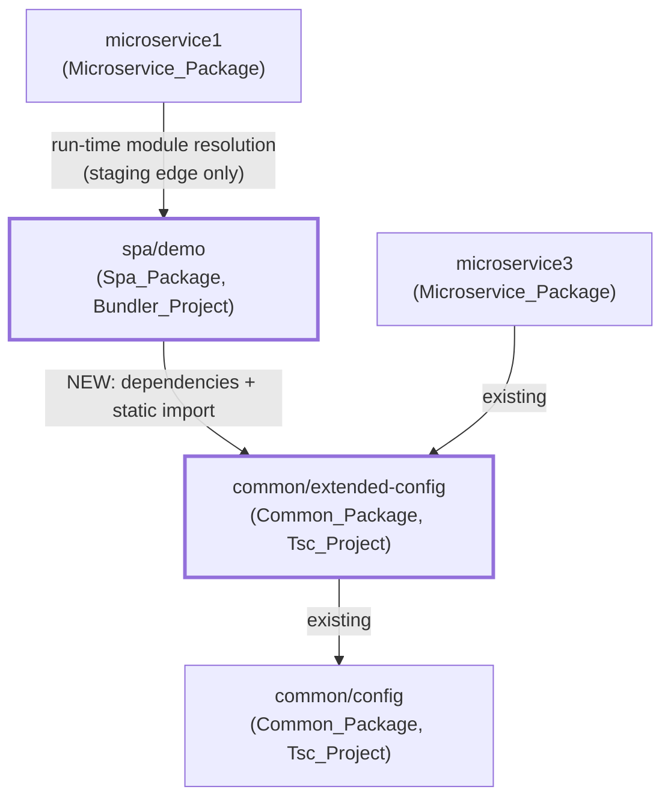
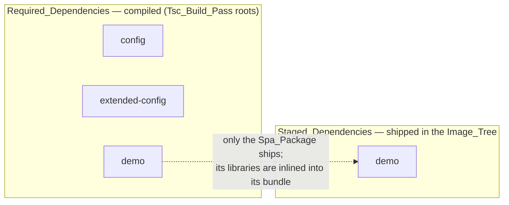
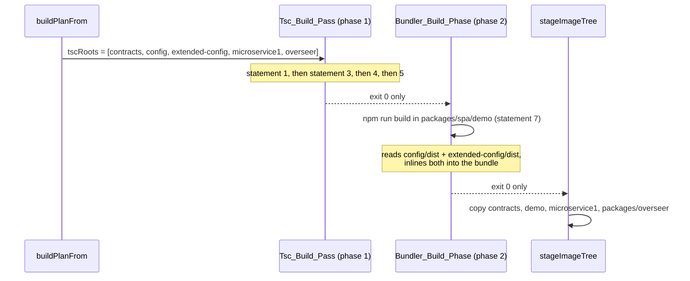

# Design Document

## Overview

This feature adds one dependency edge, one pure module, one page field, one Container
configuration, and two documentation passages. It adds no framework capability, and — this is
the load-bearing claim of the whole design — **it changes no file under
`packages/build-tools/src/`**. Section "4. Why the Build_System does not change" gives the
evidence, module by module.

The change set:

| # | Change | Files |
|---|---|---|
| 1 | The Demo_Spa declares and imports `@microservices/extended-config` | `packages/spa/demo/package.json` |
| 2 | The Payload_Preview: one new pure module computing the Expected_Payload_Text | `packages/spa/demo/src/payload-preview.ts` (new) |
| 3 | The Expected_Payload_Heading + Expected_Payload_Field, and one wiring function | `packages/spa/demo/index.html`, `packages/spa/demo/src/main.ts` |
| 4 | *(nothing)* — the Build_System already sequences and packages the edge | — |
| 5 | The Spa_Only_Container: a third Release_Pipeline leg and a third `docker:build:*` script | `.github/workflows/release.yml`, `package.json` |
| 6 | Documentation of the pattern and the third configuration | `README.md`, `.kiro/steering/structure.md` |

### What the feature proves

The Demo_Spa stops being the dependency sink its manifest comment currently calls it, and
becomes the first Spa_Package with an `@microservices`-scoped dependency. Because the
Extended_Config_Package itself depends on the Config_Package, the Demo_Spa reaches a two-link
Common_Package chain transitively, and the interesting packaging case is the Spa_Only_Container
(Selector `microservice1`), where **no Selected_Microservice imports either Common_Package
directly** — the build must reach them through a Bundler_Project or fail.

### BUILD versus STAGE — settled, not reopened

The user's confirmed intent and the requirements agree, and this design implements exactly that
reading:

- The Demo_Spa's Common_Packages are **built** (Required_Dependencies → roots of the
  Tsc_Build_Pass) so their compiled `dist/` exists for the bundler to **inline**. They are
  therefore *packaged into the SPA*, inside its bundle.
- The Demo_Spa itself **is really staged** into the Image_Tree at
  `node_modules/@microservices/demo`, because Microservice1 depends on it and serves its
  `dist/` at the Mount_Root.
- The two Common_Packages are **not separately staged** for the Spa_Only_Container, because
  after inlining no runtime process in the image can reach their `dist/`.

This is the requirements' "Recorded decision — the SPA's Common_Packages are compiled, bundled,
and deliberately NOT staged", and it is treated here as settled. Requirement 5 states both
halves; criteria 5.6 and 5.11 are the two observables that make the inlining checkable from
both directions — the inlined value is present in the bundle, and no unresolved
`@microservices` specifier remains in it — with no runtime started.

## Architecture

### The dependency edge this feature adds



The one new arrow is `demo → extended-config`. Everything else is committed today.

### The two sets under the Spa_Only_Container Selector



`config` and `extended-config` are in BUILD and absent from STAGE. `demo` is in both.

### Build phase order



Every failure path short-circuits before the first copy, so a failed build stages nothing —
that is `executeBuildPlan`'s existing shape, not something this feature adds.

## Components and Interfaces

### 1. `packages/spa/demo/package.json` — the manifest change

Two edits. The first adds the dependency:

```jsonc
"dependencies": {
  "@microservices/extended-config": "*"
}
```

`dependencies`, not `devDependencies`: `discovery.ts`'s `scopedDependencySpecifiers` reads the
`dependencies` object and nothing else, so a `devDependencies` entry would be invisible to the
Dependency_Resolver and the package would not become a Required_Dependency (R1.1). The value
`*` matches every other intra-workspace specifier in the repository.

`@microservices/extended-config` is the manifest's **only** `@microservices`-scoped key, in any
dependency object (R1.2). The Config_Package is reached transitively, through the
Extended_Config_Package's own `dependencies` — which is what makes the chain two links long and
therefore worth proving.

The second edit replaces the stale tail of the `//exports` comment. It currently ends:

> No `@microservices`-scoped dependency is declared at all, which keeps the Demo_Spa a true sink.

That sentence is now false and R1.7 forbids it. It is replaced with a statement that the
Demo_Spa declares one `@microservices`-scoped dependency and why the rest of the manifest shape
is unaffected:

> One `@microservices`-scoped dependency IS declared — `@microservices/extended-config`, the
> Common_Package the Payload_Preview imports by package name — which makes the Demo_Spa the
> worked example of a Spa_Package consuming a Common_Package. It changes nothing else here: the
> Demo_Spa is still no importable API (it declares no `main` and no `types`), it is still a
> Bundler_Project built by its own `scripts.build`, and the Config_Package is reached only
> transitively, through the Extended_Config_Package.

Unchanged, and asserted unchanged (R1.4, R1.5, R1.6): `scripts.build`, the `exports` map
`{ ".": "./dist/index.html" }` (pair A of the chosen Spa_Resolution_Pair), and the absence of
`main` and `types`.

#### Resolution mechanics, both halves

- **`tsc --noEmit` (R1.8).** `packages/spa/demo/tsconfig.json` sets
  `"moduleResolution": "Bundler"`, so `@microservices/extended-config` resolves through the
  `node_modules/@microservices/extended-config` workspace symlink to that package's `types`
  field, `./dist/index.d.ts`. That file exists only after the Extended_Config_Package has been
  compiled — hence R1.8's precondition and R1.11's failure mode. No `references` array is added
  to the Demo_Spa's tsconfig: it is not a `composite` project and is a root of no
  `tsc --build`, so a project reference would be inert.
- **`vite build` (R1.10).** Vite resolves the same bare specifier to the package's `main`,
  `./dist/index.js`, and Rollup inlines it — and, following its `@microservices/config` import,
  inlines the Config_Package too. Neither is marked external, so nothing survives as a runtime
  specifier (R5.11).

Both halves fail loudly, not silently, when the `dist/` is absent: TypeScript reports TS2307 and
Vite reports a failed import resolution, each with a non-zero exit (R1.11, R1.12). For the
`typecheck` half the guarantee is stronger — `tsc --noEmit` writes nothing, so an existing
`dist/index.html` is left unmodified (R1.11). The `build` half is required only to fail properly
(R1.12); in practice Vite's `emptyOutDir: true` takes effect only once a build has got past
resolution, so today an existing `dist/index.html` happens to survive, but R1.12 no longer relies
on that and no test asserts it.

### 2. `packages/spa/demo/src/payload-preview.ts` — the Payload_Preview (new)

```ts
/**
 * The Payload_Preview — a single pure module of the Demo_Spa exporting exactly one
 * function (R3.1). It computes the Expected_Payload_Text: the Extended_Config_Payload
 * for a name and a path, serialised as JSON indented with two spaces (R3.2).
 *
 * The values come from @microservices/extended-config, imported by package name and
 * never restated as a literal here (R2.9), so the text is fixed when the Demo_Spa is
 * bundled — the bundler inlines the Common_Package and no request is issued (R3.3).
 *
 * Pure: it reads no `document`, `window`, `fetch`, `AbortController`, `setTimeout`,
 * clock, or random source, and performs no network, filesystem, or console access,
 * either when this module is evaluated or when the function is called (R3.3). That is
 * the whole of what makes it callable in the Vitest default `node` environment with no
 * DOM present (R3.7), and what makes equal arguments yield character-identical output
 * across calls and across processes (R3.4).
 *
 * The name and the path are ARGUMENTS, not literals. Two reasons: it is what gives
 * R3.8 and R3.10 something to quantify over, and it keeps every Microservice3-specific
 * literal in `main.ts`, beside the endpoint literals that already live there.
 */

import { buildExtendedConfigPayload } from "@microservices/extended-config";

/**
 * The JSON indent width R3.2 fixes. Module-private: R3.1 caps the module's export
 * list at exactly one function, so nothing else leaves this file.
 */
const JSON_INDENT = 2;

/**
 * The Expected_Payload_Text for one microservice name and Microservice_Path.
 *
 * `JSON.stringify` with a two-space indent and no replacer produces no leading
 * whitespace, no trailing whitespace, and no trailing newline (R3.2), and returns a
 * string for every pair of string arguments (R3.8) — the payload is a plain object of
 * strings, so there is no cyclic, `undefined`, or `BigInt` value to make it throw or
 * return `undefined`.
 *
 * The metamorphic relation of R3.6 and R3.10 holds by construction rather than by
 * coincidence: the Result_Formatter's `formatBody` computes
 * `JSON.stringify(JSON.parse(body), null, 2)` for a body that parses, and `JSON.parse`
 * preserves the insertion order of every key of this payload (none is integer-like),
 * so `formatBody(JSON.stringify(payload))` and this function agree character for
 * character. Neither function is written in terms of the other, which is what makes
 * the property a real check.
 *
 * @param name - the microservice name to echo into the payload.
 * @param path - the Microservice_Path to echo into the payload.
 * @returns the payload serialised as JSON, indented with two spaces.
 */
export function expectedPayloadText(name: string, path: string): string {
  return JSON.stringify(
    buildExtendedConfigPayload(name, path),
    null,
    JSON_INDENT,
  );
}
```

**Why a second pure module rather than a fourth Result_Formatter export.** The
`scaffold-demo-samples` feature fixes the Result_Formatter's surface at exactly three functions,
one per display field, and `main.ts` already carries a comment recording that the in-flight
`PENDING` constant is deliberately *not* a fourth formatter export for that reason. The
Expected_Payload_Field is a fourth field with a computation of its own, so it gets a module of
its own, following the same one-concern-per-pure-module shape (and R3.1 then pins that module's
surface the way R10.1 pins the formatter's).

**Composition with the Extended_Config_Package.** `buildExtendedConfigPayload` is called, not
reimplemented, and its `extendedConfig` block is not spread, copied, or restated. The
Expected_Payload_Text therefore contains `extendedSetting`'s value (R3.9) because the package
put it there, and R5.6's substring observable holds for the same reason.

### 3. The Demo_Page markup and the one line of wiring

#### `index.html`

Appended after the Body_Field — the last field in the document today — so the
Expected_Payload_Field follows both Service_Buttons and all three existing fields, and nothing
of theirs follows it (R2.4, R2.12):

```html
<!--
  The Expected_Payload_Field: one further readonly `textarea` AFTER the Body_Field
  (R2.4). Its heading is a `label` carrying `for`, not an `h2` — one element then
  serves both purposes: the small visible heading above the field, and the field's
  programmatically associated accessible name. That mirrors the Body_Field's own
  `<p><label for="body">` treatment exactly, so the new field is indistinguishable in
  structure from the ones above it (R2.5, R2.7).

  `readonly` and NOT `disabled`, for the same reason as the Body_Field: the field stays
  focusable, keyboard reachable, scrollable, and selectable, so a reader can select the
  expected payload and compare it with the Body_Field character for character (R2.2,
  R2.3). `readonly` is also what makes R2.15 structural — a keystroke or a paste
  directed at the focused field cannot change its value.

  It ships EMPTY: `main.ts` sets its value at load from the Payload_Preview (R2.8), so
  the expected values are never restated as literal markup (R2.9).

  No `aria-live`, here or anywhere in this document (R2.13): the field's content never
  changes after load, so there is nothing to announce.
-->
<p><label for="expected-microservice3">microservice 3 should yield:</label></p>
<textarea id="expected-microservice3" rows="16" cols="72" readonly></textarea>
```

The heading's text content is exactly `microservice 3 should yield:` and nothing further
(R2.6). The `id` `expected-microservice3` is carried by no other element (R2.5). The `rows` and
`cols` mirror the Body_Field's, so the two fields are the same size on screen — the comparison
R2's user story describes is a side-by-side one.

#### `main.ts`

One import, one function, one call. The Payload_Preview supplies the text; `main.ts` supplies
the two literals and the only DOM write:

```ts
import { expectedPayloadText } from "./payload-preview.js";

/**
 * The Microservice3 identity the Expected_Payload_Field previews. These two literals
 * live here, beside the ENDPOINTS map they correspond to, because `main.ts` is already
 * the module that owns the page's Microservice3-specific facts; the Payload_Preview
 * takes them as arguments and knows neither (R3.1).
 */
const MICROSERVICE3_NAME = "microservice3";
const MICROSERVICE3_PATH = "/microservice3";

/**
 * Fill the Expected_Payload_Field, once, at load (R2.8).
 *
 * This has its OWN element lookup and its OWN guard, deliberately kept out of
 * `wireDemoPage`'s combined `instanceof` guard. That separation is the whole of R2.14:
 * were the field folded into that guard, a document missing it would make the guard
 * fail and BOTH Service_Buttons stop working. Kept apart, an absent field means this
 * function returns and the buttons are wired and behave exactly as they do when the
 * field is present, with no uncaught error — the same early-return pattern
 * `wireDemoPage` already uses, applied to one element instead of five.
 *
 * The field is written exactly once, in this one statement. Nothing in
 * `handleActivation` touches it, which is what makes R2.10, R2.11, and R2.15 hold for
 * any number of activations and any settlement outcome: there is no second writer.
 */
function fillExpectedPayload(): void {
  const field = document.getElementById("expected-microservice3");
  if (!(field instanceof HTMLTextAreaElement)) {
    return;
  }
  field.value = expectedPayloadText(MICROSERVICE3_NAME, MICROSERVICE3_PATH);
}

fillExpectedPayload();
wireDemoPage();
```

`fillExpectedPayload()` runs synchronously at module evaluation. The document loads the module
with `<script type="module">`, which is deferred until parsing finishes, so the `textarea`
exists; and because the call is synchronous and precedes `wireDemoPage()`, the field is filled
before any listener is attached, let alone before any Service_Button can be activated — well
inside R2.8's 1-second bound, with no timer involved.

**What is deliberately not added:** no `input`, `keydown`, or `paste` listener on the field
(R2.15 comes from `readonly`), no `aria-live` (R2.13), no re-computation on activation, and no
change of any kind to `handleActivation`, `ENDPOINTS`, `setButtonsDisabled`, or
`describeTransportFailure`.

### 4. Why the Build_System does not change

No file under `packages/build-tools/src/` is touched. Four independent pieces of evidence, read
off the committed sources:

**(a) `required-dependencies.ts` — the edge is walked, so both Common_Packages join the BUILD
set.** `reachableSubgraph` walks out from the Selected_Microservices plus the Overseer and calls
`resolveSpecifiers` for **every** member it visits, passing that member's own category. The
category only ever *forbids* an edge: none may name a Microservice_Package (`[deps:peer]`), a
Common_Package may not name a Spa_Package (`[deps:common-to-spa]`), and a Spa_Package may not
name another (`[deps:spa-to-spa]`). A Spa_Package naming a **Common_Package** matches no
forbidden branch and falls through to `resolved.push(pkg)`, so `demo → extended-config` is
followed and `extended-config → config` after it. For the Selector `microservice1` the BUILD set
is therefore `{config, extended-config, demo}` (R4.1).

**(b) `required-dependencies.ts` — `stagedSubset` already draws the BUILD/STAGE line.** Phase 3
re-walks the same subgraph and expands a member's edges only `if (member.category !== "spa")`.
`demo` is arrived at and included, never expanded, so `extended-config` and `config` are reached
by no other path under this Selector and are left out. STAGE is `{demo}` while BUILD is all
three (R5.3). The asymmetry is documented in `build-plan.ts`'s own header comment
("With no Spa_Package present the two sets are equal and the asymmetry is invisible") — this
feature is the first case that makes it visible, which is exactly what the requirements'
Recorded decision says.

**(c) `build-sequence.ts` — statement 3 precedes statement 7, unconditionally.**
`buildSequence` emits the seven statements literally and in order: the Common_Packages at
statement 3, the Spa_Packages at statement 7. No membership can interleave them (R4.6). Within
statement 3, `commonOrder` topologically sorts on declared edges, so `config` precedes
`extended-config` because `extended-config` declares `@microservices/config` — a calculated
consequence, not a rule (R4.2, together with `leastTopologicalOrder`'s ordering of the BUILD set
itself).

**(d) `build-plan.ts` + `image-tree.ts` — the Build_Kind partition and the phase boundary hold
as written.** `buildPlanFrom` partitions the BUILD set by `buildKind`: `spaBuilds` is the
`bundler-project` half, `tscRoots` the `tsc-project` half, and statement 7 is handed `spa: []`
on the image path, so no Spa_Package can reach `tscRoots` for any Selector (R4.4).
`executeBuildPlan` runs `npx tsc --build …tscRoots` first and enters the per-SPA
`npm run build` loop only if that returned (its `run` throws on a non-zero status), then stages
only after both (R4.7, R4.8, R4.13, R5.2, R5.10). On the repository-wide path,
`runOrderedBuild` walks the full Build_Sequence calling `npm run build --workspace <name>`, so
the Demo_Spa's `vite build` runs at statement 7, after both Common_Packages' `tsc` at
statement 3 (R4.9).

**(e) The Verification_Pass accepts the new edge.** `prerequisiteEdges` records
`extended-config → demo` (the prerequisite is not a Spa_Package, so it is not skipped). In the
Workspace_Build_Order, `extended-config` sits in statement 3 and `demo` in statement 7:
positionally correct, and structurally exempt because the two are in *different* statements —
the same-Unordered_Statement check cannot fire. In the Tsc_Root_Order `demo` is absent, so the
edge is skipped by the `positionOf === undefined` guard. Neither a
`[build-order:prerequisite]` nor a `[build-order:divergence]` finding is produced (R4.10).
Separately, `microservice1 → demo` remains excluded from the graph by the unconditional
`spaNames` skip.

**(f) `repo-invariants.ts` needs no rule change either (R7.10).** Import discipline's SPA rule
is guarded by `owner.buildKind === "tsc-project"`; the Demo_Spa is a `bundler-project`, so
importing a Common_Package from it is not `[imports:spa]` — and no Tsc_Project imports the
Demo_Spa, so that rule stays satisfied in the direction it governs (R7.2, R7.3). The
dependency-direction check iterates over `discovery.byCategory.common` only, so a Spa_Package's
declaration is outside its domain, and no `[deps:direction]` finding is possible for
`packages/spa/demo`. The build-order-source check looks for a `build` run carrying
`--workspaces` in the same invocation; neither new script contains that flag (R7.9).

**(g) `scripts/emit-effective-dockerfile.sh` needs no change.** It discovers manifests by four
globs, one of them `packages/spa/*/package.json`, and emits a `COPY` line per match; a new
dependency key in an already-discovered manifest changes nothing it reads. The Exclusion_List
is untouched: a Spa_Package ships, so it must keep contributing a `COPY` line. And
`Dockerfile.template` stays byte-identical (R6.12) — the per-selector `ENV` lines are generated,
and the `microservice1` selector yields exactly one, `MICROSERVICE_MICROSERVICE1_ENABLED`
(R6.11), from the same `toupper` loop that produces them today.

### 5. The Spa_Only_Container

#### `.github/workflows/release.yml`

One matrix leg appended:

```yaml
- variant: spa-only
  selector: "microservice1"
  image_suffix: microservice1
```

The suffix satisfies both the rule the existing suite asserts (`*` → `generic`; otherwise the
comma-separated identifiers lowercased and joined with `-`, which for a single identifier is
that identifier) and R6.3's literal requirement, and it is pairwise distinct from `generic` and
`microservice1-microservice2` (R6.2). Everything else the leg needs it inherits from the matrix
job as it stands: the same platform set, the same tag rules, the same publish gate
`github.event_name != 'pull_request'`, and the same `MICROSERVICES` wiring — env for the emit
step, build-arg for the image build (R6.4, R6.5, R6.13, R6.15). `fail-fast: false` is already
set, so one failing leg cancels none of the others (R6.7). The `permissions` block is untouched
(R6.8). A failing emit step or image build stops that leg before its push, so nothing publishes
and the `cleanup` job — which `needs: build-and-publish` — does not run (R6.14).

One `cleanup` step appended, mirroring the two present:

```yaml
- name: Prune old GHCR versions (spa-only image)
  uses: dataaxiom/ghcr-cleanup-action@v1
  with:
    token: ${{ secrets.GITHUB_TOKEN }}
    package: ${{ github.event.repository.name }}-microservice1
    keep-n-untagged: 10
```

`keep-n-untagged: 10` is R6.6's retention. The job's `needs` dependency is what makes pruning
conditional on all three legs having completed successfully.

The workflow's header comment currently says "both shipped Container configurations
(Generic + Specific)" and "two image names"; both become three.

#### Root `package.json`

```jsonc
"docker:build:microservice1": "MICROSERVICES=microservice1 sh scripts/emit-effective-dockerfile.sh && docker build --build-arg MICROSERVICES=microservice1 -t scaffold:microservice1 .",
"docker:build": "npm run docker:build:generic && npm run docker:build:microservice1-microservice2 && npm run docker:build:microservice1"
```

The new script's shape is the existing two's, verbatim: the emit step first, then `&&`, so the
image build runs only when emit exited 0, and the tag carries the Spa_Only_Container's
image-name suffix (R6.9). `docker:build` chains all three with `&&`, which is what makes it stop
at the first failing script and exit non-zero (R6.10). The new configuration is appended last so
the existing two keep their positions; nothing depends on the order.

### 6. Documentation

**`README.md`**, four edits:

1. In "The `spa` category and `packages/spa/demo`", the sentence "A microservice depends on a
   `spa` package only for staging …" gains its counterpart: a Spa_Package may itself declare a
   Common_Package in its own `dependencies` and import it by `@microservices/<name>` — never by
   a relative path into that package's `src/` or `dist/` — with the Demo_Spa's dependency on
   `@microservices/extended-config` as the worked example (R8.1). The same passage records that
   this needs no change to `Dockerfile.template`, none to the Exclusion_List, and none to the
   Build_System (R8.6).
2. A short subsection stating both halves of the BUILD/STAGE distinction for a Common_Package
   reachable only through a Spa_Package: a Required_Dependency, compiled before the
   Bundler_Build_Phase begins, and inlined into the bundle; not a Staged_Dependency, and so
   absent from the Image_Tree (R8.3).
3. "Building a container image" gains the third command pair and the third bullet: **Spa-only
   (`microservice1`)**, image-name suffix `microservice1`, staging the `spa` package `demo` and
   **neither** Common_Package — with one sentence saying why (both are inlined into the
   bundle). The existing two bullets keep their wording; the list must read as exactly three
   shipped configurations, each with its published suffix (R8.2, R8.5).
4. The `packages/spa/*` row of the project-structure table notes that `demo` consumes
   `@microservices/extended-config`.

**`.kiro/steering/structure.md`**, one edit: the spa category's "Dependency direction" bullet
currently reads "same leaf discipline as common (third-party, other consumer libraries,
Framework_Singletons; never a peer or the Overseer)". It gains an explicit statement that a
Spa_Package MAY declare a Common_Package dependency by the package name
`@microservices/<name>` while keeping that leaf discipline, and names the Demo_Spa's dependency
on the Extended_Config_Package as the worked example (R8.4).

Neither document may retain any statement that a Spa_Package declares no `@microservices`-scoped
dependency, that the Demo_Spa is a dependency sink, or that the shipped configurations number
other than three (R8.5).

## Data Models

### Expected_Payload_Text

The value `expectedPayloadText("microservice3", "/microservice3")` returns, character for
character:

```json
{
  "microservice-name": "microservice3",
  "path": "/microservice3",
  "config": {
    "sampleSetting": "example-value",
    "description": "demonstration sub-endpoint",
    "extendedSetting": "extended-example-value"
  }
}
```

Reproduced here for the reader only. It is **never** written as a literal in the Demo_Spa's
sources or in `index.html` (R2.9), and never as an expected literal in a test: every assertion
computes it from `buildExtendedConfigPayload`. The key order is the Extended_Config_Package's
own — `buildConfigPayload`'s three keys, with `config` overridden, then `sampleConfig`'s two
keys followed by `extendedSetting` from the spread — and it survives `JSON.parse` because no
key is integer-like, which is what makes the metamorphic relation with `formatBody` exact.

### Required_Dependencies and Staged_Dependencies by Selector

`contracts` is a Framework_Singleton, always compiled and always staged, and is never a member
of either set. Consumer packages only:

| Selector | Required (BUILD, in resolver order) | Staged (STAGE) | `tsc --build` roots | SPA builds |
|---|---|---|---|---|
| `microservice1` | config, extended-config, demo | demo | contracts, config, extended-config, microservice1, overseer | demo |
| `microservice2` | config | config | contracts, config, microservice2, overseer | — |
| `microservice3` | config, extended-config | config, extended-config | contracts, config, extended-config, microservice3, overseer | — |
| `microservice1,microservice2` | config, extended-config, demo | config, demo | contracts, config, extended-config, ms1, ms2, overseer | demo |
| `microservice2,microservice3` | config, extended-config | config, extended-config | contracts, config, extended-config, ms2, ms3, overseer | — |
| `*` | config, extended-config, demo | config, extended-config, demo | contracts, config, extended-config, ms1, ms2, ms3, overseer | demo |

Rows this feature changes are `microservice1` and `microservice1,microservice2`, and in both the
change is confined to the BUILD column and the roots column: `config` and `extended-config`
enter them by way of `demo`. **No STAGE cell changes**, which is the Recorded decision holding
in table form. R5.3, R5.8, and R5.9 pin rows 1, 2, and 6; R5.1 pins row 1's roots.

### Image_Tree for the Selector `microservice1`

```
node_modules/@microservices/contracts/       real dir  (Framework_Singleton, every Selector)
node_modules/@microservices/demo/            real dir  (Staged_Dependency: package.json + dist/)
node_modules/@microservices/microservice1/   real dir  (Selected_Microservice)
packages/overseer/                           real dir  (entrypoint invokes it by path)
```

Nothing else under `node_modules/@microservices/`, no symbolic link there, and no
`packages/microservices/` entry (R5.4). `assertImageTreeIntegrity` compares this directory
against `plan.stage`'s `scopedEntry` values in both directions, so an extra entry is
`[image-tree:unjustified]` and a missing one `[image-tree:missing]` (R5.5, R5.12).

## Correctness Properties

*A property is a characteristic or behavior that should hold true across all valid executions of
a system — essentially, a formal statement about what the system should do. Properties serve as
the bridge between human-readable specifications and machine-verifiable correctness guarantees.*

The property-based approach applies to a well-defined part of this feature and not to the rest.
The Payload_Preview is a pure function over two strings with a large, adversarial input space —
prime property ground. The Dependency_Resolver, the Build_Sequence, the plan derivation, and the
Integrity_Assertion are pure functions over generated repository layouts and Selectors, which
the `build-tools` suites already exercise that way. Everything else — the committed manifest's
shape, the committed HTML document's structure, the release workflow's YAML clauses, the
documentation's prose, and the whole-tree quality-gate runs — has no input to quantify over and
is covered by examples, integration executions, and smoke runs instead. The Testing Strategy
section says which is which for every criterion.

The properties numbered 1–4 are new, over the new Payload_Preview module. Those numbered 5–11 are
statements over pure functions that already exist, and the suites that hold them already generate
the layouts they need. Those numbered 12–16 are already implemented as written; they are restated
here because this feature makes a new input shape reachable in each, so the obligation is to
confirm each generator produces that shape rather than to add a parallel suite.

### Property 1: The Payload_Preview is pure

*For any* name string and *any* path string, calling the Payload_Preview's function in an
environment where no DOM, no browser global, and no network are present returns a string and
throws no error, and neither the module's evaluation nor the call performs any network,
filesystem, or console access.

**Validates: Requirements 3.3, 3.1**

### Property 2: The Payload_Preview is deterministic

*For any* name string, *any* path string, and *any* number of repeated calls from 2 upward, every
call returns a string identical, character for character, to the first.

**Validates: Requirements 3.4**

### Property 3: The Expected_Payload_Text round-trips through JSON

*For any* name string of 0 to 2,048 characters and *any* path string of 0 to 2,048 characters —
drawn from the full Unicode range, including the quotation mark, the backslash, control
characters, and characters outside the Basic Multilingual Plane — the Payload_Preview returns a
string of 1 or more characters, throws no error, and parsing that string as JSON produces a
value equal to the Extended_Config_Payload the Extended_Config_Package builds for that same name
and path.

**Validates: Requirements 3.8, 3.5, 3.2, 3.1**

### Property 4: The Expected_Payload_Text equals what the Result_Formatter would render

*For any* name string of 0 to 2,048 characters and *any* path string of 0 to 2,048 characters,
the string the Payload_Preview returns for that name and path equals, character for character,
the string the Result_Formatter's body function returns when it is given the JSON text of the
Extended_Config_Payload for that same name and path — with no HTTP request issued and no
Microservice3 process started.

**Validates: Requirements 3.10, 3.6**

### Property 5: A Spa_Package's Common_Packages are reached and ordered ahead of it

*For any* repository layout in which a Microservice_Package depends on a Spa_Package that depends
on a Common_Package that depends on a further Common_Package, and *any* Selector resolving to that
microservice, every package of that chain is a member of the Required_Dependencies, and each
member appears strictly before every package that declares it.

**Validates: Requirements 4.1, 4.2**

### Property 6: The Tsc_Build_Pass roots are exactly the Tsc_Project half of the BUILD set

*For any* repository layout and *any* Selector, every `tsc-project` member of the
Required_Dependencies is a root of the Tsc_Build_Pass and no `bundler-project` member is.

**Validates: Requirements 4.3, 4.4**

### Property 7: The Bundler_Build_Phase members are exactly the Bundler_Project half of the BUILD set

*For any* repository layout and *any* Selector, the plan's SPA builds equal exactly the
`bundler-project` members of the Required_Dependencies — so a Spa_Package that is a
Required_Dependency is built by its own `npm run build` in its own directory, and one that is not
is built by nothing.

**Validates: Requirements 4.5, 4.12**

### Property 8: Every Common_Package precedes every Spa_Package in every produced order

*For any* Build_Sequence membership holding at least 1 statement-3 member and at least 1
statement-7 member, every statement-3 member's position in the produced order is lower than
every statement-7 member's.

**Validates: Requirements 4.6**

### Property 9: No package is bundled, and nothing is copied, until every compile has succeeded

*For any* build plan, the Tsc_Build_Pass is invoked before every Spa_Package build and every
Spa_Package build before the first copy into the Image_Tree; when the Tsc_Build_Pass exits
non-zero no Spa_Package build runs and nothing is copied; and when a Spa_Package's own build
exits non-zero nothing is copied and the reported error names that Spa_Package's directory.

**Validates: Requirements 4.7, 4.8, 4.13, 5.10, 5.2**

### Property 10: The STAGE set omits exactly what only a Spa_Package reaches

*For any* repository layout and *any* Selector, the Staged_Dependencies are a subsequence of the
Required_Dependencies; a Consumer_Package reachable from the roots only by way of a Spa_Package is
absent from the Staged_Dependencies; and one also reachable by a path through no Spa_Package is
present in them.

**Validates: Requirements 5.3, 5.8, 5.9, 5.11**

### Property 11: An unresolvable dependency specifier fails the resolve before any build

*For any* repository layout in which any package — a Spa_Package included — declares an
`@microservices`-scoped specifier matching no discovered package and no Framework_Singleton, the
resolve raises a `[shared:unresolved]` finding naming that package's directory and that
specifier, and no Tsc_Build_Pass, no Spa_Package build, and no copy occurs.

**Validates: Requirements 4.11**

### Property 12: The Verification_Pass accepts every order the Build_Sequence produces

*For any* repository layout — a `spa → common` dependency edge included — and *any* Selector, the
Verification_Pass over the Build_Sequence's own output reports no `[build-order:prerequisite]`
finding and no `[build-order:divergence]` finding.

**Validates: Requirements 4.10**

### Property 13: The Integrity_Assertion names every entry the plan does not justify and every one it does

*For any* build plan and *any* set of entries present under the Image_Tree's scope directory, the
Integrity_Assertion fails when the two disagree in either direction and names every offending
entry, and passes when they agree exactly.

**Validates: Requirements 5.5, 5.12**

### Property 14: Import discipline holds in both directions across the Tsc/Bundler boundary

*For any* source file owned by a Tsc_Project that names a Spa_Package in a static, side-effect, or
dynamic import specifier, the Repo_Invariant_Checker reports an `[imports:spa]` finding naming
that file; and *for any* source file owned by a Bundler_Project that names a Common_Package by
package name, it reports no finding.

**Validates: Requirements 7.2, 7.3**

### Property 15: A Common_Package may not depend on a Spa_Package

*For any* repository layout in which a Common_Package declares a dependency specifier resolving to
a Spa_Package, the resolve raises a `[deps:common-to-spa]` finding naming the declaring
Common_Package and the resolved Spa_Package, and no package's `build` script is invoked.

**Validates: Requirements 7.4**

### Property 16: Every invariant finding of a run is reported in that run

*For any* set of repository defects spanning 1 to 4 of the Repo_Invariant_Checker's invariants,
one run reports every finding from every violated invariant and exits 1.

**Validates: Requirements 7.8**

## Error Handling

Every failure this feature can introduce is raised by code that already exists, with a message
that already exists. No new error tag is defined, and no existing tag's wording changes (R7.10).

| Failure | Raised by | Tag / signal | Consequence |
|---|---|---|---|
| Extended_Config_Package's `dist/` absent when the Demo_Spa typechecks | `tsc` | TS2307, non-zero exit | Nothing emitted; an existing `dist/index.html` untouched (R1.11) |
| Extended_Config_Package's `dist/` absent when the Demo_Spa bundles | Vite / Rollup | failed import resolution, non-zero exit | Proper failure only; the product is not guaranteed untouched (R1.12) |
| The Demo_Spa declares a specifier naming no package | `required-dependencies.ts` `resolveSpecifiers` | `[shared:unresolved]` naming `packages/spa/demo` and the specifier | Raised in phase 1, before any plan exists: no Tsc_Build_Pass, no Bundler_Build_Phase, no copy (R4.11) |
| A Common_Package declares a Spa_Package | `required-dependencies.ts` | `[deps:common-to-spa]` naming both | Same phase, same consequence (R7.4) |
| Any package declares a Microservice_Package | `required-dependencies.ts` | `[deps:peer]` | Same (R7.4's sibling rule) |
| Two Spa_Packages depend on each other | `required-dependencies.ts` | `[deps:spa-to-spa]` | Same |
| The order would place the Demo_Spa ahead of a prerequisite | `build-sequence.ts` `assertBuildOrder` | `[build-order:prerequisite]` | Thrown before any `build` script is spawned (R4.10) |
| The Tsc_Build_Pass exits non-zero | `image-tree.ts` `run` | `[image-tree] "npx tsc --build …" failed with exit code N` | No Bundler_Build_Phase, no copy (R4.8) |
| The Demo_Spa's own build exits non-zero | `image-tree.ts` `run` | `[image-tree] "npm run build" in "packages/spa/demo" failed with exit code N` | No copy; the message names the failing package's directory (R4.13, R5.10) |
| A staged package produced no `dist/` | `image-tree.ts` `assertBuildOutputsPresent` | `[image-tree:no-dist]` / `[image-tree:framework-output]` | Raised before the first copy |
| The assembled tree holds an unjustified or missing scope entry | `image-tree.ts` `assertImageTreeIntegrity` | `[image-tree:unjustified]` / `[image-tree:missing]`, every offender named | Non-zero image build (R5.5, R5.12) |
| A Tsc_Project imports the Demo_Spa | `repo-invariants.ts` | `[imports:spa]` naming the file | `check:invariants` exits 1 (R7.3) |
| The Spa_Only_Container's emit or build step fails | GitHub Actions | the step's status | That leg publishes nothing; `cleanup` does not run, so nothing is pruned (R6.14) |

Two error-handling decisions worth stating explicitly:

**The Demo_Spa's build failure must name the Demo_Spa, and does.** `run`'s message interpolates
`cwd` when one was given, and `executeBuildPlan` passes `{ cwd: spa.packageDir }`. So the failure
reads `… "npm run build" in "packages/spa/demo" failed with exit code 1` with no change (R4.13,
R5.10).

**A missing Expected_Payload_Field is not an error.** R2.14 requires the Demo_Page to keep
working without it. The design's answer is the separate lookup and the early return, not a thrown
error, not a console warning, and not a fallback field — the same shape `wireDemoPage` already
uses for its five elements.

## Testing Strategy

### Approach

Unit and property tests cover the pure surfaces; integration executions cover the filesystem,
the bundler, and the assembled tree; static reads cover the committed artefacts whose failure a
green run cannot reveal. Two repository rules shape every choice below:

- **No test mutates the checked-out tree.** No test uses `git checkout -- <path>`, `git reset`,
  `git clean`, or `git stash`; none edits a tracked source file; none creates a package,
  directory, or `node_modules` symlink in the real tree. A test that must write re-roots
  everything at a `pristineWorktree()` copy, restores captured bytes with `writeFileSync` rather
  than through git, and tears the copy down with `cleanup()`. The two narrow exceptions the
  repository already treats as churn stay available: a package's gitignored `dist/` and
  `*.tsbuildinfo`, and the generated registry.
- **No test of the Demo_Spa requires a DOM.** Vitest's default `node` environment stays in
  force; `vite.config.ts` declares no `test` block, and the existing assertion of that absence
  is kept. Value-returning behaviour is tested by calling functions; DOM-mutation behaviour is
  tested by parsing `index.html` and reading `main.ts` as text — the split
  `scaffold-demo-samples` established.

These property tests use `fast-check`, configured for at least 100 iterations, each tagged
`Feature: spa-common-consumption, Property {number}: {property text}`.

### New test files

| File | Kind | Covers |
|---|---|---|
| `packages/spa/demo/tests/payload-preview.test.ts` | unit, node env | Export surface (exactly one function, arity 2); the concrete Expected_Payload_Text for `microservice3` / `/microservice3` computed from `buildExtendedConfigPayload`, never restated; no leading/trailing whitespace and no trailing newline; the `extendedSetting` substring; the source-text purity prohibition. **R3.1, R3.2, R3.9, R3.3 (static half)** |
| `packages/spa/demo/tests/payload-preview.property.test.ts` | property, node env | **Properties 1–4.** Generators: `fc.fullUnicodeString({maxLength: 2048})` plus explicit constants `""`, `'"'`, `"\\"`, `"\u0000"`, an astral pair, a 2,048-character string, and the two Microservice3 literals, so both concrete criteria (R3.5, R3.6) reproduce without a seed. **R3.3, R3.4, R3.5, R3.6, R3.8, R3.10** |
| `packages/integration-tests/tests/spa-common-consumption.test.ts` | integration, `pristineWorktree()` for the first case | Two cases. **(a) The prerequisite-absent failure:** build the Extended_Config_Package in the copy, snapshot the Demo_Spa's `dist/index.html` bytes, delete `packages/common/extended-config/dist`, run the Demo_Spa's `typecheck` and `build` with the copy as cwd, assert both exit non-zero with a message naming `@microservices/extended-config` (R1.11, R1.12), and assert the snapshotted bytes are unchanged after the `typecheck` run only (R1.11) — the `build` path is asserted to fail but not to leave the product untouched (R1.12). Skips with the returned `reason` when `available === false`. **(b) The invariants stay silent for the new edge:** spawn the compiled `check-repo-invariants` bin with the real repo root as cwd; assert exit 0 and that stderr holds no message naming `packages/spa/demo` — in particular no `[deps:direction]`, `[imports:peer]`, or `[imports:spa]`. Exit 0 is the stronger claim (no findings at all), and the directory-name assertion is what makes the *reason* for it explicit. Reads the real tree and writes nothing to it. **R1.11, R1.12, R7.1, R7.2** |
| `packages/integration-tests/tests/spa-only-container.test.ts` | integration | One assembly for Selector `microservice1`, reused across cases: the five Tsc_Build_Pass roots in Build_Sequence order and each one's non-empty `dist/`; a recording `CommandRunner` over the real plan asserting exactly one `npm run build` with cwd `packages/spa/demo`, after the `tsc` invocation and before staging; the scope directory holding exactly `contracts`, `demo`, `microservice1` as real non-symlink directories, `packages/overseer` present, `packages/microservices` absent; the assembly completing without throwing as the Integrity_Assertion's own result; and an in-process Overseer with `microservice1` mounted answering `GET /` with 200 and a body byte-identical to the committed `dist/index.html`. Generous timeouts; one real `tsc --build` and one real `vite build`. **R5.1, R5.2, R5.4, R5.5, R5.7** |
| `packages/integration-tests/tests/stale-documentation-guard.test.ts` | static | A short literal deny-list over `README.md` and `.kiro/steering/structure.md`: "true sink", "dependency sink", "declares no @microservices-scoped dependency", "both shipped Container configurations", "two shipped Container configurations". Deliberately negative only — it forbids five phrases and pins no wording, so a legitimate rewrite does not break it. **R8.5** |

### Existing test files that change

| File | Change | Covers |
|---|---|---|
| `packages/spa/demo/tests/demo-page.test.ts` | The document now holds **two** `textarea` elements, so every assertion selecting `textareas[0]` is rewritten to select by `id`. New cases: the Expected_Payload_Field is `readonly` and not `disabled`; its offset exceeds every button's and every existing field's; its `label` carries a matching `for`, precedes it, and holds exactly `microservice 3 should yield:`; its `id` appears exactly once in the document. New wiring cases: `main.ts` holds exactly one assignment of `expectedPayloadText(...)` to that field's `.value`; the call is a top-level synchronous statement (no `setTimeout`, no `await`, no listener); the field's id appears nowhere inside `wireDemoPage`'s guard; `fillExpectedPayload()` is called as a statement separate from `wireDemoPage()`; no `input`/`keydown`/`paste` listener is attached; `payload-preview.ts` restates none of the payload's literal values and contains no `fetch`. The existing no-`aria-live` assertion is unchanged and now also covers the new field. **R2.1–R2.15 (except the content half of R2.8, which Properties 3–4 own)** |
| `packages/integration-tests/tests/spa-package-conventions.test.ts` | The "declares no @microservices-scoped dependency of any kind — a true sink" case **inverts**: the scoped-key set across all four dependency objects is now exactly `["@microservices/extended-config"]`, with the value `*` and the key present in `dependencies` alone. A new case asserts the `//exports` comment states the dependency and matches none of R1.7's forbidden phrases. The header comment's "true sink" paragraph is rewritten. Every other case — location, name mirroring, `scripts.build`, the four scripts, no `main`/`types`, the `exports` map, the pinned bundler, the Node floor, no `test` block, one `workspaces` match — is left exactly as it is: their continuing to pass is the assertion that this feature disturbed none of them. **R1.1, R1.2, R1.4, R1.5, R1.6, R1.7, R7.5** |
| `packages/build-tools/tests/discovery-real-tree.test.ts` | The Demo_Spa's expected `dependencySpecifiers` change from `[]` to `["@microservices/extended-config"]`, in the expected-rows table and in the spa-category case. The header table's `[]` cell and the two "a true sink" comments are updated. **R1.1 (from the discovery side)** |
| `packages/integration-tests/tests/shared-package-staging.test.ts` | The header's staged-set table gains a **Required** column, because the two are no longer equal for `microservice1`. Group 1's staged expectations are **unchanged** — that is the Recorded decision holding — and a comment now says so explicitly rather than leaving the empty set looking like an oversight. Group 4 gains cases asserting, for `microservice1`, `requiredDependencies` dirNames `["config","extended-config","demo"]` while `stagedDependencies` is `["demo"]`; and a table-driven pass over every Selector row of the design's table asserting the staged dirName list per row, derived from `buildPlan` with no assembly. **R4.1, R4.2, R5.3, R5.8, R5.9** |
| `packages/integration-tests/tests/release-workflow.test.ts` | The `toHaveLength(2)` and two-selector set assertion become **three**: exactly 3 legs, the selector set exactly `{"*", "microservice1,microservice2", "microservice1"}`, three pairwise-distinct suffixes each matching the derivation rule, and the leg whose selector is `microservice1` carrying the suffix `microservice1`. New cases: the cleanup job declares `needs: build-and-publish` and holds a step whose `package` is `<repo>-microservice1` with `keep-n-untagged: 10`; `strategy.fail-fast` is `false`; the Generate Dockerfile step's `env.MICROSERVICES` and the build step's `build-args` both reference `matrix.selector`; no leg sets `continue-on-error: true`. The permissions and tag-rule cases are unchanged. **R6.1–R6.8, R6.13–R6.15** |
| `packages/integration-tests/tests/spa-bundle-output.test.ts` | Two cases added over the `dist/` the suite already builds: at least one file contains `extendedConfig.extendedSetting` as a substring (the value imported from the package, not restated), and no file carries a `from "@microservices/…"` or `import("@microservices/…")` specifier naming either Common_Package. A note records that the Demo_Spa's build now has a compile-order prerequisite, satisfied by the root `pretest` ordered build. **R5.6, R5.11** |
| `packages/integration-tests/tests/ci-wiring.test.ts` | New cases over the Root_Manifest's scripts: `docker:build:microservice1` sets `MICROSERVICES=microservice1`, invokes the emit script, joins with `&&`, passes `--build-arg MICROSERVICES=microservice1`, and tags `scaffold:microservice1`; `docker:build` names all three `docker:build:*` scripts joined by `&&`; `checkBuildOrderSource` over the real manifest returns an empty finding list. **R6.9, R6.10, R7.9** |
| `packages/integration-tests/tests/effective-dockerfile.test.ts` | One example added: run the real emit script with `MICROSERVICES=microservice1` and `EFFECTIVE_DOCKERFILE` pointed at a temp path (never the real `Dockerfile`), assert exactly one `ENV MICROSERVICE_*_ENABLED=` line and that it is `MICROSERVICE_MICROSERVICE1_ENABLED`. **R6.11** |

There is no change to `packages/build-tools/tests/workspace-build-order-real-tree.test.ts`: the
Build_Sequence's statement order is fixed, so the new edge moves nothing. Its committed expected
order already places `packages/common/config` and `packages/common/extended-config` at positions
3 and 4 and `packages/spa/demo` last at position 10, which is R4.9's ordering claim over the real
tree — the test now proves it against a declared edge rather than vacuously.

### Existing property suites to confirm, not rewrite

The suites holding properties 5–16 already generate the shapes they need. The obligation is to
verify each generator reaches the shape this feature makes real and to add the shape where it
does not — not to add a parallel suite.

| Suite | Property | What to confirm |
|---|---|---|
| `build-tools/tests/required-dependencies.property.test.ts` | 5, 11, 15 | The generator produces a `microservice → spa → common → common` chain, so the two-link transitive reach through a Bundler_Project is exercised; a Spa_Package declaring a dangling specifier appears among the bad inputs |
| `build-tools/tests/build-plan.property.test.ts` | 6, 7 | `arbRequiredSpaCase` covers a Spa_Package that IS a Required_Dependency with Common_Package dependencies of its own |
| `build-tools/tests/build-sequence-spa-phase.property.test.ts` | 8 | Memberships in which a statement-7 member declares a statement-3 member are produced |
| `build-tools/tests/spa-build-sequencing.property.test.ts` | 9 | The recorded invocation sequence is asserted over plans whose SPA has Common_Package dependencies, and both failure injections (tsc, chosen SPA) are covered |
| `build-tools/tests/image-tree.staging.property.test.ts` | 10 | The strict-subset `microservice → spa → common` shape drives the staged-set assertions |
| `build-tools/tests/build-sequence-verification.property.test.ts` | 12 | Layouts with a `spa → common` edge produce no finding |
| `build-tools/tests/image-tree.integrity.property.test.ts` | 13 | Its own oracle already models the built-but-unstaged Common_Package; confirm an unstaged-but-present entry registers as unjustified |
| `build-tools/tests/repo-invariants.property.test.ts` | 14, 16 | A `bundler-project` owner importing a Common_Package yields no message; all three specifier forms with a Spa_Package target yield `[imports:spa]` |

### Criteria covered by the quality gate rather than by a dedicated test

Five criteria are whole-tree executions with nothing to quantify over. Adding a test that spawns
the same command a second time buys nothing:

- **R1.8, R1.9** — the Demo_Spa's `typecheck` and `lint` exiting 0 is what
  `npm run typecheck --workspaces` and `npm run lint --workspaces` inside `npm run ci` assert.
- **R1.10** — the Demo_Spa's `build` exiting 0 and writing `dist/index.html` is what
  `spa-bundle-output.test.ts` already spawns and parses.
- **R3.7, R7.7** — the Demo_Spa's suite exiting 0 in the `node` environment with no DOM is
  established by that suite referencing neither `document` nor `window` and passing under
  `npm test`, plus the committed no-`test`-block assertion.
- **R7.6** — `npm run ci` exiting 0 on a tree with no `dist/` and no `*.tsbuildinfo` is the gate
  itself; the cold-tree clause is already exercised by the suites that use `pristineWorktree()`.
  (R7.1 is additionally asserted directly by case (b) of `spa-common-consumption.test.ts`, since
  "0 findings for all four invariants" is the concrete claim that no rule needed changing.)
- **R6.12, R7.10** — "`Dockerfile.template` is byte-identical" and "the rule sets are unchanged"
  are no-change claims. A test asserting them against a hard-coded hash would go red on every
  legitimate future edit. They are verified by the change set touching neither
  `Dockerfile.template` nor any file under `packages/build-tools/src/`, and by every existing
  `build-tools`, `dockerfile`, and `effective-dockerfile` suite passing unchanged.
- **R8.1, R8.2, R8.3, R8.4, R8.6** — documentation content. A test asserting a document contains
  a phrase pins wording rather than meaning and breaks on every rewrite. These are review
  criteria. The one exception is R8.5, whose subject is *stale* text — a wrong sentence sits
  there indefinitely without turning anything red — so it gets the narrow negative deny-list
  above.
